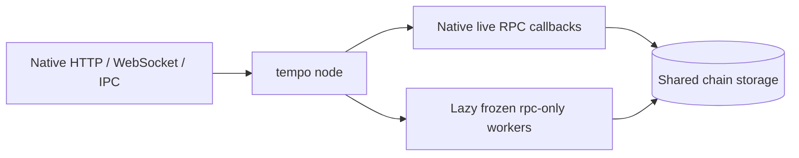

# Tempo metabinary

`tempo node` remains the normal entrypoint, with its existing arguments and defaults. The live
node runs in-process; an execution-independent library decorates its registered RPC callbacks and
starts frozen read-only workers lazily for historical execution. The library has no Tempo execution,
Reth, or database dependencies.

One method policy drives both native callback decoration and standalone routing. Both resolve
block metadata through the live node's header RPCs; native routing uses an internal eth module.



## Release configuration

The release supplies `tempo-eras.json` beside the executable. There is no node `--history` or
`--eras` flag. Each catalog entry binds a chain ID and genesis hash to ordered eras:

```json
{"chains":[{
  "chain_id":"0x1",
  "genesis_hash":"0x1111111111111111111111111111111111111111111111111111111111111111",
  "eras":[
    {"name":"genesis-to-T10","start_timestamp":0,"binary":"eras/tempo-t10"},
    {"name":"T11-live","start_timestamp":2000000000}
  ]
}]}
```

These values are illustrative. Closed eras name frozen executables, resolved relative to the
catalog; the last era uses the running node. The built-in development catalog
(`bin/tempo/eras.json`) is empty. Unmatched chains and custom fork schedules use the native path.

Workers inherit the selected genesis, datadir, custom static-file/RocksDB paths, and resolved SDK
`EthConfig` through private temporary files. Gas, simulation, memory, and tracing settings retain
the node's configured values. Execution concurrency budgets apply per process; public transport
limits remain global. Historical workers are selected by requests, regardless of `--full` or pruning.
Missing historical state fails through the worker's ordinary storage behavior.

## Routing contract

- Stored blocks, receipts, logs, proofs, state queries, and live transaction operations stay native.
- Execution requests resolve blocks or transactions through the live node and choose an era by
  timestamp. Historical forwarding pins tags; explicit hashes and `requireCanonical` are preserved.
  Positional and named parameters are supported. Simulations select their generated child blocks' eras,
  including gap fillers; the base state may belong to an older era.
- Requests crossing eras return `-32004`, including trace filters, multi-block simulations, call
  bundles, and timestamp overrides. Split ranges rather than transferring speculative state
  between processes. Unreviewed execution methods fail closed until their selectors are supported.
- Native transports retain their registries, authentication, CORS, compression, subscriptions,
  batching, and limits. Resolution uses an internal eth module even when eth is disabled publicly.
  Live debug trace subscriptions stay native; historical debug trace subscriptions are rejected.
- Raw-block tracing uses a Tempo codec adapter. The generic standalone harness cannot decode it.
  Bad-block tracing and `ots_getContractCreator` remain unsupported with era routing because
  choosing an executor requires native cache access or a whole-history deployment search.

Workers are coalesced per era and verified by protocol, chain, genesis, read-only mode, and PID.
Shutdown reaps owned children. A failed or missing worker affects historical requests for its era;
live RPC stays available.

## Standalone development harness

`tempo-metabinary` provides process isolation, an HTTP/WebSocket router, and finite canonical-file
import for development. Its transport flags are separate from the ordinary node CLI.

```sh
cargo build --release -p tempo --bin tempo -p tempo-metabinary

# Live execution; stored historical data remains accessible.
tempo-metabinary --manifest /path/to/eras.json serve
# Historical execution and tracing.
tempo-metabinary --manifest /path/to/eras.json serve --history --api eth,net,web3,tempo,token,consensus,debug,trace,rpc
# Sequential canonical-file import through closed eras.
tempo-metabinary --manifest /path/to/eras.json bootstrap
```

Copy the [example manifest](examples/eras.json) and replace its illustrative identity, timestamps,
executable paths, and checkpoints. Binary, datadir, and explicit chain-spec paths are manifest-relative;
paths inside command arguments should be absolute. Only the live era has `node_args`. The wrapper
owns shared storage and private loopback RPC flags. Each era has a distinct `rpc_port`; the live
era's optional `ws_port` enables Ethereum and consensus subscription forwarding. The public listener
defaults to `127.0.0.1:8545`; use `--listen` to change it.

The harness discovers each launched endpoint's actual methods and exposes only allowed namespaces.
jsonrpsee enforces batching and response limits; subscription notifications are also size limited.
A child exit stops serving. Partial startup failures still clean up all owned children. Live-only
serving does not require historical artifacts; bootstrap and `--history` do.

## Bootstrap and frozen artifacts

Each closed era's `bootstrap` supplies an ordinary `import` command and a trusted terminal block
number/hash. Its file ends immediately before the successor's activation. The wrapper forces
`--fail-on-invalid-block`, waits for import, opens a reader, and verifies the canonical checkpoint,
era timestamp, and exact head. Subsequent imports verify the predecessor and first successor;
live startup checks the successor when available. No pipeline checkpoints or handoff markers are
rewritten. An import failure may leave partial progress; use the ordinary Tempo recovery workflow.

Genesis network sync remains native, and the active binary still supports old forks. Bootstrap does
not download files or switch peer-to-peer writers. Removing historical execution branches requires
frozen artifacts, execution-range guards, and a bounded sync interface that also gates consensus
payloads and fork choice. Reth's pipeline `--debug.max-block` alone does not supply that contract.
Historical validator-config reads already use storage without constructing an EVM.

Frozen artifacts need this `rpc-only` discovery protocol and hidden `--rpc-config` interface,
backported where necessary, plus a recorded revision and checksum. They must support their era and
shared storage layout; identity discovery does not establish execution compatibility.

## Validation

`cargo test --locked -p tempo-metabinary` covers routing, era boundaries, parameters, transport
policy, limits, subscriptions, manifests, and subprocess ownership/cleanup. Native tests cover
read-only calls/traces, gas caps, discovery, custom fork schedules, and validator-config storage.
Process smoke tests exercise HTTP/WS/IPC, lazy workers, storage paths, subscriptions, restart,
cleanup, and finite import/archive serving. These fixtures reuse the same native artifact across
eras. Production rollout still requires independent frozen-artifact genesis replay and consensus
restart coverage on a representative chain.
