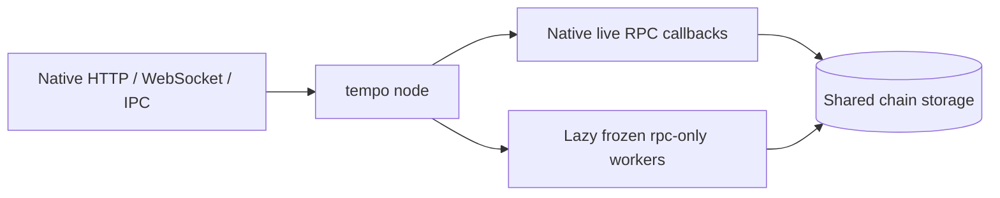

# Tempo metabinary

The normal entrypoint is **`tempo node`**, using its existing arguments and defaults. The active
node runs in the same process. A small execution-independent library decorates its existing RPC
callbacks and starts frozen read-only workers lazily when a request needs historical execution.
It has no Tempo execution, Reth, or database dependencies.



Ordinary commands retain their meaning:

```sh
tempo node --chain mainnet --http
tempo node --chain mainnet --full --http --ws
tempo node --dev
```

There is no new node `--history` or `--eras` flag. The release supplies `tempo-eras.json` beside its
executable, binding activation times and frozen artifact paths to a chain ID **and genesis hash**.
Paths resolve relative to that catalog. The built-in development catalog (`bin/tempo/eras.json`)
is currently empty: no production freeze boundary or historical artifact is invented by this change.
An unmatched chain takes the ordinary native path, including custom chains and development mode.

A release catalog has this shape (values below are illustrative):

```json
{
  "chains": [{
    "chain_id": "0x1",
    "genesis_hash": "0x1111111111111111111111111111111111111111111111111111111111111111",
    "eras": [
      {"name": "genesis-to-T10", "start_timestamp": 0, "binary": "eras/tempo-t10"},
      {"name": "T11-live", "start_timestamp": 2000000000}
    ]
  }]
}
```

The active era always uses the running node; only closed eras name executables. Chain specification,
datadir, custom static-file/RocksDB paths, and pruning come from the existing node configuration.
Private temporary files pass the selected genesis and the SDK's resolved `EthConfig` to frozen workers.
Gas, simulation, memory, and tracing settings therefore retain their configured values. Execution
concurrency budgets apply per process; the existing public transport limits remain global to the node.

Each public transport retains its original method registry, subscriptions, authentication, CORS,
compression, request/response and batch limits. Only registered execution callbacks are decorated.
Stored-data and live callbacks stay native. Block resolution uses an internal eth module even on a
transport that exposes only debug/trace; it never exposes additional methods publicly. Raw-block
tracing uses a small Tempo codec adapter outside the generic wrapper. Historical debug trace
subscriptions are rejected; live debug trace subscriptions remain native. Bad-block tracing and
`ots_getContractCreator` remain unsupported with active era routing: their execution targets require
native cache access or a whole-history deployment search before an executor can be chosen.

Workers are coalesced per era, verified by protocol/chain/genesis/read-only mode/process ID, and
reaped on shutdown. A missing artifact or failed worker affects historical requests for that era;
live RPC remains available. No worker is selected based on `--full`: retained history may cross an
era boundary even on pruned nodes. Missing historical state continues to fail through the native
worker's normal storage behavior.

**Genesis sync remains the normal native sync path.** The active binary still supports old forks.
Automatic writer handoff after removing those branches needs a bounded native sync interface that
also gates consensus payloads and fork-choice targets. Reth's pipeline `--debug.max-block` alone
cannot provide that contract. The finite import helper below remains available for development;
it is not silently substituted for ordinary node sync.

## Standalone development harness

The separate `tempo-metabinary` executable is retained for fixture development, process isolation,
and finite canonical-block-file import. It starts a live child and its own HTTP/WebSocket router;
its transport flags are not the ordinary node CLI. Prefer `tempo node` for normal operation.

### Running the harness

Build the two executables:

```sh
cargo build --release -p tempo --bin tempo -p tempo-metabinary
```

Copy the [example manifest](examples/eras.json) and replace its illustrative chain identity,
activation timestamp, executable paths, and canonical checkpoints. Paths for `binary`, `datadir`,
and explicit chain specification files resolve relative to the manifest. Paths inside ordinary
command arguments should be absolute. `node_args` belongs only to the live era and contains its
ordinary node options, such as consensus or follow configuration. The wrapper supplies chain,
datadir, and private loopback RPC flags.

```sh
# Live execution only; historical state queries remain available from the live node.
tempo-metabinary --manifest /path/to/eras.json serve

# Archive execution RPCs, including historical calls and traces.
tempo-metabinary --manifest /path/to/eras.json serve --history --api eth,net,web3,tempo,token,consensus,debug,trace,rpc

# Replay canonical block files sequentially from genesis, without state snapshots.
tempo-metabinary --manifest /path/to/eras.json bootstrap
```

The public listener defaults to `127.0.0.1:8545`. Set `--listen` to change it. The optional `ws_port`
on the live era enables public Ethereum and consensus subscription forwarding to the private live WebSocket server.
Each era has a distinct private `rpc_port`; historical eras have no WebSocket server.

Before exposing RPC, the launcher verifies protocol version, process ID, chain ID, genesis hash,
read-only mode, and the actual registered methods of every launched endpoint. A worker exit stops
the service. Shutdown signals and reaps all owned children, including after partial startup failure.
Live nodes do not need historical executables installed unless running bootstrap or `--history`.

## Routing contract

- Stored blocks, receipts, logs, proofs, raw state queries, and live transaction operations use the
  live process. Historical data does not require a historical EVM.
- Execution requests resolve their block or transaction through the live process, then select the
  owning era by timestamp. Block tags are pinned before forwarding; explicit hashes and
  `requireCanonical` are preserved. Positional and named parameters are supported.
- Calls, gas estimation, access lists, transaction/block tracing, witnesses, and prefix replay use
  the execution block's era. `eth_simulateV1` and `tempo_simulateV1` use their generated child blocks'
  eras, including gap fillers. The base state may belong to an older era.
- Requests spanning eras are rejected with `-32004`. This includes trace filters, multi-block
  simulations, call bundles, and timestamp overrides that would escape the selected era. Split a
  trace range into separate requests. The wrapper does not transfer speculative state between
  processes.
- RPC methods are registered through jsonrpsee after the public namespace allowlist. Its standard
  batching, request/response limits, and notifications remain in effect. Subscription notifications
  are also size limited. `rpc_modules` describes the public registry.
- Unreviewed execution methods fail with `-32004` instead of silently executing with the live EVM.
  Add their selector semantics to `routing.rs` when introducing an execution RPC. Raw-block tracing
  in the standalone harness, bad-block tracing, `ots_getContractCreator`, and historical debug
  subscriptions are currently unsupported. Use block hash/number tracing for blocks in the database;
  the generic wrapper deliberately has no Tempo block codec.

## Bootstrap and freezing an era

A closed era's optional `bootstrap` contains an ordinary `import` command and a trusted canonical
terminal block number/hash. Its file must contain the blocks to execute for that era, ending at the
last block before the successor's activation. The wrapper forces `--fail-on-invalid-block`, waits
for the writer to exit, opens a reader, and verifies the canonical checkpoint, era timestamp, and
exact database head before advancing. It never rewrites pipeline checkpoints or creates a handoff
database marker. On successive phases it verifies that the first successor header belongs to the
successor era; live startup repeats this check as soon as that header is available.

Checkpoints are operator-supplied trust anchors, not independently discovered activation boundaries.
Bootstrap does not download block files or switch a running peer-to-peer sync process between eras.
Reth's `--debug.max-block` does not bound every Tempo consensus/follow path, so the wrapper does not
use it as a network bootstrap contract. An import failure can leave partial progress in the normal
database; recovery follows the ordinary Tempo import workflow.

To freeze an era, retain a tested executable with this `rpc-only` command and discovery protocol,
plus its build revision and checksum. The interface includes discovery and the hidden
`rpc-only --rpc-config` option for the parent node's serialized execution settings. Existing releases
lacking this interface need it backported; they cannot be used directly. Point the closed era at
that artifact, then develop the active binary independently. Frozen workers must support that era's execution and the
shared storage layout; the identity handshake alone does not prove execution compatibility.

This change integrates the wrapper into the native CLI and establishes the reusable worker
interface. It does **not** delete historical hardfork branches from the active EVM or introduce a compile-time supported-fork floor. That cleanup
must be paired with freezing the corresponding executable and execution-range guards, including the
pool's prospective child environment and override paths. Historical validator-config storage reads
have been decoupled from EVM construction so consensus can inspect old state after that cleanup.

## Validation

`cargo test --locked -p tempo-metabinary` covers era routing, three-era operation, live-only mode,
named parameters, simulation and override boundaries, trace-filter defaults, unsupported raw-block policy,
namespace policy, batching, response limits, subscriptions, manifests, and subprocess cleanup.
Native tests cover real read-only database calls/traces, configured gas caps, identity discovery,
custom fork-schedule isolation, and historical validator-config reads. Process smoke tests verify
native `tempo node` routing through HTTP/WS/IPC, unchanged method exposure, lazy workers, custom storage paths, WebSocket events, restart, and child cleanup. The
standalone harness additionally covers finite genesis import followed by archive serving. Those
fixtures use the same native artifact for both eras. A production rollout still needs independent frozen-artifact genesis replay and consensus restart coverage on a representative chain.
