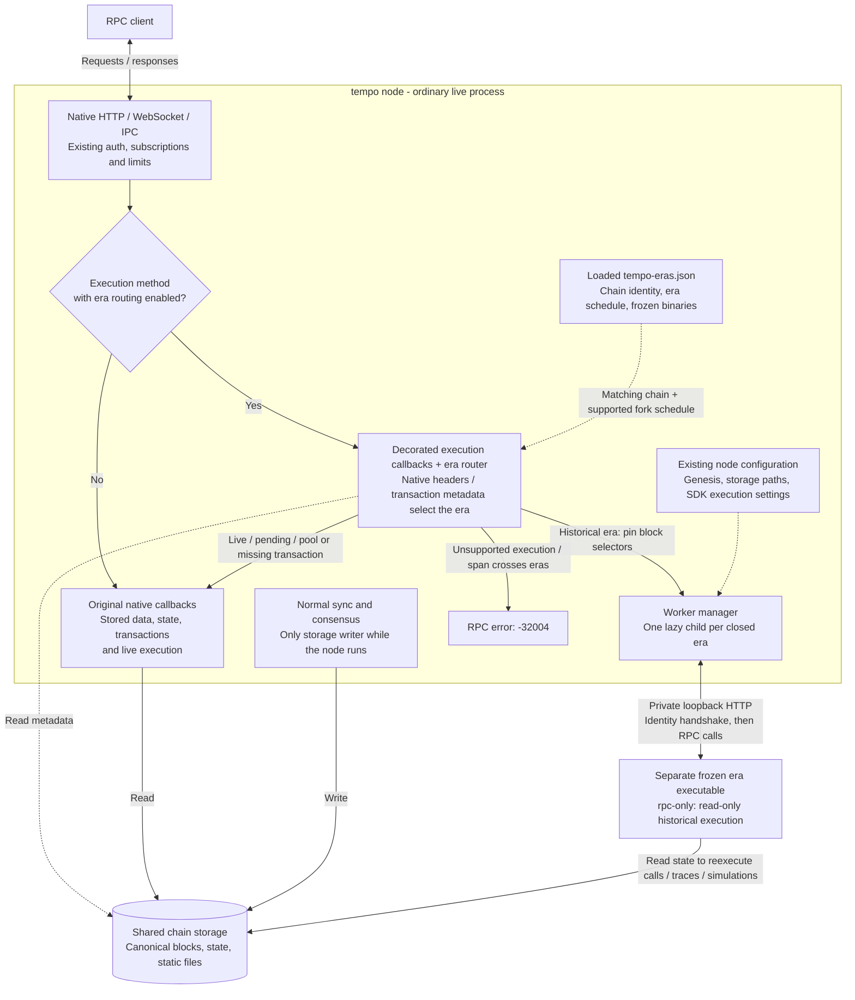
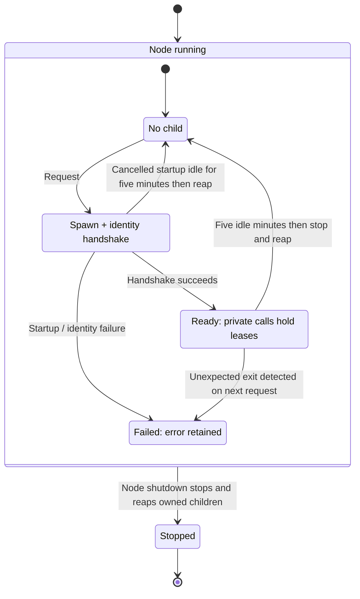
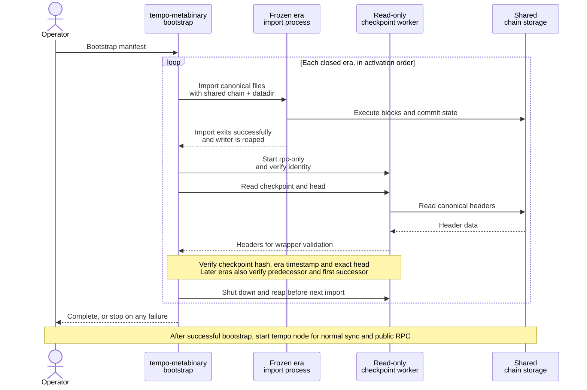

# Tempo metabinary

`tempo node` remains the normal entrypoint, with its existing arguments and defaults. The live
node runs in-process; an execution-independent library decorates its registered RPC callbacks and
starts frozen read-only workers lazily for historical execution. The library has no Tempo execution,
Reth, or database dependencies.



## Release configuration

The release supplies `tempo-eras.json` beside the executable. There is no node `--history` or
`--eras` flag. Each catalog entry binds a chain ID and genesis hash to ordered eras:

```json
{"chains":[{
  "chain_id":"0x1",
  "genesis_hash":"0x1111111111111111111111111111111111111111111111111111111111111111",
  "eras":[
    {"name":"genesis-to-T10","start_timestamp":0,"binary":"eras/tempo-t10"},
    {"name":"T11-live","start_timestamp":2000000000}
  ]
}]}
```

These values are illustrative. Closed eras name frozen executables, resolved relative to the
catalog; the last era uses the running node. The built-in development catalog
(`bin/tempo/eras.json`) is empty. Unmatched chains and custom fork schedules use the native path.

Workers inherit the selected genesis, datadir, custom static-file/RocksDB paths, and resolved SDK
`EthConfig` through private temporary files. Gas, simulation, memory, and tracing settings retain
the node's configured values. Execution concurrency budgets apply per process; public transport
limits remain global. Historical workers are selected by requests, regardless of `--full` or pruning.
Missing historical state fails through the worker's ordinary storage behavior.

## Routing contract

- Stored blocks, receipts, logs, proofs, state queries, and live transaction operations stay native.
- Execution requests read native headers and transaction metadata to choose an era by timestamp.
  Historical forwarding pins tags other than `pending`; explicit hashes and `requireCanonical` are
  preserved. Pool and missing transactions stay native. Positional and named parameters are supported.
  Simulations select their generated child blocks' eras,
  including gap fillers; the base state may belong to an older era.
- Requests crossing eras return `-32004`, including trace filters, multi-block simulations, call
  bundles, and timestamp overrides. Split ranges rather than transferring speculative state
  between processes. Unreviewed execution methods fail closed until their selectors are supported.
- Native transports retain their registries, authentication, CORS, compression, subscriptions,
  batching, and limits. Metadata resolution works even when eth is disabled publicly.
  Live debug trace subscriptions stay native; historical debug trace subscriptions are rejected.
- Raw-block tracing decodes only the Tempo header to select its execution era; the selected
  executor validates the body with its own transaction codec.
  Bad-block tracing and `ots_getContractCreator` remain unsupported with era routing:
  bad-block cache resolution and whole-history deployment searches are not implemented.

Workers are coalesced per era and verified by protocol, chain, genesis, read-only mode, and PID.
Workers shut down after five idle minutes, checked every 30 seconds, and restart on demand.
Active private RPC calls retain their worker, including when the public caller cancels.
Shutdown reaps owned children. A failed or missing worker affects historical requests for its era;
live RPC stays available.

The lifecycle below applies independently to each closed era. Concurrent startup requests share
one handshake; ready workers can serve concurrent calls. Failed workers retain their error until
the node restarts. A cancelled startup keeps its child so the next request can resume the handshake.



## Canonical-file bootstrap

`tempo-metabinary` sequentially imports finite canonical block files through frozen eras. Run the
ordinary `tempo node` entrypoint afterward for public RPC and live execution.

```sh
cargo build --release -p tempo -p tempo-metabinary --bin tempo --bin tempo-metabinary

tempo-metabinary --manifest /path/to/bootstrap.json bootstrap
```

Copy the [example manifest](examples/eras.json) and replace its illustrative identity, timestamps,
executable paths, and checkpoints. Binary, datadir, and explicit chain-spec paths are manifest-relative;
paths inside import arguments should be absolute. Import commands share storage and run one at a
time. Checkpoint inspection uses the same private read-only worker manager as the ordinary node,
with an automatically selected loopback port. Partial startup failures clean up owned children.

## Bootstrap and frozen artifacts

Each closed era's `bootstrap` supplies an ordinary `import` command and a trusted terminal block
number/hash. Its file ends immediately before the successor's activation. The wrapper forces
`--fail-on-invalid-block`, waits for import, opens a reader, and verifies the canonical checkpoint,
era timestamp, and exact head. Subsequent imports verify the predecessor and first successor.
No pipeline checkpoints or handoff markers are rewritten. An import failure may leave partial
progress; use the ordinary Tempo recovery workflow.

Bootstrap runs before the ordinary node. The operator's bootstrap manifest supplies import files
and trusted checkpoints; the release catalog above supplies the runtime RPC routing schedule.



Genesis network sync remains native, and the active binary still supports old forks. Bootstrap does
not download files or switch peer-to-peer writers. Removing historical execution branches requires
frozen artifacts, execution-range guards, and a bounded sync interface that also gates consensus
payloads and fork choice. Reth's pipeline `--debug.max-block` alone does not supply that contract.
Historical validator-config reads already use storage without constructing an EVM.

Frozen artifacts need this `rpc-only` discovery protocol and hidden `--rpc-config` interface,
backported where necessary, plus a recorded revision and checksum. They must support their era and
shared storage layout; identity discovery does not establish execution compatibility.

## Validation

`cargo test --locked -p tempo-metabinary` covers routing, era boundaries, parameters, manifests,
checkpoint validation, and subprocess ownership/cleanup. Native tests cover
read-only calls/traces, gas caps, discovery, custom fork schedules, and validator-config storage.
Process smoke tests exercise HTTP/WS/IPC, lazy workers, storage paths, subscriptions, restart,
cleanup, and finite import/checkpoint inspection. These fixtures reuse the same native artifact across
eras. Production rollout still requires independent frozen-artifact genesis replay and consensus
restart coverage on a representative chain.
