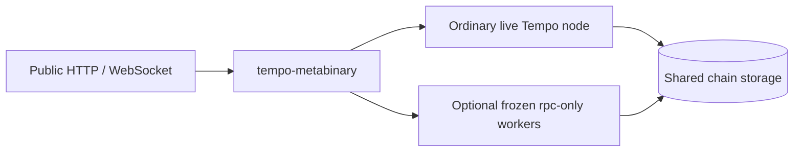

# Tempo metabinary

`tempo-metabinary` is a separate executable that supervises ordinary Tempo binaries and routes RPC
calls. It has no dependencies on Tempo execution, Reth, or database types. An era manifest is the
only place that knows which executable owns which activation interval.



The live process owns networking, consensus, transaction submission, and all database writes.
Historical workers run `tempo rpc-only`: existing storage opened read-only, ordinary eth/debug/trace
implementations, no consensus, networking, or transaction pool. Database format compatibility is
assumed. Archive operators must retain the historical state needed for reexecution.

## Running

Build the two executables:

```sh
cargo build --release -p tempo --bin tempo -p tempo-metabinary
```

Copy the [example manifest](examples/eras.json) and replace its illustrative chain identity,
activation timestamp, executable paths, and canonical checkpoints. Paths for `binary`, `datadir`,
and explicit chain specification files resolve relative to the manifest. Paths inside ordinary
command arguments should be absolute. `node_args` belongs only to the live era and contains its
ordinary node options, such as consensus or follow configuration. The wrapper supplies chain,
datadir, and private loopback RPC flags.

```sh
# Live execution only; historical state queries remain available from the live node.
tempo-metabinary --manifest /path/to/eras.json serve

# Archive execution RPCs, including historical calls and traces.
tempo-metabinary --manifest /path/to/eras.json serve --history --api eth,net,web3,tempo,token,consensus,debug,trace,rpc

# Replay canonical block files sequentially from genesis, without state snapshots.
tempo-metabinary --manifest /path/to/eras.json bootstrap
```

The public listener defaults to `127.0.0.1:8545`. Set `--listen` to change it. The optional `ws_port`
on the live era enables public Ethereum and consensus subscription forwarding to the private live WebSocket server.
Each era has a distinct private `rpc_port`; historical eras have no WebSocket server.

Before exposing RPC, the launcher verifies protocol version, process ID, chain ID, genesis hash,
read-only mode, and the actual registered methods of every launched endpoint. A worker exit stops
the service. Shutdown signals and reaps all owned children, including after partial startup failure.
Live nodes do not need historical executables installed unless running bootstrap or `--history`.

## Routing contract

- Stored blocks, receipts, logs, proofs, raw state queries, and live transaction operations use the
  live process. Historical data does not require a historical EVM.
- Execution requests resolve their block or transaction through the live process, then select the
  owning era by timestamp. Block tags are pinned before forwarding; explicit hashes and
  `requireCanonical` are preserved. Positional and named parameters are supported.
- Calls, gas estimation, access lists, transaction/block tracing, witnesses, and prefix replay use
  the execution block's era. `eth_simulateV1` and `tempo_simulateV1` use their generated child blocks'
  eras, including gap fillers. The base state may belong to an older era.
- Requests spanning eras are rejected with `-32004`. This includes trace filters, multi-block
  simulations, call bundles, and timestamp overrides that would escape the selected era. Split a
  trace range into separate requests. The wrapper does not transfer speculative state between
  processes.
- RPC methods are registered through jsonrpsee after the public namespace allowlist. Its standard
  batching, request/response limits, and notifications remain in effect. Subscription notifications
  are also size limited. `rpc_modules` describes the public registry.
- Unreviewed execution methods fail with `-32004` instead of silently executing with the live EVM.
  Add their selector semantics to `routing.rs` when introducing an execution RPC. Raw-block tracing, bad-block tracing,
  and historical debug subscriptions are currently unsupported. Use block hash/number tracing for
  blocks in the database; the wrapper deliberately has no Tempo block codec.

## Bootstrap and freezing an era

A closed era's optional `bootstrap` contains an ordinary `import` command and a trusted canonical
terminal block number/hash. Its file must contain the blocks to execute for that era, ending at the
last block before the successor's activation. The wrapper forces `--fail-on-invalid-block`, waits
for the writer to exit, opens a reader, and verifies the canonical checkpoint, era timestamp, and
exact database head before advancing. It never rewrites pipeline checkpoints or creates a handoff
database marker. On successive phases it verifies that the first successor header belongs to the
successor era; live startup repeats this check as soon as that header is available.

Checkpoints are operator-supplied trust anchors, not independently discovered activation boundaries.
Bootstrap does not download block files or switch a running peer-to-peer sync process between eras.
Reth's `--debug.max-block` does not bound every Tempo consensus/follow path, so the wrapper does not
use it as a network bootstrap contract. An import failure can leave partial progress in the normal
database; recovery follows the ordinary Tempo import workflow.

To freeze an era, retain a tested executable with this `rpc-only` command and discovery protocol,
plus its build revision and checksum. Existing releases lacking these commands need the small worker
interface backported; they cannot be used directly. Point the closed era at that artifact, then
develop the active binary independently. Frozen workers must support that era's execution and the
shared storage layout; the identity handshake alone does not prove execution compatibility.

This change establishes the wrapper and reusable worker interface. It does **not** delete historical
hardfork branches from the active EVM or introduce a compile-time supported-fork floor. That cleanup
must be paired with freezing the corresponding executable and execution-range guards, including the
pool's prospective child environment and override paths. Historical validator-config storage reads
have been decoupled from EVM construction so consensus can inspect old state after that cleanup.

## Validation

`cargo test --locked -p tempo-metabinary` covers era routing, three-era operation, live-only mode,
named parameters, simulation and override boundaries, trace-filter defaults, unsupported raw-block policy,
namespace policy, batching, response limits, subscriptions, manifests, and subprocess cleanup.
Native tests cover real read-only database calls/traces, identity discovery, and historical
validator-config reads. A process smoke test verifies concurrent writer/reader operation, actual
historical routing, WebSocket events, restart, child cleanup, and genesis import followed by archive
serving. That fixture uses the same native artifact for both eras. A production rollout still needs
independent frozen-artifact genesis replay and consensus restart coverage on a representative chain.
