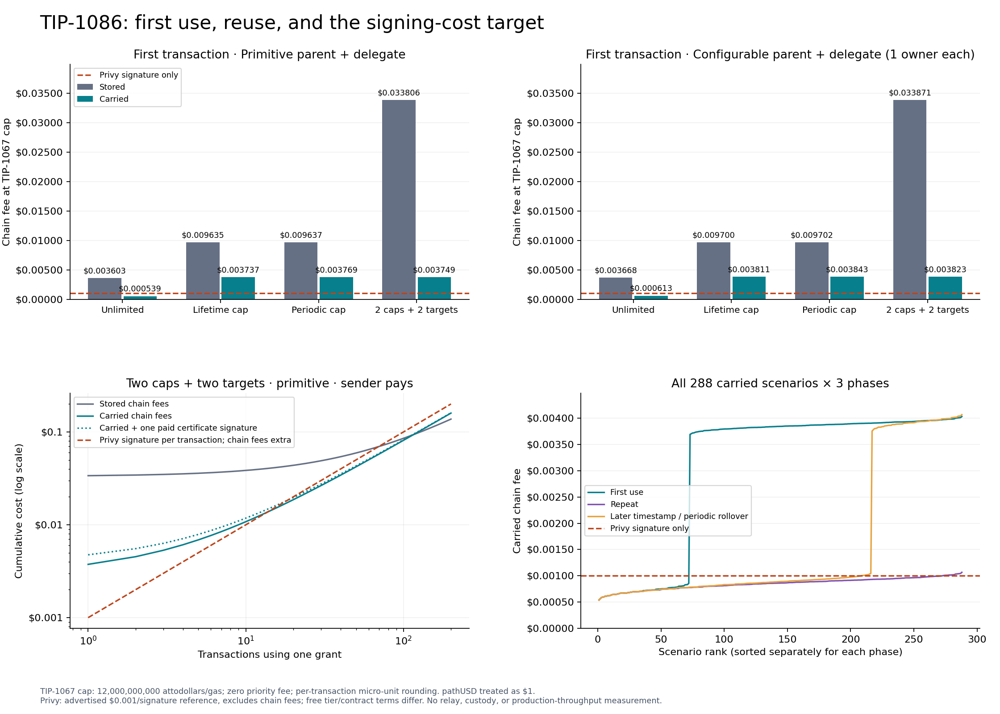
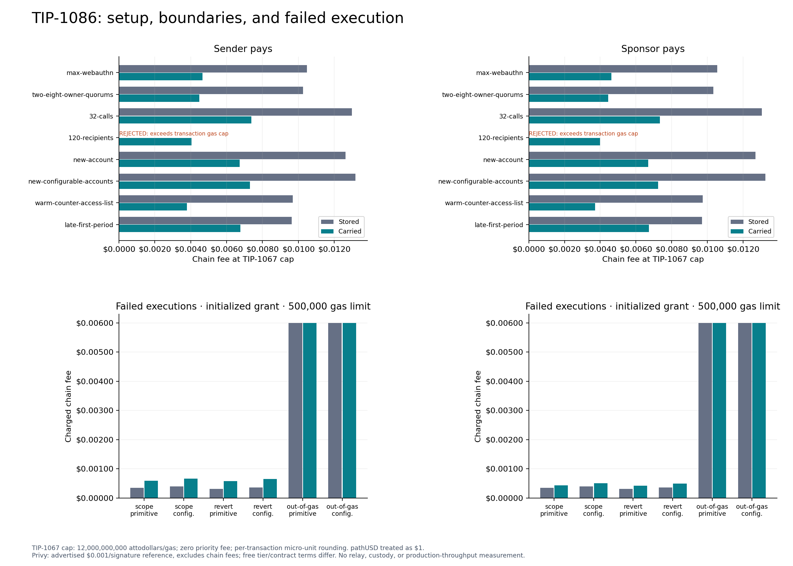

# TIP-1086 cost decisions

Generated by `uv run scripts/plot-tip-1086.py` from the committed receipt CSVs. This is fixed-gas repricing of the draft, not a new execution at the cap or a throughput benchmark.

## Fee basis

Selected model: **TIP-1067 cap, 12,000,000,000 attodollars/gas**, zero priority fee, pathUSD treated as $1. [TIP-1067](../../tips/tip-1067.md) and [the protocol constants](../../crates/hardfork/src/constants.rs) set the basefee floor to 600,000,000 and cap to 12,000,000,000 attodollars/gas. The previous fixture model used the floor: the cap is 20× higher before token rounding. This models the protocol cap, not the current live block basefee or an all-in fee ceiling; priority fees are extra.

Every modeled receipt uses `ceil(gas × price / 10^12) / 10^6` pathUSD. Gas, transaction outcome, budgets, and state paths are held fixed; the original receipt CSVs retain their measured fixture gas. [All 1,784 rows repriced at floor and cap](tip-1086-repriced.csv) include failures and leave the two rejected setups unpriced. Use `--base-fee floor` to regenerate the earlier pricing basis in a separate `--output-dir`.

[Two-page chart PDF](tip-1086-plots.pdf) · [All 288 scenario comparisons](tip-1086-comparisons.csv) · [Receipt methodology](tip-1086.md)

## Signing-cost target

[Privy pricing](https://www.privy.io/pricing), checked 2026-09-11, advertises enterprise pricing as low as $0.001/signature. Developer plans include 50,000 monthly signatures; the listed signature overage is $0.01, with other plan/base charges. The plotted $0.001 is a paid reference price, not a universal minimum or a quote for a particular customer.

**552/864 carried main-matrix receipts and 0/16 carried boundary receipts** have chain fees strictly below $0.001 at TIP-1067 cap. The largest is **614,890 gas / 0.007379 pathUSD**. Invalid transactions are not zero-cost alternatives.

The strict sub-$0.001 target permits at most **83,250 gas** after micro-unit rounding at the modeled price. The representative limited first use needs **229,147 gas (73.4%)** removed to meet it. At the cap, a 250,000-gas new storage word alone costs $0.003; optimizing certificate verification alone cannot bring that initialization below $0.001. Unlimited grants avoid that counter but have a different policy.

These are full chain fees compared with a signature-service fee alone. Privy-backed transactions also pay chain fees; carried grants still need a signing/retention system. Relay, custody, key management, free allowances, and contract pricing are not measured. This is not proof of lower total service cost or equivalent service guarantees.

If Privy signs the certificate once, add that issuance charge upfront. For a primitive issuer and one $0.001 issuance signature, the representative carried first use totals $0.004749; two uses total $0.005532, versus $0.002 for two paid vendor signatures before their chain fees. A quorum can require multiple paid issuance signatures. These examples assume subsequent delegate signatures incur no vendor fee; using a paid service for every delegate signature retains its per-transaction charge.

Under the representative identical-repeat model, cumulative carried chain fees become strictly lower than $0.001 per vendor signature from use **14**, or use **19** including one paid certificate-issuance signature. These thresholds exclude vendor chain fees and all relay charges.

## Choose the mode before issuing the grant

First use is cheaper with carried mode in every paired main-matrix scenario. For repeated non-periodic use, upfront stored registration can amortize. The CSV reports exact crossover counts for gas and separately for per-transaction rounded fees; they need not be equal.

For primitive sender-paid two-cap/two-target grants, the gas crossover is use **116**, while the rounded-fee crossover is use **116** at TIP-1067 cap.

| Policy | Fee payer | Carried first (pathUSD) | Carried repeat (pathUSD) | Stored cheaper from use (gas / fee) |
|---|---|---:|---:|---:|
| Unlimited | Sender | 0.000539 | 0.000539 | 32 / 32 |
| Lifetime cap | Sender | 0.003737 | 0.000771 | 21 / 21 |
| Periodic cap | Sender | 0.003769 | 0.000803 | Window-dependent |
| 2 caps + 2 targets | Sender | 0.003749 | 0.000783 | 116 / 116 |
| Unlimited | Sponsor | 0.000595 | 0.000595 | 33 / 32 |
| Lifetime cap | Sponsor | 0.003692 | 0.000700 | 68 / 68 |
| Periodic cap | Sponsor | 0.003720 | 0.000728 | Window-dependent |
| 2 caps + 2 targets | Sponsor | 0.003704 | 0.000713 | 581 / 581 |

Mode selection is a planning comparison, not an automatic migration strategy. Switching an existing carried key to stored mode invalidates its certificates and creates a separate budget. Keep the required policy intact; removing limits or quorum owners is not a like-for-like optimization.

Sponsorship changes both who pays and the budget-accounting path. In the scoped primitive fixture it changes carried repeat gas from 65,197 to 59,343, but a sponsor still pays that fee and may charge separately. First use should be compared using the same fee payer and account setup.

The measured 32-call carried batch uses 614,890 gas total (19,215.3 gas per transfer on average). At the modeled price that is $0.007379 per batch, or $0.000231 per transfer. That amortizes one certificate, signature, and initial counter over a batch; independent transactions have different atomicity and latency, and batch-size scaling has not been measured here. A vendor can also sign one batch: per-transfer amortization is not a like-for-like advantage over one vendor signature per batch.

Do not extrapolate periodic repeats through rollover. The signed anchor and the first nonzero window write change the result; stored and carried window semantics also differ. An access list is not a saving in the measured case. The 120-recipient stored setup exceeds the gas cap and is shown as rejected, not as free.

## Setup and failure coverage

The first page shows representative paired costs and all 864 carried main-matrix receipts. The second page plots all 32 boundary rows and 24 failed receipts. The comparison CSV preserves all 1,728 main-matrix gas values across every curve, configurable-role combination, policy, phase and fee payer.

## Limits and further optimization

The existing implementation's major saving is avoiding immutable policy writes, while retaining required spending counters. This report changes no consensus gas constants. Further CPU optimizations need a carried-grant workload in the end-to-end benchmark generator; its current keychain scenario does not exercise this wire variant. Production hardware calibration and full-node/relay measurements remain outstanding. The debug `execution_us` column is deliberately excluded from all plots and decisions.
