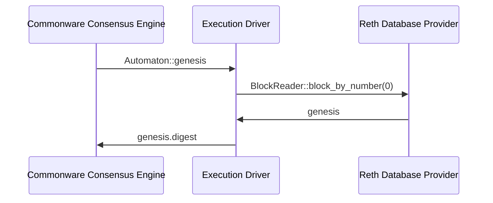
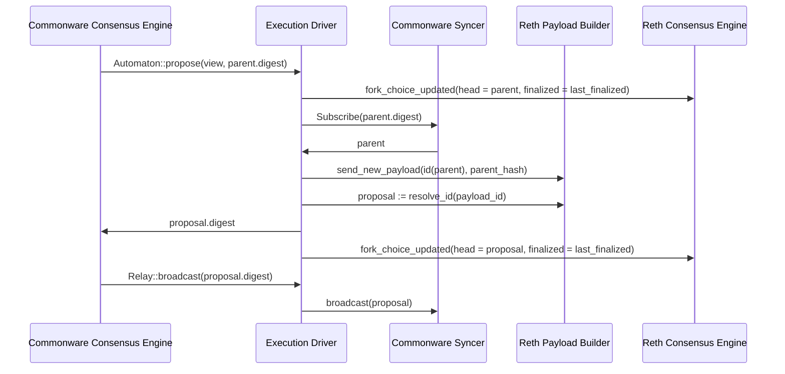
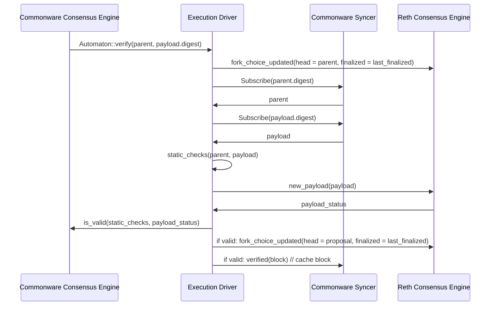
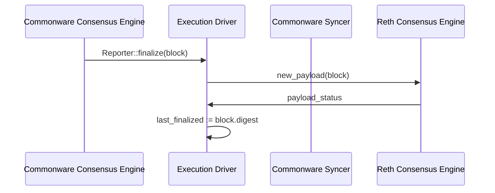

# Commonware-Reth integration

This document described the integration of reth with the commonware
threshold-simplex consensus engine. The goal is to give a relatively low level
overview how data flows from the consensus layer to the execution layer and
back in a single node. For an overview of commonware's threshold simplex engine
and its configuration refer to the [`commonware_consensus::threshold_simplex`]
documentation.

[`commonware_consensus::threshold_simplex`]: https://docs.rs/commonware-consensus/0.0.61/commonware_consensus/threshold_simplex/index.html

## Data flow: block production and state transition

The commonware simplex threshold consensus engine proposes, validates, and
executes new state transitions via 3 interfaces:

+ [`Automaton`], to report the genesis digest, propose and validate blocks;
+ [`Relay`], to broadcast proposed blocks to the network;
+ [`Reporter`], to drive the state transition by hooking into the consensus
steps.

In tempo-commonware, [`ExecutionDriver`] and its `Mailbox` provide all 3 of
these interfaces.

[`Automaton`]: https://docs.rs/commonware-consensus/0.0.61/commonware_consensus/trait.Automaton.html
[`Relay`]: https://docs.rs/commonware-consensus/0.0.61/commonware_consensus/trait.Relay.html
[`Reporter`]: https://docs.rs/commonware-consensus/0.0.61/commonware_consensus/trait.Reporter.html
[`ExecutionDriver`]: ../crates/commonware-node/src/consensus/execution_driver.rs

### The execution driver

The [`ExecutionDriver`] allows the consensus engine to drive block production.
It wraps the handle to a reth execution node and calls the engine API methods
`new_payload` (to validate a block), and `fork_choice_updated` (to both trigger
the building of new payloads and to advance the chain).

### The syncer / marshaller

Block ingress from the consensus layer into the reth execution layer happens
via one of three methods:

1. on `Automaton::verify`,
2. on `Reporter::finalize`,
3. on reth execution layer p2p (which we will not go into here).

Both `Automaton::verify` and `Reporter::finalize` rely on a `syncer` actor
which is implemented through the [`commonware marshal`]. `Automaton::verify`
tries reading a proposed block from the syncer through the `subscribe` method.
`Reporter::finalize` on the other hand is performed by the syncer and forwards
a finalized block to the execution driver so that it can advance the state
machine.

[`commonware marshal`]: https://docs.rs/commonware-consensus/0.0.61/commonware_consensus/marshal/index.html

### Genesis

The genesis block is read straight from the reth node and its digest
disseminated in the network.

### Propose

Proposing new blocks is done directly via reth's payload builder, not through
the consensus engine. The execution driver derives the payload ID from the
parent digest. This way, if payload building takes too long and the consensus
engine cancels the proposal task, once consensus cycles back to the original
node it can pick up the payload that was kicked off before. This is assuming
that all other consensus nodes would equally struggle building a block in time.

`last_finalized` mentioned here refers to `last_finalized` set during the
*Finalize* step.

### Verify

`last_finalized` mentioned here refers to `last_finalized` set during the
*Finalize* step.

### Finalize

## Implementation details

### State Storage

The tempo commonware node implementation does not handle any state outside of
the default state storage provided by commonware and reth.

### Consensus blocks and execution blocks

The atomic unit of communication in commonware based networks are blocks and
their digests. Blocks must implement the interface [`EncodeSize`], [`Read`],
[`Write`], [`Block`], [`Committable`], and [`Digestible`]. Digests require
[`Digest`] (and a number of traits that follow from there.

To keep things simple and to keep a 1-to-1 relationship of block digests at
the consensus level and block hashes at the execution level, the
tempo-commonware [consensus `Block`] is a refinement type of a reth
`SealedBlock`, while the [consensus `Digest`] is a refinement type of an
alloy-primitives `B256`.

["consensus" `Block`]: ../crates/commonware-node/src/consensus/block.rs
["consensus" `Digest`]: ../crates/commonware-node-cryptography/src/lib.rs
[`EncodeSize`]: https://docs.rs/commonware-codec/0.0.61/commonware_codec/codec/trait.EncodeSize.html
[`Read`]: https://docs.rs/commonware-codec/0.0.61/commonware_codec/codec/trait.Read.html
[`Write`]: https://docs.rs/commonware-codec/0.0.61/commonware_codec/codec/trait.Write.html
[`Block`]: https://docs.rs/commonware-consensus/0.0.61/commonware_consensus/trait.Block.html
[`Committable`]: https://docs.rs/commonware-cryptography/0.0.61/commonware_cryptography/trait.Committable.html
[`Digest`]: https://docs.rs/commonware-cryptography/0.0.61/commonware_cryptography/trait.Digest.html
[`Digestible`]: https://docs.rs/commonware-cryptography/0.0.61/commonware_cryptography/trait.Digestible.html

### Async runtimes

Both commonware and reth expect to initialize a tokio runtime and execute on top
of it. Luckily, reth does not bind as tightly to the runtime and so reth
commands can be launched from within the context of a commonware
[`Runner::start`] executed closure. The [`reth_glue`] module effectively
re-implements the various reth `CliRunner::run_*` methods.

[`Runner::start`]: https://docs.rs/commonware-runtime/0.0.61/commonware_runtime/trait.Runner.html
[`reth_glue`]: ../crates/commonware-node/src/reth_glue.rs
