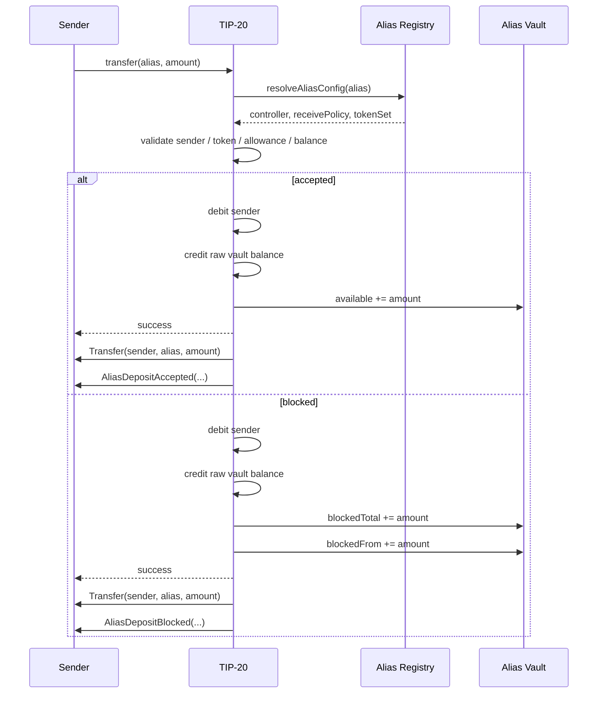

# Receive Alias Escrow TIP Sketch

## Abstract

This document sketches a possible Tempo Improvement Proposal introducing a reserved namespace of synthetic TIP-20 recipient addresses called **receive aliases**. A receive alias can be handed out like a normal deposit address and can have receive-side authorization rules, but it is not controlled by a private key and does not hold raw TIP-20 balance directly.

Instead, transfers to a receive alias settle into a protocol-managed **Alias Vault**. The vault keeps per-alias ledgers for accepted and blocked funds. Transfers to aliases do not revert because of recipient-side policy failure. From the sender’s point of view, sending to an alias behaves like a normal TIP-20 transfer: the transfer call succeeds, the sender is debited, and a standard `Transfer(from, alias, amount)` event is emitted.

## Motivation

Tempo wants address-level inbound controls without the sharp edges of general address-level receive-policy reverts.

A direct “all addresses can reject incoming TIP-20 transfers by reverting” model creates serious composability risks:
- a recipient can grief senders and contracts by changing policy after setup
- escrows, batch payouts, bridge exits, and session settlement can become uncloseable
- the receiver gains a new ability to create liveness failures for unrelated systems

At the same time, simple forwarding to a real underlying destination address is insufficient:
- once the real destination is discovered, an attacker can dust it directly
- the alias becomes only a soft filter, not a real containment boundary

This design solves both problems by:
1. limiting special behavior to a reserved namespace of synthetic deposit aliases
2. making blocked inbound transfers non-reverting
3. storing actual TIP-20 balances in a protocol vault rather than a public destination address
4. virtualizing sender-facing transfer semantics so the alias still looks like a normal recipient

## Assumptions

1. **Reserved aliases are not ordinary wallets.**
   They are synthetic receive endpoints. They are intended for inbound deposit and settlement workflows, not for ordinary user-originated signing.

2. **Control is registry-based, not key-based.**
   Each alias namespace has a registered controller account or controller contract. The alias itself has no private key.

3. **The Alias Vault is protocol-trusted.**
   The vault is a protocol component or precompile. It is trusted to hold raw TIP-20 balances corresponding to alias liabilities.

4. **Direct user transfers to the vault are disallowed or ignored.**
   If users can directly send TIP-20 to the vault, unattributed dust and accounting ambiguity arise. Implementations should reject direct userland transfers to the vault address.

5. **This design prioritizes sender regularity and liveness over raw storage transparency.**
   In particular, `Transfer` events and `balanceOf(alias)` are virtualized to make alias receipt look like an ordinary send, even though raw balances settle at the vault.

If any of these assumptions are violated, the user-facing model becomes confusing or unsafe.

---

# Specification

## 1. Terminology

- **Alias**: a reserved-format synthetic recipient address.
- **Namespace**: a family of aliases controlled by one controller.
- **Controller**: the real account or contract authorized to manage a namespace and withdraw or classify alias-held funds.
- **Alias Vault**: the protocol component that holds raw TIP-20 balances for aliases.
- **Available balance**: funds that passed alias receive checks and may be withdrawn by the controller.
- **Blocked balance**: funds delivered to an alias but held in review/quarantine because they failed alias receive checks.
- **Virtual TIP-20 balance**: the alias-visible balance returned by `balanceOf(alias)`.

## 2. Design Goals

This design has five goals:

1. sending to an alias should use standard TIP-20 entrypoints
2. the sender should not need a special API
3. recipient-side policy failure should not revert the sender’s transfer
4. no public underlying settlement address should exist that can be dusted directly
5. the alias should remain observable as a meaningful recipient in wallets, explorers, and receipts

## 3. Non-Goals

This design does **not** make aliases into fully general accounts.

In particular, this design does not require:
- alias-originated transactions
- alias-owned private keys
- `permit` support for aliases
- generic `approve` / `transferFrom` behavior initiated by aliases
- arbitrary contract calls “as the alias”

If Tempo later wants aliases to become fully spendable synthetic accounts, that should be a separate TIP.

## 4. Address Layout

Receive aliases use a reserved 20-byte address layout:

```text
[4-byte namespaceId] [10-byte ALIAS_MAGIC] [6-byte userTag]
= 20 bytes total
```

| Field | Bytes | Description |
|---|---:|---|
| `namespaceId` | 4 | Registry-assigned namespace identifier |
| `ALIAS_MAGIC` | 10 | Reserved magic constant identifying the address as an alias |
| `userTag` | 6 | Opaque operator-chosen per-user tag |

### Reserved Namespace Behavior

Any address matching this format is treated as a receive alias by TIP-20 recipient resolution.

If a user happens to control an EOA or contract with such an address, that account may still exist at the EVM layer, but TIP-20 recipient-bearing operations follow alias semantics rather than literal address-credit semantics.

Such addresses SHOULD NOT be used as ordinary accounts.

## 5. Namespace Registration and Control

### 5.1 Namespace Registration

A new precompile or protocol component called the **Alias Registry** maintains namespace metadata.

Each namespace stores:
- controller address
- default receive policy id
- default token set id
- namespace active flag

Optionally, implementations MAY support per-alias overrides:
- alias-specific receive policy id
- alias-specific token set id
- alias-specific enabled/disabled flag

### 5.2 Controller Model

Control of a namespace is held by its registered controller.

The controller may be:
- an EOA
- a multisig
- an upgradeable proxy
- a custody or orchestration contract

The alias itself does not sign and does not need a private key.

### 5.3 Why No Grinding Is Required

Unlike a normal wallet address, an alias is not accessed by proving control of a private key. It is accessed by:
1. registering a namespace
2. deriving alias addresses offchain from `(namespaceId, userTag)`
3. managing the namespace through controller-authorized registry and vault calls

There is therefore no need to grind for a matching private key and no need for “infinite permit” from the alias.

### 5.4 Alias Derivation

Once a controller obtains a `namespaceId`, it may derive any number of aliases offchain:

```text
alias = address(namespaceId || ALIAS_MAGIC || userTag)
```

No onchain call is needed per alias unless the implementation supports and uses per-alias overrides.

## 6. Receive Authorization Model

Each alias has an effective receive configuration:
- `receivePolicyId`
- `tokenSetId`

The effective configuration is resolved as:
1. alias-specific override if present
2. otherwise namespace defaults

A TIP-20 transfer to an alias evaluates:
- whether the sender is allowed by the receive policy
- whether the token is allowed by the token set

If both checks pass, the deposit is **accepted**.
Otherwise, the deposit is **blocked**.

This design intentionally does **not** revert on blocked inbound transfers.

## 7. Alias Vault

### 7.1 Purpose

The Alias Vault is the protocol component that holds the raw TIP-20 balances corresponding to alias-held assets.

The vault exists for two reasons:
1. to avoid reverting blocked transfers
2. to avoid exposing a public underlying destination address that can be dusted directly

### 7.2 Raw vs Virtual Balances

For each TIP-20 token:
- the raw ledger balance is held at `ALIAS_VAULT_ADDRESS`
- aliases do not hold raw balance in the ordinary token `balances[address]` mapping
- aliases instead have virtual balances backed by vault accounting

### 7.3 Vault State

For each token and alias, the vault maintains:

```solidity
available[token][alias] -> uint256
blockedTotal[token][alias] -> uint256
blockedFrom[token][alias][sender] -> uint256
```

### Meaning

- `available[token][alias]`
  - funds accepted by policy and withdrawable by the controller

- `blockedTotal[token][alias]`
  - aggregate blocked funds attributed to the alias

- `blockedFrom[token][alias][sender]`
  - per-sender blocked funds for reclaim or later acceptance

### Required Aggregate Invariant

For every token:

```text
rawTip20Balance(token, ALIAS_VAULT_ADDRESS)
=
sum_over_aliases(available[token][alias] + blockedTotal[token][alias])
```

except for an optional explicitly tracked `surplus[token]` bucket if the implementation allows unattributed direct sends to the vault.

## 8. TIP-20 Sender-Facing Semantics

This is the most important part of the design.

### 8.1 Principle

A send to an alias should look like a normal send to the sender.

That means:
- sender uses ordinary TIP-20 functions
- sender does not need to know that the recipient is synthetic
- sender’s balance decreases if the call succeeds
- standard `Transfer` events name the alias as recipient
- the call does not revert solely because the alias blocked the sender or token

### 8.2 Modified Entry Points

The following TIP-20 operations MUST resolve alias recipients:

- `transfer`
- `transferFrom`
- `transferWithMemo`
- `transferFromWithMemo`

Implementations SHOULD also apply the same recipient resolution to any other TIP-20 path that creates recipient balance, including mint-like or reward-crediting flows.

### 8.3 Send to Alias: Step-by-Step

When a TIP-20 operation is invoked with `to = alias`:

1. The TIP-20 precompile detects that `to` matches the alias format.
2. It resolves the alias configuration from the Alias Registry.
3. It evaluates sender and token authorization.
4. It performs ordinary sender-side validation:
   - paused state
   - sufficient balance
   - sufficient allowance, if applicable
   - keychain / spending-limit checks, if applicable
5. It debits the sender exactly as in a normal transfer.
6. It credits the vault’s raw TIP-20 balance.
7. It updates the alias vault ledger:
   - accepted: `available += amount`
   - blocked: `blockedTotal += amount` and `blockedFrom += amount`
8. It emits the standard TIP-20 `Transfer(from, alias, amount)` event.
9. It emits an alias-specific settlement event:
   - `AliasDepositAccepted(...)` or
   - `AliasDepositBlocked(...)`
10. It returns success.

### 8.4 What the Sender Sees

From the sender’s point of view:
- the same TIP-20 function call is used
- the transaction succeeds
- the sender balance decreases
- the allowance decreases if `transferFrom` was used
- the recipient in the standard transfer event is the alias they entered

That is the intended UX.

### 8.5 What “Looks Like a Normal Send” Does Not Mean

It does **not** guarantee that the deposit is immediately liquid for the controller.

A blocked deposit is still delivered to the alias as a quarantined balance. The sender succeeds; the controller later decides whether to accept or leave reclaimable.

This is an intentional tradeoff: liveness and regular send semantics are preferred over recipient-triggered reverts.

## 9. Virtual TIP-20 Read Semantics

### 9.1 `balanceOf(alias)`

For reserved aliases, `balanceOf(alias)` MUST return the alias’s virtual total balance:

```text
balanceOf(alias) = available[token][alias] + blockedTotal[token][alias]
```

For non-alias addresses, `balanceOf(address)` remains unchanged.

### Rationale

This design intentionally virtualizes `balanceOf(alias)` so that:
- the alias appears funded after a successful transfer
- standard wallets and explorers do not show an obviously wrong zero balance
- standard `Transfer` events remain consistent with visible balances

### 9.2 Additional Read Methods

Because `balanceOf(alias)` returns total balance, the vault interface MUST expose finer-grained views:

- `availableBalance(token, alias)`
- `blockedBalance(token, alias)`
- `blockedBalanceFrom(token, alias, sender)`

These methods are needed because total balance alone does not reveal how much is currently withdrawable.

### 9.3 Allowances and Approvals

Aliases are receive-only in this design.

Therefore:
- aliases do not originate `approve`
- aliases do not use `permit`
- `allowance(alias, spender)` will ordinarily be zero
- ordinary `transferFrom(alias, ...)` is not a meaningful spend path

Assets leave an alias through vault-controlled operations, not alias-signed TIP-20 transfers.

## 10. Withdrawal and Resolution

### 10.1 Available Withdrawal

The controller may withdraw available funds:

```solidity
withdrawAvailable(alias, token, amount, to)
```

Effects:
1. decreases `available[token][alias]`
2. decreases the vault’s raw TIP-20 balance
3. transfers TIP-20 to `to`
4. emits `Transfer(alias, to, amount)`
5. emits `AliasAvailableWithdrawn(...)`

Note that the standard transfer event uses `alias` as the virtual sender, not the vault, so alias history remains coherent.

### 10.2 Accept Blocked

The controller may accept a blocked deposit into available balance:

```solidity
acceptBlocked(alias, token, from, amount)
```

Effects:
1. decreases `blockedFrom[token][alias][from]`
2. decreases `blockedTotal[token][alias]`
3. increases `available[token][alias]`
4. emits `AliasBlockedAccepted(...)`

This is an internal reclassification and does not emit a TIP-20 `Transfer`, because the asset remains attributed to the same alias.

### 10.3 Reclaim Blocked

The original sender may reclaim blocked funds attributed to them:

```solidity
reclaimBlocked(alias, token, amount, to)
```

Effects:
1. decreases `blockedFrom[token][alias][msg.sender]`
2. decreases `blockedTotal[token][alias]`
3. decreases the vault’s raw TIP-20 balance
4. transfers TIP-20 to `to`
5. emits `Transfer(alias, to, amount)`
6. emits `AliasBlockedReclaimed(...)`

This means a blocked delivery can be unwound without requiring controller cooperation.

### 10.4 Why Reclaim Is Per-Sender

Blocked funds are tracked by original sender so that:
- the sender can recover their own blocked funds
- the controller can selectively accept specific deposits later
- provenance is preserved for compliance and reconciliation

## 11. Direct Transfers to the Vault

`ALIAS_VAULT_ADDRESS` is not a user recipient.

Userland TIP-20 transfers directly to the vault MUST be rejected, unless they are internal protocol operations invoked by alias settlement logic.

This prevents the vault from becoming a public dust sink and preserves the invariant that all vault-held TIP-20 balance is attributable to alias liabilities.

## 12. Events

### 12.1 Standard TIP-20 Event

For alias-settled inbound delivery:

```solidity
event Transfer(address indexed from, address indexed to, uint256 amount);
```

MUST be emitted as:
- `Transfer(sender, alias, amount)` on deposit
- `Transfer(alias, to, amount)` on withdrawal or reclaim

This is virtualized event semantics.

### 12.2 Alias-Specific Events

```solidity
event NamespaceRegistered(uint32 indexed namespaceId, address indexed controller);

event NamespaceControllerUpdated(
    uint32 indexed namespaceId,
    address indexed oldController,
    address indexed newController
);

event NamespaceDefaultsUpdated(
    uint32 indexed namespaceId,
    uint64 receivePolicyId,
    uint64 tokenSetId
);

event AliasOverrideUpdated(
    address indexed alias,
    bool enabled,
    uint64 receivePolicyId,
    uint64 tokenSetId
);

event AliasDepositAccepted(
    address indexed token,
    address indexed alias,
    address indexed from,
    uint256 amount
);

event AliasDepositBlocked(
    address indexed token,
    address indexed alias,
    address indexed from,
    uint256 amount
);

event AliasAvailableWithdrawn(
    address indexed token,
    address indexed alias,
    address indexed to,
    uint256 amount
);

event AliasBlockedAccepted(
    address indexed token,
    address indexed alias,
    address indexed from,
    uint256 amount
);

event AliasBlockedReclaimed(
    address indexed token,
    address indexed alias,
    address indexed from,
    address to,
    uint256 amount
);
```

## 13. Interfaces

### 13.1 Alias Registry

```solidity
interface IAliasRegistry {
    error InvalidController();
    error InvalidAlias();
    error NamespaceNotFound();
    error Unauthorized();
    error AliasDisabled();

    function registerNamespace(
        address controller,
        uint64 defaultReceivePolicyId,
        uint64 defaultTokenSetId
    ) external returns (uint32 namespaceId);

    function rotateController(uint32 namespaceId, address newController) external;

    function setNamespaceDefaults(
        uint32 namespaceId,
        uint64 receivePolicyId,
        uint64 tokenSetId
    ) external;

    function setAliasOverride(
        address alias,
        bool enabled,
        uint64 receivePolicyId,
        uint64 tokenSetId
    ) external;

    function getController(uint32 namespaceId) external view returns (address);

    function decodeAlias(address alias)
        external
        pure
        returns (bool isAlias, uint32 namespaceId, bytes6 userTag);

    function resolveAliasConfig(address alias)
        external
        view
        returns (
            bool registered,
            bool enabled,
            address controller,
            uint64 receivePolicyId,
            uint64 tokenSetId
        );
}
```

### 13.2 Alias Vault

```solidity
interface IAliasVault {
    error Unauthorized();
    error InsufficientAvailableBalance();
    error InsufficientBlockedBalance();

    function availableBalance(address token, address alias)
        external
        view
        returns (uint256);

    function blockedBalance(address token, address alias)
        external
        view
        returns (uint256);

    function blockedBalanceFrom(address token, address alias, address sender)
        external
        view
        returns (uint256);

    function withdrawAvailable(
        address alias,
        address token,
        uint256 amount,
        address to
    ) external;

    function acceptBlocked(
        address alias,
        address token,
        address from,
        uint256 amount
    ) external;

    function reclaimBlocked(
        address alias,
        address token,
        uint256 amount,
        address to
    ) external;
}
```

Internal credit methods used by TIP-20 settlement are implementation details and need not be publicly callable.

## 14. Worked Example

### Setup

- A controller registers namespace `0x01020304`
- It sets default receive policy “only approved counterparties”
- It sets default token set “USDC, EURC only”
- It derives alias `A = 0x01020304 || ALIAS_MAGIC || 0xA1B2C3D4E5F6`

### Allowed Deposit

Bob sends 100 USDC to `A`.

Effects:
- Bob’s USDC balance decreases by 100
- vault raw USDC balance increases by 100
- `available[USDC][A] += 100`
- `balanceOf(A)` increases by 100
- `Transfer(Bob, A, 100)` is emitted
- `AliasDepositAccepted(USDC, A, Bob, 100)` is emitted

### Blocked Deposit

Mallory sends 50 of a disallowed token to `A`.

Effects:
- Mallory’s token balance decreases by 50
- vault raw balance for that token increases by 50
- `blockedTotal[token][A] += 50`
- `blockedFrom[token][A][Mallory] += 50`
- `balanceOf(A)` increases by 50
- `Transfer(Mallory, A, 50)` is emitted
- `AliasDepositBlocked(token, A, Mallory, 50)` is emitted

Later:
- either the controller accepts it into available balance
- or Mallory reclaims it

## 15. Sender Flow Diagram



## 16. Invariants

The following invariants must always hold:

1. **Raw vault conservation**
   For every token, vault raw TIP-20 balance equals the sum of alias liabilities.

2. **Alias virtual balance correctness**
   For every alias and token:
   ```text
   balanceOf(alias) = available + blockedTotal
   ```

3. **Blocked split correctness**
   For every alias and token:
   ```text
   blockedTotal[token][alias] = sum_over_senders(blockedFrom[token][alias][sender])
   ```

4. **No raw alias balance**
   Aliases do not hold ordinary raw TIP-20 balance directly.

5. **No recipient-policy revert**
   A recipient policy failure for a registered alias must not revert an otherwise valid send.

6. **Sender-side accounting unchanged**
   Allowance, keychain spending limits, pause checks, and insufficient-balance behavior remain unchanged from the sender’s side.

7. **No unattributed vault growth**
   Userland direct transfers to the vault are disallowed or separately accounted for.

## 17. Security and UX Considerations

### 17.1 Why This Avoids the Main Revert Footgun

Under this design, the receiver cannot brick unrelated contracts by changing policy so that a payout or close operation reverts. A blocked delivery becomes a quarantined delivery, not a failed transaction.

### 17.2 Why This Avoids the Dusting Bypass

There is no public underlying settlement wallet for the attacker to discover and send to directly. The protocol vault is the only raw holder, and direct sends to it are disallowed.

### 17.3 Why `balanceOf(alias)` Is Virtualized

This design deliberately chooses a more intuitive sender and explorer model over strict raw-ledger transparency. Without virtualized `balanceOf(alias)`, transfers to aliases would appear successful in receipts but leave the alias apparently empty.

### 17.4 Why This Is Not an “Infinite Permit” Design

An alias is not granting token approvals. The controller is authorized by the registry as the manager of a synthetic deposit namespace. This is broader and cleaner than permit-based control.

## 18. Open Questions

1. Should `balanceOf(alias)` include blocked funds, or only available funds?
   - This draft says **include blocked funds** so the alias looks funded after any successful send.

2. Should per-alias overrides exist in v1, or only namespace defaults?
   - Namespace-only is simpler.
   - Per-alias overrides are more expressive.

3. Should senders be able to reclaim blocked funds immediately, or only after a timeout?
   - Immediate reclaim is simplest.
   - A timeout may better support compliance review workflows.

4. Which TIP-20 auxiliary recipient-bearing paths should be in scope for v1?
   - At minimum ordinary transfers.
   - Preferably mint- and reward-like recipient credits as well for consistency.
