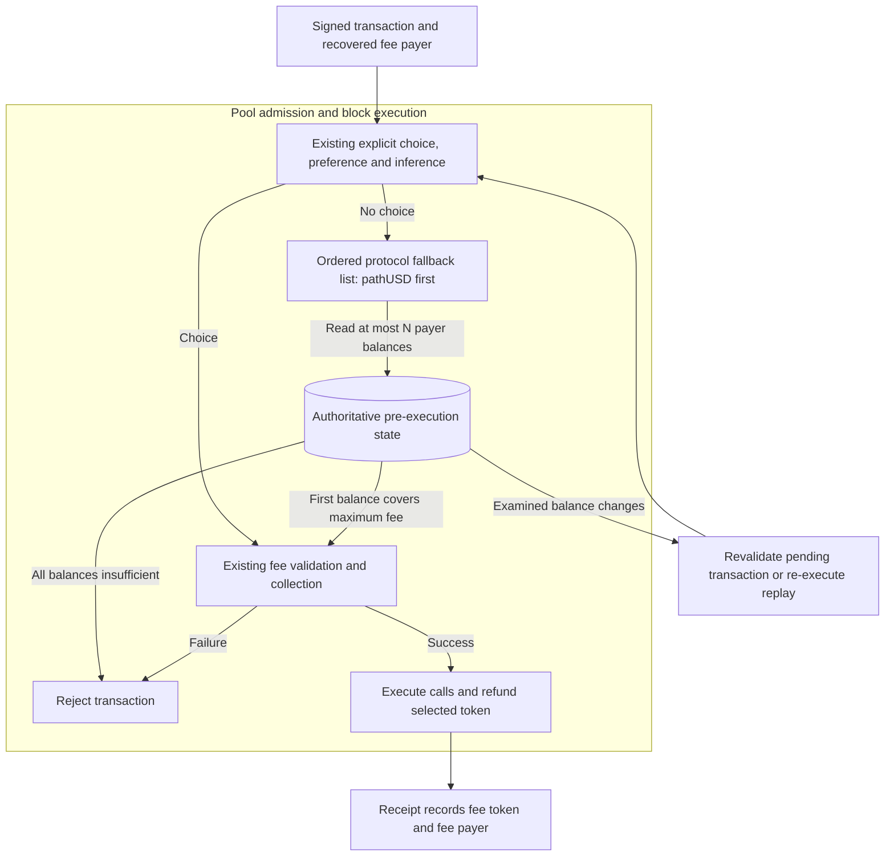
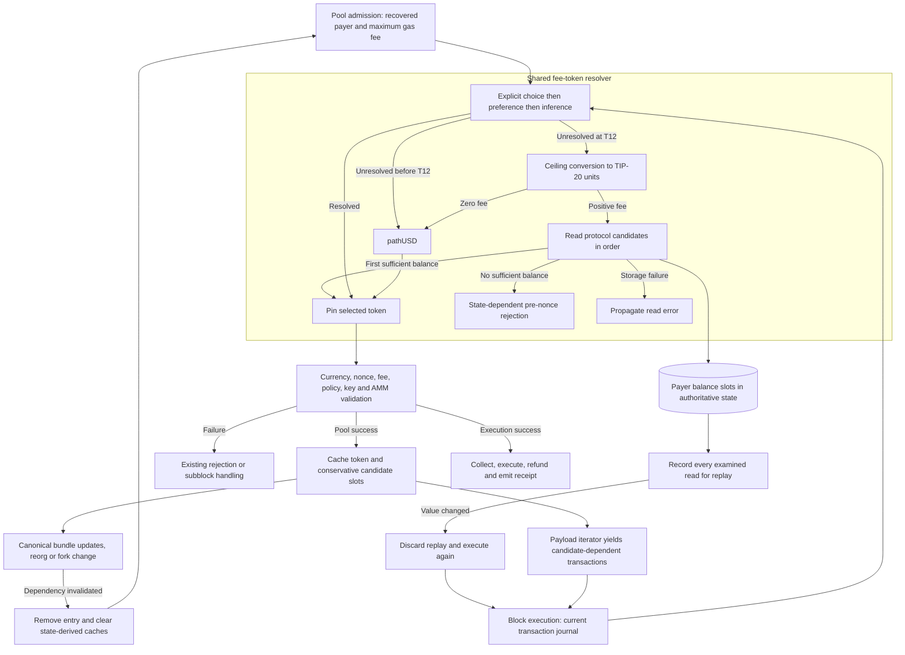

# TIP-1115 Ordered Fallback Fee Tokens

## Motivation

An account holding another USD stablecoin cannot currently pay an otherwise unspecified transaction fee without pathUSD or a stored preference. An ordered protocol list makes those balances usable while preserving explicit choices, inference, and historical execution. This draft implements [TIP-1115](https://github.com/tempoxyz/tempo/pull/7597), whose additional tokens and activation version remain unspecified: use the existing unscheduled T12 fork and a pathUSD-only production list, with multiple deployed tokens in tests. Adding production token addresses requires a protocol change.

## Fee Selection

Pool admission already executes the same pre-execution validator as block execution. Keep its order: explicit `feeToken`; a non-AA call setting the payer's preference; stored payer preference; existing TIP-20 call inference; existing DEX input-token inference; finally fallback. A choice at any earlier stage is binding, including when its subsequent validation fails.

At T12, calculate `ceil(gasLimit * maxFeePerGas / 10^12)` with the existing U256 conversion helper. Legacy transaction environments expose `gasPrice` through the same transaction interface. Do not include call value or use effective gas price. The product of u64 and u128 inputs fits U256. Use the recovered sponsor's balances for sponsored transactions.

Walk the nonempty, distinct protocol list in order. Return the first token with a balance greater than or equal to that maximum fee; never combine balances. A zero fee returns pathUSD without reading candidate balances. Read failures terminate selection as errors; only insufficient balance advances the scan. Exhaustion is a state-dependent transaction rejection before nonce consumption, not a fee-collection failure that subblock handling may commit.

## Collection and Replay

Once selected, existing currency, pause, transfer-policy, access-key, and FeeAMM checks apply. Collection and refund retain the selected token even if calls later change balances or preferences. The validator's default token stays pathUSD. Before T12, retain the existing unconditional pathUSD fallback.

Use the read-only protocol storage provider for candidate balances. Every examined balance, including skipped candidates, is recorded as a storage read when action recording is enabled. Reads do not charge selection gas, but replay must compare their observed values and re-execute after a conflict. Existing explicit-fee intrinsic gas charging remains unchanged. There are at most N candidate reads and no retries or external calls inside selection.

## Pending Transaction Refresh

Cache candidate balance-slot dependencies after pool admission. For an implicit transaction whose resolved token appears in the fallback list, conservatively include the list prefix through that token. This also covers an inferred or preferred token in that prefix; extra revalidation is safe and avoids changing the fee-manager extension API just to report resolution provenance. Explicit choices have no fallback dependencies.

On canonical updates, compare these slots with the committed bundle state, including both increases and decreases. This covers transfers, mints, burns, and protocol fee debits without relying on receipt events. Remove affected pending transactions before invalidation scans, discard validation-derived caches, then submit through full admission against current state. Reorgs refresh all fallback-dependent transactions; fork transitions refresh all implicit transactions. Mined transactions are excluded. Reuse the existing asynchronous revalidation lifecycle and origin preservation.

The payload iterator must not reject fallback-dependent transactions solely because the formerly selected balance fell: a later token may now cover the fee. Yield them for execution, which resolves against the current journal. A balance increase in an earlier token may also change the selected token, and recorded reads prevent reuse of stale replay results. An explicit choice remains pinned.

## Gas Estimation

RPC estimation starts with a block-sized gas bound when the request omits gas. If no fallback candidate covers that provisional bound, derive an affordable upper bound from the largest single candidate balance. Do not sum balances or pin that candidate: each trial execution still applies ordered selection at its trial gas limit. Selection exhaustion during actual execution is a typed transaction rejection, not a provider error. Missing funds for a block-sized estimate must not prevent estimating an affordable smaller transaction.

## Implementation Plan

1. **C1 — Protocol configuration:** define the ordered `FALLBACK_FEE_TOKENS` list with pathUSD first and gate new selection at T12. Keep network activation timestamps unchanged. Assert the list is nonempty, distinct, and contains TIP-20 addresses.
2. **C2 — Selection:** replace only the resolver's final fallback; calculate the rounded maximum fee once and read payer balances in order. Stop on a qualifying balance, propagate storage errors, and reject exhaustion before nonce writes.
3. **C3 — Settlement:** preserve all existing post-selection validation and the selected fee token through collection, execution, refund, and receipt generation. Preserve the validator default and pre-T12 behavior.
4. **C4 — Replay:** record every candidate balance read through the existing storage-action path. Preserve the constant selection gas schedule and force replay conflict detection when an examined value differs.
5. **C5 — Pool refresh:** retain conservative candidate-slot dependencies, refresh them on canonical balance changes, reorgs and fork transitions, and clear them with other validation caches before admission.
6. **C6 — Payload selection:** defer balance-based rejection of fallback-dependent transactions to execution; retain the existing early rejection for pinned transactions.
7. **C7 — RPC estimation:** cap a provisional unaffordable fallback estimate by the largest single candidate balance, preserve ordered selection during trial execution, and expose typed insufficient-funds errors for execution and submission.

## Safety and Liveness Invariants

- **I1:** at fixed transaction, fork, and pre-state, admission and execution choose the same first qualifying token; lower-priority balances cannot displace it.
- **I2:** one token covers the entire rounded maximum fee. A chosen token's pause, policy, access-key or liquidity failure never authorizes another token.
- **I3:** no fee or nonce mutation occurs on fallback exhaustion or storage failure. Existing selected-token collection failures retain their existing checkpoint semantics.
- **I4:** replay cannot accept a selection whose examined balance read changed, even when the changed token was skipped.
- **I5:** pre-T12 selection and validator defaults remain unchanged; production token additions cannot be supplied by RPC callers or mutable node flags.
- **I6:** selection terminates after at most N balance reads. Once a committed balance update is processed and state access succeeds, affected pool entries receive one full revalidation attempt; the existing scheduler supplies eventual progress, not a new wall-clock deadline.
- **I7:** with sufficient balance, valid nonce/authorization/policy, liquidity and gas, execution can pay in the chosen token. Concurrent pool maintenance may lag but cannot override execution's state-derived choice.

## Implementation Map

| File and symbol | Responsibility |
| --- | --- |
| `crates/contracts/src/precompiles/mod.rs`, fallback constant | Protocol address ordering; shares existing pathUSD definition with node consumers. |
| `crates/revm/src/fee_manager.rs`, `TempoFeeManager::resolve_fee_token` | Existing precedence, T12 gate and bounded candidate scan; use `TempoStateAccess::get_token_balance`. |
| `crates/primitives/src/transaction/mod.rs`, `calc_gas_balance_spending` | Existing ceiling conversion, reused without changing settlement math. |
| `crates/revm/src/handler.rs`, `validate_against_state_and_deduct_caller`; `error.rs` | Classify exhausted fallback as a state-dependent pre-nonce transaction error. |
| `crates/precompiles/src/storage/`, read-only provider; `crates/evm/src/action_replay.rs` | Existing storage reads and replay conflict checks carry skipped-token dependencies; no new replay action type. |
| `crates/transaction-pool/src/transaction.rs`, `TempoPooledTransaction`; `validator.rs` | Store candidate-slot dependencies at admission, clear them for revalidation. |
| `crates/transaction-pool/src/maintain.rs`, `maintain_tempo_pool` | Refresh candidate-dependent entries before cached-token invalidation. |
| `crates/transaction-pool/src/best.rs`, `StateAwareBestTransactions` | Allow execution to resolve a new fallback after a balance decrease. |
| `crates/node/src/rpc/mod.rs`, `caller_gas_allowance`; `error.rs` | Bound gas estimation when its initial block-sized limit is unaffordable; map actual fallback exhaustion to a typed RPC rejection. |

`FeeTokenResolver` and `ProtocolFeeManager::get_fee_token` return a dedicated `FeeTokenResolutionError` so callers can distinguish exhaustion from storage failures without interpreting error text. Custom implementations must adopt that return type; fee collection hook types do not change.

No new dependencies, mutable onchain list, storage migration, Helm change, or scheduled network activation is required.

## Complete System View

## Test coverage

### Unit and Model Tests

- **C1–C2, I1–I2, I5–I6:** use three fixed TIP-20 fixture addresses and table-driven balances; test first/middle/last winner, exact equality, one unit short, combined-but-insufficient funds, zero fees, sub-unit rounding, legacy and dynamic-fee environments, and maximum u64/u128 inputs. Independently specified expected addresses and base-unit amounts are the oracle; no production selector in the oracle.
- **C2–C3, I1–I3:** preserve explicit, stored, set-preference, TIP-20 and DEX precedence, including a balance-insufficient selected token with a funded fallback. A sponsor funds candidates while the sender has a different distribution. Assert the payer's expected token or unchanged error and unchanged nonce on exhaustion.
- **C2, I3:** a database fixture fails on the second candidate read. Assert the original read error, no third read and no write. Limit each fixture to three reads; use deterministic addresses and fault indices.
- **C4, I4:** record a scan that skips candidate one; change only that balance before replay. Assert a read conflict and resolution to the now-sufficient earlier token after re-execution. Repeat with selected and unexamined balances; the latter must not become a dependency.
- **C5–C6, I1, I7:** cache a later candidate, credit an earlier slot or debit the selected slot, and process one committed bundle update. Assert revalidation selection and cache replacement; explicit-token entries retain their pin. Include sponsor slots, reset caches, reorg and activation-boundary cases.
- **C7, I1–I2:** estimate without a gas limit from an account that can pay the actual call but not a block-sized maximum. Assert a usable estimate and a successful transaction at that limit; actual exhaustion must carry the typed transaction-rejection RPC error.

### E2E Tests

- **C2–C4, I1–I5:** submit an implicit transaction to a T12 node, verify admission, mined receipt `feeToken`/`feePayer`, payer debit and refund. Compare with T11 and with explicit selection. Use existing node-test timeout conventions; success means the expected mined receipt and independently calculated final balance, not merely RPC acceptance.
- **C3, I2:** fund a selected paused or policy-restricted candidate and a usable later candidate; assert rejection without a fallback retry. Cover access-key spending limits and missing FeeAMM liquidity through existing validation fixtures.
- **C4, I4:** compare charged selection gas with equal call data and state across first and later fixture candidates; assert no per-candidate surcharge. Distinguish selection from token-specific settlement costs.

### Chaos Tests

These cases exercise state changes across admission, replay and execution that a single-state unit test or ordinary E2E run does not cover.

| Scenario | Failure introduced | Expected result |
| --- | --- | --- |
| Earlier token funded while pending | Credit before block inclusion | Next maintenance pass revalidates; execution chooses the earlier token regardless of maintenance timing. |
| Selected token drained | Debit between admission and building | Builder yields for re-resolution; later funded token succeeds or transaction is rejected without collecting fees. |
| Reorg reverses a funding transfer | Canonical branch changes | Discard cached selection and revalidate against the new branch; no stale replay acceptance. |
| Provider read fails mid-scan | Deterministic error on read two | No token substitution, nonce write or fee collection; retry only via a later ordinary admission attempt after provider recovery. |
| Node restarts with pending work | Process exit after admission | Recovered/resubmitted transactions validate against restored canonical state; no durable cached choice survives as authority. |

### Regression Tests

Run existing fee-inference, fee collection, sponsored-payer, pool-maintenance and storage-action replay suites. Keep their pre-T12 assertions. Verify historical gas snapshots remain stable; explain any T12 action snapshot additions as the required candidate balance read. Run nightly formatting and clippy for touched Rust crates.
