# TIP-1028: Address-Level Receive Policies

## Abstract

This TIP extends TIP-403 with token sets for TIP-20 token addresses, address-level receive controls, and non-reverting escrow for blocked TIP-20 inbounds. A blocked inbound credits `ESCROW_ADDRESS` and creates one fine-grained receipt bucket.

The escrow precompile stores only one keyed amount for each open blocked receipt. The rest of the receipt identity — receipt version, requested recipient, block reason, transfer-vs-mint kind, memo, timestamp, and nonce — is authenticated by the receipt witness and emitted in the blocked event. Claims may unwind to the receiver or reroute elsewhere; claim-to-receiver is an unwind, while reroutes are new spends. This TIP applies only to TIP-20 precompile flows; ordinary ERC-20 contracts remain out of scope.

## Motivation

TIP-403 lets token issuers decide who may use a token, but some receivers also need inbound controls. A revert-based receiver policy creates a liveness problem: once a relationship exists, the receiver can later change policy and cause future transfers or mints to revert.

This TIP keeps issuer-side semantics unchanged and changes only receiver-side failure handling. Token-level failures still revert; receiver-side failures are escrowed instead. The escrow representation must preserve more than an aggregate amount because TIP-1022 virtual addresses carry attribution in the literal `to` address, memo-bearing transfers carry memo data, recovery contracts may want time-based or memo-based rules, and offchain recovery flows need the original sender identity.

# Specification

## 1. Scope and Model

TIP-1028 applies to the following TIP-20 recipient-bearing paths:

- `transfer`
- `transferFrom`
- `transferWithMemo`
- `transferFromWithMemo`
- `systemTransferFrom`
- `mint`
- `mintWithMemo`
- protocol withdrawals that execute as TIP-20 transfers from a concrete source balance

For all such paths, TIP-1028 adds a receiver-side authorization layer:

- the receiver's token set is checked against the TIP-20 token address; and
- the receiver's receive policy is checked against the inbound **originator**:
  - `from` for transfer-like paths;
  - the mint caller for `mint` and `mintWithMemo`.

If a token-level TIP-403 or TIP-1015 policy rejects the operation, the operation MUST revert exactly as it does today. If the receiver's address-level controls reject the inbound, the operation MUST be escrowed instead.

If `to` is a TIP-1022 virtual address, TIP-1022 recipient resolution MUST occur before TIP-1028 receiver-side authorization. In that case:

- TIP-1028 applies to the resolved master address, not the literal virtual address;
- if virtual-address resolution fails, the operation MUST revert rather than escrow;
- the blocked receipt's `receiver` MUST be the resolved master address;
- the blocked receipt's `requestedRecipient` MUST be the literal `to` address so offchain systems can recover the TIP-1022 `userTag`; and
- if the inbound is authorized, the success path MUST then follow TIP-1022 forwarding semantics.

TIP-1028 does **not** alter `approve`, `permit`, `burn`, fee refunds via `transfer_fee_post_tx`, non-TIP-20 tokens deployed as ordinary contracts, or future recipient-bearing system-credit paths that do not identify a concrete originator.

DEX internal balances are not TIP-20 wallet balances and are not subject to address-level receive checks until withdrawn back onto the TIP-20 ledger.

The reward subsystem is not receiver-side escrowable, but it is not exempt from recipient consent. `distributeReward` remains token-internal accounting; `setRewardRecipient` MUST reject a nonzero recipient whose address-level receive controls would block the holder as originator; and `claimRewards` MUST revalidate the actual payout recipient's address-level receive controls against the token contract as originator and MUST revert on failure rather than escrow.

For reward accounting, `ESCROW_ADDRESS` is a reward-exempt always-opted-out synthetic sink/source: blocked transfers, blocked mints, and claim releases MUST preserve the same opted-in-supply effects as a movement into or out of an always-opted-out address, and implementations MUST NOT create, update, or consult per-user reward state for `ESCROW_ADDRESS`.

High-level flow:

1. If `to` is a TIP-1022 virtual address, resolve it first to `effectiveReceiver`; otherwise `effectiveReceiver = to`.
2. Run the existing TIP-20 sender-side or issuer-side checks and the token's TIP-403 and TIP-1015 checks using `effectiveReceiver` wherever the current path is recipient-sensitive.
3. Run the receiver's token-set and receive-policy checks against `effectiveReceiver`.
4. If the inbound is authorized, credit the receiver normally.
5. If the inbound is blocked by the receiver, credit `ESCROW_ADDRESS`, create one blocked receipt, and emit a blocked-inbound event naming both `receiver` and `requestedRecipient`.
6. Later, the receiver or the receipt's recovery contract may claim the funds.

## 2. Token Sets

Token sets are a dedicated TIP-403 primitive for TIP-20 token addresses. They answer a different question from address policies:

- address policy: "is this originator authorized?"
- token set: "is this token authorized?"

Token sets use a separate ID space from policy IDs. They are not aliases for ordinary TIP-403 policy lists and do not reuse the compound-policy surface, but they mirror the ordinary TIP-403 list ergonomics, including create-with-members and batched membership updates.

### 2.1 Storage and Constraints

```solidity
uint64 public tokenSetIdCounter = 2; // 0 = reject all, 1 = allow all

struct TokenSetData {
    PolicyType setType; // WHITELIST or BLACKLIST
    address admin;
}

mapping(uint64 => TokenSetData) internal _tokenSetData;
mapping(uint64 => mapping(address => bool)) internal tokenSetMembers;
```

Built-in meanings: `0` = always reject; `1` = always allow.

Token sets MUST satisfy: `setType` is `WHITELIST` or `BLACKLIST`; `COMPOUND` token sets are forbidden; token-set type is immutable after creation; and membership is mutable by the token-set admin.

### 2.2 Interface

```solidity
interface ITIP403TokenSets {
    function createTokenSet(address admin, PolicyType setType)
        external
        returns (uint64 newTokenSetId);

    function createTokenSetWithTokens(
        address admin,
        PolicyType setType,
        address[] calldata tokens
    ) external returns (uint64 newTokenSetId);

    function setTokenSetAdmin(uint64 tokenSetId, address admin) external;

    function modifyTokenSetWhitelist(uint64 tokenSetId, address token, bool allowed) external;
    function modifyTokenSetBlacklist(uint64 tokenSetId, address token, bool restricted) external;

    function modifyTokenSetWhitelistBatch(
        uint64 tokenSetId,
        address[] calldata tokens,
        bool[] calldata allowed
    ) external;

    function modifyTokenSetBlacklistBatch(
        uint64 tokenSetId,
        address[] calldata tokens,
        bool[] calldata restricted
    ) external;

    function isTokenAuthorized(uint64 tokenSetId, address token) external view returns (bool);
    function tokenSetExists(uint64 tokenSetId) external view returns (bool);
    function tokenSetData(uint64 tokenSetId)
        external
        view
        returns (PolicyType setType, address admin);
}
```

`createTokenSetWithTokens(...)` is the token-set analogue of `createPolicyWithAccounts(...)`, and the batch mutation functions are the token-set analogue of TIP-403 batch list updates for ordinary allowlists and denylists.

### 2.3 Authorization Logic

`isTokenAuthorized(tokenSetId, token)` MUST return reject for `tokenSetId == 0`, allow for `tokenSetId == 1`, and otherwise read the token set's immutable `setType`, returning the stored membership bit for `token` in a `WHITELIST` and the negation of that bit in a `BLACKLIST`.

### 2.4 Batch Update Semantics

For `modifyTokenSetWhitelistBatch(...)` and `modifyTokenSetBlacklistBatch(...)`, `tokens.length` and the corresponding boolean array length MUST match; caller authorization and policy-type checks are identical to the single-entry mutation functions; updates MUST apply in order; the call MUST be atomic; and the implementation MUST emit the ordinary per-token update event once for each touched token, rather than a separate batch-only event. If TIP-403 standardizes a different canonical batch-list ABI before TIP-1028 is finalized, token sets SHOULD adopt that same ABI shape mutatis mutandis while preserving the semantics above.

### 2.5 Events and Errors

```solidity
event TokenSetCreated(uint64 indexed tokenSetId, address indexed creator, PolicyType setType);
event TokenSetAdminUpdated(uint64 indexed tokenSetId, address indexed updater, address indexed admin);
event TokenSetWhitelistUpdated(uint64 indexed tokenSetId, address indexed updater, address indexed token, bool allowed);
event TokenSetBlacklistUpdated(uint64 indexed tokenSetId, address indexed updater, address indexed token, bool restricted);

error TokenSetNotFound();
error InvalidTokenSetType();
error TokenSetBatchLengthMismatch();
```

## 3. Address-Level Receive Controls

Any address MAY configure three fields: `receivePolicyId` for which originators may credit the address, `tokenSetId` for which TIP-20 token addresses may credit the address, and `recoveryContract` for an optional claimer authorized to recover blocked receipts one receipt at a time; `address(0)` means the receiver claims directly. If an address has no configured receive controls, address-level authorization defaults to allow.

TIP-1022 virtual addresses are forwarding aliases, not canonical TIP-20 holders. `setAddressReceivePolicy()` MUST reject TIP-1022 virtual addresses and require configuration on the resolved master address instead.

### 3.1 Constraints

`receivePolicyId` MUST reference a simple `WHITELIST` policy, a simple `BLACKLIST` policy, or built-in policy `0` or `1`. It MUST NOT reference a `COMPOUND` policy. Address-level receive controls evaluate only one axis — whether a given inbound originator may credit the receiver — while TIP-1015 `COMPOUND` policies split authorization across sender, transfer-recipient, and mint-recipient roles.

`recoveryContract` MAY be `address(0)`. If nonzero, it designates the sole direct claimer for future blocked receipts for this receiver and MUST NOT equal `ESCROW_ADDRESS` or be a TIP-1022 virtual address.

### 3.2 Blocked Reason and Recovery Contract

```solidity
enum BlockedReason {
    NONE,
    TOKEN_SET,
    RECEIVE_POLICY,
    TOKEN_SET_AND_RECEIVE_POLICY
}
```

`BlockedReason` classifies why an inbound was escrowed; `NONE` is used only when the inbound is authorized. Each blocked inbound snapshots the receiver's current `recoveryContract`. That snapshot becomes part of the blocked receipt and its storage key and governs later claims for that receipt. Changing `recoveryContract` affects only future receipts.

### 3.3 Packed Storage

```solidity
mapping(address => uint256) public addressReceiveConfig;
mapping(address => address) public addressRecoveryContract;
```

| Bits | Size | Field |
|------|------|-------|
| `0` | 1 | `hasAddressPolicy` |
| `1..64` | 64 | `receivePolicyId` |
| `65..72` | 8 | cached `receivePolicyType` |
| `73..136` | 64 | `tokenSetId` |
| `137..144` | 8 | cached `tokenSetType` |
| `145..255` | 111 | reserved, MUST be zero |

When `hasAddressPolicy == 0`, the address is always authorized at the address level. The cached type fields are valid because policy type and token-set type are immutable after creation.

`recoveryContract` is stored separately because a 160-bit address does not fit in the packed config slot.

### 3.4 Interface

```solidity
interface IAddressReceivePolicies {
    function setAddressReceivePolicy(
        uint64 receivePolicyId,
        uint64 tokenSetId,
        address recoveryContract
    ) external;

    function addressReceivePolicy(address account)
        external
        view
        returns (
            bool hasAddressPolicy,
            uint64 receivePolicyId,
            PolicyType receivePolicyType,
            uint64 tokenSetId,
            PolicyType tokenSetType,
            address recoveryContract
        );

    function verifyAddressInbound(address token, address originator, address to)
        external
        view
        returns (bool authorized, BlockedReason blockedReason);
}
```

Implementations SHOULD read `addressRecoveryContract[to]` only after `verifyAddressInbound(...)` returns `authorized = false`.

### 3.5 Authorization Logic

`verifyAddressInbound(token, originator, to)` MUST read the packed config for `to`. If `hasAddressPolicy == 0`, it MUST return `(true, NONE)`. Otherwise it MUST decode `receivePolicyId`, `receivePolicyType`, `tokenSetId`, and `tokenSetType`, evaluate whether `token` is allowed by the token set and whether `originator` is allowed by the receive policy, and return:

- `(true, NONE)` if both checks pass
- `(false, TOKEN_SET_AND_RECEIVE_POLICY)` if both checks fail
- `(false, TOKEN_SET)` if only the token-set check fails
- `(false, RECEIVE_POLICY)` if only the receive-policy check fails

An address that wants to functionally disable filtering SHOULD set `receivePolicyId = 1` and `tokenSetId = 1`. The slot remains allocated.

### 3.6 Events and Errors

```solidity
event AddressReceivePolicyUpdated(
    address indexed account,
    uint64 receivePolicyId,
    uint64 tokenSetId,
    address recoveryContract
);

error InvalidReceivePolicyType();
error InvalidRecoveryContract();
```

## 4. Escrow Precompile

Blocked inbounds are recorded in a dedicated escrow precompile. The raw TIP-20 balance is held at `ESCROW_ADDRESS` inside each TIP-20 token; the precompile stores only one keyed amount for each open blocked receipt.

```solidity
ESCROW_ADDRESS = 0xE5C0000000000000000000000000000000000000
```

### 4.1 Storage

Each blocked inbound creates exactly one fine-grained receipt bucket.

```solidity
uint8 public constant BLOCKED_RECEIPT_VERSION = 1;
uint64 public blockedReceiptNonce = 1;
mapping(bytes32 => uint256) internal blockedReceiptAmount;
```

The persistent escrow key for a blocked inbound is:

```text
receiptKey = keccak256(
    abi.encode(
        receiptVersion,
        token,
        receiver,
        originator,
        requestedRecipient,
        recoveryContract,
        blockedReason,
        kind,
        memo,
        blockedAt,
        blockedNonce
    )
)
```

where:

- `receiptVersion` is a one-byte bucketing version tag and MUST currently be `1`
- `receiver` is the canonical TIP-20 holder that owns the blocked receipt
- `originator` is `from` for transfers and mint caller for mints
- `requestedRecipient` is the literal `to` address and therefore preserves TIP-1022 attribution
- `recoveryContract` is the receiver's snapshotted recovery contract, or `address(0)`
- `blockedReason` records whether the receiver blocked the inbound because of its token set, receive policy, or both
- `kind` distinguishes transfer-blocked from mint-blocked receipts
- `memo` preserves the original memo for memo-bearing paths and is `bytes32(0)` otherwise
- `blockedAt` is the block timestamp captured when the receipt is recorded
- `blockedNonce` is a monotonically increasing global disambiguator assigned at receipt creation time

Future bucketing or receipt-key formats MUST use a different `receiptVersion` value.

`blockedReceiptAmount[receiptKey]` stores the full amount for that open receipt.

The escrow precompile does not need to store the rest of the receipt field-by-field in persistent state. Instead, the same witness fields MUST be used to recompute `receiptKey` at claim time and MUST be surfaced in the blocked-inbound event emitted when the receipt is created.

For TIP-1022 virtual-address inbounds, `receiver` is the resolved master address while `requestedRecipient` preserves the literal virtual address.

This is the same storage pattern as ordinary bucketing, but with a much finer key: one keyed amount per blocked inbound rather than one keyed amount per originator-wide aggregate. The precompile does **not** store receiver-wide aggregate balances, signer lists or multisig state, any global singleton recovery-policy state, or a field-by-field receipt struct in persistent storage.

### 4.2 Interface

```solidity
interface IBlockedInboundEscrow {
    enum InboundKind {
        TRANSFER,
        MINT
    }

    struct ClaimReceipt {
        uint8 receiptVersion;
        address originator;
        address requestedRecipient;
        uint64 blockedAt;
        uint64 blockedNonce;
        BlockedReason blockedReason;
        InboundKind kind;
        bytes32 memo;
    }

    function blockedReceiptBalance(
        address token,
        address receiver,
        address recoveryContract,
        ClaimReceipt calldata receipt
    )
        external
        view
        returns (uint256 amount);

    function claimBlockedReceipt(
        address token,
        address receiver,
        address recoveryContract,
        ClaimReceipt calldata receipt,
        address to
    ) external;

    function recordBlockedInbound(
        address token,
        address originator,
        address receiver,
        address requestedRecipient,
        address recoveryContract,
        uint256 amount,
        BlockedReason blockedReason,
        InboundKind kind,
        bytes32 memo
    ) external returns (uint64 blockedNonce, uint64 blockedAt);
}
```

`recordBlockedInbound(...)` MUST be callable only by TIP-20 precompiles or protocol-internal system code.

`requestedRecipient` is the literal `to` supplied to the TIP-20 entrypoint. For non-virtual inbounds, `requestedRecipient == receiver`. For TIP-1022 virtual-address inbounds, `receiver` is the resolved master address while `requestedRecipient` is the literal virtual address. `receipt.receiptVersion` MUST be `1` for receipts created under this TIP. The precompile does not enumerate receiver-owned receipts onchain. Claimers MUST supply the blocked receipt they want to consume, typically using logs or offchain indexing. The protocol claim interface is intentionally single-receipt; recovery contracts or callers that want batching MAY loop or use multicall outside the protocol surface.

### 4.3 Claim Authorization

Each blocked receipt is governed by the `recoveryContract` captured for that receipt at block time.

`claimBlockedReceipt(...)` consumes only the explicitly supplied receipt bucket and releases only to `to`. It MUST require `msg.sender == receiver` when `recoveryContract == address(0)` and `msg.sender == recoveryContract` when `recoveryContract != address(0)`. It MUST interpret `receipt` as the tuple `(receipt.receiptVersion, token, receiver, receipt.originator, receipt.requestedRecipient, recoveryContract, receipt.blockedReason, receipt.kind, receipt.memo, receipt.blockedAt, receipt.blockedNonce)`, require `blockedReceiptAmount[receiptKey] > 0`, and consume the entire stored amount for that receipt or revert. Partial claims are not allowed.

The supplied receipt witness is a selector, not an authority. Claim rights flow only from `receiver` or the snapshotted `recoveryContract`.

If a receiver wants delegate whitelists, originator self-claim, multisig approval, timelocks, or any other richer recovery policy, it SHOULD set `recoveryContract` to a userland contract or smart wallet that enforces that policy. See Section 4.6 and Appendix A for a non-normative standard pattern.

### 4.4 Release Semantics

All claims release only to the specified `to`.

The escrow precompile MUST call an internal TIP-20 escrow-release path that:

1. debits `balances[ESCROW_ADDRESS]`
2. credits the beneficiary
3. emits `Transfer(ESCROW_ADDRESS, beneficiary, amount)`
4. bypasses the token-level TIP-403 sender check for `ESCROW_ADDRESS`
5. treats `ESCROW_ADDRESS` as a reward-exempt always-opted-out synthetic sink/source

If `to == receiver`, the claim is an unwind of a previously authorized inbound to that receiver. It MUST:

- bypass the receiver's address-level receive controls
- bypass token-level recipient authorization for the receiver
- bypass AccountKeychain spending-limit metering

This is intentional for TIP-1015 compound policies. A blocked mint has already satisfied the token's original `mint_recipient` authorization on the inbound path. Releasing that escrow back to the same `receiver` is an unwind of that previously authorized mint-like inbound, not a new transfer, so it MUST NOT be rechecked against transfer-recipient authorization.

If `to != receiver`, the claim is a rerouted release. It MUST:

- reject `to == ESCROW_ADDRESS`
- reject TIP-1022 virtual addresses as `to`
- enforce token-level transfer-recipient authorization for `to`
- enforce `to`'s address-level receive controls against the receipt's `originator`
- revert if that receipt fails the destination's address-level checks
- if `recoveryContract == address(0)` and the reroute is initiated through an access key, meter the total claimed amount against the receiver's AccountKeychain spending limit exactly as an ordinary TIP-20 spend by the receiver

If a receiver installs a custom `recoveryContract`, any equivalent delegation, timelock, multisig, or key policy is a userland concern.

### 4.5 Events and Errors

```solidity
event TransferBlocked(
    address indexed token,
    address indexed from,
    address indexed receiver,
    uint8 receiptVersion,
    uint64 blockedNonce,
    uint64 blockedAt,
    address requestedRecipient,
    uint256 amount,
    BlockedReason blockedReason,
    address recoveryContract,
    bytes32 memo
);

event MintBlocked(
    address indexed token,
    address indexed operator,
    address indexed receiver,
    uint8 receiptVersion,
    uint64 blockedNonce,
    uint64 blockedAt,
    address requestedRecipient,
    uint256 amount,
    BlockedReason blockedReason,
    address recoveryContract,
    bytes32 memo
);

event BlockedReceiptClaimed(
    address indexed token,
    address indexed receiver,
    uint8 receiptVersion,
    uint64 indexed blockedNonce,
    uint64 blockedAt,
    address originator,
    address requestedRecipient,
    address recoveryContract,
    address caller,
    address to,
    uint256 amount
);

error UnauthorizedClaimer();
error InsufficientEscrowBalance();
error EscrowOnlyTIP20();
error ClaimDestinationUnauthorized();
error InvalidReceiptClaim();
```

A successful claim MUST emit exactly one `BlockedReceiptClaimed` event for the consumed receipt.

### 4.6 Standard Recovery Contract Pattern (Non-Normative)

The protocol does not mandate any particular recovery-contract design. The standard pattern is a reusable receiver-owned implementation, not a global singleton: the receiver deploys its own instance, proxy, or smart-wallet module; sets `recoveryContract` to that instance in `setAddressReceivePolicy(...)`; stores one canonical `receiver`; uses `claimToReceiver(...)` as the default unwind path; optionally permits reroutes to `to != receiver`; and, if originator self-claim is supported, restricts it to receipts whose supplied `originator` equals the caller and only to the caller itself. If the receiver rotates to a new recovery contract, the old contract SHOULD remain callable until receipts keyed to it are drained.

Appendix A gives a non-normative Solidity reference design for this pattern.

## 5. TIP-20 Inbound Path Changes

Userland TIP-20 transfers or mints directly to `ESCROW_ADDRESS` MUST revert:

```solidity
error EscrowAddressReserved();
```

### 5.1 Transfer-like Paths

For a transfer-like path:

- if `to == ESCROW_ADDRESS`, revert with `EscrowAddressReserved()`
- set `memo = bytes32(0)` for non-memo variants, or the supplied memo for memo-bearing variants
- compute `effectiveReceiver`:
  - `resolveRecipient(to)` if `to` is a TIP-1022 virtual address
  - otherwise `to`
- set `requestedRecipient = to`
- run the existing TIP-20 pause, balance, allowance, and token-level TIP-403 and TIP-1015 checks, using `effectiveReceiver` wherever the current path is recipient-sensitive
- call `verifyAddressInbound(token, from, effectiveReceiver)` and capture `blockedReason`
- if the inbound is authorized:
  - follow the normal transfer path using `effectiveReceiver`
  - if `to` is virtual, use TIP-1022 forwarding event semantics
  - update rewards exactly as on a normal transfer
  - debit `from`
  - credit `effectiveReceiver`
  - return success
- if the inbound is blocked by the receiver:
  - read the current `addressRecoveryContract[effectiveReceiver]` and capture `recoveryContract`
  - update rewards as if the raw recipient were a reward-exempt always-opted-out `ESCROW_ADDRESS`
  - debit `from`
  - credit `ESCROW_ADDRESS`
  - call `recordBlockedInbound(token, from, effectiveReceiver, requestedRecipient, recoveryContract, amount, blockedReason, TRANSFER, memo)` and capture `(blockedNonce, blockedAt)`
  - emit `Transfer(from, ESCROW_ADDRESS, amount)`
  - emit `TransferBlocked(token, from, effectiveReceiver, BLOCKED_RECEIPT_VERSION, blockedNonce, blockedAt, requestedRecipient, amount, blockedReason, recoveryContract, memo)`
  - return success

Memo-bearing transfer variants MUST preserve the original memo in the blocked event. Their raw memo-bearing TIP-20 event MUST still name `ESCROW_ADDRESS` as the raw recipient when blocked.

The following diagram summarizes the transfer-like validation flow:

```mermaid
flowchart TD
    Start([transfer call]):::entry

    Start --> EscrowGuard{"to == ESCROW_ADDRESS?"}
    EscrowGuard -- yes --> RevertReserved[/"TIP20 revert<br/>EscrowAddressReserved()"/]:::revert
    EscrowGuard -- no --> IsVirtual{"recipient is<br/>virtual address?"}

    IsVirtual -- no --> Direct["effectiveReceiver = to"]
    IsVirtual -- yes --> Resolve{"resolve<br/>master address"}
    Resolve -- error --> AddrRegistryRevert
    Resolve -- success --> TIP20Checks{"TIP-20 checks:<br>pause, recipient, amount"}
    Direct --> TIP20Checks
    AddrRegistryRevert[/"AddressRegistry revert"/]:::revert

    TIP20Checks -- success --> TIP403["TIP-403 + TIP-1015<br/>token-level policies"]:::check
    TIP403 --> TokenPolicyChecks{"are sender and<br/>receiver authorized?"}
    TIP20Checks -- error --> TIP20Revert[/"TIP-20 revert"/]:::revert
    TokenPolicyChecks -- yes --> VerifyInbound["TIP-403 (inbound)<br/>address-level policies"]:::check
    TokenPolicyChecks -- no --> TIP403Revert[/"TIP-403 revert"/]:::revert
    VerifyInbound --> Authorized{"are sender and<br>token authorized?"}

    %% Happy path
    Authorized -- "blockedReason:<br>NONE" --> HappyPath["TIP-20 transfer:<br/>debits sender,<br/> credits receiver, <br/>accrues rewards"]
    HappyPath --> HappyPathEvent[["emit Transfer(from,<br>receiver, amount)"]]:::event 
    HappyPathEvent --> SuccessOk([return success]):::success

    %% Blocked path
    Authorized -- "blockedReason:<br/>TOKEN_SET<br/>RECEIVE_POLICY<br>TOKEN_SET_AND_RECEIVE_POLICY" --> Escrow
    Escrow["TIP20 transfer:<br>debits sender,<br>credits ESCROW,<br/>reward-exempt"] --> TransferEvent
    TransferEvent[["emit Transfer(from,<br>ESCROW, amount)"]]:::event --> Record["store blocked-receipt digest(<br/>receiver,<br/>requestedRecipient,<br/>originator, recoveryContract,<br/>blockedReason, kind,<br/>memo, blockedAt,<br/>blockedNonce)"]
    Record -->  AttrEvent[["emit TransferBlocked event with all digest information"]]:::event
    
    AttrEvent --> SuccessBlocked(["return success<br/>(funds are escrowed)"]):::escrow

    classDef entry   fill:#0d0d0d,stroke:#51a2ff,stroke-width:1.5px,color:#ffffff
    classDef check   fill:#1a1a1a,stroke:#51a2ff,stroke-width:1.5px,color:#ffffff
    classDef event   fill:#262626,stroke:#333333,stroke-width:1px,color:#ffffff
    classDef revert  fill:#fb2c36,stroke:#ffafa3,stroke-width:1.5px,color:#ffffff
    classDef success fill:#193925,stroke:#50ab64,stroke-width:1.5px,color:#50ab64
    classDef escrow  fill:#c55c00,stroke:#ffcb00,stroke-width:1.5px,color:#ffffff
```



### 5.2 Mint-like Paths

For a mint-like path:

- if `to == ESCROW_ADDRESS`, revert with `EscrowAddressReserved()`
- set `memo = bytes32(0)` for non-memo variants, or the supplied memo for memo-bearing variants
- compute `effectiveReceiver`:
  - `resolveRecipient(to)` if `to` is a TIP-1022 virtual address
  - otherwise `to`
- set `requestedRecipient = to`
- run the existing issuer-role, mint-recipient, and supply-cap checks, using `effectiveReceiver` wherever the current path is recipient-sensitive
- call `verifyAddressInbound(token, originator, effectiveReceiver)` and capture `blockedReason`, where `originator` is the mint caller
- if the inbound is authorized:
  - follow the normal mint path using `effectiveReceiver`
  - if `to` is virtual, use TIP-1022 forwarding event semantics
  - update rewards exactly as on a normal mint
  - increase total supply
  - credit `effectiveReceiver`
  - return success
- if the inbound is blocked by the receiver:
  - read the current `addressRecoveryContract[effectiveReceiver]` and capture `recoveryContract`
  - update rewards as if the raw recipient were a reward-exempt always-opted-out `ESCROW_ADDRESS`
  - increase total supply
  - credit `ESCROW_ADDRESS`
  - call `recordBlockedInbound(token, originator, effectiveReceiver, requestedRecipient, recoveryContract, amount, blockedReason, MINT, memo)` and capture `(blockedNonce, blockedAt)`
  - emit `Transfer(address(0), ESCROW_ADDRESS, amount)` and `Mint(ESCROW_ADDRESS, amount)`
  - emit `MintBlocked(token, originator, effectiveReceiver, BLOCKED_RECEIPT_VERSION, blockedNonce, blockedAt, requestedRecipient, amount, blockedReason, recoveryContract, memo)`
  - return success

`mintWithMemo` MUST preserve the original memo in the blocked event. Its raw mint-related events MUST still name `ESCROW_ADDRESS` as the raw recipient when blocked.

### 5.3 Reward Delegation and Claims

Reward flows are never escrowed, but they MUST respect recipient consent. For `setRewardRecipient(holder, recipient)`, `recipient == address(0)` remains the opt-out path and bypasses receive-policy checks; otherwise the token MUST call `verifyAddressInbound(token, holder, recipient)` and revert if unauthorized. For `claimRewards(...)`, the token MUST determine the actual payout recipient under its existing reward rules, revalidate that recipient with `verifyAddressInbound(token, address(token), recipient)` before crediting rewards, and revert rather than escrow if unauthorized.

### 5.4 Reward and Event Semantics

Blocked transfers, blocked mints, and claim releases MUST treat `ESCROW_ADDRESS` as a reward-exempt always-opted-out synthetic sink/source.

Blocked inbounds MUST use truthful raw TIP-20 events:

- blocked transfer: `Transfer(from, ESCROW_ADDRESS, amount)`
- blocked mint: `Transfer(address(0), ESCROW_ADDRESS, amount)` and `Mint(ESCROW_ADDRESS, amount)`

In addition, every blocked inbound MUST emit exactly one attribution event:

- `TransferBlocked(token, from, receiver, receiptVersion, blockedNonce, blockedAt, requestedRecipient, amount, blockedReason, recoveryContract, memo)`
- `MintBlocked(token, operator, receiver, receiptVersion, blockedNonce, blockedAt, requestedRecipient, amount, blockedReason, recoveryContract, memo)`

`blockedReason` MUST distinguish whether the inbound was blocked by the receiver's token set, the receiver's receive policy, or both. It MUST NOT be `NONE` in a blocked event.

For blocked TIP-1022 deposits, `requestedRecipient` preserves the literal virtual address while `receiver` names the resolved master address that owns the receipt.

### 5.5 Tempo-Specific Protocol Interactions

- **Stablecoin DEX internal balances are out of scope.** Internal DEX balances are not TIP-20 wallet balances and are not gated until withdrawn back onto the TIP-20 ledger.
- **DEX wallet payouts remain ordinary TIP-20 transfers.** DEX `withdraw` calls and swap outputs that transfer from the DEX address to a wallet remain subject to address-level receive controls and may therefore be escrowed.
- **FeeManager and TIPFeeAMM payouts remain ordinary TIP-20 transfers.** Validator fee distributions, AMM burns, and TIPFeeAMM outputs such as `rebalanceSwap` payouts remain subject to address-level receive controls and may therefore be escrowed.
- **These protocol entrypoints become processed-vs-credited operations.** A DEX, FeeManager, or AMM call may complete successfully even if the final TIP-20 outbound was escrowed rather than credited to the intended wallet. Integrations that require guaranteed wallet credit MUST inspect `TransferBlocked` or `MintBlocked` or wrap these calls with additional logic.
- **Fee refunds are exempt.** `transfer_fee_post_tx` is a refund of the current transaction's unused fee deposit, not a new third-party inbound. It MUST bypass address-level receive controls and MUST NOT be escrowed.
- **Blocked memo-bearing inbounds keep their raw memo event.** The raw memo-bearing event still names `ESCROW_ADDRESS`; receivers that care about memo-based routing MUST correlate it with the blocked-receipt event in the same transaction.
- **`ESCROW_ADDRESS` is a protected system address.** Any TIP-20 logic that protects DEX or FeeManager balances as system balances MUST extend the same protection to `ESCROW_ADDRESS`.

### 5.6 Integration Consequence

After TIP-1028, `transfer`, `transferFrom`, `mint`, `mintWithMemo`, DEX wallet payouts, and FeeManager or TIPFeeAMM wallet payouts may succeed either because the intended receiver was credited or because the inbound was escrowed. Contracts and offchain systems that must distinguish those outcomes MUST inspect `TransferBlocked` or `MintBlocked` or use wrapper logic. This includes higher-level Tempo precompile events, which are not rewritten to distinguish direct credit from escrow.

## 6. Gas and Storage Analysis

This section uses the gas model from TIP-1016:

- fresh storage slot: **250,000 gas**
- existing nonzero slot update: **~2,900 gas**
- typical TIP-20 transfer to an existing address: **~50,000 gas**

### 6.1 Main Cases

| Case | Rough cost | Notes |
|------|------------|-------|
| first `setAddressReceivePolicy()` with `recoveryContract == address(0)` | `~250k + call overhead` | one new packed config slot |
| first `setAddressReceivePolicy()` with nonzero `recoveryContract` | `~500k + call overhead` | packed config slot plus recovery-contract slot |
| allowed inbound to address with no receive config | current path + one cold config read | no escrow writes |
| allowed inbound to configured address | current path + config read + token-set or policy membership reads | no escrow writes |
| blocked inbound after escrow balance slot is preinitialized | `~300k` | one new keyed receipt amount slot plus normal transfer path |
| blocked inbound without escrow-slot preinitialization | previous row + `~250k` | first live zero-to-nonzero write to `balances[ESCROW_ADDRESS]` |
| claim one receipt | one transfer from escrow + one receipt-slot delete + auth reads | batching belongs above the protocol layer |

### 6.2 Storage Choices

The design intentionally stores one fine-grained receipt bucket per blocked inbound. That is more expensive than an aggregate bucket, but it preserves the literal `requestedRecipient` needed for TIP-1022 attribution, the original `originator`, the block timestamp `blockedAt`, the distinction between transfer-blocked and mint-blocked funds, and memo and block-reason data for programmable recovery rules. The persistent state is still just one keyed amount per blocked inbound, while the richer receipt metadata is authenticated through the receipt witness and surfaced in the blocked events rather than stored as a multi-slot onchain struct.

### 6.3 Escrow Slot Strategy

The first zero-to-nonzero write to `balances[ESCROW_ADDRESS]` for a token can add roughly `250,000` gas to the first blocked live transfer.

TIP-20 implementations SHOULD move that cost to deployment by initializing the `balances[ESCROW_ADDRESS]` slot when the token is created, before any blocked inbound occurs. One acceptable pattern is to do this with a non-user-claimable implementation-private escrow reserve. Implementations MAY use any equivalent deployment-time mechanism instead.

If an implementation uses such a reserve:

- it MUST be created at token deployment time
- it MUST exist only to initialize and keep live the `balances[ESCROW_ADDRESS]` slot
- it MUST NOT correspond to any blocked receipt
- it MUST NOT be claimable by users or recovery contracts
- release and burn logic MUST preserve it as implementation-private state

## 7. Security and Integration Considerations

- **Success no longer implies receiver credit.** A successful transfer or mint means the inbound was processed, not necessarily that the intended receiver's balance increased.
- **Ordinary contracts should usually not opt in.** A contract address that enables receive controls can cause callers to observe a successful `transfer`, `transferFrom`, or mint-like payout even though the asset was escrowed instead of credited to the contract. Contracts that are not explicitly built to inspect blocked-receipt events and claim from escrow SHOULD NOT opt in.
- **Claim-to-receiver is an unwind, while reroutes are new transfers.** Claim-to-receiver bypasses the receiver's token-level and address-level receive checks. A reroute to `to != receiver` must satisfy token-level recipient authorization for `to`, that destination's address-level receive controls, and, for direct receiver reroutes through an access key, ordinary AccountKeychain spending-limit metering.
- **Recovery-contract authority is explicit and not retroactive.** If a receiver sets `recoveryContract`, that address is the sole direct claimer for future blocked receipts. Any delegate whitelist, originator self-claim, multisig approval, timelock policy, key-spend policy, or batching policy for that path becomes a userland concern of the recovery contract. Older receipts remain keyed to the recovery contract captured when they were blocked, so rotation can strand funds if the old contract later becomes unusable.
- **Reward delegation requires consent.** `setRewardRecipient` and `claimRewards` now fail if the target recipient's address-level receive controls reject the reward flow.
- **Policy configuration is permanent state.** An address can functionally disable filtering by setting allow-all values, but the storage slot remains allocated.

## 8. Invariants

The following invariants MUST always hold:

1. For every TIP-20 token:
   ```text
   balances[ESCROW_ADDRESS]
   = implementation_private_escrow_reserve[token]
   + sum_over_open_blocked_receipts_for_token(receipt.amount)
   ```

2. Userland `transfer(..., ESCROW_ADDRESS)`, `transferFrom(..., ESCROW_ADDRESS)`, `mint(ESCROW_ADDRESS, ...)`, and `mintWithMemo(ESCROW_ADDRESS, ...)` MUST revert.

3. If token-level checks and sender-side or issuer-side checks pass, then a receiver-side address-policy failure MUST divert to escrow rather than revert.

4. Token-level policy failure on the original transfer or mint path MUST still revert.

5. Every blocked inbound MUST create exactly one blocked receipt bucket.

6. Every blocked inbound MUST emit the literal requested recipient as `requestedRecipient`, even when the canonical `receiver` differs because of TIP-1022 resolution.

7. Only `receiver` may claim a receipt bucket whose `recoveryContract == address(0)`. Only the receipt's `recoveryContract` may claim a receipt bucket whose `recoveryContract != address(0)`.

8. A claim to `receiver` MUST bypass the receiver's address-level receive controls and token-level recipient authorization.

9. A rerouted claim to `to != receiver` MUST enforce token-level recipient authorization for `to` and MUST revert with `ClaimDestinationUnauthorized()` if it fails.

10. A rerouted claim to `to != receiver` MUST enforce the destination's address-level receive controls against the consumed receipt's `originator`.

11. If `recoveryContract == address(0)`, `to != receiver`, and the claim is initiated through an access key, the claim MUST meter the total claimed amount against the receiver's AccountKeychain spending limit as an ordinary TIP-20 spend by the receiver.

12. Fee refunds via `transfer_fee_post_tx` MUST bypass address-level receive controls and MUST NOT be escrowed.

13. `ESCROW_ADDRESS` MUST be treated as a protected system address by system-balance-sensitive TIP-20 logic, including any escrow-release and `burnBlocked`-like paths.

14. Changing `addressRecoveryContract[receiver]` MUST affect only future blocked receipts. Existing receipt buckets remain governed by the recovery contract captured in their key.

15. Escrow-related raw TIP-20 events MUST be truthful:
   - blocked transfer: `Transfer(from, ESCROW_ADDRESS, amount)`
   - blocked mint: `Transfer(address(0), ESCROW_ADDRESS, amount)` and `Mint(ESCROW_ADDRESS, amount)`
   - claim release: `Transfer(ESCROW_ADDRESS, beneficiary, amount)`

16. Every blocked inbound MUST emit exactly one blocked-receipt attribution event naming the receiver, the requested recipient, the reason, the governing `recoveryContract`, the receipt's version, the receipt's `blockedAt`, and the receipt's blocked nonce. That event's `blockedReason` MUST NOT be `NONE`.

17. Claims MUST consume whole blocked receipts. Once a receipt is claimed, its keyed amount MUST be deleted rather than partially decremented.

18. Reward accounting for blocked transfers, blocked mints, and claim releases MUST treat `ESCROW_ADDRESS` as a reward-exempt always-opted-out synthetic sink/source, preserve the same opted-in-supply effects as a movement into or out of an always-opted-out address, and MUST NOT create, update, or consult per-user reward state for `ESCROW_ADDRESS`.

19. `setRewardRecipient` MUST reject any nonzero recipient whose address-level receive controls would block the holder as originator.

20. `claimRewards` MUST reject any payout recipient whose address-level receive controls would block the token contract as originator.

21. `verifyAddressInbound(...)` MUST return `blockedReason == NONE` exactly when `authorized == true`.

## Appendix A. Solidity Reference Recovery Contract (Non-Normative)

The following contract is illustrative only. It is not part of the protocol, and receivers may use any recovery contract or smart wallet that obeys the rules in Sections 4.3 and 4.4.

```solidity
pragma solidity ^0.8.24;

interface IBlockedInboundEscrowReference {
    enum BlockedReason {
        NONE,
        TOKEN_SET,
        RECEIVE_POLICY,
        TOKEN_SET_AND_RECEIVE_POLICY
    }

    enum InboundKind {
        TRANSFER,
        MINT
    }

    struct ClaimReceipt {
        uint8 receiptVersion;
        address originator;
        address requestedRecipient;
        uint64 blockedAt;
        uint64 blockedNonce;
        BlockedReason blockedReason;
        InboundKind kind;
        bytes32 memo;
    }

    function blockedReceiptBalance(
        address token,
        address receiver,
        address recoveryContract,
        ClaimReceipt calldata receipt
    )
        external
        view
        returns (uint256 amount);

    function claimBlockedReceipt(
        address token,
        address receiver,
        address recoveryContract,
        ClaimReceipt calldata receipt,
        address to
    ) external;
}

contract BasicBlockedReceiptRecovery {
    error Unauthorized();
    error OriginatorSelfClaimDisabled();
    error UseClaimToReceiver();

    address public immutable receiver;
    IBlockedInboundEscrowReference public immutable escrow;

    mapping(address => bool) public claimOperators;
    mapping(address => bool) public rerouteOperators;
    bool public originatorSelfClaimEnabled;

    constructor(address receiver_, address escrow_) {
        receiver = receiver_;
        escrow = IBlockedInboundEscrowReference(escrow_);
    }

    function setClaimOperator(address operator, bool allowed) external {
        if (msg.sender != receiver) revert Unauthorized();
        claimOperators[operator] = allowed;
    }

    function setRerouteOperator(address operator, bool allowed) external {
        if (msg.sender != receiver) revert Unauthorized();
        rerouteOperators[operator] = allowed;
    }

    function setOriginatorSelfClaimEnabled(bool enabled) external {
        if (msg.sender != receiver) revert Unauthorized();
        originatorSelfClaimEnabled = enabled;
    }

    function claimToReceiver(
        address token,
        IBlockedInboundEscrowReference.ClaimReceipt calldata receipt
    ) external {
        if (msg.sender != receiver && !claimOperators[msg.sender]) revert Unauthorized();
        escrow.claimBlockedReceipt(token, receiver, address(this), receipt, receiver);
    }

    function claimTo(
        address token,
        IBlockedInboundEscrowReference.ClaimReceipt calldata receipt,
        address to
    ) external {
        if (msg.sender != receiver && !rerouteOperators[msg.sender]) revert Unauthorized();
        if (to == receiver) revert UseClaimToReceiver();
        escrow.claimBlockedReceipt(token, receiver, address(this), receipt, to);
    }

    function claimOwnReceipt(
        address token,
        IBlockedInboundEscrowReference.ClaimReceipt calldata receipt
    ) external {
        if (!originatorSelfClaimEnabled) revert OriginatorSelfClaimDisabled();
        if (receipt.originator != msg.sender) revert Unauthorized();

        escrow.claimBlockedReceipt(token, receiver, address(this), receipt, msg.sender);
    }
}
```

This reference design makes `receiver` the only configuration authority, separates claims back to `receiver` from reroutes to third parties, allows delegated claims without forcing that logic into the protocol, and makes originator self-claim, if enabled, explicit and narrowly scoped to the caller's own authenticated receipt witness. Receivers that need stronger policy MAY replace it with a multisig, smart wallet, timelock, or custom contract; if they do, that contract is responsible for any delegation, batching, spending-policy, or approval logic beyond the protocol's direct claimer checks.
