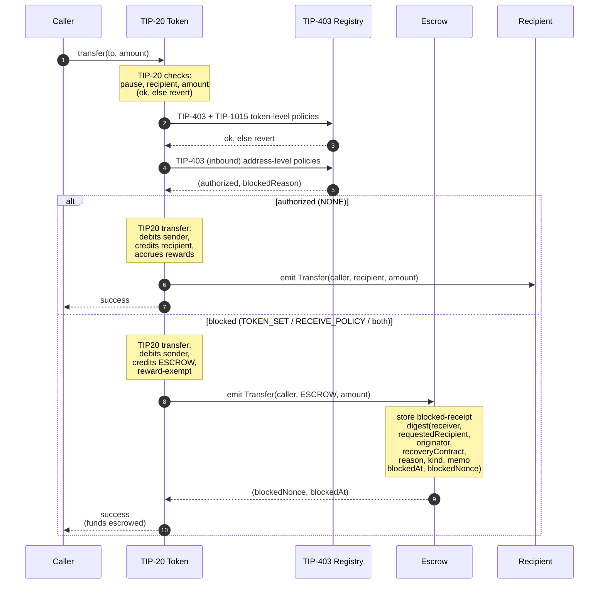
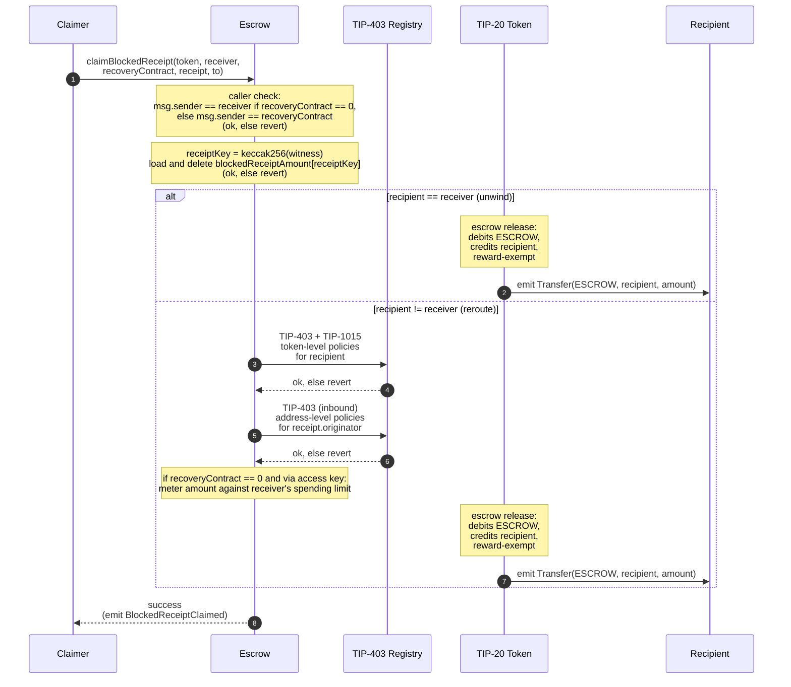

# TIP-1028: Address-Level Receive Policies

## Abstract

This TIP introduces receiver-controlled inbound policies for TIP-20 tokens. Today, only token issuers (via TIP-403 / TIP-1015) decide who may move a token; receivers cannot independently filter what arrives in their balance. This TIP adds:

1. **Token sets** — a new TIP-403 primitive that lets any address declare which TIP-20 token addresses may credit it.
2. **Address-level receive policies** — a per-address configuration on the TIP-403 registry that filters inbound TIP-20 credits by originator and by token, with an optional dedicated recovery contract.
3. **An escrow precompile** — a new precompile that records a fine-grained receipt for each blocked inbound TIP-20 transfer, and lets the receiver (or its designated recovery contract) claim or reroute the funds later.

A blocked inbound never reverts: the funds are credited to a reserved `ESCROW_ADDRESS` inside the TIP-20 token, one receipt bucket is recorded by the escrow precompile, and a blocked-inbound event is emitted that authenticates the receipt witness. Pre-existing token-level (issuer-side) failures continue to revert exactly as today.

This TIP applies only to TIP-20 precompile flows; ordinary ERC-20 contracts deployed as userland code remain out of scope.

## Motivation

TIP-403 is an issuer-side authorization layer: the token issuer decides who may send, who may receive, and who may mint to whom. It cannot answer the receiver's question, *"do I want to be exposed to this counterparty or this token at all?"*

Plain receiver-side reverts are not a viable substitute. Once an issuer–receiver–counterparty relationship exists, a receiver that later changes a revert-based policy can break in-flight flows and recurring inbounds across the entire system. Reverting receivers also create an asymmetric DoS surface against issuers, integrations, and protocol-owned distribution paths (DEX payouts, fee distributions, AMM outputs).

The design choice in TIP-1028 is therefore:

- **Token-level / issuer-side failures keep reverting.** Issuers retain full control of the token's authorization model; nothing in their semantics changes.
- **Receiver-side failures escrow instead of reverting.** Senders, mints, DEX payouts, and fee distributions still succeed at the protocol layer; the asset is held in `ESCROW_ADDRESS` until the receiver (or its recovery contract) claims it.

Escrowed funds must carry enough metadata to be programmatically recoverable. An aggregate "amount blocked per (token, receiver)" bucket cannot express TIP-1022 attribution, memo routing, originator-based recovery rules, or transfer-vs-mint provenance. Therefore, the escrow precompile stores one keyed amount per blocked inbound, with ALL the receipt identity (version, requested recipient, block reason, kind, memo, timestamp, nonce) authenticated by the receipt witness and emitted in the blocked event — keeping persistent state to a single slot per receipt while preserving full attribution offchain.

## Assumptions

- **TIP-403 registry exists and is extensible.** Token sets and address-level receive policies are added as new state and new entrypoints on the existing TIP-403 precompile registry, alongside its current address-policy surface. This TIP does not modify the existing TIP-403 address-policy ABI.
- **TIP-1015 compound policies are unchanged.** Receiver-side address-level controls evaluate exactly one axis (originator → receiver), and never cross-validate against the issuer's `transfer_recipient` / `mint_recipient` roles.
- **TIP-1022 resolution is available at TIP-20 inbound time.** Virtual-address resolution runs before TIP-1028 receiver-side checks; failed resolution still reverts.
- **TIP-1016 gas model.** Cost analysis uses the storage-cost model from TIP-1016 (fresh slot ≈ 250k gas, hot slot update ≈ 2.9k gas, baseline TIP-20 transfer ≈ 50k gas).
- **`ESCROW_ADDRESS` is reserved at protocol level.** No TIP-20 implementation, system contract, or user may treat `ESCROW_ADDRESS` as an ordinary holder. Userland transfers and mints to it MUST revert.
- **Reward state never lives at `ESCROW_ADDRESS`.** Implementations rely on treating the escrow sink as a reward-exempt always-opted-out address; violating this assumption silently corrupts the opted-in supply for reward distribution.
- **Backwards compatibility.** Addresses with no configured receive controls behave exactly as today. The only new ambient cost on existing flows is one cold storage read of the receiver's packed receive config slot.

# Specification

## 1. System Architecture

This TIP is intentionally additive: it does not alter TIP-403's existing address-policy ABI, it does not change issuer-side TIP-20 semantics, and it does not introduce new surfaces in TIP-20 callers' interfaces. The new functionality is split across three protocol components, summarized below.

### 1.1 Component Map

| Component | Status | Owns |
|-----------|--------|------|
| **TIP-403 registry** (existing) | extended | Token sets (new primitive), address-level receive config (new mapping), recovery-contract mapping (new mapping), the new `verifyAddressInbound(...)` view |
| **Escrow Precompile** (new, address `ESCROW_ADDRESS`) | introduced by this TIP | Per-receipt amount mapping keyed by a witness-derived hash, `recordBlockedInbound(...)` ingest entrypoint, `claimBlockedReceipt(...)` claim entrypoint, blocked / claim attribution events; also acts as the on-token holder of all blocked balances — `balances[ESCROW_ADDRESS]` inside each TIP-20 token is held by this precompile |
| **TIP-20 token precompile** (existing) | extended | Inbound dispatch: TIP-1022 resolution → issuer-side checks → call `verifyAddressInbound(...)` → either credit `effectiveReceiver` or credit `ESCROW_ADDRESS` and call `recordBlockedInbound(...)`; new escrow-release internal path for `claimBlockedReceipt`; raw-event truthfulness for blocked credits; `setRewardRecipient` / `claimRewards` recipient revalidation |

The escrow precompile and the TIP-403 registry are independent: the escrow precompile authenticates claims using the receipt witness and the receipt's snapshotted recovery contract, and does **not** read the receiver's current TIP-403 receive config when claiming. The TIP-403 registry, conversely, has no knowledge of escrowed amounts: it only answers `verifyAddressInbound(...)` and exposes the current `recoveryContract` of an address.

### 1.2 End-to-End Flow Overview

The TIP-20 inbound path is the single integration point.



Claim path:



### 1.3 Scope

The address-level inbound authorization layer applies to the following TIP-20 recipient-bearing paths:

- `transfer`
- `transferFrom`
- `transferWithMemo`
- `transferFromWithMemo`
- `systemTransferFrom`
- `mint`
- `mintWithMemo`
- protocol withdrawals that execute as TIP-20 transfers from a concrete source balance

For all such paths, TIP-1028 adds a receiver-side authorization layer:

- the receiver's token set is checked against the TIP-20 token address; and
- the receiver's receive policy is checked against the inbound **originator**:
  - `from` for transfer-like paths;
  - the mint caller for `mint` and `mintWithMemo`.

If a token-level TIP-403 or TIP-1015 policy rejects the operation, the operation MUST revert exactly as it does today. If the receiver's address-level controls reject the inbound, the operation MUST be escrowed instead.

TIP-1028 does **NOT** alter:

- `approve` / `permit` / `burn`
- fee refunds via `transfer_fee_post_tx`
- non-TIP-20 tokens deployed as ordinary contracts
- future recipient-bearing system-credit paths that do not identify a concrete originator
- DEX *internal* balances. Gating only kicks in when funds are withdrawn back onto the TIP-20 ledger
- the reward subsystem's escrow-ability. Rewards are never escrowed; see [Section 6.3](#63-reward-subsystem)

### 1.4 TIP-1022 Interaction

If the literal `to` is a TIP-1022 virtual address, TIP-1022 recipient resolution MUST occur **before** TIP-1028 receiver-side authorization. Specifically:

- TIP-1028 authorization applies to the resolved master address, never to the literal virtual address.
- If virtual-address resolution itself fails, the operation MUST revert rather than escrow.
- The blocked receipt's `receiver` MUST be the resolved master address.
- The blocked receipt's `requestedRecipient` MUST be the literal `to`, so offchain systems can recover the TIP-1022 `userTag`.
- If the inbound is authorized, the success path MUST follow TIP-1022 forwarding event semantics.
- TIP-1022 virtual addresses MUST NOT configure their own receive policy (see [Section 3.1](#31-constraints)). The master address's policy governs all virtual addresses derived from it.

## 2. Token Sets (TIP-403 Extension)

Token sets are a new TIP-403 primitive *for token addresses*. They answer a different question from address policies:

- **address policy**: filters by *counterparty* — *"is this counterparty allowed to interact with this token?"*
- **token set**: filters by *token* — *"is this token allowed to interact with this address?"*

Token sets use a separate ID space from policy IDs. They are not aliases for ordinary TIP-403 policy lists and do not reuse the compound-policy surface, but they mirror ordinary TIP-403 list ergonomics, including create-with-members and batched membership updates.

### 2.1 Storage and Constraints

```solidity
uint64 public tokenSetIdCounter = 2; // 0 = reject all, 1 = allow all

struct TokenSetData {
    PolicyType setType; // WHITELIST or BLACKLIST
    address admin;
}

mapping(uint64 => TokenSetData) internal _tokenSetData;
mapping(uint64 => mapping(address => bool)) internal tokenSetMembers;
```

Built-in meanings: `0` = always reject; `1` = always allow.

Token sets MUST satisfy:

- `setType` is `WHITELIST` or `BLACKLIST`.
- `COMPOUND` token sets are forbidden.
- Token-set type is immutable after creation.
- Membership is mutable by the token-set admin.

### 2.2 Interface

```solidity
interface ITIP403TokenSets {
    function createTokenSet(address admin, PolicyType setType)
        external
        returns (uint64 newTokenSetId);

    function createTokenSetWithTokens(
        address admin,
        PolicyType setType,
        address[] calldata tokens
    ) external returns (uint64 newTokenSetId);

    function setTokenSetAdmin(uint64 tokenSetId, address admin) external;

    function modifyTokenSetWhitelist(uint64 tokenSetId, address token, bool allowed) external;
    function modifyTokenSetBlacklist(uint64 tokenSetId, address token, bool restricted) external;

    function modifyTokenSetWhitelistBatch(
        uint64 tokenSetId,
        address[] calldata tokens,
        bool[] calldata allowed
    ) external;

    function modifyTokenSetBlacklistBatch(
        uint64 tokenSetId,
        address[] calldata tokens,
        bool[] calldata restricted
    ) external;

    function isTokenAuthorized(uint64 tokenSetId, address token) external view returns (bool);
    function tokenSetExists(uint64 tokenSetId) external view returns (bool);
    function tokenSetData(uint64 tokenSetId)
        external
        view
        returns (PolicyType setType, address admin);
}
```

`createTokenSetWithTokens(...)` is the token-set analogue of `createPolicyWithAccounts(...)`, and the batch mutation functions are the token-set analogue of TIP-403 batch list updates for ordinary allowlists and denylists.

### 2.3 Authorization Logic

`isTokenAuthorized(tokenSetId, token)` MUST:

- return `false` for `tokenSetId == 0`,
- return `true` for `tokenSetId == 1`,
- otherwise read the token set's immutable `setType` and return the stored membership bit for `token` in a `WHITELIST`, or its negation in a `BLACKLIST`.

### 2.4 Batch Update Semantics

For `modifyTokenSetWhitelistBatch(...)` and `modifyTokenSetBlacklistBatch(...)`:

- `tokens.length` and the corresponding boolean array length MUST match.
- Caller authorization and policy-type checks are identical to the single-entry mutation functions.
- Updates MUST apply in order.
- The call MUST be atomic.
- The implementation MUST emit the ordinary per-token update event once for each touched token, not a separate batch-only event.

### 2.5 Events and Errors

```solidity
event TokenSetCreated(uint64 indexed tokenSetId, address indexed creator, PolicyType setType);
event TokenSetAdminUpdated(uint64 indexed tokenSetId, address indexed updater, address indexed admin);
event TokenSetWhitelistUpdated(uint64 indexed tokenSetId, address indexed updater, address indexed token, bool allowed);
event TokenSetBlacklistUpdated(uint64 indexed tokenSetId, address indexed updater, address indexed token, bool restricted);

error TokenSetNotFound();
error InvalidTokenSetType();
error TokenSetBatchLengthMismatch();
```

## 3. Address-Level Receive Controls (TIP-403 Extension)

Address-level receive controls are a new per-address configuration on the TIP-403 registry. They expose three fields:

- `receivePolicyId` — which originators may credit the address.
- `tokenSetId` — which TIP-20 token addresses may credit the address.
- `recoveryContract` — an optional dedicated claimer for blocked receipts; `address(0)` means the receiver claims directly.

If an address has no configured receive controls, address-level authorization defaults to allow (i.e., `verifyAddressInbound(...)` returns `(true, NONE)`).

### 3.1 Constraints

`receivePolicyId` MUST reference a simple `WHITELIST` policy, a simple `BLACKLIST` policy, or built-in policy `0` or `1`. It MUST NOT reference a `COMPOUND` policy. Address-level receive controls evaluate only one axis — whether a given inbound originator may credit the receiver — while TIP-1015 `COMPOUND` policies split authorization across sender, transfer-recipient, and mint-recipient roles.

`recoveryContract` MAY be `address(0)`. If nonzero, it designates the sole direct claimer for **future** blocked receipts for this receiver and MUST NOT equal `ESCROW_ADDRESS` or be a TIP-1022 virtual address.

TIP-1022 virtual addresses are forwarding aliases, not canonical TIP-20 holders. `setAddressReceivePolicy()` MUST reject TIP-1022 virtual addresses and require configuration on the resolved master address instead.

### 3.2 Blocked Reasons

```solidity
enum BlockedReason {
    NONE,
    TOKEN_SET,
    RECEIVE_POLICY,
    TOKEN_SET_AND_RECEIVE_POLICY
}
```

`BlockedReason` classifies why an inbound was escrowed. `NONE` is used only when the inbound is authorized; blocked events MUST NOT set `blockedReason == NONE`.

### 3.3 Recovery Contract Semantics

Each blocked inbound snapshots the receiver's *current* `recoveryContract` at block time. That snapshot becomes part of the blocked receipt and its storage key, and governs later claims for that receipt. **Changing `recoveryContract` affects only future receipts.** Existing receipt buckets remain governed by the recovery contract captured in their key.

This makes recovery-contract authority explicit and non-retroactive. Receivers that rotate `recoveryContract` SHOULD keep the previous contract callable until receipts keyed to it are drained.

### 3.4 Packed Storage

```solidity
mapping(address => uint256) public addressReceiveConfig;
mapping(address => address) public addressRecoveryContract;
```

| Bits | Size | Field |
|------|------|-------|
| `0` | 1 | `hasAddressPolicy` |
| `1..64` | 64 | `receivePolicyId` |
| `65..72` | 8 | cached `receivePolicyType` |
| `73..136` | 64 | `tokenSetId` |
| `137..144` | 8 | cached `tokenSetType` |
| `145..255` | 111 | reserved, MUST be zero |

When `hasAddressPolicy == 0`, the address is always authorized at the address level. The cached type fields are valid because policy type and token-set type are immutable after creation.

`recoveryContract` is stored separately because a 160-bit address does not fit in the packed config slot.

### 3.5 Interface

```solidity
interface IAddressReceivePolicies {
    function setAddressReceivePolicy(
        uint64 receivePolicyId,
        uint64 tokenSetId,
        address recoveryContract
    ) external;

    function addressReceivePolicy(address account)
        external
        view
        returns (
            bool hasAddressPolicy,
            uint64 receivePolicyId,
            PolicyType receivePolicyType,
            uint64 tokenSetId,
            PolicyType tokenSetType,
            address recoveryContract
        );

    function verifyAddressInbound(address token, address originator, address to)
        external
        view
        returns (bool authorized, BlockedReason blockedReason);
}
```

Implementations SHOULD read `addressRecoveryContract[to]` only after `verifyAddressInbound(...)` returns `authorized = false`.

### 3.6 Authorization Logic

`verifyAddressInbound(token, originator, to)` MUST:

1. Read the packed config for `to`.
2. If `hasAddressPolicy == 0`, return `(true, NONE)`.
3. Otherwise, decode `receivePolicyId`, `receivePolicyType`, `tokenSetId`, and `tokenSetType`. Evaluate whether `token` is allowed by the token set, and whether `originator` is allowed by the receive policy. Return:
   - `(true, NONE)` if both checks pass.
   - `(false, TOKEN_SET_AND_RECEIVE_POLICY)` if both fail.
   - `(false, TOKEN_SET)` if only the token-set check fails.
   - `(false, RECEIVE_POLICY)` if only the receive-policy check fails.

An address that wants to functionally disable filtering SHOULD set `receivePolicyId = 1` and `tokenSetId = 1`. The slot remains allocated.

### 3.7 Events and Errors

```solidity
event AddressReceivePolicyUpdated(
    address indexed account,
    uint64 receivePolicyId,
    uint64 tokenSetId,
    address recoveryContract
);

error InvalidReceivePolicyType();
error InvalidRecoveryContract();
```

## 4. Escrow Precompile

The escrow precompile is a new system precompile dedicated to blocked-inbound bookkeeping. It lives at `ESCROW_ADDRESS`: the blocked balance for each TIP-20 token sits in that token's `balances[ESCROW_ADDRESS]` slot — i.e., held by this precompile — while the precompile's own storage records **only one keyed amount per open blocked receipt**. The rest of the receipt identity is authenticated by the witness fields supplied at claim time and is emitted in the blocked-inbound event when the receipt is created.

### 4.1 Precompile Address

```solidity
address constant ESCROW_ADDRESS = 0xE5C0000000000000000000000000000000000000;
```

`ESCROW_ADDRESS` is the address of this precompile. Calls to it execute precompile code, and `balances[ESCROW_ADDRESS]` inside each TIP-20 token represents tokens held by this precompile. It is a system precompile, not a userland account, and the TIP-20 layer never enumerates blocked receipts at this address — receipt accounting lives in the precompile's own storage ([Section 4.2](#42-storage)).

Reservation rules:

- Userland TIP-20 calls with `to == ESCROW_ADDRESS` (transfer-like or mint-like) MUST revert with `EscrowAddressReserved()`.
- `setAddressReceivePolicy(...)` MUST reject `ESCROW_ADDRESS` and any `recoveryContract == ESCROW_ADDRESS`.
- Reroute claims with `to == ESCROW_ADDRESS` MUST revert.
- Any TIP-20 logic that protects DEX or FeeManager balances as system balances MUST extend the same protection to `ESCROW_ADDRESS`.

For reward accounting purposes (see [Section 6.3](#63-reward-subsystem)), `ESCROW_ADDRESS` is a reward-exempt always-opted-out synthetic sink/source: blocked transfers, blocked mints, and claim releases MUST preserve the same opted-in-supply effects as a movement into or out of an always-opted-out address, and implementations MUST NOT create, update, or consult per-user reward state for `ESCROW_ADDRESS`.

### 4.2 Storage

```solidity
uint8 public constant BLOCKED_RECEIPT_VERSION = 1;
uint64 public blockedReceiptNonce = 1;
mapping(bytes32 => uint256) internal blockedReceiptAmount;
```

The persistent escrow key for a blocked inbound is:

```text
receiptKey = keccak256(
    abi.encode(
        receiptVersion,
        token,
        receiver,
        originator,
        requestedRecipient,
        recoveryContract,
        blockedReason,
        kind,
        memo,
        blockedAt,
        blockedNonce
    )
)
```

where:

- `receiptVersion` — one-byte bucketing tag; MUST be `1` for receipts created under this TIP. Future bucketing or receipt-key formats MUST use a different value.
- `token` — the TIP-20 token whose balance ledger holds the blocked amount at `ESCROW_ADDRESS`
- `receiver` — the canonical TIP-20 holder that owns the receipt (resolved master address for TIP-1022 inbounds)
- `originator` — `from` for transfers, mint caller for mints
- `requestedRecipient` — the literal `to` supplied at the TIP-20 entrypoint; preserves TIP-1022 attribution. For non-virtual inbounds, `requestedRecipient == receiver`
- `recoveryContract` — the receiver's snapshotted recovery contract, or `address(0)`
- `blockedReason` — receiver's token set, receive policy, or both
- `kind` — `TRANSFER` or `MINT` (see [Section 4.3](#43-interface))
- `memo` — original memo for memo-bearing paths, `bytes32(0)` otherwise
- `blockedAt` — block timestamp captured at receipt creation
- `blockedNonce` — monotonically increasing global disambiguator assigned at receipt creation

`blockedReceiptAmount[receiptKey]` stores the full amount for that open receipt.

The escrow precompile does not need to store the rest of the receipt field-by-field in persistent state. Instead, the same witness fields MUST be used to recompute `receiptKey` at claim time and MUST be surfaced in the blocked-inbound event emitted when the receipt is created.

For TIP-1022 virtual-address inbounds, `receiver` is the resolved master address while `requestedRecipient` preserves the literal virtual address.

It also does not enumerate receiver-owned receipts onchain. Claimers MUST supply the receipt witness for the receipt they want to consume, typically using logs or offchain indexing. The protocol claim interface is intentionally single-receipt; recovery contracts or callers that want batching MAY loop or use multicall outside the protocol surface.

### 4.3 Interface

```solidity
interface IBlockedInboundEscrow {
    enum InboundKind {
        TRANSFER,
        MINT
    }

    struct ClaimReceipt {
        uint8 receiptVersion;
        address originator;
        address requestedRecipient;
        uint64 blockedAt;
        uint64 blockedNonce;
        BlockedReason blockedReason;
        InboundKind kind;
        bytes32 memo;
    }

    function blockedReceiptBalance(
        address token,
        address receiver,
        address recoveryContract,
        ClaimReceipt calldata receipt
    )
        external
        view
        returns (uint256 amount);

    function claimBlockedReceipt(
        address token,
        address receiver,
        address recoveryContract,
        ClaimReceipt calldata receipt,
        address to
    ) external;

    function recordBlockedInbound(
        address token,
        address originator,
        address receiver,
        address requestedRecipient,
        address recoveryContract,
        uint256 amount,
        BlockedReason blockedReason,
        InboundKind kind,
        bytes32 memo
    ) external returns (uint64 blockedNonce, uint64 blockedAt);
}
```

`recordBlockedInbound(...)` MUST be callable only by TIP-20 precompiles or protocol-internal system code. User callers MUST NOT be able to fabricate receipts.

### 4.4 Claim Authorization

Each blocked receipt is governed by the `recoveryContract` captured for that receipt at block time.

`claimBlockedReceipt(...)` consumes only the explicitly supplied receipt bucket and releases only to `to`. It MUST:

- require `msg.sender == receiver` when `recoveryContract == address(0)`,
- require `msg.sender == recoveryContract` when `recoveryContract != address(0)`,
- interpret `receipt` as the witness tuple `(receipt.receiptVersion, token, receiver, receipt.originator, receipt.requestedRecipient, recoveryContract, receipt.blockedReason, receipt.kind, receipt.memo, receipt.blockedAt, receipt.blockedNonce)`,
- recompute `receiptKey`,
- require `blockedReceiptAmount[receiptKey] > 0`,
- consume the entire stored amount for that receipt and delete the slot, or revert with `InvalidReceiptClaim()`.

**Partial claims are not allowed.** Claims MUST consume whole receipts.

The supplied receipt witness is a *selector*, not an authority. Claim rights flow only from `receiver` or the snapshotted `recoveryContract`. Receivers who want delegate whitelists, originator self-claim, multisig approval, timelocks, batching, or any richer recovery policy SHOULD set `recoveryContract` to a userland contract or smart wallet that enforces that policy. See [Section 4.6](#46-standard-recovery-contract-pattern-non-normative) and Appendix A for a non-normative reference pattern.

### 4.5 Release Semantics

All claims release only to the caller-specified `to`. The escrow precompile MUST call an internal TIP-20 escrow-release path that:

1. debits `balances[ESCROW_ADDRESS]`,
2. credits the beneficiary,
3. emits `Transfer(ESCROW_ADDRESS, beneficiary, amount)`,
4. bypasses the token-level TIP-403 sender check for `ESCROW_ADDRESS`,
5. treats `ESCROW_ADDRESS` as a reward-exempt always-opted-out synthetic sink/source.

The two release modes differ only in what they enforce on the destination side.

#### 4.5.1 Claim to Receiver (Unwind)

If `to == receiver`, the claim is an **unwind** of a previously authorized inbound. It MUST:

- bypass the receiver's address-level receive controls,
- bypass token-level recipient authorization for the receiver,
- bypass AccountKeychain spending-limit metering.

This is intentional for TIP-1015 compound policies. A blocked mint, for example, has already satisfied the token's original `mint_recipient` authorization on the inbound path. Releasing that escrow back to the same receiver is an unwind of a previously authorized mint-like inbound, not a new transfer, and MUST NOT be rechecked against transfer-recipient authorization.

#### 4.5.2 Reroute (`to != receiver`)

If `to != receiver`, the claim is a **reroute**, treated as a new spend by the receiver. It MUST:

- reject `to == ESCROW_ADDRESS`
- reject TIP-1022 virtual addresses as `to`
- enforce token-level transfer-recipient authorization for `to`
- enforce `to`'s address-level receive controls against the consumed receipt's `originator`
- revert with `ClaimDestinationUnauthorized()` if the destination's checks fail
- if `recoveryContract == address(0)` and the reroute is initiated through an access key, meter the total claimed amount against the receiver's AccountKeychain spending limit exactly as an ordinary TIP-20 spend by the receiver

If a receiver installs a custom `recoveryContract`, any equivalent delegation, timelock, multisig, or key-policy enforcement is a userland concern of that contract.

### 4.6 Standard Recovery Contract Pattern (Non-Normative)

The protocol does not mandate any particular recovery-contract design. The standard pattern is a reusable receiver-owned implementation, not a global singleton:

- the receiver deploys its own instance, proxy, or smart-wallet module;
- sets `recoveryContract` to that instance via `setAddressReceivePolicy(...)`;
- stores one canonical `receiver`;
- uses `claimToReceiver(...)` as the default unwind path;
- optionally permits reroutes to `to != receiver`;
- if originator self-claim is supported, restricts it to receipts whose supplied `originator` equals the caller and only releases to the caller itself.

If the receiver rotates to a new recovery contract, the old contract SHOULD remain callable until receipts keyed to it are drained (see [Section 3.3](#33-recovery-contract-semantics)).

Appendix A gives a non-normative Solidity reference design for this pattern.

### 4.7 Events and Errors

```solidity
event TransferBlocked(
    address indexed token,
    address indexed from,
    address indexed receiver,
    uint8 receiptVersion,
    uint64 blockedNonce,
    uint64 blockedAt,
    address requestedRecipient,
    uint256 amount,
    BlockedReason blockedReason,
    address recoveryContract,
    bytes32 memo
);

event MintBlocked(
    address indexed token,
    address indexed operator,
    address indexed receiver,
    uint8 receiptVersion,
    uint64 blockedNonce,
    uint64 blockedAt,
    address requestedRecipient,
    uint256 amount,
    BlockedReason blockedReason,
    address recoveryContract,
    bytes32 memo
);

event BlockedReceiptClaimed(
    address indexed token,
    address indexed receiver,
    uint8 receiptVersion,
    uint64 indexed blockedNonce,
    uint64 blockedAt,
    address originator,
    address requestedRecipient,
    address recoveryContract,
    address caller,
    address to,
    uint256 amount
);

error UnauthorizedClaimer();
error InsufficientEscrowBalance();
error EscrowOnlyTIP20();
error ClaimDestinationUnauthorized();
error InvalidReceiptClaim();
```

A successful claim MUST emit exactly one `BlockedReceiptClaimed` event for the consumed receipt.

## 5. TIP-20 Inbound Path Changes

This section specifies the exact integration each TIP-20 path takes. All new logic lives in the TIP-20 token precompile; the token consults TIP-403 ([Section 3](#3-address-level-receive-controls-tip-403-extension)) and the escrow precompile ([Section 4](#4-blocked-inbound-escrow-precompile)) but owns the inbound dispatch.

Userland TIP-20 transfers or mints directly to `ESCROW_ADDRESS` MUST revert:

```solidity
error EscrowAddressReserved();
```

### 5.1 Transfer-like Paths

For `transfer`, `transferFrom`, `transferWithMemo`, `transferFromWithMemo`, and `systemTransferFrom`:

- if `to == ESCROW_ADDRESS`, revert with `EscrowAddressReserved()`
- set `memo = bytes32(0)` for non-memo variants, or the supplied memo for memo-bearing variants
- compute `effectiveReceiver`:
  - `resolveRecipient(to)` if `to` is a TIP-1022 virtual address (revert if resolution fails),
  - otherwise `to`
- set `requestedRecipient = to`
- run the existing TIP-20 pause, balance, allowance, and token-level TIP-403 / TIP-1015 checks, using `effectiveReceiver` wherever the current path is recipient-sensitive (failure here MUST revert)
- call `verifyAddressInbound(token, from, effectiveReceiver)` and capture `(authorized, blockedReason)`

If the inbound is authorized:

- follow the normal transfer path using `effectiveReceiver`
- if `to` is virtual, use TIP-1022 forwarding event semantics
- update rewards exactly as on a normal transfer
- debit `from`, credit `effectiveReceiver`, return success

If the inbound is blocked by the receiver:

- read the current `addressRecoveryContract[effectiveReceiver]` and capture `recoveryContract`
- update rewards as if the raw recipient were a reward-exempt always-opted-out `ESCROW_ADDRESS`
- debit `from`, credit `ESCROW_ADDRESS`
- call `recordBlockedInbound(token, from, effectiveReceiver, requestedRecipient, recoveryContract, amount, blockedReason, TRANSFER, memo)` and capture `(blockedNonce, blockedAt)`
- emit `Transfer(from, ESCROW_ADDRESS, amount)`
- emit `TransferBlocked(token, from, effectiveReceiver, BLOCKED_RECEIPT_VERSION, blockedNonce, blockedAt, requestedRecipient, amount, blockedReason, recoveryContract, memo)`
- return success

Memo-bearing transfer variants MUST preserve the original memo in the blocked event. Their raw memo-bearing TIP-20 event MUST still name `ESCROW_ADDRESS` as the raw recipient when blocked.

### 5.2 Mint-like Paths

For `mint` and `mintWithMemo`:

- if `to == ESCROW_ADDRESS`, revert with `EscrowAddressReserved()`
- set `memo = bytes32(0)` for non-memo variants, or the supplied memo for memo-bearing variants
- compute `effectiveReceiver` as in [Section 5.1](#51-transfer-like-paths)
- set `requestedRecipient = to`
- run the existing issuer-role, mint-recipient, and supply-cap checks, using `effectiveReceiver` wherever the current path is recipient-sensitive
- call `verifyAddressInbound(token, originator, effectiveReceiver)` and capture `(authorized, blockedReason)`, where `originator` is the mint caller

If the inbound is authorized:

- follow the normal mint path using `effectiveReceiver`
- if `to` is virtual, use TIP-1022 forwarding event semantics
- update rewards exactly as on a normal mint
- increase total supply, credit `effectiveReceiver`, return success

If the inbound is blocked by the receiver:

- read the current `addressRecoveryContract[effectiveReceiver]` and capture `recoveryContract`
- update rewards as if the raw recipient were a reward-exempt always-opted-out `ESCROW_ADDRESS`
- increase total supply, credit `ESCROW_ADDRESS`
- call `recordBlockedInbound(token, originator, effectiveReceiver, requestedRecipient, recoveryContract, amount, blockedReason, MINT, memo)` and capture `(blockedNonce, blockedAt)`
- emit `Transfer(address(0), ESCROW_ADDRESS, amount)` and `Mint(ESCROW_ADDRESS, amount)`
- emit `MintBlocked(token, originator, effectiveReceiver, BLOCKED_RECEIPT_VERSION, blockedNonce, blockedAt, requestedRecipient, amount, blockedReason, recoveryContract, memo)`
- return success

`mintWithMemo` MUST preserve the original memo in the blocked event. Its raw mint-related events MUST still name `ESCROW_ADDRESS` as the raw recipient when blocked.

### 5.3 Raw Event Truthfulness

Blocked inbounds MUST use truthful raw TIP-20 events:

- blocked transfer: `Transfer(from, ESCROW_ADDRESS, amount)`
- blocked mint: `Transfer(address(0), ESCROW_ADDRESS, amount)` and `Mint(ESCROW_ADDRESS, amount)`
- claim release: `Transfer(ESCROW_ADDRESS, beneficiary, amount)`

In addition, every blocked inbound MUST emit exactly one attribution event (`TransferBlocked` or `MintBlocked`) whose `blockedReason != NONE`. For blocked TIP-1022 deposits, `requestedRecipient` preserves the literal virtual address while `receiver` names the resolved master address that owns the receipt:

- `TransferBlocked(token, from, receiver, receiptVersion, blockedNonce, blockedAt, requestedRecipient, amount, blockedReason, recoveryContract, memo)`
- `MintBlocked(token, operator, receiver, receiptVersion, blockedNonce, blockedAt, requestedRecipient, amount, blockedReason, recoveryContract, memo)`

## 6. Adjacent Subsystems

The general rule is: every TIP-20 outbound onto the canonical balance ledger goes through the inbound dispatch in [Section 5](#5-tip-20-inbound-path-changes) and is therefore subject to receiver-side checks. This section calls out each adjacent subsystem and its specific handling.

### 6.1 DEX, FeeManager, and TIPFeeAMM Wallet Payouts

- **DEX internal balances are out of scope.** Internal DEX balances are not TIP-20 wallet balances and are not gated until withdrawn back onto the TIP-20 ledger.
- **DEX wallet payouts remain ordinary TIP-20 transfers.** DEX `withdraw` calls and swap outputs that transfer from the DEX address to a wallet remain subject to address-level receive controls and may therefore be escrowed.
- **FeeManager and TIPFeeAMM payouts remain ordinary TIP-20 transfers.** Validator fee distributions, AMM burns, and TIPFeeAMM outputs such as `rebalanceSwap` payouts remain subject to address-level receive controls and may therefore be escrowed.
- **Higher-level entrypoints become processed-vs-credited operations.** A DEX, FeeManager, or AMM call may complete successfully even if the final TIP-20 outbound was escrowed rather than credited to the intended wallet. Integrations that require guaranteed wallet credit MUST inspect `TransferBlocked` / `MintBlocked` or wrap these calls with additional logic. This applies to higher-level Tempo precompile events too; they are not rewritten to distinguish direct credit from escrow.

### 6.2 Fee Refunds

`transfer_fee_post_tx` is a refund of the current transaction's unused fee deposit, not a new third-party inbound. It MUST bypass address-level receive controls and MUST NOT be escrowed.

### 6.3 Reward Subsystem

Reward flows are **never escrowed**, but they are **not exempt from recipient consent**.

- `distributeReward` remains token-internal accounting.
- `setRewardRecipient(holder, recipient)`:
  - `recipient == address(0)` is the opt-out path and bypasses receive-policy checks.
  - Otherwise the token MUST call `verifyAddressInbound(token, holder, recipient)` and revert if unauthorized.
- `claimRewards(...)`:
  - The token determines the actual payout recipient under its existing reward rules.
  - It MUST revalidate that recipient with `verifyAddressInbound(token, address(token), recipient)` and revert (rather than escrow) if unauthorized.

For reward-state purposes, blocked transfers, blocked mints, and claim releases MUST treat `ESCROW_ADDRESS` as a reward-exempt always-opted-out synthetic sink/source. Implementations MUST NOT create, update, or consult per-user reward state for `ESCROW_ADDRESS`.

### 6.4 Memo-Bearing Paths

Blocked memo-bearing inbounds keep their raw memo event. The raw memo-bearing event still names `ESCROW_ADDRESS`; receivers that care about memo-based routing MUST correlate it with the blocked-receipt event in the same transaction.

### 6.5 Out-of-Scope Surfaces

`approve`, `permit`, `burn`, non-TIP-20 tokens deployed as ordinary contracts, and future recipient-bearing system-credit paths that do not identify a concrete originator are unchanged by this TIP.

### 6.6 Integration Consequence

After TIP-1028, `transfer`, `transferFrom`, `mint`, `mintWithMemo`, DEX wallet payouts, and FeeManager / TIPFeeAMM wallet payouts may succeed either because the intended receiver was credited or because the inbound was escrowed. Contracts and offchain systems that must distinguish those outcomes MUST inspect `TransferBlocked` / `MintBlocked` events or use wrapper logic.

## 7. Gas and Storage Analysis

This section uses the gas model from TIP-1016:

- fresh storage slot: **~250,000 gas**
- existing nonzero slot update: **~2,900 gas**
- typical TIP-20 transfer to an existing address: **~50,000 gas**

### 7.1 Main Cases

| Case | Rough cost | Notes |
|------|------------|-------|
| first `setAddressReceivePolicy()` with `recoveryContract == address(0)` | `~250k + call overhead` | one new packed config slot |
| first `setAddressReceivePolicy()` with nonzero `recoveryContract` | `~500k + call overhead` | packed config slot plus recovery-contract slot |
| allowed inbound to address with no receive config | current path + one cold config read | no escrow writes |
| allowed inbound to configured address | current path + config read + token-set or policy membership reads | no escrow writes |
| blocked inbound after escrow balance slot is preinitialized | `~300k` | one new keyed receipt amount slot plus normal transfer path |
| blocked inbound without escrow-slot preinitialization | previous row + `~250k` | first live zero-to-nonzero write to `balances[ESCROW_ADDRESS]` |
| claim one receipt | one transfer from escrow + one receipt-slot delete + auth reads | batching belongs above the protocol layer |

### 7.2 Storage Choices

The design intentionally stores **one fine-grained receipt bucket per blocked inbound**. That is more expensive than an aggregate bucket, but it preserves:

- the literal `requestedRecipient` needed for TIP-1022 attribution,
- the original `originator`,
- the block timestamp `blockedAt`,
- the distinction between transfer-blocked and mint-blocked funds,
- memo and block-reason data for programmable recovery rules.

The persistent state is still just one keyed amount per blocked inbound. The richer receipt metadata is authenticated through the receipt witness and surfaced in the blocked events rather than stored as a multi-slot onchain struct.

### 7.3 Escrow Slot Strategy

The first zero-to-nonzero write to `balances[ESCROW_ADDRESS]` for a token can add roughly `250,000` gas to the first blocked live transfer.

TIP-20 implementations SHOULD move that cost to deployment by initializing the `balances[ESCROW_ADDRESS]` slot when the token is created, before any blocked inbound occurs. One acceptable pattern is to do this with a non-user-claimable implementation-private escrow reserve; implementations MAY use any equivalent deployment-time mechanism instead.

If an implementation uses such a reserve:

- it MUST be created at token deployment time;
- it MUST exist only to initialize and keep live the `balances[ESCROW_ADDRESS]` slot;
- it MUST NOT correspond to any blocked receipt;
- it MUST NOT be claimable by users or recovery contracts;
- release and burn logic MUST preserve it as implementation-private state.

## 8. Security and Integration Considerations

- **Success no longer implies receiver credit.** A successful transfer or mint means the inbound was processed, not necessarily that the intended receiver's balance increased. This is the most important behavioral change for integrators.
- **Ordinary contracts should usually not opt in.** A contract address that enables receive controls can cause callers to observe a successful `transfer` / `transferFrom` / mint-like payout even though the asset was escrowed instead of credited to the contract. Contracts that are not explicitly built to inspect blocked-receipt events and claim from escrow SHOULD NOT opt in.
- **Claim-to-receiver is an unwind; reroutes are new transfers.** Claim-to-receiver bypasses the receiver's token-level and address-level receive checks. Reroutes to `to != receiver` must satisfy token-level recipient authorization for `to`, that destination's address-level receive controls, and (for direct receiver reroutes through an access key) ordinary AccountKeychain spending-limit metering.
- **Recovery-contract authority is explicit and not retroactive.** If a receiver sets `recoveryContract`, that address is the sole direct claimer for future blocked receipts. Any delegate whitelist, originator self-claim, multisig approval, timelock, key-spend policy, or batching is a userland concern of the recovery contract. Older receipts remain keyed to the recovery contract captured when they were blocked, so rotation can strand funds if the old contract later becomes unusable.
- **Reward delegation requires consent.** `setRewardRecipient` and `claimRewards` now fail if the target recipient's address-level receive controls reject the reward flow.
- **Policy configuration is permanent state.** An address can functionally disable filtering by setting allow-all values, but the storage slot remains allocated.
- **Receipt witnesses are public.** Blocked-inbound events emit the full witness; anyone can construct a `ClaimReceipt`. The witness selects a receipt but does not authorize a claim — only `receiver` (when `recoveryContract == 0`) or `recoveryContract` may call `claimBlockedReceipt(...)`.
- **`recordBlockedInbound(...)` is privileged.** Only TIP-20 precompiles or protocol-internal system code may call it. Otherwise an attacker could mint synthetic receipts by replaying or fabricating witnesses without backing escrow balance.

## 9. Invariants

The following invariants MUST always hold:

1. For every TIP-20 token:
   ```text
   balances[ESCROW_ADDRESS]
   = implementation_private_escrow_reserve[token]
   + sum_over_open_blocked_receipts_for_token(receipt.amount)
   ```

2. Userland `transfer(..., ESCROW_ADDRESS)`, `transferFrom(..., ESCROW_ADDRESS)`, `mint(ESCROW_ADDRESS, ...)`, and `mintWithMemo(ESCROW_ADDRESS, ...)` MUST revert.

3. If token-level checks and sender-side or issuer-side checks pass, then a receiver-side address-policy failure MUST divert to escrow rather than revert.

4. Token-level policy failure on the original transfer or mint path MUST still revert.

5. Every blocked inbound MUST create exactly one blocked receipt bucket.

6. Every blocked inbound MUST emit the literal requested recipient as `requestedRecipient`, even when the canonical `receiver` differs because of TIP-1022 resolution.

7. Only `receiver` may claim a receipt bucket whose `recoveryContract == address(0)`. Only the receipt's `recoveryContract` may claim a receipt bucket whose `recoveryContract != address(0)`.

8. A claim to `receiver` MUST bypass the receiver's address-level receive controls and token-level recipient authorization.

9. A rerouted claim to `to != receiver` MUST enforce token-level recipient authorization for `to` and MUST revert with `ClaimDestinationUnauthorized()` if it fails.

10. A rerouted claim to `to != receiver` MUST enforce the destination's address-level receive controls against the consumed receipt's `originator`.

11. If `recoveryContract == address(0)`, `to != receiver`, and the claim is initiated through an access key, the claim MUST meter the total claimed amount against the receiver's AccountKeychain spending limit as an ordinary TIP-20 spend by the receiver.

12. Fee refunds via `transfer_fee_post_tx` MUST bypass address-level receive controls and MUST NOT be escrowed.

13. `ESCROW_ADDRESS` MUST be treated as a protected system address by system-balance-sensitive TIP-20 logic, including any escrow-release and `burnBlocked`-like paths.

14. Changing `addressRecoveryContract[receiver]` MUST affect only future blocked receipts. Existing receipt buckets remain governed by the recovery contract captured in their key.

15. Escrow-related raw TIP-20 events MUST be truthful:
   - blocked transfer: `Transfer(from, ESCROW_ADDRESS, amount)`
   - blocked mint: `Transfer(address(0), ESCROW_ADDRESS, amount)` and `Mint(ESCROW_ADDRESS, amount)`
   - claim release: `Transfer(ESCROW_ADDRESS, beneficiary, amount)`

16. Every blocked inbound MUST emit exactly one blocked-receipt attribution event naming the receiver, the requested recipient, the reason, the governing `recoveryContract`, the receipt's version, the receipt's `blockedAt`, and the receipt's blocked nonce. That event's `blockedReason` MUST NOT be `NONE`.

17. Claims MUST consume whole blocked receipts. Once a receipt is claimed, its keyed amount MUST be deleted rather than partially decremented.

18. Reward accounting for blocked transfers, blocked mints, and claim releases MUST treat `ESCROW_ADDRESS` as a reward-exempt always-opted-out synthetic sink/source, preserve the same opted-in-supply effects as a movement into or out of an always-opted-out address, and MUST NOT create, update, or consult per-user reward state for `ESCROW_ADDRESS`.

19. `setRewardRecipient` MUST reject any nonzero recipient whose address-level receive controls would block the holder as originator.

20. `claimRewards` MUST reject any payout recipient whose address-level receive controls would block the token contract as originator.

21. `verifyAddressInbound(...)` MUST return `blockedReason == NONE` exactly when `authorized == true`.

## Appendix A. Solidity Reference Recovery Contract (Non-Normative)

The following contract is illustrative only. It is not part of the protocol, and receivers may use any recovery contract or smart wallet that obeys the rules in [Section 4.4](#44-claim-authorization) and [Section 4.5](#45-release-semantics).

```solidity
pragma solidity ^0.8.24;

interface IBlockedInboundEscrowReference {
    enum BlockedReason {
        NONE,
        TOKEN_SET,
        RECEIVE_POLICY,
        TOKEN_SET_AND_RECEIVE_POLICY
    }

    enum InboundKind {
        TRANSFER,
        MINT
    }

    struct ClaimReceipt {
        uint8 receiptVersion;
        address originator;
        address requestedRecipient;
        uint64 blockedAt;
        uint64 blockedNonce;
        BlockedReason blockedReason;
        InboundKind kind;
        bytes32 memo;
    }

    function blockedReceiptBalance(
        address token,
        address receiver,
        address recoveryContract,
        ClaimReceipt calldata receipt
    )
        external
        view
        returns (uint256 amount);

    function claimBlockedReceipt(
        address token,
        address receiver,
        address recoveryContract,
        ClaimReceipt calldata receipt,
        address to
    ) external;
}

contract BasicBlockedReceiptRecovery {
    error Unauthorized();
    error OriginatorSelfClaimDisabled();
    error UseClaimToReceiver();

    address public immutable receiver;
    IBlockedInboundEscrowReference public immutable escrow;

    mapping(address => bool) public claimOperators;
    mapping(address => bool) public rerouteOperators;
    bool public originatorSelfClaimEnabled;

    constructor(address receiver_, address escrow_) {
        receiver = receiver_;
        escrow = IBlockedInboundEscrowReference(escrow_);
    }

    function setClaimOperator(address operator, bool allowed) external {
        if (msg.sender != receiver) revert Unauthorized();
        claimOperators[operator] = allowed;
    }

    function setRerouteOperator(address operator, bool allowed) external {
        if (msg.sender != receiver) revert Unauthorized();
        rerouteOperators[operator] = allowed;
    }

    function setOriginatorSelfClaimEnabled(bool enabled) external {
        if (msg.sender != receiver) revert Unauthorized();
        originatorSelfClaimEnabled = enabled;
    }

    function claimToReceiver(
        address token,
        IBlockedInboundEscrowReference.ClaimReceipt calldata receipt
    ) external {
        if (msg.sender != receiver && !claimOperators[msg.sender]) revert Unauthorized();
        escrow.claimBlockedReceipt(token, receiver, address(this), receipt, receiver);
    }

    function claimTo(
        address token,
        IBlockedInboundEscrowReference.ClaimReceipt calldata receipt,
        address to
    ) external {
        if (msg.sender != receiver && !rerouteOperators[msg.sender]) revert Unauthorized();
        if (to == receiver) revert UseClaimToReceiver();
        escrow.claimBlockedReceipt(token, receiver, address(this), receipt, to);
    }

    function claimOwnReceipt(
        address token,
        IBlockedInboundEscrowReference.ClaimReceipt calldata receipt
    ) external {
        if (!originatorSelfClaimEnabled) revert OriginatorSelfClaimDisabled();
        if (receipt.originator != msg.sender) revert Unauthorized();

        escrow.claimBlockedReceipt(token, receiver, address(this), receipt, msg.sender);
    }
}
```

This reference design makes `receiver` the only configuration authority, separates claims back to `receiver` from reroutes to third parties, allows delegated claims without forcing that logic into the protocol, and makes originator self-claim, if enabled, explicit and narrowly scoped to the caller's own authenticated receipt witness. Receivers that need stronger policy MAY replace it with a multisig, smart wallet, timelock, or custom contract; if they do, that contract is responsible for any delegation, batching, spending-policy, or approval logic beyond the protocol's direct claimer checks.
