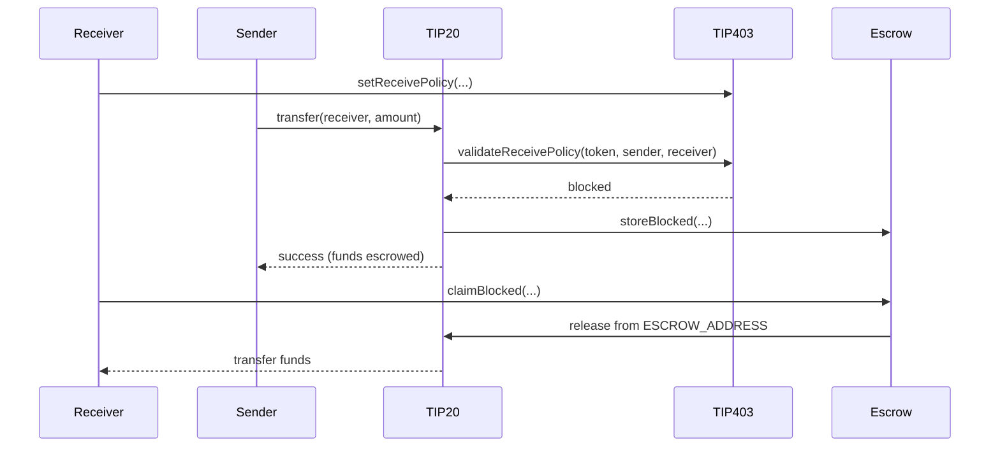
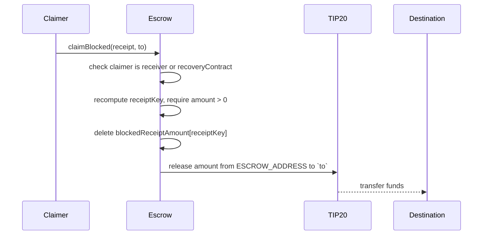

# TIP-1028: Address-Level Receive Policies

<br>

## Abstract

TIP-1028 extends TIP-403 with address-level receive policies, letting a receiver control which TIP-20 tokens they accept and who can send them.

When a receive policy blocks a TIP-20 transfer or mint, the operation still succeeds, but the funds go to `ESCROW_ADDRESS` instead of the receiver and an escrow receipt is recorded.

The receiver or a designated recovery contract can later claim these funds. Claims back to the receiver unwind the original inbound while claims to other addresses are treated as new transfers.

TIP-403 authorization checks are unchanged and continue to revert on failure. TIP-1028 policies only apply to TIP-20 precompile flows. Ordinary contracts and other precompiles are unaffected.

<br>

## Motivation

TIP-403 allows token issuers to control who may use a token, but it does not give receivers control over which transfers or mints they accept. However, receivers may wish to restrict incoming funds based on the sender or the token. For example:

- a regulated entity might wish to receive incoming transfers only from addresses held by individuals they have KYC'ed, 
- orchestrators  and exchanges may wish to receive only specific tokens at their deposit addresses to prevent unrecoverable funds.


If a receiver rejects transfers, sending them tokens will fail. This can cause swaps, payouts, and other operations to revert, even though the sender and token are valid.

TIP-1028 lets receivers filter incoming transfers without causing those transfers to fail. If a receiver blocks a transfer or mint, the call still succeeds and the funds are sent to escrow instead.

The receiver (or a recovery contract designated by the receiver) can claim those funds later. Each escrow entry keeps enough information to identify the original transfer, so it can be handled correctly offchain.

<br>

# Specification

TIP-1028 introduces three main changes:

- The TIP-403 precompile is extended to add per-address receive policies that define which tokens and senders are allowed to send to a given address. Receive policies are configured via newly added `setReceivePolicy(...)` and enforced via `validateReceivePolicy(...)` functions.
- A new escrow precompile is introduced that holds blocked funds at `ESCROW_ADDRESS` and records a receipt for each blocked transfer or mint, which can be claimed later by the receiver or a recovery contract.
- TIP-20 transfer and mint flows are updated to check receive policies before crediting a receiver. The existing TIP-20 checks (pause, balance, allowance) and the token-level TIP-403 / TIP-1015 checks still run first and continue to revert on failure. Only a receive policy failure diverts the funds to the escrow precompile, where a receipt is recorded.

The sequence diagram below shows the high level flow for a transfer that is blocked by a receive policy and later claimed from escrow.



<br>

## TIP-20 Operations

TIP-1028 applies to the following TIP-20 operations: `transfer`, `transferFrom`, `transferWithMemo`, `transferFromWithMemo`, `systemTransferFrom`, `mint`, `mintWithMemo`.

For each of these operations, TIP-20 checks the receiver's policy configuration before crediting them. It verifies whether the token is allowed by the receiver's token filter and whether the sender is allowed by the receiver's policy. For `transfer`, `transferFrom`, `transferWithMemo`, `transferFromWithMemo`, and `systemTransferFrom`, the policy checks the `from` parameter as the sender. For `mint` and `mintWithMemo`, the policy checks `msg.sender` as the sender.

If both checks pass, the transfer or mint proceeds as normal. If either check fails, the call still succeeds but the funds are sent to `ESCROW_ADDRESS` instead.

Token level checks controlled by the issuer (`TIP-403` / `TIP-1015`) are unchanged and continue to revert on failure.

Note that TIP-1028 only applies to the TIP-20 operations listed above. It does not apply to `approve`, `permit`, or `burn` and does not affect fee deposits or refunds via `transfer_fee_pre_tx` or `transfer_fee_post_tx`. Additionally, TIP-1028 does not interact with TIP-20 escrowed rewards or internal balances.

### TIP-1022 Interaction

If `to` is a TIP-1022 virtual address, it is resolved to its master address before any checks run. All receive policy checks use the master address. If resolution fails, the operation reverts as before.

If the transfer or mint is allowed, it follows normal TIP-1022 forwarding behavior. If it is blocked, the receipt is recorded for the master address while preserving the original `to` for attribution.

<br>

## Receive Policies

A receive policy defines which transfers and mints an address accepts. It controls two things:

- Which TIP-20 tokens are allowed.
- Which senders are allowed.

Receive policies are stored per address in the TIP-403 registry. Each address can configure:

- A TIP-403 policy (`receivePolicyId`) that defines which senders are allowed.
- A token filter (`tokenFilterId`) that defines which TIP-20 tokens are allowed.
- An optional `recoveryContract` that can claim blocked funds. If not set, only the receiver can claim directly.

If no receive policy is set, all transfers and mints are allowed.

Each address sets its receive policy using `setReceivePolicy(...)`.

When a TIP-20 transfer or mint executes, it calls `validateReceivePolicy(token, sender, receiver)` on TIP-403. This checks the token against the receiver's token filter and the sender against the receiver's policy.

If both checks pass, the transfer or mint proceeds as normal. If either check fails, the funds are sent to escrow.

### Receive Policy Storage Layout

TIP-403 stores receive policy configuration per address.

```solidity
mapping(address => uint256) public addressReceiveConfig;
mapping(address => address) public addressRecoveryContract;
```

`addressReceiveConfig[account]` is a packed `uint256` with the following layout:

| Bits | Size | Field |
|---|---:|---|
| `0` | 1 | `hasReceivePolicy` |
| `1..64` | 64 | `receivePolicyId` |
| `65..72` | 8 | `receivePolicyType` |
| `73..136` | 64 | `tokenFilterId` |
| `137..144` | 8 | `tokenFilterType` |
| `145..255` | 111 | reserved, MUST be zero |

When `hasReceivePolicy == 0`, the address has no receive policy and all transfers and mints are allowed. The cached type fields are valid because policy type and token filter type are immutable after creation.

`addressRecoveryContract[account]` stores the recovery contract for the address. If it is `address(0)`, the receiver claims blocked funds directly.

`recoveryContract` is stored separately because a 160-bit address does not fit in the packed config slot.

An address that wants to functionally disable filtering SHOULD set `receivePolicyId = 1` and `tokenFilterId = 1`. The slot remains allocated.

Constraints on `setReceivePolicy(...)`:

- `receivePolicyId` MUST reference a simple `WHITELIST` or `BLACKLIST` TIP-403 policy, or built-in policy `0` or `1`. `COMPOUND` policies are not valid.
- `tokenFilterId` MUST reference an existing token filter, or built-in `0` (reject all) or `1` (allow all).
- `recoveryContract` MAY be `address(0)`. If nonzero, it MUST NOT equal `ESCROW_ADDRESS` and MUST NOT be a TIP-1022 virtual address.
- The caller MUST NOT be a TIP-1022 virtual address. Virtual addresses are forwarding aliases and configure receive policies on their resolved master address.

<br>

## Sender Policies

A receive policy points at an existing TIP-403 policy through `receivePolicyId`. The sender side of receive checks reuses TIP-403 policy evaluation directly. A receiver can reuse an existing simple TIP-403 `WHITELIST` or `BLACKLIST` policy, create a new one through the existing TIP-403 interface, or use built-in policy `0` (reject all) or `1` (allow all).

`COMPOUND` policies are not valid for `receivePolicyId`. A receive check only asks one question: may this sender send to this receiver. A `COMPOUND` policy splits authorization across sender, transfer-recipient, and mint-recipient roles. Allowing `COMPOUND` would conflate those roles.

<br>

## Token Filters

Token filters control which TIP-20 tokens an address accepts. A receive policy references a token filter by `tokenFilterId`.

A token filter is a list of token addresses with either allowlist or denylist semantics:

- an allowlist filter allows only the listed tokens
- a denylist filter blocks the listed tokens

This is separate from TIP-403 address policies, which filter by sender. Token filters operate on the token itself.

```solidity
uint64 public tokenFilterIdCounter = 2; // 0 = reject all, 1 = allow all

struct TokenFilterData {
    PolicyType filterType; // WHITELIST or BLACKLIST
    address admin;
}

mapping(uint64 => TokenFilterData) internal _tokenFilterData;
mapping(uint64 => mapping(address => bool)) internal tokenFilterMembers;
```

Token filters are identified by an ID. `0` rejects all tokens and `1` allows all tokens. New filters are assigned incrementing IDs starting from `2`.

Token filters must satisfy the following:

- `filterType` is `WHITELIST` or `BLACKLIST`.
- `COMPOUND` token filters are forbidden.
- Filter type is immutable after creation.
- Membership is mutable by the filter admin.

`isTokenAllowed(tokenFilterId, token)` returns `false` for filter `0`, `true` for filter `1`, and otherwise reads the stored membership bit and applies it according to the filter's `filterType`.

<br>

## Receive Policy Evaluation

`validateReceivePolicy(token, sender, receiver)` returns whether a transfer or mint to `receiver` is allowed and, if not, why. If the receiver has not configured a receive policy (`hasReceivePolicy == 0`), it returns `(true, NONE)`. Otherwise it checks `token` against the receiver's token filter and `sender` against the receiver's receive policy, and returns one of `(true, NONE)` when both pass, `(false, TOKEN_FILTER)` when only the token filter rejects, `(false, RECEIVE_POLICY)` when only the receive policy rejects, or `(false, TOKEN_FILTER_AND_RECEIVE_POLICY)` when both reject.

The `BlockedReason` values used in the second return slot are:

```solidity
enum BlockedReason {
    NONE,
    TOKEN_FILTER,
    RECEIVE_POLICY,
    TOKEN_FILTER_AND_RECEIVE_POLICY
}
```

`NONE` is used only when the call is allowed. Blocked events MUST NOT use `NONE`.

<br>

## Escrow Precompile

The escrow precompile is a new system precompile that holds blocked funds and records a receipt for each blocked transfer or mint. It stores one keyed amount per open receipt. The rest of the receipt is emitted in the blocked event when the receipt is created and supplied as a witness at claim time.

### Escrow Address

```solidity
address constant ESCROW_ADDRESS = 0xE5C0000000000000000000000000000000000000;
```

The blocked balance for each TIP-20 token sits in that token's `balances[ESCROW_ADDRESS]` slot.

### Restrictions on `ESCROW_ADDRESS`

The following restrictions apply:

- A TIP-20 transfer or mint with `to == ESCROW_ADDRESS` MUST revert with `EscrowAddressReserved()`. This applies to `transfer`, `transferFrom`, `transferWithMemo`, `transferFromWithMemo`, `systemTransferFrom`, `mint`, and `mintWithMemo`.
- A reroute claim with `to == ESCROW_ADDRESS` MUST revert.
- `setReceivePolicy(...)` MUST reject `account == ESCROW_ADDRESS` and any `recoveryContract == ESCROW_ADDRESS`.
- Any TIP-20 logic that protects DEX or FeeManager balances as system balances MUST extend the same protection to `ESCROW_ADDRESS`.

The first zero-to-nonzero write to `balances[ESCROW_ADDRESS]` for a token can add roughly 250,000 gas to the first blocked transfer or mint. TIP-20 implementations SHOULD move that cost to deployment by initializing the slot when the token is created. One acceptable pattern is an implementation-private escrow reserve created at deployment that is not claimable by users or recovery contracts and is preserved by release and burn logic.

### Escrow Model

When a transfer or mint is blocked, the funds are credited to `ESCROW_ADDRESS` instead of the receiver. The escrow precompile records one receipt per blocked transfer or mint. Each receipt captures the full context of the blocked operation, including the original sender, the requested recipient, whether it was a transfer or mint, the memo, and the reason for blocking. This gives a claimer (or a recovery contract acting on the receiver's behalf) enough information to apply arbitrary rules when deciding whether and how to claim.

The receipt is identified by a `receiptKey` derived from these fields. The escrow precompile only stores the keyed amount per receipt. The other fields are emitted in the blocked event when the receipt is created, and the claimer supplies them again as a witness at claim time. This keeps onchain state minimal while letting recovery logic stay flexible.

### Escrow State

```solidity
uint8 public constant BLOCKED_RECEIPT_VERSION = 1;
uint64 public blockedReceiptNonce = 1;
mapping(bytes32 => uint256) internal blockedReceiptAmount;
```

The persistent escrow key for a blocked transfer or mint is:

```text
receiptKey = keccak256(
    abi.encode(
        receiptVersion,
        token,
        receiver,
        originator,
        requestedRecipient,
        recoveryContract,
        blockedReason,
        kind,
        memo,
        blockedAt,
        blockedNonce
    )
)
```

where:

- `receiptVersion`: one-byte bucketing tag. MUST be `1` for receipts created under this TIP. Future receipt-key formats MUST use a different value.
- `token`: the TIP-20 token whose balance ledger holds the blocked amount at `ESCROW_ADDRESS`.
- `receiver`: the canonical TIP-20 holder that owns the receipt. For TIP-1022 inbounds this is the resolved master address.
- `originator`: `from` for transfers, `msg.sender` for mints.
- `requestedRecipient`: the literal `to` supplied at the TIP-20 entrypoint. For non-virtual inbounds, `requestedRecipient == receiver`.
- `recoveryContract`: the receiver's recovery contract at the time the receipt was created, or `address(0)`.
- `blockedReason`: `TOKEN_FILTER`, `RECEIVE_POLICY`, or `TOKEN_FILTER_AND_RECEIVE_POLICY`.
- `kind`: `TRANSFER` or `MINT`.
- `memo`: original memo for memo-bearing paths, `bytes32(0)` otherwise.
- `blockedAt`: block timestamp captured at receipt creation.
- `blockedNonce`: monotonically increasing global disambiguator assigned at receipt creation.

`blockedReceiptAmount[receiptKey]` stores the full amount for that open receipt.

Storing one fine-grained receipt per blocked transfer or mint is more expensive than aggregating, but it preserves the literal `requestedRecipient` for TIP-1022 attribution, the original `originator`, the `blockedAt`, the transfer-vs-mint distinction, and the memo and reason data needed for programmable recovery rules. Persistent state stays minimal: one keyed amount per receipt. The richer fields live in the witness and the blocked event.

The escrow precompile does not enumerate receipts onchain. Claimers MUST supply the receipt witness for the receipt they want to consume, typically by indexing the blocked events offchain.

### Storing Blocked Transfers and Mints

When `validateReceivePolicy(...)` returns blocked, the TIP-20 path credits `ESCROW_ADDRESS` instead of the receiver, then calls `storeBlocked(...)`. The escrow precompile assigns the receipt's `blockedAt` and `blockedNonce`, computes `receiptKey`, sets `blockedReceiptAmount[receiptKey] = amount`, and returns the assigned `(blockedNonce, blockedAt)` to the caller. The TIP-20 path then emits the raw `Transfer` (and `Mint`, for mint paths) event naming `ESCROW_ADDRESS` as the recipient, followed by the matching `TransferBlocked` or `MintBlocked` attribution event with `blockedReason != NONE`. Memo-bearing variants preserve the original memo in the attribution event.

`storeBlocked(...)` MUST be callable only by TIP-20 precompiles or protocol-internal system code. User callers MUST NOT be able to fabricate receipts. Without this restriction, an attacker could mint synthetic receipts by replaying or fabricating witnesses without any backing escrow balance.

### Claiming

A claim consumes one full receipt and releases the funds to a single destination. `claimBlocked(...)` takes the receipt witness and a destination `to`, recomputes `receiptKey`, requires `blockedReceiptAmount[receiptKey] > 0`, deletes the slot, and releases the stored amount. Partial claims are not allowed. Claims MUST consume whole receipts.

The release path inside the TIP-20 token debits `balances[ESCROW_ADDRESS]`, credits the destination, emits `Transfer(ESCROW_ADDRESS, to, amount)`, bypasses the token-level TIP-403 sender check for `ESCROW_ADDRESS`, and treats `ESCROW_ADDRESS` as a reward-exempt always-opted-out source.

The receipt witness only tells the escrow which receipt to consume. It does not grant any right to claim. Claim rights flow from the receiver or the snapshotted recovery contract. Blocked events are public, so anyone can build a valid witness, but only the authorized claimer may call `claimBlocked(...)`.

Each receipt is governed by the `recoveryContract` captured for that receipt at block time. If the captured `recoveryContract` is `address(0)`, only `receiver` may call `claimBlocked(...)` for that receipt. If it is nonzero, only that contract may call it. Changing `addressRecoveryContract[receiver]` affects future receipts only. Existing receipts remain governed by the recovery contract captured in their key, so receivers that rotate `recoveryContract` SHOULD keep the previous contract callable until receipts keyed to it are drained. Any delegate whitelist, originator self-claim, multisig approval, timelock, or batching is the responsibility of the recovery contract.

The destination `to` decides whether the claim is an **unwind** back to the receiver or a **reroute** to a new address. The two cases differ only in what they enforce on the destination side.

When `to == receiver`, the claim is an unwind of a previously authorized inbound. It bypasses the receiver's receive policy, token-level recipient authorization for the receiver, and AccountKeychain spending-limit metering. This is intentional. A blocked mint, for example, has already passed the token's original mint-recipient check on the inbound path. Releasing escrow back to the same receiver is not a new transfer and MUST NOT be rechecked against transfer-recipient authorization.

When `to != receiver`, the claim is a reroute and is treated as a new spend by the receiver. The reroute MUST reject `to == ESCROW_ADDRESS` and TIP-1022 virtual addresses, enforce token-level transfer-recipient authorization for `to`, and enforce `to`'s receive policy against the consumed receipt's `originator`. If either destination check fails, the call MUST revert with `ClaimDestinationUnauthorized()`. If `recoveryContract == address(0)` and the reroute is initiated through an access key, the claim MUST meter the claimed amount against the receiver's AccountKeychain spending limit as an ordinary TIP-20 spend by the receiver. If the receiver uses a custom `recoveryContract`, any equivalent delegation, timelock, multisig, or key-policy enforcement is the responsibility of that contract.

The sequence diagram below shows the high level flow for a claim.



<br>

## Events and Errors

### Receive Policy Events

```solidity
event ReceivePolicyUpdated(
    address indexed account,
    uint64 receivePolicyId,
    uint64 tokenFilterId,
    address recoveryContract
);
```

### Token Filter Events

```solidity
event TokenFilterCreated(uint64 indexed tokenFilterId, address indexed creator, PolicyType filterType);
event TokenFilterAdminUpdated(uint64 indexed tokenFilterId, address indexed updater, address indexed admin);
event TokenFilterWhitelistUpdated(uint64 indexed tokenFilterId, address indexed updater, address indexed token, bool allowed);
event TokenFilterBlacklistUpdated(uint64 indexed tokenFilterId, address indexed updater, address indexed token, bool restricted);
```

### Escrow Events

```solidity
event TransferBlocked(
    address indexed token,
    address indexed from,
    address indexed receiver,
    uint8 receiptVersion,
    uint64 blockedNonce,
    uint64 blockedAt,
    address requestedRecipient,
    uint256 amount,
    BlockedReason blockedReason,
    address recoveryContract,
    bytes32 memo
);

event MintBlocked(
    address indexed token,
    address indexed operator,
    address indexed receiver,
    uint8 receiptVersion,
    uint64 blockedNonce,
    uint64 blockedAt,
    address requestedRecipient,
    uint256 amount,
    BlockedReason blockedReason,
    address recoveryContract,
    bytes32 memo
);

event BlockedReceiptClaimed(
    address indexed token,
    address indexed receiver,
    uint8 receiptVersion,
    uint64 indexed blockedNonce,
    uint64 blockedAt,
    address originator,
    address requestedRecipient,
    address recoveryContract,
    address caller,
    address to,
    uint256 amount
);
```

### Errors

```solidity
error InvalidReceivePolicyType();
error InvalidRecoveryContract();
error TokenFilterNotFound();
error InvalidTokenFilterType();
error TokenFilterBatchLengthMismatch();
error EscrowAddressReserved();
error UnauthorizedClaimer();
error InvalidReceiptClaim();
error ClaimDestinationUnauthorized();
error InsufficientEscrowBalance();
```

A successful claim MUST emit exactly one `BlockedReceiptClaimed` event for the consumed receipt.

<br>

## Interfaces

### TIP-403 Receive Policy Interface

```solidity
interface IReceivePolicies {
    function setReceivePolicy(
        uint64 receivePolicyId,
        uint64 tokenFilterId,
        address recoveryContract
    ) external;

    function receivePolicy(address account)
        external
        view
        returns (
            bool hasReceivePolicy,
            uint64 receivePolicyId,
            PolicyType receivePolicyType,
            uint64 tokenFilterId,
            PolicyType tokenFilterType,
            address recoveryContract
        );

    function validateReceivePolicy(address token, address sender, address receiver)
        external
        view
        returns (bool authorized, BlockedReason blockedReason);
}
```

Implementations SHOULD read `addressRecoveryContract[receiver]` only after `validateReceivePolicy(...)` returns `authorized = false`.

### TIP-403 Token Filter Interface

```solidity
interface ITokenFilters {
    function createTokenFilter(address admin, PolicyType filterType)
        external
        returns (uint64 newTokenFilterId);

    function createTokenFilterWithTokens(
        address admin,
        PolicyType filterType,
        address[] calldata tokens
    ) external returns (uint64 newTokenFilterId);

    function setTokenFilterAdmin(uint64 tokenFilterId, address admin) external;

    function modifyTokenFilterWhitelist(uint64 tokenFilterId, address token, bool allowed) external;
    function modifyTokenFilterBlacklist(uint64 tokenFilterId, address token, bool restricted) external;

    function modifyTokenFilterWhitelistBatch(
        uint64 tokenFilterId,
        address[] calldata tokens,
        bool[] calldata allowed
    ) external;

    function modifyTokenFilterBlacklistBatch(
        uint64 tokenFilterId,
        address[] calldata tokens,
        bool[] calldata restricted
    ) external;

    function isTokenAllowed(uint64 tokenFilterId, address token) external view returns (bool);
    function tokenFilterExists(uint64 tokenFilterId) external view returns (bool);
    function tokenFilterData(uint64 tokenFilterId)
        external
        view
        returns (PolicyType filterType, address admin);
}
```

### Escrow Interface

```solidity
interface IBlockedInboundEscrow {
    enum InboundKind {
        TRANSFER,
        MINT
    }

    struct ClaimReceipt {
        uint8 receiptVersion;
        address originator;
        address requestedRecipient;
        uint64 blockedAt;
        uint64 blockedNonce;
        BlockedReason blockedReason;
        InboundKind kind;
        bytes32 memo;
    }

    function blockedReceiptBalance(
        address token,
        address receiver,
        address recoveryContract,
        ClaimReceipt calldata receipt
    ) external view returns (uint256 amount);

    function claimBlocked(
        address token,
        address receiver,
        address recoveryContract,
        ClaimReceipt calldata receipt,
        address to
    ) external;

    function storeBlocked(
        address token,
        address originator,
        address receiver,
        address requestedRecipient,
        address recoveryContract,
        uint256 amount,
        BlockedReason blockedReason,
        InboundKind kind,
        bytes32 memo
    ) external returns (uint64 blockedNonce, uint64 blockedAt);
}
```

<br>

## Invariants

- For every TIP-20 token, `balances[ESCROW_ADDRESS]` equals exactly the sum of `blockedReceiptAmount[receiptKey]` over all open receipts for that token.
