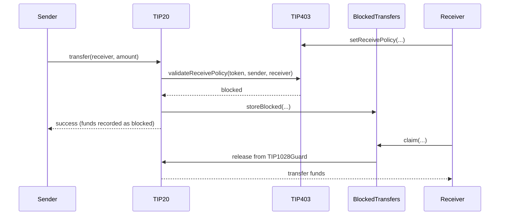
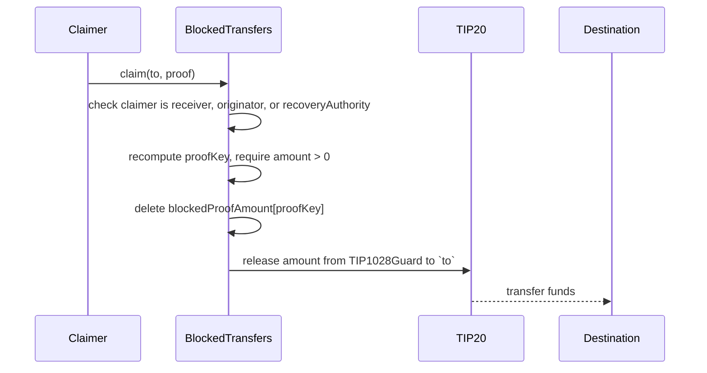

# TIP-1028: Address-Level Receive Policies

<br>

## Abstract

TIP-1028 extends TIP-403 with address-level receive policies, letting a receiver control which TIP-20 tokens they accept and who can send them.

When a user's receive policy blocks an inbound TIP-20 transfer, delivery is redirected to `TIP1028Guard`, a proof is recorded, and the amount becomes claimable by the recovery authority designated by the user.

The user's receive policy specifies the recovery authority able to claim a blocked transfer: this could be the originator of the funds, the receiver (user) themselves, or a designated third party. `TIP1028Guard` acts as a protocol-level extension of the recovery authority's address space for this limited purpose: although the blocked amount is recorded at the `TIP1028Guard` address until claimed, the user-designated recovery authority has control of those funds and can always claim them by submitting a valid proof.

A claim resumes the original inbound only when the blocked amount is claimed to the original receiver by a third-party recovery authority designated by the receiver, or by the receiver themselves. Claims made by the originator are always reroutes.

TIP-403 authorization checks are unchanged and continue to revert on failure. TIP-1028 policies only apply to TIP-20 precompile flows. Ordinary contracts and other precompiles are unaffected.

<br>

## Motivation

TIP-403 allows token issuers to control who may use a token, but it does not give receivers control over which transfers or mints they accept. However, receivers may wish to restrict incoming funds based on the sender or the token. For example:

- A regulated entity might wish to receive incoming transfers only from addresses held by individuals they have KYC'ed,
- Orchestrators and exchanges may wish to receive only specific tokens at their deposit addresses to prevent unrecoverable funds.

If a receiver rejects transfers, sending them tokens will fail. This can cause swaps, payouts, and other operations to revert, even though the sender and token are valid.

TIP-1028 lets receivers filter incoming transfers without causing those transfers to fail. If a receiver blocks a transfer or mint, the call still succeeds and delivery is redirected to `TIP1028Guard`.

Every blocked amount is tracked by a proof that directly attributes it to the recovery authority designated by the receiver. The receiver, the originator, or a third-party recovery authority can claim those funds later, depending on the receiver's policy. Each blocked transfer record keeps enough information to identify the original transfer, so it can be handled correctly.

<br>

# Specification

TIP-1028 introduces three main changes:

- The TIP-403 precompile is extended to add per-address receive policies that define which tokens and senders are allowed to send to a given address. Receive policies are configured via newly added `setReceivePolicy(...)` and enforced via `validateReceivePolicy(...)` functions.
- A new precompile for blocked transfers is introduced at `BLOCKED_TRANSFER_ADDRESS` and records a receipt for each blocked transfer or mint, which can be claimed later by the receiver, the originator, or a recovery authority.
- TIP-20 transfer and mint flows are updated to check receive policies before crediting a receiver. The existing TIP-20 checks (pause, balance, allowance) and the token-level TIP-403 / TIP-1015 checks still run first and continue to revert on failure. Only a receive policy failure redirects delivery to `TIP1028Guard`, where a proof is recorded.

The sequence diagram below shows the high level flow for a transfer that is blocked by a receive policy and later claimed from the blocked transfers precompile.



<br>

## TIP-20 Operations

TIP-1028 applies to the following TIP-20 operations: `transfer`, `transferFrom`, `transferWithMemo`, `transferFromWithMemo`, `systemTransferFrom`, `mint`, `mintWithMemo`.

For each of these operations, TIP-20 checks the receiver's policy configuration before crediting them. It verifies whether the token is allowed by the receiver's token filter and whether the sender is allowed by the receiver's policy. For `transfer`, `transferFrom`, `transferWithMemo`, `transferFromWithMemo`, and `systemTransferFrom`, the policy checks the `from` parameter as the sender. For `mint` and `mintWithMemo`, the policy checks `msg.sender` as the sender.

If both checks pass, the transfer or mint proceeds as normal. If either check fails, the call still succeeds but delivery is redirected to `TIP1028Guard` instead.

Token level checks controlled by the issuer (`TIP-403` / `TIP-1015`) are unchanged and continue to revert on failure.

Note that TIP-1028 only applies to the TIP-20 operations listed above. It does not apply to `approve`, `permit`, or `burn` and does not affect fee deposits or refunds via `transfer_fee_pre_tx` or `transfer_fee_post_tx`. Additionally, TIP-1028 does not interact with TIP-20 rewards or internal balances.

### TIP-1022 Interaction

If `to` is a TIP-1022 virtual address, it is resolved to its master address before any checks run. All receive policy checks use the master address. If resolution fails, the operation reverts as before.

If the transfer or mint is allowed, it follows normal TIP-1022 forwarding behavior. If it is blocked, the proof is recorded for the master address while preserving the original `to` for attribution.

<br>

## Receive Policies

A receive policy defines which transfers and mints an address accepts. It controls two things:

- Which TIP-20 tokens are allowed.
- Which senders are allowed.

Receive policies are stored per address in the TIP-403 registry. Conceptually, each account has:

```text
ReceivePolicy(account) = (
    senderPolicyId,    // TIP-403 policy ref indicating which senders are allowed
    tokenFilterId,     // TIP-403 policy ref indicating which TIP-20 tokens are allowed
    recoveryAuthority   // address(0), address(1), or a third-party address
)
```

`recoveryAuthority` selects who can claim future blocked proofs: `address(0)` means the transfer originator (i.e., where the funds came from), `address(1)` is a sentinel meaning the receiver, and any other address names a third-party recovery authority. Since uninitialized storage defaults to zero, the originator is the default claimer when a receive policy is set without an explicit recovery authority.

If no receive policy is set, all transfers and mints are allowed.

Each address sets its receive policy using `setReceivePolicy(...)`.

When a TIP-20 transfer or mint executes, it calls `validateReceivePolicy(token, sender, receiver)` on TIP-403. This checks the token against the receiver's token filter and the sender against the receiver's policy.

If both checks pass, the transfer or mint proceeds as normal. If either check fails, delivery is redirected to `TIP1028Guard` and the blocked amount is attributed to the designated recovery authority.

### Receive Policy Storage Layout

TIP-403 stores receive policy configuration per address.

```solidity
mapping(address => uint256) public addressReceiveConfig;
mapping(address => address) public addressRecoveryAuthority;
```

`addressReceiveConfig[account]` is a packed `uint256` with the following layout:

| Bits | Size | Field |
|---|---:|---|
| `0` | 1 | `hasReceivePolicy` |
| `1..64` | 64 | `senderPolicyId` |
| `65..72` | 8 | `senderPolicyType` |
| `73..136` | 64 | `tokenFilterId` |
| `137..144` | 8 | `tokenFilterType` |
| `145..255` | 111 | reserved, MUST be zero |

When `hasReceivePolicy == 0`, the address has no receive policy and all transfers and mints are allowed. The cached type fields are valid because policy type and token filter type are immutable after creation.

`addressRecoveryAuthority[account]` stores the encoded recovery authority for the address. `address(0)` selects originator recovery (the default for uninitialized storage), `address(1)` is reserved as a receiver-recovery sentinel, and any other address selects that third-party address or contract.

`recoveryAuthority` is stored separately because a 160-bit address does not fit in the packed config slot.

An address that wants to functionally disable filtering SHOULD set `senderPolicyId = 1` and `tokenFilterId = 1`. The slot remains allocated.

Constraints on `setReceivePolicy(...)`:

- `senderPolicyId` MUST reference a simple `WHITELIST` or `BLACKLIST` TIP-403 policy, or built-in policy `0` or `1`. `COMPOUND` policies are not valid.
- `tokenFilterId` MUST reference a simple `WHITELIST` or `BLACKLIST` TIP-403 policy, or built-in policy `0` or `1`. `COMPOUND` policies are not valid.
- The caller MUST NOT be a TIP-1022 virtual address. Virtual addresses are forwarding aliases and the user should instead configure receive policies on their resolved master address.
- `recoveryAuthority` MUST be `address(0)`, `address(1)`, or another literal address. Other literal addresses are treated as third-party recovery authorities. They MUST NOT be `TIP1028Guard`, TIP-1022 virtual addresses, or system precompile addresses that cannot initiate calls.

<br>

## Sender Policies

A receive policy points at an existing TIP-403 policy through `senderPolicyId`. The sender side of receive checks reuses TIP-403 policy evaluation directly. A receiver can reuse an existing simple TIP-403 `WHITELIST` or `BLACKLIST` policy, create a new one through the existing TIP-403 interface, or use built-in policy `0` (reject all) or `1` (allow all).

`COMPOUND` policies are not valid for `senderPolicyId`. A receive check only asks one question: may this sender send to this receiver. A `COMPOUND` policy splits authorization across sender, transfer-recipient, and mint-recipient roles. Allowing `COMPOUND` would conflate those roles.

<br>

## Token Filters

Token filters use the existing TIP-403 `PolicyData` and policy membership set. A receive policy references one by `tokenFilterId`, and the policy's members are interpreted as TIP-20 token addresses.

The registry does not need to validate that policy members are TIP-20 contracts. Non-token addresses in a token filter are inert configuration mistakes.

<br>

## Receive Policy Evaluation

`validateReceivePolicy(token, sender, receiver)` returns whether a transfer or mint to `receiver` is allowed and, if not, why. If the receiver has not configured a receive policy (`hasReceivePolicy == 0`), it returns `(true, NONE)`.

Otherwise, evaluation uses a fixed order and short-circuits on the first failed check:

1. Check `token` against the receiver's token filter. If this rejects, return `(false, TOKEN_FILTER)`.
2. Check `sender` against the receiver's receive policy. If this rejects, return `(false, RECEIVE_POLICY)`.
3. If both checks pass, return `(true, NONE)`.

If both the token filter and sender policy would reject, `TOKEN_FILTER` is returned because the token filter is the first canonical check.

The `BlockedReason` values used in the second return slot are:

```solidity
enum BlockedReason {
    NONE,
    TOKEN_FILTER,
    RECEIVE_POLICY
}
```

`NONE` is used only when the call is allowed. Blocked events MUST NOT use `NONE`.

<br>

## Blocked Transfers Precompile

The blocked transfers precompile tracks blocked inbound TIP-20 transfers and mints by proof key. Each proof captures the designated recovery authority, so every blocked amount remains directly attributable even though all blocked balances are recorded at the shared `BLOCKED_TRANSFER_ADDRESS` until claimed. Proof fields not stored onchain are emitted in the blocked event and supplied as a witness at claim time.

### Blocked Transfers Address

```solidity
address constant BLOCKED_TRANSFER_ADDRESS = 0xB10C000000000000000000000000000000000000;
```

The aggregate blocked balance for each TIP-20 token sits in that token's `balances[BLOCKED_TRANSFER_ADDRESS]` slot.

### Restrictions on `TIP1028_GUARD_ADDRESS`

The following restrictions apply:

- A TIP-20 transfer or mint with `to == TIP1028_GUARD_ADDRESS` MUST revert with `AddressReserved()`. This applies to `transfer`, `transferFrom`, `transferWithMemo`, `transferFromWithMemo`, `systemTransferFrom`, `mint`, and `mintWithMemo`.
- A reroute claim with `to == TIP1028_GUARD_ADDRESS` MUST revert.
- `setReceivePolicy(...)` MUST reject `account == TIP1028_GUARD_ADDRESS`.
- The TIP-20 `burnBlocked` function MUST revert when `from == TIP1028_GUARD_ADDRESS`. Funds leave `TIP1028Guard` only by claiming a proof. Burning the `TIP1028_GUARD_ADDRESS` balance directly would leave proofs pointing at money that no longer exists.

Without intervention, the first blocked transfer or mint for a token would pay an unexpected cold-sstore surcharge (~250,000 gas) for the zero-to-nonzero write to `balances[TIP1028_GUARD_ADDRESS]`, charged to whichever user happens to trigger the first block. To avoid this, the TIP-20 initializer MUST charge the deployer a one-time fee equivalent to a cold sstore on the token's `balances[TIP1028_GUARD_ADDRESS]` slot, and every subsequent write to `balances[TIP1028_GUARD_ADDRESS]` for that token MUST be priced as a warm sstore. No tokens are minted to `TIP1028Guard` at deployment and no implementation-private reserve is required; the cold cost is paid exactly once, at deploy time, by the issuer.

### Blocked Transfer Model

When a transfer or mint is blocked, the funds are credited to `TIP1028_GUARD_ADDRESS` instead of the receiver. The blocked transfers precompile records one proof per blocked transfer or mint. Each proof captures the full context of the blocked operation, including the original sender, the requested recipient, whether it was a transfer or mint, the memo, and the reason for blocking. This gives the authorized claimer enough information to decide whether and how to claim.

The proof is identified by a `proofKey` derived from these fields. The blocked transfers precompile stores the keyed amount per proof, so the aggregate balance at `TIP1028_GUARD_ADDRESS` is always decomposable into amounts attributed to specific proofs. The other fields are emitted in the blocked event when the proof is created, and the claimer supplies them again as a witness at claim time. This keeps onchain state minimal while letting recovery logic stay flexible.

### Blocked Transfer State

```solidity
uint8 public constant PROOF_VERSION = 1;
uint64 public nonce = 1;
mapping(bytes32 => uint256) internal balanceOf;
```

Each blocked transfer or mint is identified by a `proofKey`. The encoded proof is self-describing so claim and balance lookups bind the token, version, and recovery authority to the witness itself. v1 uses this proof body:

```solidity
struct ClaimProofV1 {
    uint8 version;
    address token;
    address recoveryAuthority;
    address originator;
    address recipient;
    uint64 blockedAt;
    uint64 blockedNonce;
    BlockedReason blockedReason;
    InboundKind kind;
    bytes32 memo;
}
```

The v1 `proof` is computed as:

```text
proofKey = keccak256(abi.encode(proof))
```

where:

- `version`: one-byte discriminator inside the proof. MUST be `1` for proofs created under this TIP. Future proof-key formats MUST use a different value and MAY define a different version-specific proof body.
- `token`: the TIP-20 token whose balance ledger holds the blocked amount at `TIP1028_GUARD_ADDRESS`.
- `recoveryAuthority`: the encoded recovery authority captured when the proof was created: `address(0)` for originator recovery (default), `address(1)` as a receiver-recovery sentinel, or a third-party address.
- `originator`: `from` for transfers, `msg.sender` for mints.
- `recipient`: the literal `to` supplied at the TIP-20 entrypoint. For non-virtual inbounds this is the receiver itself; for TIP-1022 inbounds this is the virtual alias. The canonical owner is derived at claim time as `tip1022.resolve(recipient)`, which is deterministic.
- `blockedReason`: `TOKEN_FILTER` or `RECEIVE_POLICY`.
- `kind`: `TRANSFER` or `MINT`.
- `memo`: original memo for memo-bearing paths, `bytes32(0)` otherwise.
- `blockedAt`: block timestamp captured at proof creation.
- `blockedNonce`: monotonically increasing global disambiguator assigned at proof creation.

`balanceOf[proofKey]` stores the full amount for that open proof.

Storing one fine-grained proof per blocked transfer or mint is more expensive than aggregating, but it preserves the literal `recipient` for TIP-1022 attribution, the original `originator`, the `blockedAt`, the transfer-vs-mint distinction, and the memo and reason data needed for programmable recovery rules. The resolved master is intentionally not stored: it is a deterministic function of `recipient` and is recomputed when needed at claim time and offchain. Persistent state stays minimal: one keyed amount per proof. The richer fields live in the witness and the blocked event.

The blocked transfers precompile does not enumerate proofs onchain. Claimers MUST supply the proof they want to consume, typically by indexing the blocked events offchain.

### Storing Blocked Transfers and Mints

When `validateReceivePolicy(...)` returns blocked, the TIP-20 path credits `TIP1028_GUARD_ADDRESS` instead of the receiver, then calls `storeBlocked(...)`. The blocked transfers precompile assigns the proof's `blockedAt` and `blockedNonce`, computes `proofKey`, sets `blockedProofAmount[proofKey] = amount`, and returns the assigned `(blockedNonce, blockedAt)` to the caller. A blocked transfer emits the regular `Transfer` event naming `TIP1028Guard` as the recipient, then emits `TransferBlocked(...)`; a blocked mint emits the regular `Transfer` and `Mint` events naming `TIP1028Guard` as the recipient, then emits `TransferBlocked(...)` with `kind = MINT`. Memo-bearing variants preserve the original memo in the attribution event.

`storeBlocked(...)` MUST be callable only by TIP-20 precompiles or protocol-internal system code. User callers MUST NOT be able to fabricate proofs. Without this restriction, an attacker could mint synthetic proofs by replaying or fabricating witnesses without any backing `TIP1028Guard` balance.

### Claiming

A claim consumes one full proof and releases the funds to a single destination. `claim(...)` takes an encoded proof and a destination `to`. For `proof.version == 1`, it decodes the witness as `ClaimProofV1`, derives the canonical receiver as `tip1022.resolve(proof.recipient)`, recomputes `proofKey`, requires `blockedProofAmount[proofKey] > 0`, zeroes the slot to free its storage, and releases the stored amount from `proof.token`. Once consumed, a proof is permanently retired: its `proofKey` slot is empty and any subsequent claim against the same witness MUST revert with `InvalidProof()`. Partial claims are not allowed. Claims MUST consume whole proofs.

The release path inside the TIP-20 token debits `balances[TIP1028Guard]`, credits the destination, emits `Transfer(TIP1028Guard, to, amount)` followed by `ProofClaimed(...)`, bypasses the token-level TIP-403 sender check for `TIP1028Guard`, and treats `TIP1028Guard` as a reward-exempt always-opted-out source. Releasing a previously blocked mint does not emit a fresh `Mint` event because the claim is a transfer out of blocked transfers precompile, not a new mint.

The proof only tells the blocked transfers precompile which proof to consume. It does not grant any right to claim. Claim rights flow from the snapshotted recovery authority. Blocked events are public, so anyone can build a valid witness, but only the authorized claimer may call `claim(...)`.

Each proof is governed by the `recoveryAuthority` captured for that proof at block time:

- if `recoveryAuthority == address(0)`, only `proof.originator` may call `claim(...)`;
- if `recoveryAuthority == address(1)`, only `receiver` may call `claim(...)`; and
- otherwise, only `recoveryAuthority` may call `claim(...)`.

For transfer-like proofs, `originator` is `from`, including for `transferFrom` where `from` may differ from `msg.sender`. For mint proofs, `originator` is the mint caller. An originator-authorized claim of a blocked mint is a reroute of minted supply, not a refund.

Changing `addressRecoveryAuthority[receiver]` affects future proofs only. Existing proofs remain governed by the recovery authority captured in their key. If a receiver configures originator recovery and the originator is a system or protocol address that cannot call blocked transfers precompile, the proof may be unclaimable; this is a receiver configuration risk. If a receiver configures a third-party authority, that address or contract is responsible for any delegate whitelist, multisig approval, timelock, batching, or other arbitration policy.

The destination `to` and the proof's `recoveryAuthority` decide whether the claim **resumes** the original transfer back to the receiver or **reroutes** it to a new address.

When `recoveryAuthority != address(0)` and `to == receiver`, the claim resumes a previously authorized inbound. It bypasses the receiver's receive policy, token-level recipient authorization for the receiver, and AccountKeychain spending-limit metering. This is intentional. A blocked mint, for example, has already passed the token's original mint-recipient check on the inbound path. Releasing the blocked amount back to the same receiver is not a new transfer and MUST NOT be rechecked against the recipient's receive policy. A third-party recovery authority may use this resume path because the receiver selected that authority.

All other claims are reroutes. This includes every originator-authorized claim, even if `to == receiver`. A reroute MUST reject `to == TIP1028_GUARD_ADDRESS`. If `to` is a TIP-1022 virtual address, it is resolved to its master address before destination checks and final credit; if resolution fails, the call MUST revert with `InvalidClaimAddress()`. The reroute enforces token-level transfer-recipient authorization and receive policy checks against the resolved destination, using the consumed proof's `originator` for the receive policy check. If either destination check fails, the call MUST revert with `InvalidClaimAddress()`. The `ProofClaimed` event preserves the literal `to` supplied by the caller for attribution. If a direct receiver-authorized reroute is initiated through an access key, the claim MUST meter the claimed amount against the receiver's AccountKeychain spending limit as an ordinary TIP-20 spend by the receiver. If an originator-authorized reroute is initiated through an access key, it MUST meter against the originator. If the receiver uses a third-party recovery authority, any equivalent delegation, timelock, multisig, or key-policy enforcement is the responsibility of that authority.

The sequence diagram below shows the high level flow for a claim.



For previously blocked virtual transfers, `receiver` is the resolved `master`, so resume releases directly to `master` without a forwarding leg. The original virtual target is preserved in the `ProofClaimed.recipient` field for attribution.

<br>

## Events and Errors

### Receive Policy Events

```solidity
event ReceivePolicyUpdated(
    address indexed account,
    uint64 senderPolicyId,
    uint64 tokenFilterId,
    address recoveryAuthority
);
```

### Token Filter Events

Token filters use the existing TIP-403 policy events: `PolicyCreated`, `PolicyAdminUpdated`, `WhitelistUpdated`, and `BlacklistUpdated`. TIP-1028 does not add dedicated token-filter events.

### BlockedTransfers Events

```solidity
event TransferBlocked(
    address indexed token,
    address indexed from,
    address indexed receiver,
    uint8 proofVersion,
    uint64 blockedNonce,
    uint64 blockedAt,
    address recipient,
    uint256 amount,
    BlockedReason blockedReason,
    address recoveryAuthority,
    bytes32 memo
);

event ProofClaimed(
    address indexed token,
    address indexed receiver,
    uint8 proofVersion,
    uint64 indexed blockedNonce,
    uint64 blockedAt,
    address originator,
    address recipient,
    address recoveryAuthority,
    address caller,
    address to,
    uint256 amount
);
```

### Errors

```solidity
error InvalidReceivePolicyType();
error InvalidRecoveryAuthority();
error InvalidProof();
error InvalidClaimAddress();
error UnauthorizedClaimer();
error AddressReserved();
```

A successful claim MUST emit exactly one `ProofClaimed` event for the consumed proof.

<br>

## Interfaces

### TIP-403 Receive Policy Interface

```solidity
interface IReceivePolicies {
    function setReceivePolicy(
        uint64 senderPolicyId,
        uint64 tokenFilterId,
        address recoveryAuthority
    ) external;

    function receivePolicy(address account)
        external
        view
        returns (
            bool hasReceivePolicy,
            uint64 senderPolicyId,
            PolicyType senderPolicyType,
            uint64 tokenFilterId,
            PolicyType tokenFilterType,
            address recoveryAuthority
        );

    function validateReceivePolicy(address token, address sender, address receiver)
        external
        view
        returns (bool authorized, BlockedReason blockedReason);
}
```

Implementations SHOULD read `addressRecoveryAuthority[receiver]` only after `validateReceivePolicy(...)` returns `authorized = false`.

Token filters are managed through the existing TIP-403 policy interface. TIP-1028 does not add a dedicated token-filter interface.

### BlockedTransfers Interface

```solidity
interface ITIP1028Guard {
    enum InboundKind {
        TRANSFER,
        MINT
    }

    struct ClaimProofV1 {
        uint8 version;
        address token;
        address recoveryAuthority;
        address originator;
        address recipient;
        uint64 blockedAt;
        uint64 blockedNonce;
        BlockedReason blockedReason;
        InboundKind kind;
        bytes32 memo;
    }

    function balanceOf(bytes calldata proof) external view returns (uint256 amount);

    function claim(address to, bytes calldata proof) external;

    function storeBlocked(
        address token,
        address originator,
        address receiver,
        address recipient,
        address recoveryAuthority,
        uint256 amount,
        BlockedReason blockedReason,
        InboundKind kind,
        bytes32 memo
    ) external returns (uint64 blockedNonce, uint64 blockedAt);
}
```

<br>
## Alternatives Considered

During the design of this TIP, two alternate designs were considered that would not involve a smart contract, namely:

- reverting the transaction that effects a send which is disallowed by the receiver's policy, and
- bouncing back a transfer when disallowed by the receiver's policy.

While these would be conceptually simpler, they raise several issues. For example, the standard ERC-20 (and by extension TIP-20) model is that when the sender has sufficient balance and the parties are allowed by the token issuer, a transfer succeeds. As a result, several smart contracts may break in unexpected ways from reverts when failing receive policy. Similarly a single receiver setting a receive policy may invalidate a batch transfer, e.g., a payroll run. Bouncebacks suffer from similar issues.  Having the transfer succeed but as a new proof in the blocked transfer smart contract rather than the address intended by the sender is thus both less disruptive, and also unlocks additional functionality.  for example, as described above, a regulated party can individually screen, off-chain, every blocked transfer and then proceed to claim only the ones that succeed this screening.

## Invariants

- For every TIP-20 token, `balances[TIP1028_GUARD_ADDRESS]` equals exactly the sum of `blockedProofAmount[proofKey]` over all open proofs for that token.
