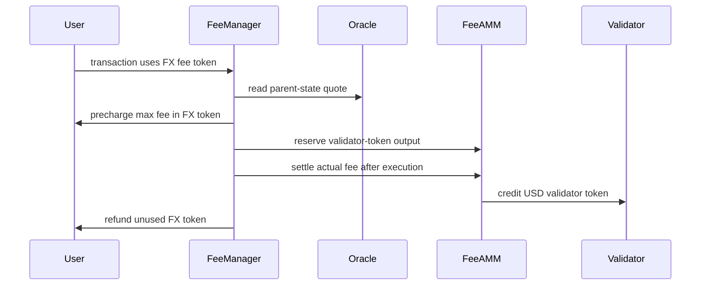

# TIP-1054: Non-USD Fee Tokens

<br>

## Abstract

TIP-1054 lets users pay Tempo transaction fees with non-USD TIP-20 tokens.

Gas accounting does not change. Transactions still use the existing signed gas fields, Tempo still prices gas in attodollars, and validators still receive fees through the existing USD fee-token path.

A non-USD token can be used for fees when its admin configures a fee oracle. The oracle quotes one whole token in `pathUSD`, and Tempo uses a parent-state snapshot of that quote for all fee settlement in a block.

This version supports only direct FeeAMM pools from the user's non-USD token to the validator's USD fee token. It does not add multi-hop routing, validator-side non-USD fee preferences, or new signed fee fields.

<br>

## Motivation

Tempo already lets users choose among USD-denominated TIP-20 fee tokens. Users who mainly hold another asset must first swap into a USD fee token before they can transact.

TIP-1054 removes that extra step on the user side. A user can pay fees in a configured non-USD token, while the validator still receives its preferred USD fee token.

The design keeps the existing fee model intact:

- gas prices and fee caps remain attodollar-denominated;
- the maximum and actual fee amounts are still computed as 6-decimal USD amounts;
- validators still settle in USD fee tokens; and
- the transaction format does not change.

The only new input is an oracle quote for the user's non-USD token. To keep that quote unambiguous, every fee oracle uses the same quote direction, quote asset, scale, and one-block delay.

<br>

## Assumptions

This TIP depends on the following assumptions:

1. `TIP-1000` and `TIP-1010` continue to define gas prices in attodollars.
2. Tempo continues to derive fee debits as 6-decimal USD amounts before converting them into token units.
3. All TIP-20 tokens continue to use fixed 6-decimal units.
4. `pathUSD` is the quote asset for this TIP. It is not a new gas-accounting unit.
5. Accepted USD fee tokens are treated at par with `pathUSD` for this TIP.
6. Validator fee tokens remain USD-only.
7. FX fee settlement uses only the direct pool `(userToken, validatorToken)`.
8. Users do not sign a token-unit fee cap in this version.
9. Token admins are responsible for choosing fee oracles that are suitable for fee payment.

If one of these assumptions no longer holds, the affected token should be disabled for fee payment or the behavior should be changed in a follow-up TIP.

<br>

# Specification

TIP-1054 introduces three changes:

- TIP-20 tokens may expose a fee-oracle pointer.
- `FeeManager` may accept a configured non-USD TIP-20 token as a user fee token.
- FeeAMM may host direct pools that swap a user's non-USD fee token into the validator's USD fee token.

The high-level flow for an FX fee transaction is:



<br>

## Scope

This TIP applies only to user-side transaction fee payment in non-USD TIP-20 tokens.

This TIP does not introduce:

- non-USD validator fee-token preferences;
- changes to the transaction format;
- signed token-unit fee caps;
- multi-hop or generalized FeeAMM routing;
- oracle-based repricing of USD validator tokens against `pathUSD`;
- standardized mempool invalidation rules;
- new receipt fields or RPC surfaces; or
- wallet UX requirements.

USD-denominated user fee tokens keep their existing behavior, except where an interface is explicitly broadened to also admit non-USD tokens.

<br>

## Definitions

For this TIP:

- **`pathUSD`** is the quote asset for this TIP and the root of the existing TIP-20 quote-token graph. It is not a gas-accounting unit.
- **USD6 amount** means a nominal USD amount expressed in ordinary 6-decimal TIP-20 units.
- **USD token** means a valid USD-denominated TIP-20 fee token under the existing Tempo rules.
- **FX token** means a non-USD TIP-20 token.
- **user token** means the token used by the fee payer.
- **validator token** means the USD token used for validator fee credit.
- **fee-configured FX token** means an FX token with `feeOracle() != address(0)` in the relevant state.
- **fee-enabled FX token for block `B`** means a fee-configured FX token in `state(P)` whose effective oracle quote is valid for block `B`, where `P` is `B`'s parent block.
- **executable FX fee token** means a fee-enabled FX token that also passes the live transaction checks in [Execution-Time Validity](#execution-time-validity).
- **effective fee snapshot** means the oracle address and oracle quote read from `state(P)` and reused for a token throughout block `B`.
- **Tempo AA transaction** means a Tempo transaction whose account-abstraction envelope is present and whose executable calls are taken from `aa_calls`.

The fee amounts used by this TIP are:

```text
gasBalanceSpending(gas, gasPrice)
    = ceilDiv(gas * gasPrice, GAS_PRICE_SCALE)

maxFeeUsd6
    = gasBalanceSpending(tx.gasLimit, tx.effectiveGasPrice(B.basefee))

actualFeeUsd6
    = gasBalanceSpending(gasUsed, tx.effectiveGasPrice(B.basefee))
```

`maxFeeUsd6` and `actualFeeUsd6` exclude transaction value. They are the existing USD6 amounts produced by Tempo's current gas accounting.

<br>

## Constants

```text
ORACLE_SCALE       = 10^18
GAS_PRICE_SCALE    = 10^12
FEE_AMM_SCALE      = 10000
FEE_AMM_M          = 9970   // existing fee-swap multiplier
FEE_AMM_N          = 9985   // existing rebalance multiplier
FEE_ORACLE_GAS     = 200000
MAX_FEE_ORACLE_AGE = 3600   // seconds
```

All token amounts and USD6 amounts are expressed in ordinary 6-decimal TIP-20 units unless a field or formula explicitly says `X18`.

<br>

## Interfaces

This section lists the interfaces introduced or extended by this TIP. Behavioral requirements are defined in later sections.

### TIP-20 Fee Oracle Configuration

```solidity
interface ITIP20FeeOracleConfig {
    event FeeOracleUpdated(
        address indexed updater,
        address indexed oldOracle,
        address indexed newOracle
    );

    error InvalidFeeOracle();

    function feeOracle() external view returns (address oracle);

    function setFeeOracle(address oracle) external;
}
```

### Fee Oracle

```solidity
interface IFeeOracle {
    function latestPathUsdQuote()
        external
        view
        returns (
            uint64 roundId,
            uint192 pathUsdPerTokenX18,
            uint64 updatedAt
        );
}
```

### FeeManager FX Settlement Event

```solidity
event FXFeeSettled(
    address indexed feePayer,
    address indexed beneficiary,
    address indexed userToken,
    address validatorToken,
    uint64 roundId,
    uint192 pathUsdPerTokenX18,
    uint256 actualFeeUsd6,
    uint256 userTokenIn,
    uint256 userTokenRefund,
    uint256 validatorCredit
);
```

### FeeAMM FX Rebalance Entry Point

```solidity
function rebalanceSwapFX(
    address userToken,
    address validatorToken,
    uint256 amountOutUserToken,
    uint256 maxAmountInValTok,
    address to
) external returns (uint256 amountInValTok);
```

<br>

## Token Oracle Configuration

`feeOracle()` returns the token's configured fee oracle. `address(0)` means the token is not configured for FX fee use.

`setFeeOracle(oracle)` MUST:

1. be callable only by the token's authorized admin;
2. accept `address(0)` to disable FX fee use;
3. revert with `InvalidFeeOracle` if the token is USD-denominated and `oracle != address(0)`;
4. revert with `InvalidFeeOracle` if `oracle != address(0)` and the target address has no code; and
5. emit `FeeOracleUpdated(updater, oldOracle, newOracle)`.

For USD tokens, `feeOracle()` MUST be `address(0)`.

`feeOracle()` is independent of the existing `quoteToken()` and `nextQuoteToken()` configuration. Fee settlement under this TIP does not read the quote-token graph and does not require `feeOracle()` to match that graph.

<br>

## Fee Oracle Quotes

A fee oracle quotes one whole FX token in `pathUSD`, scaled by `ORACLE_SCALE`.

For example, if one token is worth `2.50 pathUSD`, `latestPathUsdQuote()` returns `pathUsdPerTokenX18 = 2.5e18`.

The protocol MUST query the oracle with a `STATICCALL`. Any revert, out-of-gas, malformed return data, zero `roundId`, zero `updatedAt`, or zero `pathUsdPerTokenX18` makes the quote invalid.

Oracle code MAY make additional `STATICCALL`s under ordinary EVM call semantics. Those calls share the `FEE_ORACLE_GAS` budget and read the same parent-state snapshot as the top-level oracle call.

<br>

## Effective Fee Snapshot

Let `B` be the block currently being executed, and let `P` be its parent block.

For every FX token used for fee-related behavior in block `B`, the protocol MUST use a single effective fee snapshot:

- the token's `feeOracle()` value from `state(P)`; and
- the result of `latestPathUsdQuote()` for that oracle, evaluated against `state(P)` and the parent block context.

The oracle query is a protocol-internal snapshot query with:

- `from`, `msg.sender`, and `tx.origin` set to `TIP_FEE_MANAGER_ADDRESS`;
- `to` set to the oracle address;
- `value = 0`;
- input equal to the selector for `latestPathUsdQuote()`;
- gas limit equal to `FEE_ORACLE_GAS`; and
- block environment equal to parent block `P`.

The query is not charged to the user transaction, does not consume block gas, does not modify persistent or transient state, and does not affect the warm/cold access state of transaction execution.

Warm/cold access accounting inside the query MUST be initialized as a fresh transaction from `TIP_FEE_MANAGER_ADDRESS` to the oracle with no access list, then discarded.

For each FX token, the protocol MUST evaluate the parent-state oracle configuration and quote at most once per block. All later fee settlement, FX pool mint, and FX pool rebalance operations for that token in the same block MUST use the cached result, including cached invalid results.

Implementations MAY precompute the cache or fill it lazily on first use.

A change to `feeOracle()` or to oracle storage in block `N` becomes effective for fees starting in block `N + 1`. It MUST NOT affect fee settlement earlier in block `N`.

This rule requires no extra commitment in block `B`: the block identifies `P` through `parentHash`, and `P` commits to its post-state root and block environment. Blocks do not include oracle prices, round IDs, or token-oracle mappings.

A quote is valid for block `B` iff all of the following hold:

1. the oracle address is nonzero;
2. the oracle call succeeds and decodes correctly;
3. `roundId != 0`;
4. `pathUsdPerTokenX18 != 0`;
5. `updatedAt != 0`;
6. `updatedAt <= P.timestamp`; and
7. `B.timestamp - updatedAt <= MAX_FEE_ORACLE_AGE`.

If any condition fails, the FX token is not fee-enabled for block `B`. Any operation that requires a valid quote MUST revert if the quote is invalid for the current block.

<br>

## Fee-Token Resolution

A user transaction MAY resolve to either:

- a USD token under the existing Tempo rules; or
- an FX token under this TIP.

`setUserToken(token)` MUST accept:

- any valid USD token accepted today; and
- any valid TIP-20 FX token with `feeOracle() != address(0)` in live execution state.

`setValidatorToken(token)` is unchanged and MUST remain USD-only.

For an FX token, `setUserToken(token)` checks `feeOracle()` at the time the call executes. It does not use the parent-state snapshot and MUST NOT require the current block's quote to be valid.

### Same-Transaction `setUserToken()`

The existing immediate-effect rule for direct `setUserToken()` calls is preserved.

If all of the following hold:

1. the transaction does not explicitly set a `feeToken`;
2. the transaction is not a Tempo AA transaction;
3. the fee payer equals the transaction caller; and
4. the first and only fee-token-resolution-relevant call is a direct call to `FeeManager.setUserToken(token)`,

then the resolved user fee token for that same transaction MUST be `token`, rather than the user's previously stored preference.

This rule applies to both USD tokens and fee-configured FX tokens. The transaction MAY still fail later if the resolved FX token is not executable in the current block.

### Fee-Token Inference

Tempo MUST continue to infer a fee token from a TIP-20 token contract only for the existing transfer-like calls:

- `transfer(...)`
- `transferWithMemo(...)`
- `distributeReward(...)`

For transactions that are not Tempo AA transactions, the existing direct-call inference rule is unchanged except that the inferred token MAY now be an FX token.

For Tempo AA transactions, inference applies only when:

1. the fee payer equals the transaction caller; and
2. every `aa_calls` entry targets the same TIP-20 token contract and uses one of the three selectors above.

This TIP does not extend FX inference to the Stablecoin DEX input-token path. Stablecoin DEX fee-token inference remains USD-only.

Inference only resolves a candidate fee token. If the inferred token is an FX token, the transaction is executable only if it passes the execution-time checks below.

### Execution-Time Validity

An FX token is executable as a user fee token in block `B` only if all of the following hold:

1. it is a valid TIP-20 token;
2. it is not paused at fee-collection time;
3. it has `feeOracle() != address(0)` in `state(P)`;
4. its effective quote for block `B` is valid;
5. the fee payer is authorized to transfer that token to `FeeManager` under the existing token-policy rules;
6. the fee payer has enough balance to cover the precharged maximum token amount; and
7. the direct FeeAMM pool `(userToken, validatorToken)` has enough validator-token liquidity for `maxFeeUsd6`.

<br>

## Conversion and Rounding

For any valid effective quote `priceX18 = pathUsdPerTokenX18`:

```text
ceilDiv(a, b) = 0 if a == 0, otherwise floor((a - 1) / b) + 1

fxTokenAmountForUsd6(usd6Amount, priceX18)
    = ceilDiv(usd6Amount * ORACLE_SCALE, priceX18)

usd6ValueFloor(tokenAmount, priceX18)
    = floor(tokenAmount * priceX18 / ORACLE_SCALE)

usd6ValueCeil(tokenAmount, priceX18)
    = ceilDiv(tokenAmount * priceX18, ORACLE_SCALE)

validatorFeeOut(usd6Amount)
    = floor(usd6Amount * FEE_AMM_M / FEE_AMM_SCALE)

validatorRebalanceIn(usd6Amount)
    = floor(usd6Amount * FEE_AMM_N / FEE_AMM_SCALE) + 1
```

All arithmetic in these formulas uses checked unsigned 256-bit integers. Overflow, underflow, division by zero, or a pool reserve value that cannot fit in storage MUST revert.

Rounding is consensus behavior:

- user-token fee debits round up;
- USD6 valuation for `rebalanceSwapFX` rounds up;
- validator-token payout in fee settlement rounds down; and
- validator-token input in rebalance swaps uses the existing `floor(x * N / SCALE) + 1` rule.

The USD6 fee amount remains the source of truth. Validator payout is computed from that USD6 amount, not by re-valuing the rounded user-token debit.

Any extra user-token dust caused by rounding remains in the pool or fee-manager path implied by these formulas.

<br>

## Fee Collection

For a transaction that resolves to a USD user fee token, existing fee-collection semantics are unchanged.

For a transaction that resolves to an FX user fee token, fee collection uses the block's effective fee snapshot for `userToken`.

### Pre-Tx Collection

Let:

- `userToken` be the resolved FX fee token;
- `validatorToken` be the block beneficiary's USD fee token under existing rules;
- `quote` be the effective fee snapshot for `userToken` in block `B`; and
- `maxFeeUsd6` be the transaction's existing maximum fee spending, expressed as a USD6 amount.

At `collect_fee_pre_tx` time, the protocol MUST:

1. validate that `userToken` is fee-enabled for block `B`;
2. compute `maxUserTokenFee = fxTokenAmountForUsd6(maxFeeUsd6, quote.pathUsdPerTokenX18)`;
3. transfer `maxUserTokenFee` from the fee payer to `FeeManager` through the existing fee-precharge path;
4. compute `reservedValidatorOut = validatorFeeOut(maxFeeUsd6)`;
5. check that the direct pool `(userToken, validatorToken)` has at least `reservedValidatorOut` validator-token reserve; and
6. reserve that validator-token amount for the pending transaction using the existing `FeeManager` reservation model.

No route identifier is required because this TIP allows only direct pools and uses a block-wide quote.

### Post-Tx Collection

Let `actualFeeUsd6` be the transaction's actual fee spending under existing gas accounting.

At `collect_fee_post_tx` time, the protocol MUST:

1. recompute `actualFeeUsd6` using existing gas accounting;
2. compute `actualUserTokenSpend = fxTokenAmountForUsd6(actualFeeUsd6, quote.pathUsdPerTokenX18)`;
3. compute `refundUserToken = maxUserTokenFee - actualUserTokenSpend`;
4. refund `refundUserToken` to the fee payer through the existing fee-refund path;
5. compute `validatorCredit = validatorFeeOut(actualFeeUsd6)`;
6. add `actualUserTokenSpend` to the pool's `reserve_user_token`;
7. subtract `validatorCredit` from the pool's `reserve_validator_token`; and
8. increment the validator's collected-fee balance in `validatorToken` by `validatorCredit`.

If `actualFeeUsd6 == 0`, then `actualUserTokenSpend == 0`, the full precharge is refunded, and no pool swap or validator credit occurs.

Post-tx settlement MUST use the same effective fee snapshot as pre-tx collection. It MUST NOT read the live same-block oracle state.

`collect_fee_post_tx` MUST emit `FXFeeSettled` for every FX fee-token transaction with a nonzero `actualUserTokenSpend` or nonzero `refundUserToken`.

The event records the oracle round and price actually used. The precharged FX-token amount is `userTokenIn + userTokenRefund`; the maximum USD6 fee remains derivable from the transaction's signed gas fields and block base fee.

<br>

## FX Direct Pools

An FX direct pool is a directional FeeAMM pool keyed by:

```text
(userToken, validatorToken)
```

where `userToken` is an FX token and `validatorToken` is a USD fee token.

For every FX direct-pool operation:

- `userToken` MUST be a valid non-USD TIP-20 token;
- `validatorToken` MUST be a valid USD fee token;
- `userToken != validatorToken`; and
- the existing FeeAMM rule that both tokens are USD-denominated is replaced by this section's FX direct-pool rules.

### Liquidity for Fee Settlement

For FX fee settlement, liquidity depends only on the USD6 fee amount and the pool's validator-token reserve.

A pool has enough liquidity for a transaction with maximum fee `maxFeeUsd6` iff:

```text
reserve_validator_token >= validatorFeeOut(maxFeeUsd6)
```

The user-token input amount is not part of the liquidity check.

### Fee Swap

FX fee settlement does not use the pool reserve ratio to price the swap. Instead:

- the user's input amount comes from the oracle quote; and
- the validator payout comes from the USD6 fee amount and the existing FeeAMM spread.

On settlement of `actualFeeUsd6`:

```text
userTokenIn  = fxTokenAmountForUsd6(actualFeeUsd6, priceX18)
validatorOut = validatorFeeOut(actualFeeUsd6)
```

The pool reserves update as:

```text
reserve_user_token      += userTokenIn
reserve_validator_token -= validatorOut
```

### Rebalance Swap

The existing `rebalanceSwap(userToken, validatorToken, amountOut, to)` remains unchanged for USD pools and MUST revert for FX direct pools.

`rebalanceSwapFX(...)` is the FX-specific rebalance entry point.

It MUST use the block's effective fee snapshot for `userToken`. If `userToken` does not have a valid quote for the current block, the call MUST revert.

It MUST compute:

```text
fairUsd6        = usd6ValueCeil(amountOutUserToken, priceX18)
amountInValTok  = validatorRebalanceIn(fairUsd6)
```

If `amountInValTok > maxAmountInValTok`, the call MUST revert.

On success, `rebalanceSwapFX` MUST:

1. transfer `amountInValTok` of `validatorToken` from the caller into the pool;
2. transfer `amountOutUserToken` of `userToken` from the pool to `to`;
3. update pool reserves; and
4. emit the existing `RebalanceSwap` event with `amountIn = amountInValTok` and `amountOut = amountOutUserToken`.

### Mint

For the first `mint(userToken, validatorToken, amountValidatorToken, to)` on an FX direct pool:

- `userToken` MUST have a valid effective quote for the current block;
- the caller deposits only `validatorToken`;
- `MIN_LIQUIDITY` remains permanently locked; and
- the bootstrap formula is unchanged.

The quote is used only to confirm that the pool's FX token is currently fee-enabled. It is not used in the bootstrap formula.

For later mints, let:

- `U = reserve_user_token`;
- `V = reserve_validator_token`;
- `S = totalSupply`;
- `priceX18` be the effective quote for `userToken` in the current block; and
- `amountValidatorToken` be the caller's deposit.

If `userToken` does not have a valid quote for the current block, the call MUST revert.

The minted liquidity MUST be:

```text
discountedUserReserveUsd6
    = floor(usd6ValueFloor(U, priceX18) * FEE_AMM_N / FEE_AMM_SCALE)

liquidity
    = floor(amountValidatorToken * S / (V + discountedUserReserveUsd6))
```

As in the existing FeeAMM, `liquidity == 0` MUST revert.

### Burn

`burn(userToken, validatorToken, liquidity, to)` is unchanged for FX direct pools. It returns the caller's pro-rata share of both reserves and updates supply and reserves exactly as it does today.

`burn()` does not read the oracle. It MUST remain available even if `userToken` is no longer fee-configured or does not have a valid quote.

<br>

## Transaction Format and Existing Surfaces

This TIP does not add any signed fee field.

The transaction's signed fee bound remains the existing bound implied by its gas fields and attodollar gas accounting. The exact token-unit debit for an FX fee token is derived from the block's effective fee snapshot and the existing USD6 fee amount.

`TIP-1007` remains unchanged: `getFeeToken()` continues to expose the resolved fee token for the current transaction.

Except for `FXFeeSettled`, this TIP does not standardize additional fee-settlement events, receipt fields, or RPC surfaces.

<br>

# Invariants

The following invariants must always hold:

1. Gas accounting, base-fee checks, and signed fee bounds remain attodollar-denominated.
2. `maxFeeUsd6` and `actualFeeUsd6` are computed by the existing Tempo rules before any FX-token conversion.
3. `pathUSD` is only an oracle quote asset in this TIP.
4. Validators receive fees only through the existing USD fee-token path and `FeeManager` credit model.
5. A `feeOracle()` or oracle-storage update in block `N` affects fees starting in block `N + 1`.
6. Pre-tx and post-tx collection for the same transaction use the same effective quote.
7. Each FX token's effective snapshot is evaluated at most once per block.
8. FX fee settlement uses only the direct pool `(userToken, validatorToken)`.
9. For a fixed valid quote, `fxTokenAmountForUsd6` is monotonic in the USD6 fee amount.
10. If `actualFeeUsd6 <= maxFeeUsd6`, then `actualUserTokenSpend <= maxUserTokenFee`.
11. Validator credit is computed from the USD6 fee amount, not from the rounded user-token debit.
12. FX fee use does not bypass existing pause, transfer-policy, balance, or spending-limit checks.
13. `rebalanceSwapFX` MUST NOT execute if the oracle-priced validator-token input exceeds the caller's bound.
14. `burn()` remains pro-rata and quote-free.
15. Arithmetic MUST NOT wrap.

<br>

## Test Cases

At minimum, the test suite must cover:

1. setting and clearing `feeOracle()` on an FX token, including `FeeOracleUpdated` old/new values;
2. rejection of `setFeeOracle(nonzero)` on a USD token;
3. rejection of a non-contract oracle address;
4. independence between `feeOracle()` and the `quoteToken()` / `nextQuoteToken()` graph;
5. parent-state snapshot behavior for oracle-address changes and quote updates, including parent block context and per-block cache reuse;
6. rejection of stale, zero, malformed, reverting, or out-of-gas oracle quotes;
7. successful `setUserToken()` with a fee-configured FX token using live execution state and continued rejection of non-USD `setValidatorToken()`;
8. same-transaction immediate effect for direct `setUserToken()` when the new token is FX;
9. FX fee-token inference on exactly `transfer`, `transferWithMemo`, and `distributeReward`, including Tempo AA transaction rules;
10. non-application of FX inference to the Stablecoin DEX path;
11. exact precharge, actual-spend, refund, and validator-credit arithmetic for representative prices above `1`, below `1`, and near rounding boundaries;
12. `FXFeeSettled` emission with the round, `pathUSD`-per-token price, FX spend, refund, and validator credit actually used;
13. overflow, underflow, division-by-zero, and reserve-fit rejection for the formulas in this TIP;
14. insufficient-liquidity rejection based on `validatorFeeOut(maxFeeUsd6)`;
15. `rebalanceSwap` rejection for FX pools and `rebalanceSwapFX` arithmetic, max-input protection, and invalid-quote rejection;
16. first and later `mint()` validation for FX pools, including invalid-quote rejection;
17. unchanged `burn()` behavior for FX pools, including burn after the user token's oracle is cleared; and
18. consistency between `getFeeToken()` and the token actually used for FX fee collection.
