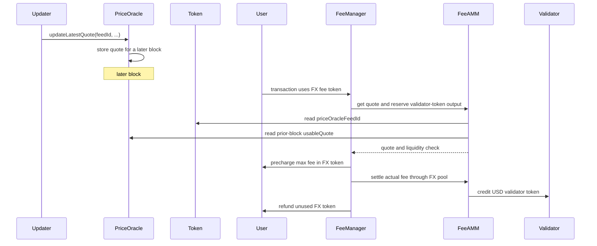

# TIP-1054: Non-USD Fee Tokens

<br>

## Abstract

TIP-1054 lets users pay transaction fees on Tempo with non-USD TIP-20 tokens. A non-USD token issuer that wants its token to be used for fees can point the token at a PriceOracle feed that prices the token in USD.

Gas accounting does not change. Transactions still use the existing signed gas fields, Tempo still prices gas in attodollars, and validators still receive fees in USD. Users who use non-USD tokens for gas fees are charged based on the oracle quote.

<br>

## Motivation

Tempo already lets users choose among USD-denominated TIP-20 tokens to pay fees. TIP-1054 extends this so that, e.g., users holding non-USD stablecoins can transact on Tempo without also holding USD-stables or getting gas sponsorship.

<br>

## Design Overview

TIP-1054 has four moving pieces:

1. **PriceOracle stores shared price feeds.** A feed publishes the USD value of one whole token. Multiple tokens may use the same feed, so several EUR stablecoins can share a EUR/USD oracle if their issuers choose to do so.
2. **A token selects a feed.** A non-USD TIP-20 token opts into FX fees by storing the PriceOracle feed it uses. The token does not store oracle prices itself.
3. **The feed delays quote use by one block.** A pushed quote is stored immediately, but fees use only a quote pushed in an earlier block. This one-block delay avoids same-block fee-accounting races: e.g. a quote update and an FX-fee transaction could otherwise be ordered in ways that change the fee charged.
4. **FeeManager settles through a direct FX pool.** Before precharging the user, FeeManager uses the delayed quote and checks validator-token liquidity. The user pays the FX token amount implied by that quote, and the validator receives its USD fee token from the direct pool `(userToken, validatorToken)`.



<br>

# Specification

## TIP-20 Changes

A non-USD TIP-20 token opts into letting users pay fees in that token by setting a `priceOracleFeedId`. Only the token's authorized admin MAY set or clear it. A successful change MUST emit `PriceOracleFeedSet`. `priceOracleFeedId = 0` means the token is not configured for FX fees.

When a nonzero feed is set, the feed MUST exist and the PriceOracle feed admin MUST have authorized the token to use that feed. USD tokens MUST reject nonzero price oracle feed ids.

<br>

## PriceOracle Precompile

The PriceOracle precompile is deployed at `0xFEED000000000000000000000000000000000000` and stores shared token-price feeds. This TIP specifies only how fee settlement uses those feeds. Payments, charging, and off-protocol oracle operation are outside this TIP. A feed updater MAY be a contract or multisig that implements its own roles, aggregation, billing, or access rules.

### Feeds

A feed is keyed by `feedId` and has a feed admin, a feed updater, a quote policy, token authorizations, and two quote tuples:

```text
(previousQuote, previousQuoteBlock)
(latestQuote, latestQuoteBlock)
```

`latestQuote` is the newest accepted quote. `previousQuote` is the newest prior-block quote retained while `latestQuote` was accepted in the current block. Each quote block stores the Tempo block in which that quote was accepted. A quote tuple with quote block `0` is empty.

`feedId = 0` is reserved and cannot be created. Feed ids use the same creator-and-salt pattern as TIP-20 token address derivation. Specifically, `getFeedId(creator, salt)` returns `keccak256(abi.encode(creator, salt))`. `createFeed(salt, updater, policy)` derives `feedId` from `msg.sender` and `salt`, sets `msg.sender` as the feed admin, emits `PriceOracleFeedCreated`, and MUST revert if the derived feed already exists or if the derived `feedId` is zero.

A quote has two fields:
- `quoteId` is assigned by the PriceOracle, starts at `1`, and increases by one for each accepted quote on the feed.
- `usdPerTokenE18` is the value of one whole token in USD, scaled by `QUOTE_SCALE`. For example, if one token is worth `2.50 USD`, the pushed value is `usdPerTokenE18 = 2.5e18`.

The quote policy has two fields:
- `maxQuoteAgeBlocks` bounds how old the usable quote may be.
- `maxQuoteChangeBps` bounds how far a newly pushed quote may move from the current usable quote.

The protocol sets maximum values for both fields. The feed admin can choose smaller values to require fresher quotes or smaller per-update quote moves. The same policy applies to every token authorized for the feed. An issuer that wants stricter limits should use a stricter feed. A cleared policy has both fields set to zero.

The protocol also caps the value of one smallest FX-token unit at one cent. This keeps rounding from charging materially more than the transaction's signed USD fee bound.

Only the feed admin MAY set the feed updater, quote policy, or token authorizations. Changing the updater or policy MUST clear both quote tuples and their block fields. Indexers MUST treat `PriceOracleUpdaterSet` and `PriceOraclePolicySet` as clearing quote state for the feed. A token is not fee-enabled through a feed unless the feed authorizes that token.

### Updating Quotes

The feed updater MAY call `updateLatestQuote(feedId, usdPerTokenE18)` to push a new quote. The call MUST revert unless all of these conditions hold:
- the caller is the feed updater,
- the feed has a valid quote policy,
- `usdPerTokenE18` is nonzero, and
- `usdE6ValueCeil(1, usdPerTokenE18) <= PROTOCOL_MAX_FX_FEE_DUST_USD6`.

Before accepting the new quote, PriceOracle MUST select a quote tuple using the rule in [Usable Quotes](#usable-quotes), before applying age or dust-cap validity checks. If the existing `latestQuoteBlock` is nonzero and older than the current block, PriceOracle MUST copy `latestQuote` into `previousQuote` before overwriting `latestQuote`. This preserves the newest prior-block quote while the new `latestQuote` is ineligible for same-block use.

If no selected quote exists, the accepted quote is trusted as a bootstrap quote. Otherwise, each later quote MUST satisfy the feed's quote-change limit against the selected quote, even if that quote is too old for fee settlement:

```text
abs(usdPerTokenE18 - selectedQuote.usdPerTokenE18) * BPS_SCALE
    <= selectedQuote.usdPerTokenE18 * maxQuoteChangeBps
```

PriceOracle then increments the feed's quote id, writes `{quoteId, usdPerTokenE18}` as `latestQuote`, sets `latestQuoteBlock = block.number`, and emits `PriceOracleQuoteUpdated`. The event also records the quote id and block of the selected quote used for the quote-change check, or zeroes for a bootstrap quote. The updater does not supply `quoteId`. An update MUST revert if the next quote id would overflow.

Once a selected quote exists, if more than one update is pushed for the same feed in block `N`, only the first update can move an older `latestQuote` into `previousQuote`. Later same-block updates are still compared against the same selected quote, so they cannot walk the price past `maxQuoteChangeBps` within the block.

### Usable Quotes

The usable quote is derived from `latestQuote` and `previousQuote` without mutating state:

```text
if latestQuoteBlock != 0 && latestQuoteBlock < block.number:
    usableQuote = latestQuote
    usableQuoteBlock = latestQuoteBlock
else:
    usableQuote = previousQuote
    usableQuoteBlock = previousQuoteBlock
```

Before FeeAMM uses a feed quote, it MUST read `usableQuote(feedId)` from PriceOracle.

If the selected tuple has quote block `0`, the feed has no usable quote. Otherwise, the selected quote is valid for fee settlement only while the feed has a valid quote policy, `block.number - usableQuoteBlock <= maxQuoteAgeBlocks`, and the one-cent dust cap (`usdE6ValueCeil(1, usableQuote.usdPerTokenE18) <= PROTOCOL_MAX_FX_FEE_DUST_USD6`) still holds. If the usable quote is invalid, any operation that requires a valid quote MUST revert.

<br>

## Transaction Fee Token Selection

`setValidatorToken(token)` is unchanged and MUST remain USD-only.

### Selecting a Fee Token

Tempo resolves a transaction's user fee token in the same order as before this TIP with the change that the token MAY be either a USD token or a non-USD TIP-20 token.

`setUserToken(token)` MUST continue to accept every USD token accepted today. It MUST also accept any valid non-USD TIP-20 token. For a non-USD token, `setUserToken(token)` checks only that the token is a valid TIP-20. It MUST NOT require the token to have a configured or authorized feed, to be unpaused, to have a valid usable quote, or to have direct-pool liquidity. Those conditions are checked when a transaction is charged.

### Fee Token Validity

Selecting a fee token only chooses the candidate token. It does not guarantee that the next transaction can be charged with that token.

An FX fee token is spendable only if, at fee-collection time:
- the token is a valid non-USD TIP-20 token that is not paused,
- the token has a nonzero `priceOracleFeedId`,
- the selected feed authorizes the token and has a valid quote policy,
- the selected feed has a valid usable quote, and
- the token can be transferred by the fee payer under the existing token-policy rules.

The user MUST have sufficient FX-token balance for `maxUserTokenFee`. Balance checks, account-key limits, and transaction-pool cost accounting for an FX fee token MUST use `maxUserTokenFee`, denominated in the FX token. Validator liquidity checks remain denominated in 6-decimal USD and use `maxFeeUsdE6`.

Pending FX-fee transactions MUST be revalidated when relevant state changes (e.g., token state, feed state, feed authorization, quote state, or direct-pool reserves) and as blocks advance, because quote usability and age are block-number dependent.

<br>

## FeeAMM Behavior

FeeAMM converts the existing 6-decimal USD fee amount into two token movements: an FX-token debit from the user and a USD-token credit to the validator. The validator payout is computed from the 6-decimal USD fee amount, not by re-valuing the rounded FX-token debit.

### Transaction Fee Settlement

For a transaction that resolves to a USD user fee token, existing fee-collection semantics are unchanged.

For a transaction that resolves to an FX user fee token, pre-tx collection MUST happen before user code runs:

1. FeeManager asks FeeAMM to read `userToken.priceOracleFeedId()` and read the feed's usable quote.
2. Fee collection reverts if the resolved FX token is not spendable in the current block.
3. FeeManager records `feedId`, `quote.quoteId`, `quoteBlock`, and `quote.usdPerTokenE18` in transaction-scoped fee state, then computes `maxUserTokenFee = fxTokenAmountForUsdE6(maxFeeUsdE6, quote.usdPerTokenE18)`.
4. FeeAMM computes `reservedValidatorOut = validatorFeeOut(maxFeeUsdE6)`.
5. FeeAMM verifies that the direct pool has at least `reservedValidatorOut` validator-token reserve and that `reserve_user_token + maxUserTokenFee` can fit in pool reserve storage, then reserves the validator-token amount using the existing FeeManager reservation model.
6. FeeManager transfers `maxUserTokenFee` from the fee payer through the existing precharge path.

Post-tx collection MUST use the transaction-scoped quote recorded during pre-tx collection, not a fresh read from the token or PriceOracle:

1. The protocol recomputes `actualFeeUsdE6` using existing gas accounting.
2. The protocol computes `actualUserTokenSpend = fxTokenAmountForUsdE6(actualFeeUsdE6, quote.usdPerTokenE18)`.
3. FeeManager computes `refundUserToken = maxUserTokenFee - actualUserTokenSpend` and refunds it to the fee payer.
4. FeeAMM credits the validator with `validatorFeeOut(actualFeeUsdE6)` in `validatorToken`.
5. FeeAMM increases `reserve_user_token` by `actualUserTokenSpend` and decreases `reserve_validator_token` by the validator credit.
6. `collect_fee_post_tx` emits `FXFeeSettled` if `actualUserTokenSpend` or `refundUserToken` is nonzero.

If `actualFeeUsdE6 == 0`, then `actualUserTokenSpend == 0`, the full precharge is refunded, and no pool swap or validator credit occurs. Any quote update or FeeAMM mutation performed by the transaction body MUST NOT affect that transaction's own fee calculation.

The `FXFeeSettled` event records the feed id, quote id, quote block, and price actually used. The precharged FX-token amount is `userTokenIn + userTokenRefund`; the maximum 6-decimal USD fee remains derivable from the transaction's signed gas fields and block base fee.

### FX Direct Pools

An FX direct pool is a directional FeeAMM pool keyed by `(userToken, validatorToken)`. `userToken` MUST be a valid non-USD TIP-20 token, `validatorToken` MUST be a valid USD fee token, and `userToken != validatorToken`. FX fee settlement MUST use this direct pool and MUST NOT use the existing two-hop FeeAMM fallback. The existing FeeAMM rule that both pool tokens are USD-denominated does not apply to FX direct pools.

For fee settlement, the pool's validator-token reserve is the binding liquidity check. A pool has enough liquidity for a transaction with maximum fee `maxFeeUsdE6` iff:

```text
reserve_validator_token >= validatorFeeOut(maxFeeUsdE6)
```

The user-token reserve is not part of this liquidity check. The user's input amount comes from the usable quote, while the validator payout comes from the 6-decimal USD fee amount and the existing FeeAMM spread:

```text
userTokenIn  = fxTokenAmountForUsdE6(actualFeeUsdE6, priceE18)
validatorOut = validatorFeeOut(actualFeeUsdE6)

reserve_user_token      += userTokenIn
reserve_validator_token -= validatorOut
```

### Rebalance Swaps

The existing `rebalanceSwap(userToken, validatorToken, amountOut, to)` remains unchanged for USD pools and MUST revert for FX direct pools.

`rebalanceSwapFX(...)` is the FX-specific rebalance entry point. Before it reads the quote, FeeAMM MUST read `userToken.priceOracleFeedId()` and revert unless the selected feed has a valid usable quote for the current block.

`rebalanceSwapFX(...)` MUST compute:

```text
fairUsdE6        = usdE6ValueCeil(amountOutUserToken, priceE18)
amountInValTok  = validatorRebalanceIn(fairUsdE6)
```

If `amountOutUserToken == 0` or `amountInValTok > maxAmountInValTok`, the call MUST revert. On success, FeeAMM MUST transfer `amountInValTok` of `validatorToken` from the caller into the pool, transfer `amountOutUserToken` of `userToken` from the pool to `to`, update pool reserves, and emit the existing `RebalanceSwap` event with `amountIn = amountInValTok` and `amountOut = amountOutUserToken`.

### Mint and Burn

For the first `mint(userToken, validatorToken, amountValidatorToken, to)` on an FX direct pool, FeeAMM MUST read `userToken.priceOracleFeedId()` and revert unless the selected feed has a valid usable quote for the current block. The caller deposits only `validatorToken`, `MIN_LIQUIDITY` remains permanently locked, and the bootstrap formula is unchanged. The quote is used only to confirm that the pool's FX token is currently fee-enabled; it is not used in the bootstrap formula.

For later mints, FeeAMM MUST read `userToken.priceOracleFeedId()` and use the selected feed's usable quote in the current block. Let `U = reserve_user_token`, `V = reserve_validator_token`, `S = totalSupply`, `priceE18` be the usable quote, and `amountValidatorToken` be the caller's deposit. The minted liquidity MUST be:

```text
userReserveUsdE6
    = usdE6ValueCeil(U, priceE18)

liquidity
    = floor(amountValidatorToken * S / (V + userReserveUsdE6))
```

As in the existing FeeAMM, `liquidity == 0` MUST revert.

`burn(userToken, validatorToken, liquidity, to)` is unchanged for FX direct pools. It returns the caller's pro-rata share of both reserves and updates supply and reserves exactly as it does today. `burn()` does not read the quote and MUST remain available even if `userToken` is no longer fee-enabled or does not have a valid usable quote.

The arithmetic helpers used by this section are defined below.

<br>

## Risks and Trust Assumptions

FX fee support relies on the token issuer, the feed admin, and the feed updater to choose and publish accurate prices. A stale, incorrect, or compromised feed can cause users to overpay in the FX token or cause LPs in the associated FeeAMM pools to receive too little value for their liquidity. `maxQuoteAgeBlocks` and `maxQuoteChangeBps`, bounded by protocol maximums, limit the damage from stale feeds and abrupt bad updates, but they do not remove oracle trust. The first usable quote for a feed is trusted. LPs and users should treat fee-enabled FX tokens as carrying both issuer risk and feed risk.

Quote freshness is measured in Tempo blocks, not wall-clock time. If block production stalls, a quote can remain within `maxQuoteAgeBlocks` while being old in real time until enough new blocks are produced for it to expire.

Because the transaction's signed gas fields bound the 6-decimal USD fee amount rather than the token-denominated FX debit, wallets and relayers SHOULD use short validity windows, such as `validBefore` / `valid_before`, when submitting transactions that pay fees in FX tokens.

## Reference Details

### Terms

The fee amounts used by this TIP are:

```text
gasBalanceSpending(gas, gasPrice)
    = ceilDiv(gas * gasPrice, GAS_PRICE_SCALE)

maxFeeUsdE6
    = gasBalanceSpending(tx.gasLimit, tx.effectiveGasPrice(B.basefee))

actualFeeUsdE6
    = gasBalanceSpending(gasUsed, tx.effectiveGasPrice(B.basefee))
```

`maxFeeUsdE6` and `actualFeeUsdE6` exclude transaction value. They are the existing 6-decimal USD amounts produced by Tempo's current gas accounting.

### Arithmetic

The existing 6-decimal USD fee amount remains the source of truth. Validator payout is computed from that 6-decimal USD amount, not by re-valuing the rounded user-token debit. For any valid usable quote `priceE18 = usdPerTokenE18`:

```text
ceilDiv(a, b) = 0 if a == 0, otherwise floor((a - 1) / b) + 1

fxTokenAmountForUsdE6(usdE6Amount, priceE18)
    = ceilDiv(usdE6Amount * QUOTE_SCALE, priceE18)

usdE6ValueCeil(tokenAmount, priceE18)
    = ceilDiv(tokenAmount * priceE18, QUOTE_SCALE)

validatorFeeOut(usdE6Amount)
    = floor(usdE6Amount * FEE_AMM_M / FEE_AMM_SCALE)

validatorRebalanceIn(usdE6Amount)
    = floor(usdE6Amount * FEE_AMM_N / FEE_AMM_SCALE) + 1
```

All arithmetic in these formulas uses checked unsigned 256-bit integers. Overflow, underflow, division by zero, or a pool reserve value that cannot fit in storage MUST revert.

Rounding is consensus behavior: user-token fee debits round up; 6-decimal USD valuation for `rebalanceSwapFX` and mint reserve valuation round up; validator-token payout in fee settlement rounds down; and validator-token input in rebalance swaps uses the existing `floor(x * N / SCALE) + 1` rule. Any extra user-token amount caused by rounding remains in the pool or fee-manager path implied by these formulas.

### Constants

```text
QUOTE_SCALE        = 10^18
GAS_PRICE_SCALE    = 10^12
FEE_AMM_SCALE      = 10000
FEE_AMM_M          = 9970   // existing fee-swap multiplier
FEE_AMM_N          = 9985   // existing rebalance multiplier
BPS_SCALE          = 10000
PROTOCOL_MAX_QUOTE_AGE_BLOCKS = TBD     // upper bound for feed policy maxQuoteAgeBlocks
PROTOCOL_MAX_QUOTE_CHANGE_BPS = TBD      // upper bound for feed policy maxQuoteChangeBps
PROTOCOL_MAX_FX_FEE_DUST_USD6 = 10000    // $0.01 in 6-decimal USD
```

All token amounts and 6-decimal USD amounts are expressed in ordinary 6-decimal TIP-20 units unless a field or formula explicitly says `E18`.

The quote-age and quote-change constants are maximums. The feed admin MAY set smaller policy values to require fresher quotes or a lower per-update quote change. A quote policy is valid only if:

```text
0 < maxQuoteAgeBlocks <= PROTOCOL_MAX_QUOTE_AGE_BLOCKS
0 < maxQuoteChangeBps <= PROTOCOL_MAX_QUOTE_CHANGE_BPS
```

### Existing Surfaces

The transaction's signed 6-decimal USD fee bound remains the existing bound implied by its gas fields and attodollar gas accounting. For FX fees, the token debit may exceed that USD amount only by the bounded token-unit rounding dust. `TIP-1007` remains unchanged: `getFeeToken()` continues to expose the resolved fee token for the current transaction.

Except for `FXFeeSettled` and the PriceOracle/TIP-20 events below, this TIP does not standardize additional fee-settlement events, receipt fields, or RPC surfaces.

### Interfaces and Events

```solidity
interface ITIP20PriceOracleConfig {
    event PriceOracleFeedSet(
        address indexed setter,
        bytes32 indexed oldFeedId,
        bytes32 indexed newFeedId
    );

    function priceOracleFeedId() external view returns (bytes32 feedId);

    function setPriceOracleFeedId(bytes32 feedId) external;
}
```

```solidity
interface IPriceOracle {
    struct PriceQuote {
        uint64 quoteId;
        uint192 usdPerTokenE18;
    }

    struct QuotePolicy {
        uint64 maxQuoteAgeBlocks;
        uint32 maxQuoteChangeBps;
    }

    event PriceOracleFeedCreated(
        bytes32 indexed feedId,
        address indexed admin,
        address indexed updater,
        bytes32 salt,
        uint64 maxQuoteAgeBlocks,
        uint32 maxQuoteChangeBps
    );

    event PriceOracleUpdaterSet(
        bytes32 indexed feedId,
        address indexed oldUpdater,
        address indexed newUpdater,
        address setter
    );

    event PriceOraclePolicySet(
        bytes32 indexed feedId,
        address indexed setter,
        uint64 oldMaxQuoteAgeBlocks,
        uint32 oldMaxQuoteChangeBps,
        uint64 maxQuoteAgeBlocks,
        uint32 maxQuoteChangeBps
    );

    event PriceOracleTokenAuthorizationSet(
        bytes32 indexed feedId,
        address indexed token,
        address indexed setter,
        bool authorized
    );

    event PriceOracleQuoteUpdated(
        bytes32 indexed feedId,
        address indexed updater,
        uint64 indexed quoteBlock,
        uint64 quoteId,
        uint192 usdPerTokenE18,
        uint64 comparedQuoteId,
        uint64 comparedQuoteBlock
    );

    function feedAdmin(bytes32 feedId) external view returns (address admin);

    function feedUpdater(bytes32 feedId) external view returns (address updater);

    function quotePolicy(bytes32 feedId)
        external
        view
        returns (QuotePolicy memory policy);

    function isTokenAuthorized(bytes32 feedId, address token)
        external
        view
        returns (bool authorized);

    function getFeedId(
        address creator,
        bytes32 salt
    ) external pure returns (bytes32 feedId);

    function createFeed(
        bytes32 salt,
        address updater,
        QuotePolicy calldata policy
    ) external returns (bytes32 feedId);

    function setFeedUpdater(bytes32 feedId, address updater) external;

    function setQuotePolicy(
        bytes32 feedId,
        QuotePolicy calldata policy
    ) external;

    function setTokenAuthorization(
        bytes32 feedId,
        address token,
        bool authorized
    ) external;

    function updateLatestQuote(
        bytes32 feedId,
        uint192 usdPerTokenE18
    ) external returns (uint64 quoteId);

    function usableQuote(bytes32 feedId)
        external
        view
        returns (PriceQuote memory quote, uint64 quoteBlock);

    function previousQuote(bytes32 feedId)
        external
        view
        returns (PriceQuote memory quote, uint64 quoteBlock);

    function latestQuote(bytes32 feedId)
        external
        view
        returns (PriceQuote memory quote, uint64 quoteBlock);
}
```

```solidity
event FXFeeSettled(
    address indexed feePayer,
    address beneficiary,
    address indexed userToken,
    address indexed validatorToken,
    bytes32 feedId,
    uint64 quoteId,
    uint64 quoteBlock,
    uint192 usdPerTokenE18,
    uint256 actualFeeUsdE6,
    uint256 userTokenIn,
    uint256 userTokenRefund,
    uint256 validatorCredit
);
```

```solidity
function rebalanceSwapFX(
    address userToken,
    address validatorToken,
    uint256 amountOutUserToken,
    uint256 maxAmountInValTok,
    address to
) external returns (uint256 amountInValTok);
```
