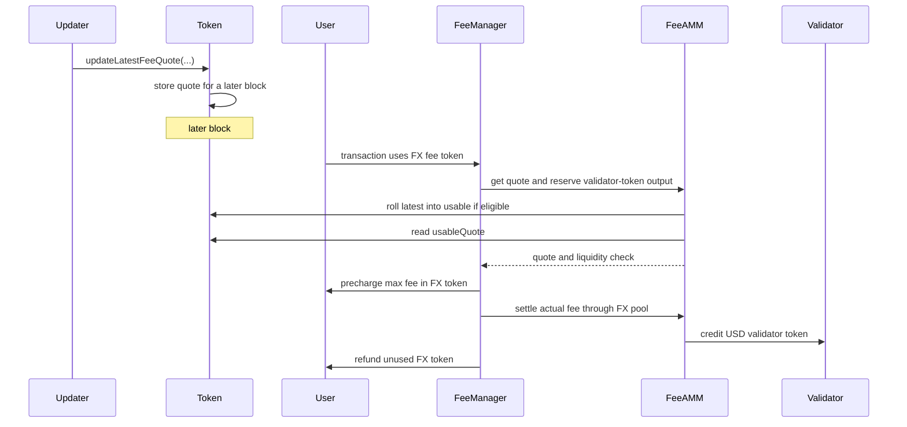

# TIP-1054: Non-USD Fee Tokens

<br>

## Abstract

TIP-1054 lets users pay transaction fees on Tempo with non-USD TIP-20 tokens. Upon adoption of this TIP, a non-USD token issuer who wants their token to be used for fees on Tempo can expose an oracle quote for the token's value denominated in USD.

Gas accounting does not change. Transactions still use the existing signed gas fields, Tempo still prices gas in attodollars, and validators still receive fees in USD. Users who use non-USD tokens for gas fees are charged based on the oracle quote.

<br>

## Motivation

Tempo already lets users choose among USD-denominated TIP-20 tokens to pay fees. TIP-1054 extends this so that, e.g., users holding non-USD stablecoins can transact on Tempo without needing to also hold USD-stables or get gas sponsorship.

<br>

## Design Overview

TIP-1054 has three moving pieces:

1. **The token stores a pushed fee quote.** A non-USD TIP-20 token may designate a fee quote updater and a quote policy. The updater may push the value of one whole token in `pathUSD`; the policy sets freshness and per-update quote-change limits within protocol caps.
2. **The token delays quote use by one block.** A pushed quote is stored immediately, but fees use only a quote pushed in an earlier block. This one-block delay avoids same-block fee-accounting races: a quote update, an FX-fee transaction, or a FeeAMM mutation could otherwise be ordered in ways that change the fee charged.
3. **FeeManager settles through a direct FX pool.** Before precharging the user, FeeManager uses the delayed quote and checks validator-token liquidity. The user then pays the FX token amount implied by that quote, and the validator receives its USD fee token from the direct pool `(userToken, validatorToken)`.



<br>

# Specification

## TIP-20 Changes

The fee oracle lives in the TIP-20 precompile. This TIP adds storage and entry points to the token rather than defining a separate oracle contract.

### Fee Oracle

A non-USD TIP-20 token opts into FX fees by setting a `feeQuoteUpdater` and a fee quote policy. Only the token's authorized admin MAY set or clear them. Successful changes MUST emit `FeeQuoteUpdaterSet` or `FeeQuotePolicySet`, and changing either value MUST clear the stored quotes. `feeQuoteUpdater = address(0)` means the token is not configured for FX fees.

USD tokens MUST reject nonzero fee quote updaters and nonzero fee quote policies.

### Fee Quotes

A fee quote has two fields: 
- `quoteId` is an updater-supplied monotonically increasing identifier for the quote.
- `pathUsdPerTokenX18` is the value of one whole token in `pathUSD`, scaled by `QUOTE_SCALE`. For example, if one token is worth `2.50 pathUSD`, the updater pushes `pathUsdPerTokenX18 = 2.5e18`.

The fee quote policy has two fields: 
- `maxFeeQuoteAgeBlocks` bounds how old the usable quote may be.
- `maxQuoteChangeBps` bounds how far a newly pushed quote may move from the latest accepted quote.

The protocol sets maximum values for both fields. The token issuer can choose smaller values to require fresher quotes or smaller per-update quote moves. A cleared policy has both fields set to zero.

A fee-quoting FX token MUST store two quote tuples:

```text
(usableQuote, usableQuoteBlock)
(latestQuote, latestQuoteBlock)
```

The latter is the newest accepted quote, the former is the quote FeeAMM may use, each with associated block in which that quote was published.

### Updating Quotes

The updater MAY call `updateLatestFeeQuote(quoteId, pathUsdPerTokenX18)` to push a new quote. The call MUST revert unless all of these conditions hold: 
- The caller is `feeQuoteUpdater`.
- The token has a valid fee quote policy.
- `quoteId` is greater than both `usableQuote.quoteId` and `latestQuote.quoteId`.
- `pathUsdPerTokenX18` is nonzero.
-  The new quote satisfies the token's quote-change limit:

```text
abs(pathUsdPerTokenX18 - latestQuote.pathUsdPerTokenX18) * BPS_SCALE
    <= latestQuote.pathUsdPerTokenX18 * maxQuoteChangeBps
```

Before accepting the new quote, the token MUST try to roll the existing `latestQuote` into `usableQuote` using the rule below. This prevents an older eligible quote from being skipped when no FeeAMM operation read the token in the previous block.

After that roll attempt, the token writes `{quoteId, pathUsdPerTokenX18}` as `latestQuote`, sets `latestQuoteBlock = block.number`, and emits `FeeQuoteUpdated`.

If more than one update is pushed for the same token in block `N`, only the first update can roll an older quote into `usableQuote`. Later same-block updates only overwrite `latestQuote` for later blocks and cannot affect fees in block `N`.

### Rolling Quotes

Rolling is the state transition that makes a pushed quote usable. A quote can roll only after the block in which it was pushed:

```text
if latestQuoteBlock != 0
   && latestQuoteBlock < block.number
   && latestQuoteBlock > usableQuoteBlock:
    usableQuote = latestQuote
    usableQuoteBlock = latestQuoteBlock
```

Before FeeAMM uses a token quote, it MUST call `rollFeeQuote()` for that token and then read `usableQuote`. 

A usable quote is valid only if the token has a valid fee quote policy and `block.number - usableQuoteBlock <= maxFeeQuoteAgeBlocks`. If the usable quote is invalid after `rollFeeQuote()`, the FX token is not fee-enabled for the current block and any operation that requires a valid quote MUST revert.

<br>

## Transaction Fee Token Selection

`setValidatorToken(token)` is unchanged and MUST remain USD-only.

`setUserToken(token)` MUST continue to accept every USD token accepted today. It MUST also accept a valid non-USD TIP-20 token when that token has a nonzero `feeQuoteUpdater` and a valid fee quote policy. For an FX token, `setUserToken(token)` checks only that quote updates and quote policy are configured. It MUST NOT require the token to be unpaused or to have a valid usable quote, because those conditions are block-dependent and are checked when a transaction is charged.

Tempo resolves a transaction's user fee token in the same order as before this TIP with the change that the token MAY be either a USD token or a fee-quoting FX token.

Resolution selects a candidate fee token; it does not guarantee that the transaction can be charged with that token. A resolved FX token is executable only if it is a valid non-USD TIP-20 token, is not paused at fee-collection time, has a nonzero `feeQuoteUpdater`, has a valid fee quote policy, has a valid usable quote after `rollFeeQuote()`, can be transferred by the fee payer under the existing token-policy rules, and the fee payer has enough balance to cover the maximum precharge. The direct FeeAMM pool from the resolved `userToken` to the block beneficiary's `validatorToken` MUST also have enough validator-token liquidity for `maxFeeUsd6`.

Amount checks denominated in the user's fee token, including balance checks, account-key limits, and transaction-pool cost accounting, MUST use the FX token amounts computed by this TIP. Validator reserve checks and gas accounting remain USD6-denominated. Pending FX-fee transactions MUST be revalidated when quote state, quote-updater state, token pause state, token policy, or direct-pool reserves change.

<br>

## FeeAMM Behavior

FeeAMM converts the existing USD6 fee amount into two token movements: an FX-token debit from the user and a USD-token credit to the validator. The validator payout is computed from the USD6 fee amount, not by re-valuing the rounded FX-token debit.

### Transaction Fee Settlement

For a transaction that resolves to a USD user fee token, existing fee-collection semantics are unchanged.

For a transaction that resolves to an FX user fee token, pre-tx collection MUST happen before user code runs:

1. FeeManager asks FeeAMM to call `rollFeeQuote()` for `userToken` and to read and return `userToken.usableFeeQuote()`.
2. Fee collection reverts if the resolved FX token is not executable in the current block.
3. FeeManager records `quote.quoteId` and `quote.pathUsdPerTokenX18` in transaction-scoped fee state, then computes `maxUserTokenFee = fxTokenAmountForUsd6(maxFeeUsd6, quote.pathUsdPerTokenX18)`.
4. FeeManager transfers `maxUserTokenFee` from the fee payer through the existing precharge path.
5. FeeAMM computes `reservedValidatorOut = validatorFeeOut(maxFeeUsd6)`.
6. FeeAMM verifies that the direct pool has at least `reservedValidatorOut` validator-token reserve, and reserves that amount using the existing FeeManager reservation model.

Post-tx collection MUST use the transaction-scoped quote recorded during pre-tx collection, not a fresh read from the token:

1. The protocol recomputes `actualFeeUsd6` using existing gas accounting.
2. The protocol computes `actualUserTokenSpend = fxTokenAmountForUsd6(actualFeeUsd6, quote.pathUsdPerTokenX18)`.
3. FeeManager computes `refundUserToken = maxUserTokenFee - actualUserTokenSpend` and refunds it to the fee payer.
4. FeeAMM credits the validator with `validatorFeeOut(actualFeeUsd6)` in `validatorToken`.
5. FeeAMM increases `reserve_user_token` by `actualUserTokenSpend` and decreases `reserve_validator_token` by the validator credit.
6. `collect_fee_post_tx` emits `FXFeeSettled` if `actualUserTokenSpend` or `refundUserToken` is nonzero.

If `actualFeeUsd6 == 0`, then `actualUserTokenSpend == 0`, the full precharge is refunded, and no pool swap or validator credit occurs. Any quote update or FeeAMM mutation performed by the transaction body MUST NOT affect that transaction's own fee calculation.

The `FXFeeSettled` event records the quote id and price actually used. The precharged FX-token amount is `userTokenIn + userTokenRefund`; the maximum USD6 fee remains derivable from the transaction's signed gas fields and block base fee.

### FX Direct Pools

An FX direct pool is a directional FeeAMM pool keyed by `(userToken, validatorToken)`. `userToken` MUST be a valid non-USD TIP-20 token, `validatorToken` MUST be a valid USD fee token, and `userToken != validatorToken`. The existing FeeAMM rule that both pool tokens are USD-denominated does not apply to FX direct pools.

For fee settlement, the pool's validator-token reserve is the binding liquidity check. A pool has enough liquidity for a transaction with maximum fee `maxFeeUsd6` iff:

```text
reserve_validator_token >= validatorFeeOut(maxFeeUsd6)
```

The user-token reserve is not part of this liquidity check. The user's input amount comes from the usable quote, while the validator payout comes from the USD6 fee amount and the existing FeeAMM spread:

```text
userTokenIn  = fxTokenAmountForUsd6(actualFeeUsd6, priceX18)
validatorOut = validatorFeeOut(actualFeeUsd6)

reserve_user_token      += userTokenIn
reserve_validator_token -= validatorOut
```

### Rebalance Swaps

The existing `rebalanceSwap(userToken, validatorToken, amountOut, to)` remains unchanged for USD pools and MUST revert for FX direct pools.

`rebalanceSwapFX(...)` is the FX-specific rebalance entry point. Before it reads the quote, FeeAMM MUST call `rollFeeQuote()` and MUST revert unless `userToken` has a valid usable quote for the current block.

`rebalanceSwapFX(...)` MUST compute:

```text
fairUsd6        = usd6ValueCeil(amountOutUserToken, priceX18)
amountInValTok  = validatorRebalanceIn(fairUsd6)
```

If `amountOutUserToken == 0` or `amountInValTok > maxAmountInValTok`, the call MUST revert. On success, FeeAMM MUST transfer `amountInValTok` of `validatorToken` from the caller into the pool, transfer `amountOutUserToken` of `userToken` from the pool to `to`, update pool reserves, and emit the existing `RebalanceSwap` event with `amountIn = amountInValTok` and `amountOut = amountOutUserToken`.

### Mint and Burn

For the first `mint(userToken, validatorToken, amountValidatorToken, to)` on an FX direct pool, FeeAMM MUST call `rollFeeQuote()` and MUST revert unless `userToken` has a valid usable quote for the current block. The caller deposits only `validatorToken`, `MIN_LIQUIDITY` remains permanently locked, and the bootstrap formula is unchanged. The quote is used only to confirm that the pool's FX token is currently fee-enabled; it is not used in the bootstrap formula.

For later mints, FeeAMM MUST call `rollFeeQuote()` and use the usable quote for `userToken` in the current block. Let `U = reserve_user_token`, `V = reserve_validator_token`, `S = totalSupply`, `priceX18` be the usable quote, and `amountValidatorToken` be the caller's deposit. The minted liquidity MUST be:

```text
userReserveUsd6
    = usd6ValueCeil(U, priceX18)

liquidity
    = floor(amountValidatorToken * S / (V + userReserveUsd6))
```

As in the existing FeeAMM, `liquidity == 0` MUST revert.

`burn(userToken, validatorToken, liquidity, to)` is unchanged for FX direct pools. It returns the caller's pro-rata share of both reserves and updates supply and reserves exactly as it does today. `burn()` does not read the quote and MUST remain available even if `userToken` is no longer fee-enabled or does not have a valid usable quote.

The arithmetic helpers used by this section are defined below.

<br>

## Reference Details

### Terms

- **`pathUSD`** is the quote asset for this TIP and the root of the existing TIP-20 quote-token graph. It is not a gas-accounting unit.
- **USD6 amount** means a nominal USD amount expressed in ordinary 6-decimal TIP-20 units.
- **USD token** means a valid USD-denominated TIP-20 fee token under the existing Tempo rules.
- **FX token** means a non-USD TIP-20 token.
- **fee-quoting FX token** means a valid FX TIP-20 token with a nonzero `feeQuoteUpdater` and a valid fee quote policy.
- **Tempo Transaction** means a Tempo transaction whose account-abstraction envelope is present and whose executable calls are taken from `aa_calls`.

The fee amounts used by this TIP are:

```text
gasBalanceSpending(gas, gasPrice)
    = ceilDiv(gas * gasPrice, GAS_PRICE_SCALE)

maxFeeUsd6
    = gasBalanceSpending(tx.gasLimit, tx.effectiveGasPrice(B.basefee))

actualFeeUsd6
    = gasBalanceSpending(gasUsed, tx.effectiveGasPrice(B.basefee))
```

`maxFeeUsd6` and `actualFeeUsd6` exclude transaction value. They are the existing USD6 amounts produced by Tempo's current gas accounting.

### Arithmetic

The existing USD6 fee amount remains the source of truth. Validator payout is computed from that USD6 amount, not by re-valuing the rounded user-token debit. For any valid usable quote `priceX18 = pathUsdPerTokenX18`:

```text
ceilDiv(a, b) = 0 if a == 0, otherwise floor((a - 1) / b) + 1

fxTokenAmountForUsd6(usd6Amount, priceX18)
    = ceilDiv(usd6Amount * QUOTE_SCALE, priceX18)

usd6ValueCeil(tokenAmount, priceX18)
    = ceilDiv(tokenAmount * priceX18, QUOTE_SCALE)

validatorFeeOut(usd6Amount)
    = floor(usd6Amount * FEE_AMM_M / FEE_AMM_SCALE)

validatorRebalanceIn(usd6Amount)
    = floor(usd6Amount * FEE_AMM_N / FEE_AMM_SCALE) + 1
```

All arithmetic in these formulas uses checked unsigned 256-bit integers. Overflow, underflow, division by zero, or a pool reserve value that cannot fit in storage MUST revert.

Rounding is consensus behavior: user-token fee debits round up; USD6 valuation for `rebalanceSwapFX` and mint reserve valuation round up; validator-token payout in fee settlement rounds down; and validator-token input in rebalance swaps uses the existing `floor(x * N / SCALE) + 1` rule. Any extra user-token amount caused by rounding remains in the pool or fee-manager path implied by these formulas.

### Constants

```text
QUOTE_SCALE        = 10^18
GAS_PRICE_SCALE    = 10^12
FEE_AMM_SCALE      = 10000
FEE_AMM_M          = 9970   // existing fee-swap multiplier
FEE_AMM_N          = 9985   // existing rebalance multiplier
BPS_SCALE          = 10000
PROTOCOL_MAX_FEE_QUOTE_AGE_BLOCKS = TBD  // upper bound for token policy maxFeeQuoteAgeBlocks
PROTOCOL_MAX_QUOTE_CHANGE_BPS = TBD      // upper bound for token policy maxQuoteChangeBps
```

All token amounts and USD6 amounts are expressed in ordinary 6-decimal TIP-20 units unless a field or formula explicitly says `X18`.

The protocol constants are maximums. The token's authorized admin MAY set smaller policy values to require fresher quotes or a lower per-update quote change. A fee quote policy is valid only if:

```text
0 < maxFeeQuoteAgeBlocks <= PROTOCOL_MAX_FEE_QUOTE_AGE_BLOCKS
0 < maxQuoteChangeBps <= PROTOCOL_MAX_QUOTE_CHANGE_BPS
```

### Existing Surfaces

The transaction's signed USD6 fee bound remains the existing bound implied by its gas fields and attodollar gas accounting. `TIP-1007` remains unchanged: `getFeeToken()` continues to expose the resolved fee token for the current transaction.

Except for `FXFeeSettled`, `FeeQuoteUpdaterSet`, `FeeQuotePolicySet`, and `FeeQuoteUpdated`, this TIP does not standardize additional fee-settlement events, receipt fields, or RPC surfaces.

### Interfaces and Events

```solidity
interface ITIP20FeeOracle {
    struct FeeQuote {
        uint64 quoteId;
        uint192 pathUsdPerTokenX18;
    }

    struct FeeQuotePolicy {
        uint64 maxFeeQuoteAgeBlocks;
        uint32 maxQuoteChangeBps;
    }

    event FeeQuoteUpdaterSet(
        address indexed setter,
        address indexed oldUpdater,
        address indexed newUpdater
    );

    event FeeQuotePolicySet(
        address indexed setter,
        uint64 maxFeeQuoteAgeBlocks,
        uint32 maxQuoteChangeBps
    );

    event FeeQuoteUpdated(
        address indexed updater,
        uint64 indexed quoteBlock,
        uint64 quoteId,
        uint192 pathUsdPerTokenX18
    );

    function feeQuoteUpdater() external view returns (address updater);

    function feeQuotePolicy() external view returns (FeeQuotePolicy memory policy);

    function setFeeQuoteUpdater(address updater) external;

    function setFeeQuotePolicy(FeeQuotePolicy calldata policy) external;

    function updateLatestFeeQuote(
        uint64 quoteId,
        uint192 pathUsdPerTokenX18
    ) external;

    function rollFeeQuote() external returns (bool rolled);

    function usableFeeQuote()
        external
        view
        returns (FeeQuote memory quote, uint64 quoteBlock);

    function latestFeeQuote()
        external
        view
        returns (FeeQuote memory quote, uint64 quoteBlock);
}
```

```solidity
event FXFeeSettled(
    address indexed feePayer,
    address indexed beneficiary,
    address indexed userToken,
    address validatorToken,
    uint64 quoteId,
    uint192 pathUsdPerTokenX18,
    uint256 actualFeeUsd6,
    uint256 userTokenIn,
    uint256 userTokenRefund,
    uint256 validatorCredit
);
```

```solidity
function rebalanceSwapFX(
    address userToken,
    address validatorToken,
    uint256 amountOutUserToken,
    uint256 maxAmountInValTok,
    address to
) external returns (uint256 amountInValTok);
```
