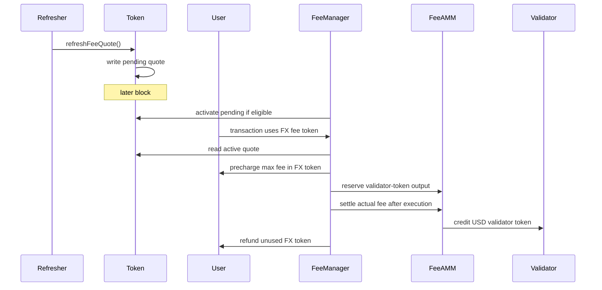

# TIP-1054: Non-USD Fee Tokens

<br>

## Abstract

TIP-1054 lets users pay Tempo transaction fees with non-USD TIP-20 tokens.

Gas accounting does not change. Transactions still use the existing signed gas fields, Tempo still prices gas in attodollars, and validators still receive fees through the existing USD fee-token path.

A non-USD token can be used for fees when the token exposes a `pathUSD` fee quote and maintains the quote cache defined in this TIP. Fee settlement uses the token's active cached quote, not a live same-block oracle read.

Each token keeps three quote slots: `active`, `previous`, and `pending`. Quote refreshes only write `pending`; an eligible pending quote becomes active no earlier than the next block. Multiple refreshes in the same block overwrite the same pending slot, so only the last refresh from that block can later become active.

This version supports only direct FeeAMM pools from the user's non-USD token to the validator's USD fee token. It does not add multi-hop routing, validator-side non-USD fee preferences, or new signed fee fields.

<br>

## Motivation

Tempo already lets users choose among USD-denominated TIP-20 fee tokens. Users who mainly hold another asset must first swap into a USD fee token before they can transact.

TIP-1054 removes that extra step on the user side. A user can pay fees in a fee-quoting non-USD token, while the validator still receives its preferred USD fee token.

The design keeps the existing fee model intact:

- gas prices and fee caps remain attodollar-denominated;
- the maximum and actual fee amounts are still computed as 6-decimal USD amounts;
- validators still settle in USD fee tokens; and
- the transaction format does not change.

The only new input is an oracle quote for the user's non-USD token. To keep that quote readable and deterministic, the quote lives behind the token interface and is copied into protocol state before it can affect fees.

This avoids a client-only parent-state oracle read. The last usable quote is ordinary state: fee collection reads `token.activeFeeQuote()`, and tools can also inspect `token.previousFeeQuote()`.

<br>

## Assumptions

This TIP depends on the following assumptions:

1. `TIP-1000` and `TIP-1010` continue to define gas prices in attodollars.
2. Tempo continues to derive fee debits as 6-decimal USD amounts before converting them into token units.
3. All TIP-20 tokens continue to use fixed 6-decimal units.
4. `pathUSD` is the quote asset for this TIP. It is not a new gas-accounting unit.
5. Accepted USD fee tokens are treated at par with `pathUSD` for this TIP.
6. Validator fee tokens remain USD-only.
7. FX fee settlement uses only the direct pool `(userToken, validatorToken)`.
8. Users do not sign a token-unit fee cap in this version.
9. Token admins are responsible for exposing fee quotes that are suitable for fee payment.
10. Quote refreshers are not trusted. They can choose when to refresh, but they cannot make a same-block quote affect fee settlement.

If one of these assumptions no longer holds, the affected token should be disabled for fee payment or the behavior should be changed in a follow-up TIP.

<br>

# Specification

TIP-1054 introduces three changes:

- Non-USD TIP-20 tokens may expose fee quotes and a cached quote state.
- `FeeManager` may accept a fee-quoting non-USD TIP-20 token as a user fee token.
- FeeAMM may host direct pools that swap a user's non-USD fee token into the validator's USD fee token.

The high-level flow for an FX fee transaction is:



<br>

## Scope

This TIP applies only to user-side transaction fee payment in non-USD TIP-20 tokens.

This TIP does not introduce:

- non-USD validator fee-token preferences;
- changes to the transaction format;
- signed token-unit fee caps;
- multi-hop or generalized FeeAMM routing;
- oracle-based repricing of USD validator tokens against `pathUSD`;
- standardized mempool invalidation rules;
- new receipt fields or RPC surfaces beyond the events listed here; or
- wallet UX requirements.

USD-denominated user fee tokens keep their existing behavior, except where an interface is explicitly broadened to also admit non-USD tokens.

<br>

## Definitions

For this TIP:

- **`pathUSD`** is the quote asset for this TIP and the root of the existing TIP-20 quote-token graph. It is not a gas-accounting unit.
- **USD6 amount** means a nominal USD amount expressed in ordinary 6-decimal TIP-20 units.
- **USD token** means a valid USD-denominated TIP-20 fee token under the existing Tempo rules.
- **FX token** means a non-USD TIP-20 token.
- **user token** means the token used by the fee payer.
- **validator token** means the USD token used for validator fee credit.
- **fee-quoting FX token** means a valid FX TIP-20 token that implements the fee quote cache interface in this TIP.
- **active quote** means the quote currently used for fee settlement and FX FeeAMM operations.
- **previous quote** means the active quote that was replaced by the last activation.
- **pending quote** means the latest sampled quote that is not active yet.
- **fee-enabled FX token for block `B`** means a fee-quoting FX token whose active quote is valid for block `B`.
- **executable FX fee token** means a fee-enabled FX token that also passes the live transaction checks in [Execution-Time Validity](#execution-time-validity).
- **Tempo AA transaction** means a Tempo transaction whose account-abstraction envelope is present and whose executable calls are taken from `aa_calls`.

The fee amounts used by this TIP are:

```text
gasBalanceSpending(gas, gasPrice)
    = ceilDiv(gas * gasPrice, GAS_PRICE_SCALE)

maxFeeUsd6
    = gasBalanceSpending(tx.gasLimit, tx.effectiveGasPrice(B.basefee))

actualFeeUsd6
    = gasBalanceSpending(gasUsed, tx.effectiveGasPrice(B.basefee))
```

`maxFeeUsd6` and `actualFeeUsd6` exclude transaction value. They are the existing USD6 amounts produced by Tempo's current gas accounting.

<br>

## Constants

```text
ORACLE_SCALE       = 10^18
GAS_PRICE_SCALE    = 10^12
FEE_AMM_SCALE      = 10000
FEE_AMM_M          = 9970   // existing fee-swap multiplier
FEE_AMM_N          = 9985   // existing rebalance multiplier
FEE_ORACLE_GAS     = 200000
MAX_FEE_ORACLE_AGE = 3600   // seconds
```

All token amounts and USD6 amounts are expressed in ordinary 6-decimal TIP-20 units unless a field or formula explicitly says `X18`.

<br>

## Interfaces

This section lists the interfaces introduced or extended by this TIP. Behavioral requirements are defined in later sections.

### TIP-20 Fee Quote Cache

```solidity
interface ITIP20FeeQuoteCache {
    struct FeeQuote {
        uint64 roundId;
        uint192 pathUsdPerTokenX18;
        uint64 updatedAt;
        uint64 sampledAt;
        uint64 sampledBlock;
        bool valid;
    }

    event FeeQuoteRefreshed(
        address indexed updater,
        uint64 indexed sampledBlock,
        bool valid,
        uint64 roundId,
        uint192 pathUsdPerTokenX18,
        uint64 updatedAt
    );

    event FeeQuoteActivated(
        uint64 indexed activatedBlock,
        uint64 indexed sampledBlock,
        bool valid,
        uint64 roundId,
        uint192 pathUsdPerTokenX18,
        uint64 updatedAt
    );

    function latestPathUsdQuote()
        external
        view
        returns (
            uint64 roundId,
            uint192 pathUsdPerTokenX18,
            uint64 updatedAt
        );

    function refreshFeeQuote() external returns (FeeQuote memory pending);

    function activateFeeQuote() external returns (bool activated);

    function activeFeeQuote() external view returns (FeeQuote memory quote);

    function previousFeeQuote() external view returns (FeeQuote memory quote);

    function pendingFeeQuote() external view returns (FeeQuote memory quote);
}
```

### FeeManager FX Settlement Event

```solidity
event FXFeeSettled(
    address indexed feePayer,
    address indexed beneficiary,
    address indexed userToken,
    address validatorToken,
    uint64 roundId,
    uint192 pathUsdPerTokenX18,
    uint256 actualFeeUsd6,
    uint256 userTokenIn,
    uint256 userTokenRefund,
    uint256 validatorCredit
);
```

### FeeAMM FX Rebalance Entry Point

```solidity
function rebalanceSwapFX(
    address userToken,
    address validatorToken,
    uint256 amountOutUserToken,
    uint256 maxAmountInValTok,
    address to
) external returns (uint256 amountInValTok);
```

<br>

## Token Fee Quotes

The fee quote interface lives on the TIP-20 token. The token may produce the quote directly, read its own oracle configuration, or call another contract internally. This TIP standardizes only the token-facing interface and cache behavior.

`latestPathUsdQuote()` returns the token's latest quote of one whole token in `pathUSD`, scaled by `ORACLE_SCALE`.

For example, if one token is worth `2.50 pathUSD`, `latestPathUsdQuote()` returns `pathUsdPerTokenX18 = 2.5e18`.

The protocol MUST NOT use `latestPathUsdQuote()` directly for fee settlement. It is only the source sampled by `refreshFeeQuote()`.

For USD tokens, the fee quote cache interface MUST NOT make the token usable as an FX fee token. USD fee tokens continue to use the existing USD fee-token path.

<br>

## Quote Cache State

Each fee-quoting FX token stores three quote slots:

```text
activeFeeQuote
previousFeeQuote
pendingFeeQuote
```

Each quote stores:

- `roundId`: source round identifier for the sampled quote;
- `pathUsdPerTokenX18`: `pathUSD` per whole token, scaled by `ORACLE_SCALE`;
- `updatedAt`: source timestamp for the sampled quote;
- `sampledAt`: block timestamp when the quote was sampled;
- `sampledBlock`: block number when the quote was sampled; and
- `valid`: whether the sampled quote passed this TIP's validity checks at sampling time.

`activeFeeQuote` is the only quote used for fee settlement, FX pool mint, and FX rebalance.

`previousFeeQuote` is informational protocol state. It records the active quote that was replaced by the most recent activation.

`pendingFeeQuote` is the latest sampled quote waiting for activation. It is not used for fee settlement.

<br>

## Refreshing Quotes

`refreshFeeQuote()` samples the token's current `latestPathUsdQuote()` result and writes `pendingFeeQuote`.

Before sampling, `refreshFeeQuote()` MUST first activate any eligible pending quote for the token. This prevents a new-block refresh from overwriting an older pending quote that should already be able to become active.

The quote source read is part of `refreshFeeQuote()` and is bounded by `FEE_ORACLE_GAS`. The refresh caller pays the normal cost of calling `refreshFeeQuote()`.

The source read MUST be read-only. It may read the token's own quote state or call other contracts under ordinary EVM `STATICCALL` semantics, but it MUST NOT modify persistent or transient state except for the later pending-slot write performed by `refreshFeeQuote()`.

A sampled quote is valid at sampling time iff all of the following hold:

1. the call succeeds and decodes correctly;
2. `roundId != 0`;
3. `pathUsdPerTokenX18 != 0`;
4. `updatedAt != 0`;
5. `updatedAt <= block.timestamp`; and
6. `block.timestamp - updatedAt <= MAX_FEE_ORACLE_AGE`.

If any condition fails, `refreshFeeQuote()` MUST still write `pendingFeeQuote`, but with `valid = false`. This lets an invalid refresh disable future fee use after activation instead of leaving an old quote active forever.

`refreshFeeQuote()` MUST set `sampledAt = block.timestamp` and `sampledBlock = block.number` for every pending write.

`refreshFeeQuote()` MUST emit `FeeQuoteRefreshed` for every refresh.

<br>

## Activating Quotes

`activateFeeQuote()` moves an eligible pending quote into the active slot.

A pending quote is eligible iff:

```text
pendingFeeQuote.sampledBlock < block.number
```

If the pending quote is not eligible, `activateFeeQuote()` MUST leave `activeFeeQuote`, `previousFeeQuote`, and `pendingFeeQuote` unchanged and return `false`.

If the pending quote is eligible, `activateFeeQuote()` MUST:

1. set `previousFeeQuote = activeFeeQuote`;
2. set `activeFeeQuote = pendingFeeQuote`;
3. clear `pendingFeeQuote`; and
4. emit `FeeQuoteActivated`.

An invalid pending quote can be activated. After activation, the token is not fee-enabled until a later valid quote becomes active.

Fee settlement, FX pool mint, and FX rebalance MUST call `activateFeeQuote()` or apply equivalent activation logic before reading `activeFeeQuote`.

They MUST NOT call `refreshFeeQuote()` as part of fee settlement. Refresh writes only pending state and cannot help the current transaction.

<br>

## Same-Block Refresh Rule

A quote sampled in block `N` MUST NOT become active in block `N`. It MUST only be written to `pendingFeeQuote`.

If `refreshFeeQuote()` is called multiple times for the same token in block `N`, each call overwrites `pendingFeeQuote` with `sampledBlock = N`. After any older eligible pending quote has been activated, the active and previous slots remain unchanged for the rest of those same-block refreshes.

Only the final pending quote from block `N` can later become active. It can become active no earlier than block `N + 1`.

This rule prevents a token admin, oracle updater, keeper, or block builder from changing the fee price used by another transaction in the same block by refreshing the quote twice.

<br>

## Active Quote Validity

An active quote is valid for block `B` iff all of the following hold:

1. `activeFeeQuote.valid == true`;
2. `activeFeeQuote.roundId != 0`;
3. `activeFeeQuote.pathUsdPerTokenX18 != 0`;
4. `activeFeeQuote.updatedAt != 0`;
5. `activeFeeQuote.updatedAt <= B.timestamp`; and
6. `B.timestamp - activeFeeQuote.updatedAt <= MAX_FEE_ORACLE_AGE`.

If any condition fails, the FX token is not fee-enabled for block `B`. Any operation that requires a valid quote MUST revert if the active quote is invalid for the current block.

<br>

## Fee-Token Resolution

A user transaction MAY resolve to either:

- a USD token under the existing Tempo rules; or
- an FX token under this TIP.

`setUserToken(token)` MUST accept:

- any valid USD token accepted today; and
- any valid fee-quoting FX token.

`setValidatorToken(token)` is unchanged and MUST remain USD-only.

For an FX token, `setUserToken(token)` checks that the token exposes the fee quote cache interface at the time the call executes. It MUST NOT require the active quote for the current block to be valid.

### Same-Transaction `setUserToken()`

The existing immediate-effect rule for direct `setUserToken()` calls is preserved.

If all of the following hold:

1. the transaction does not explicitly set a `feeToken`;
2. the transaction is not a Tempo AA transaction;
3. the fee payer equals the transaction caller; and
4. the first and only fee-token-resolution-relevant call is a direct call to `FeeManager.setUserToken(token)`,

then the resolved user fee token for that same transaction MUST be `token`, rather than the user's previously stored preference.

This rule applies to both USD tokens and fee-quoting FX tokens. The transaction MAY still fail later if the resolved FX token is not executable in the current block.

### Fee-Token Inference

Tempo MUST continue to infer a fee token from a TIP-20 token contract only for the existing transfer-like calls:

- `transfer(...)`
- `transferWithMemo(...)`
- `distributeReward(...)`

For transactions that are not Tempo AA transactions, the existing direct-call inference rule is unchanged except that the inferred token MAY now be an FX token.

For Tempo AA transactions, inference applies only when:

1. the fee payer equals the transaction caller; and
2. every `aa_calls` entry targets the same TIP-20 token contract and uses one of the three selectors above.

This TIP does not extend FX inference to the Stablecoin DEX input-token path. Stablecoin DEX fee-token inference remains USD-only.

Inference only resolves a candidate fee token. If the inferred token is an FX token, the transaction is executable only if it passes the execution-time checks below.

### Execution-Time Validity

An FX token is executable as a user fee token in block `B` only if all of the following hold:

1. it is a valid TIP-20 token;
2. it is not paused at fee-collection time;
3. it is a fee-quoting FX token;
4. its active quote is valid for block `B` after applying any eligible activation;
5. the fee payer is authorized to transfer that token to `FeeManager` under the existing token-policy rules;
6. the fee payer has enough balance to cover the precharged maximum token amount; and
7. the direct FeeAMM pool `(userToken, validatorToken)` has enough validator-token liquidity for `maxFeeUsd6`.

<br>

## Conversion and Rounding

For any valid active quote `priceX18 = pathUsdPerTokenX18`:

```text
ceilDiv(a, b) = 0 if a == 0, otherwise floor((a - 1) / b) + 1

fxTokenAmountForUsd6(usd6Amount, priceX18)
    = ceilDiv(usd6Amount * ORACLE_SCALE, priceX18)

usd6ValueFloor(tokenAmount, priceX18)
    = floor(tokenAmount * priceX18 / ORACLE_SCALE)

usd6ValueCeil(tokenAmount, priceX18)
    = ceilDiv(tokenAmount * priceX18, ORACLE_SCALE)

validatorFeeOut(usd6Amount)
    = floor(usd6Amount * FEE_AMM_M / FEE_AMM_SCALE)

validatorRebalanceIn(usd6Amount)
    = floor(usd6Amount * FEE_AMM_N / FEE_AMM_SCALE) + 1
```

All arithmetic in these formulas uses checked unsigned 256-bit integers. Overflow, underflow, division by zero, or a pool reserve value that cannot fit in storage MUST revert.

Rounding is consensus behavior:

- user-token fee debits round up;
- USD6 valuation for `rebalanceSwapFX` rounds up;
- validator-token payout in fee settlement rounds down; and
- validator-token input in rebalance swaps uses the existing `floor(x * N / SCALE) + 1` rule.

The USD6 fee amount remains the source of truth. Validator payout is computed from that USD6 amount, not by re-valuing the rounded user-token debit.

Any extra user-token dust caused by rounding remains in the pool or fee-manager path implied by these formulas.

<br>

## Fee Collection

For a transaction that resolves to a USD user fee token, existing fee-collection semantics are unchanged.

For a transaction that resolves to an FX user fee token, fee collection uses the token's active quote.

### Pre-Tx Collection

Let:

- `userToken` be the resolved FX fee token;
- `validatorToken` be the block beneficiary's USD fee token under existing rules;
- `quote` be `userToken.activeFeeQuote()` after applying any eligible activation; and
- `maxFeeUsd6` be the transaction's existing maximum fee spending, expressed as a USD6 amount.

At `collect_fee_pre_tx` time, the protocol MUST:

1. validate that `userToken` is fee-enabled for block `B`;
2. compute `maxUserTokenFee = fxTokenAmountForUsd6(maxFeeUsd6, quote.pathUsdPerTokenX18)`;
3. transfer `maxUserTokenFee` from the fee payer to `FeeManager` through the existing fee-precharge path;
4. compute `reservedValidatorOut = validatorFeeOut(maxFeeUsd6)`;
5. check that the direct pool `(userToken, validatorToken)` has at least `reservedValidatorOut` validator-token reserve; and
6. reserve that validator-token amount for the pending transaction using the existing `FeeManager` reservation model.

No route identifier is required because this TIP allows only direct pools.

### Post-Tx Collection

Let `actualFeeUsd6` be the transaction's actual fee spending under existing gas accounting.

At `collect_fee_post_tx` time, the protocol MUST use the same active quote recorded during pre-tx collection.

It MUST:

1. recompute `actualFeeUsd6` using existing gas accounting;
2. compute `actualUserTokenSpend = fxTokenAmountForUsd6(actualFeeUsd6, quote.pathUsdPerTokenX18)`;
3. compute `refundUserToken = maxUserTokenFee - actualUserTokenSpend`;
4. refund `refundUserToken` to the fee payer through the existing fee-refund path;
5. compute `validatorCredit = validatorFeeOut(actualFeeUsd6)`;
6. add `actualUserTokenSpend` to the pool's `reserve_user_token`;
7. subtract `validatorCredit` from the pool's `reserve_validator_token`; and
8. increment the validator's collected-fee balance in `validatorToken` by `validatorCredit`.

If `actualFeeUsd6 == 0`, then `actualUserTokenSpend == 0`, the full precharge is refunded, and no pool swap or validator credit occurs.

Post-tx settlement MUST NOT refresh the quote or read a newer active quote than the one used for pre-tx collection.

`collect_fee_post_tx` MUST emit `FXFeeSettled` for every FX fee-token transaction with a nonzero `actualUserTokenSpend` or nonzero `refundUserToken`.

The event records the round and price actually used. The precharged FX-token amount is `userTokenIn + userTokenRefund`; the maximum USD6 fee remains derivable from the transaction's signed gas fields and block base fee.

<br>

## FX Direct Pools

An FX direct pool is a directional FeeAMM pool keyed by:

```text
(userToken, validatorToken)
```

where `userToken` is an FX token and `validatorToken` is a USD fee token.

For every FX direct-pool operation:

- `userToken` MUST be a valid non-USD TIP-20 token;
- `validatorToken` MUST be a valid USD fee token;
- `userToken != validatorToken`; and
- the existing FeeAMM rule that both tokens are USD-denominated is replaced by this section's FX direct-pool rules.

### Liquidity for Fee Settlement

For FX fee settlement, liquidity depends only on the USD6 fee amount and the pool's validator-token reserve.

A pool has enough liquidity for a transaction with maximum fee `maxFeeUsd6` iff:

```text
reserve_validator_token >= validatorFeeOut(maxFeeUsd6)
```

The user-token input amount is not part of the liquidity check.

### Fee Swap

FX fee settlement does not use the pool reserve ratio to price the swap. Instead:

- the user's input amount comes from the active quote; and
- the validator payout comes from the USD6 fee amount and the existing FeeAMM spread.

On settlement of `actualFeeUsd6`:

```text
userTokenIn  = fxTokenAmountForUsd6(actualFeeUsd6, priceX18)
validatorOut = validatorFeeOut(actualFeeUsd6)
```

The pool reserves update as:

```text
reserve_user_token      += userTokenIn
reserve_validator_token -= validatorOut
```

### Rebalance Swap

The existing `rebalanceSwap(userToken, validatorToken, amountOut, to)` remains unchanged for USD pools and MUST revert for FX direct pools.

`rebalanceSwapFX(...)` is the FX-specific rebalance entry point.

It MUST apply any eligible quote activation and then use `userToken.activeFeeQuote()`. If `userToken` does not have a valid active quote for the current block, the call MUST revert.

It MUST compute:

```text
fairUsd6        = usd6ValueCeil(amountOutUserToken, priceX18)
amountInValTok  = validatorRebalanceIn(fairUsd6)
```

If `amountInValTok > maxAmountInValTok`, the call MUST revert.

On success, `rebalanceSwapFX` MUST:

1. transfer `amountInValTok` of `validatorToken` from the caller into the pool;
2. transfer `amountOutUserToken` of `userToken` from the pool to `to`;
3. update pool reserves; and
4. emit the existing `RebalanceSwap` event with `amountIn = amountInValTok` and `amountOut = amountOutUserToken`.

### Mint

For the first `mint(userToken, validatorToken, amountValidatorToken, to)` on an FX direct pool:

- `userToken` MUST have a valid active quote for the current block after applying any eligible activation;
- the caller deposits only `validatorToken`;
- `MIN_LIQUIDITY` remains permanently locked; and
- the bootstrap formula is unchanged.

The quote is used only to confirm that the pool's FX token is currently fee-enabled. It is not used in the bootstrap formula.

For later mints, let:

- `U = reserve_user_token`;
- `V = reserve_validator_token`;
- `S = totalSupply`;
- `priceX18` be the active quote for `userToken` in the current block; and
- `amountValidatorToken` be the caller's deposit.

If `userToken` does not have a valid active quote for the current block, the call MUST revert.

The minted liquidity MUST be:

```text
discountedUserReserveUsd6
    = floor(usd6ValueFloor(U, priceX18) * FEE_AMM_N / FEE_AMM_SCALE)

liquidity
    = floor(amountValidatorToken * S / (V + discountedUserReserveUsd6))
```

As in the existing FeeAMM, `liquidity == 0` MUST revert.

### Burn

`burn(userToken, validatorToken, liquidity, to)` is unchanged for FX direct pools. It returns the caller's pro-rata share of both reserves and updates supply and reserves exactly as it does today.

`burn()` does not read the quote. It MUST remain available even if `userToken` is no longer fee-enabled or does not have a valid active quote.

<br>

## Transaction Format and Existing Surfaces

This TIP does not add any signed fee field.

The transaction's signed fee bound remains the existing bound implied by its gas fields and attodollar gas accounting. The exact token-unit debit for an FX fee token is derived from the token's active quote and the existing USD6 fee amount.

`TIP-1007` remains unchanged: `getFeeToken()` continues to expose the resolved fee token for the current transaction.

Except for `FXFeeSettled`, `FeeQuoteRefreshed`, and `FeeQuoteActivated`, this TIP does not standardize additional fee-settlement events, receipt fields, or RPC surfaces.

<br>

# Invariants

The following invariants must always hold:

1. Gas accounting, base-fee checks, and signed fee bounds remain attodollar-denominated.
2. `maxFeeUsd6` and `actualFeeUsd6` are computed by the existing Tempo rules before any FX-token conversion.
3. `pathUSD` is only an oracle quote asset in this TIP.
4. Validators receive fees only through the existing USD fee-token path and `FeeManager` credit model.
5. A quote refreshed in block `N` cannot affect fee settlement until a later block.
6. Multiple refreshes for the same token in one block only overwrite `pendingFeeQuote`.
7. A quote sampled in block `N` cannot change `activeFeeQuote` or `previousFeeQuote` in block `N`.
8. Activating a quote sets `previousFeeQuote` to the old active quote and `activeFeeQuote` to the pending quote.
9. Fee settlement, FX rebalance, and FX mint use only active quotes.
10. Pre-tx and post-tx collection for the same transaction use the same active quote.
11. FX fee settlement uses only the direct pool `(userToken, validatorToken)`.
12. For a fixed valid quote, `fxTokenAmountForUsd6` is monotonic in the USD6 fee amount.
13. If `actualFeeUsd6 <= maxFeeUsd6`, then `actualUserTokenSpend <= maxUserTokenFee`.
14. Validator credit is computed from the USD6 fee amount, not from the rounded user-token debit.
15. FX fee use does not bypass existing pause, transfer-policy, balance, or spending-limit checks.
16. `rebalanceSwapFX` MUST NOT execute if the oracle-priced validator-token input exceeds the caller's bound.
17. `burn()` remains pro-rata and quote-free.
18. Arithmetic MUST NOT wrap.

<br>

## Test Cases

At minimum, the test suite must cover:

1. successful `refreshFeeQuote()` with a valid token quote, including `FeeQuoteRefreshed` fields;
2. invalid pending writes for stale, zero, malformed, reverting, or out-of-gas quote reads;
3. `refreshFeeQuote()` activating an older eligible pending quote before writing a new pending quote;
4. rejection of same-block activation when `pendingFeeQuote.sampledBlock == block.number`;
5. multiple same-block refreshes overwriting only `pendingFeeQuote` after any initial eligible activation;
6. activation in a later block setting `previousFeeQuote` to the old active quote and `activeFeeQuote` to the last pending quote;
7. activation of an invalid pending quote disabling fee use until a later valid quote becomes active;
8. rejection of stale active quotes even if they were valid when sampled;
9. successful `setUserToken()` with a fee-quoting FX token and continued rejection of non-USD `setValidatorToken()`;
10. same-transaction immediate effect for direct `setUserToken()` when the new token is FX;
11. FX fee-token inference on exactly `transfer`, `transferWithMemo`, and `distributeReward`, including Tempo AA transaction rules;
12. non-application of FX inference to the Stablecoin DEX path;
13. exact precharge, actual-spend, refund, and validator-credit arithmetic for representative prices above `1`, below `1`, and near rounding boundaries;
14. post-tx settlement using the same active quote used by pre-tx collection even if a newer quote is activated before post-tx cleanup;
15. `FXFeeSettled` emission with the round, `pathUSD`-per-token price, FX spend, refund, and validator credit actually used;
16. overflow, underflow, division-by-zero, and reserve-fit rejection for the formulas in this TIP;
17. insufficient-liquidity rejection based on `validatorFeeOut(maxFeeUsd6)`;
18. `rebalanceSwap` rejection for FX pools and `rebalanceSwapFX` arithmetic, max-input protection, and invalid-active-quote rejection;
19. first and later `mint()` validation for FX pools, including invalid-active-quote rejection;
20. unchanged `burn()` behavior for FX pools, including burn after the user token no longer has a valid active quote; and
21. consistency between `getFeeToken()` and the token actually used for FX fee collection.
