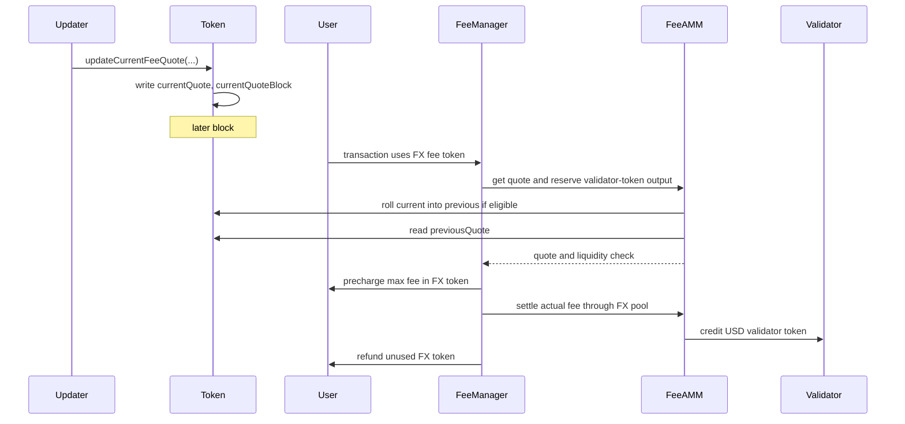

# TIP-1054: Non-USD Fee Tokens

<br>

## Abstract

TIP-1054 lets users pay transaction fees on Tempo with non-USD TIP-20 tokens.

Gas accounting does not change. Transactions still use the existing signed gas fields, Tempo still prices gas in attodollars, and validators still receive fees in USD.

A non-USD token can be used for fees when its TIP-20 precompile stores a valid `pathUSD` fee quote. Fee settlement reads the token's cached previous quote; it never uses a same-block quote update.

This version supports only direct FeeAMM pools from the user's non-USD token to the validator's USD fee token. It does not add multi-hop routing, validator-side non-USD fee preferences, or new signed fee fields.

<br>

## Motivation

Tempo already lets users choose among USD-denominated TIP-20 tokens to pay fees. TIP-1054 extends this so users can pay fees in fee-quoting non-USD tokens.

<br>

## Design Overview

TIP-1054 has three moving pieces:

1. **The token stores a pushed fee quote.** A non-USD TIP-20 token may designate a fee quote updater. That updater may push the latest value of one whole token in `pathUSD`.
2. **The token delays quote use by one block.** Each token stores `(previousQuote, previousQuoteBlock)` and `(currentQuote, currentQuoteBlock)`. Fee settlement uses `previousQuote`. A pushed update writes `currentQuote`. On the first FeeAMM operation that needs the quote in a later block, FeeAMM causes the token to copy current into previous and then uses previous.
3. **FeeManager settles through a direct FX pool.** Before precharging the user, FeeManager asks FeeAMM to roll the token quote if eligible, read `previousQuote`, and check validator-token liquidity. The user then pays the FX token amount implied by that quote, and the validator receives its USD fee token from the direct pool `(userToken, validatorToken)`.

Same-block quote updates cannot affect fees. A quote pushed in block `N` writes `currentQuote` with `currentQuoteBlock = N`. It cannot replace `previousQuote` until block `N + 1` or later. If the updater pushes multiple quotes in block `N`, each update overwrites `currentQuote`; only the final pushed quote from that block can later become usable.



<br>

# Specification

## Token Fee Quote Updates

The fee quote logic lives in the TIP-20 precompile. This TIP does not define a separate oracle contract interface.

A non-USD TIP-20 token MAY designate one `feeQuoteUpdater`. The token's authorized admin may set or clear this updater. `address(0)` means the token is not configured to receive fee quote updates. USD tokens MUST reject nonzero fee quote updaters.

The updater may call `updateCurrentFeeQuote(roundId, pathUsdPerTokenX18, updatedAt)`. The call writes the token's `currentQuote` and sets `currentQuoteBlock = block.number`.

A pushed quote is valid at update time iff all of the following hold:

1. `roundId != 0`;
2. `pathUsdPerTokenX18 != 0`;
3. `updatedAt != 0`;
4. `updatedAt <= block.timestamp`; and
5. `block.timestamp - updatedAt <= MAX_FEE_QUOTE_AGE`.

`setFeeQuoteUpdater` MUST be callable only by the token's authorized admin and MUST emit `FeeQuoteUpdaterSet`. `updateCurrentFeeQuote` MUST revert if the caller is not the token's `feeQuoteUpdater` or if the pushed quote is invalid at update time.

The quote is always for one whole token in `pathUSD`, scaled by `QUOTE_SCALE`. For example, if one token is worth `2.50 pathUSD`, the updater pushes `pathUsdPerTokenX18 = 2.5e18`.

For USD tokens, the fee quote update interface MUST NOT make the token usable as an FX fee token. USD fee tokens continue to use the existing USD fee-token path.

<br>

## Quote Cache

Each fee-quoting FX token stores two quote tuples:

```text
(previousQuote, previousQuoteBlock)
(currentQuote,  currentQuoteBlock)
```

`previousQuote` is the only quote used for fee settlement, FX pool mint, and FX rebalance. It is called previous because it must have been pushed in an earlier block; from the fee path's perspective, it is the current usable quote.

`currentQuote` is the latest pushed quote. It is not used for fee settlement in the same block in which it was pushed.

The token does not keep a second historical quote. When current is rolled into previous, it overwrites the old previous quote.

### Rolling Quotes Forward

A current quote is eligible to roll forward iff:

```text
currentQuoteBlock != 0 && currentQuoteBlock < block.number
```

Before any FX direct-pool operation that needs a quote, FeeAMM MUST ask the token precompile to roll its quote forward. If the current quote is eligible, the token MUST:

1. set `previousQuote = currentQuote`;
2. set `previousQuoteBlock = currentQuoteBlock`; and
3. clear `currentQuote` and `currentQuoteBlock`.

FeeAMM then reads `previousQuote` through the token's view getter and uses it for the operation. Quote getters remain read-only.

`rollFeeQuote()` can be restricted to FeeAMM. If it is exposed more broadly, it MUST perform only the roll described above.

This same roll check also runs before `updateCurrentFeeQuote` writes a new current quote. That way, an updater cannot overwrite an older current quote that should already be usable.

### Same-Block Update Rule

A quote pushed in block `N` MUST NOT replace `previousQuote` in block `N`. It MUST only write `currentQuote`.

If `updateCurrentFeeQuote` is called multiple times for the same token in block `N`, each call overwrites `currentQuote` with `currentQuoteBlock = N`. After any older eligible current quote has been rolled forward, `previousQuote` remains unchanged for the rest of those same-block updates.

Only the final current quote from block `N` can later replace `previousQuote`. It can do so no earlier than block `N + 1`.

### Previous Quote Validity

A previous quote is valid for block `B` iff all of the following hold:

1. `previousQuoteBlock != 0`;
2. `previousQuote.roundId != 0`;
3. `previousQuote.pathUsdPerTokenX18 != 0`;
4. `previousQuote.updatedAt != 0`;
5. `previousQuote.updatedAt <= B.timestamp`; and
6. `B.timestamp - previousQuote.updatedAt <= MAX_FEE_QUOTE_AGE`.

If any condition fails, the FX token is not fee-enabled for block `B`. Any operation that requires a valid quote MUST revert if the previous quote is invalid for the current block.

<br>

## Fee-Token Resolution

A user transaction MAY resolve to either:

- a USD token under the existing Tempo rules; or
- an FX token under this TIP.

`setUserToken(token)` MUST accept:

- any valid USD token accepted today; and
- any valid non-USD TIP-20 token with a nonzero `feeQuoteUpdater`.

`setValidatorToken(token)` is unchanged and MUST remain USD-only.

For an FX token, `setUserToken(token)` checks fee quote configuration at the time the call executes. It MUST NOT require the previous quote for the current block to be valid.

### Same-Transaction `setUserToken()`

The existing immediate-effect rule for direct `setUserToken()` calls is preserved.

If all of the following hold:

1. the transaction does not explicitly set a `feeToken`;
2. the transaction is not a Tempo AA transaction;
3. the fee payer equals the transaction caller; and
4. the first and only fee-token-resolution-relevant call is a direct call to `FeeManager.setUserToken(token)`,

then the resolved user fee token for that same transaction MUST be `token`, rather than the user's previously stored preference.

This rule applies to both USD tokens and fee-quoting FX tokens. The transaction MAY still fail later if the resolved FX token is not executable in the current block.

### Fee-Token Inference

Tempo MUST continue to infer a fee token from a TIP-20 token contract only for the existing transfer-like calls:

- `transfer(...)`
- `transferWithMemo(...)`
- `distributeReward(...)`

For transactions that are not Tempo AA transactions, the existing direct-call inference rule is unchanged except that the inferred token MAY now be an FX token.

For Tempo AA transactions, inference applies only when:

1. the fee payer equals the transaction caller; and
2. every `aa_calls` entry targets the same TIP-20 token contract and uses one of the three selectors above.

This TIP does not extend FX inference to the Stablecoin DEX input-token path. Stablecoin DEX fee-token inference remains USD-only.

Inference only resolves a candidate fee token. If the inferred token is an FX token, the transaction is executable only if it passes the execution-time checks below.

### Execution-Time Validity

An FX token is executable as a user fee token in block `B` only if all of the following hold:

1. it is a valid non-USD TIP-20 token;
2. it is not paused at fee-collection time;
3. it has a nonzero `feeQuoteUpdater`;
4. its previous quote is valid for block `B` after applying any eligible roll;
5. the fee payer is authorized to transfer that token to `FeeManager` under the existing token-policy rules;
6. the fee payer has enough balance to cover the precharged maximum token amount; and
7. the direct FeeAMM pool `(userToken, validatorToken)` has enough validator-token liquidity for `maxFeeUsd6`.

<br>

## Fee Collection

For a transaction that resolves to a USD user fee token, existing fee-collection semantics are unchanged.

For a transaction that resolves to an FX user fee token, fee collection uses the token's previous quote. The quote must be rolled and read before the max FX-token precharge is computed.

Let:

- `userToken` be the resolved FX fee token;
- `validatorToken` be the block beneficiary's USD fee token under existing rules;
- `maxFeeUsd6` be the transaction's existing maximum fee spending, expressed as a USD6 amount; and
- `quote` be the previous quote read after FeeAMM applies any eligible roll.

At `collect_fee_pre_tx` time, the fee path MUST:

1. ask FeeAMM to roll `userToken`'s quote forward if eligible;
2. read `userToken.previousFeeQuote()`;
3. validate that `userToken` is fee-enabled for block `B`;
4. compute `maxUserTokenFee = fxTokenAmountForUsd6(maxFeeUsd6, quote.pathUsdPerTokenX18)`;
5. transfer `maxUserTokenFee` from the fee payer to `FeeManager` through the existing fee-precharge path;
6. compute `reservedValidatorOut = validatorFeeOut(maxFeeUsd6)`;
7. check that the direct pool `(userToken, validatorToken)` has at least `reservedValidatorOut` validator-token reserve; and
8. reserve that validator-token amount for the pending transaction using the existing `FeeManager` reservation model.

No route identifier is required because this TIP allows only direct pools.

Let `actualFeeUsd6` be the transaction's actual fee spending under existing gas accounting.

At `collect_fee_post_tx` time, the protocol MUST use the same previous quote recorded during pre-tx collection.

It MUST:

1. recompute `actualFeeUsd6` using existing gas accounting;
2. compute `actualUserTokenSpend = fxTokenAmountForUsd6(actualFeeUsd6, quote.pathUsdPerTokenX18)`;
3. compute `refundUserToken = maxUserTokenFee - actualUserTokenSpend`;
4. refund `refundUserToken` to the fee payer through the existing fee-refund path;
5. compute `validatorCredit = validatorFeeOut(actualFeeUsd6)`;
6. add `actualUserTokenSpend` to the pool's `reserve_user_token`;
7. subtract `validatorCredit` from the pool's `reserve_validator_token`; and
8. increment the validator's collected-fee balance in `validatorToken` by `validatorCredit`.

If `actualFeeUsd6 == 0`, then `actualUserTokenSpend == 0`, the full precharge is refunded, and no pool swap or validator credit occurs.

Post-tx settlement MUST NOT read a newer previous quote than the one used for pre-tx collection.

`collect_fee_post_tx` MUST emit `FXFeeSettled` for every FX fee-token transaction with a nonzero `actualUserTokenSpend` or nonzero `refundUserToken`.

The event records the round and price actually used. The precharged FX-token amount is `userTokenIn + userTokenRefund`; the maximum USD6 fee remains derivable from the transaction's signed gas fields and block base fee.

<br>

## FX Direct Pools

An FX direct pool is a directional FeeAMM pool keyed by:

```text
(userToken, validatorToken)
```

where `userToken` is an FX token and `validatorToken` is a USD fee token.

For every FX direct-pool operation:

- `userToken` MUST be a valid non-USD TIP-20 token;
- `validatorToken` MUST be a valid USD fee token;
- `userToken != validatorToken`; and
- the existing FeeAMM rule that both tokens are USD-denominated is replaced by this section's FX direct-pool rules.

For FX fee settlement, liquidity depends only on the USD6 fee amount and the pool's validator-token reserve. A pool has enough liquidity for a transaction with maximum fee `maxFeeUsd6` iff:

```text
reserve_validator_token >= validatorFeeOut(maxFeeUsd6)
```

The user-token input amount is not part of the liquidity check.

FX fee settlement does not use the pool reserve ratio to price the swap. Instead:

- the user's input amount comes from the previous quote; and
- the validator payout comes from the USD6 fee amount and the existing FeeAMM spread.

On settlement of `actualFeeUsd6`:

```text
userTokenIn  = fxTokenAmountForUsd6(actualFeeUsd6, priceX18)
validatorOut = validatorFeeOut(actualFeeUsd6)
```

The pool reserves update as:

```text
reserve_user_token      += userTokenIn
reserve_validator_token -= validatorOut
```

### Rebalance Swap

The existing `rebalanceSwap(userToken, validatorToken, amountOut, to)` remains unchanged for USD pools and MUST revert for FX direct pools.

`rebalanceSwapFX(...)` is the FX-specific rebalance entry point. Before reading the quote, FeeAMM MUST roll the token quote forward if eligible. If `userToken` does not have a valid previous quote for the current block, the call MUST revert.

It MUST compute:

```text
fairUsd6        = usd6ValueCeil(amountOutUserToken, priceX18)
amountInValTok  = validatorRebalanceIn(fairUsd6)
```

If `amountInValTok > maxAmountInValTok`, the call MUST revert.

On success, `rebalanceSwapFX` MUST:

1. transfer `amountInValTok` of `validatorToken` from the caller into the pool;
2. transfer `amountOutUserToken` of `userToken` from the pool to `to`;
3. update pool reserves; and
4. emit the existing `RebalanceSwap` event with `amountIn = amountInValTok` and `amountOut = amountOutUserToken`.

### Mint and Burn

For the first `mint(userToken, validatorToken, amountValidatorToken, to)` on an FX direct pool:

- FeeAMM MUST roll the token quote forward if eligible, and `userToken` MUST have a valid previous quote for the current block;
- the caller deposits only `validatorToken`;
- `MIN_LIQUIDITY` remains permanently locked; and
- the bootstrap formula is unchanged.

The quote is used only to confirm that the pool's FX token is currently fee-enabled. It is not used in the bootstrap formula.

For later mints, let:

- `U = reserve_user_token`;
- `V = reserve_validator_token`;
- `S = totalSupply`;
- `priceX18` be the previous quote for `userToken` in the current block; and
- `amountValidatorToken` be the caller's deposit.

If `userToken` does not have a valid previous quote for the current block, the call MUST revert.

The minted liquidity MUST be:

```text
discountedUserReserveUsd6
    = floor(usd6ValueFloor(U, priceX18) * FEE_AMM_N / FEE_AMM_SCALE)

liquidity
    = floor(amountValidatorToken * S / (V + discountedUserReserveUsd6))
```

As in the existing FeeAMM, `liquidity == 0` MUST revert.

`burn(userToken, validatorToken, liquidity, to)` is unchanged for FX direct pools. It returns the caller's pro-rata share of both reserves and updates supply and reserves exactly as it does today.

`burn()` does not read the quote. It MUST remain available even if `userToken` is no longer fee-enabled or does not have a valid previous quote.

<br>

## Arithmetic

The existing USD6 fee amount remains the source of truth. Validator payout is computed from that USD6 amount, not by re-valuing the rounded user-token debit.

For any valid previous quote `priceX18 = pathUsdPerTokenX18`:

```text
ceilDiv(a, b) = 0 if a == 0, otherwise floor((a - 1) / b) + 1

fxTokenAmountForUsd6(usd6Amount, priceX18)
    = ceilDiv(usd6Amount * QUOTE_SCALE, priceX18)

usd6ValueFloor(tokenAmount, priceX18)
    = floor(tokenAmount * priceX18 / QUOTE_SCALE)

usd6ValueCeil(tokenAmount, priceX18)
    = ceilDiv(tokenAmount * priceX18, QUOTE_SCALE)

validatorFeeOut(usd6Amount)
    = floor(usd6Amount * FEE_AMM_M / FEE_AMM_SCALE)

validatorRebalanceIn(usd6Amount)
    = floor(usd6Amount * FEE_AMM_N / FEE_AMM_SCALE) + 1
```

All arithmetic in these formulas uses checked unsigned 256-bit integers. Overflow, underflow, division by zero, or a pool reserve value that cannot fit in storage MUST revert.

Rounding is consensus behavior:

- user-token fee debits round up;
- USD6 valuation for `rebalanceSwapFX` rounds up;
- validator-token payout in fee settlement rounds down; and
- validator-token input in rebalance swaps uses the existing `floor(x * N / SCALE) + 1` rule.

Any extra user-token dust caused by rounding remains in the pool or fee-manager path implied by these formulas.

<br>

## Transaction Format and Existing Surfaces

This TIP does not add any signed fee field.

The transaction's signed fee bound remains the existing bound implied by its gas fields and attodollar gas accounting. The exact token-unit debit for an FX fee token is derived from the token's previous quote and the existing USD6 fee amount.

`TIP-1007` remains unchanged: `getFeeToken()` continues to expose the resolved fee token for the current transaction.

Except for `FXFeeSettled`, `FeeQuoteUpdaterSet`, and `FeeQuoteUpdated`, this TIP does not standardize additional fee-settlement events, receipt fields, or RPC surfaces.

<br>

## Reference Details

### Terms

- **`pathUSD`** is the quote asset for this TIP and the root of the existing TIP-20 quote-token graph. It is not a gas-accounting unit.
- **USD6 amount** means a nominal USD amount expressed in ordinary 6-decimal TIP-20 units.
- **USD token** means a valid USD-denominated TIP-20 fee token under the existing Tempo rules.
- **FX token** means a non-USD TIP-20 token.
- **fee-quoting FX token** means a valid FX TIP-20 token with a nonzero `feeQuoteUpdater`.
- **Tempo AA transaction** means a Tempo transaction whose account-abstraction envelope is present and whose executable calls are taken from `aa_calls`.

The fee amounts used by this TIP are:

```text
gasBalanceSpending(gas, gasPrice)
    = ceilDiv(gas * gasPrice, GAS_PRICE_SCALE)

maxFeeUsd6
    = gasBalanceSpending(tx.gasLimit, tx.effectiveGasPrice(B.basefee))

actualFeeUsd6
    = gasBalanceSpending(gasUsed, tx.effectiveGasPrice(B.basefee))
```

`maxFeeUsd6` and `actualFeeUsd6` exclude transaction value. They are the existing USD6 amounts produced by Tempo's current gas accounting.

### Constants

```text
QUOTE_SCALE        = 10^18
GAS_PRICE_SCALE    = 10^12
FEE_AMM_SCALE      = 10000
FEE_AMM_M          = 9970   // existing fee-swap multiplier
FEE_AMM_N          = 9985   // existing rebalance multiplier
MAX_FEE_QUOTE_AGE = 3600    // seconds
```

All token amounts and USD6 amounts are expressed in ordinary 6-decimal TIP-20 units unless a field or formula explicitly says `X18`.

### Interfaces

```solidity
interface ITIP20FeeQuoteCache {
    struct FeeQuote {
        uint64 roundId;
        uint192 pathUsdPerTokenX18;
        uint64 updatedAt;
    }

    event FeeQuoteUpdaterSet(
        address indexed updater,
        address indexed oldUpdater,
        address indexed newUpdater
    );

    event FeeQuoteUpdated(
        address indexed updater,
        uint64 indexed quoteBlock,
        uint64 roundId,
        uint192 pathUsdPerTokenX18,
        uint64 updatedAt
    );

    function feeQuoteUpdater() external view returns (address updater);

    function setFeeQuoteUpdater(address updater) external;

    function updateCurrentFeeQuote(
        uint64 roundId,
        uint192 pathUsdPerTokenX18,
        uint64 updatedAt
    ) external;

    function rollFeeQuote() external returns (bool rolled);

    function previousFeeQuote()
        external
        view
        returns (FeeQuote memory quote, uint64 quoteBlock);

    function currentFeeQuote()
        external
        view
        returns (FeeQuote memory quote, uint64 quoteBlock);
}
```

```solidity
event FXFeeSettled(
    address indexed feePayer,
    address indexed beneficiary,
    address indexed userToken,
    address validatorToken,
    uint64 roundId,
    uint192 pathUsdPerTokenX18,
    uint256 actualFeeUsd6,
    uint256 userTokenIn,
    uint256 userTokenRefund,
    uint256 validatorCredit
);
```

```solidity
function rebalanceSwapFX(
    address userToken,
    address validatorToken,
    uint256 amountOutUserToken,
    uint256 maxAmountInValTok,
    address to
) external returns (uint256 amountInValTok);
```
