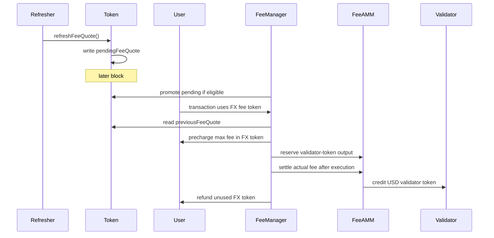

# TIP-1054: Non-USD Fee Tokens

<br>

## Abstract

TIP-1054 lets users pay transaction fees on Tempo with non-USD TIP-20 tokens.

Gas accounting does not change. Transactions still use the existing signed gas fields, Tempo still prices gas in attodollars, and validators still receive fees in USD.

A non-USD token can be used for fees when the token exposes a `pathUSD` fee quote and stores that quote in the two-slot cache defined here. Fee settlement reads the token's cached `previousFeeQuote`; it never uses a live same-block oracle read.

This version supports only direct FeeAMM pools from the user's non-USD token to the validator's USD fee token. It does not add multi-hop routing, validator-side non-USD fee preferences, or new signed fee fields.

<br>

## Motivation

Tempo already lets users choose among USD-denominated TIP-20 fee tokens. Users who mainly hold another asset must first swap into a USD fee token before they can transact.

TIP-1054 removes that extra step on the user side. A user can pay fees in a fee-quoting non-USD token, while the validator still receives its preferred USD fee token.

The design keeps the existing fee model intact:

- gas prices and fee caps remain attodollar-denominated;
- maximum and actual fee spending are still computed as 6-decimal USD amounts;
- validators still settle in USD fee tokens; and
- the transaction format does not change.

The only new input is an oracle quote for the user's non-USD token. To make that quote deterministic and inspectable, the quote lives behind the token interface and is copied into protocol state before it can affect fees.

<br>

## Design Overview

TIP-1054 has three moving pieces:

1. **The token exposes a fee quote.** A fee-quoting FX token returns the latest value of one whole token in `pathUSD`.
2. **The token stores a delayed quote cache.** `refreshFeeQuote()` samples the latest quote into `pendingFeeQuote`. A later block may promote that pending quote into `previousFeeQuote`, which is the quote used for fees.
3. **FeeManager settles through a direct FX pool.** The user pays the FX token amount implied by the cached quote. The validator receives its USD fee token from the direct pool `(userToken, validatorToken)`.

The quote cache is intentionally delayed by at least one block. A quote sampled in block `N` can only be written to `pendingFeeQuote` in block `N`; it cannot replace `previousFeeQuote` until block `N + 1` or later. If the quote is refreshed multiple times in the same block, each refresh overwrites the same pending slot, so only the final quote from that block can later become usable.

This avoids a client-only parent-state oracle read. The usable quote is ordinary token state: fee collection reads `token.previousFeeQuote()`, and observers can inspect `token.pendingFeeQuote()`.



The first version is deliberately narrow. It does not introduce non-USD validator fee-token preferences, signed token-unit fee caps, multi-hop FeeAMM routing, oracle-based repricing of USD fee tokens, standardized mempool invalidation rules, or wallet UX requirements.

<br>

# Specification

## Token Fee Quotes

The fee quote interface lives on the TIP-20 token. The token may produce the quote directly, read its own oracle configuration, or call another contract internally. This TIP standardizes only the token-facing interface and cache behavior.

`latestPathUsdQuote()` returns the token's latest quote of one whole token in `pathUSD`, scaled by `ORACLE_SCALE`.

For example, if one token is worth `2.50 pathUSD`, `latestPathUsdQuote()` returns `pathUsdPerTokenX18 = 2.5e18`.

The protocol MUST NOT use `latestPathUsdQuote()` directly for fee settlement. It is only the source sampled by `refreshFeeQuote()`.

For USD tokens, implementing the fee quote cache interface MUST NOT make the token usable as an FX fee token. USD fee tokens continue to use the existing USD fee-token path.

<br>

## Quote Cache

Each fee-quoting FX token stores two quote slots:

```text
previousFeeQuote
pendingFeeQuote
```

`previousFeeQuote` is the only quote used for fee settlement, FX pool mint, and FX rebalance. It is called previous because it must have been sampled in an earlier block; from the fee path's perspective, it is the current usable quote.

`pendingFeeQuote` is the latest sampled quote waiting for promotion. It is not used for fee settlement.

This TIP does not keep a second historical quote. When a pending quote is promoted, it overwrites `previousFeeQuote`.

### Refreshing Quotes

`refreshFeeQuote()` samples the token's current `latestPathUsdQuote()` result and writes `pendingFeeQuote`. It MAY be called by anyone.

Before sampling, `refreshFeeQuote()` MUST first promote any eligible pending quote for the token. This prevents a new-block refresh from overwriting an older pending quote that should already be usable.

The quote source read is part of `refreshFeeQuote()` and is bounded by `FEE_ORACLE_GAS`. The refresh caller pays the normal cost of calling `refreshFeeQuote()`.

The source read MUST be read-only. It may read the token's own quote state or call other contracts under ordinary EVM `STATICCALL` semantics, but it MUST NOT modify persistent or transient state except for the later pending-slot write performed by `refreshFeeQuote()`.

A sampled quote is valid at sampling time iff all of the following hold:

1. the call succeeds and decodes correctly;
2. `roundId != 0`;
3. `pathUsdPerTokenX18 != 0`;
4. `updatedAt != 0`;
5. `updatedAt <= block.timestamp`; and
6. `block.timestamp - updatedAt <= MAX_FEE_ORACLE_AGE`.

If any condition fails, `refreshFeeQuote()` MUST still write `pendingFeeQuote`, but with `valid = false`. This lets an invalid refresh disable future fee use after promotion instead of leaving an old quote usable forever.

`refreshFeeQuote()` MUST set `sampledAt = block.timestamp` and `sampledBlock = block.number` for every pending write.

`refreshFeeQuote()` MUST emit `FeeQuoteRefreshed` for every refresh.

### Promoting Quotes

`promoteFeeQuote()` moves an eligible pending quote into `previousFeeQuote`. It MAY be called by anyone.

A pending quote is eligible for promotion iff:

```text
pendingFeeQuote.sampledBlock < block.number
```

If the pending quote is not eligible, `promoteFeeQuote()` MUST leave `previousFeeQuote` and `pendingFeeQuote` unchanged and return `false`.

If the pending quote is eligible, `promoteFeeQuote()` MUST:

1. set `previousFeeQuote = pendingFeeQuote`;
2. clear `pendingFeeQuote`; and
3. emit `FeeQuotePromoted`.

An invalid pending quote can be promoted. After promotion, the token is not fee-enabled until a later valid quote replaces `previousFeeQuote`.

Fee settlement, FX pool mint, and FX rebalance MUST call `promoteFeeQuote()` or apply equivalent promotion logic before reading `previousFeeQuote`.

This is the first-read behavior for a block: if `pendingFeeQuote` was sampled in an earlier block, the first fee-related read promotes it into `previousFeeQuote` and then uses it.

They MUST NOT call `refreshFeeQuote()` as part of fee settlement. Refresh writes only pending state and cannot help the current transaction.

### Same-Block Refresh Rule

A quote sampled in block `N` MUST NOT replace `previousFeeQuote` in block `N`. It MUST only be written to `pendingFeeQuote`.

If `refreshFeeQuote()` is called multiple times for the same token in block `N`, each call overwrites `pendingFeeQuote` with `sampledBlock = N`. After any older eligible pending quote has been promoted, `previousFeeQuote` remains unchanged for the rest of those same-block refreshes.

Only the final pending quote from block `N` can later replace `previousFeeQuote`. It can do so no earlier than block `N + 1`.

This rule prevents a token admin, oracle updater, keeper, or block builder from changing the fee price used by another transaction in the same block by refreshing the quote twice.

### Previous Quote Validity

A previous quote is valid for block `B` iff all of the following hold:

1. `previousFeeQuote.valid == true`;
2. `previousFeeQuote.roundId != 0`;
3. `previousFeeQuote.pathUsdPerTokenX18 != 0`;
4. `previousFeeQuote.updatedAt != 0`;
5. `previousFeeQuote.updatedAt <= B.timestamp`; and
6. `B.timestamp - previousFeeQuote.updatedAt <= MAX_FEE_ORACLE_AGE`.

If any condition fails, the FX token is not fee-enabled for block `B`. Any operation that requires a valid quote MUST revert if the previous quote is invalid for the current block.

<br>

## Fee-Token Resolution

A user transaction MAY resolve to either:

- a USD token under the existing Tempo rules; or
- an FX token under this TIP.

`setUserToken(token)` MUST accept:

- any valid USD token accepted today; and
- any valid fee-quoting FX token.

`setValidatorToken(token)` is unchanged and MUST remain USD-only.

For an FX token, `setUserToken(token)` checks that the token exposes the fee quote cache interface at the time the call executes. It MUST NOT require the previous quote for the current block to be valid.

### Same-Transaction `setUserToken()`

The existing immediate-effect rule for direct `setUserToken()` calls is preserved.

If all of the following hold:

1. the transaction does not explicitly set a `feeToken`;
2. the transaction is not a Tempo AA transaction;
3. the fee payer equals the transaction caller; and
4. the first and only fee-token-resolution-relevant call is a direct call to `FeeManager.setUserToken(token)`,

then the resolved user fee token for that same transaction MUST be `token`, rather than the user's previously stored preference.

This rule applies to both USD tokens and fee-quoting FX tokens. The transaction MAY still fail later if the resolved FX token is not executable in the current block.

### Fee-Token Inference

Tempo MUST continue to infer a fee token from a TIP-20 token contract only for the existing transfer-like calls:

- `transfer(...)`
- `transferWithMemo(...)`
- `distributeReward(...)`

For transactions that are not Tempo AA transactions, the existing direct-call inference rule is unchanged except that the inferred token MAY now be an FX token.

For Tempo AA transactions, inference applies only when:

1. the fee payer equals the transaction caller; and
2. every `aa_calls` entry targets the same TIP-20 token contract and uses one of the three selectors above.

This TIP does not extend FX inference to the Stablecoin DEX input-token path. Stablecoin DEX fee-token inference remains USD-only.

Inference only resolves a candidate fee token. If the inferred token is an FX token, the transaction is executable only if it passes the execution-time checks below.

### Execution-Time Validity

An FX token is executable as a user fee token in block `B` only if all of the following hold:

1. it is a valid TIP-20 token;
2. it is not paused at fee-collection time;
3. it is a fee-quoting FX token;
4. its previous quote is valid for block `B` after applying any eligible promotion;
5. the fee payer is authorized to transfer that token to `FeeManager` under the existing token-policy rules;
6. the fee payer has enough balance to cover the precharged maximum token amount; and
7. the direct FeeAMM pool `(userToken, validatorToken)` has enough validator-token liquidity for `maxFeeUsd6`.

<br>

## Fee Collection

For a transaction that resolves to a USD user fee token, existing fee-collection semantics are unchanged.

For a transaction that resolves to an FX user fee token, fee collection uses the token's previous quote.

Let:

- `userToken` be the resolved FX fee token;
- `validatorToken` be the block beneficiary's USD fee token under existing rules;
- `quote` be `userToken.previousFeeQuote()` after applying any eligible promotion; and
- `maxFeeUsd6` be the transaction's existing maximum fee spending, expressed as a USD6 amount.

At `collect_fee_pre_tx` time, the protocol MUST:

1. validate that `userToken` is fee-enabled for block `B`;
2. compute `maxUserTokenFee = fxTokenAmountForUsd6(maxFeeUsd6, quote.pathUsdPerTokenX18)`;
3. transfer `maxUserTokenFee` from the fee payer to `FeeManager` through the existing fee-precharge path;
4. compute `reservedValidatorOut = validatorFeeOut(maxFeeUsd6)`;
5. check that the direct pool `(userToken, validatorToken)` has at least `reservedValidatorOut` validator-token reserve; and
6. reserve that validator-token amount for the pending transaction using the existing `FeeManager` reservation model.

No route identifier is required because this TIP allows only direct pools.

Let `actualFeeUsd6` be the transaction's actual fee spending under existing gas accounting.

At `collect_fee_post_tx` time, the protocol MUST use the same previous quote recorded during pre-tx collection.

It MUST:

1. recompute `actualFeeUsd6` using existing gas accounting;
2. compute `actualUserTokenSpend = fxTokenAmountForUsd6(actualFeeUsd6, quote.pathUsdPerTokenX18)`;
3. compute `refundUserToken = maxUserTokenFee - actualUserTokenSpend`;
4. refund `refundUserToken` to the fee payer through the existing fee-refund path;
5. compute `validatorCredit = validatorFeeOut(actualFeeUsd6)`;
6. add `actualUserTokenSpend` to the pool's `reserve_user_token`;
7. subtract `validatorCredit` from the pool's `reserve_validator_token`; and
8. increment the validator's collected-fee balance in `validatorToken` by `validatorCredit`.

If `actualFeeUsd6 == 0`, then `actualUserTokenSpend == 0`, the full precharge is refunded, and no pool swap or validator credit occurs.

Post-tx settlement MUST NOT refresh the quote or read a newer previous quote than the one used for pre-tx collection.

`collect_fee_post_tx` MUST emit `FXFeeSettled` for every FX fee-token transaction with a nonzero `actualUserTokenSpend` or nonzero `refundUserToken`.

The event records the round and price actually used. The precharged FX-token amount is `userTokenIn + userTokenRefund`; the maximum USD6 fee remains derivable from the transaction's signed gas fields and block base fee.

<br>

## FX Direct Pools

An FX direct pool is a directional FeeAMM pool keyed by:

```text
(userToken, validatorToken)
```

where `userToken` is an FX token and `validatorToken` is a USD fee token.

For every FX direct-pool operation:

- `userToken` MUST be a valid non-USD TIP-20 token;
- `validatorToken` MUST be a valid USD fee token;
- `userToken != validatorToken`; and
- the existing FeeAMM rule that both tokens are USD-denominated is replaced by this section's FX direct-pool rules.

For FX fee settlement, liquidity depends only on the USD6 fee amount and the pool's validator-token reserve. A pool has enough liquidity for a transaction with maximum fee `maxFeeUsd6` iff:

```text
reserve_validator_token >= validatorFeeOut(maxFeeUsd6)
```

The user-token input amount is not part of the liquidity check.

FX fee settlement does not use the pool reserve ratio to price the swap. Instead:

- the user's input amount comes from the previous quote; and
- the validator payout comes from the USD6 fee amount and the existing FeeAMM spread.

On settlement of `actualFeeUsd6`:

```text
userTokenIn  = fxTokenAmountForUsd6(actualFeeUsd6, priceX18)
validatorOut = validatorFeeOut(actualFeeUsd6)
```

The pool reserves update as:

```text
reserve_user_token      += userTokenIn
reserve_validator_token -= validatorOut
```

### Rebalance Swap

The existing `rebalanceSwap(userToken, validatorToken, amountOut, to)` remains unchanged for USD pools and MUST revert for FX direct pools.

`rebalanceSwapFX(...)` is the FX-specific rebalance entry point. It MUST apply any eligible quote promotion and then use `userToken.previousFeeQuote()`. If `userToken` does not have a valid previous quote for the current block, the call MUST revert.

It MUST compute:

```text
fairUsd6        = usd6ValueCeil(amountOutUserToken, priceX18)
amountInValTok  = validatorRebalanceIn(fairUsd6)
```

If `amountInValTok > maxAmountInValTok`, the call MUST revert.

On success, `rebalanceSwapFX` MUST:

1. transfer `amountInValTok` of `validatorToken` from the caller into the pool;
2. transfer `amountOutUserToken` of `userToken` from the pool to `to`;
3. update pool reserves; and
4. emit the existing `RebalanceSwap` event with `amountIn = amountInValTok` and `amountOut = amountOutUserToken`.

### Mint and Burn

For the first `mint(userToken, validatorToken, amountValidatorToken, to)` on an FX direct pool:

- `userToken` MUST have a valid previous quote for the current block after applying any eligible promotion;
- the caller deposits only `validatorToken`;
- `MIN_LIQUIDITY` remains permanently locked; and
- the bootstrap formula is unchanged.

The quote is used only to confirm that the pool's FX token is currently fee-enabled. It is not used in the bootstrap formula.

For later mints, let:

- `U = reserve_user_token`;
- `V = reserve_validator_token`;
- `S = totalSupply`;
- `priceX18` be the previous quote for `userToken` in the current block; and
- `amountValidatorToken` be the caller's deposit.

If `userToken` does not have a valid previous quote for the current block, the call MUST revert.

The minted liquidity MUST be:

```text
discountedUserReserveUsd6
    = floor(usd6ValueFloor(U, priceX18) * FEE_AMM_N / FEE_AMM_SCALE)

liquidity
    = floor(amountValidatorToken * S / (V + discountedUserReserveUsd6))
```

As in the existing FeeAMM, `liquidity == 0` MUST revert.

`burn(userToken, validatorToken, liquidity, to)` is unchanged for FX direct pools. It returns the caller's pro-rata share of both reserves and updates supply and reserves exactly as it does today.

`burn()` does not read the quote. It MUST remain available even if `userToken` is no longer fee-enabled or does not have a valid previous quote.

<br>

## Arithmetic

The existing USD6 fee amount remains the source of truth. Validator payout is computed from that USD6 amount, not by re-valuing the rounded user-token debit.

For any valid previous quote `priceX18 = pathUsdPerTokenX18`:

```text
ceilDiv(a, b) = 0 if a == 0, otherwise floor((a - 1) / b) + 1

fxTokenAmountForUsd6(usd6Amount, priceX18)
    = ceilDiv(usd6Amount * ORACLE_SCALE, priceX18)

usd6ValueFloor(tokenAmount, priceX18)
    = floor(tokenAmount * priceX18 / ORACLE_SCALE)

usd6ValueCeil(tokenAmount, priceX18)
    = ceilDiv(tokenAmount * priceX18, ORACLE_SCALE)

validatorFeeOut(usd6Amount)
    = floor(usd6Amount * FEE_AMM_M / FEE_AMM_SCALE)

validatorRebalanceIn(usd6Amount)
    = floor(usd6Amount * FEE_AMM_N / FEE_AMM_SCALE) + 1
```

All arithmetic in these formulas uses checked unsigned 256-bit integers. Overflow, underflow, division by zero, or a pool reserve value that cannot fit in storage MUST revert.

Rounding is consensus behavior:

- user-token fee debits round up;
- USD6 valuation for `rebalanceSwapFX` rounds up;
- validator-token payout in fee settlement rounds down; and
- validator-token input in rebalance swaps uses the existing `floor(x * N / SCALE) + 1` rule.

Any extra user-token dust caused by rounding remains in the pool or fee-manager path implied by these formulas.

<br>

## Transaction Format and Existing Surfaces

This TIP does not add any signed fee field.

The transaction's signed fee bound remains the existing bound implied by its gas fields and attodollar gas accounting. The exact token-unit debit for an FX fee token is derived from the token's previous quote and the existing USD6 fee amount.

`TIP-1007` remains unchanged: `getFeeToken()` continues to expose the resolved fee token for the current transaction.

Except for `FXFeeSettled`, `FeeQuoteRefreshed`, and `FeeQuotePromoted`, this TIP does not standardize additional fee-settlement events, receipt fields, or RPC surfaces.

<br>

## Reference Details

### Terms

- **`pathUSD`** is the quote asset for this TIP and the root of the existing TIP-20 quote-token graph. It is not a gas-accounting unit.
- **USD6 amount** means a nominal USD amount expressed in ordinary 6-decimal TIP-20 units.
- **USD token** means a valid USD-denominated TIP-20 fee token under the existing Tempo rules.
- **FX token** means a non-USD TIP-20 token.
- **fee-quoting FX token** means a valid FX TIP-20 token that implements the fee quote cache interface in this TIP.
- **Tempo AA transaction** means a Tempo transaction whose account-abstraction envelope is present and whose executable calls are taken from `aa_calls`.

The fee amounts used by this TIP are:

```text
gasBalanceSpending(gas, gasPrice)
    = ceilDiv(gas * gasPrice, GAS_PRICE_SCALE)

maxFeeUsd6
    = gasBalanceSpending(tx.gasLimit, tx.effectiveGasPrice(B.basefee))

actualFeeUsd6
    = gasBalanceSpending(gasUsed, tx.effectiveGasPrice(B.basefee))
```

`maxFeeUsd6` and `actualFeeUsd6` exclude transaction value. They are the existing USD6 amounts produced by Tempo's current gas accounting.

### Constants

```text
ORACLE_SCALE       = 10^18
GAS_PRICE_SCALE    = 10^12
FEE_AMM_SCALE      = 10000
FEE_AMM_M          = 9970   // existing fee-swap multiplier
FEE_AMM_N          = 9985   // existing rebalance multiplier
FEE_ORACLE_GAS     = 200000
MAX_FEE_ORACLE_AGE = 3600   // seconds
```

All token amounts and USD6 amounts are expressed in ordinary 6-decimal TIP-20 units unless a field or formula explicitly says `X18`.

### Interfaces

```solidity
interface ITIP20FeeQuoteCache {
    struct FeeQuote {
        uint64 roundId;
        uint192 pathUsdPerTokenX18;
        uint64 updatedAt;
        uint64 sampledAt;
        uint64 sampledBlock;
        bool valid;
    }

    event FeeQuoteRefreshed(
        address indexed updater,
        uint64 indexed sampledBlock,
        bool valid,
        uint64 roundId,
        uint192 pathUsdPerTokenX18,
        uint64 updatedAt
    );

    event FeeQuotePromoted(
        uint64 indexed promotedBlock,
        uint64 indexed sampledBlock,
        bool valid,
        uint64 roundId,
        uint192 pathUsdPerTokenX18,
        uint64 updatedAt
    );

    function latestPathUsdQuote()
        external
        view
        returns (
            uint64 roundId,
            uint192 pathUsdPerTokenX18,
            uint64 updatedAt
        );

    function refreshFeeQuote() external returns (FeeQuote memory pending);

    function promoteFeeQuote() external returns (bool promoted);

    function previousFeeQuote() external view returns (FeeQuote memory quote);

    function pendingFeeQuote() external view returns (FeeQuote memory quote);
}
```

```solidity
event FXFeeSettled(
    address indexed feePayer,
    address indexed beneficiary,
    address indexed userToken,
    address validatorToken,
    uint64 roundId,
    uint192 pathUsdPerTokenX18,
    uint256 actualFeeUsd6,
    uint256 userTokenIn,
    uint256 userTokenRefund,
    uint256 validatorCredit
);
```

```solidity
function rebalanceSwapFX(
    address userToken,
    address validatorToken,
    uint256 amountOutUserToken,
    uint256 maxAmountInValTok,
    address to
) external returns (uint256 amountInValTok);
```
