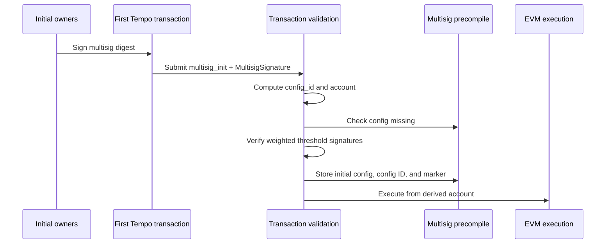
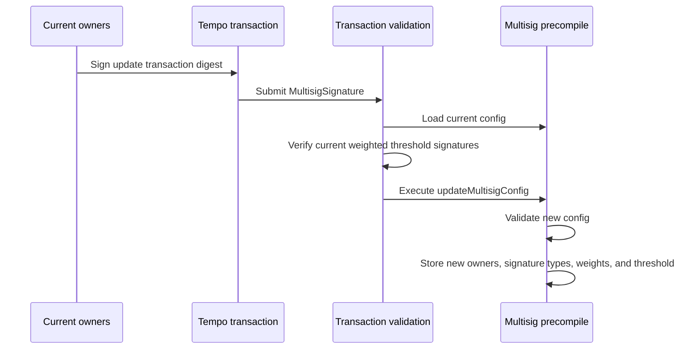

# TIP-1061: Native Multisig Accounts

## Abstract

This TIP adds native multisig accounts as a primary Tempo account type. A multisig account has a stable account address derived from its initial weighted owner config, and transactions from that address are authorized by primitive owner signatures whose configured weights meet the threshold.

## Motivation

Teams, treasuries, validators, and institutional operators need accounts where no single private key can unilaterally move funds or change operational configuration.

Canonical EVM multisigs are generally contract accounts with an owner set, owner weights, and a threshold. Tempo can provide the same core threshold-control model through native account and transaction validation, without requiring a contract wallet deployment.

## Specification

The key words "MUST", "MUST NOT", "REQUIRED", "SHALL", "SHALL NOT", "SHOULD", "SHOULD NOT", "RECOMMENDED", "NOT RECOMMENDED", "MAY", and "OPTIONAL" in this document are to be interpreted as described in RFC 2119 and RFC 8174.

### Assumptions

- Multisig accounts are primary accounts. They are not access keys, and they do not authorize access keys.
- Multisig owners are primitive signature types paired with Tempo key IDs.
- Each owner has a nonzero weight.
- Owner key IDs are nonzero. Owner key IDs are not required to be valid Tempo primary account addresses.
- Owner approvals use `PrimitiveSignature` only: Secp256k1, P256, or WebAuthn.
- A multisig account has one canonical `config_id`, derived from its initial owner signature types, key IDs, weights, and threshold. The current owner signature types, key IDs, weights, and threshold may change, but `config_id` and the account address do not.
- For transaction authorization, the inner digest is `tx.signature_hash()`.
- Owner approvals inherit Tempo's existing sponsored transaction signing semantics from `tx.signature_hash()`.
- AccountKeychain behavior for non-multisig accounts is unchanged.

### Constants

```rust
/// Tempo signature type byte for native multisig signatures.
pub const SIGNATURE_TYPE_MULTISIG: u8 = 0x05;

/// Domain prefix for native multisig owner approvals.
pub const MULTISIG_SIGNATURE_DOMAIN: &[u8] = b"tempo:multisig:signature";

/// Maximum number of owners allowed in a native multisig config.
pub const MAX_MULTISIG_OWNERS: usize = 10;

/// Maximum encoded byte length for one primitive owner approval.
pub const MAX_MULTISIG_OWNER_SIGNATURE_BYTES: usize = 2049;
```

- `SIGNATURE_TYPE_MULTISIG` is a new Tempo signature type byte in the `TempoSignature` byte-encoding namespace.
- `MULTISIG_SIGNATURE_DOMAIN` is used only inside the owner approval digest. It is distinct from the wire signature type byte.
- `MAX_MULTISIG_OWNERS` bounds verification cost, signature payload size, and owner storage.
- `MAX_MULTISIG_OWNER_SIGNATURE_BYTES` matches the current maximum encoded `PrimitiveSignature` length.

### Data Structures

Tempo transactions gain an optional initialization payload:

```rust
/// Tempo transaction payload.
pub struct TempoTransaction {
    // existing fields...

    /// Optional native multisig bootstrap config.
    pub multisig_init: Option<InitMultisig>,
}

/// Initial native multisig config carried by the first transaction.
pub struct InitMultisig {
    /// Minimum total owner weight required to authorize a transaction.
    pub threshold: u32,

    /// Sorted weighted owner list.
    pub owners: Vec<MultisigOwner>,
}

/// Native multisig owner entry.
pub struct MultisigOwner {
    /// Primitive signature type this owner must use.
    pub signature_type: SignatureType,

    /// Owner key ID derived from a primitive signature type.
    pub owner: Address,

    /// Nonzero owner weight.
    pub weight: u32,
}
```

`TempoSignature` gains a multisig variant:

```rust
/// Tempo transaction signature.
pub enum TempoSignature {
    /// Signature from a primitive account key.
    Primitive(PrimitiveSignature),

    /// Signature from an authorized AccountKeychain access key.
    Keychain(KeychainSignature),

    /// Signature from a native multisig account.
    Multisig(MultisigSignature),
}

/// Native multisig transaction signature.
pub struct MultisigSignature {
    /// Native multisig account address.
    pub account: Address,

    /// Permanent config ID derived from the initial multisig config.
    pub config_id: B256,

    /// Encoded primitive owner signatures over the multisig digest.
    pub signatures: Vec<Bytes>,
}
```

Signature rules:

- `signatures` contains encoded primitive owner signatures only.
- Stateful validation MUST decode each owner signature byte string as `PrimitiveSignature`.
- Implementations MUST reject any owner signature byte string that decodes as `KeychainSignature` or `MultisigSignature`.
- `signatures.len()` MUST be between `1` and `MAX_MULTISIG_OWNERS`.
- Each owner signature byte string length MUST be less than or equal to `MAX_MULTISIG_OWNER_SIGNATURE_BYTES`.

Flat M-of-N multisigs are represented by assigning every owner weight `1` and setting `threshold` to `M`.

Weighted configs can express asymmetric authority. For example, a config with `threshold = 100`, one owner with `weight = 100`, and two owners with `weight = 50` allows the high-weight owner alone or both lower-weight owners together to authorize a transaction.

### Transaction Encoding

The Tempo transaction RLP field list keeps the existing fixed prefix and optional tail:

```text
rlp([
  chain_id,
  max_priority_fee_per_gas,
  max_fee_per_gas,
  gas_limit,
  calls,
  access_list,
  nonce_key,
  nonce,
  valid_before,
  valid_after,
  fee_token,
  fee_payer_signature,
  tempo_authorization_list,
  ...optional_tail
])
```

Optional transaction tail:

In this table, `✔︎` means present and `✗` means absent.

| `key_authorization` | `multisig_init` | Tail |
| --- | --- | --- |
| `✗` | `✗` | empty |
| `✔︎` | `✗` | `key_authorization` |
| `✗` | `✔︎` | `multisig_init` |
| `✔︎` | `✔︎` | `key_authorization, multisig_init` |

- `InitMultisig` is encoded as `rlp([threshold, owners])`.
- `MultisigOwner` is encoded as `rlp([signature_type, owner, weight])`.
- RLP fields use canonical RLP integer encoding. This applies to `threshold`, `signature_type`, and `weight` in the transaction wire format.

Signing payload rules:

- `tx.signature_hash()` MUST include all tail fields that are present.
- `tx.signature_hash()` MUST NOT include absent tail fields.
- `tx.fee_payer_signature_hash(sender)` MUST include all tail fields that are present.
- `tx.fee_payer_signature_hash(sender)` MUST NOT include absent tail fields.
- Transactions without `key_authorization` or `multisig_init` keep the existing signing payload.
- Transactions with `key_authorization` and no `multisig_init` keep the existing signing payload.

Activation rules:

- Before this TIP activates, `TempoSignature::Multisig` MUST be rejected.
- Before this TIP activates, any transaction carrying `multisig_init` MUST be rejected.
- At and after activation, existing Tempo transactions without `multisig_init` remain valid.
- At and after activation, signature type byte `0x05` is decoded as `TempoSignature::Multisig`.

### Signature Encoding

The multisig signature wire encoding is:

```text
0x05 || rlp([account, config_id, signatures])
```

`signatures` is an RLP list of byte strings. Each byte string is one owner approval encoded with the existing `PrimitiveSignature` byte encoding.

Owner approval byte strings use the same encoding and size limits as existing Tempo primitive signatures.

The largest valid owner approval is a WebAuthn primitive signature. Its encoded byte length is `MAX_MULTISIG_OWNER_SIGNATURE_BYTES`.

Decoding rules:

- Each owner approval MUST decode as a valid `PrimitiveSignature`.
- Owner approval signature type is the decoded `PrimitiveSignature` variant.
- Implementations MUST NOT infer owner approval signature type from the first byte before `PrimitiveSignature` decoding.
- Secp256k1 owner approvals MUST use the existing Secp256k1 primitive signature encoding.
- P256 owner approvals MUST use the existing P256 primitive signature encoding and size limit.
- WebAuthn owner approvals MUST use the existing WebAuthn primitive signature encoding and size limits.
- Malformed or oversized owner approval byte strings MUST be rejected before threshold accounting.
- `MAX_MULTISIG_OWNERS` limits owner count, not per-signature byte size.

### Multisig Identity

The initial multisig configuration determines a permanent `config_id`. The `config_id` identifies the account's initial identity, not the current config version.

```text
config_id = keccak256(
  "tempo:multisig:config" ||
  uint32(threshold) ||
  uint32(owners.len()) ||
  uint8(owners[0].signature_type) ||
  owners[0].owner ||
  uint32(owners[0].weight) ||
  uint8(owners[1].signature_type) ||
  owners[1].owner ||
  uint32(owners[1].weight) ||
  ...
)
```

Config hash rules:

- A `config_id` equal to `bytes32(0)` is invalid.
- `owners` MUST be sorted in strictly ascending `owner` address order before hashing.
- Each owner `signature_type` MUST be one of Secp256k1, P256, or WebAuthn.
- Duplicate owner addresses, zero owner addresses, and zero owner weights are invalid.
- `owners.len()` is part of `config_id`.
- `signature_type` is part of `config_id`.
- Owner uniqueness is by `owner` address.
- The same owner address MUST NOT appear twice with different signature types.

Fixed-width integer fields included in the `config_id` hash input use fixed-width big-endian unsigned byte encoding, not RLP integer encoding. For example, `uint32` is encoded as 4 bytes.

Domain string literals in multisig derivations are encoded as the exact ASCII bytes shown, with no length prefix.

`SignatureType` is encoded as one byte using the existing Tempo `SignatureType` discriminants:

- `0x00`: Secp256k1
- `0x01`: P256
- `0x02`: WebAuthn

The multisig account address is derived from the `config_id`:

```text
account = address(keccak256(
  "tempo:multisig:account" ||
  config_id
)[12:32])
```

Identity derivation rules:

- `config_id` derivation does not include `chain_id`.
- Account derivation does not include `chain_id`.
- The same initial config derives the same multisig account address across Tempo chains.

Derived account rules:

- The derived account MUST be a valid Tempo primary account address.
- The derived account MUST NOT be the zero address.
- The derived account MUST NOT be a native precompile address.
- The derived account MUST NOT be a TIP-20 token address.
- The derived account MUST NOT be a virtual address.

Bootstrap claims unused derived account state. The derived account MAY have a nonzero balance before bootstrap, but it MUST otherwise be empty.

Bootstrap account-state rules:

- `nonce` MUST be zero.
- code MUST be empty.
- EIP-7702 delegation code MUST be absent.
- storage MUST be empty.
- balance MAY be nonzero.

These checks apply only to native account state. External contract balances, roles, approvals, and pending ownership assignments for the derived address remain valid after bootstrap.

Funds sent to an uninitialized derived multisig address can be claimed by any transaction that provides the matching initial config and valid threshold owner approvals.

The derived account address is stable. Owner, weight, and threshold updates mutate the current config stored for the account, but they do not change `config_id` or `account`.

### Owner Approval Digest

Owners sign a multisig-specific digest derived from an inner digest that is already replay-protected by the protocol surface being authorized:

```text
multisig_digest = keccak256(
  MULTISIG_SIGNATURE_DOMAIN ||
  inner_digest ||
  account ||
  config_id
)
```

For transaction authorization in this TIP, `inner_digest` is `tx.signature_hash()`.

Digest encoding rules:

- `MULTISIG_SIGNATURE_DOMAIN` is encoded as the exact ASCII bytes `tempo:multisig:signature`, with no length prefix.
- `inner_digest` is encoded as 32 bytes.
- `account` is encoded as 20 bytes.
- `config_id` is encoded as 32 bytes.
- The digest input is raw byte concatenation, not RLP or ABI encoding.

This binding prevents an owner signature from being replayed as a primitive account authorization, a keychain inner signature, or a multisig authorization for a different account, config, or inner digest.

Transaction owner approvals are chain-specific because `tx.signature_hash()` includes `chain_id`.

Sponsored transaction rules:

- `tx.signature_hash()` follows existing Tempo sponsored transaction signing semantics.
- When `fee_payer_signature` is absent, owner approvals commit to `fee_token`.
- When `fee_payer_signature` is absent, the multisig account pays fees under existing sender-pays fee semantics.
- When `fee_payer_signature` is present, owner approvals commit to sponsored execution but not to `fee_token`, fee payer address, or exact fee payer signature.
- The fee payer separately signs `tx.fee_payer_signature_hash(signature.account)`.
- The fee payer signature commits to `fee_token` and the multisig account as sender.
- Adding or removing `fee_payer_signature` changes `tx.signature_hash()` and invalidates existing owner approvals.

Owner approval rules:

- Each owner signature byte string in `MultisigSignature.signatures` MUST decode as `PrimitiveSignature`.
- Each decoded `PrimitiveSignature` MUST verify against `multisig_digest`.
- For transaction authorization, `multisig_digest` uses `tx.signature_hash()`, `signature.account`, and `signature.config_id`.
- Verification derives the owner address and primitive signature type from the decoded `PrimitiveSignature`.
- P256 owner approvals use the existing `PrimitiveSignature::P256` `pre_hash` semantics when verifying `multisig_digest`.
- For WebAuthn owner approvals, the WebAuthn challenge MUST be `multisig_digest`.
- Owner membership is checked against the recovered owner address and the primitive signature type.
- A primitive owner approval MUST match the stored `signature_type` for that owner.
- Recovered owner addresses MUST be strictly ascending.
- Strict ordering rejects duplicates and makes weighted threshold accounting deterministic.

### Transaction Sender and Multisig Authorization

Native multisig signatures separate EVM transaction sender recovery from account authorization.

Sender recovery is stateless.

For `TempoSignature::Multisig`, sender recovery rules are:

1. parsing `MultisigSignature`
2. requiring `signature.config_id != bytes32(0)`
3. requiring `signature.account == derive_multisig_account(signature.config_id)`
4. requiring `signature.signatures.len()` is between `1` and `MAX_MULTISIG_OWNERS`
5. requiring each owner approval byte string length is less than or equal to `MAX_MULTISIG_OWNER_SIGNATURE_BYTES`
6. failing sender recovery if any of these checks fail
7. returning `signature.account` as the recovered transaction sender

This recovered sender only identifies the account that the transaction attempts to execute from. It does not prove that the transaction is authorized by the multisig account.

Before stateful multisig validation succeeds, the recovered sender MUST be treated only as an attempted sender.

Sender recovery MAY inspect owner approval byte string lengths. It MUST NOT decode, verify, or recover owner signatures, and it MUST NOT load multisig config state.

Multisig authorization is stateful. Before the transaction enters EVM execution, the protocol:

1. MUST load the current multisig config or validate `tx.multisig_init` during bootstrap
2. MUST require the recovered owner weights to meet the threshold

After multisig authorization succeeds, the transaction executes from `signature.account`. Top-level EVM calls observe `tx.from == signature.account`, `tx.origin == signature.account`, and `msg.sender == signature.account`.

Sponsored multisig transactions follow existing Tempo fee payer semantics; the executing account remains `signature.account`.

Native multisig sender restriction:

- After sender recovery for any transaction signature type, if `multisig_accounts[recovered_sender] == true`, the outer signature MUST be `TempoSignature::Multisig`.
- Primitive and Keychain outer signatures MUST NOT authorize execution from a native multisig account.
- The fee payer signature path MUST NOT accept `TempoSignature::Multisig`.
- For any transaction with `fee_payer_signature`, if `multisig_accounts[recovered_fee_payer] == true`, validation MUST reject the transaction.
- Native multisig accounts MUST NOT have EVM bytecode or EIP-7702 delegation code installed after bootstrap.

### Multisig Precompile Storage

The native multisig account precompile stores the current config for each native multisig account:

```text
multisig_configs[account][config_id] = MultisigConfig {
  threshold,
  owners
}

multisig_config_ids[account] = config_id

multisig_accounts[account] = true
```

Storage rules:

- `owners` MUST be stored in strictly ascending `owner` address order.
- Each stored owner includes a valid `signature_type`, a nonzero `owner` address, and a nonzero `weight`.
- The same owner address MUST NOT be stored more than once.
- A stored config exists when `threshold != 0`.
- Configs with `threshold == 0` are invalid and MUST NOT be created.
- `multisig_config_ids[account]` stores the account's canonical `config_id`.
- A stored config MUST exist only for the account's canonical `config_id`.
- A stored config MUST exist only when `multisig_accounts[account] == true`.

`multisig_accounts[account]` is an account marker exposed by the native multisig account precompile for other protocol components. The marker is set when the initial config is stored and is not cleared by config updates.

An account has at most one canonical `config_id`. Once `multisig_accounts[account] == true`, bootstrap for that account MUST be rejected even if no config exists for the transaction's `(account, config_id)` pair.

Weight accounting rules:

- The sum of owner weights MUST be computed using an integer type wide enough to avoid overflow.
- The recovered owner weight sum MUST use the same overflow-safe arithmetic.
- The total configured owner weight MUST be less than or equal to `u32::MAX`.
- Implementations MUST reject any config where `threshold` is greater than the total configured owner weight.

### Bootstrap

A first transaction from a native multisig account initializes the stored config.

Bootstrap validation applies when the transaction signature is `TempoSignature::Multisig` and `multisig_accounts[signature.account] == false`.

Validation rules:

1. require `tx.multisig_init` is present
2. require `tx.key_authorization` is absent
3. require `tx.nonce_key == 0`
4. require `tx.nonce == 0`
5. validate `signature.signatures.len()` is between `1` and `MAX_MULTISIG_OWNERS`
6. validate `multisig_init.owners` is non-empty
7. validate `multisig_init.owners.len() <= MAX_MULTISIG_OWNERS`
8. validate `multisig_init.threshold >= 1`
9. validate every owner signature type is valid
10. validate every owner address is nonzero
11. validate every owner weight is nonzero
12. compute `total_weight = sum(multisig_init.owners.weight)`
13. validate `total_weight <= u32::MAX`
14. validate `multisig_init.threshold <= total_weight`
15. validate `multisig_init.owners` is strictly ascending by `owner`
16. compute `expected_config_id` from `multisig_init`
17. require `expected_config_id != bytes32(0)`
18. require `signature.config_id == expected_config_id`
19. derive `expected_account` from `expected_config_id`
20. validate `expected_account` satisfies the derived account rules
21. require `expected_account.nonce == 0`
22. require `expected_account` code is empty
23. require `expected_account` has no EIP-7702 delegation code
24. require `expected_account` storage is empty
25. require `signature.account == expected_account`
26. require no config exists for `(signature.account, signature.config_id)`
27. compute `multisig_digest` using `tx.signature_hash()`, `signature.account`, and `signature.config_id`
28. decode each owner signature byte string as `PrimitiveSignature`, verify it over that digest, and recover the owner address and primitive signature type
29. require recovered owner addresses are strictly ascending
30. require every recovered owner address and primitive signature type is in `multisig_init.owners`
31. sum the configured weights for the recovered owners
32. require the recovered owner weight sum is at least `multisig_init.threshold`
33. store `multisig_init` as the current config for `(signature.account, signature.config_id)`
34. set `multisig_config_ids[signature.account] = signature.config_id`
35. set `multisig_accounts[signature.account] = true`
36. consume the protocol nonce for `signature.account`
37. commit the initial config, canonical config ID, account marker, and protocol nonce consumption as transaction-level state
38. execute the transaction from `signature.account`

Bootstrap state effects:

- A prefunded derived account balance does not prevent bootstrap.
- The initial config write is a transaction-level effect, not part of the EVM call frame.
- The canonical `config_id` write, account marker write, and nonce consumption are transaction-level effects.
- Bootstrap consumes only the protocol nonce for `signature.account`.
- Once bootstrap validation succeeds and the transaction is included, these effects remain even if the subsequent EVM call execution reverts.
- If bootstrap validation fails, the transaction is invalid.
- Failed bootstrap validation MUST NOT consume a nonce or write config state.
- If `multisig_accounts[signature.account] == true`, bootstrap MUST be rejected.
- If bootstrap execution calls `updateMultisigConfig`, that call MUST revert.
- A reverted `updateMultisigConfig` call during bootstrap execution MUST NOT revert bootstrap validation state.
- After successful bootstrap validation, later transactions for that account MUST use normal multisig validation.



### Normal Transaction Validation

Normal validation applies when the transaction signature is `TempoSignature::Multisig` and `multisig_accounts[signature.account] == true`.

Consensus validation MUST evaluate the transaction against the state after all earlier transactions in the block have executed.

Validation rules:

1. require `tx.multisig_init` is absent
2. require `tx.key_authorization` is absent
3. require `signature.signatures.len()` is between `1` and `MAX_MULTISIG_OWNERS`
4. require `signature.config_id != bytes32(0)`
5. require `signature.account == derive_multisig_account(signature.config_id)`
6. require `signature.account` satisfies the derived account rules
7. require `multisig_accounts[signature.account] == true`
8. require `signature.account` code is empty
9. require `signature.account` has no EIP-7702 delegation code
10. require `multisig_config_ids[signature.account] == signature.config_id`
11. require a config exists for `(signature.account, signature.config_id)`
12. load the stored config for `(signature.account, signature.config_id)`
13. compute `multisig_digest` using `tx.signature_hash()`, `signature.account`, and `signature.config_id`
14. decode each owner signature byte string as `PrimitiveSignature`, verify it over that digest, and recover the owner address and primitive signature type
15. require recovered owner addresses are strictly ascending
16. require every recovered owner address and primitive signature type is in the current owner set
17. sum the current configured weights for the recovered owners
18. require the recovered owner weight sum is at least the current threshold
19. authorize execution from `signature.account`

The transaction executes with `tx.from`, `tx.origin`, and top-level `msg.sender` equal to `signature.account`.

Stateful validation rules:

- A config update earlier in a block affects every later multisig transaction from that account in the same block.
- A transaction pool MAY use stateless sender recovery for indexing and replacement rules.
- A transaction pool MUST NOT treat stateless sender recovery as final multisig authorization.
- A transaction pool SHOULD revalidate or evict pending multisig transactions after accepting a config update for the same account.

Batched call rules:

- A multisig transaction is authorized once before EVM execution.
- The outer multisig signature authorizes every call in `tx.calls`.
- A config update in one call MUST NOT revalidate or invalidate later calls in the same transaction.
- A successful config update applies to later transactions from the same account.

### Gas Accounting

TODO: specify gas accounting before this TIP moves out of Draft.

The final gas schedule should cover:

1. normal multisig transaction validation
2. bootstrap validation
3. primitive owner signature verification
4. config reads and writes
5. native multisig account marker reads and writes
6. `IMultisigAccount` precompile calls
7. storage-creating state gas under the active Tempo gas schedule

### AccountKeychain Restrictions

Native multisig accounts do not support access keys.

Transaction rule:

- A transaction with `TempoSignature::Multisig` MUST NOT include `key_authorization`.
- A multisig transaction with `key_authorization` is invalid.

AccountKeychain mutator rules:

- The AccountKeychain precompile MUST reject mutating calls where `multisig_accounts[msg.sender] == true`.
- The check is against `msg.sender`.
- The check MUST NOT depend on `tx.origin` or the outer transaction signature type.

This includes every mutating AccountKeychain entrypoint, including:

- both `authorizeKey` overloads
- `revokeKey`
- `updateSpendingLimit`
- `setAllowedCalls`
- `removeAllowedCalls`
- any TIP-1053 key authorization nonce burn entrypoint

Read-only behavior:

- Read-only AccountKeychain calls for native multisig accounts MUST NOT return active access key state.
- They SHOULD return the same empty or missing-key shape used for accounts with no access keys.

### Authorization List Restrictions

This TIP does not add native multisig support to `tempo_authorization_list`.

Authorization list rules:

- `TempoSignature::Multisig` is valid only as the outer transaction signature.
- A `TempoSignedAuthorization` entry in `tempo_authorization_list` MUST reject `TempoSignature::Multisig`.
- A native multisig account MUST NOT be accepted as an EIP-7702 authority account.
- Authorization-list validation MUST check `multisig_accounts[authority]` against current validation state.
- Current validation state includes earlier transactions in the block.
- Current validation state also includes the bootstrap marker applied for the current transaction.
- A bootstrap transaction MUST reject any authorization-list entry where `authority == signature.account`.
- A normal multisig transaction MUST reject any authorization-list entry where `authority == signature.account`.

### Signature Verifier Restrictions

The TIP-1020 signature verifier precompile remains a stateless primitive signature verifier.

This TIP updates TIP-1020 by adding `TempoSignature::Multisig` to the rejected stateful signature forms.

Signature verifier rules:

- `ISignatureVerifier.recover` MUST reject `TempoSignature::Multisig` with `InvalidFormat()`.
- `ISignatureVerifier.verify` MUST reject `TempoSignature::Multisig` with `InvalidFormat()`.
- Multisig authorization MUST be performed by transaction validation, not by the signature verifier precompile.

### Multisig Account Precompile

The native multisig account precompile exposes current config reads, config ID reads, and config updates. The precompile address is assigned before this TIP moves out of Draft.

```solidity
interface IMultisigAccount {
    /// @notice Primitive signature type.
    /// @dev Values mirror the existing Tempo SignatureType discriminants.
    enum SignatureType {
        Secp256k1,
        P256,
        WebAuthn
    }

    /// @notice Native multisig owner, required primitive signature type, and weight.
    /// @param signatureType Primitive signature type this owner must use.
    /// @param owner Owner key ID.
    /// @param weight Nonzero owner weight.
    struct MultisigOwner {
        SignatureType signatureType;
        address owner;
        uint32 weight;
    }

    /// @notice Current native multisig config.
    /// @param threshold Minimum total owner weight required.
    /// @param owners Sorted owner signature types, key IDs, and weights.
    struct MultisigConfig {
        uint32 threshold;
        MultisigOwner[] owners;
    }

    /// @notice Returns the current config for a native multisig account.
    /// @dev Reverts if account is multisig and configId is not canonical.
    /// @dev Reverts if account is multisig and its canonical config is missing.
    /// @param account The multisig account address.
    /// @param configId The account's canonical config ID. It is not a config version.
    /// @return config The current config. Returns threshold 0 and an empty owner list when account is not multisig.
    function getMultisigConfig(
        address account,
        bytes32 configId
    ) external view returns (MultisigConfig memory config);

    /// @notice Returns the canonical config ID for a native multisig account.
    /// @dev Reverts if account is multisig and its canonical config is missing.
    /// @param account The account address to check.
    /// @return configId The canonical config ID. Returns bytes32(0) when account is not multisig.
    function getMultisigConfigId(
        address account
    ) external view returns (bytes32 configId);

    /// @notice Returns whether account has initialized a native multisig config.
    /// @param account The account address to check.
    /// @return isMultisig True when account is marked as a native multisig account.
    function isMultisigAccount(
        address account
    ) external view returns (bool isMultisig);

    /// @notice Replaces the current owner signature types, key IDs, weights, and threshold for msg.sender.
    /// @dev Authorization comes from the outer multisig transaction signature.
    /// @dev Reverts if msg.sender was initialized as a native multisig account earlier in the same transaction.
    /// @dev Reverts unless invoked from a protocol-created top-level frame for one tx.calls entry.
    /// @dev Reverts when invoked through nested CALL, STATICCALL, DELEGATECALL, or CALLCODE.
    /// @dev Reverts if msg.sender is not a native multisig account.
    /// @dev Reverts if configId does not resolve to msg.sender.
    /// @dev Reverts if configId is not msg.sender's canonical config ID.
    /// @dev Reverts if the current config does not exist.
    /// @dev Reverts if owners is empty, too long, unsorted, duplicated, or contains an invalid signature type, zero owner, or zero weight.
    /// @dev Reverts if threshold is zero or greater than the total owner weight.
    /// @param configId The permanent config ID for msg.sender. It is not a config version.
    /// @param threshold The new threshold. Must be between 1 and the total owner weight.
    /// @param owners The new sorted owner signature types, key IDs, and weights.
    function updateMultisigConfig(
        bytes32 configId,
        uint32 threshold,
        MultisigOwner[] calldata owners
    ) external;

    /// @notice Emitted when the current native multisig config is replaced.
    /// @param account The native multisig account address.
    /// @param configId The permanent config ID for account.
    /// @param threshold The new threshold.
    /// @param owners The new sorted owner signature types, key IDs, and weights.
    event MultisigConfigUpdated(
        address indexed account,
        bytes32 indexed configId,
        uint32 threshold,
        MultisigOwner[] owners
    );

    /// @notice The requested config does not exist.
    error ConfigNotFound();

    /// @notice The account is not a native multisig account.
    error NotMultisigAccount();

    /// @notice The account is not the account derived from configId.
    error InvalidAccount();

    /// @notice The config ID is not the account's canonical config ID.
    error InvalidConfigId();

    /// @notice The threshold is zero or greater than total owner weight.
    error InvalidThreshold();

    /// @notice An owner key ID is the zero address.
    error InvalidOwner();

    /// @notice An owner signature type is invalid.
    error InvalidSignatureType();

    /// @notice An owner weight is zero.
    error InvalidWeight();

    /// @notice The owner list exceeds MAX_MULTISIG_OWNERS.
    error TooManyOwners();

    /// @notice The owner list contains a duplicate owner key ID.
    error DuplicateOwner();

    /// @notice The owner list is not sorted in strictly ascending owner order.
    error InvalidOwnerOrder();
}
```

`getMultisigConfig` read rules:

- If `multisig_accounts[account] == false`, the function MUST return threshold `0` and an empty owner list.
- If `multisig_accounts[account] == true` and `configId` is not canonical for `account`, the function MUST revert with `InvalidConfigId()`.
- If `multisig_accounts[account] == true` and no config exists for `(account, configId)`, the function MUST revert with `ConfigNotFound()`.
- The function MUST return the current config only when `multisig_config_ids[account] == configId` and the config exists.

`getMultisigConfigId` read rules:

- If `multisig_accounts[account] == false`, the function MUST return `bytes32(0)`.
- If `multisig_accounts[account] == true` and the canonical config is missing, the function MUST revert with `ConfigNotFound()`.
- If `multisig_accounts[account] == true`, the function MUST return `multisig_config_ids[account]`.

`updateMultisigConfig` validation rules:

1. require the call frame is a protocol-created top-level frame for one entry in `tx.calls`
2. reject nested `CALL`, `STATICCALL`, `DELEGATECALL`, and `CALLCODE`
3. require `msg.sender` was not initialized as a native multisig account earlier in the same transaction
4. require `multisig_accounts[msg.sender] == true`
5. require `configId != bytes32(0)`
6. require a config exists for `(msg.sender, configId)`
7. require `msg.sender == derive_multisig_account(configId)`
8. require `multisig_config_ids[msg.sender] == configId`
9. validate `owners` is non-empty
10. validate `owners.length <= MAX_MULTISIG_OWNERS`
11. validate every owner signature type is valid
12. validate every owner address is nonzero
13. validate every owner weight is nonzero
14. compute `total_weight = sum(owners.weight)`
15. validate `total_weight <= u32::MAX`
16. validate `1 <= threshold <= total_weight`
17. validate `owners` is strictly ascending by `owner`
18. replace the stored current config under the same `(msg.sender, configId)`
19. emit `MultisigConfigUpdated`

Additional update rules:

- Authorization for `updateMultisigConfig` is provided by the outer transaction signature.
- The precompile MUST NOT accept an additional signature parameter for config updates.
- `updateMultisigConfig` MUST revert when `msg.sender` was initialized as a native multisig account earlier in the same transaction.
- Replacing the stored config MUST remove any previous owner entry that is not present in the new `owners` list.
- Multisig transactions after a successful update MUST be authorized only against the new stored owner set, signature types, weights, and threshold.
- A config update MUST NOT revalidate remaining calls in the same transaction.
- `updateMultisigConfig` MUST be invoked from a protocol-created top-level frame for one entry in `tx.calls`.
- A nested `CALL` MUST fail even when `msg.sender == derive_multisig_account(configId)`.
- A nested `CALL` where an intermediate contract is `msg.sender` MUST fail.
- A nested `DELEGATECALL` MUST fail even if the preserved `msg.sender` is the multisig account.



## Rationale

### Native Account Authorization

This TIP takes the canonical EVM multisig account model and makes it native to Tempo transaction validation.

It keeps the EVM pattern of stable account identity plus threshold approval. Modules, guards, fallback handlers, nested contract signers, and onchain proposal storage are out of scope.

The current quorum may replace the entire owner set. The protocol does not require an approving owner to remain in the new config.

That matches canonical multisig authority: the current threshold controls the account. Key rotation remains an operational responsibility for owners and tooling.

### AccountKeychain Restrictions

The current AccountKeychain model is a poor fit for multisig accounts because it lets a single authorized key make calls as the parent account.

For a multisig account, that would turn one primitive key into a standing ability to act as the multisig address within whatever scope was authorized.

Scope checks can restrict top-level targets, selectors, and limited TIP-20 recipients.

They cannot make downstream contracts distinguish a quorum-approved multisig transaction from a single-key transaction bound to the multisig `msg.sender`.

Access keys bound to the multisig `msg.sender` also create durable side effects under the parent account's identity.

If such a key grants a role, creates an approval, joins a vault, or mutates application state, that state belongs to the multisig account.

Revoking the access key does not revoke those external permissions or unwind application state.

Keeping access keys out of this TIP preserves the multisig account as a quorum-controlled identity.

This TIP does not define any single-key path that executes with the multisig account's `msg.sender`.

## Backwards Compatibility

- Existing primitive and keychain signatures remain valid and unchanged.
- Existing Tempo transaction encodings without `multisig_init` remain canonical.
- Existing `key_authorization` transaction encodings remain canonical.
- Transactions without `multisig_init` keep the existing transaction and fee payer signing payloads.
- Bootstrap transactions include `multisig_init` in the transaction and fee payer signing payloads.
- This TIP does not change the `fee_payer_signature` field type.
- Multisig owner approvals use the same fee payer binding behavior as existing Tempo sender signatures.
- Existing non-multisig accounts remain eligible for AccountKeychain access keys.
- This TIP changes AccountKeychain behavior only for accounts where `multisig_accounts[account] == true`.
- Native multisig accounts use derived account addresses.
- Existing EOAs cannot be upgraded in place to native multisig accounts under this TIP.
- Pre-funding a derived multisig account address before bootstrap remains valid.
- Any migration from an EOA to a multisig account requires moving assets or account-level state through existing application flows.
- Bootstrap transactions must use protocol nonce `0` with `nonce_key == 0`.
- Normal post-bootstrap multisig transactions use existing Tempo nonce modes.
- This TIP rejects multisig key authorization in the current protocol.

## Test Cases

### Bootstrap

- Accept a first multisig transaction with valid `multisig_init`, derived `config_id`, derived account, and weighted threshold owner signatures.
- Reject bootstrap with `key_authorization`.
- Reject bootstrap when `signature.config_id` does not match `multisig_init`.
- Reject bootstrap when `signature.config_id` was computed without owner signature types or weights.
- Reject bootstrap when `signature.config_id` was computed with RLP encoding.
- Reject bootstrap when `signature.config_id` was computed with ABI encoding.
- Reject bootstrap when `signature.config_id` was computed with a length-prefixed domain string.
- Reject bootstrap when `signature.config_id` was computed with little-endian `uint32` fields.
- Reject bootstrap when `signature.config_id` was computed with omitted owner count.
- Reject bootstrap when `signature.config_id` was computed with omitted owner signature types.
- Reject bootstrap when the derived `config_id` is `bytes32(0)`.
- Confirm the same initial config derives the same `config_id` and account across different `chain_id` values.
- Reject bootstrap when `signature.account` does not match the derived account.
- Reject bootstrap when the derived account is not a valid Tempo primary account address.
- Reject bootstrap when `tx.nonce_key != 0`.
- Reject bootstrap when `tx.nonce != 0`.
- Accept bootstrap for an empty derived account with a nonzero balance.
- Reject bootstrap when the derived account has non-empty code.
- Reject bootstrap when the derived account has EIP-7702 delegation code.
- Reject bootstrap when the derived account has consumed transaction nonce state.
- Reject bootstrap when the derived account has non-empty storage.
- Reject bootstrap when `multisig_accounts[signature.account] == true`.
- Reject bootstrap when a config already exists for `(signature.account, signature.config_id)`.
- Reject bootstrap with empty owners.
- Reject bootstrap with more than `MAX_MULTISIG_OWNERS` owners.
- Reject bootstrap with duplicate or unsorted owners.
- Reject bootstrap with an invalid owner signature type.
- Reject bootstrap with zero owner address.
- Reject bootstrap with zero owner weight.
- Reject bootstrap with threshold 0 or threshold greater than total owner weight.
- Reject bootstrap when total owner weight exceeds `u32::MAX`.
- Reject bootstrap with zero owner signatures.
- Reject bootstrap with more than `MAX_MULTISIG_OWNERS` owner signatures.
- Reject bootstrap with duplicate recovered signers.
- Reject bootstrap with unsorted recovered signers.
- Reject bootstrap with non-owner signers.
- Reject bootstrap with owner signatures whose primitive signature type does not match the configured owner signature type.
- Reject bootstrap with insufficient valid signature weight.
- Reject bootstrap owner signatures that verify against the wrong inner digest, account, or `config_id`.
- Preserve the stored initial config, canonical config ID, native multisig account marker, and nonce consumption when bootstrap validation succeeds but the subsequent EVM call reverts.
- Do not write the initial config, canonical config ID, or native multisig account marker when bootstrap validation fails.
- Do not consume the nonce when bootstrap validation fails.
- Store the canonical `config_id` when bootstrap succeeds.
- Reject replaying a bootstrap transaction after successful bootstrap validation with reverted EVM execution.
- Reject a second bootstrap for the same account after successful bootstrap validation with reverted EVM execution.
- Revert `updateMultisigConfig` when it is called during bootstrap execution.
- Preserve the initial config, canonical config ID, native multisig account marker, and nonce consumption when `updateMultisigConfig` reverts during bootstrap execution.

### Normal Transactions

- Accept a normal multisig transaction with current weighted threshold signatures.
- Accept one high-weight signer when that signer's configured weight meets the threshold.
- Accept multiple lower-weight signers when their combined configured weight meets the threshold.
- Reject a normal multisig transaction that includes `multisig_init`.
- Reject a normal multisig transaction that includes `key_authorization`.
- Reject a normal multisig transaction when `multisig_accounts[signature.account] == false`.
- Reject a normal multisig transaction when `signature.config_id == bytes32(0)`.
- Reject a normal multisig transaction when `signature.account` does not satisfy the derived account rules.
- Reject a normal multisig transaction when `signature.account` has non-empty code.
- Reject a normal multisig transaction when `signature.account` has EIP-7702 delegation code.
- Reject a normal multisig transaction when no config exists and `multisig_init` is absent.
- Reject a normal multisig transaction when `signature.config_id` is not the account's canonical `config_id`.
- Reject a normal multisig transaction when the canonical config ID points to a missing config.
- Reject attempts to install EVM bytecode or EIP-7702 delegation code on a native multisig account.
- Reject duplicate signers through strict recovered-signer ordering.
- Reject unsorted recovered signers.
- Reject zero owner signatures.
- Reject more than `MAX_MULTISIG_OWNERS` owner signatures.
- Reject non-owner signers.
- Reject owner signatures whose primitive signature type does not match the configured owner signature type.
- Reject below-threshold signature weight.
- Reject owner signatures that verify against the wrong inner digest, account, or `config_id`.
- Reject owner signatures where `multisig_digest` was computed with a length-prefixed domain string.
- Reject owner signatures where `multisig_digest` was computed with RLP or ABI encoding.
- Reject owner signatures replayed from a transaction with a different `chain_id`.
- Reject primitive outer signatures whose recovered sender is a native multisig account.
- Reject Keychain outer signatures whose recovered sender is a native multisig account.
- Confirm the fee payer signature path rejects `TempoSignature::Multisig`.
- Reject a transaction signed by an owner removed by an earlier config update.
- Reject a transaction whose owner weight is below a threshold raised by an earlier config update.
- Reject a same-block transaction when an earlier transaction in the block updates the config and makes the signer set invalid.
- Accept a same-block transaction when an earlier transaction in the block lowers the threshold enough for the recovered owner weight.
- Accept a same-block transaction authorized by the old config when it appears before a config update that removes those signers.
- Confirm stateless sender recovery returns `signature.account` without verifying owner signatures.
- Confirm stateless sender recovery returns `signature.account` for malformed owner signature bytes that are within payload limits.
- Reject stateless sender recovery when `signature.config_id == bytes32(0)`.
- Reject stateless sender recovery when any owner signature byte string exceeds `MAX_MULTISIG_OWNER_SIGNATURE_BYTES`.
- Confirm stateful validation rejects a multisig transaction whose stateless sender recovery succeeds but owner signature verification fails.
- Accept later calls in the same transaction after an earlier call updates the config.
- Require the next transaction after a successful config update to use the new config.
- Confirm owner approvals commit to `fee_token` when `fee_payer_signature` is absent.
- Confirm unsponsored multisig transactions can pay fees from `signature.account`.
- Confirm owner approvals do not commit to `fee_token`, fee payer address, or exact fee payer signature when `fee_payer_signature` is present.
- Confirm changing `fee_token` does not invalidate owner approvals when `fee_payer_signature` is present.
- Confirm changing `fee_token` invalidates owner approvals when `fee_payer_signature` is absent.
- Confirm adding or removing `fee_payer_signature` invalidates existing owner approvals.
- Confirm `tx.fee_payer_signature_hash(signature.account)` commits to `fee_token` and the multisig account as sender.
- Confirm sponsored multisig transactions execute with `tx.origin == signature.account`, not the fee payer.
- Reject sponsored transactions when the recovered fee payer is a native multisig account.

### Gas Accounting

- TODO: add gas accounting tests once the gas schedule is finalized.

### Config Updates

- Accept `updateMultisigConfig` when the outer transaction is signed by the current weighted threshold.
- Preserve `config_id` and account address after an update.
- Confirm removed owners cannot authorize transactions after an update.
- Confirm pending transactions from removed owners become invalid after an update.
- Reject updates with empty owners.
- Reject updates with too many owners.
- Reject updates with an invalid owner signature type.
- Reject updates with zero owner address.
- Reject updates with zero owner weight.
- Reject updates with invalid threshold.
- Reject updates with threshold greater than total owner weight.
- Reject updates when total owner weight exceeds `u32::MAX`.
- Reject updates with duplicate owner addresses or unsorted owners.
- Reject updates when `configId == bytes32(0)`.
- Reject updates when `configId` is not `msg.sender`'s canonical config ID.
- Revert `updateMultisigConfig` when `msg.sender` was initialized as a native multisig account earlier in the same transaction.
- Confirm `getMultisigConfigId` returns the canonical `config_id` for a native multisig account.
- Confirm `getMultisigConfigId` returns `bytes32(0)` for a non-multisig account.
- Confirm `getMultisigConfigId` reverts with `ConfigNotFound()` when a marked native multisig account's canonical config is missing.
- Confirm `getMultisigConfig` reverts with `InvalidConfigId()` for noncanonical `configId`.
- Confirm `getMultisigConfig` reverts with `ConfigNotFound()` when a marked native multisig account's canonical config is missing.
- Confirm `getMultisigConfig` returns empty config for non-multisig accounts.
- Accept top-level batch `updateMultisigConfig` calls from the native multisig account.
- Reject top-level batch `updateMultisigConfig` calls from non-multisig accounts.
- Reject nested `CALL` to `updateMultisigConfig` where `msg.sender` is an intermediate contract.
- Reject nested `CALL` to `updateMultisigConfig` where `msg.sender` is the native multisig account.
- Reject nested `DELEGATECALL` to `updateMultisigConfig`.
- Reject `STATICCALL` to `updateMultisigConfig`.
- Reject `CALLCODE` to `updateMultisigConfig` if supported by the execution environment.

### Access Key Exclusions

- Reject a multisig transaction that carries `key_authorization`.
- Reject AccountKeychain mutators when `msg.sender` is a native multisig account.
- Reject AccountKeychain mutators during a bootstrap transaction after the native multisig account marker is set.
- Reject any TIP-1053 key authorization nonce burn entrypoint when `msg.sender` is a native multisig account.
- Confirm read-only AccountKeychain calls do not expose active access key state for native multisig accounts.
- Confirm existing AccountKeychain behavior is unchanged for primitive and keychain accounts.

### Transaction Encoding

- Accept an existing Tempo transaction with no optional tail after activation.
- Accept an existing Tempo transaction with a trailing `key_authorization` after activation.
- Accept a bootstrap transaction with absent `key_authorization` and trailing `multisig_init`.
- Accept a transaction with trailing `key_authorization, multisig_init` at decoding, then reject it during validation.
- Reject `TempoSignature::Multisig` before this TIP activates.
- Reject a trailing `multisig_init` before this TIP activates.
- Reject an RLP empty string placeholder inserted for absent `key_authorization` before `multisig_init`.
- Reject a trailing optional list whose shape is neither `SignedKeyAuthorization` nor `InitMultisig`.
- Reject a primitive or keychain transaction that includes `multisig_init`.
- Confirm `tx.signature_hash()` is unchanged for existing transactions without `multisig_init`.
- Confirm `tx.fee_payer_signature_hash(sender)` is unchanged for existing transactions without `multisig_init`.
- Confirm `tx.signature_hash()` changes when `multisig_init` changes.
- Confirm `tx.fee_payer_signature_hash(sender)` changes when `multisig_init` changes.
- Confirm a transaction with absent `key_authorization` and present `multisig_init` cannot be decoded as a key authorization transaction.

### Owner Signature Types

- Accept Secp256k1 owner signatures.
- Accept legacy raw Secp256k1 owner signatures when they decode as `PrimitiveSignature::Secp256k1`.
- Accept P256 owner signatures.
- Confirm P256 owner approvals use existing `PrimitiveSignature::P256` `pre_hash` semantics.
- Accept WebAuthn owner signatures.
- Reject owner signature type matching based on the first byte before `PrimitiveSignature` decoding.
- Accept WebAuthn owner signatures at the maximum primitive WebAuthn signature size.
- Reject a P256 owner approval when the owner is configured as WebAuthn.
- Reject a WebAuthn owner approval when the owner is configured as P256.
- Reject WebAuthn owner approvals whose challenge is `tx.signature_hash()` instead of `multisig_digest`.
- Reject Keychain owner signatures.
- Reject nested Multisig owner signatures.
- Reject malformed owner signature bytes.
- Reject oversized WebAuthn owner signatures.
- Reject too-short WebAuthn owner signatures.
- Reject P256 owner signatures with invalid length.
- Reject duplicate owners by address even if they are intended for different primitive signature types.

### Authorization Lists

- Reject `TempoSignature::Multisig` inside `tempo_authorization_list`.
- Reject an EIP-7702 authorization where the recovered authority is a native multisig account.
- Reject an EIP-7702 authorization where the authority became native multisig earlier in the same block.
- Reject bootstrap with an authorization-list entry where `authority == signature.account`.
- Reject normal multisig transactions with an authorization-list entry where `authority == signature.account`.

### Signature Verifier

- Reject `0x05 || rlp([account, config_id, signatures])` in `ISignatureVerifier.recover`.
- Reject `0x05 || rlp([account, config_id, signatures])` in `ISignatureVerifier.verify`.

## Reference Implementation

TBD.

## Invariants

1. **Stable identity.** Every accepted multisig transaction MUST satisfy `signature.account == derive_multisig_account(signature.config_id)`. `updateMultisigConfig` MUST NOT change the canonical `config_id` or the derived account address.

2. **Bootstrap exclusivity.** An account without a native multisig marker MUST require `multisig_init`, and an account with a native multisig marker MUST reject `multisig_init`.

3. **Unused bootstrap account.** Bootstrap MUST be accepted only when the derived account has zero nonce, empty code, no delegation code, and empty storage. A nonzero balance alone MUST NOT prevent bootstrap.

4. **Config validity.** Every stored config MUST have a nonzero `config_id`, `1 <= owners.len() <= MAX_MULTISIG_OWNERS`, valid owner signature types, strictly ascending unique nonzero owners, nonzero owner weights, `sum(owners.weight) <= u32::MAX`, and `1 <= threshold <= sum(owners.weight)`.

5. **Marker consistency.** If `multisig_accounts[account] == true`, then `multisig_config_ids[account]` MUST identify an existing stored config. Every stored config MUST belong to an account with `multisig_accounts[account] == true` and `multisig_config_ids[account] == config_id`.

6. **No native code.** A native multisig account MUST NOT have EVM bytecode or EIP-7702 delegation code installed.

7. **Owner signature validity.** Every owner approval MUST decode as a valid `PrimitiveSignature` over `multisig_digest`. Encoded `KeychainSignature` and nested `MultisigSignature` owner approvals MUST be rejected.

8. **Owner set membership.** Recovered owner addresses MUST be strictly ascending. Every recovered owner address and primitive signature type MUST match an entry in the current stored owner set.

9. **Threshold enforcement.** A multisig transaction MUST be rejected unless the current configured weights of valid recovered owners sum to at least the current threshold.

10. **Current-state authorization.** A multisig transaction MUST be authorized against the stored config in effect at its block position.

11. **Native multisig sender.** A transaction from a native multisig account MUST use `TempoSignature::Multisig` as the outer signature.

12. **Top-level multisig signatures.** `TempoSignature::Multisig` MUST be accepted only as the outer transaction signature.

13. **No multisig key authorization.** A transaction with `TempoSignature::Multisig` MUST be rejected when `key_authorization` is present.

14. **No AccountKeychain access.** AccountKeychain mutating calls MUST reject when `multisig_accounts[msg.sender] == true`. AccountKeychain read-only calls MUST NOT return active access key state for native multisig accounts.

15. **Native multisig fee payer.** The fee payer signature path MUST NOT accept `TempoSignature::Multisig`. A recovered fee payer from `fee_payer_signature` MUST NOT be a native multisig account.

16. **Config update frame.** `updateMultisigConfig` MUST reject unless it is invoked from a protocol-created top-level frame for one entry in `tx.calls`.

17. **Config update identity.** `updateMultisigConfig` MUST reject unless `multisig_accounts[msg.sender] == true`, `msg.sender == derive_multisig_account(configId)`, and `multisig_config_ids[msg.sender] == configId`.

18. **Config update bootstrap exclusion.** `updateMultisigConfig` MUST reject when `msg.sender` was initialized earlier in the same transaction.

19. **No config update signature.** Config updates MUST NOT accept an additional signature parameter.

## Copyright

Copyright terms are governed by the Tempo repository license.
