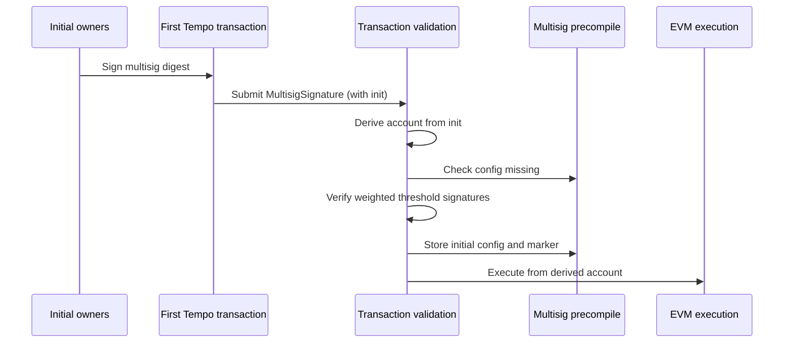
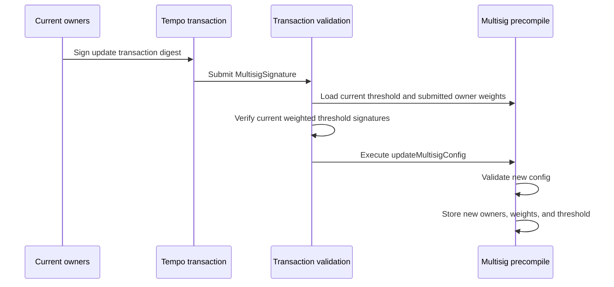

# TIP-1061: Native Multisig Accounts

## Abstract

This TIP adds native multisig accounts as a primary Tempo account type. A multisig account has a stable account address derived from its initial weighted owner config and a caller-chosen salt, and transactions from that address are authorized by primitive or nested multisig owner approvals whose configured weights meet the threshold.

## Motivation

Teams, treasuries, validators, and institutional operators need accounts where no single private key can unilaterally move funds or change operational configuration.

Canonical EVM multisigs are generally contract accounts with an owner set, owner weights, and a threshold. Tempo can provide the same core threshold-control model through native account and transaction validation, without requiring a contract wallet deployment.

## Specification

The key words "MUST", "MUST NOT", "REQUIRED", "SHALL", "SHALL NOT", "SHOULD", "SHOULD NOT", "RECOMMENDED", "NOT RECOMMENDED", "MAY", and "OPTIONAL" in this document are to be interpreted as described in RFC 2119 and RFC 8174.

### Constants

```rust
/// Tempo signature type byte for native multisig signatures.
pub const SIGNATURE_TYPE_MULTISIG: u8 = 0x05;

/// Domain prefix for native multisig owner approvals.
pub const MULTISIG_SIGNATURE_DOMAIN: &[u8] = b"tempo:multisig:signature";

/// Maximum number of owners allowed in a native multisig config.
pub const MAX_MULTISIG_OWNERS: usize = 255;

/// Maximum threshold accepted by a native multisig config.
pub const MAX_MULTISIG_THRESHOLD: u8 = 8;

/// Maximum number of owner approvals allowed in one native multisig signature.
pub const MAX_MULTISIG_SIGNATURES: usize = MAX_MULTISIG_THRESHOLD as usize;

/// Maximum number of native multisig signatures in one nested authorization path, including the
/// top-level transaction signature.
pub const MAX_MULTISIG_NESTING_DEPTH: usize = 2;

/// Maximum encoded byte length for one primitive owner approval.
pub const MAX_MULTISIG_OWNER_SIGNATURE_BYTES: usize = 2049;
```

- `SIGNATURE_TYPE_MULTISIG` is a new Tempo signature type byte in the `TempoSignature` byte-encoding namespace.
- `MULTISIG_SIGNATURE_DOMAIN` is used only inside the owner approval digest. It is distinct from the wire signature type byte.
- `MAX_MULTISIG_OWNERS` bounds stored config size and precompile config update/read work.
- `MAX_MULTISIG_THRESHOLD` bounds the configured quorum a single native multisig account can require. Because owner weights are nonzero, it also bounds the number of owner approvals needed to satisfy one multisig authorization node.
- `MAX_MULTISIG_SIGNATURES` bounds the number of owner approvals submitted in one native multisig signature.
- `MAX_MULTISIG_NESTING_DEPTH` bounds recursive native multisig validation. The top-level multisig signature counts as depth `1`, so a value of `2` allows parent -> child authorization paths.
- `MAX_MULTISIG_OWNER_SIGNATURE_BYTES` matches the current maximum encoded `PrimitiveSignature` length and is enforced as a raw byte cap for every submitted owner approval.

### Data Structures

The Tempo transaction payload is unchanged by this TIP. The native multisig bootstrap config is
not a transaction field; it is carried inside the multisig signature (see below).

```rust
/// Initial native multisig config carried inside the bootstrap signature.
pub struct InitMultisig {
    /// Caller-chosen salt mixed into the derived account address. Allows the same owner set to
    /// derive distinct multisig accounts for different purposes.
    pub salt: B256,

    /// Minimum total owner weight required to authorize a transaction.
    pub threshold: u8,

    /// Sorted weighted owner list.
    pub owners: Vec<MultisigOwner>,
}

/// Native multisig owner entry.
pub struct MultisigOwner {
    /// Owner address recovered from a primitive signature, or the account address of a nested
    /// native multisig signature.
    pub owner: Address,

    /// Nonzero owner weight.
    pub weight: u8,
}
```

`TempoSignature` gains a multisig variant:

```rust
/// Tempo transaction signature.
pub enum TempoSignature {
    /// Signature from a primitive account key.
    Primitive(PrimitiveSignature),

    /// Signature from an authorized AccountKeychain access key.
    Keychain(KeychainSignature),

    /// Signature from a native multisig account.
    Multisig(MultisigSignature),
}

/// Native multisig transaction signature.
pub struct MultisigSignature {
    /// Native multisig account address.
    pub account: Address,

    /// Encoded owner approvals over the multisig digest.
    pub signatures: Vec<Bytes>,

    /// Initial native multisig config for bootstrapping this account. Present only on the first
    /// transaction from a derived account; absent on every subsequent transaction.
    pub init: Option<InitMultisig>,
}
```

Signature rules:

- `signatures` contains encoded owner approvals. Each approval MUST decode as either `TempoSignature::Primitive` or `TempoSignature::Multisig`.
- Implementations MUST reject any owner signature byte string that decodes as `KeychainSignature`.
- `signatures.len()` MUST be between `1` and `MAX_MULTISIG_SIGNATURES`.
- Each owner approval byte string MUST be less than or equal to `MAX_MULTISIG_OWNER_SIGNATURE_BYTES`.
- Nested multisig owner approvals are additionally bounded by `MAX_MULTISIG_NESTING_DEPTH` and recursive multisig validation.
- `init` is present only when bootstrapping a native multisig account. It carries the initial
  `InitMultisig` config and is absent on every post-bootstrap transaction.
- When `init` is present, it MUST derive `signature.account`. That is,
  `derive_multisig_account(init) == signature.account`.
- Nested multisig owner approvals MUST NOT carry `init`; nested multisig accounts MUST already be initialized.

Flat M-of-N multisigs are represented by assigning every owner weight `1` and setting `threshold` to `M`. Because `MAX_MULTISIG_THRESHOLD` is `8`, flat M-of-N configs can express thresholds up to 8. The configured owner set can contain up to 255 owners.

Weighted configs can express asymmetric authority. For example, a config with `threshold = 5`, one owner with `weight = 5`, and two owners with `weight = 3` allows the high-weight owner alone or both lower-weight owners together to authorize a transaction.

### Transaction Encoding

This TIP does not add any transaction field. The Tempo transaction RLP field list is unchanged, and
`key_authorization` remains the only trailing optional slot:

```text
rlp([
  chain_id,
  max_priority_fee_per_gas,
  max_fee_per_gas,
  gas_limit,
  calls,
  access_list,
  nonce_key,
  nonce,
  valid_before,
  valid_after,
  fee_token,
  fee_payer_signature,
  tempo_authorization_list,
  key_authorization,
])
```

The native multisig bootstrap config is **not** a transaction field. It is carried inside the
multisig signature as `MultisigSignature.init` (see Signature Encoding), which is appended after the
transaction body and is therefore **not** covered by `tx.signature_hash()`.

Signing payload rules:

- `tx.signature_hash()` is computed over the canonical transaction RLP encoding defined above, exactly
  as in the pre-activation format. This TIP does not change `tx.signature_hash()` for any transaction.
- `tx.fee_payer_signature_hash(sender)` is computed the same way, substituting `sender` for `fee_payer_signature` per existing fee-payer rules.
- Because `init` lives in the signature, bootstrapping does not change the transaction or fee-payer
  signing payloads. `init` is instead bound to the owner approvals through the account derived
  from `init` (see Owner Approval Digest and Multisig Identity).

Activation rules:

- Before T8, `TempoSignature::Multisig` MUST be rejected.
- At and after T8, signature type byte `0x05` is decoded as `TempoSignature::Multisig`.

### Signature Encoding

The multisig signature wire encoding is:

```text
0x05 || rlp([account, signatures, init?])
```

`signatures` is an RLP list of byte strings. Each byte string is one owner approval encoded with the existing `TempoSignature` byte encoding. Valid owner approvals are `TempoSignature::Primitive` and `TempoSignature::Multisig`; `TempoSignature::Keychain` owner approvals are invalid.

`init` is the optional trailing bootstrap config:

- When bootstrapping, `init` is the `InitMultisig` config, encoded as `rlp([salt, threshold, owners])`.
- When not bootstrapping, `init` is absent and the canonical encoding is `rlp([account, signatures])`.
- `MultisigOwner` is encoded as `rlp([owner, weight])`.
- `salt` is encoded as a 32-byte fixed-width RLP string.
- RLP integer fields use canonical RLP integer encoding. This applies to `threshold` and `weight`.

`init` decoding rules:

- After decoding `signatures`, if no payload remains, `init` is absent.
- If payload remains, it MUST decode as a single `InitMultisig` list.
- Any bytes remaining after `init` MUST be rejected.
- An explicit `EMPTY_STRING_CODE` (`0x80`) placeholder for absent `init` is not canonical and MUST be rejected.

Primitive owner approval byte strings use the same encoding and size limits as existing Tempo primitive signatures.

The largest primitive owner approval is a WebAuthn primitive signature. Its encoded byte length is `MAX_MULTISIG_OWNER_SIGNATURE_BYTES`. The same raw byte cap applies to nested multisig owner approvals, and nested approvals are additionally bounded by `MAX_MULTISIG_NESTING_DEPTH` and recursive multisig validation.

Decoding rules:

- Each owner approval MUST decode as `TempoSignature::Primitive` or `TempoSignature::Multisig`.
- Secp256k1 owner approvals MUST use the existing Secp256k1 primitive signature encoding.
- P256 owner approvals MUST use the existing P256 primitive signature encoding and size limit.
- WebAuthn owner approvals MUST use the existing WebAuthn primitive signature encoding and size limits.
- Nested multisig owner approvals MUST use the existing native multisig signature encoding.
- Nested multisig owner approvals MUST NOT include `init`.
- Keychain owner approvals MUST be rejected.
- Malformed or oversized primitive owner approval byte strings MUST be rejected before threshold accounting.
- `MAX_MULTISIG_OWNERS` limits stored owner count, not per-approval byte size or submitted owner approvals.
- `MAX_MULTISIG_SIGNATURES` limits submitted owner approvals per native multisig signature.

### Multisig Identity

The initial multisig configuration determines the native multisig account address:

```text
account = address(keccak256(
  "tempo:multisig:account" ||
  salt ||
  uint8(threshold) ||
  uint8(owners.len()) ||
  owners[0].owner ||
  uint8(owners[0].weight) ||
  owners[1].owner ||
  uint8(owners[1].weight) ||
  ...
)[12:32])
```

Account derivation rules:

- A derived account equal to `address(0)` is invalid.
- `salt` is part of account derivation. The same `(threshold, owners)` with different `salt` values MUST derive distinct account addresses, except with negligible address-collision probability.
- `salt` MAY be any 32-byte value, including `bytes32(0)`.
- `owners` MUST be sorted in strictly ascending `owner` address order before hashing.
- Duplicate owner addresses, zero owner addresses, and zero owner weights are invalid.
- `owners.len()` is part of account derivation. This one-byte encoding supports owner counts from 1 through 255.
- Owner uniqueness is by `owner` address.

Fixed-width integer fields included in the account derivation hash input use fixed-width big-endian unsigned byte encoding, not RLP integer encoding. The `uint8` fields are encoded as one byte.

The domain string literal in account derivation is encoded as the exact ASCII bytes shown, with no length prefix.

- Account derivation does not include `chain_id`.
- The same `(salt, threshold, owners)` triple derives the same multisig account address across Tempo chains.

Derived account rules:

- The derived account MUST be a valid Tempo primary account address.
- The derived account MUST NOT be the zero address.
- The derived account MUST NOT be a native precompile address.
- The derived account MUST NOT be a TIP-20 token address.
- The derived account MUST NOT be a virtual address.

Bootstrap claims unused derived account state. The derived account MAY have a nonzero balance before bootstrap, but it MUST otherwise be empty.

Bootstrap account-state rules:

- `nonce` MUST be zero.
- code MUST be empty.
- EIP-7702 delegation code MUST be absent.
- balance MAY be nonzero.

These checks apply only to native account state. External contract balances, roles, approvals, and pending ownership assignments for the derived address remain valid after bootstrap.

Funds sent to an uninitialized derived multisig address can be claimed by any transaction that provides the matching initial config and valid threshold owner approvals.

The derived account address is stable. Owner, weight, and threshold updates mutate the current config stored for the account, but they do not change `account`.

### Owner Approval Digest

Owners sign a multisig-specific digest derived from an inner digest that is already replay-protected by the protocol surface being authorized:

```text
multisig_digest = keccak256(
  MULTISIG_SIGNATURE_DOMAIN ||
  inner_digest ||
  account
)
```

For transaction authorization in this TIP, `inner_digest` is `tx.signature_hash()`.

Digest encoding rules:

- `MULTISIG_SIGNATURE_DOMAIN` is encoded as the exact ASCII bytes `tempo:multisig:signature`, with no length prefix.
- `inner_digest` is encoded as 32 bytes.
- `account` is encoded as 20 bytes.
- The digest input is raw byte concatenation, not RLP or ABI encoding.

This binding prevents an owner signature from being replayed as a primitive account authorization, a keychain inner signature, or a multisig authorization for a different account or inner digest.

Transaction owner approvals are chain-specific because `tx.signature_hash()` includes `chain_id`.

Sponsored transaction rules:

- `tx.signature_hash()` follows existing Tempo sponsored transaction signing semantics.
- When `fee_payer_signature` is absent, owner approvals commit to `fee_token`.
- When `fee_payer_signature` is absent, the multisig account pays fees under existing sender-pays fee semantics.
- When `fee_payer_signature` is present, owner approvals commit to sponsored execution but not to `fee_token`, fee payer address, or exact fee payer signature.
- The fee payer separately signs `tx.fee_payer_signature_hash(signature.account)`.
- The fee payer signature commits to `fee_token` and the multisig account as sender.
- Adding or removing `fee_payer_signature` changes `tx.signature_hash()` and invalidates existing owner approvals.

Owner approval rules:

- Each owner signature byte string in `MultisigSignature.signatures` MUST decode as `TempoSignature::Primitive` or `TempoSignature::Multisig`.
- Each decoded primitive owner approval MUST verify against the current `multisig_digest`.
- For top-level transaction authorization, `multisig_digest` uses `tx.signature_hash()` and `signature.account`.
- For a nested multisig owner approval, the parent `multisig_digest` becomes the nested approval's `inner_digest`, and the nested digest is `keccak256(MULTISIG_SIGNATURE_DOMAIN || parent_multisig_digest || nested_signature.account)`.
- Primitive verification derives the owner address from the decoded `PrimitiveSignature`.
- Nested multisig verification uses `nested_signature.account` as the owner address and recursively validates the nested signature against that account's stored native multisig config.
- Nested multisig owner approvals MUST NOT carry `init`; nested multisig accounts MUST already be initialized.
- Recursive validation MUST reject any account that appears twice in the same nested multisig validation path.
- Recursive validation MUST reject any path containing more than `MAX_MULTISIG_NESTING_DEPTH` native multisig signatures.
- Keychain owner approvals MUST be rejected.
- P256 owner approvals use the existing `PrimitiveSignature::P256` `pre_hash` semantics when verifying `multisig_digest`.
- For WebAuthn owner approvals, the WebAuthn challenge MUST be `multisig_digest`.
- Owner membership is checked against the primitive recovered owner address or nested multisig account address.
- Owner addresses MUST be strictly ascending.
- Strict ordering rejects duplicates and makes weighted threshold accounting deterministic.
- Validation MUST reject trailing owner approvals after the recovered weight first reaches the configured threshold. Extra approvals are invalid rather than ignored.

### Transaction Sender and Multisig Authorization

Native multisig signatures separate EVM transaction sender recovery from account authorization.

Sender recovery is stateless.

For `TempoSignature::Multisig`, sender recovery rules are:

1. parsing `MultisigSignature`
2. requiring `signature.account != address(0)`
3. requiring `signature.signatures.len()` is between `1` and `MAX_MULTISIG_SIGNATURES`
4. requiring each owner approval byte string is nonempty
5. when `signature.init` is present, requiring `derive_multisig_account(signature.init) == signature.account`
6. failing sender recovery if any of these checks fail
7. returning `signature.account` as the recovered transaction sender

This recovered sender only identifies the account that the transaction attempts to execute from. It does not prove that the transaction is authorized by the multisig account.

Before stateful multisig validation succeeds, the recovered sender MUST be treated only as an attempted sender.

Sender recovery MAY inspect owner approval byte string emptiness, count, and raw byte length. It MUST NOT decode, verify, or recover owner signatures, and it MUST NOT load multisig config state.

Multisig authorization is stateful. Before the transaction enters EVM execution, the protocol:

1. MUST validate `signature.init` during bootstrap or load the registered account threshold for normal validation
2. MUST verify submitted owner approvals in order
3. MUST look up each submitted owner weight from `signature.init` during bootstrap or from stored owner-weight state during normal validation
4. MUST require the recovered owner weights to meet the threshold with no trailing owner approvals after quorum is reached

After multisig authorization succeeds, the transaction executes from `signature.account`. Top-level EVM calls observe `tx.from == signature.account`, `tx.origin == signature.account`, and `msg.sender == signature.account`.

Sponsored multisig transactions follow existing Tempo fee payer semantics; the executing account remains `signature.account`.

Native multisig sender restriction:

- After sender recovery for any transaction signature type, if `multisig_accounts[recovered_sender] == true`, the outer signature MUST be `TempoSignature::Multisig`.
- Primitive and Keychain outer signatures MUST NOT authorize execution from a native multisig account.
- The fee payer signature path MUST NOT accept `TempoSignature::Multisig`.
- For any transaction with `fee_payer_signature`, if `multisig_accounts[recovered_fee_payer] == true`, validation MUST reject the transaction.
- Native multisig accounts MUST NOT have EVM bytecode or EIP-7702 delegation code installed after bootstrap.

### Multisig Precompile Storage

The native multisig account precompile stores the current config for each native multisig account:

```text
multisig_accounts[account] = MultisigAccountHeader {
  threshold,
  owner_count
}

multisig_owners[account][index] = MultisigOwner {
  owner,
  weight
}

multisig_owner_weights[account][owner] = weight
```

Storage rules:

- `multisig_accounts[account]` stores the account-scoped config header and marker exposed by the native multisig account precompile for other protocol components. The marker is set when the initial config is stored and is not cleared by config updates.
- `multisig_owners[account][index]` stores the enumerable owner list in strictly ascending `owner` address order. It is used by `getMultisigConfig` and config replacement.
- `multisig_owner_weights[account][owner]` stores direct owner membership and weight lookup state. Transaction validation uses this mapping to read only submitted owner weights, not the full owner list.
- Each stored owner includes a nonzero `owner` address and a nonzero `weight`.
- The same owner address MUST NOT be stored more than once.
- A stored config exists when the packed account header has nonzero `threshold` and nonzero `owner_count`.
- A packed account header with `threshold == 0` and `owner_count == 0` means no native multisig config is initialized for the account.
- A packed account header with exactly one of `threshold` or `owner_count` equal to zero is invalid and MUST NOT be created.
- `threshold`, `owner_count`, and owner `weight` are stored as `u8` values. `MAX_MULTISIG_OWNERS` is 255, `MAX_MULTISIG_THRESHOLD` is 8, and total configured owner weight is capped at 255, leaving spare bytes in the packed account header and owner storage slots for future metadata.
- Replacing the stored config MUST remove stale `multisig_owners[account][index]` rows and stale `multisig_owner_weights[account][owner]` entries for owners no longer present.

Once `multisig_accounts[account]` exists, bootstrap for that account MUST be rejected.

Weight accounting rules:

- The sum of owner weights MUST be computed using an integer type wide enough to avoid overflow.
- The recovered owner weight sum MUST use the same overflow-safe arithmetic.
- The total configured owner weight MUST be less than or equal to `u8::MAX`.
- Implementations MUST reject any config where `threshold` is greater than `MAX_MULTISIG_THRESHOLD`.
- Implementations MUST reject any config where `threshold` is greater than the total configured owner weight.

### Bootstrap

A first transaction from a native multisig account initializes the stored config.

Bootstrap validation applies when the transaction signature is `TempoSignature::Multisig` and `multisig_accounts[signature.account] == false`.

Validation rules:

1. require `signature.init` is present
2. require `tx.key_authorization` is absent
3. require `tx.nonce_key == 0`
4. require `tx.nonce == 0`
5. validate `signature.signatures.len()` is between `1` and `MAX_MULTISIG_SIGNATURES`
6. validate `signature.init.owners` is non-empty
7. validate `signature.init.owners.len() <= MAX_MULTISIG_OWNERS`
8. validate `signature.init.threshold >= 1`
9. validate `signature.init.threshold <= MAX_MULTISIG_THRESHOLD`
10. validate every owner address is nonzero
11. validate every owner weight is nonzero
12. compute `total_weight = sum(signature.init.owners.weight)`
13. validate `total_weight <= u8::MAX`
14. validate `signature.init.threshold <= total_weight`
15. validate `signature.init.owners` is strictly ascending by `owner`
16. derive `expected_account` from `signature.init`
17. validate `expected_account` satisfies the derived account rules
18. require `expected_account.nonce == 0`
19. require `expected_account` code is empty
20. require `expected_account` has no EIP-7702 delegation code
21. require `signature.account == expected_account`
22. require no config exists for `signature.account`
23. recursively validate owner approvals using `tx.signature_hash()` as the top-level inner digest and `signature.account` as the top-level multisig account
24. for primitive owner approvals, verify the primitive signature over the current `multisig_digest` and recover the owner address
25. for nested multisig owner approvals, require `init` is absent, require the nested account is already initialized, and recursively validate the nested signature using the parent `multisig_digest` as the nested inner digest
26. reject recursive validation if any multisig account appears twice in the same nested validation path or if the path exceeds `MAX_MULTISIG_NESTING_DEPTH`
27. require owner addresses are strictly ascending
28. require every owner address is in `signature.init.owners`
29. accumulate the configured weight for each validated owner
30. reject trailing owner approvals after accumulated weight first reaches `signature.init.threshold`
31. require the recovered owner weight sum is at least `signature.init.threshold`
32. store `signature.init` as the current config for `signature.account`
33. emit `MultisigInitialized(signature.account)`
34. consume the protocol nonce for `signature.account`
35. commit the initial config, account marker, and protocol nonce consumption as transaction-level state
36. execute the transaction from `signature.account`

Bootstrap state effects:

- A prefunded derived account balance does not prevent bootstrap.
- The initial config write is a transaction-level effect, not part of the EVM call frame.
- The account marker write and nonce consumption are transaction-level effects.
- Bootstrap consumes only the protocol nonce for `signature.account`.
- Once bootstrap validation succeeds and the transaction is included, these effects remain even if the subsequent EVM call execution reverts.
- If bootstrap validation fails, the transaction is invalid.
- Failed bootstrap validation MUST NOT consume a nonce or write config state.
- If `multisig_accounts[signature.account] == true`, bootstrap MUST be rejected.
- If bootstrap execution calls `updateMultisigConfig`, that call MUST revert.
- A reverted `updateMultisigConfig` call during bootstrap execution MUST NOT revert bootstrap validation state.
- After successful bootstrap validation, later transactions for that account MUST use normal multisig validation.



### Normal Transaction Validation

Normal validation applies when the transaction signature is `TempoSignature::Multisig` and `multisig_accounts[signature.account] == true`.

Consensus validation MUST evaluate the transaction against the state after all earlier transactions in the block have executed.

Validation rules:

1. require `signature.init` is absent
2. require `tx.key_authorization` is absent
3. require `signature.signatures.len()` is between `1` and `MAX_MULTISIG_SIGNATURES`
4. require `multisig_accounts[signature.account] == true`
5. require `signature.account` code is empty
6. require `signature.account` has no EIP-7702 delegation code
7. require a config exists for `signature.account`
8. load the stored threshold for `signature.account`
9. recursively validate owner approvals using `tx.signature_hash()` as the top-level inner digest and `signature.account` as the top-level multisig account
10. for primitive owner approvals, verify the primitive signature over the current `multisig_digest` and recover the owner address
11. for nested multisig owner approvals, require `init` is absent, require the nested account is already initialized, and recursively validate the nested signature using the parent `multisig_digest` as the nested inner digest
12. reject recursive validation if any multisig account appears twice in the same nested validation path or if the path exceeds `MAX_MULTISIG_NESTING_DEPTH`
13. require owner addresses are strictly ascending
14. load the current configured weight for each validated owner address
15. require every validated owner weight is nonzero
16. accumulate the current configured weights for validated owners
17. reject trailing owner approvals after accumulated weight first reaches the current threshold
18. require the recovered owner weight sum is at least the current threshold
19. authorize execution from `signature.account`

The transaction executes with `tx.from`, `tx.origin`, and top-level `msg.sender` equal to `signature.account`.

Stateful validation rules:

- A config update earlier in a block affects every later multisig transaction from that account in the same block.
- A transaction pool MAY use stateless sender recovery for indexing and replacement rules.
- A transaction pool MUST NOT treat stateless sender recovery as final multisig authorization.
- A transaction pool SHOULD revalidate or evict pending multisig transactions after accepting a config update for the same account.

Batched call rules:

- A multisig transaction is authorized once before EVM execution.
- The outer multisig signature authorizes every call in `tx.calls`.
- A config update in one call MUST NOT revalidate or invalidate later calls in the same transaction.
- A successful config update applies to later transactions from the same account.

### Gas Accounting

Native multisig authorization is charged as additional regular intrinsic gas. The surcharge is
relative to a normal secp256k1 Tempo transaction, whose base transaction gas already covers one
traditional `ecrecover`.

Constants:

```text
NATIVE_MULTISIG_VALIDATION_GAS = GAS_COLD_SLOAD = 2,100
NATIVE_MULTISIG_OWNER_WEIGHT_GAS = GAS_COLD_SLOAD = 2,100
TRADITIONAL_SECP256K1_TX_SIGNATURE_GAS = ECRECOVER_GAS = 3,000
```

For one decoded primitive owner approval:

```text
owner_signature_full_gas(secp256k1) = 3,000
owner_signature_full_gas(P256)      = 8,000
owner_signature_full_gas(WebAuthn)  = 8,000 + calldata_gas(webauthn_data)
```

For one decoded nested multisig owner approval:

```text
owner_signature_full_gas(nested_multisig) =
    NATIVE_MULTISIG_VALIDATION_GAS
  + NATIVE_MULTISIG_OWNER_WEIGHT_GAS * nested_owner_signatures.len()
  + sum(owner_signature_full_gas(signature) for signature in nested_owner_signatures)
```

The native multisig authorization surcharge is:

```text
native_multisig_authorization_gas =
    NATIVE_MULTISIG_VALIDATION_GAS
  + NATIVE_MULTISIG_OWNER_WEIGHT_GAS * owner_signatures.len()
  + sum(owner_signature_full_gas(signature) for signature in owner_signatures)
  - TRADITIONAL_SECP256K1_TX_SIGNATURE_GAS
```

`NATIVE_MULTISIG_VALIDATION_GAS` is one cold-storage-read equivalent. It prices the
protocol-side account/header validation needed to prove that the sender is a registered native
multisig and to load the current threshold. `NATIVE_MULTISIG_OWNER_WEIGHT_GAS` is one
cold-storage-read equivalent per submitted owner approval; it prices the direct owner-weight lookup
used during threshold accounting. Bootstrap uses the same owner-weight charge even though its owner
weights are supplied inline, keeping bootstrap authorization pricing conservative and symmetric with
registered validation.

The subtraction is required because the normal Tempo base transaction gas already includes one
traditional secp256k1 transaction-signature verification. A 1-of-1 secp256k1 native multisig
therefore pays the validation charge plus one owner-weight lookup:

```text
2,100 + 2,100 + 3,000 - 3,000 = 4,200
```

Additional owner approvals are charged at their full primitive verification cost:

```text
1 secp256k1 owner: 4,200 gas
2 secp256k1 owners: 9,300 gas
3 secp256k1 owners: 14,400 gas
```

P256 and WebAuthn owner approvals use the same full verification costs used for additional
non-transaction signatures. This keeps native multisig pricing consistent with the existing
transaction signature gas model while preventing multisig owner verification from becoming
unmetered as owner count grows.

Nested multisig owner approvals are charged recursively. Each nested native multisig account adds
its own `NATIVE_MULTISIG_VALIDATION_GAS`, its submitted owner approvals each add
`NATIVE_MULTISIG_OWNER_WEIGHT_GAS`, and its primitive descendants add their full primitive
verification gas. The `TRADITIONAL_SECP256K1_TX_SIGNATURE_GAS` subtraction is applied exactly once,
at the top-level transaction authorization.

Recursive gas accounting MUST use the same `MAX_MULTISIG_NESTING_DEPTH` bound as recursive
validation. A transaction whose owner approvals exceed that bound is invalid.

The validation storage-read bound is independent of `MAX_MULTISIG_OWNERS`. With
`MAX_MULTISIG_SIGNATURES = 8` and `MAX_MULTISIG_NESTING_DEPTH = 2`, a normal transaction can require
at most:

```text
top-level threshold read                      = 1
top-level submitted owner-weight reads        = 8
8 nested owners * (threshold + 8 owner reads) = 8 * (1 + 8)
total registered validation reads             = 81
```

Config updates and `getMultisigConfig` can enumerate or rewrite up to `MAX_MULTISIG_OWNERS` owner
rows, but those paths execute through the precompile/RPC surfaces where storage reads and writes are
metered separately. Transaction authorization never needs to scan all configured owners.

This formula only prices protocol-side native multisig authorization. `INativeMultisig` precompile
calls are charged under the active Tempo precompile storage gas schedule, and storage-creating
writes outside owner-authorization verification require separate accounting under the active
state-gas rules.

### AccountKeychain Restrictions

Native multisig accounts do not support access keys.

Transaction rule:

- A transaction with `TempoSignature::Multisig` MUST NOT include `key_authorization`.
- A multisig transaction with `key_authorization` is invalid.

AccountKeychain mutator rules:

- The AccountKeychain precompile MUST reject mutating calls where `multisig_accounts[msg.sender] == true`.
- The check is against `msg.sender`.
- The check MUST NOT depend on `tx.origin` or the outer transaction signature type.

This includes every mutating AccountKeychain entrypoint, including:

- both `authorizeKey` overloads
- `revokeKey`
- `updateSpendingLimit`
- `setAllowedCalls`
- `removeAllowedCalls`
- any TIP-1053 key authorization nonce burn entrypoint

Read-only behavior:

- Read-only AccountKeychain calls for native multisig accounts MUST NOT return active access key state.
- They SHOULD return the same empty or missing-key shape used for accounts with no access keys.

### Authorization List Restrictions

This TIP does not add native multisig support to `tempo_authorization_list`.

Authorization list rules:

- `TempoSignature::Multisig` is valid only as the outer transaction signature.
- A `TempoSignedAuthorization` entry in `tempo_authorization_list` MUST reject `TempoSignature::Multisig`.
- A native multisig account MUST NOT be accepted as an EIP-7702 authority account.
- Authorization-list validation MUST check `multisig_accounts[authority]` against current validation state.
- Current validation state includes earlier transactions in the block.
- Current validation state also includes the bootstrap marker applied for the current transaction.
- A bootstrap transaction MUST reject any authorization-list entry where `authority == signature.account`.
- A normal multisig transaction MUST reject any authorization-list entry where `authority == signature.account`.

### Signature Verifier Restrictions

The TIP-1020 signature verifier precompile remains a stateless primitive signature verifier.

This TIP updates TIP-1020 by adding `TempoSignature::Multisig` to the rejected stateful signature forms.

Signature verifier rules:

- `ISignatureVerifier.recover` MUST reject `TempoSignature::Multisig` with `InvalidFormat()`.
- `ISignatureVerifier.verify` MUST reject `TempoSignature::Multisig` with `InvalidFormat()`.
- Multisig authorization MUST be performed by transaction validation, not by the signature verifier precompile.

### Multisig Account Precompile

The native multisig account precompile exposes current config reads and config updates. The precompile address is assigned before this TIP moves out of Draft.

```solidity
interface INativeMultisig {
    /// @notice Native multisig owner and weight.
    /// @param owner Owner key ID.
    /// @param weight Nonzero owner weight.
    struct MultisigOwner {
        address owner;
        uint8 weight;
    }

    /// @notice Current native multisig config.
    /// @param threshold Minimum total owner weight required.
    /// @param owners Sorted owner key IDs and weights.
    struct MultisigConfig {
        uint8 threshold;
        MultisigOwner[] owners;
    }

    /// @notice Returns the current config for a native multisig account.
    /// @dev Reverts if account is not a native multisig account or its stored config is invalid.
    /// @param account The multisig account address.
    /// @return config The current config.
    function getMultisigConfig(
        address account
    ) external view returns (MultisigConfig memory config);

    /// @notice Returns whether account has initialized a native multisig config.
    /// @dev Reverts if account storage has an invalid partial config header.
    /// @param account The account address to check.
    /// @return isMultisig True when account has an initialized native multisig config header.
    function isMultisigAccount(
        address account
    ) external view returns (bool isMultisig);

    /// @notice Replaces the current owner key IDs, weights, and threshold for msg.sender.
    /// @dev Authorization comes from the outer multisig transaction signature.
    /// @dev Reverts if msg.sender was initialized as a native multisig account earlier in the same transaction.
    /// @dev Reverts unless invoked from a protocol-created top-level frame for one tx.calls entry.
    /// @dev Reverts when invoked through nested CALL, STATICCALL, DELEGATECALL, or CALLCODE.
    /// @dev Reverts if msg.sender is not a native multisig account or its stored config header is invalid.
    /// @dev Reverts if owners is empty, too long, unsorted, duplicated, or contains a zero owner or zero weight.
    /// @dev Reverts if threshold is zero, greater than MAX_MULTISIG_THRESHOLD, or greater than the total owner weight.
    /// @param threshold The new threshold. Must be between 1 and MAX_MULTISIG_THRESHOLD and not exceed the total owner weight.
    /// @param owners The new sorted owner key IDs and weights.
    function updateMultisigConfig(
        uint8 threshold,
        MultisigOwner[] calldata owners
    ) external;

    /// @notice Emitted when a native multisig account stores its initial config.
    /// @param account The native multisig account address.
    event MultisigInitialized(
        address indexed account
    );

    /// @notice Emitted when the current native multisig config is replaced.
    /// @param account The native multisig account address.
    /// @param threshold The new threshold.
    /// @param owners The new sorted owner key IDs and weights.
    event MultisigConfigUpdated(
        address indexed account,
        uint8 threshold,
        MultisigOwner[] owners
    );

    /// @notice The account is not a native multisig account.
    error NotMultisigAccount();

    /// @notice The account is not the account derived from the bootstrap config.
    error InvalidAccount();

    /// @notice The initial config failed structural validation.
    error InvalidConfig();

    /// @notice The threshold is zero, greater than MAX_MULTISIG_THRESHOLD, or greater than total owner weight.
    error InvalidThreshold();

    /// @notice An owner key ID is the zero address.
    error InvalidOwner();

    /// @notice An owner weight is zero, or the total owner weight exceeds `u8::MAX`.
    error InvalidWeight();

    /// @notice The owner list exceeds MAX_MULTISIG_OWNERS.
    error TooManyOwners();

    /// @notice The owner list contains a duplicate owner key ID.
    error DuplicateOwner();

    /// @notice The owner list is not sorted in strictly ascending owner order.
    error InvalidOwnerOrder();

    /// @notice The account is already initialized as a native multisig account.
    error AccountAlreadyInitialized();

    /// @notice `msg.sender` is not authorized to update the config (not the top-level transaction caller).
    error UnauthorizedCaller();

    /// @notice The config cannot be updated in the same transaction that initialized the account.
    error SameTransactionUpdateNotAllowed();
}
```

`getMultisigConfig` read rules:

- If `multisig_accounts[account] == false`, the function MUST revert with `NotMultisigAccount()`.
- If the packed account header is partially initialized, the function MUST revert with `InvalidConfig()`.
- The function MUST return the current account-scoped config when it exists.

`isMultisigAccount` read rules:

- If the packed account header is uninitialized, the function MUST return `false`.
- If the packed account header is initialized, the function MUST return `true`.
- If the packed account header is partially initialized, the function MUST revert with `InvalidConfig()`.

`updateMultisigConfig` validation rules:

1. reject `DELEGATECALL` and `CALLCODE` at the precompile entry; reject `STATICCALL` for mutating entrypoints
2. require `msg.sender == tx.origin` (`UnauthorizedCaller`)
3. require `msg.sender` was not initialized as a native multisig account earlier in the same transaction (`SameTransactionUpdateNotAllowed`)
4. require `multisig_accounts[msg.sender] == true` (`NotMultisigAccount`)
5. require the packed account header is initialized (`InvalidConfig`)
6. validate `owners` is non-empty (`InvalidOwner`)
7. validate `owners.length <= MAX_MULTISIG_OWNERS` (`TooManyOwners`)
8. validate every owner address is nonzero (`InvalidOwner`)
9. validate every owner weight is nonzero (`InvalidWeight`)
10. compute `total_weight = sum(owners.weight)`
11. validate `total_weight <= u8::MAX` (`InvalidWeight`)
12. validate `1 <= threshold <= MAX_MULTISIG_THRESHOLD` and `threshold <= total_weight` (`InvalidThreshold`)
13. validate `owners` is strictly ascending by `owner` (`DuplicateOwner` / `InvalidOwnerOrder`)
14. replace the stored current config for `msg.sender`
15. emit `MultisigConfigUpdated`

Additional update rules:

- Authorization for `updateMultisigConfig` is provided by the outer transaction signature.
- The precompile MUST NOT accept an additional signature parameter for config updates.
- `updateMultisigConfig` MUST revert when `msg.sender` was initialized as a native multisig account earlier in the same transaction.
- Replacing the stored config MUST remove any previous owner entry that is not present in the new `owners` list.
- Multisig transactions after a successful update MUST be authorized only against the new stored owner set, weights, and threshold.
- A config update MUST NOT revalidate remaining calls in the same transaction.
- The top-level-only requirement is enforced via `msg.sender == tx.origin`. Combined with the precompile's `DELEGATECALL` / `CALLCODE` rejection and the prohibition on installing code on a native multisig account, this guarantees the call originates from a protocol-created top-level frame for one entry in `tx.calls`.
- A nested `CALL` where an intermediate contract is `msg.sender` MUST fail with `UnauthorizedCaller` because `msg.sender != tx.origin`.
- A nested `DELEGATECALL` MUST fail at the precompile entry regardless of preserved `msg.sender`.
- A `STATICCALL` to `updateMultisigConfig` MUST fail.



## Rationale

### Salt In Account Derivation

Account derivation mixes a caller-chosen `salt` with `(threshold, owners)`. Without a salt, the same owner set always derives the same account, so a group of signers can only ever control one native multisig account on a Tempo chain.

Adding `salt` lets the same signer set commit to multiple distinct multisig accounts for different purposes (operational treasury, cold storage, validator set, etc.) without changing the owner set. `salt` is part of the account derivation preimage, so it is included in the cross-chain stability guarantee: `(salt, threshold, owners)` derives the same account on every Tempo chain.

`salt` is unconstrained 32 bytes, including `bytes32(0)`. A zero salt is valid for callers who want the historical "one account per owner set" derivation.

### Bootstrap Config In The Signature

The initial config (`init`) is carried inside `MultisigSignature`, not as a transaction field.

This keeps the Tempo transaction wire format and `tx.signature_hash()` unchanged: bootstrapping a
native multisig account does not require a new positional transaction slot, a placeholder for absent
slots, or a change to the signing payload. Non-multisig transactions are byte-identical to the
pre-activation format.

`init` does not need to be covered by `tx.signature_hash()` to be safe. It is bound to the owner
approvals through the derived account: owner approvals commit to `account` via `multisig_digest`,
and sender recovery requires `derive_multisig_account(init) == account`.
A tampered `init` therefore fails to derive the recovered account, so it cannot authorize execution.

Because `init` is a trailing optional element of the signature list, an absent `init` is omitted
entirely. This keeps the signature decodable without a separate length field and preserves a single
canonical encoding for non-bootstrap multisig signatures.

### Native Account Authorization

This TIP takes the canonical EVM multisig account model and makes it native to Tempo transaction validation.

It keeps the EVM pattern of stable account identity plus threshold approval. Modules, guards, fallback handlers, nested contract signers, and onchain proposal storage are out of scope.

The current quorum may replace the entire owner set. The protocol does not require an approving owner to remain in the new config.

That matches canonical multisig authority: the current threshold controls the account. Key rotation remains an operational responsibility for owners and tooling.

### Bounded Quorum Work

`MAX_MULTISIG_OWNERS` is not the transaction-validation DoS bound. With direct owner-weight
lookups, a normal multisig transaction reads only the registered threshold and the weights for
submitted owner approvals. Configured owners that do not appear in the signature list are not loaded
during transaction authorization.

The threshold is the limiting factor for unpaid validation work because owner weights are nonzero.
An attacker who wants to force maximum verifier work sets many submitted owners to weight `1`, so
the verifier must process `threshold` owner approvals before quorum can be reached. Capping
`MAX_MULTISIG_THRESHOLD` at `8` therefore caps the useful submitted approvals per multisig node,
while still allowing a large administrative owner set of up to 255 owners. The large owner set is
paid for when configs are created, updated, or explicitly read through the precompile; it does not
make transaction authorization scan 255 owners.

Trailing approvals after quorum are rejected rather than ignored. Once the recovered weight reaches
the threshold, later approvals do not contribute to authorization. Accepting them would either force
validation to keep decoding and verifying irrelevant signatures, or allow unchecked bytes to be
relayed in otherwise valid transactions. Rejection gives each authorization a canonical minimal
quorum proof and lets validators stop as soon as quorum is reached.

### AccountKeychain Restrictions

The current AccountKeychain model is a poor fit for multisig accounts because it lets a single authorized key make calls as the parent account.

For a multisig account, that would turn one primitive key into a standing ability to act as the multisig address within whatever scope was authorized.

Scope checks can restrict top-level targets, selectors, and limited TIP-20 recipients.

They cannot make downstream contracts distinguish a quorum-approved multisig transaction from a single-key transaction bound to the multisig `msg.sender`.

Access keys bound to the multisig `msg.sender` also create durable side effects under the parent account's identity.

If such a key grants a role, creates an approval, joins a vault, or mutates application state, that state belongs to the multisig account.

Revoking the access key does not revoke those external permissions or unwind application state.

Keeping access keys out of this TIP preserves the multisig account as a quorum-controlled identity.

This TIP does not define any single-key path that executes with the multisig account's `msg.sender`.

## Backwards Compatibility

- Existing primitive and keychain signatures remain valid and unchanged.
- This TIP adds no transaction field. The Tempo transaction wire format is unchanged, so existing
  transaction encodings (with or without `key_authorization`) remain canonical and byte-identical.
- Existing `key_authorization` transaction encodings remain canonical.
- All transactions, including multisig bootstrap transactions, keep the existing transaction and fee
  payer signing payloads. The bootstrap config (`init`) lives in the signature, which is appended
  after the transaction body and is not covered by `tx.signature_hash()`.
- The bootstrap config is instead bound to the owner approvals through the derived account: owner
  approvals commit to `account` via `multisig_digest`, and sender recovery requires `init` to
  derive `account`.
- This TIP does not change the `fee_payer_signature` field type.
- Multisig owner approvals use the same fee payer binding behavior as existing Tempo sender signatures.
- Existing non-multisig accounts remain eligible for AccountKeychain access keys.
- This TIP changes AccountKeychain behavior only for accounts where `multisig_accounts[account] == true`.
- Native multisig accounts use derived account addresses.
- Existing EOAs cannot be upgraded in place to native multisig accounts under this TIP.
- Pre-funding a derived multisig account address before bootstrap remains valid.
- Any migration from an EOA to a multisig account requires moving assets or account-level state through existing application flows.
- Bootstrap transactions must use protocol nonce `0` with `nonce_key == 0`.
- Normal post-bootstrap multisig transactions use existing Tempo nonce modes.
- This TIP rejects multisig key authorization in the current protocol.

## Test Cases

### Bootstrap

- Accept a first multisig transaction with valid `signature.init`, derived account, and weighted threshold owner signatures.
- Reject bootstrap with `key_authorization`.
- Reject bootstrap when the account derived from `signature.init` was computed without owner weights.
- Reject bootstrap when the account derived from `signature.init` was computed with RLP encoding.
- Reject bootstrap when the account derived from `signature.init` was computed with ABI encoding.
- Reject bootstrap when the account derived from `signature.init` was computed with a length-prefixed domain string.
- Reject bootstrap when the account derived from `signature.init` was computed with a noncanonical `uint8` field encoding.
- Reject bootstrap when the account derived from `signature.init` was computed with omitted owner count.
- Reject bootstrap when the account derived from `signature.init` was computed with omitted `salt`.
- Reject bootstrap when the derived account is `address(0)`.
- Confirm the same `(salt, threshold, owners)` triple derives the same account across different `chain_id` values.
- Confirm the same `(threshold, owners)` with two different `salt` values derives two distinct accounts.
- Accept bootstrap with `salt == bytes32(0)`.
- Reject bootstrap when `signature.account` does not match the derived account.
- Reject bootstrap when the derived account is not a valid Tempo primary account address.
- Reject bootstrap when `tx.nonce_key != 0`.
- Reject bootstrap when `tx.nonce != 0`.
- Accept bootstrap for an empty derived account with a nonzero balance.
- Reject bootstrap when the derived account has non-empty code.
- Reject bootstrap when the derived account has EIP-7702 delegation code.
- Reject bootstrap when the derived account has consumed transaction nonce state.
- Reject bootstrap when `multisig_accounts[signature.account] == true`.
- Reject bootstrap when a config already exists for `signature.account`.
- Reject bootstrap with empty owners.
- Accept bootstrap with exactly `MAX_MULTISIG_OWNERS` owners.
- Reject bootstrap with more than `MAX_MULTISIG_OWNERS` owners.
- Reject bootstrap with duplicate or unsorted owners.
- Reject bootstrap with zero owner address.
- Reject bootstrap with zero owner weight.
- Reject bootstrap with threshold 0 or threshold greater than total owner weight.
- Reject bootstrap with threshold greater than `MAX_MULTISIG_THRESHOLD`.
- Reject bootstrap when total owner weight exceeds `u8::MAX`.
- Reject bootstrap with zero owner signatures.
- Reject bootstrap with more than `MAX_MULTISIG_SIGNATURES` owner signatures.
- Reject bootstrap with duplicate recovered signers.
- Reject bootstrap with unsorted recovered signers.
- Reject bootstrap with non-owner signers.
- Reject bootstrap with insufficient valid signature weight.
- Reject bootstrap with trailing owner signatures after quorum is reached.
- Reject bootstrap owner signatures that verify against the wrong inner digest or account.
- Preserve the stored initial config, native multisig account marker, and nonce consumption when bootstrap validation succeeds but the subsequent EVM call reverts.
- Do not write the initial config or native multisig account marker when bootstrap validation fails.
- Do not consume the nonce when bootstrap validation fails.
- Reject replaying a bootstrap transaction after successful bootstrap validation with reverted EVM execution.
- Reject a second bootstrap for the same account after successful bootstrap validation with reverted EVM execution.
- Revert `updateMultisigConfig` when it is called during bootstrap execution.
- Preserve the initial config, native multisig account marker, and nonce consumption when `updateMultisigConfig` reverts during bootstrap execution.

### Normal Transactions

- Accept a normal multisig transaction with current weighted threshold signatures.
- Accept one high-weight signer when that signer's configured weight meets the threshold.
- Accept multiple lower-weight signers when their combined configured weight meets the threshold.
- Reject a normal multisig transaction that includes `signature.init`.
- Reject a normal multisig transaction that includes `key_authorization`.
- Reject a normal multisig transaction when `multisig_accounts[signature.account] == false`.
- Reject a normal multisig transaction when `signature.account` does not satisfy the derived account rules.
- Reject a normal multisig transaction when `signature.account` has non-empty code.
- Reject a normal multisig transaction when `signature.account` has EIP-7702 delegation code.
- Reject a normal multisig transaction when no config exists and `signature.init` is absent.
- Reject attempts to install EVM bytecode or EIP-7702 delegation code on a native multisig account.
- Reject duplicate signers through strict recovered-signer ordering.
- Reject unsorted recovered signers.
- Reject zero owner signatures.
- Reject more than `MAX_MULTISIG_SIGNATURES` owner signatures.
- Reject non-owner signers.
- Reject below-threshold signature weight.
- Reject trailing owner signatures after quorum is reached.
- Reject owner signatures that verify against the wrong inner digest or account.
- Reject owner signatures where `multisig_digest` was computed with a length-prefixed domain string.
- Reject owner signatures where `multisig_digest` was computed with RLP or ABI encoding.
- Reject owner signatures replayed from a transaction with a different `chain_id`.
- Reject primitive outer signatures whose recovered sender is a native multisig account.
- Reject Keychain outer signatures whose recovered sender is a native multisig account.
- Confirm the fee payer signature path rejects `TempoSignature::Multisig`.
- Reject a transaction signed by an owner removed by an earlier config update.
- Reject a transaction whose owner weight is below a threshold raised by an earlier config update.
- Reject a same-block transaction when an earlier transaction in the block updates the config and makes the signer set invalid.
- Accept a same-block transaction when an earlier transaction in the block lowers the threshold enough for the recovered owner weight.
- Accept a same-block transaction authorized by the old config when it appears before a config update that removes those signers.
- Confirm stateless sender recovery returns `signature.account` without verifying owner signatures.
- Confirm stateless sender recovery returns `signature.account` for malformed owner signature bytes that are within payload limits.
- Reject stateless sender recovery when `signature.account == address(0)`.
- Reject stateless sender recovery when any owner signature byte string is empty.
- Confirm stateful validation rejects a multisig transaction whose stateless sender recovery succeeds but owner signature verification fails.
- Accept later calls in the same transaction after an earlier call updates the config.
- Require the next transaction after a successful config update to use the new config.
- Confirm owner approvals commit to `fee_token` when `fee_payer_signature` is absent.
- Confirm unsponsored multisig transactions can pay fees from `signature.account`.
- Confirm owner approvals do not commit to `fee_token`, fee payer address, or exact fee payer signature when `fee_payer_signature` is present.
- Confirm changing `fee_token` does not invalidate owner approvals when `fee_payer_signature` is present.
- Confirm changing `fee_token` invalidates owner approvals when `fee_payer_signature` is absent.
- Confirm adding or removing `fee_payer_signature` invalidates existing owner approvals.
- Confirm `tx.fee_payer_signature_hash(signature.account)` commits to `fee_token` and the multisig account as sender.
- Confirm sponsored multisig transactions execute with `tx.origin == signature.account`, not the fee payer.
- Reject sponsored transactions when the recovered fee payer is a native multisig account.
- Reject owner signatures replayed from a different multisig account with the same owner set.

### Gas Accounting

- Confirm 1-of-1 secp256k1 native multisig adds exactly `4,200` regular intrinsic gas over the same primitive secp256k1 transaction.
- Confirm 2-of-2 secp256k1 native multisig adds exactly `9,300` regular intrinsic gas over the same primitive secp256k1 transaction.
- Confirm P256 and WebAuthn owner approvals are charged using full additional owner signature costs in the multisig formula.
- Confirm native multisig authorization gas does not add the AccountKeychain `900` processing buffer.
- Confirm native multisig authorization gas does not add state gas.

### Config Updates

- Accept `updateMultisigConfig` when the outer transaction is signed by the current weighted threshold.
- Preserve account address after an update.
- Confirm removed owners cannot authorize transactions after an update.
- Confirm pending transactions from removed owners become invalid after an update.
- Reject updates with empty owners.
- Accept updates with exactly `MAX_MULTISIG_OWNERS` owners.
- Reject updates with too many owners.
- Reject updates with zero owner address.
- Reject updates with zero owner weight.
- Reject updates with invalid threshold.
- Reject updates with threshold greater than `MAX_MULTISIG_THRESHOLD`.
- Reject updates with threshold greater than total owner weight.
- Reject updates when total owner weight exceeds `u8::MAX`.
- Reject updates with duplicate owner addresses or unsorted owners.
- Revert `updateMultisigConfig` when `msg.sender` was initialized as a native multisig account earlier in the same transaction.
- Confirm `getMultisigConfig` reverts with `InvalidConfig()` when the packed account header is partially initialized.
- Confirm `getMultisigConfig` reverts with `NotMultisigAccount()` for non-multisig accounts.
- Accept top-level batch `updateMultisigConfig` calls from the native multisig account.
- Reject top-level batch `updateMultisigConfig` calls from non-multisig accounts.
- Reject nested `CALL` to `updateMultisigConfig` where `msg.sender` is an intermediate contract.
- Reject nested `CALL` to `updateMultisigConfig` where `msg.sender` is the native multisig account.
- Reject nested `DELEGATECALL` to `updateMultisigConfig`.
- Reject `STATICCALL` to `updateMultisigConfig`.
- Reject `CALLCODE` to `updateMultisigConfig` if supported by the execution environment.

### Access Key Exclusions

- Reject a multisig transaction that carries `key_authorization`.
- Reject AccountKeychain mutators when `msg.sender` is a native multisig account.
- Reject AccountKeychain mutators during a bootstrap transaction after the native multisig account marker is set.
- Reject any TIP-1053 key authorization nonce burn entrypoint when `msg.sender` is a native multisig account.
- Confirm read-only AccountKeychain calls do not expose active access key state for native multisig accounts.
- Confirm existing AccountKeychain behavior is unchanged for primitive and keychain accounts.

### Transaction Encoding

- Accept a transaction with `key_authorization` absent (slot stripped, existing wire format).
- Accept a transaction with `key_authorization` present (existing wire format).
- Confirm the transaction wire format is byte-identical to the pre-activation format; this TIP adds no transaction field.
- Confirm `tx.signature_hash()` is unchanged from the pre-activation format for all transactions, including multisig bootstrap transactions.
- Confirm `tx.fee_payer_signature_hash(sender)` is unchanged from the pre-activation format for all transactions, including multisig bootstrap transactions.
- Confirm `tx.signature_hash()` does not change when `signature.init` is added or removed (`init` is in the signature, not the transaction body).

### Signature Encoding (Bootstrap Config)

- Reject `TempoSignature::Multisig` before T8.
- Round-trip a non-bootstrap multisig signature: `init` omitted, then decoded as absent.
- Round-trip a bootstrap multisig signature: `init` encoded as the `InitMultisig` list `rlp([salt, threshold, owners])`, then decoded as present.
- Confirm the canonical encoding of an absent `init` ends immediately after `signatures`.
- Reject a signature that encodes absent `init` as the `0x80` placeholder.
- Reject a multisig signature with trailing bytes after the `init` element.
- Reject a multisig signature whose `init` element is not a valid `InitMultisig` list.
- Reject a bootstrap signature where `signature.account != derive_multisig_account(signature.init)`.
- Confirm the multisig `account` is unchanged whether `init` is present or absent (same `signatures`).
- Confirm that changing only `signature.init.salt` changes `account` and the recovered owner approval digest.

### Owner Signature Types

- Accept Secp256k1 owner signatures.
- Accept legacy raw Secp256k1 owner signatures when they decode as `PrimitiveSignature::Secp256k1`.
- Accept P256 owner signatures.
- Confirm P256 owner approvals use existing `PrimitiveSignature::P256` `pre_hash` semantics.
- Accept WebAuthn owner signatures.
- Accept WebAuthn owner signatures at the maximum primitive WebAuthn signature size.
- Reject WebAuthn owner approvals whose challenge is `tx.signature_hash()` instead of `multisig_digest`.
- Accept nested Multisig owner signatures.
- Accept a root multisig with a nested multisig owner at `MAX_MULTISIG_NESTING_DEPTH`.
- Reject nested Multisig owner signatures that include `init`.
- Reject nested Multisig owner signatures for accounts that are not initialized native multisig accounts.
- Reject nested Multisig owner-signature cycles.
- Reject nested Multisig owner signatures deeper than `MAX_MULTISIG_NESTING_DEPTH`.
- Reject nested Multisig owner signatures whose primitive descendants sign the wrong chained `multisig_digest`.
- Reject Keychain owner signatures.
- Reject malformed owner signature bytes.
- Reject oversized WebAuthn owner signatures.
- Reject too-short WebAuthn owner signatures.
- Reject P256 owner signatures with invalid length.

### Authorization Lists

- Reject `TempoSignature::Multisig` inside `tempo_authorization_list`.
- Reject an EIP-7702 authorization where the recovered authority is a native multisig account.
- Reject an EIP-7702 authorization where the authority became native multisig earlier in the same block.
- Reject bootstrap with an authorization-list entry where `authority == signature.account`.
- Reject normal multisig transactions with an authorization-list entry where `authority == signature.account`.

### Signature Verifier

- Reject `0x05 || rlp([account, signatures, init?])` in `ISignatureVerifier.recover`.
- Reject `0x05 || rlp([account, signatures, init?])` in `ISignatureVerifier.verify`.

## Reference Implementation

TBD.

## Invariants

1. **Stable identity.** Every accepted bootstrap multisig transaction MUST satisfy `signature.account == derive_multisig_account(signature.init)`. `updateMultisigConfig` MUST NOT change the account address.

2. **Bootstrap exclusivity.** An account without a native multisig marker MUST require `signature.init`, and an account with a native multisig marker MUST reject `signature.init`.

3. **Unused bootstrap account.** Bootstrap MUST be accepted only when the derived account has zero nonce, empty code, and no delegation code. A nonzero balance alone MUST NOT prevent bootstrap. This TIP does not check derived-account storage at bootstrap.

4. **Config validity.** Every stored config MUST have `1 <= owners.len() <= MAX_MULTISIG_OWNERS`, strictly ascending unique nonzero owners, nonzero owner weights, `sum(owners.weight) <= u8::MAX`, and `1 <= threshold <= MAX_MULTISIG_THRESHOLD` and `threshold <= sum(owners.weight)`.

5. **Marker consistency.** If `multisig_accounts[account] == true`, then an existing account-scoped stored config MUST exist for `account`.

6. **No native code.** A native multisig account MUST NOT have EVM bytecode or EIP-7702 delegation code installed.

7. **Owner signature validity.** Every owner approval MUST decode as a valid primitive or nested multisig owner approval. Primitive approvals MUST verify over the current `multisig_digest`. Nested multisig approvals MUST recursively verify over the parent `multisig_digest` and MUST NOT carry `init`. Encoded `KeychainSignature` owner approvals MUST be rejected.

8. **Owner set membership.** Owner addresses recovered from primitive approvals or taken from nested multisig approval accounts MUST be strictly ascending. Every owner address MUST match an entry in the current stored owner set.

9. **Threshold enforcement.** A multisig transaction MUST be rejected unless the current configured weights of valid recovered owners sum to at least the current threshold. A multisig transaction MUST also be rejected if it contains owner approvals after threshold quorum has already been reached.

10. **Current-state authorization.** A multisig transaction MUST be authorized against the stored config in effect at its block position.

11. **Native multisig sender.** A transaction from a native multisig account MUST use `TempoSignature::Multisig` as the outer signature.

12. **Top-level multisig signatures.** `TempoSignature::Multisig` MUST be accepted only as the outer transaction signature.

13. **No multisig key authorization.** A transaction with `TempoSignature::Multisig` MUST be rejected when `key_authorization` is present.

14. **No AccountKeychain access.** AccountKeychain mutating calls MUST reject when `multisig_accounts[msg.sender] == true`. AccountKeychain read-only calls MUST NOT return active access key state for native multisig accounts.

15. **Native multisig fee payer.** The fee payer signature path MUST NOT accept `TempoSignature::Multisig`. A recovered fee payer from `fee_payer_signature` MUST NOT be a native multisig account.

16. **Config update frame.** `updateMultisigConfig` MUST reject unless it is invoked from a protocol-created top-level frame for one entry in `tx.calls`.

17. **Config update identity.** `updateMultisigConfig` MUST reject unless `multisig_accounts[msg.sender] == true`.

18. **Config update bootstrap exclusion.** `updateMultisigConfig` MUST reject when `msg.sender` was initialized earlier in the same transaction.

19. **No config update signature.** Config updates MUST NOT accept an additional signature parameter.

## Copyright

Copyright terms are governed by the Tempo repository license.
