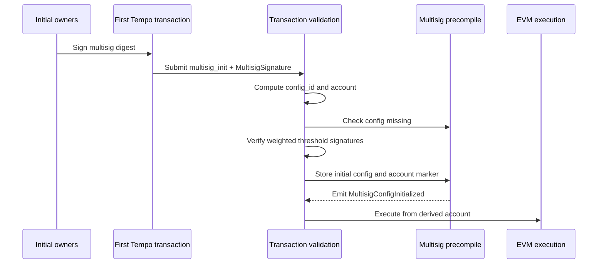
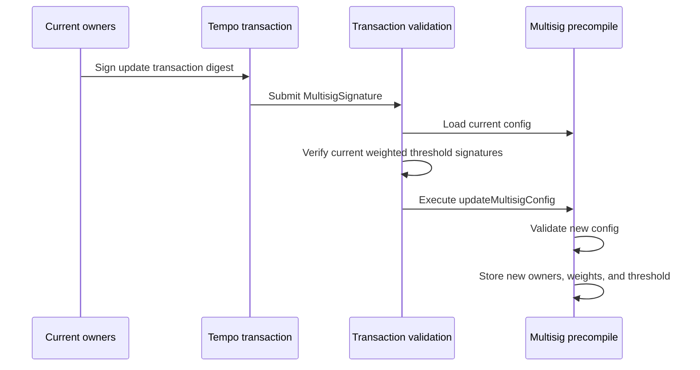

# TIP-1061: Native Multisig Accounts

## Abstract

This TIP adds native multisig accounts as a primary Tempo account type. A multisig account has a stable account address derived from its initial weighted owner config, and transactions from that address are authorized by primitive owner signatures whose configured weights meet the threshold.

## Motivation

Teams, treasuries, validators, and institutional operators need accounts where no single private key can unilaterally move funds or change operational configuration.

Canonical EVM multisigs solve this by routing all account actions through a smart account contract. Tempo has native account and transaction semantics that can provide the same core threshold-control model without requiring a contract wallet deployment.

The canonical EVM multisig pattern is generally a contract account with an owner set, owner weights, and a threshold.

This TIP takes the canonical account model and makes it native to Tempo transaction validation. It keeps the useful EVM pattern of stable account identity plus threshold approval, while leaving modules, guards, fallback handlers, nested contract signers, and onchain proposal storage out of scope.

## Assumptions

- Multisig accounts are primary accounts. They are not access keys, and they do not authorize access keys.
- Multisig owners are Tempo key IDs represented as `address` values derived from existing primitive signature types.
- Each owner has a nonzero weight.
- Owner key IDs are nonzero. Owner key IDs are not required to be valid Tempo primary account addresses.
- Owner approvals use `PrimitiveSignature` only: Secp256k1, P256, or WebAuthn.
- A multisig account has one canonical `config_id`, derived from its initial owner set, owner weights, and threshold. The current owner set, owner weights, and threshold may change, but `config_id` and the account address do not.
- For transaction authorization, the inner digest is `tx.signature_hash()`, which includes the explicit nullable `multisig_init` field and excludes the outer transaction signature as usual.
- AccountKeychain behavior for non-multisig accounts is unchanged.

---

# Specification

## Constants

```rust
/// Tempo signature type byte for native multisig signatures.
pub const SIGNATURE_TYPE_MULTISIG: u8 = 0x05;

/// Domain prefix for native multisig owner approvals.
pub const MULTISIG_SIGNATURE_DOMAIN: &[u8] = b"tempo:multisig:signature";

/// Maximum number of owners allowed in a native multisig config.
pub const MAX_MULTISIG_OWNERS: usize = 10;
```

- `SIGNATURE_TYPE_MULTISIG` is a new Tempo signature type byte in the `TempoSignature` byte-encoding namespace.
- `MULTISIG_SIGNATURE_DOMAIN` is used only inside the owner approval digest. It is distinct from the wire signature type byte.
- `MAX_MULTISIG_OWNERS` bounds verification cost, signature payload size, and owner storage.

## Data Structures

Tempo transactions gain an optional initialization payload:

```rust
/// Tempo transaction payload.
pub struct TempoTransaction {
    // existing fields...

    /// Optional native multisig bootstrap config.
    pub multisig_init: Option<InitMultisig>,
}

/// Initial native multisig config carried by the first transaction.
pub struct InitMultisig {
    /// Minimum total owner weight required to authorize a transaction.
    pub threshold: u32,

    /// Sorted weighted owner list.
    pub owners: Vec<MultisigOwner>,
}

/// Native multisig owner entry.
pub struct MultisigOwner {
    /// Owner key ID derived from a primitive signature type.
    pub owner: Address,

    /// Nonzero owner weight.
    pub weight: u32,
}
```

`TempoSignature` gains a multisig variant:

```rust
/// Tempo transaction signature.
pub enum TempoSignature {
    /// Signature from a primitive account key.
    Primitive(PrimitiveSignature),

    /// Signature from an authorized AccountKeychain access key.
    Keychain(KeychainSignature),

    /// Signature from a native multisig account.
    Multisig(MultisigSignature),
}

/// Native multisig transaction signature.
pub struct MultisigSignature {
    /// Native multisig account address.
    pub account: Address,

    /// Permanent config ID derived from the initial multisig config.
    pub config_id: B256,

    /// Primitive owner signatures over the multisig digest.
    pub signatures: Vec<PrimitiveSignature>,
}
```

Signature rules:

- `signatures` contains primitive owner signatures only.
- Implementations MUST reject any encoding that attempts to place a `KeychainSignature` or `MultisigSignature` inside the owner-signature list.
- `signatures.len()` MUST be between `1` and `MAX_MULTISIG_OWNERS`.
- `TempoSignature::Multisig` is valid only as the outer transaction signature in this TIP.
- A `TempoSignedAuthorization` entry in `tempo_authorization_list` MUST reject `TempoSignature::Multisig`.

Flat M-of-N multisigs are represented by assigning every owner weight `1` and setting `threshold` to `M`.

Weighted configs can express asymmetric authority. For example, a config with `threshold = 100`, one owner with `weight = 100`, and two owners with `weight = 50` allows the high-weight owner alone or both lower-weight owners together to authorize a transaction.

## Transaction Encoding

The Tempo transaction RLP field list is updated to include `multisig_init` as an explicit nullable field:

```text
rlp([
  chain_id,
  max_priority_fee_per_gas,
  max_fee_per_gas,
  gas_limit,
  calls,
  access_list,
  nonce_key,
  nonce,
  valid_before,
  valid_after,
  fee_token,
  fee_payer_signature,
  tempo_authorization_list,
  key_authorization,
  multisig_init
])
```

Encoding rules:

- `key_authorization` and `multisig_init` are fixed fields in the transaction RLP.
- When either field is absent, it is encoded as the RLP empty string (`0x80`).
- When either field is present, it is encoded as its normal RLP list.
- There is no positional union at the end of the transaction.
- This encoding applies at this TIP's protocol activation.
- Pre-activation Tempo transactions retain their historical RLP decoding rules for chain replay and archival decoding.
- Post-activation Tempo transactions MUST include both explicit nullable fields.
- `tx.signature_hash()` MUST include the explicit `multisig_init` field, whether absent or present.
- `tx.fee_payer_signature_hash(sender)` MUST include the explicit `multisig_init` field, whether absent or present.
- `multisig_init` MUST be absent unless the outer transaction signature is `TempoSignature::Multisig` and bootstrap validation applies.

`InitMultisig` is encoded as `rlp([threshold, owners])`. `MultisigOwner` is encoded as `rlp([owner, weight])`.

RLP fields use canonical RLP integer encoding. This applies to `threshold` and `weight` in the transaction wire format.

## Signature Encoding

The multisig signature wire encoding is:

```text
0x05 || rlp([account, config_id, signatures])
```

`signatures` is an RLP list of byte strings. Each byte string is one owner approval encoded with the existing `PrimitiveSignature` byte encoding.

## Multisig Identity

The initial multisig configuration determines a permanent `config_id`:

```text
config_id = keccak256(
  "tempo:multisig:config" ||
  uint32(threshold) ||
  owners[0].owner ||
  uint32(owners[0].weight) ||
  owners[1].owner ||
  uint32(owners[1].weight) ||
  ...
)
```

Config hash rules:

- `owners` MUST be sorted in strictly ascending `owner` address order before hashing.
- Duplicate owners, zero owner addresses, and zero owner weights are invalid.

Fixed-width integer fields included in the `config_id` hash input use fixed-width big-endian unsigned byte encoding, not RLP integer encoding. For example, `uint32` is encoded as 4 bytes.

The multisig account address is derived from the `config_id`:

```text
account = address(keccak256(
  "tempo:multisig:account" ||
  config_id
)[12:32])
```

Derived account rules:

- The derived account MUST be a valid Tempo primary account address.
- The derived account MUST NOT be the zero address.
- The derived account MUST NOT be a native precompile address.
- The derived account MUST NOT be a TIP-20 token address.
- The derived account MUST NOT be a virtual address.

The derived account address is stable. Owner, weight, and threshold updates mutate the current config stored for the account, but they do not change `config_id` or `account`.

## Owner Approval Digest

Owners sign a multisig-specific digest derived from an inner digest that is already replay-protected by the protocol surface being authorized:

```text
multisig_digest = keccak256(
  MULTISIG_SIGNATURE_DOMAIN ||
  inner_digest ||
  account ||
  config_id
)
```

For transaction authorization in this TIP, `inner_digest` is `tx.signature_hash()`.

This binding prevents an owner signature from being replayed as a primitive account authorization, a keychain inner signature, or a multisig authorization for a different account, config, or inner digest.

Owner approval rules:

- Each `PrimitiveSignature` in `MultisigSignature.signatures` MUST verify against `multisig_digest`.
- For transaction authorization, `multisig_digest` uses `tx.signature_hash()`, `signature.account`, and `signature.config_id`.
- Verification derives the owner address from the primitive signature using the existing Secp256k1, P256, or WebAuthn recovery rules.
- Recovered owner addresses MUST be strictly ascending.
- Strict ordering rejects duplicates and makes weighted threshold accounting deterministic.

## Transaction Sender and Multisig Authorization

Native multisig signatures separate EVM transaction sender recovery from account authorization.

Sender recovery is stateless.

For `TempoSignature::Multisig`, sender recovery rules are:

1. parsing `MultisigSignature`
2. requiring `signature.account == derive_multisig_account(signature.config_id)`
3. requiring `signature.signatures.len()` is between `1` and `MAX_MULTISIG_OWNERS`
4. computing `multisig_digest` using `tx.signature_hash()`, `signature.account`, and `signature.config_id`
5. verifying each primitive owner signature over that digest
6. requiring recovered owner addresses are strictly ascending
7. failing sender recovery if any of these checks fail
8. returning `signature.account` as the recovered transaction sender

This recovered sender only identifies the account that the transaction attempts to execute from. It does not prove that the transaction is authorized by the multisig account.

Multisig authorization is stateful. Before the transaction enters EVM execution, the protocol:

1. MUST load the current multisig config or validate `tx.multisig_init` during bootstrap
2. MUST require the recovered owner weights to meet the threshold

After multisig authorization succeeds, the transaction executes from `signature.account`. Top-level EVM calls observe `tx.origin == signature.account` and `msg.sender == signature.account`. Nested calls follow normal EVM call semantics.

## Multisig Precompile Storage

The native multisig account precompile stores the current config for each native multisig account:

```text
multisig_configs[account][config_id] = MultisigConfig {
  threshold,
  owners
}

multisig_accounts[account] = true
```

Storage rules:

- `owners` MUST be stored in strictly ascending `owner` address order.
- Each stored owner includes both a nonzero `owner` address and a nonzero `weight`.
- A stored config exists when `threshold != 0`.
- Configs with `threshold == 0` are invalid and MUST NOT be created.

`multisig_accounts[account]` is an account marker exposed by the native multisig account precompile for other protocol components. The marker is set when the initial config is stored and is not cleared by config updates.

Weight accounting rules:

- The sum of owner weights MUST be computed using an integer type wide enough to avoid overflow.
- Implementations MUST reject any config where `threshold` is greater than the total configured owner weight.

## Bootstrap

A first transaction from a native multisig account initializes the stored config.

Bootstrap validation applies when the transaction signature is `TempoSignature::Multisig` and no config exists for `(signature.account, signature.config_id)`.

Validation rules:

1. require `tx.multisig_init` is present
2. validate `signature.signatures.len()` is between `1` and `MAX_MULTISIG_OWNERS`
3. validate `multisig_init.owners` is non-empty
4. validate `multisig_init.owners.len() <= MAX_MULTISIG_OWNERS`
5. validate `multisig_init.threshold >= 1`
6. validate every owner address is nonzero
7. validate every owner weight is nonzero
8. validate `multisig_init.threshold <= sum(multisig_init.owners.weight)`
9. validate `multisig_init.owners` is strictly ascending by `owner`
10. compute `expected_config_id` from `multisig_init`
11. require `signature.config_id == expected_config_id`
12. derive `expected_account` from `expected_config_id`
13. validate `expected_account` is a valid Tempo primary account address
14. require `signature.account == expected_account`
15. compute `multisig_digest` using `tx.signature_hash()`, `signature.account`, and `signature.config_id`
16. verify each primitive owner signature over that digest
17. require recovered owner addresses are strictly ascending
18. require every recovered owner is in `multisig_init.owners`
19. sum the configured weights for the recovered owners
20. require the recovered owner weight sum is at least `multisig_init.threshold`
21. store `multisig_init` as the current config for `(signature.account, signature.config_id)`
22. set `multisig_accounts[signature.account] = true`
23. emit `MultisigConfigInitialized`
24. commit the initial config, account marker, and initialization event as transaction-level state
25. execute the transaction from `signature.account`

Bootstrap state effects:

- The initial config write is part of transaction pre-execution, not part of the EVM call frame.
- Once bootstrap validation succeeds and the transaction is included, the initial config remains even if the subsequent EVM call execution reverts.
- `MultisigConfigInitialized` also remains when the subsequent EVM call execution reverts.
- If bootstrap validation fails, the transaction is invalid and the config MUST NOT be written.



## Normal Transaction Validation

Normal validation applies when a config exists for `(signature.account, signature.config_id)`.

Validation rules:

1. require `tx.multisig_init` is absent
2. require `signature.signatures.len()` is between `1` and `MAX_MULTISIG_OWNERS`
3. require `signature.account == derive_multisig_account(signature.config_id)`
4. require `signature.account` is a valid Tempo primary account address
5. load the stored config for `(signature.account, signature.config_id)`
6. compute `multisig_digest` using `tx.signature_hash()`, `signature.account`, and `signature.config_id`
7. verify each primitive owner signature over that digest and recover the owner address
8. require recovered owner addresses are strictly ascending
9. require every recovered owner is in the current owner set
10. sum the current configured weights for the recovered owners
11. require the recovered owner weight sum is at least the current threshold
12. authorize execution from `signature.account`

The transaction executes with `tx.from`, `tx.origin`, and top-level `msg.sender` equal to `signature.account`. Nested calls follow normal EVM call semantics.

## Gas Accounting

TODO: specify gas accounting before this TIP moves out of Draft.

The final gas schedule should cover:

1. normal multisig transaction validation
2. bootstrap validation
3. primitive owner signature verification
4. config reads and writes
5. native multisig account marker reads and writes
6. `IMultisigAccount` precompile calls
7. storage-creating state gas under the active Tempo gas schedule

## AccountKeychain Restrictions

Native multisig accounts do not support access keys.

Transaction rule:

- A transaction with `TempoSignature::Multisig` MUST NOT include `key_authorization`.
- A multisig transaction with `key_authorization` is invalid.

AccountKeychain mutator rules:

- The AccountKeychain precompile MUST reject mutating calls where `multisig_accounts[msg.sender] == true`.
- The check is against `msg.sender`.
- The check MUST NOT depend on `tx.origin` or the outer transaction signature type.

This includes:

- `authorizeKey`
- `revokeKey`
- `updateSpendingLimit`
- `setAllowedCalls`
- `removeAllowedCalls`

Read-only behavior:

- Read-only AccountKeychain calls MAY continue to return empty or missing key state for multisig accounts.
- This matches existing behavior for accounts with no access keys.

### Rationale

The current AccountKeychain model is a poor fit for multisig accounts because it lets a single authorized key make calls as the parent account. For a multisig account, that would turn one primitive key into a standing ability to act as the multisig address within whatever scope was authorized.

Scope checks can restrict top-level targets, selectors, and limited TIP-20 recipients. They cannot make downstream contracts distinguish a quorum-approved multisig transaction from a single-key transaction bound to the multisig `msg.sender`.

Access keys bound to the multisig `msg.sender` also create durable side effects under the parent account's identity. If such a key grants a role, creates an approval, joins a vault, or mutates application state, that state belongs to the multisig account.

Revoking the access key does not revoke those external permissions or unwind application state.

Keeping access keys out of this TIP preserves the multisig account as a quorum-controlled identity. Future access key support requires a separate design where a single primitive key cannot impersonate the multisig account's `msg.sender`.

## Multisig Account Precompile

The native multisig account precompile exposes current config reads and config updates. The precompile address is assigned before this TIP moves out of Draft.

```solidity
interface IMultisigAccount {
    /// @notice Native multisig owner and weight.
    /// @param owner Owner key ID.
    /// @param weight Nonzero owner weight.
    struct MultisigOwner {
        address owner;
        uint32 weight;
    }

    /// @notice Current native multisig config.
    /// @param threshold Minimum total owner weight required.
    /// @param owners Sorted owner key IDs and weights.
    struct MultisigConfig {
        uint32 threshold;
        MultisigOwner[] owners;
    }

    /// @notice Returns the current config for a native multisig account.
    /// @param account The multisig account address.
    /// @param configId The permanent config ID derived from the initial config.
    /// @return config The stored config. Returns threshold 0 and an empty owner list when no config exists.
    function getMultisigConfig(
        address account,
        bytes32 configId
    ) external view returns (MultisigConfig memory config);

    /// @notice Returns whether account has initialized a native multisig config.
    /// @param account The account address to check.
    /// @return isMultisig True when account is marked as a native multisig account.
    function isMultisigAccount(
        address account
    ) external view returns (bool isMultisig);

    /// @notice Replaces the current owner set and threshold for msg.sender.
    /// @dev Authorization comes from the outer multisig transaction signature.
    /// @dev Reverts if configId does not resolve to msg.sender.
    /// @dev Reverts if the current config does not exist.
    /// @dev Reverts if owners is empty, too long, unsorted, duplicated, or contains a zero owner or zero weight.
    /// @dev Reverts if threshold is zero or greater than the total owner weight.
    /// @param configId The permanent config ID for msg.sender.
    /// @param threshold The new threshold. Must be between 1 and the total owner weight.
    /// @param owners The new sorted owner key IDs and weights.
    function updateMultisigConfig(
        bytes32 configId,
        uint32 threshold,
        MultisigOwner[] calldata owners
    ) external;

    /// @notice Emitted when the initial native multisig config is stored.
    /// @param account The native multisig account address.
    /// @param configId The permanent config ID for account.
    /// @param threshold The configured threshold.
    /// @param owners The configured sorted owner key IDs and weights.
    event MultisigConfigInitialized(
        address indexed account,
        bytes32 indexed configId,
        uint32 threshold,
        MultisigOwner[] owners
    );

    /// @notice Emitted when the current native multisig config is replaced.
    /// @param account The native multisig account address.
    /// @param configId The permanent config ID for account.
    /// @param threshold The new threshold.
    /// @param owners The new sorted owner key IDs and weights.
    event MultisigConfigUpdated(
        address indexed account,
        bytes32 indexed configId,
        uint32 threshold,
        MultisigOwner[] owners
    );

    /// @notice The requested config does not exist.
    error ConfigNotFound();

    /// @notice The account is not the account derived from configId.
    error InvalidAccount();

    /// @notice The threshold is zero or greater than total owner weight.
    error InvalidThreshold();

    /// @notice An owner key ID is the zero address.
    error InvalidOwner();

    /// @notice An owner weight is zero.
    error InvalidWeight();

    /// @notice The owner list exceeds MAX_MULTISIG_OWNERS.
    error TooManyOwners();

    /// @notice The owner list contains a duplicate owner key ID.
    error DuplicateOwner();

    /// @notice The owner list is not sorted in strictly ascending owner order.
    error InvalidOwnerOrder();
}
```

`updateMultisigConfig` validation rules:

1. require a config exists for `(msg.sender, configId)`
2. require `msg.sender == derive_multisig_account(configId)`
3. validate `owners` is non-empty
4. validate `owners.length <= MAX_MULTISIG_OWNERS`
5. validate every owner address is nonzero
6. validate every owner weight is nonzero
7. validate `1 <= threshold <= sum(owners.weight)`
8. validate `owners` is strictly ascending by `owner`
9. replace the stored current config under the same `(msg.sender, configId)`
10. emit `MultisigConfigUpdated`

Additional update rules:

- Authorization for `updateMultisigConfig` is provided by the outer transaction signature.
- The precompile MUST NOT accept an additional signature parameter for config updates.
- Replacing the stored config MUST remove any previous owner entry that is not present in the new `owners` list.
- Multisig transactions after a successful update MUST be authorized only against the new stored owner set, weights, and threshold.
- `updateMultisigConfig` MUST be called directly by the native multisig account.
- A nested call where an intermediate contract is `msg.sender` MUST fail because `msg.sender != derive_multisig_account(configId)`.
- `MultisigConfigUpdated` is emitted during EVM execution.
- If the `updateMultisigConfig` call reverts, the config update and event revert with the call frame.



## Compatibility

- Existing primitive and keychain signatures remain valid and unchanged.
- Tempo transaction RLP encoding changes at this TIP's protocol activation because `key_authorization` and `multisig_init` become explicit nullable fields.
- This change is part of the transaction and fee payer signing payloads.
- This change updates `tx.signature_hash()` and `tx.fee_payer_signature_hash(sender)` for post-activation transactions.
- Existing non-multisig accounts remain eligible for AccountKeychain access keys.
- This TIP changes AccountKeychain behavior only for accounts where `multisig_accounts[account] == true`.
- Native multisig accounts use derived account addresses.
- Existing EOAs cannot be upgraded in place to native multisig accounts under this TIP.
- Any migration from an EOA to a multisig account requires moving assets or account-level state through existing application flows.
- This TIP reserves multisig access key support for a future design and explicitly rejects multisig key authorization in the current protocol.

# Invariants

1. **Stable identity.** Every accepted multisig transaction MUST satisfy `signature.account == derive_multisig_account(signature.config_id)`. `updateMultisigConfig` MUST NOT change `config_id` or the derived account address.

2. **Bootstrap exclusivity.** A missing config for `(signature.account, signature.config_id)` MUST require `multisig_init`, and an existing config for `(signature.account, signature.config_id)` MUST reject `multisig_init`.

3. **Config validity.** Every stored config MUST have `1 <= owners.len() <= MAX_MULTISIG_OWNERS`, strictly ascending unique nonzero owners, nonzero owner weights, and `1 <= threshold <= sum(owners.weight)`.

4. **Owner signature validity.** Every owner approval MUST be a `PrimitiveSignature` over `multisig_digest`. Encoded `KeychainSignature` and nested `MultisigSignature` owner approvals MUST be rejected.

5. **Owner set membership.** Recovered owner addresses MUST be strictly ascending, and every recovered owner MUST be present in the current stored owner set.

6. **Threshold enforcement.** A multisig transaction MUST be rejected unless the current configured weights of valid recovered owners sum to at least the current threshold.

7. **No access keys.** A transaction with `TempoSignature::Multisig` MUST be rejected when `key_authorization` is present. AccountKeychain mutating calls MUST reject when `multisig_accounts[msg.sender] == true`.

8. **Config update authority.** `updateMultisigConfig` MUST reject unless `msg.sender == derive_multisig_account(configId)`. Config updates MUST NOT accept an additional signature parameter.

## Test Cases

### Bootstrap

- Accept a first multisig transaction with valid `multisig_init`, derived `config_id`, derived account, and weighted threshold owner signatures.
- Reject bootstrap when `signature.config_id` does not match `multisig_init`.
- Reject bootstrap when `signature.config_id` was computed without owner weights.
- Reject bootstrap when `signature.account` does not match the derived account.
- Reject bootstrap when the derived account is not a valid Tempo primary account address.
- Reject bootstrap with empty owners.
- Reject bootstrap with more than `MAX_MULTISIG_OWNERS` owners.
- Reject bootstrap with duplicate or unsorted owners.
- Reject bootstrap with zero owner address.
- Reject bootstrap with zero owner weight.
- Reject bootstrap with threshold 0 or threshold greater than total owner weight.
- Reject bootstrap with zero owner signatures.
- Reject bootstrap with more than `MAX_MULTISIG_OWNERS` owner signatures.
- Reject bootstrap with duplicate recovered signers.
- Reject bootstrap with unsorted recovered signers.
- Reject bootstrap with non-owner signers.
- Reject bootstrap with insufficient valid signature weight.
- Reject bootstrap owner signatures that verify against the wrong inner digest, account, or `config_id`.
- Preserve the stored initial config, native multisig account marker, and initialization event when bootstrap validation succeeds but the subsequent EVM call reverts.
- Do not write the initial config, native multisig account marker, or initialization event when bootstrap validation fails.

### Normal Transactions

- Accept a normal multisig transaction with current weighted threshold signatures.
- Accept one high-weight signer when that signer's configured weight meets the threshold.
- Accept multiple lower-weight signers when their combined configured weight meets the threshold.
- Reject a normal multisig transaction that includes `multisig_init`.
- Reject a normal multisig transaction when no config exists and `multisig_init` is absent.
- Reject duplicate signers through strict recovered-signer ordering.
- Reject unsorted recovered signers.
- Reject zero owner signatures.
- Reject more than `MAX_MULTISIG_OWNERS` owner signatures.
- Reject non-owner signers.
- Reject below-threshold signature weight.
- Reject owner signatures that verify against the wrong inner digest, account, or `config_id`.

### Gas Accounting

- TODO: add gas accounting tests once the gas schedule is finalized.

### Config Updates

- Accept `updateMultisigConfig` when the outer transaction is signed by the current weighted threshold.
- Preserve `config_id` and account address after an update.
- Confirm removed owners cannot authorize transactions after an update.
- Reject updates with empty owners.
- Reject updates with too many owners.
- Reject updates with zero owner address.
- Reject updates with zero owner weight.
- Reject updates with invalid threshold.
- Reject updates with threshold greater than total owner weight.
- Reject updates with duplicate or unsorted owners.
- Reject direct `updateMultisigConfig` calls from non-multisig accounts.
- Reject nested `updateMultisigConfig` calls where `msg.sender` is an intermediate contract.
- Revert `MultisigConfigUpdated` when the `updateMultisigConfig` call reverts.

### Access Key Exclusions

- Reject a multisig transaction that carries `key_authorization`.
- Reject AccountKeychain mutators when `msg.sender` is a native multisig account.
- Reject AccountKeychain mutators during a bootstrap transaction after the native multisig account marker is set.
- Confirm existing AccountKeychain behavior is unchanged for primitive and keychain accounts.

### Transaction Encoding

- Accept a transaction encoded with explicit nullable `key_authorization` and `multisig_init` fields.
- Reject a transaction that omits the explicit `multisig_init` field after activation.
- Reject a primitive or keychain transaction that includes `multisig_init`.
- Confirm `tx.signature_hash()` changes when `multisig_init` changes.
- Confirm `tx.fee_payer_signature_hash(sender)` changes when `multisig_init` changes.
- Confirm a transaction with absent `key_authorization` and present `multisig_init` cannot be decoded as a key authorization transaction.

### Owner Signature Types

- Accept Secp256k1 owner signatures.
- Accept P256 owner signatures.
- Accept WebAuthn owner signatures.
- Reject Keychain owner signatures.
- Reject nested Multisig owner signatures.
- Reject `TempoSignature::Multisig` inside `tempo_authorization_list`.
