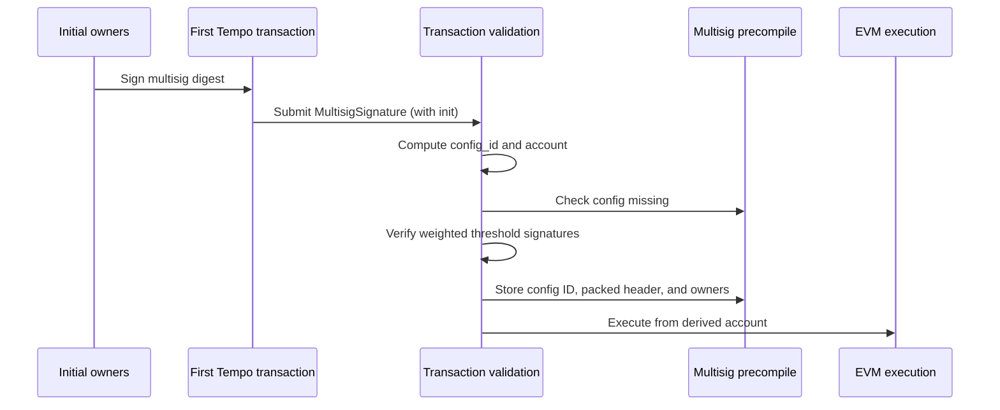
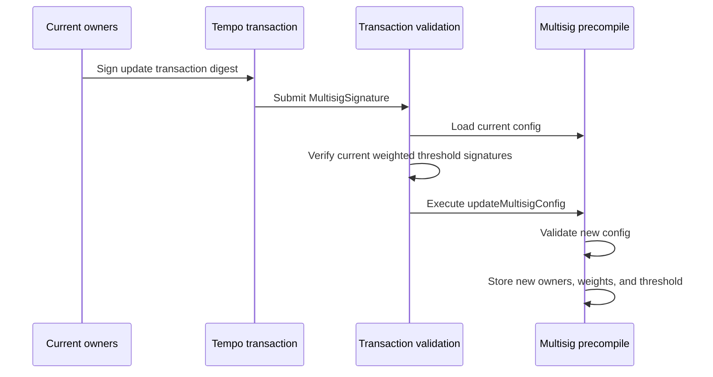

# TIP-1061: Native Multisig Accounts

## Abstract

This TIP adds native multisig accounts as a primary Tempo account type. A multisig account has a stable account address derived from its initial weighted owner config and a caller-chosen salt, and transactions from that address are authorized by primitive owner signatures whose configured weights meet the threshold.

## Motivation

Teams, treasuries, validators, and institutional operators need accounts where no single private key can unilaterally move funds or change operational configuration.

Canonical EVM multisigs are generally contract accounts with an owner set, owner weights, and a threshold. Tempo can provide the same core threshold-control model through native account and transaction validation, without requiring a contract wallet deployment.

## Specification

The key words "MUST", "MUST NOT", "REQUIRED", "SHALL", "SHALL NOT", "SHOULD", "SHOULD NOT", "RECOMMENDED", "NOT RECOMMENDED", "MAY", and "OPTIONAL" in this document are to be interpreted as described in RFC 2119 and RFC 8174.

### Constants

```rust
/// Tempo signature type byte for native multisig signatures.
pub const SIGNATURE_TYPE_MULTISIG: u8 = 0x05;

/// Domain prefix for native multisig owner approvals.
pub const MULTISIG_SIGNATURE_DOMAIN: &[u8] = b"tempo:multisig:signature";

/// Maximum number of owners allowed in a native multisig config.
pub const MAX_MULTISIG_OWNERS: usize = 10;

/// Maximum encoded byte length for one primitive owner approval.
pub const MAX_MULTISIG_OWNER_SIGNATURE_BYTES: usize = 2049;
```

- `SIGNATURE_TYPE_MULTISIG` is a new Tempo signature type byte in the `TempoSignature` byte-encoding namespace.
- `MULTISIG_SIGNATURE_DOMAIN` is used only inside the owner approval digest. It is distinct from the wire signature type byte.
- `MAX_MULTISIG_OWNERS` bounds verification cost, signature payload size, and owner storage.
- `MAX_MULTISIG_OWNER_SIGNATURE_BYTES` matches the current maximum encoded `PrimitiveSignature` length.

### Data Structures

The Tempo transaction payload is unchanged by this TIP. The native multisig bootstrap config is
not a transaction field; it is carried inside the multisig signature (see below).

```rust
/// Initial native multisig config carried inside the bootstrap signature.
pub struct InitMultisig {
    /// Caller-chosen salt mixed into the permanent `config_id`. Allows the same owner set to derive
    /// distinct multisig accounts for different purposes.
    pub salt: B256,

    /// Minimum total owner weight required to authorize a transaction.
    pub threshold: u32,

    /// Sorted weighted owner list.
    pub owners: Vec<MultisigOwner>,
}

/// Native multisig owner entry.
pub struct MultisigOwner {
    /// Owner key ID derived from a primitive signature.
    pub owner: Address,

    /// Nonzero owner weight.
    pub weight: u32,
}
```

`TempoSignature` gains a multisig variant:

```rust
/// Tempo transaction signature.
pub enum TempoSignature {
    /// Signature from a primitive account key.
    Primitive(PrimitiveSignature),

    /// Signature from an authorized AccountKeychain access key.
    Keychain(KeychainSignature),

    /// Signature from a native multisig account.
    Multisig(MultisigSignature),
}

/// Native multisig transaction signature.
pub struct MultisigSignature {
    /// Native multisig account address.
    pub account: Address,

    /// Permanent config ID derived from the initial multisig config.
    pub config_id: B256,

    /// Encoded primitive owner signatures over the multisig digest.
    pub signatures: Vec<Bytes>,

    /// Initial native multisig config for bootstrapping this account. Present only on the first
    /// transaction from a derived account; absent on every subsequent transaction.
    pub init: Option<InitMultisig>,
}
```

Signature rules:

- `signatures` contains encoded primitive owner signatures only.
- Stateful validation MUST decode each owner signature byte string as `PrimitiveSignature`.
- Implementations MUST reject any owner signature byte string that decodes as `KeychainSignature` or `MultisigSignature`.
- `signatures.len()` MUST be between `1` and `MAX_MULTISIG_OWNERS`.
- Each owner signature byte string length MUST be less than or equal to `MAX_MULTISIG_OWNER_SIGNATURE_BYTES`.
- `init` is present only when bootstrapping a native multisig account. It carries the initial
  `InitMultisig` config and is absent on every post-bootstrap transaction.
- When `init` is present, it MUST derive `signature.config_id` and `signature.account`. That is,
  `derive_multisig_config_id(init) == signature.config_id` and
  `derive_multisig_account(signature.config_id) == signature.account`.

Flat M-of-N multisigs are represented by assigning every owner weight `1` and setting `threshold` to `M`.

Weighted configs can express asymmetric authority. For example, a config with `threshold = 100`, one owner with `weight = 100`, and two owners with `weight = 50` allows the high-weight owner alone or both lower-weight owners together to authorize a transaction.

### Transaction Encoding

This TIP does not add any transaction field. The Tempo transaction RLP field list is unchanged, and
`key_authorization` remains the only trailing optional slot:

```text
rlp([
  chain_id,
  max_priority_fee_per_gas,
  max_fee_per_gas,
  gas_limit,
  calls,
  access_list,
  nonce_key,
  nonce,
  valid_before,
  valid_after,
  fee_token,
  fee_payer_signature,
  tempo_authorization_list,
  key_authorization,
])
```

The native multisig bootstrap config is **not** a transaction field. It is carried inside the
multisig signature as `MultisigSignature.init` (see Signature Encoding), which is appended after the
transaction body and is therefore **not** covered by `tx.signature_hash()`.

Signing payload rules:

- `tx.signature_hash()` is computed over the canonical transaction RLP encoding defined above, exactly
  as in the pre-activation format. This TIP does not change `tx.signature_hash()` for any transaction.
- `tx.fee_payer_signature_hash(sender)` is computed the same way, substituting `sender` for `fee_payer_signature` per existing fee-payer rules.
- Because `init` lives in the signature, bootstrapping does not change the transaction or fee-payer
  signing payloads. `init` is instead bound to the owner approvals through `config_id` (see Owner
  Approval Digest and Multisig Identity).

Activation rules:

- Before this TIP activates, `TempoSignature::Multisig` MUST be rejected.
- At and after activation, signature type byte `0x05` is decoded as `TempoSignature::Multisig`.

### Signature Encoding

The multisig signature wire encoding is:

```text
0x05 || rlp([account, config_id, signatures, init])
```

`signatures` is an RLP list of byte strings. Each byte string is one owner approval encoded with the existing `PrimitiveSignature` byte encoding.

`init` is the optional bootstrap config and is the last element of the list:

- When bootstrapping, `init` is the `InitMultisig` config, encoded as `rlp([salt, threshold, owners])`.
- When not bootstrapping, `init` is the canonical RLP empty string (`EMPTY_STRING_CODE`, `0x80`).
- `MultisigOwner` is encoded as `rlp([owner, weight])`.
- `salt` is encoded as a 32-byte fixed-width RLP string.
- RLP integer fields use canonical RLP integer encoding. This applies to `threshold` and `weight`.

`init` decoding rules:

- After decoding `signatures`, if no payload remains, `init` is absent.
- If the next byte is `EMPTY_STRING_CODE` (`0x80`), `init` is absent and the byte is consumed.
- Otherwise the remaining payload MUST decode as a single `InitMultisig` list.
- Any bytes remaining after `init` MUST be rejected.
- The canonical encoding of an absent `init` is the `0x80` placeholder. Implementations MAY accept a
  payload that ends immediately after `signatures` for backward compatibility, but MUST encode the
  `0x80` placeholder.

Owner approval byte strings use the same encoding and size limits as existing Tempo primitive signatures.

The largest valid owner approval is a WebAuthn primitive signature. Its encoded byte length is `MAX_MULTISIG_OWNER_SIGNATURE_BYTES`.

Decoding rules:

- Each owner approval MUST decode as a valid `PrimitiveSignature`.
- Implementations MUST NOT infer owner approval validity from the first byte before `PrimitiveSignature` decoding.
- Secp256k1 owner approvals MUST use the existing Secp256k1 primitive signature encoding.
- P256 owner approvals MUST use the existing P256 primitive signature encoding and size limit.
- WebAuthn owner approvals MUST use the existing WebAuthn primitive signature encoding and size limits.
- Malformed or oversized owner approval byte strings MUST be rejected before threshold accounting.
- `MAX_MULTISIG_OWNERS` limits owner count, not per-signature byte size.

### Multisig Identity

The initial multisig configuration determines a permanent `config_id`. The `config_id` identifies the account's initial identity, not the current config version.

```text
config_id = keccak256(
  "tempo:multisig:config" ||
  salt ||
  uint32(threshold) ||
  uint32(owners.len()) ||
  owners[0].owner ||
  uint32(owners[0].weight) ||
  owners[1].owner ||
  uint32(owners[1].weight) ||
  ...
)
```

Config hash rules:

- A `config_id` equal to `bytes32(0)` is invalid.
- `salt` is part of `config_id`. The same `(threshold, owners)` with different `salt` values MUST derive distinct `config_id` values and distinct accounts.
- `salt` MAY be any 32-byte value, including `bytes32(0)`.
- `owners` MUST be sorted in strictly ascending `owner` address order before hashing.
- Duplicate owner addresses, zero owner addresses, and zero owner weights are invalid.
- `owners.len()` is part of `config_id`.
- Owner uniqueness is by `owner` address.

Fixed-width integer fields included in the `config_id` hash input use fixed-width big-endian unsigned byte encoding, not RLP integer encoding. For example, `uint32` is encoded as 4 bytes.

Domain string literals in multisig derivations are encoded as the exact ASCII bytes shown, with no length prefix.

The multisig account address is derived from the `config_id`:

```text
account = address(keccak256(
  "tempo:multisig:account" ||
  config_id
)[12:32])
```

Identity derivation rules:

- `config_id` derivation does not include `chain_id`.
- Account derivation does not include `chain_id`.
- The same `(salt, threshold, owners)` triple derives the same multisig account address across Tempo chains.

Derived account rules:

- The derived account MUST be a valid Tempo primary account address.
- The derived account MUST NOT be the zero address.
- The derived account MUST NOT be a native precompile address.
- The derived account MUST NOT be a TIP-20 token address.
- The derived account MUST NOT be a virtual address.

Bootstrap claims unused derived account state. The derived account MAY have a nonzero balance before bootstrap, but it MUST otherwise be empty.

Bootstrap account-state rules:

- `nonce` MUST be zero.
- code MUST be empty.
- EIP-7702 delegation code MUST be absent.
- balance MAY be nonzero.

These checks apply only to native account state. External contract balances, roles, approvals, and pending ownership assignments for the derived address remain valid after bootstrap.

Funds sent to an uninitialized derived multisig address can be claimed by any transaction that provides the matching initial config and valid threshold owner approvals.

The derived account address is stable. Owner, weight, and threshold updates mutate the current config stored for the account, but they do not change `config_id` or `account`.

### Owner Approval Digest

Owners sign a multisig-specific digest derived from an inner digest that is already replay-protected by the protocol surface being authorized:

```text
multisig_digest = keccak256(
  MULTISIG_SIGNATURE_DOMAIN ||
  inner_digest ||
  account ||
  config_id
)
```

For transaction authorization in this TIP, `inner_digest` is `tx.signature_hash()`.

Digest encoding rules:

- `MULTISIG_SIGNATURE_DOMAIN` is encoded as the exact ASCII bytes `tempo:multisig:signature`, with no length prefix.
- `inner_digest` is encoded as 32 bytes.
- `account` is encoded as 20 bytes.
- `config_id` is encoded as 32 bytes.
- The digest input is raw byte concatenation, not RLP or ABI encoding.

This binding prevents an owner signature from being replayed as a primitive account authorization, a keychain inner signature, or a multisig authorization for a different account, config, or inner digest.

Transaction owner approvals are chain-specific because `tx.signature_hash()` includes `chain_id`.

Sponsored transaction rules:

- `tx.signature_hash()` follows existing Tempo sponsored transaction signing semantics.
- When `fee_payer_signature` is absent, owner approvals commit to `fee_token`.
- When `fee_payer_signature` is absent, the multisig account pays fees under existing sender-pays fee semantics.
- When `fee_payer_signature` is present, owner approvals commit to sponsored execution but not to `fee_token`, fee payer address, or exact fee payer signature.
- The fee payer separately signs `tx.fee_payer_signature_hash(signature.account)`.
- The fee payer signature commits to `fee_token` and the multisig account as sender.
- Adding or removing `fee_payer_signature` changes `tx.signature_hash()` and invalidates existing owner approvals.

Owner approval rules:

- Each owner signature byte string in `MultisigSignature.signatures` MUST decode as `PrimitiveSignature`.
- Each decoded `PrimitiveSignature` MUST verify against `multisig_digest`.
- For transaction authorization, `multisig_digest` uses `tx.signature_hash()`, `signature.account`, and `signature.config_id`.
- Verification derives the owner address from the decoded `PrimitiveSignature`.
- P256 owner approvals use the existing `PrimitiveSignature::P256` `pre_hash` semantics when verifying `multisig_digest`.
- For WebAuthn owner approvals, the WebAuthn challenge MUST be `multisig_digest`.
- Owner membership is checked against the recovered owner address.
- The configured owner set does not bind an owner to a primitive signature type; any valid primitive signature that recovers a configured owner address can authorize that owner's weight.
- Recovered owner addresses MUST be strictly ascending.
- Strict ordering rejects duplicates and makes weighted threshold accounting deterministic.

### Transaction Sender and Multisig Authorization

Native multisig signatures separate EVM transaction sender recovery from account authorization.

Sender recovery is stateless.

For `TempoSignature::Multisig`, sender recovery rules are:

1. parsing `MultisigSignature`
2. requiring `signature.config_id != bytes32(0)`
3. requiring `signature.account == derive_multisig_account(signature.config_id)`
4. requiring `signature.signatures.len()` is between `1` and `MAX_MULTISIG_OWNERS`
5. requiring each owner approval byte string length is less than or equal to `MAX_MULTISIG_OWNER_SIGNATURE_BYTES`
6. when `signature.init` is present, requiring `derive_multisig_config_id(signature.init) == signature.config_id` and `derive_multisig_account(signature.config_id) == signature.account`
7. failing sender recovery if any of these checks fail
8. returning `signature.account` as the recovered transaction sender

This recovered sender only identifies the account that the transaction attempts to execute from. It does not prove that the transaction is authorized by the multisig account.

Before stateful multisig validation succeeds, the recovered sender MUST be treated only as an attempted sender.

Sender recovery MAY inspect owner approval byte string lengths. It MUST NOT decode, verify, or recover owner signatures, and it MUST NOT load multisig config state.

Multisig authorization is stateful. Before the transaction enters EVM execution, the protocol:

1. MUST load the current multisig config or validate `signature.init` during bootstrap
2. MUST require the recovered owner weights to meet the threshold

After multisig authorization succeeds, the transaction executes from `signature.account`. Top-level EVM calls observe `tx.from == signature.account`, `tx.origin == signature.account`, and `msg.sender == signature.account`.

Sponsored multisig transactions follow existing Tempo fee payer semantics; the executing account remains `signature.account`.

Native multisig sender restriction:

- After sender recovery for any transaction signature type, if `multisig_config_ids[recovered_sender] != bytes32(0)`, the outer signature MUST be `TempoSignature::Multisig` or `TempoSignature::Keychain`.
- Primitive outer signatures MUST NOT authorize execution from a native multisig account.
- Keychain outer signatures from a native multisig account are authorized by existing AccountKeychain validation: the recovered access key MUST be active for the account, and the transaction is subject to that key's expiry, spending limits, and call scopes (see Access Keys).
- The fee payer signature path MUST NOT accept `TempoSignature::Multisig`.
- For any transaction with `fee_payer_signature`, if `multisig_config_ids[recovered_fee_payer] != bytes32(0)`, validation MUST reject the transaction.
- Native multisig accounts MUST NOT have EVM bytecode or EIP-7702 delegation code installed after bootstrap.

### Multisig Precompile Storage

The native multisig account precompile stores the current config for each native multisig account:

```text
multisig_config_ids[account] = config_id

multisig_config_headers[account][config_id] = MultisigConfigHeader {
  threshold,
  owner_count
}

multisig_config_owners[account][config_id][index] = MultisigOwner {
  owner,
  weight
}
```

Storage rules:

- `multisig_config_ids[account]` stores the account's canonical `config_id` and is the native multisig marker.
- `multisig_config_ids[account] == bytes32(0)` means `account` is not initialized as a native multisig account.
- `multisig_config_ids[account] != bytes32(0)` means `account` is initialized as a native multisig account.
- `owners` MUST be stored in strictly ascending `owner` address order.
- Each stored owner includes a nonzero `owner` address and a nonzero `weight`.
- The same owner address MUST NOT be stored more than once.
- A stored config exists when `threshold != 0` and `owner_count != 0`.
- Configs with `threshold == 0` are invalid and MUST NOT be created.
- Configs with `owner_count == 0` are invalid and MUST NOT be created.
- `owner_count` MUST equal the number of stored owner entries for the config.
- A stored config MUST exist only for the account's canonical `config_id`.
- A stored config MUST exist only when `multisig_config_ids[account] != bytes32(0)`.
- The persistent bootstrap storage footprint is `2 + owners.len()` slots: one canonical config ID marker slot, one packed config header slot, and one packed owner slot per owner.
- The config header slot packs `threshold` and `owner_count`.
- Each owner slot packs `owner` and `weight`.

There is no independent `multisig_accounts[account]` storage marker. Protocol components determine native multisig status by reading `multisig_config_ids[account]`.

An account has at most one canonical `config_id`. Once `multisig_config_ids[account] != bytes32(0)`, bootstrap for that account MUST be rejected even if no config exists for the transaction's `(account, config_id)` pair.

Weight accounting rules:

- The sum of owner weights MUST be computed using an integer type wide enough to avoid overflow.
- The recovered owner weight sum MUST use the same overflow-safe arithmetic.
- The total configured owner weight MUST be less than or equal to `u32::MAX`.
- Implementations MUST reject any config where `threshold` is greater than the total configured owner weight.

### Bootstrap

A first transaction from a native multisig account initializes the stored config.

Bootstrap validation applies when the transaction signature is `TempoSignature::Multisig` and `multisig_config_ids[signature.account] == bytes32(0)`.

Validation rules:

1. require `signature.init` is present
2. require `tx.key_authorization` is absent
3. require `tx.nonce_key == 0`
4. require `tx.nonce == 0`
5. validate `signature.signatures.len()` is between `1` and `MAX_MULTISIG_OWNERS`
6. validate `signature.init.owners` is non-empty
7. validate `signature.init.owners.len() <= MAX_MULTISIG_OWNERS`
8. validate `signature.init.threshold >= 1`
9. validate every owner address is nonzero
10. validate every owner weight is nonzero
11. compute `total_weight = sum(signature.init.owners.weight)`
12. validate `total_weight <= u32::MAX`
13. validate `signature.init.threshold <= total_weight`
14. validate `signature.init.owners` is strictly ascending by `owner`
15. compute `expected_config_id` from `signature.init`
16. require `expected_config_id != bytes32(0)`
17. require `signature.config_id == expected_config_id`
18. derive `expected_account` from `expected_config_id`
19. validate `expected_account` satisfies the derived account rules
20. require `expected_account.nonce == 0`
21. require `expected_account` code is empty
22. require `expected_account` has no EIP-7702 delegation code
23. require `signature.account == expected_account`
24. require no config exists for `(signature.account, signature.config_id)`
25. compute `multisig_digest` using `tx.signature_hash()`, `signature.account`, and `signature.config_id`
26. decode each owner signature byte string as `PrimitiveSignature`, verify it over that digest, and recover the owner address
27. require recovered owner addresses are strictly ascending
28. require every recovered owner address is in `signature.init.owners`
29. sum the configured weights for the recovered owners
30. require the recovered owner weight sum is at least `signature.init.threshold`
31. set `multisig_config_ids[signature.account] = signature.config_id`
32. store the packed config header for `(signature.account, signature.config_id)`
33. store one packed owner entry per initial owner for `(signature.account, signature.config_id)`
34. emit `MultisigInitialized(signature.account, signature.config_id)`
35. consume the protocol nonce for `signature.account`
36. commit the canonical config ID, packed config header, owner entries, and protocol nonce consumption as transaction-level state
37. execute the transaction from `signature.account`

Bootstrap state effects:

- A prefunded derived account balance does not prevent bootstrap.
- The initial config write is a transaction-level effect, not part of the EVM call frame.
- The canonical `config_id` write, packed config header write, owner entry writes, and nonce consumption are transaction-level effects.
- Bootstrap consumes only the protocol nonce for `signature.account`.
- Once bootstrap validation succeeds and the transaction is included, these effects remain even if the subsequent EVM call execution reverts.
- If bootstrap validation fails, the transaction is invalid.
- Failed bootstrap validation MUST NOT consume a nonce or write config state.
- If `multisig_config_ids[signature.account] != bytes32(0)`, bootstrap MUST be rejected.
- If bootstrap execution calls `updateMultisigConfig`, that call MUST revert.
- A reverted `updateMultisigConfig` call during bootstrap execution MUST NOT revert bootstrap validation state.
- After successful bootstrap validation, later transactions for that account MUST use normal multisig validation.



### Normal Transaction Validation

Normal validation applies when the transaction signature is `TempoSignature::Multisig` and `multisig_config_ids[signature.account] != bytes32(0)`.

Consensus validation MUST evaluate the transaction against the state after all earlier transactions in the block have executed.

Validation rules:

1. require `signature.init` is absent
2. require `tx.key_authorization` is absent
3. require `signature.signatures.len()` is between `1` and `MAX_MULTISIG_OWNERS`
4. require `signature.config_id != bytes32(0)`
5. require `signature.account == derive_multisig_account(signature.config_id)`
6. require `signature.account` satisfies the derived account rules
7. require `multisig_config_ids[signature.account] != bytes32(0)`
8. require `signature.account` code is empty
9. require `signature.account` has no EIP-7702 delegation code
10. require `multisig_config_ids[signature.account] == signature.config_id`
11. require a config exists for `(signature.account, signature.config_id)`
12. load the stored config for `(signature.account, signature.config_id)`
13. compute `multisig_digest` using `tx.signature_hash()`, `signature.account`, and `signature.config_id`
14. decode each owner signature byte string as `PrimitiveSignature`, verify it over that digest, and recover the owner address
15. require recovered owner addresses are strictly ascending
16. require every recovered owner address is in the current owner set
17. sum the current configured weights for the recovered owners
18. require the recovered owner weight sum is at least the current threshold
19. authorize execution from `signature.account`

The transaction executes with `tx.from`, `tx.origin`, and top-level `msg.sender` equal to `signature.account`.

Stateful validation rules:

- A config update earlier in a block affects every later multisig transaction from that account in the same block.
- A transaction pool MAY use stateless sender recovery for indexing and replacement rules.
- A transaction pool MUST NOT treat stateless sender recovery as final multisig authorization.
- A transaction pool SHOULD revalidate or evict pending multisig transactions after accepting a config update for the same account.

Batched call rules:

- A multisig transaction is authorized once before EVM execution.
- The outer multisig signature authorizes every call in `tx.calls`.
- A config update in one call MUST NOT revalidate or invalidate later calls in the same transaction.
- A successful config update applies to later transactions from the same account.

### Gas Accounting

This TIP introduces additional protocol validation work and protocol-level storage writes.

Gas accounting rules:

1. Normal multisig transaction validation MUST account for current config reads and primitive owner signature verification.
2. Bootstrap validation MUST account for initial config validation, primitive owner signature verification, and protocol-level storage writes.
3. Bootstrap storage accounting MUST charge for `2 + signature.init.owners.len()` persistent storage slots: the canonical config ID marker slot, the packed config header slot, and one packed owner slot per owner.
4. Config updates through `INativeMultisig.updateMultisigConfig` MUST account for writing one packed config header slot and one packed owner slot per new owner.
5. If a config update shrinks the owner list, stale owner slots above the new `owner_count` MUST be cleared and accounted for under the active storage gas and storage-credit rules.
6. `INativeMultisig` precompile calls MUST account for their precompile execution cost and any storage reads or writes they perform.
7. Native multisig status reads and writes are `multisig_config_ids[account]` reads and writes; there is no separate account-marker slot.

### Access Keys

Native multisig accounts support AccountKeychain access keys through the AccountKeychain precompile. The multisig quorum fills the root key role when a transaction executes with `TempoSignature::Multisig`.

Native multisig accounts MAY create TIP-1049 admin access keys. Initial admin-key authorization for a native multisig account requires a quorum-signed AccountKeychain mutator call. Once created, admin keys retain the existing TIP-1049 admin-key permissions and restrictions.

#### Key Authorization Exclusion

A transaction with `TempoSignature::Multisig` MUST NOT include `key_authorization`. A multisig transaction with `key_authorization` is invalid.

This exclusion is structural, not just policy: the signed key authorization's `signature` element is a single primitive signature, and validation requires its recovered signer to equal the transaction sender. No primitive key recovers to a derived multisig address, so a `key_authorization` on a multisig transaction can never validate. Implementations MUST reject it before signature recovery.

Access keys for native multisig accounts are registered exclusively through AccountKeychain precompile calls in `tx.calls` of a multisig-signed transaction. This includes `authorizeKey` and `authorizeAdminKey`. There is no same-transaction authorize-and-use flow for native multisig accounts.

#### Keychain Transactions

- `TempoSignature::Keychain` with `user_address` equal to a native multisig account is valid once `multisig_config_ids[user_address] != bytes32(0)`.
- Existing AccountKeychain validation applies unchanged: the recovered access key MUST be active for the account, the signature type MUST match the registered key type, and the transaction is subject to the key's expiry, spending limits, call scopes, and the access-key contract-creation ban.
- Keychain transactions do not carry or verify owner approvals. The quorum's authorization is the stored key registration.
- Keychain transactions from a native multisig account execute with `tx.from`, `tx.origin`, and top-level `msg.sender` equal to `user_address`, per existing keychain semantics.

#### AccountKeychain Mutators

- AccountKeychain mutating calls (`authorizeKey` overloads, `authorizeAdminKey`, `revokeKey`, `updateSpendingLimit`, `setAllowedCalls`, `removeAllowedCalls`, `burnKeyAuthorizationWitness`) are valid when `msg.sender` is a native multisig account and the outer transaction signature is `TempoSignature::Multisig`.
- AccountKeychain mutating calls from a native multisig account under `TempoSignature::Keychain` follow the existing TIP-1049 root-or-admin caller rules.
- Existing access key restrictions for non-admin keys are unchanged: a non-admin access key cannot authorize other keys, mutate limits or scopes, or revoke keys.

#### Witness Burns

- A native multisig account MAY burn a TIP-1053 key authorization witness when the outer transaction signature is `TempoSignature::Multisig`.
- Witness burns from a native multisig account submitted through an access key follow the existing TIP-1049 and TIP-1053 access-key permission rules.

### Authorization List Restrictions

This TIP does not add native multisig support to `tempo_authorization_list`.

Authorization list rules:

- `TempoSignature::Multisig` is valid only as the outer transaction signature.
- A `TempoSignedAuthorization` entry in `tempo_authorization_list` MUST reject `TempoSignature::Multisig`.
- A native multisig account MUST NOT be accepted as an EIP-7702 authority account.
- Authorization-list validation MUST check `multisig_config_ids[authority] != bytes32(0)` against current validation state.
- Current validation state includes earlier transactions in the block.
- Current validation state also includes the canonical config ID marker applied for the current transaction.
- A bootstrap transaction MUST reject any authorization-list entry where `authority == signature.account`.
- A normal multisig transaction MUST reject any authorization-list entry where `authority == signature.account`.

### Signature Verifier Restrictions

The TIP-1020 signature verifier precompile remains a stateless primitive signature verifier.

This TIP updates TIP-1020 by adding `TempoSignature::Multisig` to the rejected stateful signature forms.

Signature verifier rules:

- `ISignatureVerifier.recover` MUST reject `TempoSignature::Multisig` with `InvalidFormat()`.
- `ISignatureVerifier.verify` MUST reject `TempoSignature::Multisig` with `InvalidFormat()`.
- Multisig authorization MUST be performed by transaction validation, not by the signature verifier precompile.

### Multisig Account Precompile

The native multisig account precompile exposes current config reads, config ID reads, and config updates. The precompile address is assigned before this TIP moves out of Draft.

```solidity
interface INativeMultisig {
    /// @notice Native multisig owner and weight.
    /// @param owner Owner key ID.
    /// @param weight Nonzero owner weight.
    struct MultisigOwner {
        address owner;
        uint32 weight;
    }

    /// @notice Current native multisig config.
    /// @param threshold Minimum total owner weight required.
    /// @param owners Sorted owner key IDs and weights.
    struct MultisigConfig {
        uint32 threshold;
        MultisigOwner[] owners;
    }

    /// @notice Returns the current config for a native multisig account.
    /// @dev Reverts if account is multisig and configId is not canonical.
    /// @dev Reverts if account is multisig and its canonical config is missing.
    /// @param account The multisig account address.
    /// @param configId The account's canonical config ID. It is not a config version.
    /// @return config The current config. Returns threshold 0 and an empty owner list when account is not multisig.
    function getMultisigConfig(
        address account,
        bytes32 configId
    ) external view returns (MultisigConfig memory config);

    /// @notice Returns the canonical config ID for a native multisig account.
    /// @param account The account address to check.
    /// @return configId The canonical config ID. Returns bytes32(0) when account is not multisig.
    function getMultisigConfigId(
        address account
    ) external view returns (bytes32 configId);

    /// @notice Returns whether account has initialized a native multisig config.
    /// @param account The account address to check.
    /// @return isMultisig True when account has a nonzero canonical config ID.
    function isMultisigAccount(
        address account
    ) external view returns (bool isMultisig);

    /// @notice Replaces the current owner key IDs, weights, and threshold for msg.sender.
    /// @dev Authorization comes from the outer multisig transaction signature.
    /// @dev Reverts if the transaction executes under an AccountKeychain access key.
    /// @dev Reverts if msg.sender was initialized as a native multisig account earlier in the same transaction.
    /// @dev Reverts unless invoked from a protocol-created top-level frame for one tx.calls entry.
    /// @dev Reverts when invoked through nested CALL, STATICCALL, DELEGATECALL, or CALLCODE.
    /// @dev Reverts if msg.sender is not a native multisig account.
    /// @dev Reverts if configId does not resolve to msg.sender.
    /// @dev Reverts if configId is not msg.sender's canonical config ID.
    /// @dev Reverts if the current config does not exist.
    /// @dev Reverts if owners is empty, too long, unsorted, duplicated, or contains a zero owner or zero weight.
    /// @dev Reverts if threshold is zero or greater than the total owner weight.
    /// @param configId The permanent config ID for msg.sender. It is not a config version.
    /// @param threshold The new threshold. Must be between 1 and the total owner weight.
    /// @param owners The new sorted owner key IDs and weights.
    function updateMultisigConfig(
        bytes32 configId,
        uint32 threshold,
        MultisigOwner[] calldata owners
    ) external;

    /// @notice Emitted when a native multisig account stores its initial config.
    /// @param account The native multisig account address.
    /// @param configId The permanent config ID for account.
    event MultisigInitialized(
        address indexed account,
        bytes32 indexed configId
    );

    /// @notice Emitted when the current native multisig config is replaced.
    /// @param account The native multisig account address.
    /// @param configId The permanent config ID for account.
    /// @param threshold The new threshold.
    /// @param owners The new sorted owner key IDs and weights.
    event MultisigConfigUpdated(
        address indexed account,
        bytes32 indexed configId,
        uint32 threshold,
        MultisigOwner[] owners
    );

    /// @notice The account is not a native multisig account.
    error NotMultisigAccount();

    /// @notice The account is not the account derived from configId.
    error InvalidAccount();

    /// @notice The initial config failed structural validation.
    error InvalidConfig();

    /// @notice The config ID is not the account's canonical config ID, or is `bytes32(0)`.
    error InvalidConfigId();

    /// @notice The threshold is zero or greater than total owner weight.
    error InvalidThreshold();

    /// @notice An owner key ID is the zero address.
    error InvalidOwner();

    /// @notice An owner weight is zero, or the total owner weight exceeds `u32::MAX`.
    error InvalidWeight();

    /// @notice The owner list exceeds MAX_MULTISIG_OWNERS.
    error TooManyOwners();

    /// @notice The owner list contains a duplicate owner key ID.
    error DuplicateOwner();

    /// @notice The owner list is not sorted in strictly ascending owner order.
    error InvalidOwnerOrder();

    /// @notice The account is already initialized as a native multisig account.
    error AccountAlreadyInitialized();

    /// @notice The requested config does not exist.
    error ConfigNotFound();

    /// @notice `msg.sender` is not authorized to update the config (not the top-level transaction caller).
    error UnauthorizedCaller();

    /// @notice The config cannot be updated in the same transaction that initialized the account.
    error SameTransactionUpdateNotAllowed();
}
```

`getMultisigConfig` read rules:

- If `multisig_config_ids[account] == bytes32(0)`, the function MUST return threshold `0` and an empty owner list.
- If `multisig_config_ids[account] != bytes32(0)` and `configId` is not canonical for `account`, the function MUST revert with `InvalidConfigId()`.
- If `multisig_config_ids[account] != bytes32(0)` and no config exists for `(account, configId)`, the function MUST revert with `ConfigNotFound()`.
- If `multisig_config_ids[account] != bytes32(0)` and the stored config is structurally invalid, the function MUST revert with `InvalidConfig()`.
- The function MUST return the current config only when `multisig_config_ids[account] == configId` and the config exists.

`getMultisigConfigId` read rules:

- The function MUST return `multisig_config_ids[account]`.
- The function MUST return `bytes32(0)` when `account` is not initialized as a native multisig account.

`updateMultisigConfig` validation rules:

1. reject `DELEGATECALL` and `CALLCODE` at the precompile entry; reject `STATICCALL` for mutating entrypoints
2. require `msg.sender == tx.origin` (`UnauthorizedCaller`)
3. require the outer transaction signature is `TempoSignature::Multisig`; reject when the transaction executes under an AccountKeychain access key (`UnauthorizedCaller`)
4. require `msg.sender` was not initialized as a native multisig account earlier in the same transaction (`SameTransactionUpdateNotAllowed`)
5. require `configId != bytes32(0)` (`InvalidConfigId`)
6. require `multisig_config_ids[msg.sender] != bytes32(0)` (`NotMultisigAccount`)
7. require `multisig_config_ids[msg.sender] == configId` (`InvalidConfigId`)
8. require `msg.sender == derive_multisig_account(configId)` (`InvalidAccount`)
9. require a config exists for `(msg.sender, configId)` (`ConfigNotFound`)
10. validate `owners` is non-empty (`InvalidOwner`)
11. validate `owners.length <= MAX_MULTISIG_OWNERS` (`TooManyOwners`)
12. validate every owner address is nonzero (`InvalidOwner`)
13. validate every owner weight is nonzero (`InvalidWeight`)
14. compute `total_weight = sum(owners.weight)`
15. validate `total_weight <= u32::MAX` (`InvalidWeight`)
16. validate `1 <= threshold <= total_weight` (`InvalidThreshold`)
17. validate `owners` is strictly ascending by `owner` (`DuplicateOwner` / `InvalidOwnerOrder`)
18. replace the stored current config under the same `(msg.sender, configId)`
19. emit `MultisigConfigUpdated`

Additional update rules:

- Authorization for `updateMultisigConfig` is provided by the outer multisig transaction signature.
- `updateMultisigConfig` MUST reject when the transaction's outer signature is `TempoSignature::Keychain`. An access key MUST NOT rotate the owner set or threshold.
- The precompile MUST NOT accept an additional signature parameter for config updates.
- `updateMultisigConfig` MUST revert when `msg.sender` was initialized as a native multisig account earlier in the same transaction.
- Replacing the stored config MUST remove any previous owner entry that is not present in the new `owners` list.
- Multisig transactions after a successful update MUST be authorized only against the new stored owner set, weights, and threshold.
- A config update MUST NOT revalidate remaining calls in the same transaction.
- The top-level-only requirement is enforced via `msg.sender == tx.origin`. Combined with the precompile's `DELEGATECALL` / `CALLCODE` rejection and the prohibition on installing code on a native multisig account, this guarantees the call originates from a protocol-created top-level frame for one entry in `tx.calls`.
- A nested `CALL` where an intermediate contract is `msg.sender` MUST fail with `UnauthorizedCaller` because `msg.sender != tx.origin`.
- A nested `DELEGATECALL` MUST fail at the precompile entry regardless of preserved `msg.sender`.
- A `STATICCALL` to `updateMultisigConfig` MUST fail.



## Rationale

### Salt In `config_id`

`config_id` mixes a caller-chosen `salt` with `(threshold, owners)`. Without a salt, the same owner set always derives the same `config_id` and the same account, so a group of signers can only ever control one native multisig account on a Tempo chain.

Adding `salt` lets the same signer set commit to multiple distinct multisig accounts for different purposes (operational treasury, cold storage, validator set, etc.) without changing the owner set. `salt` is part of the `config_id` preimage, so it is included in the cross-chain stability guarantee: `(salt, threshold, owners)` derives the same account on every Tempo chain.

`salt` is unconstrained 32 bytes, including `bytes32(0)`. A zero salt is valid for callers who want the historical "one account per owner set" derivation.

### Bootstrap Config In The Signature

The initial config (`init`) is carried inside `MultisigSignature`, not as a transaction field.

This keeps the Tempo transaction wire format and `tx.signature_hash()` unchanged: bootstrapping a
native multisig account does not require a new positional transaction slot, a placeholder for absent
slots, or a change to the signing payload. Non-multisig transactions are byte-identical to the
pre-activation format.

`init` does not need to be covered by `tx.signature_hash()` to be safe. It is bound to the owner
approvals through `config_id`: owner approvals commit to `config_id` via `multisig_digest`, and
sender recovery requires `derive_multisig_config_id(init) == config_id` and
`derive_multisig_account(config_id) == account`. A tampered `init` therefore fails to derive the
recovered account, so it cannot authorize execution.

Because `init` is the last element of the signature list, an absent `init` is encoded as the
canonical RLP empty string (`0x80`). This keeps the signature decodable without a separate length
field and lets older payloads that end after `signatures` decode as an absent `init`.

### Native Account Authorization

This TIP takes the canonical EVM multisig account model and makes it native to Tempo transaction validation.

It keeps the EVM pattern of stable account identity plus threshold approval. Modules, guards, fallback handlers, nested contract signers, and onchain proposal storage are out of scope.

The current quorum may replace the entire owner set. The protocol does not require an approving owner to remain in the new config.

That matches canonical multisig authority: the current threshold controls the account. Key rotation remains an operational responsibility for owners and tooling.

### Access Keys Under Quorum Control

An access key bound to a multisig account is a standing, single-key ability to act as the multisig `msg.sender` within its authorized scope. Downstream contracts cannot distinguish a quorum-approved transaction from a scoped single-key transaction, and side effects created by an access key (roles, approvals, application state) belong to the multisig account and survive key revocation.

This TIP allows that delegation anyway, because the quorum opts into it explicitly:

- Every access key registration requires a quorum-signed AccountKeychain call. No single owner can mint an access key.
- TIP-1011 expiry, spending limits, call scoping, and recipient scoping bound what a delegated key can do, which is exactly the operational pattern teams need (payment automation, agent budgets, scoped operators) without routing every action through a full signing ceremony.
- The quorum retains exclusive control of the owner set and threshold: access keys cannot call `updateMultisigConfig`.
- TIP-1049 admin access keys are allowed when initially quorum-authorized. This intentionally lets a quorum delegate standing keychain-administration authority to an admin key; the quorum should only authorize admin keys it is willing to trust with normal TIP-1049 admin permissions.
- The quorum can revoke any key at any time via `revokeKey`.

The transaction-level `key_authorization` field stays rejected because its signature is a single primitive signature that must recover to the transaction sender, which is impossible for a derived multisig address. Registration through AccountKeychain calls needs no new signature form: authorization comes from the outer multisig transaction signature. A multisig-shaped key authorization signature (threshold owner approvals over the key authorization digest) would enable same-transaction authorize-and-use and is left to a future TIP.

## Backwards Compatibility

- Existing primitive and keychain signatures remain valid and unchanged.
- This TIP adds no transaction field. The Tempo transaction wire format is unchanged, so existing
  transaction encodings (with or without `key_authorization`) remain canonical and byte-identical.
- Existing `key_authorization` transaction encodings remain canonical.
- All transactions, including multisig bootstrap transactions, keep the existing transaction and fee
  payer signing payloads. The bootstrap config (`init`) lives in the signature, which is appended
  after the transaction body and is not covered by `tx.signature_hash()`.
- The bootstrap config is instead bound to the owner approvals through `config_id`: owner approvals
  commit to `config_id` via `multisig_digest`, and sender recovery requires `init` to derive
  `config_id` and `account`.
- This TIP does not change the `fee_payer_signature` field type.
- Multisig owner approvals use the same fee payer binding behavior as existing Tempo sender signatures.
- Key authorization semantics are unchanged: the `signature` element remains a single primitive signature under the existing TIP-1049 root-or-admin signer rules. Multisig transactions reject the field entirely.
- AccountKeychain semantics for existing accounts are unchanged. This TIP extends eligibility to accounts where `multisig_config_ids[account] != bytes32(0)`, with the quorum filling the root key role through AccountKeychain precompile calls.
- Native multisig accounts use derived account addresses.
- Existing EOAs cannot be upgraded in place to native multisig accounts under this TIP.
- Pre-funding a derived multisig account address before bootstrap remains valid.
- Any migration from an EOA to a multisig account requires moving assets or account-level state through existing application flows.
- Bootstrap transactions must use protocol nonce `0` with `nonce_key == 0`.
- Normal post-bootstrap multisig transactions use existing Tempo nonce modes.
- All multisig-signed transactions reject `key_authorization`; access keys are registered via AccountKeychain calls from the first post-bootstrap transaction onward.

## Test Cases

### Bootstrap

- Accept a first multisig transaction with valid `signature.init`, derived `config_id`, derived account, and weighted threshold owner signatures.
- Reject bootstrap with `key_authorization`.
- Reject bootstrap when `signature.config_id` does not match `signature.init`.
- Reject bootstrap when `signature.config_id` was computed without owner weights.
- Reject bootstrap when `signature.config_id` was computed with RLP encoding.
- Reject bootstrap when `signature.config_id` was computed with ABI encoding.
- Reject bootstrap when `signature.config_id` was computed with a length-prefixed domain string.
- Reject bootstrap when `signature.config_id` was computed with little-endian `uint32` fields.
- Reject bootstrap when `signature.config_id` was computed with omitted owner count.
- Reject bootstrap when `signature.config_id` was computed with omitted `salt`.
- Reject bootstrap when the derived `config_id` is `bytes32(0)`.
- Confirm the same `(salt, threshold, owners)` triple derives the same `config_id` and account across different `chain_id` values.
- Confirm the same `(threshold, owners)` with two different `salt` values derives two distinct `config_id` values and two distinct accounts.
- Accept bootstrap with `salt == bytes32(0)`.
- Reject bootstrap when `signature.account` does not match the derived account.
- Reject bootstrap when the derived account is not a valid Tempo primary account address.
- Reject bootstrap when `tx.nonce_key != 0`.
- Reject bootstrap when `tx.nonce != 0`.
- Accept bootstrap for an empty derived account with a nonzero balance.
- Reject bootstrap when the derived account has non-empty code.
- Reject bootstrap when the derived account has EIP-7702 delegation code.
- Reject bootstrap when the derived account has consumed transaction nonce state.
- Reject bootstrap when `multisig_config_ids[signature.account] != bytes32(0)`.
- Reject bootstrap when a config already exists for `(signature.account, signature.config_id)`.
- Reject bootstrap with empty owners.
- Reject bootstrap with more than `MAX_MULTISIG_OWNERS` owners.
- Reject bootstrap with duplicate or unsorted owners.
- Reject bootstrap with zero owner address.
- Reject bootstrap with zero owner weight.
- Reject bootstrap with threshold 0 or threshold greater than total owner weight.
- Reject bootstrap when total owner weight exceeds `u32::MAX`.
- Reject bootstrap with zero owner signatures.
- Reject bootstrap with more than `MAX_MULTISIG_OWNERS` owner signatures.
- Reject bootstrap with duplicate recovered signers.
- Reject bootstrap with unsorted recovered signers.
- Reject bootstrap with non-owner signers.
- Reject bootstrap with insufficient valid signature weight.
- Reject bootstrap owner signatures that verify against the wrong inner digest, account, or `config_id`.
- Preserve the stored initial config, canonical config ID marker, and nonce consumption when bootstrap validation succeeds but the subsequent EVM call reverts.
- Do not write the initial config or canonical config ID marker when bootstrap validation fails.
- Do not consume the nonce when bootstrap validation fails.
- Store the canonical `config_id` when bootstrap succeeds.
- Reject replaying a bootstrap transaction after successful bootstrap validation with reverted EVM execution.
- Reject a second bootstrap for the same account after successful bootstrap validation with reverted EVM execution.
- Revert `updateMultisigConfig` when it is called during bootstrap execution.
- Preserve the initial config, canonical config ID marker, and nonce consumption when `updateMultisigConfig` reverts during bootstrap execution.

### Normal Transactions

- Accept a normal multisig transaction with current weighted threshold signatures.
- Accept one high-weight signer when that signer's configured weight meets the threshold.
- Accept multiple lower-weight signers when their combined configured weight meets the threshold.
- Reject a normal multisig transaction that includes `signature.init`.
- Reject a normal multisig transaction that includes `key_authorization`.
- Reject a normal multisig transaction when `multisig_config_ids[signature.account] == bytes32(0)`.
- Reject a normal multisig transaction when `signature.config_id == bytes32(0)`.
- Reject a normal multisig transaction when `signature.account` does not satisfy the derived account rules.
- Reject a normal multisig transaction when `signature.account` has non-empty code.
- Reject a normal multisig transaction when `signature.account` has EIP-7702 delegation code.
- Reject a normal multisig transaction when no config exists and `signature.init` is absent.
- Reject a normal multisig transaction when `signature.config_id` is not the account's canonical `config_id`.
- Reject a normal multisig transaction when the canonical config ID points to a missing config.
- Reject attempts to install EVM bytecode or EIP-7702 delegation code on a native multisig account.
- Reject duplicate signers through strict recovered-signer ordering.
- Reject unsorted recovered signers.
- Reject zero owner signatures.
- Reject more than `MAX_MULTISIG_OWNERS` owner signatures.
- Reject non-owner signers.
- Reject below-threshold signature weight.
- Reject owner signatures that verify against the wrong inner digest, account, or `config_id`.
- Reject owner signatures where `multisig_digest` was computed with a length-prefixed domain string.
- Reject owner signatures where `multisig_digest` was computed with RLP or ABI encoding.
- Reject owner signatures replayed from a transaction with a different `chain_id`.
- Reject primitive outer signatures whose recovered sender is a native multisig account.
- Reject Keychain outer signatures whose recovered access key is not active for the native multisig account.
- Confirm the fee payer signature path rejects `TempoSignature::Multisig`.
- Reject a transaction signed by an owner removed by an earlier config update.
- Reject a transaction whose owner weight is below a threshold raised by an earlier config update.
- Reject a same-block transaction when an earlier transaction in the block updates the config and makes the signer set invalid.
- Accept a same-block transaction when an earlier transaction in the block lowers the threshold enough for the recovered owner weight.
- Accept a same-block transaction authorized by the old config when it appears before a config update that removes those signers.
- Confirm stateless sender recovery returns `signature.account` without verifying owner signatures.
- Confirm stateless sender recovery returns `signature.account` for malformed owner signature bytes that are within payload limits.
- Reject stateless sender recovery when `signature.config_id == bytes32(0)`.
- Reject stateless sender recovery when any owner signature byte string exceeds `MAX_MULTISIG_OWNER_SIGNATURE_BYTES`.
- Confirm stateful validation rejects a multisig transaction whose stateless sender recovery succeeds but owner signature verification fails.
- Accept later calls in the same transaction after an earlier call updates the config.
- Require the next transaction after a successful config update to use the new config.
- Confirm owner approvals commit to `fee_token` when `fee_payer_signature` is absent.
- Confirm unsponsored multisig transactions can pay fees from `signature.account`.
- Confirm owner approvals do not commit to `fee_token`, fee payer address, or exact fee payer signature when `fee_payer_signature` is present.
- Confirm changing `fee_token` does not invalidate owner approvals when `fee_payer_signature` is present.
- Confirm changing `fee_token` invalidates owner approvals when `fee_payer_signature` is absent.
- Confirm adding or removing `fee_payer_signature` invalidates existing owner approvals.
- Confirm `tx.fee_payer_signature_hash(signature.account)` commits to `fee_token` and the multisig account as sender.
- Confirm sponsored multisig transactions execute with `tx.origin == signature.account`, not the fee payer.
- Reject sponsored transactions when the recovered fee payer is a native multisig account.

### Gas Accounting

- Confirm bootstrap storage accounting charges for `2 + owners.len()` persistent storage slots.
- Confirm bootstrap charges the canonical config ID marker slot, packed config header slot, and one packed owner slot per owner.
- Confirm config updates charge one packed config header slot and one packed owner slot per new owner.
- Confirm config updates that shrink the owner list account for clearing stale owner slots.

### Config Updates

- Accept `updateMultisigConfig` when the outer transaction is signed by the current weighted threshold.
- Preserve `config_id` and account address after an update.
- Confirm removed owners cannot authorize transactions after an update.
- Confirm pending transactions from removed owners become invalid after an update.
- Reject updates with empty owners.
- Reject updates with too many owners.
- Reject updates with zero owner address.
- Reject updates with zero owner weight.
- Reject updates with invalid threshold.
- Reject updates with threshold greater than total owner weight.
- Reject updates when total owner weight exceeds `u32::MAX`.
- Reject updates with duplicate owner addresses or unsorted owners.
- Reject updates when `configId == bytes32(0)`.
- Reject updates when `configId` is not `msg.sender`'s canonical config ID.
- Revert `updateMultisigConfig` when `msg.sender` was initialized as a native multisig account earlier in the same transaction.
- Confirm `getMultisigConfigId` returns the canonical `config_id` for a native multisig account.
- Confirm `getMultisigConfigId` returns `bytes32(0)` for a non-multisig account.
- Confirm `getMultisigConfig` reverts with `InvalidConfigId()` for noncanonical `configId`.
- Confirm `getMultisigConfig` reverts with `ConfigNotFound()` when a native multisig account's canonical config header is missing or empty.
- Confirm `getMultisigConfig` reverts with `InvalidConfig()` when stored owner entries are corrupt.
- Confirm `getMultisigConfig` returns empty config for non-multisig accounts.
- Accept top-level batch `updateMultisigConfig` calls from the native multisig account.
- Reject top-level batch `updateMultisigConfig` calls from non-multisig accounts.
- Reject nested `CALL` to `updateMultisigConfig` where `msg.sender` is an intermediate contract.
- Reject nested `CALL` to `updateMultisigConfig` where `msg.sender` is the native multisig account.
- Reject nested `DELEGATECALL` to `updateMultisigConfig`.
- Reject `STATICCALL` to `updateMultisigConfig`.
- Reject `CALLCODE` to `updateMultisigConfig` if supported by the execution environment.

### Access Keys

Key authorization exclusion:

- Reject a bootstrap transaction that carries `key_authorization`.
- Reject a normal multisig transaction that carries `key_authorization`.
- Confirm `key_authorization` semantics are unchanged for primitive and keychain accounts.

Keychain transactions:

- Accept a keychain transaction from a native multisig account with an active access key.
- Reject a keychain transaction from a native multisig account when the key is not authorized, expired, or revoked.
- Reject a keychain transaction from a native multisig account when the key was revoked by a quorum transaction earlier in the same block.
- Enforce access key spending limits, call scopes, and the contract-creation ban for keys on native multisig accounts.
- Confirm keychain transactions from a native multisig account execute with `tx.from == tx.origin == user_address`.

Quorum-controlled mutation:

- Accept AccountKeychain mutators (`authorizeKey`, `authorizeAdminKey`, `revokeKey`, `updateSpendingLimit`, `setAllowedCalls`, `removeAllowedCalls`) called from `tx.calls` of a multisig-signed transaction.
- Enforce existing TIP-1049 root-or-admin permissions for AccountKeychain mutators when a native multisig account transaction executes under an access key.
- Reject `updateMultisigConfig` when the transaction's outer signature is `TempoSignature::Keychain`.
- Accept a TIP-1053 witness burn from a multisig-signed transaction.
- Enforce existing TIP-1049 and TIP-1053 permissions for witness burns submitted through an access key.
- Confirm existing AccountKeychain behavior is unchanged for primitive and keychain accounts.

### Transaction Encoding

- Accept a transaction with `key_authorization` absent (slot stripped, existing wire format).
- Accept a transaction with `key_authorization` present (existing wire format).
- Confirm the transaction wire format is byte-identical to the pre-activation format; this TIP adds no transaction field.
- Confirm `tx.signature_hash()` is unchanged from the pre-activation format for all transactions, including multisig bootstrap transactions.
- Confirm `tx.fee_payer_signature_hash(sender)` is unchanged from the pre-activation format for all transactions, including multisig bootstrap transactions.
- Confirm `tx.signature_hash()` does not change when `signature.init` is added or removed (`init` is in the signature, not the transaction body).

### Signature Encoding (Bootstrap Config)

- Reject `TempoSignature::Multisig` before this TIP activates.
- Round-trip a non-bootstrap multisig signature: `init` encoded as the `0x80` placeholder, then decoded as absent.
- Round-trip a bootstrap multisig signature: `init` encoded as the `InitMultisig` list `rlp([salt, threshold, owners])`, then decoded as present.
- Confirm the canonical encoding of an absent `init` is the `0x80` placeholder.
- Accept a signature whose payload ends immediately after `signatures` (no `init` element) as an absent `init`, for backward compatibility.
- Reject a multisig signature with trailing bytes after the `init` element.
- Reject a multisig signature whose `init` element is neither the `0x80` placeholder nor a valid `InitMultisig` list.
- Reject a bootstrap signature where `signature.config_id != derive_multisig_config_id(signature.init)`.
- Reject a bootstrap signature where `signature.account != derive_multisig_account(signature.config_id)`.
- Confirm the multisig `account` and `config_id` are unchanged whether `init` is present or absent (same `signatures`).
- Confirm that changing only `signature.init.salt` changes `config_id`, `account`, and the recovered owner approval digest.

### Owner Signature Encodings

- Accept Secp256k1 owner signatures.
- Accept legacy raw Secp256k1 owner signatures when they decode as `PrimitiveSignature::Secp256k1`.
- Accept P256 owner signatures.
- Confirm P256 owner approvals use existing `PrimitiveSignature::P256` `pre_hash` semantics.
- Accept WebAuthn owner signatures.
- Accept any valid primitive signature variant that verifies over `multisig_digest` and recovers a configured owner address.
- Reject owner approval classification based on the first byte before `PrimitiveSignature` decoding.
- Accept WebAuthn owner signatures at the maximum primitive WebAuthn signature size.
- Reject WebAuthn owner approvals whose challenge is `tx.signature_hash()` instead of `multisig_digest`.
- Reject Keychain owner signatures.
- Reject nested Multisig owner signatures.
- Reject malformed owner signature bytes.
- Reject oversized WebAuthn owner signatures.
- Reject too-short WebAuthn owner signatures.
- Reject P256 owner signatures with invalid length.
- Reject duplicate owner addresses.

### Authorization Lists

- Reject `TempoSignature::Multisig` inside `tempo_authorization_list`.
- Reject an EIP-7702 authorization where the recovered authority is a native multisig account.
- Reject an EIP-7702 authorization where the authority became native multisig earlier in the same block.
- Reject bootstrap with an authorization-list entry where `authority == signature.account`.
- Reject normal multisig transactions with an authorization-list entry where `authority == signature.account`.

### Signature Verifier

- Reject `0x05 || rlp([account, config_id, signatures, init])` in `ISignatureVerifier.recover`.
- Reject `0x05 || rlp([account, config_id, signatures, init])` in `ISignatureVerifier.verify`.

## Reference Implementation

TBD.

## Invariants

1. **Stable identity.** Every accepted multisig transaction MUST satisfy `signature.account == derive_multisig_account(signature.config_id)`. `updateMultisigConfig` MUST NOT change the canonical `config_id` or the derived account address.

2. **Bootstrap exclusivity.** An account with `multisig_config_ids[account] == bytes32(0)` MUST require `signature.init`, and an account with `multisig_config_ids[account] != bytes32(0)` MUST reject `signature.init`.

3. **Unused bootstrap account.** Bootstrap MUST be accepted only when the derived account has zero nonce, empty code, and no delegation code. A nonzero balance alone MUST NOT prevent bootstrap. This TIP does not check derived-account storage at bootstrap.

4. **Config validity.** Every stored config MUST have a nonzero `config_id` derived from `(salt, threshold, owners)` per the rules in Multisig Identity, `1 <= owners.len() <= MAX_MULTISIG_OWNERS`, strictly ascending unique nonzero owners, nonzero owner weights, `sum(owners.weight) <= u32::MAX`, and `1 <= threshold <= sum(owners.weight)`. `salt` MAY be any 32-byte value.

5. **Marker consistency.** `multisig_config_ids[account]` is the native multisig marker. If `multisig_config_ids[account] != bytes32(0)`, then it MUST identify an existing stored config. Every stored config MUST belong to an account whose `multisig_config_ids[account] == config_id`.

6. **No native code.** A native multisig account MUST NOT have EVM bytecode or EIP-7702 delegation code installed.

7. **Owner signature validity.** Every owner approval MUST decode as a valid `PrimitiveSignature` over `multisig_digest`. Encoded `KeychainSignature` and nested `MultisigSignature` owner approvals MUST be rejected.

8. **Owner set membership.** Recovered owner addresses MUST be strictly ascending. Every recovered owner address MUST match an entry in the current stored owner set.

9. **Threshold enforcement.** A multisig transaction MUST be rejected unless the current configured weights of valid recovered owners sum to at least the current threshold.

10. **Current-state authorization.** A multisig transaction MUST be authorized against the stored config in effect at its block position.

11. **Native multisig sender.** A transaction from a native multisig account MUST use `TempoSignature::Multisig`, or `TempoSignature::Keychain` with an access key active for that account, as the outer signature. Primitive outer signatures MUST NOT authorize execution from a native multisig account.

12. **Top-level multisig signatures.** `TempoSignature::Multisig` MUST be accepted only as the outer transaction signature.

13. **No multisig key authorization.** A transaction with `TempoSignature::Multisig` MUST be rejected when `key_authorization` is present.

14. **Quorum-gated keychain delegation.** AccountKeychain mutating calls and TIP-1053 witness burns from a multisig-signed transaction are authorized by the multisig quorum. Native multisig accounts MAY have TIP-1049 admin access keys when those keys are initially authorized by quorum-authorized AccountKeychain calls. Access keys for a native multisig account MUST follow existing TIP-1049 and TIP-1053 permissions.

15. **Native multisig fee payer.** The fee payer signature path MUST NOT accept `TempoSignature::Multisig`. A recovered fee payer from `fee_payer_signature` MUST NOT be a native multisig account.

16. **Config update frame.** `updateMultisigConfig` MUST reject unless it is invoked from a protocol-created top-level frame for one entry in `tx.calls` of a transaction whose outer signature is `TempoSignature::Multisig`.

17. **Config update identity.** `updateMultisigConfig` MUST reject unless `multisig_config_ids[msg.sender] != bytes32(0)`, `msg.sender == derive_multisig_account(configId)`, and `multisig_config_ids[msg.sender] == configId`.

18. **Config update bootstrap exclusion.** `updateMultisigConfig` MUST reject when `msg.sender` was initialized earlier in the same transaction.

19. **No config update signature.** Config updates MUST NOT accept an additional signature parameter.

## Copyright

Copyright terms are governed by the Tempo repository license.
