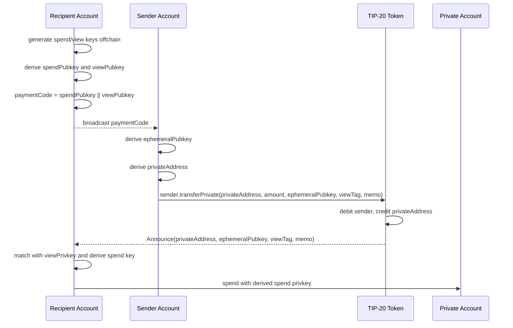

# TIP-1066: Private Addresses

## Abstract

This TIP standardizes ERC-5564-compatible private addresses (also known as
"stealth addresses") on Tempo as a TIP-20 private-transfer entrypoint, a
canonical TIP-20 `Announce` event, and canonical ERC-5564 SECP256K1
derivation semantics.
Recipients share a "payment code": a long-lived pair of public keys that
senders use to derive a fresh private address per payment. Payment-code
delivery is intentionally out of scope and happens through authenticated
offchain or out-of-band channels.

Private addresses are normal EOAs. They pay for their own gas out of the
TIP-20 balance the sender deposits, exactly like any other Tempo account.
No approval step or intermediate custody is required: the sender calls
the TIP-20 token directly. The TIP exists to fix the private-transfer
entrypoint, canonical TIP-20 announcement event, and derivation
semantics so that wallets and indexers can interoperate.

## Motivation

ERC-5564 stealth addresses give recipients per-payment unlinkability. On
Ethereum L1 they are hamstrung by the recipient having no gas at the
derived address, which forces external relayers or MEV searchers into the
loop and creates deanon channels.

Tempo charges gas in TIP-20. When a sender deposits, say, `100 USDC` to a
private address, that balance can cover both the eventual payment and the
gas needed to make it. The "no gas at the recipient address" problem
disappears, and private addresses become first-class EOAs that the
recipient can spend from directly.

ERC-6538 specifies a standalone meta-address registry, but a registry is
not required for private-address derivation: the sender only needs an
authenticated payment code. This TIP leaves payment-code discovery
outside the protocol. Wallets may use address books, QR codes, encrypted
messaging, resolvers, or future TIPs to deliver payment codes.

What remains is purely a coordination problem: wallets need a canonical
event to scan, a TIP-20-native atomic transfer + announce path, and
canonical derivation semantics. This TIP fixes those three pieces.

Future TIPs MAY introduce protocol-level optimizations (precompile,
sponsored gas earmarks, scoped spending policies, or a discovery
mechanism). This TIP is the minimum viable surface that delivers private
addresses on Tempo today.

## Overview

At a high level, the recipient generates a reusable payment code and
shares it through an authenticated out-of-band channel. Each sender uses
that payment code to derive a one-time private address, then deposits
funds and emits a canonical announcement in one transaction. Recipient
wallets scan announcements with the view privkey, recover only the
private addresses that belong to them, and spend from those addresses as
normal EOAs.



## Assumptions

- Tempo charges transaction gas in TIP-20 from the sender's TIP-20
  balance. A fresh EOA that holds a TIP-20 balance can submit
  transactions without needing any other prefunding.
- ERC-5564 SECP256K1 derivation is the only supported scheme in v1.
  Other curves and schemes are out of scope.
- Senders are responsible for obtaining and authenticating the
  recipient's payment code through the channel that delivered it.
- Recipients are responsible for scanning `Announce` events emitted by
  TIP-20 tokens offchain. Wallets MAY delegate scanning to a service
  holding only the view privkey.
- Standard TIP-20 transfer semantics apply. `transferPrivate` debits
  `msg.sender`, credits `privateAddress`, and emits the announcement
  atomically.
- `transferPrivate` succeeds only when `privateAddress` is the final
  credited recipient. Recipient resolution or receive-policy handling
  MUST NOT redirect the deposit to another address.
- TIP-1022 `resolveRecipient` passes through private addresses unchanged
  because they are normal EOAs with no virtual-address or linked-account
  registration.
- Payment-code discovery and name-to-payment-code resolution (e.g.
  ENS-style) are out of scope.

If the gas-in-TIP-20 assumption is violated (e.g. Tempo later introduces
a separate native-only gas path), this TIP MUST be amended to add a
sponsored-gas mechanism, since fresh private-address EOAs would
otherwise be unable to spend.

---

# Specification

## Terminology

| Term | Description |
| --- | --- |
| Payment code | A pair `(spendPubkey, viewPubkey)` of SECP256K1 public keys shared by a recipient. Equivalent to a "stealth meta-address" in ERC-5564 terminology. |
| Ephemeral pubkey | A one-time SECP256K1 public key the sender publishes per payment. |
| Private address | An EOA derived deterministically from a payment code and an ephemeral pubkey. Equivalent to a "stealth address" in ERC-5564 terminology. |
| View tag | One byte equal to `hash(sharedSecret)[0]`, used for fast scan rejection. |
| Shared secret | `ephemeralPrivkey · viewPubkey == viewPrivkey · ephemeralPubkey`. |

## Derivation (ERC-5564, SECP256K1)

Given a recipient payment code `(spendPubkey, viewPubkey)` and a sender-
chosen `ephemeralPrivkey`:

```
ephemeralPubkey = ephemeralPrivkey · G
sharedSecret    = ephemeralPrivkey · viewPubkey
viewTag         = hash(sharedSecret)[0]
addressPubkey   = spendPubkey + hash(sharedSecret) · G
privateAddress  = address(addressPubkey)
```

The recipient recovers it by computing `sharedSecret = viewPrivkey ·
ephemeralPubkey` and the corresponding `privateAddress`. The recipient's
spend privkey for `privateAddress` is `spendPrivkey + hash(sharedSecret)`.

`hash` is `keccak256`. SECP256K1 group operations follow standard
conventions; pubkeys are 33-byte compressed.

## TIP-20 private transfer

This TIP extends every TIP-20 token with a native private-transfer
entrypoint and announcement event.

```solidity
interface ITIP20PrivateTransfer {
    /// @notice Emitted for each private payment.
    /// @param privateAddress  The derived private EOA receiving funds.
    /// @param ephemeralPubkey 33-byte compressed SECP256K1 pubkey.
    /// @param viewTag         hash(sharedSecret)[0], for fast scan reject.
    /// @param memo            Opaque memo bytes.
    event Announce(
        address indexed privateAddress,
        bytes ephemeralPubkey,
        bytes1 viewTag,
        bytes memo
    );

    /// @notice Transfer `amount` from msg.sender to `privateAddress` and
    ///         emit a canonical private-address announcement.
    function transferPrivate(
        address privateAddress,
        uint256 amount,
        bytes calldata ephemeralPubkey,
        bytes1 viewTag,
        bytes calldata memo
    ) external returns (bool);
}
```

`transferPrivate` MUST:

1. Revert if `ephemeralPubkey.length != 33`.
2. Execute the same TIP-20 validation and balance-update path as
   `transfer(privateAddress, amount)`, with `msg.sender` as the source.
3. Revert if the transfer fails or if the final credited recipient would
   be any address other than `privateAddress`.
4. Emit `Announce(privateAddress, ephemeralPubkey, viewTag, memo)`.
5. Return `true` on success.

`transferPrivate` MUST NOT require or consume allowance. It is a direct
TIP-20 transfer from `msg.sender`, not a delegated transfer.

Payment-lane classifiers MUST treat `transferPrivate` as a
recipient-bearing TIP-20 payment operation wherever plain `transfer` is
eligible. Fee-discount policies with narrower allowlists MAY opt in
separately; this TIP does not change those policies.

## Wallet behavior

### Sender

To send `amount` of `token` using a payment code:

1. Obtain `paymentCode` through an authenticated out-of-band channel. If
   no authenticated payment code is available, abort.
2. Verify `paymentCode.length == 66`, then decode `(spendPubkey,
   viewPubkey)` from `paymentCode`.
3. Generate fresh `ephemeralPrivkey`; derive `ephemeralPubkey`,
   `sharedSecret`, `viewTag`, `privateAddress` as in Derivation.
4. Set `memo` to encrypted memo bytes or the empty byte string.
5. `ITIP20(token).transferPrivate(privateAddress, amount,
   ephemeralPubkey, viewTag, memo)`.

Senders MAY include arbitrary `memo` bytes. Wallets SHOULD encrypt
user-facing memos or use empty bytes.

### Recipient (sharing)

The recipient generates `(spendPrivkey, spendPubkey)` and `(viewPrivkey,
viewPubkey)` offline, then shares the `spendPubkey || viewPubkey` bytes
through an authenticated out-of-band channel. No further sharing is
required unless the recipient rotates keys.

### Recipient (scanning)

For each new `Announce(privateAddress, ephemeralPubkey, viewTag, memo)`
event emitted by a recognized TIP-20 token:

1. Compute `sharedSecret' = viewPrivkey · ephemeralPubkey`.
2. If `hash(sharedSecret')[0] != viewTag`, skip.
3. Compute `candidate = address(spendPubkey + hash(sharedSecret') · G)`.
4. If `candidate != privateAddress`, skip.
5. Record `(privateAddress, spendKey = spendPrivkey + hash(sharedSecret'))`.

Wallets MAY delegate steps 1-4 to a service holding only the view
privkey. The spend privkey MUST stay with the recipient.

### Recipient (spending)

The recipient signs transactions from `privateAddress` using the derived
spend privkey, exactly as any other EOA. No special transaction format,
no extra protocol call.

## Backward compatibility

The TIP-20 extension is additive: existing TIP-20 entrypoints, balances,
allowances, storage, and events are unchanged.

Wallets that do not implement private-address scanning are unaffected;
they continue to see private addresses as ordinary EOAs.

## Reference implementations

Reference TIP-20 private-transfer implementation changes and derivation
test vectors MUST be published alongside this TIP.

---

# Invariants

1. **Direct TIP-20 custody**: `transferPrivate` MUST debit `msg.sender`
   and credit `privateAddress` through the standard TIP-20 transfer
   path. No intermediate custody address may hold funds, and no
   alternate recipient may be credited.

2. **Announce-on-deposit atomicity**: A successful `transferPrivate`
   call MUST cause exactly one `Announce` event for that private
   transfer. Reverting the transfer MUST also revert the announce.

3. **Payment code encoding**: Senders MUST reject payment codes whose
   encoded length is not 66 bytes.

4. **Address normality**: A private address derived per this TIP MUST be
   indistinguishable from any other EOA in storage, balance, and
   transaction execution. It MUST NOT be marked as a virtual address
   (TIP-1022) by virtue of private-address derivation alone.

5. **Derivation determinism**: For any fixed `(spendPubkey, viewPubkey,
   ephemeralPubkey)`, the derived `privateAddress` MUST be identical
   across all implementations.

6. **View tag soundness**: For any payment, `viewTag ==
   hash(sharedSecret)[0]` MUST hold. Receivers MUST reject mismatched
   `viewTag` as a fast filter before performing full derivation.

7. **Duplicate Announce handling**: Wallets MUST treat duplicate
   `Announce` events with identical `(token, privateAddress,
   ephemeralPubkey, viewTag, memo)` fields as idempotent scan records.

## Security considerations

### Sender ↔ private-address linkage

The `transferPrivate` call publicly transfers funds from `msg.sender` to
the private address. Senders that wish to remain unlinked to the private
address MUST source funds through a privacy-preserving channel (e.g.
their own prior private payment, a Zone, or a privacy pool). This TIP
does not attempt to hide the sender.

### Payment-code authenticity and linkage

This TIP does not define a payment-code registry. Authenticity is
therefore provided by the delivery channel. A sender MUST authenticate
that the payment code belongs to the intended recipient; otherwise an
attacker can substitute their own payment code and receive funds at a
private address they control.

The payment code itself reveals nothing about specific payments: derived
private addresses are unlinkable to the payment code without
`viewPrivkey`. The channel used to deliver the payment code may still
link the recipient account, name, or identity to that code.

### Memo privacy

`memo` is emitted in the public `Announce` event. Wallets MUST NOT put
sensitive plaintext in `memo`; user-facing memo contents SHOULD be
encrypted for the recipient or omitted.

### Announcement authenticity

`Announce` is a scan signal, not proof of payment. Wallets MUST only
scan recognized TIP-20 token addresses, and MUST verify the matched
private address's TIP-20 balance or corresponding transfer before
presenting funds as received.

### View privkey exposure

A leaked view privkey allows an attacker to identify all past and
future payments to that payment code. It does NOT grant spend
authority. Recipients MAY delegate the view privkey to scanning
services; they MUST NOT delegate the spend privkey.

### Cold-start anonymity set

The privacy property of private addresses scales with the number of
private payments on the network. Early adoption produces a small
anonymity set and weaker unlinkability. This is intrinsic to ERC-5564
and not mitigated by this TIP.

### Refilling private-address balances

When a private address's balance is depleted, the recipient cannot
refill it from a known wallet without revealing the linkage. Wallets
SHOULD treat private addresses as one-shot or short-lived payment
vehicles. Recipients MAY rotate to a fresh private address per payment
to preserve unlinkability across spends.
