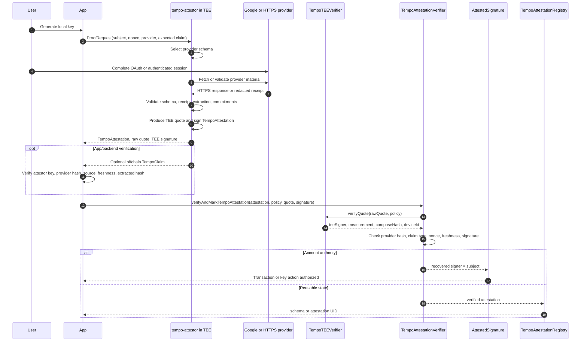

# TIP-1066: Tempo Attestations and Attested Signatures

## Abstract

This TIP specifies **Tempo Attestations**: a protocol mechanism for verifying claims produced by approved trusted execution environments and using those claims as native account authority or reusable on-chain state.

Authenticated HTTPS claims are one source of attestations. The protocol boundary is broader: provider schemas bind claims, the verifier proves facts, the attested signature exercises authority, and the registry stores reusable attestations.

## Motivation

Tempo needs a canonical verification path for statements that are true because approved code ran in an approved environment and signed the result. That path should be usable by applications while remaining a small set of composable protocol primitives.

The initial motivating flows are:

- **Login with Gmail and local keys**: a user generates a private key locally, proves control of a Google account to an approved TEE, and uses the resulting attestation to authorize that local key. The chain sees the local key or account target, schema commitments, and TEE verification material. It does not see the email address, Google account identifier, or their relationship.
- **Account recovery**: a user who loses a local key satisfies a recovery policy with a fresh identity attestation, optionally combined with another factor or delay. If Gmail alone can rotate keys, then the approved TEE service is a recovery signer. Accounts that need stricter noncustody should combine the attested identity with local policy.
- **Private human credentials**: applications increasingly need to distinguish real users from bots, duplicate accounts, synthetic identities, and automated agents without forcing users through invasive identity checks. A TEE-backed attestation can prove a user satisfies a human, uniqueness, age, jurisdiction, membership, or account-quality policy while revealing only the minimum claim needed by the application.
- **Authenticated offchain data**: a TEE fetches public or private web data, validates it against a provider schema, selectively discloses fields, and signs only the resulting commitment. This supports oracle-style public data, private credentials, KYC-style statements, app-specific access, and API-backed attestations without requiring every application to define its own verifier.
- **Reusable public state**: some attestations are ephemeral and used only inside a signature. Others should be discoverable, referenceable, revocable, and consumed later by applications. The persistent layer needs stable schema UIDs, attestations that reference schemas, attestations that reference other attestations, and schema-controlled revocation.

The common object is a schema-bound attestation: an approved program in a verifiable execution environment signs a bounded statement under a registered or approved schema.

## Overview

Tempo Attestations is a stack of primitives, not one application-specific flow.

```text
+--------------------------------------------------------------------------------+
| Applications                                                                   |
|                                                                                |
| Gmail login | account recovery | private human credentials | web oracles       |
| reusable public credentials                                                    |
+---------------------------------------+----------------------------------------+
                                        |
                                        | ProofRequest
                                        v
+--------------------------------------------------------------------------------+
| tempo-attestor in an approved TEE                                             |
|                                                                                |
| provider schema -> provider receipt -> extraction -> disclosure/commitments    |
| TEE quote evidence -> TEEProofPreimage -> optional offchain TempoClaim         |
+---------------------------------------+----------------------------------------+
                                        |
                                        | TempoAttestation + raw quote
                                        | + TEE signature
                                        v
+--------------------------------------------------------------------------------+
| On-chain verification                                                          |
|                                                                                |
| TempoTEEVerifier                                                               |
|   quote -> signer, measurement, compose hash, device id, TCB status            |
|                                                                                |
| TempoAttestationVerifier                                                       |
|   provider hash, claim type, source hash, freshness, nonce, signature          |
+-------------------+------------------------------------------------------------+
                    |
                    | verified TempoAttestation
                    |
        +-----------+-----------+
        |                       |
        v                       v
+-------------------+   +--------------------------------------------------------+
| AttestedSignature |   | TempoAttestationRegistry                               |
| account authority |   | schemas, public attestations, references, revocations  |
+-------------------+   +--------------------------------------------------------+
```

Layer responsibilities:

- **TEE verifier** proves that an approved TEE app, measurement, device policy, and signer produced a claim. It verifies quote structure, report-data binding, compose hash, device policy, TCB status, freshness, and signer binding.
- **Provider schema and receipt verification** defines what the TEE was allowed to fetch, which source domains and methods were allowed, how response fields were extracted, which fields were disclosed or committed, and how fresh the receipt must be.
- **Tempo attestation** is the typed statement being verified: subject, schema, provider hash, extracted claim hash, nonce, expiry, source hash, and TEE identity. It carries commitments, not raw private data.
- **Attested signature** is the native Tempo signature type that treats a verified attestation as account authority. This is how applications use an offchain identity proof to authorize key material, recovery actions, or transactions.
- **TempoAttestationRegistry** is durable on-chain state for attestations that should be reusable: schemas, public attestations, revocations, references, and resolver-controlled application logic.

The separation is intentional:

- **Provider schemas bound claims**: they define approved sources, request shape, response checks, extraction rules, disclosure policy, and freshness.
- **Verifier proves facts**: it says an approved TEE signed a bounded statement under approved provider and TEE policy.
- **Signature exercises authority**: it turns a verified fact into a signer for account actions.
- **Registry stores reusable state**: it records attestations that need discovery, references, revocation, or later consumption.

Not every attestation needs to be registered. Ephemeral login and recovery authorizations can stay as signatures. Reusable credentials and app state should go through the registry.

---

# Specification

The specification is ordered from lower-level trust primitives to higher-level composition. `TempoTEEVerifier` establishes trusted execution identity, `TempoAttestationVerifier` verifies typed claims, `AttestedSignature` turns claims into account authority, and `TempoAttestationRegistry` persists claims that should become reusable state.

## Naming

The umbrella name is **Tempo Attestations**.

The main protocol objects are:

- `TempoAttestation`: a typed, signed statement produced by an approved TEE app.
- `TempoProviderSchema`: a structured description of an approved offchain source, request, response policy, extraction rules, redaction policy, and freshness window.
- `TempoProviderReceipt`: the structured, hash-bound receipt of an offchain request and response.
- `TempoAttestationVerifier`: a precompile that verifies TEE-backed attestations and provider policy.
- `TempoTEEVerifier`: a precompile/library surface that verifies TEE quote bindings and approved TEE identity.
- `TempoAttestor`: the Rust service that runs inside an approved TEE, creates proof sessions, validates provider receipts, signs TEE proof preimages, and optionally emits on-chain proof material.
- `TempoAttestationRegistry`: a precompile that stores schemas, attestations, and revocations.
- `AttestedSignature`: a native transaction signature type whose signer is recovered from a valid `TempoAttestation`.

"Authenticated web" is the name for the HTTPS response use case. It is a source of attestations, not the protocol brand.

## Precompile Addresses

The following addresses are reserved at T6:

| Precompile | Address | ASCII prefix |
|---|---|---|
| `TempoTEEVerifier` | `0x5445450000000000000000000000000000000000` | `TEE` |
| `TempoAttestationVerifier` | `0x4154544553540000000000000000000000000000` | `ATTEST` |
| `TempoAttestationRegistry` | `0x4154544553545245470000000000000000000000` | `ATTESTREG` |

The existing PR implementation at `0x5A4B544C53000000000000000000000000000000` is renamed and migrated to the `TempoAttestationVerifier` address before T6 activation. Pre-T6 chains MUST NOT expose the renamed precompiles.

## Reference Service Flow

The current Rust proof service becomes `bin/tempo-attestor`. It is an implementation of the primitives in this TIP, not a separate protocol.



The service exposes the following client flow:

1. An app creates a `ProofRequest` with provider id, subject, nonce, session id, expected claim, creation time, expiry, and optional callback.
2. The service selects or builds a `TempoProviderSchema` for the provider. The schema includes id, version, claim type, allowed domains, request template, credential policy, response matchers, extraction rules, redaction policy, and freshness policy.
3. The user or controlled client submits the provider material. For Google login, this is a Google OAuth access token and the service fetches `https://www.googleapis.com/oauth2/v3/userinfo`. For authenticated web, this is a redacted HTTPS request/response receipt from a controlled browser or app flow.
4. The service builds a `TempoProviderReceipt` with request method, URL, URL template hash, domain, request and response header hashes, body hashes, observed time, optional JSON, optional redacted text, and optional redaction ranges.
5. The TEE validates the provider schema, provider receipt, expected claim, response policy, and extraction rules. It produces an `ExtractedClaim` with disclosed fields and field commitments.
6. The TEE signs a `TEEProofPreimage` containing the original proof request, provider schema, provider hash, source metadata, extracted claim, provider receipt, TEE attestation evidence, TEE identity, issue time, and expiry.
7. An optional offchain attestor verifies the TEE proof envelope, provider hash approval, TEE attestation evidence, TEE identity, proof times, receipt freshness, and independently re-runs extraction before signing a `TempoClaim` for app or backend consumption.
8. For protocol authority, the service also emits on-chain proof material: a fixed-width `TempoAttestation`, raw quote, TEE secp256k1 signature, TEE signer address, attestation hash, and digest. The chain verifies this material directly.

The reference service MUST NOT treat fixture provider material as deployed input. Test-only shortcuts, local fixture attestations, local signing keys, and development-only userinfo submission are excluded from the T6 deployment profile.

## Layer 1: TEE Verification

`TempoTEEVerifier` verifies TEE quote structure and maintains approvals for TEE identity.

```solidity
interface ITempoTEEVerifier {
    /// @notice Application policy checked against a TEE quote.
    /// @dev Zero-valued fields are wildcards except where approval state requires a value.
    struct TEEPolicy {
        address expectedApp;
        bytes32 expectedMeasurementHash;
        bytes32 expectedComposeHash;
        bytes32 expectedDeviceId;
        address expectedSigner;
    }

    /// @notice Verifies a raw TEE quote against protocol approval state and caller policy.
    /// @param rawQuote TEE quote bytes.
    /// @param policy Expected quote-derived values. Zero fields rely on approval state only.
    /// @return teeSigner Signer bound into quote report data.
    /// @return measurementHash Measurement hash extracted or derived from the quote.
    /// @return composeHash Compose hash extracted or derived from the quote.
    /// @return deviceId Device identifier extracted or derived from the quote.
    function verifyQuote(
        bytes calldata rawQuote,
        TEEPolicy calldata policy
    ) external view returns (address teeSigner, bytes32 measurementHash, bytes32 composeHash, bytes32 deviceId);

    /// @notice Returns whether a TEE app identity is approved.
    function isTEEAppApproved(address teeApp) external view returns (bool approved);
    /// @notice Returns whether a measurement hash is approved for a TEE app.
    function isMeasurementApproved(address teeApp, bytes32 measurementHash) external view returns (bool approved);
    /// @notice Returns whether a compose hash is approved for a TEE app.
    function isComposeHashApproved(address teeApp, bytes32 composeHash) external view returns (bool approved);
    /// @notice Returns whether a device id is approved for a TEE app.
    function isDeviceApproved(address teeApp, bytes32 deviceId) external view returns (bool approved);
    /// @notice Returns whether all device ids are allowed for a TEE app.
    function isAnyDeviceAllowed(address teeApp) external view returns (bool approved);
    /// @notice Returns whether a signer is approved for a TEE app.
    function isTEESignerApproved(address teeApp, address teeSigner) external view returns (bool approved);

    /// @notice Updates approval for a TEE app. Owner only.
    function setTEEAppApproved(address teeApp, bool approved) external;
    /// @notice Updates approval for a measurement hash under a TEE app. Owner only.
    function setMeasurementApproved(address teeApp, bytes32 measurementHash, bool approved) external;
    /// @notice Updates approval for a compose hash under a TEE app. Owner only.
    function setComposeHashApproved(address teeApp, bytes32 composeHash, bool approved) external;
    /// @notice Updates approval for a device id under a TEE app. Owner only.
    function setDeviceApproved(address teeApp, bytes32 deviceId, bool approved) external;
    /// @notice Allows or disallows all device ids for a TEE app. Owner only.
    function setAllowAnyDevice(address teeApp, bool approved) external;
    /// @notice Updates approval for a TEE signer under a TEE app. Owner only.
    function setTEESignerApproved(address teeApp, address teeSigner, bool approved) external;

    error Unauthorized();
    error TEEAppZero();
    error TEESignerZero();
    error TEEAppMismatch();
    error MeasurementMismatch();
    error ComposeHashMismatch();
    error DeviceIdMismatch();
    error TEESignerMismatch();
    error TEEAppNotApproved();
    error MeasurementNotApproved();
    error ComposeHashNotApproved();
    error DeviceNotApproved();
    error TEESignerNotApproved();
    error QuoteTooShort();
    error QuoteFormatUnsupported();
}
```

The owner of `TempoTEEVerifier` controls approval state. `verifyQuote` MUST fail unless:

- the quote format is supported;
- report data binds the TEE signer and nonce expected by the attestation verifier;
- the quote binds the measurement hash;
- the quote binds the compose hash;
- the TEE app is approved;
- the measurement hash is approved for that app;
- the compose hash is approved for that app;
- either the device is approved or the app allows any device;
- the TEE signer is approved for that app;
- any nonzero expected policy field matches the quote-derived value.

## Layer 2: Attestation Verification

### Provider Schemas

A `TempoProviderSchema` is the security artifact that tells the TEE and verifier what a provider claim means. It is hashed and approved before claims under that schema are accepted.

A provider schema MUST include:

- provider id and version;
- claim type;
- allowed source domains;
- HTTP method and URL template;
- public request headers and optional public body template;
- credential policy, such as bearer token, cookie header, or no credential;
- response success status and required matchers;
- extraction rules using JSON path, regular expressions, or XPath;
- redaction policy that separates disclosed fields from committed fields;
- freshness policy for source receipts and emitted proofs.

The provider schema hash MUST be domain-separated and computed over a canonical serialization. The current Rust implementation uses canonical JSON for provider schema hashing. Before T6 activation, every hash domain label used by the service MUST be migrated to the `tempo:attestation:*` namespace.

Provider schemas MUST enforce implementation limits:

- HTTPS-only URLs for raw and authenticated web providers;
- no secret header values in schema data;
- maximum URL length;
- maximum header count and header byte length;
- maximum response matcher count;
- maximum extraction rule count;
- maximum redaction range count;
- maximum request and response material size;
- explicit freshness windows.

### Provider Receipts

A `TempoProviderReceipt` is the structured evidence produced for one provider interaction. It MUST bind:

- request method;
- concrete URL;
- URL template hash;
- source domain;
- request header hash;
- request body hash;
- response status;
- response content type;
- response header hash;
- response body hash;
- observed timestamp;
- optional parsed JSON;
- optional redacted text;
- optional request and response redaction ranges.

For authenticated web receipts, redaction ranges MAY include commitments. Redacted request or response material MUST still be bounded by the same provider schema and size limits.

An `ExtractedClaim` is derived from a provider receipt by applying the provider schema's extraction and disclosure policy. It contains:

- `claimType`;
- disclosed fields;
- field commitments.

The attestation stores `extractedHash = H(ExtractedClaim)`. Raw provider responses, credentials, and private identifiers MUST NOT be stored on chain.

### Fixed-Width Attestation

An attestation is a fixed-width statement signed by an approved TEE signer. Variable-size data is represented by hashes or schema-specific commitments.

```solidity
struct TempoAttestation {
    address subject;
    bytes32 schemaUID;
    bytes32 providerHash;
    bytes32 claimType;
    bytes32 extractedHash;
    bytes32 nonce;
    bytes32 sessionId;
    uint64 issuedAt;
    uint64 expiresAt;
    bytes32 sourceHash;
    address teeApp;
    bytes32 measurementHash;
    bytes32 composeHash;
    bytes32 deviceId;
    bytes32 quoteHash;
}
```

`subject` is the address the attestation is about. For attested signatures, this is the recovered signer. For Gmail login and recovery, this is usually the locally generated key or account being authorized, not the email account itself.

`schemaUID` identifies the registry schema for the attestation data. `providerHash` identifies the provider schema used to produce the claim. `claimType` identifies the semantic claim. `extractedHash` is the schema-specific hash of extracted and committed claim data.

`nonce` prevents replay in the verifier or registry. `sessionId` binds the offchain session. `issuedAt` and `expiresAt` bound freshness.

`sourceHash` commits to source metadata, such as domain, URL template hash, method, certificate summary, and response policy. `teeApp`, `measurementHash`, `composeHash`, `deviceId`, and `quoteHash` bind the claim to an approved TEE app and quote.

The reference on-chain proof material already contains `subject`, `providerHash`, `claimType`, `extractedHash`, `nonce`, `sessionId`, `issuedAt`, `expiresAt`, `sourceHash`, app contract, `composeHash`, `deviceId`, and `quoteHash`. This TIP adds `schemaUID` for registry composition and makes `measurementHash` explicit in the precompile surface. Implementations MAY derive `measurementHash` from quote verification rather than requiring clients to submit it redundantly.

`TempoAttestationVerifier` verifies a `TempoAttestation` and the TEE signature over it.

```solidity
interface ITempoAttestationVerifier {
    /// @notice Caller policy checked atomically with TEE and provider verification.
    /// @dev App policy can narrow accepted fields but cannot approve trust roots.
    struct VerificationPolicy {
        address expectedSubject;
        bytes32 expectedSchemaUID;
        bytes32 expectedProviderHash;
        bytes32 expectedClaimType;
        bytes32 expectedNonce;
        bytes32 expectedSourceHash;
        address expectedTEEApp;
        bytes32 expectedMeasurementHash;
        bytes32 expectedComposeHash;
        bytes32 expectedDeviceId;
        address expectedTEESigner;
        uint64 maxClaimAgeSeconds;
        uint64 maxFutureSkewSeconds;
    }

    /// @notice Successful attestation verification result.
    struct VerifiedAttestation {
        bytes32 attestationHash;
        address teeSigner;
        address subject;
    }

    /// @notice Verifies a TEE-signed Tempo attestation without consuming its nonce.
    /// @param attestation Fixed-width attestation statement.
    /// @param policy Caller-selected policy for expected values and freshness.
    /// @param rawQuote Raw TEE quote whose hash and report data bind the attestation.
    /// @param signature TEE signer signature over `hashTempoAttestation(attestation)`.
    /// @return verified Attestation hash, recovered TEE signer, and attestation subject.
    function verifyTempoAttestation(
        TempoAttestation calldata attestation,
        VerificationPolicy calldata policy,
        bytes calldata rawQuote,
        bytes calldata signature
    ) external payable returns (VerifiedAttestation memory verified);

    /// @notice Verifies a TEE-signed Tempo attestation and consumes `(subject, nonce)`.
    /// @param attestation Fixed-width attestation statement.
    /// @param policy Caller-selected policy for expected values and freshness.
    /// @param rawQuote Raw TEE quote whose hash and report data bind the attestation.
    /// @param signature TEE signer signature over `hashTempoAttestation(attestation)`.
    /// @return verified Attestation hash, recovered TEE signer, and attestation subject.
    function verifyAndMarkTempoAttestation(
        TempoAttestation calldata attestation,
        VerificationPolicy calldata policy,
        bytes calldata rawQuote,
        bytes calldata signature
    ) external payable returns (VerifiedAttestation memory verified);

    /// @notice Returns the canonical hash signed by the TEE signer.
    function hashTempoAttestation(TempoAttestation calldata attestation) external pure returns (bytes32);
    /// @notice Returns whether `(subject, nonce)` has been consumed.
    function isNonceUsed(address subject, bytes32 nonce) external view returns (bool used);

    /// @notice Returns whether a provider schema hash is approved.
    function isProviderHashApproved(bytes32 providerHash) external view returns (bool approved);
    /// @notice Returns the only approved claim type for a provider schema hash.
    function claimTypeForProviderHash(bytes32 providerHash) external view returns (bytes32 claimType);
    /// @notice Updates provider schema hash approval. Owner only.
    function setProviderHashApproved(bytes32 providerHash, bytes32 claimType, bool approved) external;

    error Unauthorized();
    error SubjectMismatch();
    error SchemaUIDMismatch();
    error ProviderHashMismatch();
    error ClaimTypeMismatch();
    error NonceMismatch();
    error SourceHashMismatch();
    error TEEAppMismatch();
    error MeasurementMismatch();
    error ComposeHashMismatch();
    error DeviceIdMismatch();
    error TEESignerMismatch();
    error ProviderHashNotApproved();
    error QuoteHashMismatch();
    error InvalidSignature();
    error InvalidSignatureLength();
    error NonceAlreadyUsed();
    error ClaimExpired();
    error ClaimStale();
    error ClaimIssuedFromFuture();
}
```

The verifier functions are `payable` because the current TDX/DCAP verification path calls an on-chain quote verifier that may charge value. A future native precompile MAY internalize that cost, but callers MUST assume quote verification can be stateful.

`verifyTempoAttestation` MUST fail unless:

- every nonzero policy expectation matches the attestation;
- `providerHash` is approved and maps to `claimType`;
- `block.timestamp <= expiresAt`;
- `issuedAt <= block.timestamp + maxFutureSkewSeconds`;
- `block.timestamp - issuedAt <= maxClaimAgeSeconds`, when `block.timestamp >= issuedAt`;
- `keccak256(rawQuote) == quoteHash`;
- `TempoTEEVerifier.verifyQuote` succeeds for the quote and TEE policy;
- the attestation signature is a supported low-malleability TEE signer signature over `hashTempoAttestation(attestation)`;
- the recovered signer matches the signer bound into quote report data.

`verifyAndMarkTempoAttestation` additionally MUST fail if `(subject, nonce)` was already consumed and MUST mark it consumed before returning.

`verifyQuote` MUST verify the quote output before signer recovery. For the TDX/Phala CVM path in the current implementation profile, this includes supported quote version, supported quote body type, `TCB_STATUS_OK`, report-data signer binding, report-data nonce binding, and compose-hash binding.

`hashTempoAttestation` MUST be domain-separated. The current on-chain proof service uses an Ethereum signed-message digest over the fixed-width attestation hash for secp256k1 TEE signatures. The T6 precompile MAY preserve that digest for compatibility or migrate to a Tempo-native domain separator before activation, but all clients and verifier code MUST use one canonical digest.

## Layer 4: Native Attested Signature Type

T6 adds `SIGNATURE_TYPE_ATTESTED = 0x06` unless another accepted TIP allocates that byte first. This value intentionally avoids `0x05`, which is reserved by the native multisig proposal.

The wire format is:

```text
0x06 ||
abi.encode(
    TempoAttestation attestation,
    VerificationPolicy policy,
    bytes rawQuote,
    bytes teeSignature
)
```

For a Tempo transaction with signing hash `H`, an attested signature is valid if:

- `policy.expectedSubject == attestation.subject`;
- `attestation.nonce == H` or `attestation.extractedHash` commits to `H` under the schema;
- `TempoAttestationVerifier.verifyAndMarkTempoAttestation` succeeds;
- the attestation schema permits use as a native signature.

The recovered signer is `attestation.subject`.

Because attested signature verification depends on protocol state, mempool admission and block validation MUST run state-aware signer recovery for this signature type. Stateless `recover_signer` helpers MAY decode attested signatures and return a placeholder error, but consensus validation MUST verify them through the attestation verifier.

Attested signatures are a protocol key type, not an access-key feature. They can be used anywhere a native Tempo signature type is accepted, subject to schema policy and hardfork activation.

## Layer 5: TempoAttestationRegistry

`TempoAttestationRegistry` is the canonical on-chain registry for public Tempo attestations. Schemas are registered once, attestations reference schemas by UID, attestations can reference other attestations, and revocation is only allowed when the schema and attestation permit it.

```solidity
interface ITempoAttestationRegistry {
    /// @notice Registered schema metadata.
    struct SchemaRecord {
        bytes32 uid;
        address resolver;
        bool revocable;
        address registerer;
        uint64 registeredAt;
        string schema;
    }

    /// @notice Data used to create a registry attestation.
    /// @dev `data` is public calldata and may be persisted. Use commitments for private claims.
    struct AttestationRequestData {
        address recipient;
        uint64 expirationTime;
        bool revocable;
        bytes32 refUID;
        bytes32 salt;
        bytes data;
    }

    /// @notice Direct attestation request. The attester is `msg.sender`.
    struct AttestationRequest {
        bytes32 schema;
        AttestationRequestData data;
    }

    /// @notice Delegated attestation request signed by `attester`.
    struct DelegatedAttestationRequest {
        bytes32 schema;
        AttestationRequestData data;
        address attester;
        uint64 deadline;
        bytes signature;
    }

    /// @notice Attestation request backed by a verified Tempo attestation.
    struct VerifiedAttestationRequest {
        AttestationRequest request;
        TempoAttestation attestation;
        ITempoAttestationVerifier.VerificationPolicy policy;
        bytes rawQuote;
        bytes signature;
    }

    /// @notice Direct revocation request. The revoker is `msg.sender`.
    struct RevocationRequest {
        bytes32 schema;
        bytes32 uid;
    }

    /// @notice Delegated revocation request signed by `revoker`.
    struct DelegatedRevocationRequest {
        bytes32 schema;
        bytes32 uid;
        address revoker;
        uint64 deadline;
        bytes signature;
    }

    /// @notice Stored attestation metadata and optional public data.
    struct AttestationRecord {
        bytes32 uid;
        bytes32 schema;
        uint64 time;
        uint64 expirationTime;
        uint64 revocationTime;
        bytes32 refUID;
        address recipient;
        address attester;
        bool revocable;
        bytes32 dataHash;
        bytes data;
    }

    /// @notice Registers a schema and returns its deterministic UID.
    /// @param schema ABI-style schema string.
    /// @param resolver Optional resolver called before attest/revoke storage mutation.
    /// @param revocable Whether attestations under this schema may be revoked.
    /// @return uid Deterministic schema UID.
    function registerSchema(
        string calldata schema,
        address resolver,
        bool revocable
    ) external returns (bytes32 uid);

    /// @notice Returns a registered schema by UID.
    function getSchema(bytes32 uid) external view returns (SchemaRecord memory schema);

    /// @notice Creates an attestation from `msg.sender`.
    /// @return uid UID of the new attestation.
    function attest(AttestationRequest calldata request) external returns (bytes32 uid);

    /// @notice Creates an attestation from `request.attester` after signature verification.
    /// @return uid UID of the new attestation.
    function attestByDelegation(
        DelegatedAttestationRequest calldata request
    ) external returns (bytes32 uid);

    /// @notice Creates an attestation after verifying a TEE-backed Tempo attestation.
    /// @return uid UID of the new registry attestation.
    function attestByVerifiedTempoAttestation(
        VerifiedAttestationRequest calldata request
    ) external returns (bytes32 uid);

    /// @notice Revokes an attestation from `msg.sender`.
    function revoke(RevocationRequest calldata request) external;

    /// @notice Revokes an attestation from `request.revoker` after signature verification.
    function revokeByDelegation(DelegatedRevocationRequest calldata request) external;

    /// @notice Returns a stored attestation by UID.
    function getAttestation(bytes32 uid) external view returns (AttestationRecord memory attestation);
    /// @notice Returns whether an attestation exists, is unexpired, and is unrevoked.
    function isAttestationValid(bytes32 uid) external view returns (bool valid);

    error SchemaNotFound();
    error SchemaAlreadyExists();
    error AttestationNotFound();
    error AttestationAlreadyExists();
    error AttestationExpired();
    error AttestationAlreadyRevoked();
    error SchemaNotRevocable();
    error AttestationNotRevocable();
    error UnauthorizedRevoker();
    error DeadlineExpired();
    error InvalidSignature();
    error ResolverRejected();
}
```

### Schema Registration

`registerSchema` computes:

```text
schemaUID = keccak256(abi.encode(schema, resolver, revocable))
```

It MUST fail if `schemaUID == 0` or if the schema already exists. It MUST store the schema, resolver, revocability flag, registerer, and timestamp.

The schema string SHOULD use ABI-style field definitions for human and tooling compatibility, for example:

```text
bytes32 identityCommitment address localKey bytes32 audienceHash uint64 issuedAt
```

### Attestation Creation

`attest` creates a public attestation from `msg.sender`. `attestByDelegation` creates one from `request.attester` after verifying the delegated signature over the registry attestation digest. The delegated signature MAY be any Tempo-native signature type active at the current hardfork, including `AttestedSignature`.

`attestByVerifiedTempoAttestation` first verifies the supplied `TempoAttestation` through `TempoAttestationVerifier`. The created registry attestation's `attester` MUST be the verified TEE signer or the verified attestation subject, according to the schema's resolver policy. If the schema has no resolver, the default attester is the verified TEE signer and the recipient is `request.request.data.recipient`.

Attestation UID is:

```text
uid = keccak256(abi.encode(
    schema,
    recipient,
    attester,
    refUID,
    dataHash,
    expirationTime,
    revocable,
    block.timestamp,
    salt
))
```

The registry MUST store `dataHash = keccak256(data)`. It MAY store `data` inline. Privacy-sensitive schemas SHOULD store only commitments or empty data.

If `resolver != address(0)`, the registry MUST call the resolver before storing the attestation. A resolver MAY reject the attestation. Tempo v1 resolvers do not receive native value.

### Revocation

`revoke` and `revokeByDelegation` MUST fail unless:

- the attestation exists;
- the schema exists;
- the schema is revocable;
- the attestation is revocable;
- the direct or delegated revoker is the attestation attester, unless a resolver explicitly authorizes another revoker;
- the attestation has not already been revoked.

If `resolver != address(0)`, the registry MUST call the resolver before marking the attestation revoked.

### Validity

`isAttestationValid(uid)` returns true if:

- the attestation exists;
- `revocationTime == 0`;
- `expirationTime == 0 || block.timestamp <= expirationTime`.

## Layer 6: Example Flows

The protocol primitives above are application-agnostic. Applications compose them as follows:

- **Login with Gmail and local keys**

  Goal: let a user prove control of a Google account while keeping account control in a local private key.

  Primitive path: `tempo-attestor` creates a proof session, the Google provider schema pins the userinfo endpoint and expected fields, `TempoTEEVerifier` verifies the TEE quote, `TempoAttestationVerifier` verifies the Google identity commitment, and `AttestedSignature` authorizes the local key or account action.

  Flow:

  1. The client generates a local private key and keeps it local.
  2. The client creates a `ProofRequest` whose subject is the local public key address or account authorization target, whose provider id is the Google email ownership provider, and whose nonce is a fresh challenge or transaction hash.
  3. The Google provider schema pins `GET https://www.googleapis.com/oauth2/v3/userinfo`, requires `email_verified == true`, extracts `email`, `emailVerified`, and Google account id, and applies the requested disclosure policy.
  4. The user completes Google OAuth. The approved TEE receives only the scoped material needed to fetch userinfo.
  5. The TEE builds a provider receipt, validates the schema, validates freshness, extracts the expected claim, and derives a private identity commitment using provider-private identity material and TEE-held secret material.
  6. The TEE signs a `TempoAttestation` whose subject is the local key address or account authorization target and whose `extractedHash` commits to the disclosed fields and private commitments.
  7. The user submits the attestation as an attested signature or registry-backed authorization to add, rotate, or recover local key material.
  8. If an app accepts an offchain `TempoClaim`, the offchain verifier MUST check the attestor key, provider hash, expected subject, expected nonce, expected claim type, source domain, URL template hash, TEE measurement, TEE image digest, freshness, and extracted hash.

  Privacy rule: the chain MUST NOT receive the email address, Google `sub`, OAuth token, raw userinfo response, or a hash directly derived from email. If an application needs account continuity across devices, it should use an attestation commitment derived by the approved TEE, not a user-stored salt.

- **Account recovery**

  Goal: let users recover from local key loss without making a hosted login provider the normal spending key.

  Primitive path: an attested signature or registry attestation satisfies one recovery factor. Account policy decides whether additional factors, delays, guardians, or local constraints are required.

  Recommended policy:

  - local key can spend normally;
  - recovery path requires an attested Gmail identity plus a separate recovery factor or delay;
  - key rotation writes the new local key after the recovery policy succeeds.

  Custody rule: if Gmail alone can rotate keys, then the approved TEE service is effectively a recovery signer for that account. That may be acceptable for some account policies, but it is not purely noncustodial.

- **Private human credentials**

  Goal: let applications enforce human-only, one-account, one-claim, or eligibility rules without collecting broad identity documents or linking a user's activity across apps.

  Primitive path: a TEE verifies the source credential or human/uniqueness signal, emits a schema-bound commitment, and the app consumes either an attested signature for one-time access or a registry attestation for reusable state.

  Disclosure rule: applications should receive the narrowest useful statement, such as `isHuman`, `isUniqueForApp`, `ageOver18`, or `eligibleForOffer`, rather than raw identity material. App-specific nullifiers or commitments SHOULD prevent double-use without allowing cross-app tracking.

- **Authenticated web oracles**

  Goal: let applications consume public or private web/API data with schema-bound freshness and selective disclosure.

  Primitive path: an application approves a provider schema for an HTTPS source, then accepts `TempoAttestation`s whose `extractedHash` commits to the extracted response fields.

  Disclosure rule: public oracle values can be disclosed in registry `data`. Private or user-specific values SHOULD be represented as commitments and only revealed offchain to authorized consumers.

- **Reusable credentials**

  Goal: make attestations discoverable, referenceable, and revocable for later application use.

  Primitive path: applications register schemas in `TempoAttestationRegistry`, then store public attestations under those schemas.

  State rule: applications that only need one-time authorization should use attested signatures without registering the underlying attestation. Applications that need durable credentials should use the registry for stable schema UIDs, attestation UIDs, reference links, resolver checks, and revocation.

## Privacy Requirements

Identity attestations MUST be designed as commitments, not public identifiers.

For Gmail identity, the following values MUST NOT be emitted on chain:

- email address;
- normalized email address;
- Google `sub`;
- OAuth access token or ID token;
- raw userinfo response;
- `hash(email)`;
- `hash(sub)` unless combined with TEE-held secret material or another non-public value.

Recommended Gmail identity commitment:

```text
identityCommitment = HMAC(teeIdentitySecret, "tempo:gmail:v1" || iss || aud || sub)
```

The TEE identity secret MUST be sealed inside the approved TEE app or derived from an equivalent approved confidential secret source. The chain only sees schema-specific commitments and local public key addresses.

Generic redaction commitments MAY use domain-separated hashes for high-entropy or non-enumerable values. They MUST NOT be used as privacy-preserving identity commitments for emails, usernames, phone numbers, Google account ids, or any other enumerable identifier. The current Rust field-commitment helper is suitable for receipt redaction and test fixtures, but deployed Gmail login MUST use a private identity commitment as above or an equivalent construction with non-public entropy.

The deployed Google provider schema MUST default to committed identity mode for login and recovery. Email disclosure is allowed only for applications that explicitly need public email display and accept the privacy loss.

# Observability

The following events MUST be emitted.

```solidity
event TEEAppApprovalUpdated(address indexed teeApp, bool approved);
event TEEMeasurementApprovalUpdated(address indexed teeApp, bytes32 indexed measurementHash, bool approved);
event TEEComposeHashApprovalUpdated(address indexed teeApp, bytes32 indexed composeHash, bool approved);
event TEEDeviceApprovalUpdated(address indexed teeApp, bytes32 indexed deviceId, bool approved);
event TEEAllowAnyDeviceUpdated(address indexed teeApp, bool approved);
event TEESignerApprovalUpdated(address indexed teeApp, address indexed teeSigner, bool approved);

event ProviderHashApprovalUpdated(bytes32 indexed providerHash, bytes32 indexed claimType, bool approved);

event TempoAttestationVerified(
    address indexed subject,
    bytes32 indexed schemaUID,
    bytes32 indexed nonce,
    bytes32 providerHash,
    bytes32 claimType,
    bytes32 extractedHash,
    bytes32 sourceHash,
    address teeApp,
    bytes32 measurementHash,
    bytes32 composeHash,
    bytes32 deviceId,
    bytes32 quoteHash,
    address teeSigner,
    bytes32 attestationHash
);

event SchemaRegistered(bytes32 indexed uid, address indexed registerer, address indexed resolver, bool revocable, string schema);
event Attested(address indexed recipient, address indexed attester, bytes32 uid, bytes32 indexed schemaUID);
event Revoked(address indexed recipient, address indexed attester, bytes32 uid, bytes32 indexed schemaUID);
```

Operational questions these events answer:

- Which TEE apps, measurements, compose hashes, devices, and signers are trusted?
- Which provider schemas can produce protocol-accepted claims?
- Which attestations were accepted by the verifier?
- Which schemas exist for apps and indexers?
- Which public attestations were created or revoked?

# Invariants

- A `TempoAttestation` MUST NOT verify unless its TEE app, measurement, compose hash, device policy, signer, provider hash, and claim type are approved in protocol state.
- Caller-provided policy can only narrow verification. It MUST NOT create trust for an unapproved TEE app, signer, measurement, device, provider hash, or claim type.
- `verifyAndMarkTempoAttestation` MUST consume `(subject, nonce)` exactly once.
- An attested signature MUST recover exactly `attestation.subject`.
- Attested signature verification MUST bind to the transaction signing hash or to a schema-specific claim hash that commits to the transaction signing hash.
- Attested signatures MUST be invalid before T6.
- Pre-T6 nodes MUST NOT expose the attestation precompiles.
- Registry schema UIDs MUST be deterministic and unique for `(schema, resolver, revocable)`.
- Registry attestation UIDs MUST be collision-resistant over schema, attester, recipient, reference UID, data hash, expiration, revocability, timestamp, and salt.
- `isAttestationValid(uid)` MUST be false for missing, expired, or revoked attestations.
- A non-revocable schema MUST NOT allow revocation of attestations under that schema.
- A non-revocable attestation MUST NOT be revoked even if its schema is revocable.
- Registry resolvers MUST be called before storage mutation and MUST be able to reject attestations and revocations.
- Privacy-sensitive identity schemas MUST NOT store public identifiers or enumerable hashes on chain.
