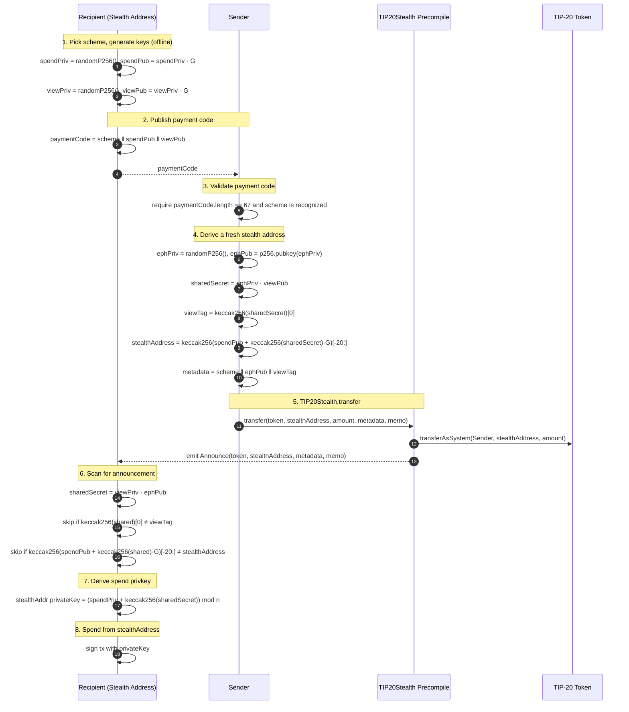
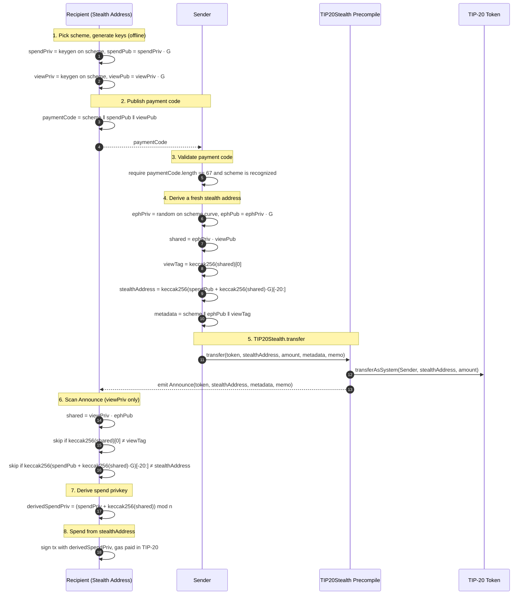

# TIP-1069: Stealth Addresses

## Abstract

This TIP standardizes stealth addresses (also known as "private
addresses") on Tempo. It specifies:

- a new `TIP20Stealth` precompile exposing a single `transfer`
  entrypoint that atomically forwards a TIP-20 transfer from
  `msg.sender` to a derived stealth address and emits a canonical
  `Announce` event,
- a minimal additive TIP-20 hook, `transferAsSystem`, that
  `TIP20Stealth` uses to perform the underlying balance move while
  preserving the original sender as the debited account,
- curve-agnostic derivation semantics with two v1 schemes: `secp256k1`
  and `P256`.

`TIP20Stealth` is the single canonical source of stealth announcements
across all TIP-20 tokens.

Recipients share a "payment code" — a scheme identifier plus a
long-lived public-key pair. Senders use it to derive a fresh stealth
address per payment. Payment-code delivery is out of scope and happens
through authenticated offchain channels.

Stealth addresses are normal Tempo accounts of the payment code's key
type. They pay their own gas from the TIP-20 balance the sender
deposits. No approval, no intermediate custody — the precompile debits
`msg.sender` and credits the stealth address in a single atomic
operation.

The TIP exists so wallets and indexers can interoperate around one
entrypoint, one event, and one derivation rule.

## Motivation

Stealth-address schemes give recipients per-payment unlinkability:
every payment lands at a fresh, unlinkable address that only the
recipient can recognize and spend from.

On chains where gas is a separate asset, the recipient has no gas at
the derived address. Spending requires external relayers or searchers,
which adds infrastructure and creates deanonymization channels.

Tempo charges gas in TIP-20. When a sender deposits, say, `100 USDC`
to a stealth address, that balance covers both the eventual payment
and the gas needed to make it. The "no gas at the recipient address"
problem disappears. Stealth addresses become first-class Tempo
accounts the recipient can spend from directly.

A registry of payment codes is not required for derivation — the
sender only needs an authenticated payment code. This TIP leaves
discovery to wallets: address books, QR codes, encrypted messaging,
resolvers, or future TIPs.

Folding the transfer + announce flow into a dedicated precompile
(rather than extending TIP-20 with the full stealth surface) keeps
the TIP-20 surface minimal, isolates stealth concerns from the rest
of TIP-20, and gives wallets a single canonical event stream to
subscribe to across all tokens. The only addition to TIP-20 itself is
one privileged primitive (`transferAsSystem`) that other system
precompiles MAY also reuse in the future.

What remains is purely a coordination problem. Wallets need:

- a canonical event to scan,
- a single atomic transfer + announce path,
- canonical derivation semantics.

This TIP fixes those three pieces. Future TIPs MAY introduce
protocol-level optimizations (sponsored gas earmarks, scoped spending
policies, discovery). This TIP is the minimum viable surface that
delivers stealth addresses on Tempo today.

## Privacy model

This TIP provides **recipient privacy only**. It is not a mixer and
does not attempt to anonymize the sender.

What is hidden:

- The identity of the recipient. Each payment lands at a fresh
  `stealthAddress` that is unlinkable to the recipient's payment code
  without `viewPrivkey`.

What is NOT hidden:

- The sender. `msg.sender` of `TIP20Stealth.transfer` is public.
- The amount transferred.
- That a stealth payment occurred.

## Overview

At a high level:

- **Recipient.** Generates a reusable payment code and shares it
  through an authenticated out-of-band channel.
- **Sender.** Uses the payment code to derive a one-time stealth
  address, then calls the `TIP20Stealth` precompile to deposit funds
  and emit a canonical announcement in one transaction.
- **Recipient wallet.** Scans `Announce` events from the
  `TIP20Stealth` precompile with the view privkey, recovers only the
  stealth addresses that belong to it, and spends from them as normal
  Tempo accounts (secp256k1 or P256 — matching the payment code's
  scheme).



## Assumptions

- Tempo charges transaction gas in TIP-20 from the sender's TIP-20
  balance. A fresh Tempo account (secp256k1 or P256) that holds a
  TIP-20 balance can submit transactions without needing any other
  prefunding.
- Tempo accounts are addressable as `keccak256(pubX || pubY)[-20:]` for
  both secp256k1 and P256 keys (per TIP-0001). A stealth address
  derived per this TIP is therefore a first-class Tempo account of the
  same key type as the payment code's scheme.
- Two schemes are supported in v1: `secp256k1` (`0x01`) and `P256`
  (`0x02`). Other curves and derivation schemes are out of scope and
  reserved for future TIPs.
- Senders are responsible for obtaining and authenticating the
  recipient's payment code through the channel that delivered it.
- Recipients are responsible for scanning `Announce` events emitted by
  the `TIP20Stealth` precompile offchain.
- TIP-20 exposes a `transferAsSystem(from, to, amount)` primitive
  callable only by trusted system precompiles (including
  `TIP20Stealth`). It performs a balance move equivalent to
  `transfer(to, amount)` being called by `from`, including emitting
  the standard `Transfer` event with `from`.
- `TIP20Stealth.transfer` succeeds only when `stealthAddress` is the
  final credited recipient. Recipient resolution or receive-policy
  handling MUST NOT redirect the deposit to another address.
- TIP-1022 `resolveRecipient` passes through stealth addresses unchanged
  because they are normal Tempo accounts with no virtual-address or
  linked-account registration.
---

# Specification

## Terminology

| Term | Description |
| --- | --- |
| Scheme | One byte identifying the curve and derivation rule. `0x01` = secp256k1, `0x02` = P256. |
| Spend key | Recipient keypair `(spendPrivkey, spendPubkey)` on the scheme's curve. `spendPrivkey` derives the signing key for every stealth address, so it MUST stay with the recipient and is required to spend funds. |
| View key | Recipient keypair `(viewPrivkey, viewPubkey)` on the scheme's curve. `viewPrivkey` is needed to detect which `Announce` events belong to the recipient. It does NOT grant spend authority. |
| Payment code | `scheme \|\| spendPubkey \|\| viewPubkey` (67 bytes): a scheme identifier plus the recipient's spend and view pubkeys, shared so senders can derive stealth addresses. |
| Ephemeral pubkey | A one-time public key on the scheme's curve that the sender publishes per payment. |
| Stealth address | A Tempo account derived deterministically from a payment code and an ephemeral pubkey, of the same key type as the payment code's scheme. |
| View tag | One byte equal to `keccak256(sharedSecret)[0]`, used for fast scan rejection. |
| Shared secret | `ephemeralPrivkey · viewPubkey == viewPrivkey · ephemeralPubkey`, computed on the scheme's curve and serialized as the 33-byte compressed point encoding. |
| Metadata | Packed 35-byte announcement payload: `scheme (1) \|\| ephemeralPubkey (33) \|\| viewTag (1)`. |

## Schemes

| Value  | Name        | Curve              | Pubkey encoding    |
| ------ | ----------- | ------------------ | ------------------ |
| `0x01` | `secp256k1` | secp256k1          | 33-byte compressed |
| `0x02` | `P256`      | P-256 (secp256r1)  | 33-byte compressed |

Both schemes derive the stealth address as `keccak256(addressPubkey.X ||
addressPubkey.Y)[-20:]`, matching Tempo's native account derivation for
secp256k1 and P256 keys (TIP-0001).

All other scheme values are reserved. Wallets MUST reject `Announce`
events and payment codes with unrecognized scheme bytes.

## Metadata layout

Senders and recipients exchange the scheme, ephemeral pubkey, and view
tag as a single packed `bytes` blob called `metadata`. For schemes
defined in this TIP, the layout is fixed at 35 bytes:

```
offset  size  field
------  ----  --------------------------------
0       1     scheme
1       33    ephemeralPubkey (compressed)
34      1     viewTag
```

The first byte is always `scheme`. Future TIPs MAY define new schemes
with different `metadata` length and layout, but `metadata[0]` MUST
remain `scheme` so that wallets can dispatch on it before parsing the
rest.

## Derivation (curve-parameterized)

Let `scheme` select the curve and generator `G` as defined in
Schemes. Given a recipient payment code `(scheme, spendPubkey,
viewPubkey)` and a sender-chosen `ephemeralPrivkey` on the same curve:

```
ephemeralPubkey = ephemeralPrivkey · G
sharedSecret    = ephemeralPrivkey · viewPubkey       // curve point, 33-byte compressed
viewTag         = keccak256(sharedSecret)[0]
addressPubkey   = spendPubkey + keccak256(sharedSecret) · G
stealthAddress  = keccak256(addressPubkey.X || addressPubkey.Y)[-20:]
```

The recipient recovers it by computing `sharedSecret = viewPrivkey ·
ephemeralPubkey` and the corresponding `stealthAddress`. The recipient's
spend privkey for `stealthAddress` is
`(spendPrivkey + keccak256(sharedSecret)) mod n`, where `n` is the curve
order.

Group operations follow standard conventions for the scheme's curve.
All pubkeys (spend, view, ephemeral, derived) are 33-byte compressed
encodings on that curve.

## TIP-20 extension: `transferAsSystem`

This TIP adds one privileged primitive to TIP-20. It is the only
modification to TIP-20.

```solidity
interface ITIP20System {
    /// @notice System-only balance move equivalent to `transfer(to, amount)`
    ///         being called by `from`. Callable only by trusted system
    ///         precompiles (e.g. TIP20Stealth).
    /// @dev MUST debit `from`, credit `to`, emit the standard TIP-20
    ///      `Transfer(from, to, amount)` event, and honor the same fee
    ///      policy as `transfer`. MUST revert when called by any address
    ///      not in the system precompile allowlist.
    function transferAsSystem(
        address from,
        address to,
        uint256 amount
    ) external returns (bool);
}
```

`transferAsSystem` MUST:

1. Revert unless `msg.sender` is in the protocol-defined trusted system
   precompile allowlist.
2. Decrease `from`'s TIP-20 balance by `amount` and increase `to`'s
   TIP-20 balance by `amount`, with no other balance changes.
3. Emit `Transfer(from, to, amount)` — the standard TIP-20 event, with
   `from` as the source.
4. Honor the same fee policy that `transfer(to, amount)` would honor
   when called by `from`.
5. Return `true` on success; revert on any failure path.

`transferAsSystem` MUST NOT consult or consume allowance. It is a
system-level balance move, not a delegated transfer.

The trusted system precompile allowlist is maintained by the protocol
and includes `TIP20Stealth` at activation. Future system precompiles
that need to move TIP-20 balances on behalf of users MAY be added to
the allowlist by subsequent TIPs.

## TIP20Stealth precompile

A new system precompile, `TIP20Stealth`, exposes a single transfer
entrypoint and a single event. Its address is fixed at TIP activation
(TBD).

```solidity
interface ITIP20Stealth {
    /// @notice Emitted for each stealth payment routed through TIP20Stealth.
    /// @param token          The TIP-20 token transferred.
    /// @param stealthAddress The derived stealth Tempo account receiving funds.
    /// @param metadata       Packed `scheme || ephemeralPubkey || viewTag`.
    ///                       For v1 schemes this is exactly 35 bytes; see
    ///                       Metadata layout.
    /// @param memo           Opaque memo bytes.
    event Announce(
        address indexed token,
        address indexed stealthAddress,
        bytes metadata,
        bytes memo
    );

    /// @notice Atomically transfer `amount` of `token` from msg.sender to
    ///         `stealthAddress` and emit a canonical Announce event.
    function transfer(
        address token,
        address stealthAddress,
        uint256 amount,
        bytes calldata metadata,
        bytes calldata memo
    ) external returns (bool);
}
```

`TIP20Stealth.transfer` MUST:

1. Revert if `metadata.length == 0`.
2. Revert if `metadata[0]` (the `scheme` byte) is not a recognized
   scheme value (currently `0x01` or `0x02`).
3. Revert if `metadata.length` does not match the expected length for
   the recognized `scheme` (35 bytes for both v1 schemes).
4. Call `ITIP20System(token).transferAsSystem(msg.sender,
   stealthAddress, amount)`. The resulting balance move MUST be
   observationally equivalent to `msg.sender` calling
   `TIP20(token).transfer(stealthAddress, amount)` directly,
   including emitting the standard TIP-20 `Transfer` event, honoring
   fee policies, and updating balances.
5. Revert if the underlying `transferAsSystem` reverts, or if the
   final credited recipient would be any address other than
   `stealthAddress`. Recipient resolution or receive-policy handling
   MUST NOT redirect the deposit.
6. Emit `Announce(token, stealthAddress, metadata, memo)` from the
   `TIP20Stealth` precompile address.
7. Return `true` on success.

The precompile MUST NOT parse `ephemeralPubkey` out of `metadata` for
curve-membership validation. Offchain scanners detect mismatches via
the `viewTag` / `stealthAddress` check. Onchain curve validation is
unnecessary and expensive.

`TIP20Stealth.transfer` MUST NOT require or consume allowance. It
relies on `transferAsSystem`, which itself never consults allowance.

The precompile MUST NOT hold any TIP-20 balance at the start or end
of any external call. Funds flow directly from `msg.sender` to
`stealthAddress`.

Payment-lane classifiers MUST treat `TIP20Stealth.transfer` as a
recipient-bearing TIP-20 payment operation wherever a plain TIP-20
`transfer` is eligible. Fee-discount policies with narrower allowlists
MAY opt in separately; this TIP does not change those policies.

## Wallet behavior

### Sender

To send `amount` of `token` using a payment code:

1. Obtain `paymentCode` through an authenticated out-of-band channel. If
   no authenticated payment code is available, abort.
2. Verify `paymentCode.length == 67`. Decode `scheme = paymentCode[0]`,
   then `(spendPubkey, viewPubkey) = paymentCode[1:34], paymentCode[34:67]`.
   Abort if `scheme` is not a recognized scheme value.
3. Generate fresh `ephemeralPrivkey` on `scheme`'s curve; derive
   `ephemeralPubkey`, `sharedSecret`, `viewTag`, `stealthAddress` as in
   Derivation.
4. Build `metadata = scheme || ephemeralPubkey || viewTag` (35 bytes
   for v1 schemes; see Metadata layout).
5. Set `memo` to encrypted memo bytes or the empty byte string.
6. `TIP20Stealth.transfer(token, stealthAddress, amount, metadata,
   memo)`.

Senders MAY include arbitrary `memo` bytes. Wallets SHOULD encrypt
user-facing memos or use empty bytes.

### Recipient (sharing)

The recipient:

1. Picks `scheme` — typically the same curve as its primary wallet key
   type.
2. Generates `(spendPrivkey, spendPubkey)` and `(viewPrivkey,
   viewPubkey)` on that curve offline.
3. Shares `scheme || spendPubkey || viewPubkey` (67 bytes) through an
   authenticated out-of-band channel.

No further sharing is required unless the recipient rotates keys or
schemes.

### Recipient (scanning)

Recipients subscribe to `Announce` events from the `TIP20Stealth`
precompile. Because all stealth transfers across all TIP-20 tokens
flow through a single precompile, scanning is a single event-source
subscription that can be filtered by `token` if desired.

For each new `Announce(token, stealthAddress, metadata, memo)` event:

1. If `metadata.length == 0`, skip.
2. Parse `scheme = metadata[0]`. If `scheme` does not match the payment
   code's scheme, skip.
3. Validate `metadata.length` matches the expected length for `scheme`
   (35 bytes for v1 schemes); skip if not.
4. Parse `ephemeralPubkey = metadata[1:34]` and `viewTag = metadata[34]`.
5. Compute `sharedSecret' = viewPrivkey · ephemeralPubkey` on
   `scheme`'s curve.
6. If `keccak256(sharedSecret')[0] != viewTag`, skip.
7. Compute `candidate = keccak256(addressPubkey.X || addressPubkey.Y)[-20:]`
   where `addressPubkey = spendPubkey + keccak256(sharedSecret') · G`.
8. If `candidate != stealthAddress`, skip.
9. Record `(token, stealthAddress, spendKey = (spendPrivkey +
   keccak256(sharedSecret')) mod n)`.

Scanners MAY see the same `Announce` event multiple times (e.g.
after reorgs, log re-replay, or multiple sources). Wallets MUST treat
events with identical `(token, stealthAddress, metadata, memo)` fields
as a single scan record.

### Recipient (spending)

The recipient signs transactions from `stealthAddress` using the
derived spend privkey on `scheme`'s curve. The account behaves like
any other Tempo account of that key type — no special transaction
format, no extra protocol call.

### Recipient (privacy hygiene)

Amount and timing of `TIP20Stealth.transfer` calls are public. A
passive observer can attempt to correlate a recipient's eventual
cash-out against the original deposits by matching amounts and
timestamps. Recipients can defeat this with two wallet-level
practices. Neither requires protocol changes — both rely only on the
recipient generating their own ephemeral keys and calling
`TIP20Stealth.transfer` to themselves.

**Sweep.** Before withdrawing funds to any non-stealth destination
(e.g. a CEX deposit address, an EOA), the recipient SHOULD first sweep
balances from received stealth addresses into a freshly-derived
stealth address under the same payment code. The cash-out address is
then linked only to the sweep target, not to any sender-published
address.

**Split.** Recipients SHOULD split sweeps and withdrawals across
randomized amounts and time intervals. With splitting, no single
on-chain amount equals any individual deposit, defeating naive
amount-matching correlation.

The minimum effective practice is a single sweep hop before cash-out.
Additional hops and splits monotonically increase unlinkability at the
cost of more on-chain transactions.

### Sender (privacy hygiene)

`msg.sender` of `TIP20Stealth.transfer` is public. Senders who do not
want their known identity linked to a payment SHOULD pay from a
stealth address they themselves control rather than from a labelled
wallet. This is the symmetric form of the recipient sweep — same
primitive, applied to outgoing payments.

**Pay from a self-stealth address.** Senders that already receive
stablecoin income at stealth addresses (e.g. via their own payment
code) SHOULD route outgoing `TIP20Stealth.transfer` calls through one
of those balances. The on-chain `msg.sender` is then a fresh stealth
address rather than the sender's primary wallet, and observers cannot
trivially link the payment to the sender's published identity.

**Self-hop before sending.** Senders without an existing stealth
balance SHOULD first call `TIP20Stealth.transfer` to themselves
(using their own payment code and a fresh ephemeral key), then issue
the outbound payment from the resulting stealth address. The cost is
one extra transaction; the benefit is that the outbound `msg.sender`
is no longer the sender's labelled wallet.

Neither practice hides the amount or the fact that a stealth payment
occurred — those leaks are intrinsic to operating on a transparent
ledger without commitments. Amount hiding requires a separate
shielded-transfer construction and is out of scope for this TIP.

## End-to-end walkthrough

A full lifecycle of one stealth payment of `amount` of `token` from
`Sender` to `Recipient`.



1. **Recipient picks a scheme and generates keys (one-time, offline).**
   Pick `scheme` (`0x01` secp256k1 or `0x02` P256). Generate two
   independent keypairs on `scheme`'s curve: `(spendPrivkey,
   spendPubkey)` and `(viewPrivkey, viewPubkey)`. Both pubkeys are
   33-byte compressed. The recipient stores both keys securely.

2. **Recipient publishes payment code (one-time).**
   Concatenate `paymentCode = scheme || spendPubkey || viewPubkey`
   (67 bytes) and share it with the sender over an authenticated
   out-of-band channel (address book, QR, encrypted DM, etc.). No
   onchain action.

3. **Sender obtains and validates the payment code.**
   Receive `paymentCode` over the same authenticated channel, confirm
   it really belongs to the intended recipient, and check
   `paymentCode.length == 67` and `scheme` is recognized. Split into
   `(scheme, spendPubkey, viewPubkey)`.

4. **Sender derives a fresh stealth address.**
   Pick a random `ephemeralPrivkey` on `scheme`'s curve, then compute:

   ```
   ephemeralPubkey = ephemeralPrivkey · G
   sharedSecret    = ephemeralPrivkey · viewPubkey
   viewTag         = keccak256(sharedSecret)[0]
   addressPubkey   = spendPubkey + keccak256(sharedSecret) · G
   stealthAddress  = keccak256(addressPubkey.X || addressPubkey.Y)[-20:]
   ```

   `stealthAddress` is a normal Tempo account of `scheme`'s key type
   that the recipient will later control.

5. **Sender calls `TIP20Stealth.transfer`.**
   Pack `metadata = scheme || ephemeralPubkey || viewTag` (35 bytes for
   v1 schemes) and submit a single transaction:

   ```
   TIP20Stealth.transfer(token, stealthAddress, amount, metadata, memo)
   ```

   The precompile calls `TIP20(token).transferAsSystem(msg.sender,
   stealthAddress, amount)`, which debits the sender, credits
   `stealthAddress`, and emits the standard TIP-20 `Transfer` event.
   The precompile then emits `Announce(token, stealthAddress,
   metadata, memo)`. No allowance, no intermediate custody, no
   relayer.

6. **Recipient (or its scanner) processes the `Announce` event.**
   For every announce emitted by the `TIP20Stealth` precompile
   (filter by `token` if desired):

   1. Parse `scheme = metadata[0]`. If `scheme` does not match the
      payment code's scheme or the length is wrong for `scheme`, drop
      it.
   2. Parse `ephemeralPubkey = metadata[1:34]` and `viewTag =
      metadata[34]`.
   3. Compute `sharedSecret' = viewPrivkey · ephemeralPubkey` on
      `scheme`'s curve.
   4. If `keccak256(sharedSecret')[0] != viewTag`, drop it.
   5. Compute `candidate = keccak256(addressPubkey.X ||
      addressPubkey.Y)[-20:]` where `addressPubkey = spendPubkey +
      keccak256(sharedSecret') · G`. If `candidate != stealthAddress`,
      drop it.
   6. Record `(token, stealthAddress)` as belonging to this recipient.

7. **Recipient derives the spend privkey.**
   For each matched announcement, the recipient (holding `spendPrivkey`)
   computes `derivedSpendPrivkey = (spendPrivkey +
   keccak256(sharedSecret')) mod n`, where `n` is `scheme`'s curve
   order. This privkey controls `stealthAddress`.

8. **Recipient spends from `stealthAddress`.**
   Sign any normal transaction from `stealthAddress` with
   `derivedSpendPrivkey` on `scheme`'s curve. Gas is paid in TIP-20
   out of the balance deposited in step 5; no further setup is needed.
   To preserve unlinkability across spends, the recipient SHOULD treat
   `stealthAddress` as a one-shot payment vehicle.

## Backward compatibility

The `TIP20Stealth` precompile is additive. The only modification to
TIP-20 itself is the addition of a `transferAsSystem` primitive
callable only by trusted system precompiles; existing TIP-20
entrypoints, balances, allowances, storage, and events are unchanged.

Wallets that do not implement stealth-address scanning are unaffected.
They continue to see stealth addresses as ordinary Tempo accounts.

Activation of `TIP20Stealth` and the `transferAsSystem` hook requires
a hardfork.

## Reference implementations

The following MUST be published alongside this TIP:

- a reference Rust implementation of the `TIP20Stealth` precompile
  including `transfer` and `Announce`;
- a reference implementation of the TIP-20 `transferAsSystem`
  primitive, including the system-precompile allowlist check;
- derivation test vectors covering both `secp256k1` and `P256`
  schemes.

The precompile address is fixed at TIP activation and SHOULD be added
to the wallet ecosystem's well-known configuration (e.g. the canonical
precompile list in Tempo wallet libraries).

---

# Invariants

1. **Direct TIP-20 custody**: A successful `TIP20Stealth.transfer`
   MUST decrease `msg.sender`'s TIP-20 balance by `amount` and
   increase `stealthAddress`'s TIP-20 balance by `amount`, with no
   other balance changes — no intermediate custody, no redirect to
   an alternate recipient.

2. **Announce-on-deposit atomicity**: A successful
   `TIP20Stealth.transfer` call MUST emit exactly one `Announce`
   event for that transfer. A reverting `TIP20Stealth.transfer` call
   MUST emit zero `Announce` events.

3. **Single Announce source**: All stealth transfers across all
   TIP-20 tokens MUST emit `Announce` from the `TIP20Stealth`
   precompile address. Wallets MAY subscribe to that single log
   source to receive announcements across all tokens.

4. **Event topic determinism**: The `Announce` event signature MUST
   be identical across all calls. Wallets MUST be able to scan all
   stealth payments with a single topic filter against the
   `TIP20Stealth` precompile address.

5. **`transferAsSystem` access control**: `TIP20.transferAsSystem`
   MUST revert when invoked by any caller not in the protocol-defined
   trusted system precompile allowlist. Direct user calls MUST always
   revert.

6. **Payment code encoding**: Implementations MUST reject payment
   codes whose length is not 67 bytes, or whose first byte (`scheme`)
   is not a recognized scheme value.

7. **Scheme consistency**: The `scheme` byte at `metadata[0]` in the
   emitted `Announce` MUST equal the scheme used to derive
   `stealthAddress` and to encode `ephemeralPubkey`. The `metadata`
   argument passed to `TIP20Stealth.transfer` MUST appear
   byte-for-byte in the emitted `Announce`.

8. **No virtual-address marking**: A stealth address derived per this
   TIP MUST NOT be marked as a TIP-1022 virtual address by virtue of
   stealth-address derivation alone.

9. **Derivation determinism**: For any fixed `(scheme, spendPubkey,
   viewPubkey, ephemeralPubkey)`, the derived `stealthAddress` MUST
   be identical across all implementations.

10. **View tag soundness**: For any payment, `metadata[34]` MUST equal
    `keccak256(sharedSecret)[0]`.

11. **Duplicate Announce idempotency**: A scanner MUST treat two
    `Announce` events with identical `(token, stealthAddress,
    metadata, memo)` fields as a single scan record.

## Security considerations

### Sender ↔ stealth-address linkage

`TIP20Stealth.transfer` publicly transfers funds from `msg.sender` to
the stealth address. This TIP does not attempt to hide the sender.

Senders that wish to remain unlinked MUST source funds through a
privacy-preserving channel — for example:

- their own prior stealth payment,
- a Zone,
- a privacy pool.

### Payment-code authenticity and linkage

This TIP does not define a payment-code registry. Authenticity is
provided by the delivery channel.

A sender MUST authenticate that the payment code belongs to the
intended recipient. Otherwise an attacker can substitute their own
payment code and receive funds at a stealth address they control.

The payment code itself reveals nothing about specific payments —
derived stealth addresses are unlinkable to the code without
`viewPrivkey`. The delivery channel, however, may link the recipient's
account, name, or identity to the code.

### Memo privacy

`memo` is emitted in the public `Announce` event. Wallets MUST NOT put
sensitive plaintext in `memo`. User-facing memo contents SHOULD be
encrypted for the recipient or omitted.

### Announcement authenticity

`Announce` is a scan signal, not proof of payment. Wallets MUST:

- scan only the `TIP20Stealth` precompile address,
- verify the matched stealth address's TIP-20 balance or the
  corresponding `Transfer` event before presenting funds as received.

### `transferAsSystem` privilege

`TIP20.transferAsSystem` is the only TIP-20 primitive that can move
funds without the originator's signature. The trust boundary for
unlinked balance moves is the protocol-defined system precompile
allowlist. Any TIP that adds a new precompile to that allowlist MUST
justify the added trust and document the precompile's expected
behavior.

### View privkey exposure

A leaked `viewPrivkey` lets an attacker identify all past and future
payments to that payment code. It does NOT grant spend authority.

### Cold-start anonymity set

The privacy property of stealth addresses scales with the number of
stealth payments on the network. Early adoption produces a small
anonymity set and weaker unlinkability. This is intrinsic to any
stealth-address scheme and not mitigated by this TIP.

### Refilling stealth-address balances

When a stealth address's balance is depleted, the recipient cannot
refill it from a known wallet without revealing the linkage.

- Wallets SHOULD treat stealth addresses as one-shot or short-lived
  payment vehicles.
- Recipients MAY rotate to a fresh stealth address per payment to
  preserve unlinkability across spends.
