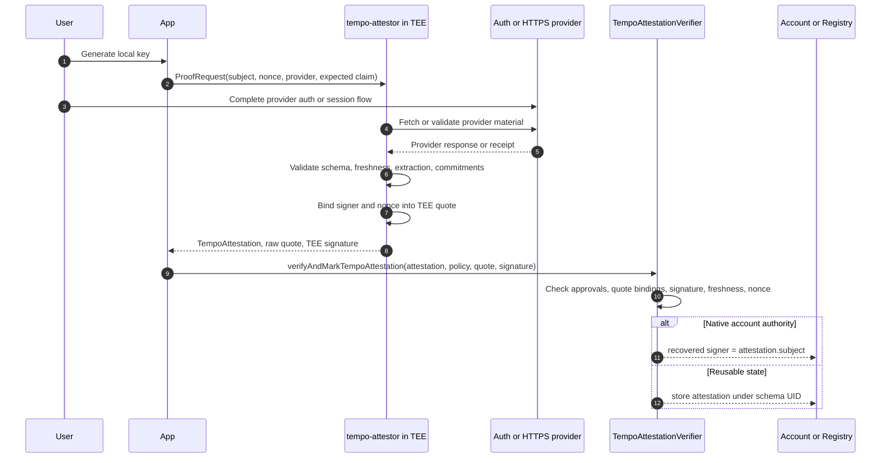

# TIP-1075: Tempo Attestations and Attested Signatures

## Abstract

This TIP defines **Tempo Attestations**: a protocol mechanism for accepting claims produced by approved trusted execution environments and using those claims as native account authority or reusable on-chain state.

The on-chain boundary is intentionally small. Tempo does not verify OAuth, browser flows, HTTP parsing, JSON extraction, or application credentials on chain. Those checks happen inside an approved TEE program. The chain verifies the signed claim, the TEE quote binding, provider approval, freshness, caller policy, and nonce consumption.

## Motivation

Tempo needs a standard way to use private offchain facts without putting the raw fact on chain.

The motivating flows are:

- **Login with existing auth systems and local keys**: a user generates a local private key, proves control of an existing auth-provider account to an approved TEE, and uses the resulting attestation to authorize the local key. The chain sees the local key or account target, schema commitments, and TEE verification material. It does not see the email address, provider account identifier, or their relationship.
- **Account recovery**: a user who loses a local key can satisfy a recovery policy with a fresh attested identity claim, optionally combined with another factor or delay. If one hosted auth provider alone can rotate keys, then the approved TEE service is a recovery signer. Accounts that need stricter noncustody should combine the attested identity with local policy.
- **Private human credentials**: applications can check human, uniqueness, age, jurisdiction, membership, or account-quality predicates while receiving only the minimum committed or disclosed claim.
- **Authenticated offchain data**: a TEE can fetch public or private web/API data, validate it against a provider schema, selectively disclose fields, and sign only the resulting commitment.
- **Reusable public state**: some attestations are one-shot signatures. Others should be discoverable, referenceable, and revocable on chain.

The common object is a fixed-width, schema-bound claim: an approved program in a verifiable execution environment signs a bounded statement about a subject.

## Overview

Tempo Attestations is a small stack of primitives.

```text
+--------------------------------------------------------------------------------+
| Applications                                                                   |
|                                                                                |
| auth login | account recovery | private credentials | authenticated data       |
| reusable attestations                                                          |
+--------------------------------------+-----------------------------------------+
                                       |
                                       | ProofRequest(subject, nonce, provider)
                                       v
+--------------------------------------------------------------------------------+
| tempo-attestor in an approved TEE                                             |
|                                                                                |
| provider schema -> provider receipt -> extracted claim -> private commitment   |
| TEE quote -> fixed-width TempoAttestation -> TEE signature                     |
+--------------------------------------+-----------------------------------------+
                                       |
                                       | TempoAttestation + raw quote + signature
                                       v
+--------------------------------------------------------------------------------+
| TempoAttestationVerifier                                                       |
|                                                                                |
| checks provider hash, claim type, policy, freshness, quote bindings, signature |
| optionally consumes (subject, nonce)                                           |
+------------------+-------------------------------------------------------------+
                   |
                   | verified attestation
                   |
       +-----------+-----------+
       |                       |
       v                       v
+------------------+   +---------------------------------------------------------+
| AttestedSignature|   | TempoAttestationRegistry                                |
| native authority |   | durable schemas, attestations, references, revocations   |
+------------------+   +---------------------------------------------------------+
```

Layer responsibilities:

- **TEE program** executes the external flow, validates the provider response, derives private commitments, and signs a fixed-width attestation.
- **TempoAttestationVerifier** verifies only the on-chain boundary: approved provider hash, claim type, TEE app policy, quote binding, TEE signer, signature, freshness, and nonce.
- **AttestedSignature** lets a verified attestation act as a native signature whose recovered signer is the attestation subject.
- **TempoAttestationRegistry** stores attestations that need durable discovery, references, or revocation.

This mirrors the current implementation shape: the dispatch layer routes a small ABI, while provider semantics remain in typed offchain code and are represented on chain by hashes and approval state.

## Reference Flow



The reference service flow is:

1. An app creates a `ProofRequest` with provider id, subject, nonce, session id, expected claim, creation time, expiry, and optional callback.
2. The TEE selects a provider schema. The schema defines the allowed source, request shape, response checks, extraction rules, disclosure policy, and freshness window.
3. The user completes the provider flow. For an OAuth or OIDC provider, the TEE can use scoped material to fetch the provider's account-info endpoint. The initial Google schema uses `GET https://www.googleapis.com/oauth2/v3/userinfo`.
4. The TEE validates the provider response, extracts the approved fields, and derives commitments for private fields.
5. The TEE creates a fixed-width `TempoAttestation`, binds the signer and nonce into the TEE quote, and signs the attestation hash.
6. The app submits the attestation either as an `AttestedSignature` or to `TempoAttestationRegistry`.

## Specification

### Naming

The umbrella name is **Tempo Attestations**.

The main protocol objects are:

- `TempoAttestation`: a fixed-width claim signed by an approved TEE signer.
- `TempoProviderSchema`: the offchain security artifact whose hash is approved on chain.
- `TempoAttestationVerifier`: the precompile that verifies attestations.
- `AttestedSignature`: a native signature type backed by a verified attestation.
- `TempoAttestationRegistry`: on-chain state for reusable attestations.
- `tempo-attestor`: the Rust service that runs inside an approved TEE and emits `TempoAttestation` proof material.

"Authenticated web" names the HTTPS response use case. It is a source of attestations, not the protocol brand.

### Precompile Addresses

The following addresses are reserved at T6:

| Precompile | Address | ASCII prefix |
|---|---|---|
| `TempoAttestationVerifier` | `0x4154544553540000000000000000000000000000` | `ATTEST` |
| `TempoAttestationRegistry` | `0x4154544553545245470000000000000000000000` | `ATTESTREG` |

TEE quote verification MAY be implemented inside `TempoAttestationVerifier` or factored into a separate verifier surface. The consensus requirement is the verified output, not a separate public interface.

### TempoAttestation

`TempoAttestation` is the fixed-width object accepted by the verifier.

```solidity
struct TempoAttestation {
    address subject;
    bytes32 providerHash;
    bytes32 claimType;
    bytes32 extractedHash;
    bytes32 nonce;
    bytes32 sessionId;
    uint64 issuedAt;
    uint64 expiresAt;
    bytes32 sourceHash;
    address teeApp;
    bytes32 composeHash;
    bytes32 deviceId;
    bytes32 quoteHash;
}
```

Field meanings:

- `subject`: the address the attestation authorizes or describes. For local-key auth, this is the locally generated key or account target, not the external auth account.
- `providerHash`: hash of the approved provider schema and verification policy.
- `claimType`: schema-specific claim type bound to `providerHash`.
- `extractedHash`: commitment to extracted fields and private commitments.
- `nonce`: replay protection. For attested signatures this SHOULD be the transaction signing hash or a schema-specific challenge that commits to it.
- `sessionId`: app/session binding.
- `issuedAt` and `expiresAt`: freshness limits.
- `sourceHash`: commitment to source metadata such as domain, URL template hash, method, and response policy.
- `teeApp`, `composeHash`, `deviceId`, `quoteHash`: TEE deployment and quote bindings.

### Verification Policy

Callers provide a policy that can only narrow verification.

```solidity
struct VerificationPolicy {
    address expectedSubject;
    bytes32 expectedProviderHash;
    bytes32 expectedClaimType;
    bytes32 expectedNonce;
    bytes32 expectedSourceHash;
    address expectedTEEApp;
    bytes32 expectedComposeHash;
    bytes32 expectedDeviceId;
    address expectedTEESigner;
    uint64 maxClaimAgeSeconds;
    uint64 maxFutureSkewSeconds;
}
```

Zero-valued TEE fields are wildcards in caller policy only. They do not bypass protocol approval state.

### TempoAttestationVerifier

The verifier exposes the following minimal surface:

```solidity
interface ITempoAttestationVerifier {
    function verifyTempoAttestation(
        TempoAttestation calldata attestation,
        VerificationPolicy calldata policy,
        bytes calldata rawQuote,
        bytes calldata signature
    ) external payable returns (bytes32 attestationHash, address teeSigner);

    function verifyAndMarkTempoAttestation(
        TempoAttestation calldata attestation,
        VerificationPolicy calldata policy,
        bytes calldata rawQuote,
        bytes calldata signature
    ) external payable returns (bytes32 attestationHash, address teeSigner);

    function hashTempoAttestation(TempoAttestation calldata attestation) external pure returns (bytes32);

    function isNonceUsed(address subject, bytes32 nonce) external view returns (bool);
}
```

Implementations MUST also expose owner-controlled approval state for:

- provider hash to claim type;
- TEE app;
- TEE compose hash;
- TEE device id, including an allow-any-device option;
- TEE signer.

The exact admin ABI is implementation-specific unless another TIP standardizes shared governance interfaces.

`verifyTempoAttestation` MUST fail unless:

- `attestation.subject == policy.expectedSubject`;
- `attestation.providerHash == policy.expectedProviderHash`;
- `attestation.claimType == policy.expectedClaimType`;
- `attestation.nonce == policy.expectedNonce`;
- `attestation.sourceHash == policy.expectedSourceHash`;
- any nonzero expected TEE policy field matches the attestation or recovered quote output;
- `providerHash` is approved for `claimType`;
- `teeApp`, `composeHash`, `deviceId`, and recovered TEE signer are approved under protocol state;
- `block.timestamp <= expiresAt`;
- `issuedAt <= block.timestamp + maxFutureSkewSeconds`;
- `block.timestamp - issuedAt <= maxClaimAgeSeconds`, when `block.timestamp >= issuedAt`;
- `keccak256(rawQuote) == quoteHash`;
- quote parsing verifies the supported TEE format and extracts a signer and nonce;
- the quote binds the extracted signer to the expected report-data field;
- the quote binds the nonce to `attestation.nonce`;
- the quote binds the compose hash to `attestation.composeHash`;
- the TEE signature verifies over `hashTempoAttestation(attestation)`.

`verifyAndMarkTempoAttestation` additionally MUST fail if `(subject, nonce)` was already consumed and MUST consume it before returning.

The current implementation uses a domain-separated fixed-width attestation hash and accepts TEE secp256k1 signatures over the corresponding signed-message digest. T6 clients and verifier code MUST use one canonical digest.

### Native Attested Signature

T6 adds `SIGNATURE_TYPE_ATTESTED = 0x06` unless another accepted TIP allocates that byte first.

The wire format is:

```text
0x06 || abi.encode(
    TempoAttestation attestation,
    VerificationPolicy policy,
    bytes rawQuote,
    bytes teeSignature
)
```

For a Tempo transaction with signing hash `H`, an attested signature is valid if:

- `policy.expectedSubject == attestation.subject`;
- `attestation.nonce == H` or `attestation.extractedHash` commits to `H` under the approved schema;
- `TempoAttestationVerifier.verifyAndMarkTempoAttestation` succeeds;
- the approved `claimType` is allowed for native signature use.

The recovered signer is `attestation.subject`.

Attested signatures are a native signature type, not an access-key feature. They can authorize any account action that accepts native Tempo signatures, including local key authorization, key rotation, recovery actions, and registry writes.

Because attested signature verification depends on protocol state, consensus validation MUST recover attested signers through the verifier. Stateless helpers MAY decode the signature and return an unsupported-stateful-signature error.

### TempoAttestationRegistry

`TempoAttestationRegistry` stores attestations that should become durable on-chain state.

The registry has three concepts:

- **Schema**: a registered schema string, resolver, revocability flag, registerer, and schema UID.
- **Attestation**: recipient, attester, schema UID, optional reference UID, expiration, revocation time, data hash, and optional public data.
- **Resolver**: optional application logic called before attestation creation or revocation.

Required functions:

```solidity
interface ITempoAttestationRegistry {
    function registerSchema(
        string calldata schema,
        address resolver,
        bool revocable
    ) external returns (bytes32 schemaUID);

    function attest(
        bytes32 schemaUID,
        address recipient,
        uint64 expirationTime,
        bool revocable,
        bytes32 refUID,
        bytes32 salt,
        bytes calldata data
    ) external returns (bytes32 uid);

    function attestByTempoAttestation(
        bytes32 schemaUID,
        address recipient,
        uint64 expirationTime,
        bool revocable,
        bytes32 refUID,
        bytes32 salt,
        bytes calldata data,
        TempoAttestation calldata attestation,
        VerificationPolicy calldata policy,
        bytes calldata rawQuote,
        bytes calldata signature
    ) external payable returns (bytes32 uid);

    function revoke(bytes32 uid) external;
    function isAttestationValid(bytes32 uid) external view returns (bool valid);
}
```

Registry requirements:

- `schemaUID = keccak256(abi.encode(schema, resolver, revocable))`.
- Attestation UIDs MUST be collision-resistant over schema, recipient, attester, reference UID, expiration, revocability, data hash, timestamp, and salt.
- `attest` records `msg.sender` as the attester.
- `attestByTempoAttestation` first verifies the supplied `TempoAttestation`; the default attester is the verified TEE signer unless a resolver maps it to the verified subject.
- `dataHash = keccak256(data)`.
- Privacy-sensitive schemas SHOULD store commitments or empty data, not raw identity fields.
- `revoke` MUST fail unless the schema and attestation are revocable and the caller is authorized.
- `isAttestationValid(uid)` returns false for missing, expired, or revoked attestations.

## Example Flows

- **Login with existing auth systems and local keys**

  Goal: let a user prove control of an existing auth-provider account while keeping account control in a local private key.

  Flow:

  1. The client generates a local private key.
  2. The client creates a `ProofRequest` whose subject is the local public key address or account authorization target.
  3. The provider schema pins the account-info endpoint, success criteria, extracted fields, disclosure policy, and freshness window.
  4. The user completes the provider auth flow.
  5. The TEE validates the provider response and derives a private identity commitment using provider-private identity material and TEE-held secret material.
  6. The TEE signs a `TempoAttestation` whose subject is the local key address or account authorization target.
  7. The user submits a transaction that authorizes the local key, signed with `AttestedSignature`.

  Privacy rule: the chain MUST NOT receive the email address, provider account id, OAuth token, raw provider response, or a hash directly derived from an enumerable identifier.

- **Account recovery**

  Goal: let users recover from local key loss without making a hosted login provider the normal spending key.

  Flow:

  1. The account defines a recovery policy that accepts an attested identity claim plus any required delay or second factor.
  2. If the user loses the local key, the user repeats the provider flow with a new local key as the subject.
  3. The account accepts the new key only after the recovery policy succeeds.

  Custody rule: if one auth provider alone can rotate keys, then the approved TEE service is effectively a recovery signer for that account.

- **Private human credentials**

  Goal: prove a narrow eligibility statement without exposing broad identity material.

  Flow:

  1. The TEE validates the source credential or human signal.
  2. The TEE emits a schema-bound claim such as `isHuman`, `isUniqueForApp`, `ageOver18`, or `eligible`.
  3. The app consumes either a one-time attested signature or a registry attestation.

- **Authenticated web oracles**

  Goal: consume public or private web/API data with schema-bound freshness and selective disclosure.

  Flow:

  1. The app approves a provider schema for an HTTPS source.
  2. The TEE fetches or validates the source response.
  3. The verifier accepts only the source hash, extracted hash, provider hash, freshness, and TEE proof material.

- **Reusable credentials**

  Goal: make selected attestations discoverable, referenceable, and revocable.

  Flow:

  1. The app registers a schema in `TempoAttestationRegistry`.
  2. A user or TEE-backed attestation writes a registry entry.
  3. Later transactions reference the registry UID instead of replaying the original provider flow.

## Privacy Requirements

Identity attestations MUST be commitments, not public identifiers.

For auth-provider identity, the following values MUST NOT be emitted on chain:

- email address;
- normalized email address;
- provider stable account id, such as Google `sub`;
- OAuth access token or ID token;
- raw provider response;
- `hash(email)`;
- a hash of the provider stable account id unless combined with TEE-held secret material or another non-public value.

Recommended auth-provider identity commitment:

```text
identityCommitment = HMAC(teeIdentitySecret, "tempo:auth:v1" || provider || iss || aud || providerAccountId)
```

No user-managed salt is required. The privacy boundary comes from provider-private account material and TEE-held secret material. The chain only sees schema-specific commitments and local public key addresses.

Generic redaction commitments MAY use domain-separated hashes for high-entropy or non-enumerable values. They MUST NOT be used as privacy-preserving identity commitments for emails, usernames, phone numbers, provider account ids, or any other enumerable identifier.

Deployed auth-provider schemas MUST default to committed identity mode for login and recovery. Email disclosure is allowed only for applications that explicitly need public email display and accept the privacy loss.

## Observability

The following events MUST be emitted by the relevant verifier or registry surface:

```solidity
event ProviderHashApprovalUpdated(bytes32 indexed providerHash, bytes32 indexed claimType, bool approved);
event TEEAppApprovalUpdated(address indexed teeApp, bool approved);
event TEEComposeHashApprovalUpdated(address indexed teeApp, bytes32 indexed composeHash, bool approved);
event TEEDeviceApprovalUpdated(address indexed teeApp, bytes32 indexed deviceId, bool approved);
event TEEAllowAnyDeviceUpdated(address indexed teeApp, bool approved);
event TEESignerApprovalUpdated(address indexed teeApp, address indexed teeSigner, bool approved);

event TempoAttestationVerified(
    address indexed subject,
    bytes32 indexed providerHash,
    bytes32 indexed nonce,
    bytes32 claimType,
    bytes32 extractedHash,
    bytes32 sessionId,
    bytes32 sourceHash,
    address teeApp,
    bytes32 composeHash,
    bytes32 deviceId,
    bytes32 quoteHash,
    address teeSigner,
    bytes32 attestationHash,
    bytes32 digest
);

event SchemaRegistered(bytes32 indexed uid, address indexed registerer, address indexed resolver, bool revocable, string schema);
event Attested(address indexed recipient, address indexed attester, bytes32 uid, bytes32 indexed schemaUID);
event Revoked(address indexed recipient, address indexed attester, bytes32 uid, bytes32 indexed schemaUID);
```

## Invariants

- A `TempoAttestation` MUST NOT verify unless its provider hash, claim type, TEE app, compose hash, device policy, and TEE signer are approved in protocol state.
- Caller policy can only narrow verification.
- `verifyAndMarkTempoAttestation` MUST consume `(subject, nonce)` exactly once.
- An attested signature MUST recover exactly `attestation.subject`.
- Attested signature verification MUST bind to the transaction signing hash or to a schema-specific claim hash that commits to the transaction signing hash.
- Attested signatures MUST be invalid before T6.
- Registry schema UIDs MUST be deterministic.
- Registry attestation UIDs MUST be collision-resistant.
- `isAttestationValid(uid)` MUST be false for missing, expired, or revoked attestations.
- Privacy-sensitive schemas MUST NOT store public identifiers or enumerable hashes on chain.
