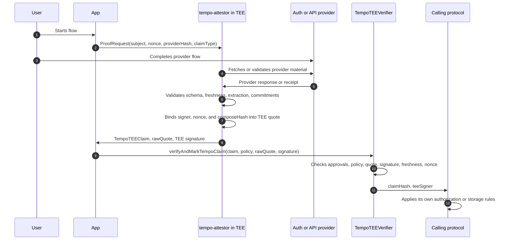

# TIP-1075: Tempo TEE Verifier

## Abstract

This TIP defines the **Tempo TEE Verifier**: a stateful precompile that verifies fixed-width claims signed by approved trusted execution environment programs.

The verifier is the lowest-level primitive in the Tempo attestation stack. It accepts a claim, caller policy, raw TEE quote, and TEE signature. It verifies protocol approval state, quote bindings, freshness, signature validity, and optional nonce consumption.

This TIP does not define a native attested signature type, access-key authorization, native multisig approval, account recovery, or an on-chain attestation registry. Those mechanisms can be specified in separate TIPs that consume this verifier.

## Motivation

Tempo needs a deterministic way to accept claims about offchain state without putting the raw state on chain.

The motivating uses are:

- **Existing auth systems**: a TEE can check a provider account flow and emit a private identity commitment. A later account-auth TIP can decide whether that claim is allowed to authorize a local key.
- **Private credentials**: a TEE can verify membership, uniqueness, age, jurisdiction, account quality, or eligibility and disclose only the committed or public predicate.
- **Authenticated API data**: a TEE can fetch public or private API data, validate a provider schema, and sign a bounded commitment for on-chain use.
- **Selective disclosure**: a TEE can reveal only the fields a caller requested while committing to the rest of the checked response.
- **Reusable claim inputs**: later registry or account TIPs can reuse a common verifier instead of each defining a new quote and signature format.

The chain should not parse browser flows, OAuth responses, HTTP transcripts, JSON paths, app credentials, or provider-specific state. Those checks happen inside an approved TEE program. The chain verifies only the deterministic boundary: claim hash, provider approval, claim type, quote binding, TEE program identity, TEE signer, freshness, caller policy, and nonce use.

## Overview

```text
+--------------------------------------------------------------------------------+
| Calling protocol or app                                                         |
|                                                                                |
| chooses providerHash, claimType, subject, nonce, sourceHash, freshness policy  |
+--------------------------------------+-----------------------------------------+
                                       |
                                       | ProofRequest
                                       v
+--------------------------------------------------------------------------------+
| tempo-attestor in an approved TEE                                             |
|                                                                                |
| provider flow -> response checks -> extraction -> private commitments          |
| TEE quote -> TempoTEEClaim -> TEE signature                                   |
+--------------------------------------+-----------------------------------------+
                                       |
                                       | TempoTEEClaim + rawQuote + signature
                                       v
+--------------------------------------------------------------------------------+
| TempoTEEVerifier precompile                                                    |
|                                                                                |
| approval state: providerHash, claimType, teeApp, composeHash, device, signer   |
| checks: policy, quoteHash, quote bindings, signature, freshness, nonce use     |
+--------------------------------------+-----------------------------------------+
                                       |
                                       | claimHash, teeSigner
                                       v
+--------------------------------------------------------------------------------+
| Follow-up TIPs                                                                 |
|                                                                                |
| attested signatures | account authorization | recovery | registry state        |
+--------------------------------------------------------------------------------+
```

Layer responsibilities:

- **TEE program** executes the external flow, validates the provider response, derives public fields and private commitments, and signs a fixed-width claim.
- **TempoTEEVerifier** verifies only the on-chain boundary and optionally marks a `(subject, nonce)` pair as used.
- **Calling protocols** decide what a verified claim means. A valid verifier result is not account authority by itself.

## Reference Flow



## Specification

### Naming

The protocol object names are:

- `TempoTEEClaim`: the fixed-width claim signed by an approved TEE signer.
- `VerificationPolicy`: caller-provided constraints that narrow verification.
- `TempoTEEVerifier`: the T6 precompile that verifies TEE claims.
- `tempo-attestor`: the offchain Rust service that runs inside an approved TEE and emits claim proof material.
- `providerHash`: commitment to the offchain provider schema and verification policy.
- `claimType`: provider-scoped claim format.

### Precompile Address

T6 reserves the following precompile address:

| Precompile | Address | ASCII prefix |
|---|---|---|
| `TempoTEEVerifier` | `0x5445455645524946590000000000000000000000` | `TEEVERIFY` |

### TempoTEEClaim

`TempoTEEClaim` is the fixed-width object accepted by the verifier.

```solidity
struct TempoTEEClaim {
    address subject;
    bytes32 providerHash;
    bytes32 claimType;
    bytes32 extractedHash;
    bytes32 nonce;
    bytes32 sessionId;
    uint64 issuedAt;
    uint64 expiresAt;
    bytes32 sourceHash;
    address teeApp;
    bytes32 composeHash;
    bytes32 deviceId;
    bytes32 quoteHash;
}
```

Field meanings:

- `subject`: the subject of the claim. This is not inherently an account signer. Calling protocols define how to interpret it.
- `providerHash`: approved hash of the provider schema and verification policy.
- `claimType`: claim format approved for `providerHash`.
- `extractedHash`: commitment to extracted fields, public predicates, and private commitments.
- `nonce`: caller challenge or digest. Use `verifyAndMarkTempoClaim` when the claim must be one-time.
- `sessionId`: app or session binding.
- `issuedAt`: TEE claim creation time.
- `expiresAt`: last timestamp at which the claim can verify.
- `sourceHash`: commitment to source metadata, such as domain, endpoint template, method, and response policy.
- `teeApp`: approved TEE app identity.
- `composeHash`: approved TEE program or deployment hash.
- `deviceId`: approved TEE device identity.
- `quoteHash`: `keccak256(rawQuote)`.

### VerificationPolicy

Callers provide a policy with every verification request.

```solidity
struct VerificationPolicy {
    address expectedSubject;
    bytes32 expectedProviderHash;
    bytes32 expectedClaimType;
    bytes32 expectedNonce;
    bytes32 expectedSourceHash;
    address expectedTEEApp;
    bytes32 expectedComposeHash;
    bytes32 expectedDeviceId;
    address expectedTEESigner;
    uint64 maxClaimAgeSeconds;
    uint64 maxFutureSkewSeconds;
}
```

Policy requirements:

- `expectedSubject`, `expectedProviderHash`, `expectedClaimType`, `expectedNonce`, and `expectedSourceHash` MUST exactly match the claim.
- Nonzero TEE fields MUST exactly match the claim or recovered quote output.
- Zero TEE fields are caller wildcards only. They do not bypass verifier approval state.
- `maxClaimAgeSeconds` and `maxFutureSkewSeconds` constrain freshness in addition to `expiresAt`.

### Interface

The verifier exposes the following interface:

```solidity
interface ITempoTEEVerifier {
    function verifyTempoClaim(
        TempoTEEClaim calldata claim,
        VerificationPolicy calldata policy,
        bytes calldata rawQuote,
        bytes calldata signature
    ) external view returns (bytes32 claimHash, address teeSigner);

    function verifyAndMarkTempoClaim(
        TempoTEEClaim calldata claim,
        VerificationPolicy calldata policy,
        bytes calldata rawQuote,
        bytes calldata signature
    ) external returns (bytes32 claimHash, address teeSigner);

    function hashTempoClaim(TempoTEEClaim calldata claim) external view returns (bytes32 claimHash);

    function toEthSignedMessageHash(bytes32 claimHash) external view returns (bytes32 digest);

    function isNonceUsed(address subject, bytes32 nonce) external view returns (bool used);

    function owner() external view returns (address owner);

    function isProviderHashApproved(bytes32 providerHash) external view returns (bool approved);

    function claimTypeForProviderHash(bytes32 providerHash) external view returns (bytes32 claimType);

    function isTEEAppApproved(address teeApp) external view returns (bool approved);

    function isTEEComposeHashApproved(address teeApp, bytes32 composeHash) external view returns (bool approved);

    function isTEEDeviceApproved(address teeApp, bytes32 deviceId) external view returns (bool approved);

    function isTEEAnyDeviceAllowed(address teeApp) external view returns (bool approved);

    function isTEESignerApproved(address teeApp, address teeSigner) external view returns (bool approved);

    function setProviderHashApproved(bytes32 providerHash, bytes32 claimType, bool approved) external;

    function setTEEAppApproved(address teeApp, bool approved) external;

    function setTEEComposeHashApproved(address teeApp, bytes32 composeHash, bool approved) external;

    function setTEEDeviceApproved(address teeApp, bytes32 deviceId, bool approved) external;

    function setTEEAllowAnyDevice(address teeApp, bool approved) external;

    function setTEESignerApproved(address teeApp, address teeSigner, bool approved) external;

    function transferOwnership(address newOwner) external;
}
```

The admin functions are owner-only. A later governance TIP may replace the owner model with a shared protocol governance interface.

### Approval State

The verifier stores the following approval state:

- `providerHash -> approved`
- `providerHash -> claimType`
- `teeApp -> approved`
- `(teeApp, composeHash) -> approved`
- `(teeApp, deviceId) -> approved`
- `teeApp -> allowAnyDevice`
- `(teeApp, teeSigner) -> approved`
- `(subject, nonce) -> used`

A provider hash approves exactly one claim type in this TIP. Multiple formats for the same provider should use distinct provider hashes.

Provider approval means only that the verifier can accept claims with that provider hash and claim type. It does not mean the claim can control an account, authorize a key, satisfy a recovery policy, or write registry state.

### Hashing

`hashTempoClaim` MUST use one canonical domain-separated hash:

```text
claimHash = keccak256(abi.encode(
    keccak256("TempoTEEClaim:v1"),
    subject,
    providerHash,
    claimType,
    extractedHash,
    nonce,
    sessionId,
    issuedAt,
    expiresAt,
    sourceHash,
    teeApp,
    composeHash,
    deviceId,
    quoteHash
))
```

`toEthSignedMessageHash` returns:

```text
keccak256("\x19Ethereum Signed Message:\n32" || claimHash)
```

The T6 verifier accepts secp256k1 TEE signatures over this digest.

### Quote Binding

The T6 verifier supports Intel TDX quote versions 4 and 5 with TD10 or TD15 quote bodies.

The quote MUST bind:

- `composeHash` to the quote configuration field used by the TEE platform;
- `teeSigner` and `nonce` to the 64-byte report-data field;
- the raw quote bytes to `claim.quoteHash`.

For the initial TDX binding:

```text
reportData[0:20]  = teeSigner
reportData[20:32] = 0
reportData[32:64] = nonce
```

The verifier MUST reject zero TEE signers, malformed quote lengths, unsupported quote versions, unsupported body types, mismatched quote hashes, mismatched compose hashes, and mismatched nonce bindings.

### Verification

`verifyTempoClaim` MUST fail unless all of the following hold:

- `claim.subject == policy.expectedSubject`;
- `claim.providerHash == policy.expectedProviderHash`;
- `claim.claimType == policy.expectedClaimType`;
- `claim.nonce == policy.expectedNonce`;
- `claim.sourceHash == policy.expectedSourceHash`;
- each nonzero expected TEE policy field matches the claim or recovered quote output;
- `providerHash` is approved and maps to `claimType`;
- `teeApp` is approved;
- `composeHash` is approved for `teeApp`;
- `deviceId` is approved for `teeApp`, unless `teeApp` allows any device;
- the recovered `teeSigner` is approved for `teeApp`;
- `block.timestamp <= expiresAt`;
- `issuedAt <= block.timestamp + maxFutureSkewSeconds`;
- `block.timestamp - issuedAt <= maxClaimAgeSeconds`, when `block.timestamp >= issuedAt`;
- `keccak256(rawQuote) == quoteHash`;
- quote parsing verifies the supported TEE format;
- quote parsing recovers the same `nonce`, `composeHash`, and `teeSigner` used for verification;
- the TEE signature verifies over `toEthSignedMessageHash(hashTempoClaim(claim))`.

`verifyTempoClaim` does not mutate nonce state.

`verifyAndMarkTempoClaim` additionally MUST:

- fail if `isNonceUsed(claim.subject, claim.nonce)` is true;
- run the same verification as `verifyTempoClaim`;
- mark `(claim.subject, claim.nonce)` as used before returning;
- emit `TempoTEEClaimVerified`.

### Events

```solidity
event TempoTEEClaimVerified(
    address indexed subject,
    bytes32 indexed providerHash,
    bytes32 indexed nonce,
    bytes32 claimType,
    bytes32 extractedHash,
    bytes32 sessionId,
    bytes32 sourceHash,
    address teeApp,
    bytes32 composeHash,
    bytes32 deviceId,
    bytes32 quoteHash,
    address teeSigner,
    bytes32 claimHash,
    bytes32 digest
);

event ProviderHashApprovalUpdated(bytes32 indexed providerHash, bytes32 indexed claimType, bool approved);
event TEEAppApprovalUpdated(address indexed teeApp, bool approved);
event TEEComposeHashApprovalUpdated(address indexed teeApp, bytes32 indexed composeHash, bool approved);
event TEEDeviceApprovalUpdated(address indexed teeApp, bytes32 indexed deviceId, bool approved);
event TEEAllowAnyDeviceUpdated(address indexed teeApp, bool approved);
event TEESignerApprovalUpdated(address indexed teeApp, address indexed teeSigner, bool approved);
event OwnershipTransferred(address indexed oldOwner, address indexed newOwner);
```

### Privacy Requirements

The verifier treats `extractedHash` as opaque. Privacy-sensitive provider schemas MUST ensure that `extractedHash` is not directly enumerable.

For identity claims, provider schemas MUST NOT emit any of the following on chain:

- email address;
- normalized email address;
- provider stable account id;
- OAuth access token or ID token;
- raw provider response;
- `hash(email)`;
- any hash of an enumerable user identifier unless it is mixed with TEE-held secret material or another non-public value.

Identity commitments SHOULD be derived inside the TEE from provider-private account material and TEE-held secret material. No user-managed salt is required by this TIP.

### Authority Boundary

A verified `TempoTEEClaim` is a verified fact, not a signature.

Account-control mechanisms MUST NOT accept arbitrary verifier success as authority. Any later TIP that uses this verifier for local key authorization, account recovery, or native multisig approval MUST define:

- the exact `providerHash` and `claimType` formats it accepts;
- a purpose or capability allowlist for those formats;
- how the claim binds to the transaction, key authorization, recovery action, or multisig digest;
- how `subject` is interpreted;
- whether nonce consumption is required;
- what privacy commitments are required for identity claims.

For example, an account-auth TIP can choose to accept only identity claim formats from approved auth-provider schemas. Generic API-data claims would still verify through this TIP, but they would not become account authority.

### Future TIPs

The following mechanisms are intentionally left to separate TIPs:

- **Native attested signatures**: a stateful signature type that uses verifier output as a recovered signer.
- **Tempo transaction authorization sidecars**: transaction-level authorizations that bind a verified claim to a local-key authorization or recovery action.
- **Native multisig integration**: owner approvals that can be primitive signatures or narrowly scoped verified identity claims.
- **Tempo attestation registry**: durable on-chain schemas, claim references, expiration, and revocation.

## Invariants

- Verifier success MUST NOT imply account authority.
- Caller policy can only narrow verification.
- `providerHash`, `claimType`, `teeApp`, `composeHash`, device policy, and `teeSigner` MUST be approved in verifier state.
- `providerHash` MUST map to exactly the verified `claimType`.
- The raw quote hash MUST equal `claim.quoteHash`.
- The quote MUST bind the recovered TEE signer, nonce, and compose hash.
- The TEE signature MUST verify over the canonical claim digest.
- `verifyTempoClaim` MUST NOT consume nonce state.
- `verifyAndMarkTempoClaim` MUST consume `(subject, nonce)` exactly once.
- Privacy-sensitive provider schemas MUST NOT place public identifiers or enumerable hashes on chain.
