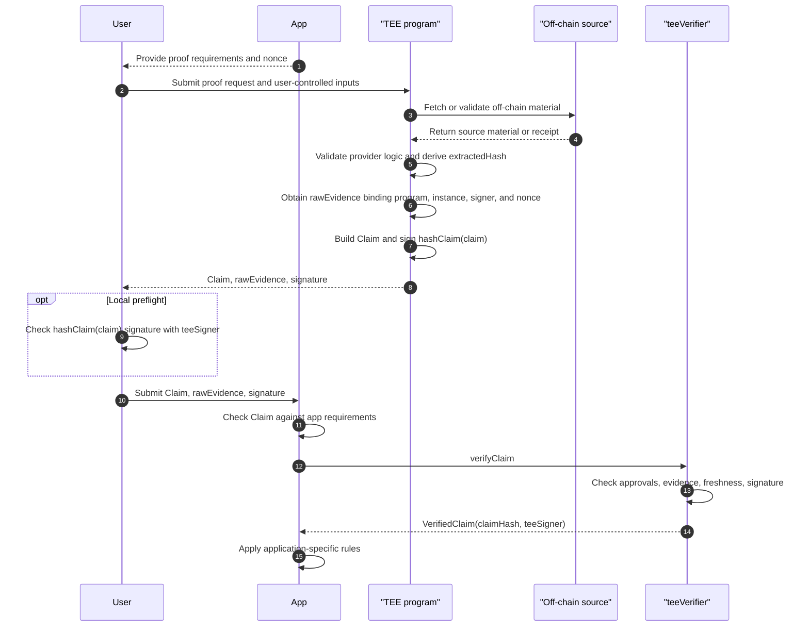
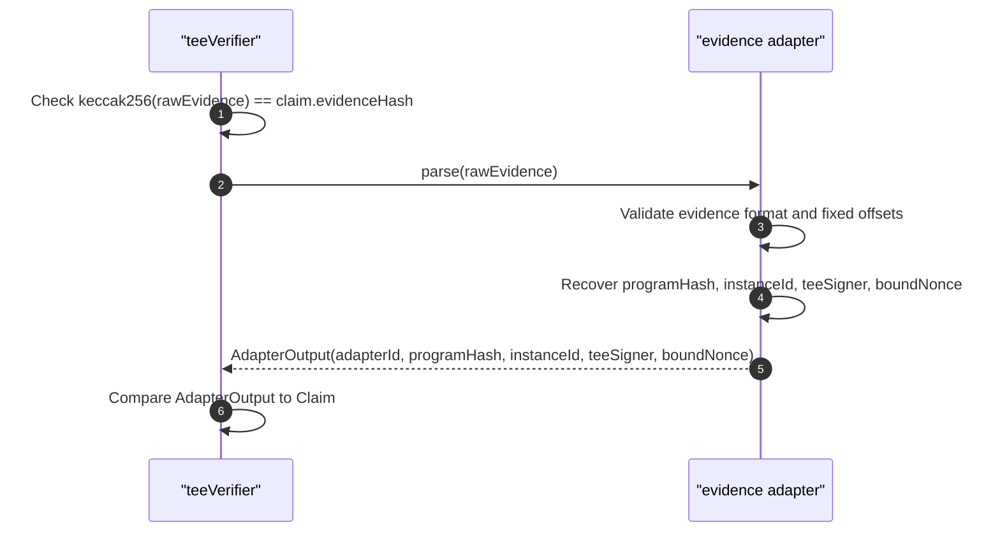
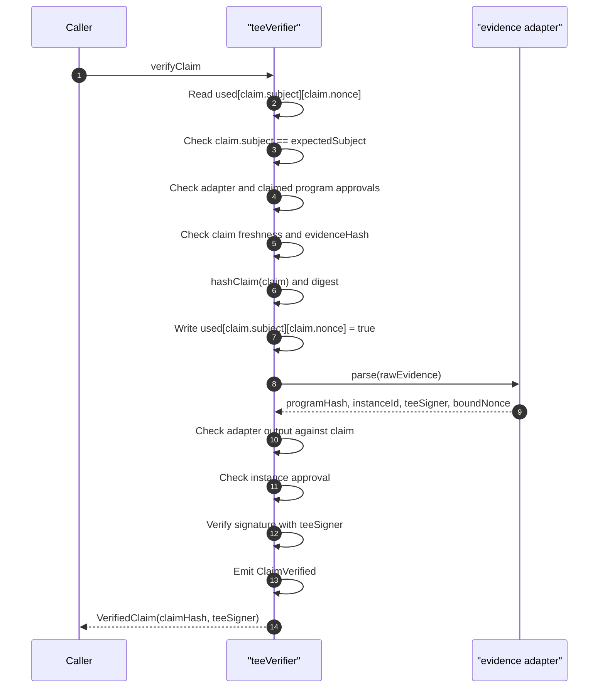
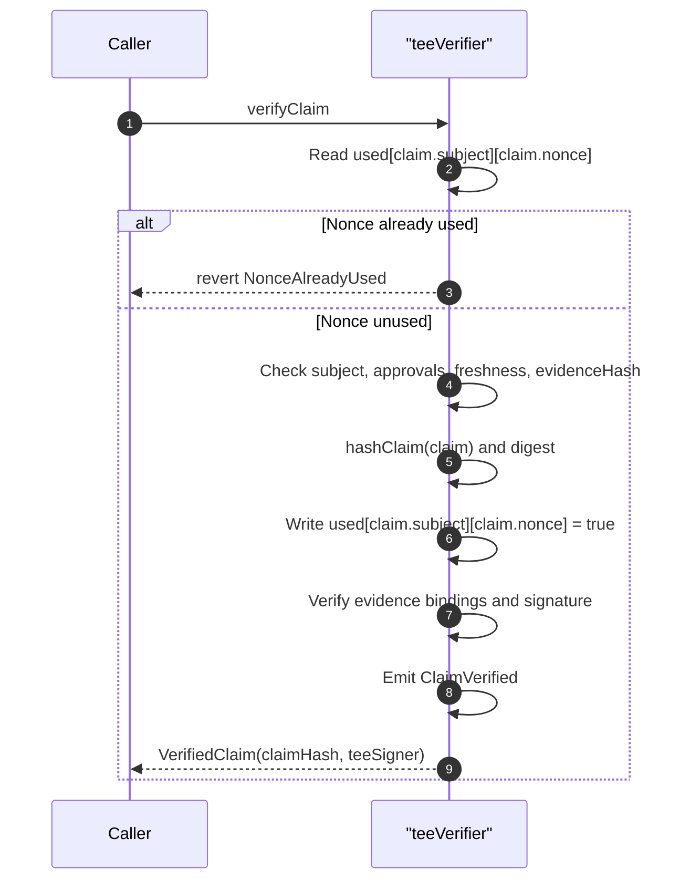
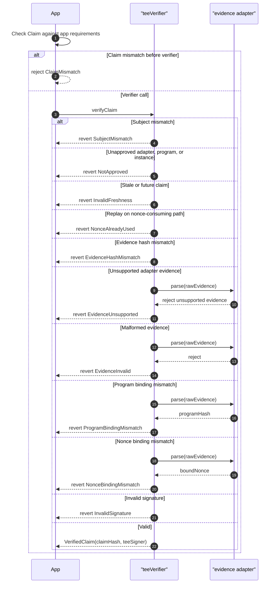

# TIP-1075: TEE Claim Verifier

## Abstract

This TIP defines a lowest-level verifier for fixed-width claims signed by
approved trusted execution environment programs.

The verifier accepts a `Claim`, raw evidence bytes, and a signature from a
`teeSigner`. It verifies the claim hash, evidence binding, adapter output,
approval state, freshness, signature validity, and nonce consumption.

The verifier returns a verified fact. It does not define provider schemas,
authenticated HTTP extraction, account authority, access-key authorization,
native multisig approval, account recovery, or an on-chain registry. Those
mechanisms belong in later TIPs that consume verified claims.

## Motivation

Tempo needs a deterministic way to accept claims about off-chain state without
putting raw off-chain state on chain.

The motivating use cases include:

- proving private identity predicates while disclosing only commitments or public predicates;
- proving that an approved TEE program checked an authenticated off-chain source;
- proving API or provider facts for smart contracts that need stateless
  on-chain validation;
- giving future account and registry TIPs one common verifier instead of each
  defining its own evidence and signature format.

The chain should not parse browser flows, OAuth responses, HTTP transcripts,
JSON paths, provider credentials, app cookies, or provider-specific response
bodies. Those checks happen inside an approved TEE program or in a higher-level
provider TIP. This TIP defines only the deterministic on-chain boundary: claim
hash, evidence adapter output, approval state, freshness, signature validity,
and nonce use.

## Overview

Layer responsibilities:

- **TEE program**: performs the off-chain check, derives public fields and
  private commitments, obtains adapter-specific evidence, and signs a `Claim`.
- **teeVerifier**: verifies the fixed-width on-chain boundary and marks a
  `(subject, nonce)` pair as used.
- **Consumer**: decides what a verified claim means for an application,
  registry, access key, recovery action, or smart contract.

A verified claim is not a transaction signature and is not account authority by
itself.

### Terminology

The core verifier uses generic evidence terminology:

| Term | Meaning |
|---|---|
| `rawEvidence` | Platform attestation bytes supplied to `verifyClaim`. |
| `evidenceHash` | `keccak256(rawEvidence)`, committed in the signed `Claim`. |
| `evidence adapter` | Adapter that validates `rawEvidence` and returns fields. |
| `programHash` | Approved program or deployment identity returned by the adapter. |
| `instanceId` | Adapter-returned instance, device, or deployment-unit identity. |
| `teeSigner` | EVM address bound by the evidence and used to verify the claim signature. |
| `boundNonce` | Nonce or challenge recovered from the evidence. |

`quote` is not a core verifier term. Some TEE platforms call their attestation
artifact a quote, but this TIP uses `rawEvidence` in the generic interface and
reserves platform-specific words for adapter sections.

### Adapter Instantiation Examples

The following examples show how the generic fields are populated by concrete
adapters. They are examples of adapter behavior, not additional core verifier
fields.

For the initial DStack Intel TDX adapter:

```text
adapterId    = keccak256("DSTACK_INTEL_TDX_V1")
rawEvidence  = Intel TDX quote bytes
evidenceHash = keccak256(rawEvidence)
programHash  = program hash extracted from the verified MRCONFIG layout
instanceId   = verified DStack device identity, or bytes32(0)
teeSigner    = address extracted from verified TDX report data
boundNonce   = nonce extracted from verified TDX report data
```

The corresponding approval setup is:

```text
setAdapterApproved(adapterId, true)
setProgramHashApproved(adapterId, programHash, true)
setInstanceApproved(adapterId, programHash, instanceId, true)
```

If the program is approved for any device or instance, the owner may instead
set:

```text
setAllowAnyInstance(adapterId, programHash, true)
```

The initial DStack field names map to the generic names as:

```text
rawQuote    -> rawEvidence
quoteHash   -> evidenceHash
composeHash -> programHash
deviceId    -> instanceId
```

The initial DStack flow read the DStack device id from proof metadata and checked
it against app policy. A future adapter MUST only return that value as a nonzero
`instanceId` if the adapter can verify it as part of the evidence path.
Otherwise the adapter MUST return `bytes32(0)` and rely on program-level
approval.

For a future AWS Nitro Enclaves NSM adapter:

```text
adapterId    = keccak256("AWS_NITRO_NSM_V1")
rawEvidence  = COSE_Sign1 CBOR attestation document bytes
evidenceHash = keccak256(rawEvidence)
programHash  = sha256(PCR0 || PCR1 || PCR2)
instanceId   = keccak256(module_id), or bytes32(0)
teeSigner    = address extracted from signed user_data
boundNonce   = nonce extracted from signed user_data
```

The corresponding approval setup is identical at the core verifier layer:

```text
setAdapterApproved(adapterId, true)
setProgramHashApproved(adapterId, programHash, true)
setInstanceApproved(adapterId, programHash, instanceId, true)
```

If the deployment does not want to bind one Nitro module identity, it can approve
the program for any instance:

```text
setAllowAnyInstance(adapterId, programHash, true)
```

The Nitro adapter would define a signed `user_data` layout compatible with the
generic verifier:

```text
userData[0:20]   = teeSigner
userData[20:32]  = 0x00...00
userData[32:64]  = boundNonce
```

### End-to-End Flow



The nonce is the app's proof-request challenge. In simple tests the user may
call the verifier directly, but the normal application flow is that the user
presents proof material to an app and the app calls `teeVerifier`. The app
checks the `Claim` fields it cares about before relying on verifier output. A
user or app may locally check the `teeSigner` signature as a preflight, but
local checking does not replace verifier approval, evidence, freshness, and
nonce checks.

## Specification

### Naming

The protocol object names are:

- `Claim`: fixed-width claim signed by the evidence-bound `teeSigner`.
- `VerifiedClaim`: return object containing the canonical claim hash and recovered `teeSigner`.
- `ITEEVerifier`: verifier interface.
- `teeVerifier`: deployed verifier instance.
- `providerHash`: commitment to a higher-level provider schema and validation
  policy.
- `claimType`: provider-scoped claim format.

### Activation

This TIP targets a future fork. It does not assign an activation fork, final
precompile address, or migration path.

### Precompile Address

A future fork MUST reserve an address for `ITEEVerifier`. The final address is TBD.

### Claim

`Claim` is the fixed-width object accepted by the verifier.

```solidity
struct Claim {
    // Account, address, or application-defined subject. Not inherently an
    // account signer.
    address subject;
    // Commitment to a higher-level provider schema and verification policy.
    bytes32 providerHash;
    // Provider-scoped claim format.
    bytes32 claimType;
    // Commitment to extracted fields, public predicates, and private
    // commitments.
    bytes32 extractedHash;
    // Caller challenge or digest consumed by verifyClaim.
    bytes32 nonce;
    // App, session, or flow binding.
    bytes32 sessionId;
    // Time when the TEE program created the claim.
    uint64 issuedAt;
    // Last timestamp at which the claim can verify.
    uint64 expiresAt;
    // Commitment to source metadata, endpoint template, method, and response
    // policy.
    bytes32 sourceHash;
    // Evidence adapter selected for rawEvidence.
    bytes32 adapterId;
    // Approved TEE program or deployment identity returned by the adapter.
    bytes32 programHash;
    // Approved TEE instance identity returned by the adapter.
    bytes32 instanceId;
    // keccak256(rawEvidence).
    bytes32 evidenceHash;
}
```

Higher-level provider TIPs define how provider parameters, session identifiers,
and user-facing nonces become the fixed-width words in `Claim`. This verifier
only checks the `bytes32` values it receives.

### VerifiedClaim

```solidity
struct VerifiedClaim {
    // Canonical hash of Claim.
    bytes32 claimHash;
    // Signer recovered by the evidence adapter and accepted by signature
    // verification.
    address teeSigner;
}
```

`claimHash` is the canonical hash of `Claim`. `teeSigner` is recovered by the
evidence adapter and MUST be the signer accepted by the claim signature check.

### Interface

```solidity
interface ITEEVerifier {
    function verifyClaim(
        Claim calldata claim,
        address expectedSubject,
        uint64 maxFutureSkewSeconds,
        bytes calldata rawEvidence,
        bytes calldata signature
    ) external returns (VerifiedClaim memory verified);

    function hashClaim(Claim calldata claim)
        external
        pure
        returns (bytes32 claimHash);

    function toEthSignedMessageHash(bytes32 claimHash)
        external
        pure
        returns (bytes32 digest);

    function isNonceUsed(address subject, bytes32 nonce)
        external
        view
        returns (bool used);

    function owner() external view returns (address owner);

    function isAdapterApproved(bytes32 adapterId) external view returns (bool approved);

    function isProgramHashApproved(bytes32 adapterId, bytes32 programHash)
        external
        view
        returns (bool approved);

    function isInstanceApproved(bytes32 adapterId, bytes32 programHash, bytes32 instanceId)
        external
        view
        returns (bool approved);

    function isAnyInstanceAllowed(bytes32 adapterId, bytes32 programHash)
        external
        view
        returns (bool approved);

    function setAdapterApproved(bytes32 adapterId, bool approved) external;

    function setProgramHashApproved(bytes32 adapterId, bytes32 programHash, bool approved)
        external;

    function setInstanceApproved(
        bytes32 adapterId,
        bytes32 programHash,
        bytes32 instanceId,
        bool approved
    ) external;

    function setAllowAnyInstance(bytes32 adapterId, bytes32 programHash, bool approved) external;

    function transferOwnership(address newOwner) external;
}
```

Admin functions are owner-only in this TIP. Approval setters MUST reject zero
adapter identifiers. Ownership transfer MUST reject the zero address. A later
governance TIP may replace the owner model with a protocol governance
interface.

### Approval State

The verifier stores the following approval state:

- `adapterId -> approved`
- `(adapterId, programHash) -> approved`
- `(adapterId, programHash, instanceId) -> approved`
- `(adapterId, programHash) -> allowAnyInstance`
- `(subject, nonce) -> used`

The verifier does not approve provider hashes or claim types. Provider semantics
are approved by the app, account type, registry policy, or other consumer that
relies on the verified claim. The low-level verifier only proves that an
approved TEE program signed the exact fixed-width words in `Claim`.

### Hashing

`hashClaim` MUST use one canonical domain-separated hash:

```text
claimHash = keccak256(abi.encode(
    keccak256("Claim:v1"),
    subject,
    providerHash,
    claimType,
    extractedHash,
    nonce,
    sessionId,
    issuedAt,
    expiresAt,
    sourceHash,
    adapterId,
    programHash,
    instanceId,
    evidenceHash
))
```

`toEthSignedMessageHash` returns:

```text
keccak256("\x19Ethereum Signed Message:\n32" || claimHash)
```

The verifier MUST reject malformed signatures and MUST verify the signature over
this digest against the `teeSigner` returned by the evidence adapter. Signature
encoding is an implementation detail of the adapter and active fork. It is not a
separate source of signer authority.

### Hash Domain Summary

This TIP defines the `Claim:v1` domain. Later TIPs that consume claims use
separate domains for their own purpose bindings:

| Domain | Purpose |
| --- | --- |
| `Claim:v1` | Canonical fixed-width claim hash. |
| `ProviderSchema:v1` | Provider schema hash for claim material. |
| `SourceDescriptor:v1` | Source request and transport policy hash. |
| `ExtractedClaim:v1` | Extracted public fields and commitments hash. |
| `FieldCommitment:v1` | Commitment to one extracted private field. |
| `ClaimAccountType:v1` | Provider-backed signer namespace. |
| `ClaimSigner:v1` | Claim-derived signer address. |
| `ClaimSignatureBinding:v1` | Claim signature context and message binding. |
| `RegistryPolicy:v1` | Registry acceptance policy. |
| `RegistryRecordId:v1` | Deterministic current-record key. |
| `RegistryWrite:v1` | Registry write intent binding. |
| `RegistryRevoke:v1` | Registry revocation intent binding. |

Domains MUST NOT be reused across different purposes. A claim-consuming TIP
MUST bind the action it authorizes into `Claim.sessionId` or another
domain-separated claim field before calling `teeVerifier`.

### Evidence Adapter Contract

Each evidence adapter has one job: transform `rawEvidence` into deterministic verification outputs.

```solidity
struct AdapterOutput {
    // Adapter that parsed rawEvidence.
    bytes32 adapterId;
    // TEE program or deployment identity recovered from rawEvidence.
    bytes32 programHash;
    // TEE instance identity recovered from rawEvidence, or zero when not bound.
    bytes32 instanceId;
    // Signer recovered from adapter-bound evidence.
    address teeSigner;
    // Nonce or challenge recovered from adapter-bound evidence.
    bytes32 boundNonce;
}
```

An adapter MUST reject malformed or unsupported evidence before returning. The
generic verifier MUST reject unless:

- `keccak256(rawEvidence) == claim.evidenceHash`;
- `adapterOutput.adapterId == claim.adapterId`;
- `adapterOutput.programHash == claim.programHash`;
- `adapterOutput.instanceId == claim.instanceId`;
- `adapterOutput.boundNonce == claim.nonce`;
- `adapterOutput.teeSigner != address(0)`.

### Adapter Boundary



### Initial Adapter: DStack Intel TDX

The initial adapter is `DSTACK_INTEL_TDX_V1`:

```text
adapterId = keccak256("DSTACK_INTEL_TDX_V1")
```

For this adapter, `rawEvidence` is an Intel TDX quote obtained by a DStack
guest agent. The verifier does not accept a higher-level envelope as evidence
for this adapter; the bytes supplied to `verifyClaim` are the quote bytes whose
hash is committed in `Claim.evidenceHash`. Verification MUST reject unless
`claim.evidenceHash == keccak256(rawEvidence)`.

The adapter MUST verify the TDX quote before using any quote-body fields. The
verified quote output MUST have an accepted TCB status. Implementations may
bake quote verification into the precompile rather than calling an external
quote verifier, but they MUST NOT treat unchecked quote bytes as verified
evidence.

This adapter supports:

- Intel TDX quote version `4`;
- Intel TDX quote version `5`;
- TD10 quote body type `2`;
- TD15 quote body type `3`;
- TD10 report body length `584`;
- TD15 report body length `648`.

After verifying the quote, the adapter works over the verified TD report body.
The adapter MUST derive the report body from the parsed quote structure and MUST
NOT read these fields from unchecked caller bytes.

The adapter extracts `programHash` from the verified TD report body's MRCONFIG
layout:

```text
mrconfigOffset = 184
mrconfigLength = 48

tdReportBody[mrconfigOffset]         == 0x01
tdReportBody[mrconfigOffset+1: +33]  == programHash
tdReportBody[mrconfigOffset+33: +48] == 0x00...00
```

The adapter extracts `teeSigner` and `boundNonce` from verified TD report data:

```text
reportDataOffset = 520
reportDataLength = 64

tdReportBody[reportDataOffset: +20]      = teeSigner
tdReportBody[reportDataOffset+20: +32]   = 0x00...00
tdReportBody[reportDataOffset+32: +64]   = boundNonce
```

The DStack `teeSigner` is the EVM address for the DStack signing identity inside
the TEE environment. The TEE requests the TDX quote with that address and the
nonce in report data:

```text
reportData[0:20]  = teeSigner
reportData[20:32] = 0x00...00
reportData[32:64] = boundNonce
```

The claim signature MUST be produced by the same DStack signing identity whose
address is bound in report data. The verifier MUST recover `teeSigner` from
verified evidence and MUST NOT accept a signer supplied only by the caller or
claim payload.

The verifier using this adapter MUST reject:

- malformed quote length;
- unsupported quote version;
- unsupported quote body type;
- rejected TCB status;
- missing or malformed MRCONFIG bytes;
- program hash mismatch;
- nonzero signer padding;
- zero `teeSigner`;
- nonce mismatch;
- unapproved program or instance.

For the initial adapter, `instanceId` represents the adapter-level device or
instance identity approved by verifier state. The TDX report body layout above
does not itself encode that value. An implementation MUST only return a nonzero
`instanceId` when its DStack evidence path verifies that identity; otherwise it
MUST return `bytes32(0)` and use program-level approval. The generic verifier
rules still apply: if `allowAnyInstance` is false, the
`(adapterId, programHash, instanceId)` tuple must be approved.

### Future Adapter Compatibility: AWS Nitro Enclaves NSM

The verifier model is compatible with AWS Nitro Enclaves NSM because all
platform-specific evidence is behind `adapterId` and `rawEvidence`.

A future AWS Nitro Enclaves adapter can define:

```text
adapterId = keccak256("AWS_NITRO_NSM_V1")
```

For this adapter, `rawEvidence` is the NSM attestation document bytes. The
adapter MUST verify the CBOR/COSE envelope, the NSM document signature, the
certificate chain to the approved AWS Nitro Enclaves root, the document digest
algorithm, PCR shape, document freshness, and any revocation policy required by
the fork.

The adapter can return:

- `programHash = sha256(PCR0 || PCR1 || PCR2)`, represented as `bytes32`;
- `instanceId = keccak256(module_id)`, or `bytes32(0)` when the deployment is
  approved for any instance;
- `teeSigner` and `boundNonce` from the signed NSM user-data field.

To reuse the same claim format as the initial adapter, the TEE program SHOULD
request the NSM document with signed user data that encodes the signer and nonce
binding:

```text
userData = encode(teeSigner, boundNonce)
```

The AWS Nitro Enclaves adapter MUST reject:

- malformed CBOR or COSE;
- unsupported COSE algorithm or digest algorithm;
- invalid or unapproved certificate chain;
- stale or future-dated NSM document;
- missing PCR0, PCR1, or PCR2;
- debug-mode measurements where PCR0, PCR1, and PCR2 are all zero;
- program hash mismatch;
- missing, malformed, or incorrectly padded user data;
- zero `teeSigner`;
- nonce mismatch;
- unapproved program or instance.

This adapter does not require a TDX quote, MRCONFIG, or report-data offset. It
demonstrates why `adapterId`, `programHash`, `instanceId`, and `evidenceHash`
are generic fields rather than platform-specific names.

### Verification

`verifyClaim` MUST fail unless all of the following hold:

- `claim.subject == expectedSubject`;
- `isNonceUsed(claim.subject, claim.nonce)` is false;
- `adapterId` is approved;
- `programHash` is approved for `adapterId`;
- `instanceId` is approved for `(adapterId, programHash)`, unless the program
  allows any instance;
- `block.timestamp <= expiresAt`;
- `issuedAt <= block.timestamp + maxFutureSkewSeconds`;
- `keccak256(rawEvidence) == claim.evidenceHash`;
- the adapter accepts `rawEvidence`;
- `adapterOutput.adapterId == claim.adapterId`;
- `adapterOutput.programHash == claim.programHash`;
- `adapterOutput.instanceId == claim.instanceId`;
- `adapterOutput.boundNonce == claim.nonce`;
- the signature verifies over `toEthSignedMessageHash(hashClaim(claim))` with
  `adapterOutput.teeSigner`.

`verifyClaim` MUST mark `(claim.subject, claim.nonce)` as used and emit
`ClaimVerified` before returning. If verification reverts, the nonce write
MUST revert with it.

The verifier does not check app-specific expectations such as the exact
provider hash, claim type, source hash, extracted hash, session id, or nonce
that the app issued. The app MUST check those fields before relying on verifier
success.

### verifyClaim Flow



### Nonce Consumption

`verifyClaim` consumes `(subject, nonce)` exactly once.



### Failure Boundaries



### Events

```solidity
event ClaimVerified(
    address indexed subject,
    bytes32 indexed providerHash,
    bytes32 indexed nonce,
    bytes32 claimType,
    bytes32 extractedHash,
    bytes32 sessionId,
    bytes32 sourceHash,
    bytes32 adapterId,
    bytes32 programHash,
    bytes32 instanceId,
    bytes32 evidenceHash,
    address teeSigner,
    bytes32 claimHash,
    bytes32 digest
);

event AdapterApprovalUpdated(bytes32 indexed adapterId, bool approved);
event ProgramHashApprovalUpdated(
    bytes32 indexed adapterId,
    bytes32 indexed programHash,
    bool approved
);
event InstanceApprovalUpdated(
    bytes32 indexed adapterId,
    bytes32 indexed programHash,
    bytes32 indexed instanceId,
    bool approved
);
event AllowAnyInstanceUpdated(
    bytes32 indexed adapterId,
    bytes32 indexed programHash,
    bool approved
);
event OwnershipTransferred(address indexed oldOwner, address indexed newOwner);
```

### Privacy Requirements

The verifier treats `extractedHash` as opaque. Privacy-sensitive provider
schemas MUST ensure that `extractedHash` is not directly enumerable.

For identity claims, provider schemas MUST NOT emit any of the following on
chain:

- email address;
- normalized email address;
- provider stable account id;
- OAuth access token or ID token;
- raw provider response;
- `hash(email)`;
- any hash of an enumerable user identifier unless it is mixed with TEE-held
  secret material or another non-public value.

Identity commitments SHOULD be derived inside the TEE from provider-private
account material and TEE-held secret material. No user-managed salt is required
by this TIP.

### Authority Boundary

A verified `Claim` is a verified fact, not a signature.

Account-control mechanisms MUST NOT accept arbitrary verifier success as
authority. Any later TIP that uses this verifier for local key authorization,
account recovery, or native multisig approval MUST define:

- the exact `providerHash` and `claimType` formats it accepts;
- a purpose or capability allowlist for those formats;
- how the claim binds to the transaction, key authorization, recovery action,
  or multisig digest;
- how `subject` is interpreted;
- which nonce domain and replay policy the action uses;
- what privacy commitments are required for identity claims.

Generic API-data claims may verify through this TIP while still having no
account authority.

### Cross-TIP Security Checklist

Claim-consuming TIPs SHOULD preserve the following boundaries:

- verifier success is not account authority;
- provider fields are checked by the consumer's expected descriptor or policy;
- `sessionId` binds the claim to the exact transaction, registry write, or
  app action being authorized;
- `nonce` is fresh for that subject and is consumed exactly once;
- adapter, program, instance, and signer acceptance cannot silently downgrade;
- provider migrations require explicit account, key, registry, or app policy;
- signer derivation and nullifiers are opaque and non-enumerable;
- native provider-signed data is a separate verification path unless wrapped
  in a valid `Claim`; and
- raw credentials, tokens, provider ids, emails, documents, and biometric
  material stay out of calldata, events, and registry state.

### Future TIPs

The following mechanisms are intentionally left to separate TIPs:

- provider schemas, authenticated source validation, extraction, redaction, and
  commitment policy;
- transaction authorization sidecars that bind a verified claim to local-key
  authorization or recovery;
- native multisig integration;
- durable on-chain registry state, expiration, replacement, and revocation.

## Invariants

- Verifier success MUST NOT imply account authority.
- Apps MUST check claim fields before relying on verifier success.
- `adapterId`, `programHash`, and instance approval MUST be approved in
  verifier state.
- Provider fields are checked by consumers, not by `teeVerifier`.
- The raw evidence hash MUST equal `claim.evidenceHash`.
- The adapter MUST bind the recovered `teeSigner`, nonce, program identity, and
  any nonzero instance identity.
- The signature MUST verify over the canonical claim digest.
- `verifyClaim` MUST consume `(subject, nonce)` exactly once.
- Privacy-sensitive provider schemas MUST NOT place public identifiers or
  enumerable hashes on chain.
