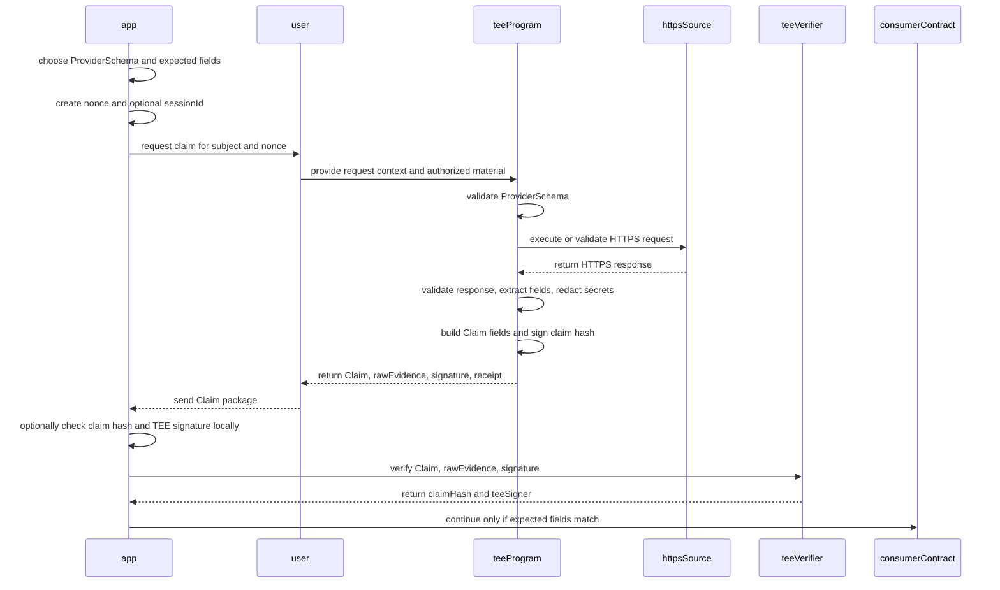
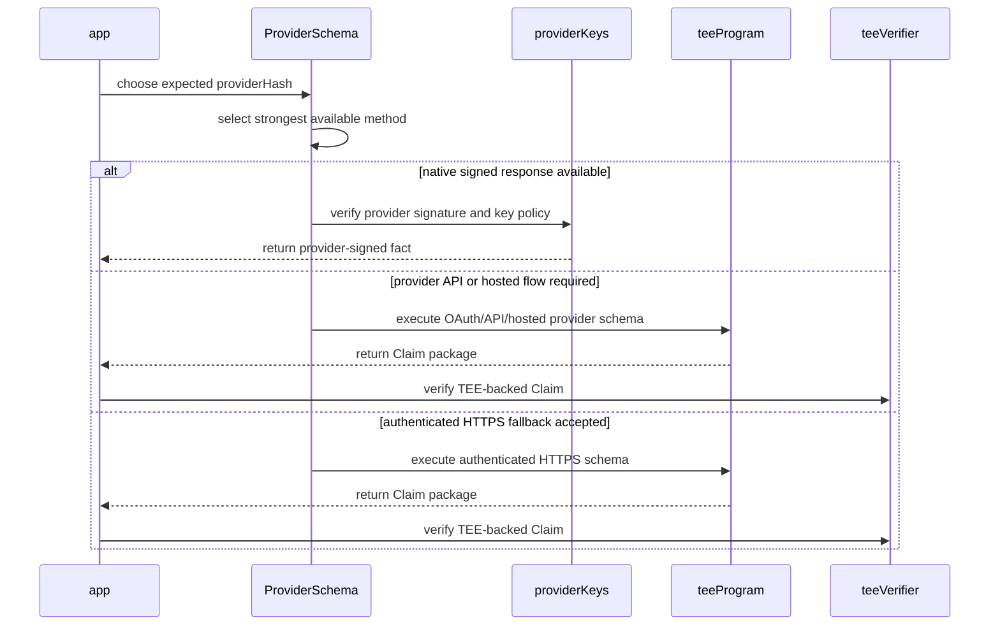
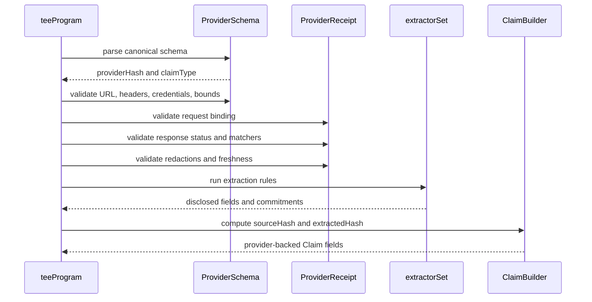
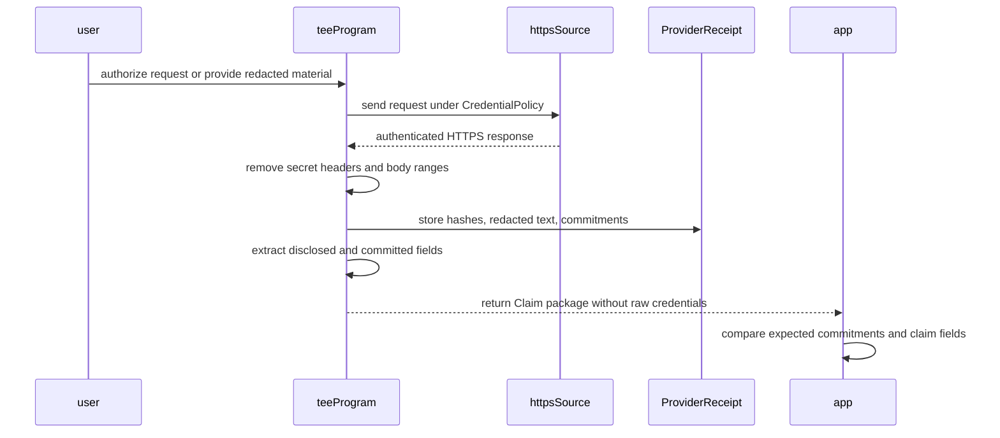
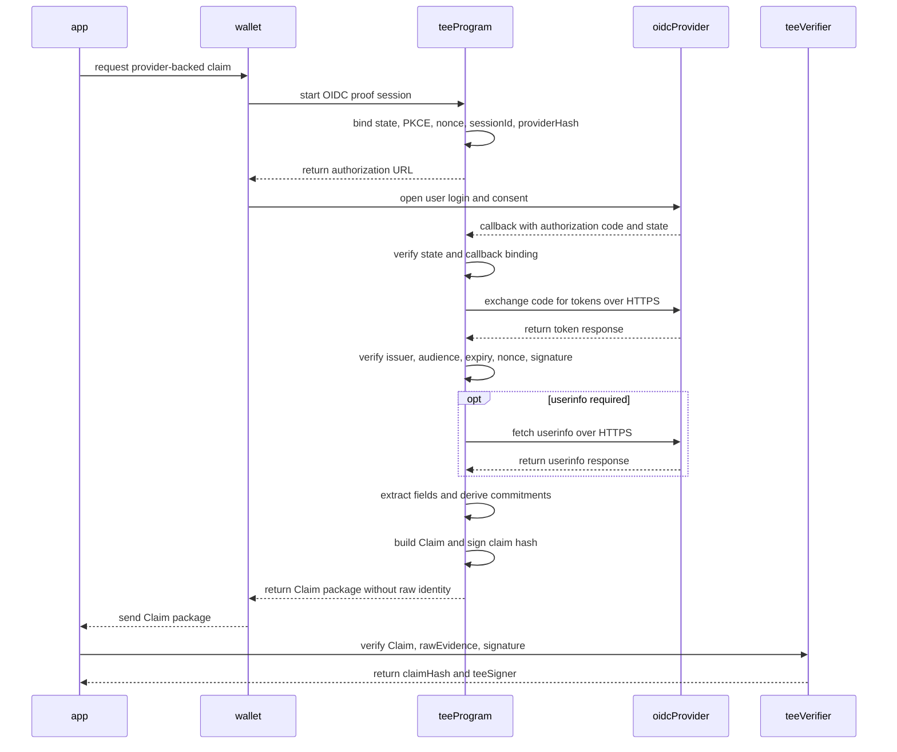
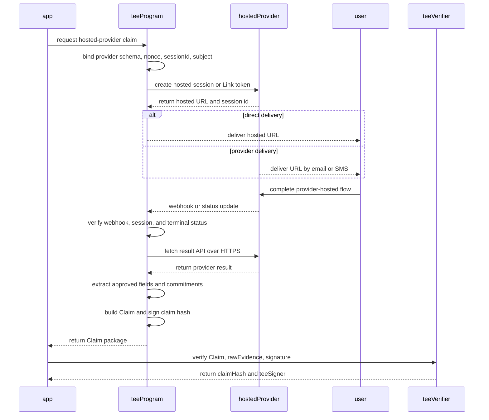
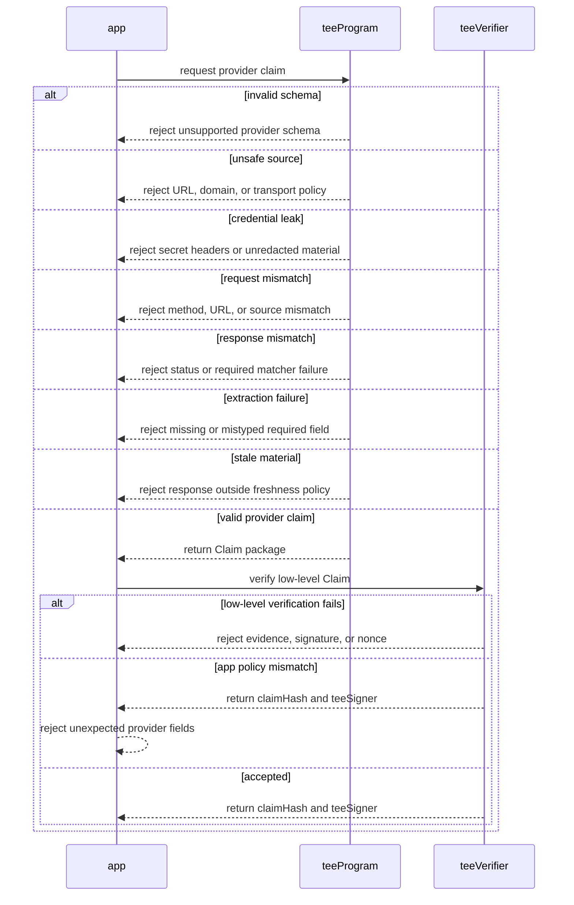

## Abstract

This TIP defines the provider schema layer that produces the opaque claim
fields consumed by TIP-1075. A provider schema specifies how an off-chain fact
is checked, which response facts are extracted, which material is redacted, and
how the resulting commitments become a `Claim`.

The ideal provider path is native signed data: API providers sign their own
responses and publish or maintain verification keys on Tempo. When that exists,
the chain or a consumer can verify the provider directly and does not need TEE
attestation for the source fact.

The first provider specified here is `authenticatedHttp`: a generic provider
for user-mediated authenticated HTTPS attestations. This is not general-purpose
page scraping. A TEE program executes a bounded schema with a fixed source,
matchers, extraction rules, redaction policy, and freshness policy.

This TEE path exists for coverage. Most useful providers will not immediately
sign every response or maintain on-chain keys, so the provider layer defines a
waterfall of verification methods that can cover native signed APIs, OAuth/OIDC
responses, hosted provider APIs, and authenticated HTTPS responses.

The provider does not disclose credentials on-chain. It emits commitments such
as `providerHash`, `sourceHash`, and `extractedHash`, which apps can compare
against their expected values before accepting a verified claim.

This TIP does not define an on-chain registry, account authority, key recovery,
multisig integration, or application-specific identity levels.

## Motivation

The long-term goal is for providers to sign their own responses and maintain
their public keys on Tempo. That gives the cleanest trust boundary: the provider
itself attests to the source fact, and no TEE is needed to interpret HTTPS on
its behalf.

Until that is common, applications need a precise way to decide what was
checked before a claim was signed. Some providers expose OAuth/OIDC flows. Some
delegate user auth to hosted platforms. Some expose facts only inside an
authenticated web session. The provider layer gives all of these methods one
schema and claim-material vocabulary.

Provider schemas are that missing layer. They let an app bind a verified claim
to:

- a verification method in the waterfall;
- a provider-signed response or trusted key policy, when available;
- a specific HTTPS source and credential policy;
- a specific response validation policy;
- a specific extractor set;
- a specific redaction and commitment policy;
- a freshness policy; and
- a stable provider hash that changes when the security meaning changes.

The on-chain verifier remains intentionally narrow. For TEE-backed paths it
verifies that an approved TEE program signed a fixed-width `Claim`. It does not
parse provider schemas, fetch HTTPS sources, interpret JSON, or decide that a
fact is useful to an app. Those responsibilities live in the provider layer and
in the app's own acceptance policy.

## Assumptions

- Native provider-signed responses can be verified without TIP-1075 when their
  public keys and response schema are known.
- TEE-backed paths use a TEE program approved by the TIP-1075 verifier for the
  relevant adapter, program, instance, and signer state.
- TEE-backed paths run the provider schema validation described here before the
  TEE program signs a `Claim`.
- The app chooses exact expected claim fields, including `providerHash`,
  `claimType`, `sourceHash`, `extractedHash`, `subject`, `nonce`, and
  `sessionId` where applicable.
- Raw credentials are never included in a `Claim`, a public schema, or an
  on-chain verification call.
- Provider schemas are versioned. A security-meaningful schema change creates
  a different `providerHash`.
- This TIP specifies the claim material produced by HTTP providers. Later TIPs
  may define provider-specific identity schemas, account recovery flows, and
  registries that consume these claims.

## Threat Model

The provider layer protects against apps accepting claims whose off-chain
meaning differs from what the app expected. It focuses on binding source,
response, extraction, redaction, and freshness semantics into stable hashes.

The following actors are considered:

| Actor | Role |
| --- | --- |
| `user` | Supplies or authorizes the authenticated off-chain request. |
| `app` | Requests a claim, chooses expected fields, and calls the verifier. |
| `teeProgram` | Executes the provider schema and signs the resulting `Claim`. |
| `provider` | Serves the HTTPS response checked by the TEE program. |
| `teeVerifier` | Verifies the low-level `Claim`, evidence, and TEE signature. |
| `observer` | Watches public calldata, events, and registry writes. |

The provider layer does not hide data that the app itself chooses to disclose.
It also does not prove that an external provider's semantics are stable over
time. Apps must treat provider schemas as part of their own trust boundary.

## Specification

### Relationship To TIP-1075

The provider layer produces a `Claim` for TIP-1075:

```text
struct Claim {
    address subject;       // Account, app user, or object the claim is about.
    bytes32 providerHash;  // Hash of the provider schema used by teeProgram.
    bytes32 claimType;     // Fixed-width claim category selected by schema.
    bytes32 extractedHash; // Hash of disclosed extracted fields and commitments.
    bytes32 nonce;         // App-provided replay protection word.
    bytes32 sessionId;     // Optional app session binding, or zero.
    uint64 issuedAt;       // TEE-observed issuance time.
    uint64 expiresAt;      // Claim expiration derived from schema freshness.
    bytes32 sourceHash;    // Hash of source, request, and transport policy.
    bytes32 adapterId;     // TIP-1075 evidence adapter identifier.
    bytes32 programHash;   // Approved TEE program or deployment identity.
    bytes32 instanceId;    // Approved device, module, or instance identity.
    bytes32 evidenceHash;  // keccak256(rawEvidence).
}
```

The provider layer defines the first four opaque provider fields:
`providerHash`, `claimType`, `sourceHash`, and `extractedHash`. TIP-1075
defines how the claim is hashed, how evidence is checked, how freshness is
bounded, and how `(subject, nonce)` replay protection is consumed.

Verifier success returns `(claimHash, teeSigner)`. It does not mean that the
claim satisfies an app's provider policy. The app must compare the returned
claim and its hash against its expected provider fields.

### Terminology

| Term | Meaning |
| --- | --- |
| `ProviderSchema` | Public request, validation, extraction, redaction, and freshness policy. |
| `providerHash` | Domain-separated hash of the canonical provider schema. |
| `claimType` | Fixed-width category for the fact being claimed. |
| `VerificationMethod` | Waterfall method used to verify the provider fact. |
| `SourceDescriptor` | Canonical description of the source request and transport policy. |
| `sourceHash` | Domain-separated hash of the `SourceDescriptor`. |
| `ProviderReceipt` | Non-secret material used for validation and claim construction. |
| `ExtractedClaim` | Disclosed extracted fields plus commitments for hidden fields. |
| `extractedHash` | Domain-separated hash of the canonical `ExtractedClaim`. |
| `CredentialPolicy` | Rule for authenticated material and how it stays out of public data. |
| `RedactionPolicy` | Rule for disclosed fields and committed-only fields. |
| `FreshnessPolicy` | Rule bounding response age and claim lifetime. |
| `Native Signed Response` | Provider-signed response verified without a TEE. |
| `Authenticated HTTPS Attestation` | User-mediated proof of selected HTTPS facts. |
| `OAuth/OIDC-over-HTTPS` | Mode where OAuth or OIDC supplies the HTTPS credential. |
| `Aggregator-Hosted Flow` | Mode where a data aggregator hosts the user auth flow. |
| `Hosted Verification Flow` | Mode where an identity vendor hosts verification. |

Authenticated HTTPS attestation is the generic term for this TIP's user-facing
provider flow. It means the user intentionally authorizes a bounded HTTPS
request or response under a public schema. It does not mean that the TEE program
may browse arbitrary pages or extract arbitrary content.

### End-To-End Flow

In the normal flow the user does not call the verifier directly. The app asks
for a claim, the user obtains or authorizes the off-chain response, and the app
submits the claim package to the verifier.



### Provider Schema

The provider schema is public and contains no raw credentials.

```text
ProviderSchema {
    providerId: string
    version: string
    verificationMethod: VerificationMethod
    claimType: bytes32
    allowedDomains: string[]
    request: RequestTemplate
    response: ResponsePolicy
    signature: ProviderSignaturePolicy?
    extraction: ExtractionRule[]
    redaction: RedactionPolicy
    freshness: FreshnessPolicy
}

ProviderSignaturePolicy {
    keyRegistry: string
    keyId: bytes32
    algorithm: string
    canonicalization: string
}

RequestTemplate {
    method: string
    urlTemplate: string
    publicHeaders: map<string, string>
    publicBody: bytes?
    credentialPolicy: CredentialPolicy
}

ResponsePolicy {
    successStatus: uint16
    requiredMatches: ResponseMatcher[]
}

ExtractionRule {
    field: string
    source: Extractor
    valueType: FieldValueType
    required: bool
}

RedactionPolicy {
    disclosure: DisclosurePolicy
    disclosedFields: string[]
    committedFields: string[]
}

FreshnessPolicy {
    maxResponseAgeSeconds: uint64
    proofTtlSeconds: uint64
}
```

`providerHash` is the domain-separated hash of the canonical
`ProviderSchema`:

```text
providerHash = H("ProviderSchema:v1", canonicalProviderSchema)
```

`canonicalProviderSchema` must be deterministic, UTF-8 encoded, and must not
contain raw credentials. Object keys, arrays, string escaping, integer
encoding, and absent optional fields must have one canonical representation per
protocol version.

Any change that affects verification method, source selection, key policy,
credential policy, response checks, extraction, redaction, freshness, or claim
meaning must change the canonical schema and therefore the `providerHash`.

### Claim Material

The TEE program derives the TIP-1075 claim fields as follows:

| Claim field | Provider-layer derivation |
| --- | --- |
| `subject` | App-selected account, user, or object the claim is about. |
| `providerHash` | Hash of the canonical `ProviderSchema`. |
| `claimType` | Fixed-width claim type from the schema. |
| `extractedHash` | Hash of the canonical `ExtractedClaim`. |
| `nonce` | App-provided nonce bound into the request. |
| `sessionId` | Optional app session binding, or zero. |
| `issuedAt` | TEE-observed time when claim material is finalized. |
| `expiresAt` | `issuedAt + freshness.proofTtlSeconds`. |
| `sourceHash` | Hash of the canonical `SourceDescriptor`. |

The remaining fields, `adapterId`, `programHash`, `instanceId`, and
`evidenceHash`, are supplied by the TIP-1075 evidence adapter flow.

### Source Descriptor

`sourceHash` binds the off-chain source and request policy:

```text
SourceDescriptor {
    method: string
    urlTemplateHash: bytes32
    domain: string
    credentialPolicy: CredentialPolicy
    transportPolicy: TransportPolicy
}

sourceHash = H("SourceDescriptor:v1", canonicalSourceDescriptor)
```

The source descriptor must bind the HTTPS method, URL template, resolved
domain, credential policy, and transport policy. The source descriptor may also
bind certificate or endpoint policy when a fork supports that verification.

The initial `authenticatedHttp` provider requires:

- scheme `https`;
- a non-empty host;
- no userinfo;
- no URL fragment;
- non-empty query keys when query parameters are present;
- rejection of localhost, local network names, private IPs, loopback IPs,
  link-local IPs, unspecified IPs, and broadcast addresses; and
- bounded URL, header, body, matcher, extractor, and redaction sizes.

These constraints are part of the provider's security meaning and therefore
part of the schema version.

### Verification Waterfall

Provider schemas should use the strongest available verification method for the
fact being claimed. The waterfall is:

| Rank | Method | Trust shape |
| --- | --- | --- |
| 1 | Native signed response | Provider signs the response and publishes keys. |
| 2 | Provider OAuth/OIDC or API | TEE verifies provider-issued credential/API data. |
| 3 | Hosted provider flow | TEE verifies provider webhook/API result. |
| 4 | Authenticated HTTPS receipt | TEE verifies selected logged-in HTTPS material. |
| 5 | Public HTTPS fetch | TEE fetches public source data over HTTPS. |

Native signed responses are the ideal. A provider that signs canonical response
objects and maintains public keys on Tempo can be verified without a TEE source
attestation. A provider schema for this mode binds the provider key id,
signature algorithm, response canonicalization, response freshness, and field
extraction rules.

TEE-backed methods exist to maximize provider coverage while preserving one
claim interface. They should be used when a provider does not natively sign the
needed fact, or when the useful fact is only available after user auth inside a
provider, aggregator, or hosted verification flow.

Schemas must not silently downgrade. If an app expects a native signed response,
an OAuth/OIDC response, or a hosted-provider API result, a TEE-authenticated web
receipt for the same human-readable fact is not equivalent unless the app has
explicitly accepted that provider hash.



### Provider Execution Modes

A provider schema can be executed through several user-mediated modes. The
mode is part of the schema's security meaning and therefore part of
`providerHash`.

| Mode | Shape |
| --- | --- |
| Native signed response | Provider signs canonical response with published key. |
| Public HTTPS fetch | TEE fetches a public HTTPS JSON or document source. |
| Authenticated HTTPS receipt | User browser or app supplies redacted HTTPS material. |
| OAuth/OIDC-over-HTTPS callback | Provider redirects authorization material to the TEE. |
| Aggregator-hosted flow | Aggregator webhook or API supplies completion material. |
| Hosted verification flow | KYC vendor webhook or API supplies verification result. |

For authenticated HTTPS receipts, an App Clip, browser extension, wallet
webview, or controlled browser can help the user produce the redacted request
and response material. This is useful for sites that only expose the relevant
fact through an existing web session.

For OAuth/OIDC-over-HTTPS, an App Clip is not required by the provider
semantics. A normal browser redirect or wallet redirect can send the
authorization response to a TEE-controlled callback or to a wallet-controlled
endpoint that forwards only authorization material to the TEE. The consuming
app must not receive the authorization code, tokens, raw identity response, or
extracted identity fields unless the schema explicitly discloses them.

The OAuth callback is not itself the attested identity fact. It is credential
material that lets the TEE program obtain and validate the provider's HTTPS
token, API, or userinfo response. The TEE signs a `Claim` only after validating
the state, token response, issuer or API origin, audience or client binding,
expiry, nonce when present, and required claims.

For aggregator-hosted flows, the user completes authentication inside an
aggregator-hosted experience. The aggregator then sends completion material to
the TEE boundary through a webhook, callback, polling API, or hosted-link status
API. The completion material is not itself the claim result. The TEE signs only
after it validates the aggregator session, exchanges any short-lived completion
token when required, fetches the relevant aggregator API response over HTTPS,
and applies the provider schema.

For hosted verification flows, the user completes an identity, liveness, age,
business, or document verification with a provider-hosted or embedded vendor
flow. The TEE signs only after it validates the vendor webhook or polls the
vendor API over HTTPS and extracts the schema-approved status or level. Raw
documents, biometric material, names, addresses, and dates of birth are not
claim fields unless the schema explicitly discloses them.

### Authenticated HTTP Provider

`authenticatedHttp` is the first generic provider. It proves that a TEE program
validated an HTTPS response under a public schema while keeping credentials and
redacted material out of public claim data.

| Parameter | Meaning |
| --- | --- |
| `url` | Exact HTTPS URL or approved URL template. |
| `method` | HTTP method, initially `GET` unless schema allows otherwise. |
| `claimType` | Claim category emitted into TIP-1075. |
| `publicHeaders` | Headers that are safe to reveal and bind into the request. |
| `publicBody` | Optional non-secret body material. |
| `credentialPolicy` | Whether bearer token, cookie, or no credential is expected. |
| `successStatus` | Required HTTP status. |
| `requiredMatches` | Additional response predicates. |
| `extraction` | Field extraction rules. |
| `redaction` | Disclosure and commitment policy. |
| `freshness` | Maximum response age and proof lifetime. |

The initial `CredentialPolicy` values are:

| Value | Meaning |
| --- | --- |
| `None` | No credential is expected. |
| `BearerAccessToken` | A bearer credential is used but never disclosed. |
| `CookieHeader` | A cookie credential is used but never disclosed. |
| `OAuthAuthorizationCode` | Authorization code is exchanged inside the TEE. |
| `AggregatorCompletionToken` | Hosted completion token is consumed by the TEE. |
| `HostedVerificationSession` | Verification session id is resolved by the TEE. |

The public schema and the submitted receipt must reject raw `authorization`,
`cookie`, and `set-cookie` header material. If a credential is required, it is
handled by the TEE program or by a user-controlled request path and represented
only through the credential policy and redaction commitments.

### Provider Instantiation Examples

The following examples are illustrative schema instantiations. They do not
create special on-chain logic.

| Example | Mode | Provider shape |
| --- | --- | --- |
| Google account | OAuth/OIDC callback | OIDC token/userinfo validation. |
| GitHub account | OAuth callback | OAuth code exchange plus account API response. |
| Plaid Link | Aggregator-hosted flow | Hosted Link completion plus Plaid API response. |
| Persona inquiry | Hosted verification flow | Hosted Flow result or inquiry API response. |
| Sumsub applicant | Hosted verification flow | WebSDK result or applicant API response. |
| Bank portal session | Authenticated HTTPS receipt | Redacted logged-in web response. |
| Signed API response | Native signed response | Provider signature plus key policy. |
| Public JSON fact | Public HTTPS fetch | No credential, typed extractors, short TTL. |

For the authenticated account profile shape, the schema might disclose only the
boolean verification status and commit to the email address and account id. For
the public JSON fact shape, the schema might disclose the extracted fields
directly because the source is already public.

Provider-specific documentation that informed these examples:

- [Google OpenID Connect](https://developers.google.com/identity/openid-connect/openid-connect)
- [GitHub OAuth apps](https://docs.github.com/apps/oauth-apps)
- [Plaid Link](https://plaid.com/docs/link/)
- [Plaid Hosted Link](https://plaid.com/docs/link/hosted-link/)
- [Plaid OAuth guide](https://plaid.com/docs/link/oauth/)
- [Persona Hosted Flow](https://docs.withpersona.com/hosted-flow)
- [Persona inquiries](https://docs.withpersona.com/inquiries)
- [Persona webhooks](https://docs.withpersona.com/webhooks)
- [Sumsub WebSDK](https://docs.sumsub.com/docs/about-web-sdk)
- [Sumsub user verification webhooks](https://docs.sumsub.com/docs/user-verification-webhooks)

### Worked Consumer Examples

These examples show how provider schemas become claim material for later TIPs.
They are not special cases in `teeVerifier`.

#### Google Account Creation

An account-creation wallet can use a Google OIDC schema as a provider-backed
root signer:

```text
verificationMethod = H("oauth.oidc.https")
providerHash       = H("ProviderSchema:v1", googleOidcSchema)
claimType          = H("account.control")
sourceHash         = H("SourceDescriptor:v1", googleTokenAndUserinfoSource)
```

The TEE validates the OIDC callback, token response, issuer, audience, expiry,
and required userinfo claims. It derives a non-enumerable `signerId` from the
stable provider account id and TEE-held derivation material. It does not expose
the account id, email, authorization code, ID token, or access token.

TIP-1077 then uses:

```text
accountTypeId = H("ClaimAccountType:v1", googleOidcAccountType)
claimSigner   = address(H("ClaimSigner:v1", accountTypeId, signerId))
claim.subject = claimSigner
claim.sessionId = H("ClaimSignatureBinding:v1", accountTypeId, signerId,
                   ROOT_TRANSACTION, transactionHash)
```

The account is tied to that account type. A later claim from another provider
does not recover the same account unless an existing key authorizes a new
provider-backed key.

#### GitHub Account Creation

A GitHub account schema has the same consumer shape but a different provider
namespace. The TEE exchanges an OAuth authorization code, fetches the approved
account API response, checks the expected login state and account id field, and
derives a GitHub-scoped `signerId`.

The resulting `providerHash`, `sourceHash`, and `accountTypeId` differ from the
Google account type even if both produce `claimType = H("account.control")`.
That prevents a user from swapping providers for an existing proof-backed
signer position.

#### Plaid Balance Predicate

A Plaid Hosted Link schema can support a registry record such as "subject has
an account with balance above threshold." The TEE binds the Link session to the
claim `nonce`, `sessionId`, `subject`, and provider schema, validates
completion, calls the relevant Plaid API over HTTPS, and derives:

```text
claimType     = H("financial.balance.ge")
extractedHash = H("ExtractedClaim:v1", disclosedThresholdAndCommitments)
```

TIP-1078 can then write:

```text
key       = H("balance.ge.threshold")
valueHash = H("threshold:usd:10000")
```

The registry record says that the Plaid-backed policy produced the predicate.
It does not reveal raw account numbers, access tokens, institution credentials,
or balances unless a schema explicitly chooses to disclose them.

#### Persona Or Sumsub KYC Predicate

A hosted verification schema can support a coarse KYC or liveness record. The
TEE validates the provider webhook or API result, checks the accepted terminal
status and verification level, and maps it to approved claim material:

```text
claimType     = H("identity.verification")
extractedHash = H("ExtractedClaim:v1", { level: "kyc-2" })
```

TIP-1078 can write:

```text
key       = H("kyc.level.ge.2")
valueHash = H("true")
```

The record should not include legal names, addresses, dates of birth, document
numbers, face images, provider applicant ids, or other raw identity material.

### OIDC Account Provider

An OIDC account provider is an `authenticatedHttp` specialization for providers
that expose stable account identity through OAuth/OIDC. It is appropriate for
Google-account-style root keys because it can use a stable provider account id
instead of a mutable display email.

The schema must bind:

- issuer;
- authorization endpoint;
- token endpoint;
- optional userinfo endpoint;
- OAuth client id or a hash of it;
- redirect URI or callback policy;
- scopes;
- response type;
- PKCE requirement;
- required token claims;
- required userinfo claims, when userinfo is used; and
- signer derivation policy for hidden identity fields.

The TEE program must:

1. Create or verify an OIDC `state` bound to `nonce`, `sessionId`,
   `providerHash`, and the intended claim context.
2. Use PKCE or an equivalent callback-binding mechanism.
3. Receive the callback authorization code inside the TEE boundary, or receive
   it from a wallet-controlled redirect endpoint.
4. Exchange the code for tokens over HTTPS.
5. Verify issuer, audience, expiry, nonce, and token signature when an ID token
   is used.
6. Fetch or verify userinfo over HTTPS when the schema requires userinfo.
7. Extract only schema-approved fields.
8. Derive private identity commitments and `signerId` inside the TEE.
9. Emit only disclosed fields and commitments allowed by the schema.

The consuming app does not need to create an OAuth client for this mode. The
OAuth client belongs to the wallet, proof service, or TEE-program operator and
is part of the provider schema's security meaning.

### Plaid-Hosted Financial Provider

A Plaid-backed provider is an aggregator-hosted flow. It is useful when the
desired fact is a financial account, balance, ownership, income, or identity
fact that Plaid can retrieve after the user completes Link.

For Hosted Link, the TEE or proof service creates a Link token with hosted-link
configuration and binds the Link session to the claim `nonce`, `sessionId`,
`subject`, and expected provider schema. The user opens the Plaid-hosted URL.
With Link Delivery, Plaid may deliver that hosted URL to the user by email or
SMS, but delivery is only UX; it does not change the claim semantics.

After the user completes Link, Plaid delivers completion material through a
webhook, `/link/token/get`, or an equivalent status path. The TEE must validate
the Link session, consume the completion token, exchange the public token when
required, call the relevant Plaid API over HTTPS, and extract only the
schema-approved result.

The TEE must not expose Plaid client secrets, Link tokens, public tokens, access
tokens, bank credentials, raw account numbers, or unredacted financial data to
the consuming app or to on-chain calldata. The claim should normally disclose a
coarse fact, such as `balanceAboveThreshold`, `accountLinked`, or
`ownerNameMatched`, and commit to any private account identifiers.

Plaid is a chokepoint for this mode. The claim attests to the Plaid API result
under the approved schema; it does not independently prove the underlying bank
web session unless the schema also includes a separate bank-source proof.

### Hosted Verification Provider

Hosted identity providers such as Persona or Sumsub are also provider schemas,
not special on-chain actors. The user completes a provider-hosted, embedded, or
SDK verification flow. The TEE validates the provider webhook or fetches the
verification result through the provider API before signing a claim.

The schema must bind:

- provider environment or tenant;
- template, workflow, or verification level;
- session, inquiry, applicant, or reference id binding;
- webhook signature or API authentication policy;
- accepted terminal statuses;
- claim level or result mapping; and
- disclosure and commitment policy for private identity fields.

The claim should normally disclose only a coarse status or level, for example
`kycApproved`, `ageOver18`, `livenessPassed`, or `sanctionsClear`. Raw
documents, face images, biometric material, legal names, addresses, dates of
birth, document numbers, and provider applicant ids should be committed or
omitted unless an application-specific schema explicitly requires disclosure.

### Provider Receipt

The provider receipt is the non-secret material used to build and audit the
claim:

```text
ProviderReceipt {
    request: HttpRequestReceipt
    response: HttpResponseReceipt
    observedAt: uint64
    authenticatedHttp: AuthenticatedHttpReceipt?
}

HttpRequestReceipt {
    method: string
    url: string
    urlTemplateHash: bytes32
    domain: string
    headersHash: bytes32
    bodyHash: bytes32
}

HttpResponseReceipt {
    status: uint16
    contentType: string
    headersHash: bytes32
    bodyHash: bytes32
    json: canonicalJson?
    redactedText: string?
}

AuthenticatedHttpReceipt {
    credentialPolicy: CredentialPolicy
    requestRedactions: RedactionRange[]
    responseRedactions: RedactionRange[]
}
```

The receipt must contain enough non-secret material for the TEE program to
validate the schema and produce deterministic hashes. It must not contain raw
secrets, raw cookies, bearer tokens, `set-cookie` values, or unredacted
authenticated response bodies.

An authenticated HTTP receipt must contain parsed canonical JSON or redacted
response text sufficient for every required matcher and extractor. If the
schema requires a matcher or extractor and the receipt does not contain a
non-secret representation that can satisfy it, the TEE program must reject.

### Extraction

An extraction rule selects a field from the validated response and assigns a
type:

| Extractor | Meaning |
| --- | --- |
| `JsonPath` | Selects a value from parsed JSON. |
| `Regex` | Selects a string value from redacted response text. |
| `XPath` | Selects a value from parsed document content when enabled. |

| Field type | Meaning |
| --- | --- |
| `String` | UTF-8 string value. |
| `Bool` | Boolean value. |
| `Number` | Canonical numeric value. |

Required extraction rules must succeed. Extracted values must match the
declared field type. Optional extraction rules may be absent only if the schema
explicitly marks them optional.

### Response Matchers

The TEE program must check the response status and every required matcher before
building the claim.

| Matcher | Meaning |
| --- | --- |
| `Contains` | Redacted response text contains a required string. |
| `Regex` | Redacted response text matches a required expression. |
| `JsonPathEquals` | Parsed JSON path equals a required value. |

Matchers may be inverted only when the schema explicitly says so. A matcher
that reads secret or unredacted material is invalid.

### Redaction And Commitments

The provider layer separates what is disclosed from what is committed.

```text
ExtractedClaim {
    claimType: bytes32
    disclosed: map<string, ClaimValue>
    commitments: map<string, FieldCommitment>
}

FieldCommitment {
    algorithm: CommitmentAlgorithm
    value: bytes32
}
```

`extractedHash` is the domain-separated hash of the canonical `ExtractedClaim`:

```text
extractedHash = H("ExtractedClaim:v1", canonicalExtractedClaim)
```

For a committed field:

```text
commitment = H("FieldCommitment:v1", fieldName, canonicalClaimValue)
```

The initial commitment algorithm is `Keccak256`. Later forks may add salted or
keyed commitment algorithms for fields that are enumerable or otherwise easy to
guess.

Redaction ranges may carry labels and optional commitments. They are audit
metadata for the provider receipt, not on-chain claim fields. A redacted
receipt must preserve only redacted text or parsed non-secret JSON.

### Validation And Extraction Flow



### Authenticated HTTP Redaction Flow



### OIDC Callback Flow



The callback carries authorization material, not the claim result. A TEE
program must not sign a claim merely because a callback arrived. It signs only
after the provider response has been validated against the schema.

### Hosted Provider Flow



Hosted delivery is UX, not authority. A claim is valid only if the hosted
session, completion callback, and final provider API result all match the
provider schema and the claim binding.

### Initial Bounds

The initial provider must enforce hard bounds before parsing or extraction.
These bounds prevent receipts from becoming an unbounded parsing or calldata
surface.

| Item | Initial bound |
| --- | --- |
| Public and receipt headers | 64 headers |
| Header name | 128 bytes |
| Header value | 4096 bytes |
| URL | 4096 bytes |
| Authenticated body material | 512 KiB |
| Extraction rules | 32 rules |
| Response matchers | 32 matchers |
| Redaction ranges | 128 ranges |

Future forks may tune these values, but a bound change is security meaningful
and must be reflected in the provider schema version.

### Failure Boundaries



### App Acceptance

An app that consumes a provider-backed claim must compare the verified `Claim`
against its expected provider policy. At minimum it should check:

- `subject`;
- `providerHash`;
- `claimType`;
- `sourceHash`;
- `extractedHash`;
- `nonce`;
- `sessionId`, when used;
- `issuedAt` and `expiresAt`, if stricter than the verifier policy; and
- `teeSigner`, if the app requires a specific signer.

The app may verify the TEE signature and claim hash locally before making an
on-chain call. Local verification is a user or app UX optimization. The
authoritative on-chain result is still the TIP-1075 verifier result.

### Rejection Requirements

The TEE program must reject:

- unsupported provider ids or schema versions;
- schema hashes that do not match the canonical schema;
- unsupported verification methods;
- native signed responses with invalid signatures, unknown keys, unsupported
  algorithms, or stale key versions;
- unsafe URLs, domains, or transport policies;
- OAuth/OIDC callbacks with missing or mismatched state;
- OAuth/OIDC token responses with invalid issuer, audience, expiry, nonce, or
  signature;
- OAuth/OIDC API or userinfo responses that do not match required claims;
- aggregator-hosted completions that do not match the expected session;
- aggregator API responses with missing or unexpected account, product, or
  consent state;
- hosted verification webhooks with invalid signatures or wrong session ids;
- hosted verification results that are non-terminal or below the required
  level;
- public schema headers containing secret header names;
- submitted request or response headers containing secret header names;
- mismatched request method, URL, URL template, domain, headers, or body hash;
- response status mismatches;
- failed required response matchers;
- missing or mistyped required extraction fields;
- malformed redaction ranges;
- too many headers, matchers, extraction rules, redaction ranges, or bytes;
- stale responses or claims outside the freshness policy;
- commitment mismatches for expected committed fields; and
- any receipt that contains raw credentials or unredacted authenticated
  material.

The app must reject:

- a valid verifier result for the wrong `providerHash`;
- a valid verifier result produced by an unexpected verification method;
- a valid verifier result for the wrong `claimType`;
- a valid verifier result for the wrong `sourceHash`;
- a valid verifier result for the wrong `extractedHash`;
- a valid verifier result for the wrong `subject`, `nonce`, or `sessionId`;
- a valid verifier result from an unacceptable `teeSigner`; and
- a valid verifier result whose disclosed values do not match the app's own
  policy.

### Non-Goals

This TIP does not specify:

- provider-specific KYC, humanity, credit, or account ownership schemas;
- a public attestation registry;
- access key creation or account recovery;
- native multisig signer management;
- App Clip, browser extension, or wallet-webview UX;
- raw TLS transcript verification;
- third-party witness networks; or
- encrypted disclosure to selected readers.

## Observability

This TIP does not introduce new on-chain events. TIP-1075 emits the low-level
verification events.

TEE programs and apps should expose non-secret diagnostic events or logs for:

- schema accepted or rejected;
- source accepted or rejected;
- response matcher success or failure;
- extraction success or failure;
- redaction success or failure;
- freshness rejection; and
- claim material built.

Diagnostics must not include raw credentials, unredacted authenticated response
material, or committed field preimages.

## Invariants

- `providerHash` changes whenever provider security semantics change.
- `providerHash` changes whenever `verificationMethod` changes.
- Native signed response schemas bind provider key id, algorithm,
  canonicalization, and freshness.
- `claimType` in `ExtractedClaim` equals the schema `claimType`.
- `sourceHash` binds method, URL template, domain, credential policy, and
  transport policy.
- `extractedHash` binds disclosed fields and committed fields.
- Public schemas contain no raw credentials.
- Provider receipts contain no raw credentials.
- OAuth/OIDC callbacks and tokens are credential material and are never public
  claim fields.
- OAuth/OIDC issuer, audience, callback policy, scopes, and required claims are
  part of provider semantics.
- Aggregator-hosted sessions are bound to the claim nonce, session, subject,
  and provider schema before completion material is accepted.
- Hosted verification provider ids, templates, workflows, levels, and accepted
  statuses are part of provider semantics.
- Secret header names are rejected in public schemas and submitted receipts.
- Authenticated response bodies are redacted before they are retained in a
  receipt.
- Required response matchers pass before extraction.
- Required extraction rules succeed before claim construction.
- `expiresAt` is derived from the provider freshness policy.
- Verifier success is necessary but not sufficient for app acceptance.
- Apps compare exact expected provider fields before acting on a claim.

## Test And Review Plan

Reviewers should check:

- schema changes produce distinct `providerHash` values;
- verification method changes produce distinct `providerHash` values;
- native signed responses reject unknown keys, stale keys, invalid signatures,
  and mismatched canonicalization;
- `sourceHash` changes when method, URL template, domain, credential policy, or
  transport policy changes;
- `extractedHash` changes when disclosed values or commitments change;
- unsafe URLs and private network targets are rejected;
- OAuth/OIDC state, issuer, audience, expiry, nonce, and signature failures are
  rejected;
- OAuth/OIDC callback codes and tokens are not exposed to the consuming app;
- Plaid Hosted Link completions are bound to the expected Link session before
  any claim is signed;
- Plaid public tokens, access tokens, and raw financial fields are not exposed
  to the consuming app unless the schema explicitly discloses them;
- hosted verification webhooks and API responses are authenticated before a
  claim is signed;
- hosted verification schemas disclose only approved levels or statuses by
  default;
- secret request and response headers are rejected;
- raw credentials and unredacted authenticated material never appear in public
  receipts;
- response status and required matchers are enforced;
- required extraction failures are rejected;
- redaction range bounds are enforced;
- oversized URLs, headers, bodies, matchers, extraction rules, and redaction
  ranges are rejected;
- stale responses and expired claims are rejected; and
- apps reject valid verifier outputs with unexpected provider fields.
