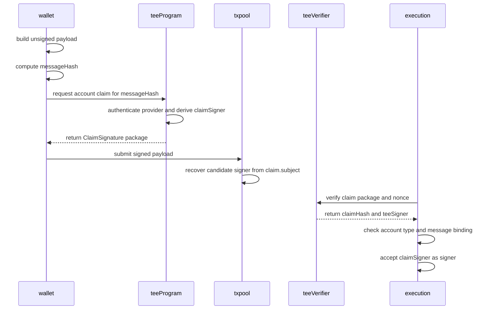
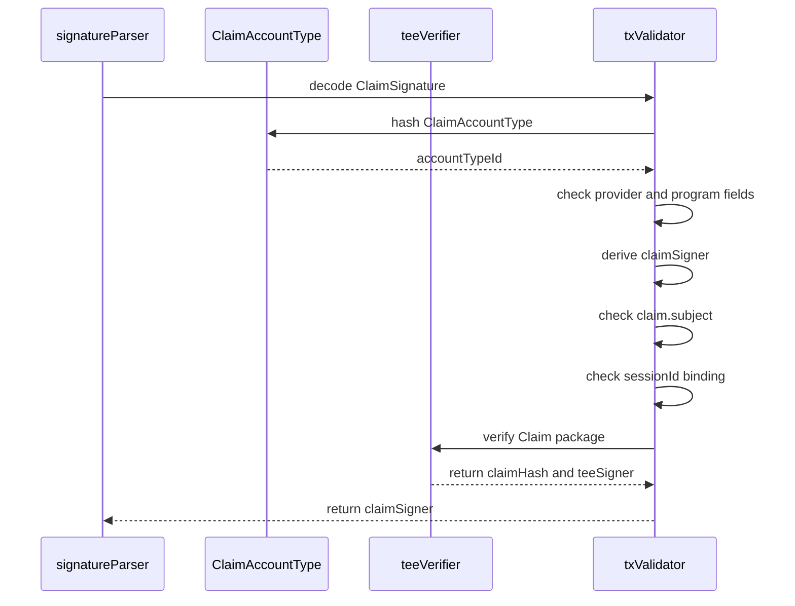
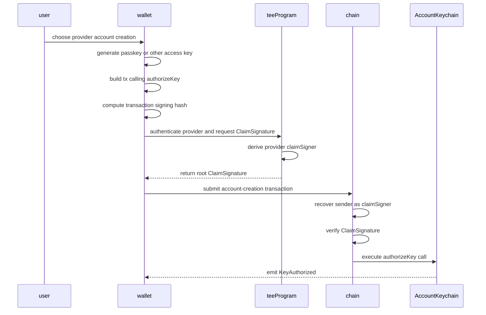
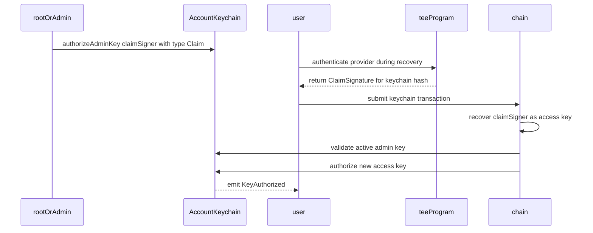
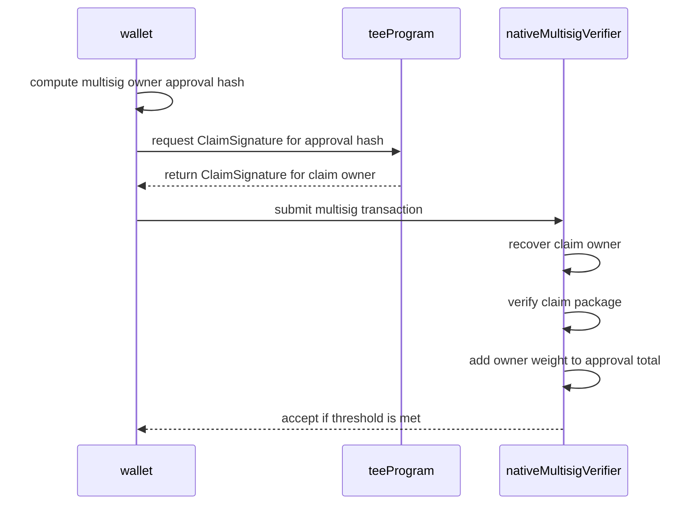
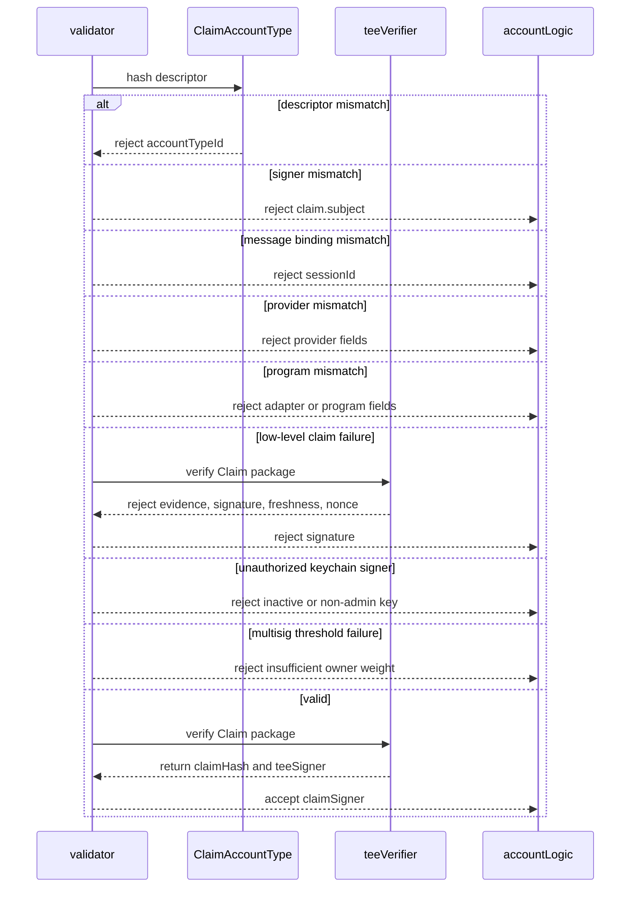

## Abstract

This TIP defines `ClaimSignature`, a new account signature type backed by a
verified `Claim` from TIP-1075.

`ClaimSignature` can be used as:

- a root account signature, enabling provider-backed account creation;
- an AccountKeychain access-key signature type, enabling ordinary accounts to
  register a proof-backed recovery key; and
- a native multisig owner signature type, enabling proof-backed owners to
  contribute weight like WebAuthn or secp256k1 owners.

The proof-backed key is not an arbitrary account authorization primitive. It is
a signer. The recovered signer is the account address derived from a claim
account type descriptor. Once a proof-backed signer is root or is registered as
an admin access key, it can authorize new ordinary access keys using the
existing keychain rules. This keeps the normal path proof-free while allowing
proof-backed bootstrap and recovery.

## Motivation

Tempo already treats WebAuthn as an account key. A user can create a new account
whose root signer is derived from a passkey public key, and later authorize
access keys through normal AccountKeychain flows.

TEE-backed claims should fit the same mental model. For a provider-backed
account, the root signer is not a P256 public key. It is a stable
claim-derived signer for the user's account under a provider schema. A
transaction signed by that root key carries a fresh claim package instead of a
WebAuthn assertion.

This enables three important flows:

1. **Create or operate an account with a provider.** A provider-backed root
   `ClaimSignature` can sign root transactions. Google account sign-in is a
   concrete example.
   The account-creation transaction is the zero-state case and may call
   AccountKeychain to add a passkey or other access key.
2. **Recover an ordinary account.** An account with a normal root key can
   register a provider-backed admin access key. Later, a fresh proof can sign
   one recovery transaction that authorizes a new access key.
3. **Use proof-backed multisig owners.** A native multisig config can include a
   claim-derived owner address. A fresh proof then counts as that owner's
   approval.

The design intentionally avoids requiring TEE proofs on every ordinary
transaction. A proof-backed root key remains usable after account creation, but
proofs are required whenever that proof-backed signer is the active signer.
After a proof-backed signer adds a normal access key, normal key signatures can
be used for the proof-free path.

## Assumptions

- TIP-1075 verifies `Claim`, raw evidence, and TEE claim signatures.
- TIP-1076 or a provider-specific TIP defines the provider fields and
  verification method used by the account type descriptor.
- This TIP uses the TEE-backed branches of TIP-1076. Native provider-signed
  account signatures that bypass TIP-1075 are left to a later TIP.
- The account type descriptor binds the provider schema and TEE program that
  derive the signer address from the authenticated off-chain identity. The
  caller cannot choose an arbitrary `subject`.
- `ClaimSignature` validation is stateful because it calls the `teeVerifier`
  and consumes the claim nonce.
- AccountKeychain and native multisig validation are extended to treat
  `ClaimSignature` as one of the supported signature types.
- Raw emails, credentials, and provider secrets are never included in calldata
  or stored on-chain.

## Threat Model

This TIP protects against a valid claim being replayed as a signature for the
wrong message, wrong account, wrong provider, or wrong signature context.

The following actors are considered:

| Actor | Role |
| --- | --- |
| `user` | Authenticates to the off-chain provider. |
| `wallet` | Builds the unsigned transaction or authorization payload. |
| `teeProgram` | Checks the provider and emits a transaction-bound claim. |
| `teeVerifier` | Verifies the claim package and consumes its nonce. |
| `claimSigner` | Address recovered from the proof-backed signature. |
| `account` | Root account or account that registered a proof-backed access key. |
| `accessKey` | Ordinary or proof-backed key in AccountKeychain. |
| `multisig` | Native multisig account with weighted owners. |

Account type descriptors are security critical. If a descriptor points at a
weak provider schema or a TEE program that lets callers choose arbitrary
subjects, accounts created or keys registered with that descriptor are unsafe.
This does not let the descriptor control unrelated accounts, because the
recovered signer remains namespaced by the descriptor hash.

## Specification

### Overview

`ClaimSignature` makes a verified claim behave like a signer:

```text
claimSigner = recoverClaimSigner(claimSig, messageHash)
```

The recovered signer may be used anywhere the protocol accepts the new claim
signature type:

| Location | Meaning |
| --- | --- |
| Root transaction signature | The account itself is proof-backed. |
| Keychain inner signature | A registered proof-backed access key signs. |
| Key authorization signature | A proof-backed root or admin key authorizes a key. |
| Native multisig owner signature | A proof-backed owner contributes weight. |

`messageHash` is the exact hash that the corresponding signature position would
normally sign:

| Signature position | Message hash |
| --- | --- |
| Root transaction | Transaction signing hash. |
| Keychain inner signature | V2 keychain signing hash. |
| Key authorization | Key authorization signing hash. |
| Native multisig owner | Native multisig owner approval hash. |

The same claim package cannot be reused across positions because the claim binds
to both `messageHash` and a signature context.



### Terminology

| Term | Meaning |
| --- | --- |
| `ClaimSignature` | Signature payload containing a TIP-1075 claim package. |
| `claimSigner` | Address recovered from a valid `ClaimSignature`. |
| `ClaimAccountType` | Provider, program, and derivation descriptor. |
| `accountTypeId` | Hash of `ClaimAccountType` and signer namespace. |
| `signerId` | Stable identity commitment for the off-chain account. |
| `signatureContext` | Domain indicating what the claim signs. |
| `messageHash` | Existing digest for the transaction or authorization. |
| `claimPackage` | Claim, raw evidence, and TEE claim signature. |

### Signature Type Integration

The activating fork adds `ClaimSignature` to the account-authority signature
set. It may be used in four places:

| Position | Required support |
| --- | --- |
| Root account signature | Recover a `claimSigner` as transaction sender. |
| AccountKeychain inner signature | Accept `Claim` as an access-key type. |
| Key authorization signature | Accept `ClaimSignature` for root/admin keys. |
| Native multisig owner signature | Accept `ClaimSignature` for owner approval. |

Key authorization signatures are extended from primitive-only signatures to
include `ClaimSignature`. They must still reject recursive keychain and native
multisig signatures.

### Claim Signature Shape

`ClaimSignature` is a new signature type. The exact type byte is assigned by the
activating fork. If native multisig uses `0x05`, the next candidate is `0x06`.

```text
struct ClaimSignature {
    bytes32 accountTypeId;       // hashClaimAccountType(accountType).
    ClaimAccountType accountType; // Provider and derivation descriptor.
    bytes32 signerId;            // Stable provider identity commitment.
    bytes32 signatureContext;    // Root tx, keychain, key auth, or multisig.
    Claim claim;                 // TIP-1075 claim.
    bytes rawEvidence;           // Evidence consumed by teeVerifier.
    bytes teeSignature;          // TEE signature over the claim.
}
```

`ClaimSignature` may appear as a root transaction signature, as the inner
signature of a keychain signature, as a key authorization signature, or as a
native multisig owner signature. It must not recursively contain another
keychain or multisig signature.

### Account Type Descriptor

`ClaimAccountType` is a provider-backed signer namespace. It is a descriptor,
not a global provider registry.

```text
struct ClaimAccountType {
    bytes32 verificationMethod;  // TIP-1076 TEE-backed method.
    bytes32 providerHash;        // Required Claim.providerHash.
    bytes32 claimType;           // Required Claim.claimType.
    bytes32 sourceHash;          // Required Claim.sourceHash.
    bytes32 adapterId;           // Required Claim.adapterId.
    bytes32 programHash;         // Required Claim.programHash.
    bytes32 derivationPolicyHash;// SignerId derivation policy.
}
```

The `accountTypeId` is:

```text
accountTypeId = H("ClaimAccountType:v1", canonicalClaimAccountType)
```

An implementation may cache descriptors in state for gas or calldata
compression, but this TIP does not require a consensus provider registry or a
governance approval step for account types. Wallets and apps may still maintain
curated descriptor lists, labels, and warnings.

An account type says which provider schema, verification method, TEE program,
and derivation policy can act as a signer namespace. It is not per-account
configuration. This is what allows a new provider-backed account to exist
before any on-chain state has been written for it.

Multiple provider hashes under the same `accountTypeId` are impossible unless
they produce the same descriptor hash. Compatible provider upgrades therefore
create new account types unless a later TIP defines an explicit migration or
descriptor-versioning mechanism.

### Provider Binding

Any provider schema from TIP-1076 can define a claim account type. Google
account sign-in is only a useful example, not a privileged provider.

Once an account or access key uses a `ClaimAccountType`, it is bound to that
account type's provider commitments. A later `ClaimSignature` for the same
signer position must use the same `accountTypeId` and must satisfy the same
provider, verification method, source, adapter, program, and derivation
requirements.

Different providers must use different signer namespaces. A user cannot create
or register a Google-account-backed signer and later present a claim from
another provider, such as TikTok, expecting it to recover the same account or
access key. To add another provider, the existing root key, admin key, or
multisig threshold must explicitly authorize a new proof-backed key for that
provider.

Different verification methods are also different namespaces. A Google OIDC
account provider and a Google authenticated-web-session provider do not recover
the same signer unless a later TIP defines an explicit migration between
account types.

Native provider-signed responses are part of the TIP-1076 waterfall, but they
are not a `ClaimSignature` unless an approved TEE program wraps the provider
response into a TIP-1075 claim. A future TIP may define a separate
provider-signed account signature type that does not call `teeVerifier`.

### Signer Derivation

Each account type defines how the TEE program derives `signerId` from the
provider response. The `signerId` must be opaque and non-enumerable. It must
not be a raw email address, stable provider account id, or unsalted hash of an
enumerable identifier.

The signer address is:

```text
claimSigner = address(H("ClaimSigner:v1", accountTypeId, signerId))
```

The TEE program must set:

```text
claim.subject == claimSigner
```

The transaction validator must recompute `claimSigner` from `accountTypeId` and
`signerId`, require it equals `claim.subject`, and return it as the recovered
signer.

For a Google-account OIDC account type:

```text
accountTypeId = hashClaimAccountType(googleOidcAccountType)
signerId = H("GoogleSigner:v1", googleAccountId, derivationSecret)
claimSigner = address(H("ClaimSigner:v1", accountTypeId, signerId))
```

The Google provider must require a verified account response and must derive
from the stable Google account id. It should not derive the signer from the
email address alone, because email addresses are more enumerable and can
change.

### Message Binding

The claim must be bound to the exact message being signed:

```text
bindingHash = H(
    "ClaimSignatureBinding:v1",
    accountTypeId,
    signerId,
    signatureContext,
    messageHash
)
```

The TEE program must set:

```text
claim.sessionId == bindingHash
```

The validator must recompute `bindingHash` and reject if it differs from
`claim.sessionId`.

The initial signature contexts are:

| Context | Use |
| --- | --- |
| `ROOT_TRANSACTION` | Root account transaction signature. |
| `KEYCHAIN_INNER` | Inner signature for a keychain transaction. |
| `KEY_AUTHORIZATION` | Signature over a key authorization payload. |
| `MULTISIG_OWNER` | Native multisig owner approval signature. |

The claim nonce remains a separate replay-protection word. The validator must
use the TIP-1075 nonce-consuming verification path when validating a
`ClaimSignature`.

### Validation

A `ClaimSignature` is valid for `messageHash` only if all checks pass:

1. Decode the `ClaimSignature`.
2. Recompute `accountTypeId` from `ClaimAccountType`.
3. Require the recomputed id equals the encoded `accountTypeId`.
4. Require claim provider fields match the account type descriptor.
5. Require `claim.adapterId` and `claim.programHash` match the descriptor.
6. Recompute `claimSigner` from `accountTypeId` and `signerId`.
7. Require `claim.subject == claimSigner`.
8. Recompute `bindingHash`.
9. Require `claim.sessionId == bindingHash`.
10. Call `teeVerifier` to verify the claim package and consume the nonce.
11. Return `claimSigner`.

If any check fails, the signature is invalid and no transaction or account
authority state may change.

Signature recovery may parse `claim.subject` as a candidate sender before full
stateful verification. Inclusion validation must still run the full checks
above. A transaction is invalid if full claim verification fails.



### Create And Operate A Provider-Backed Account

A provider-backed root account is created and operated the same way as a
WebAuthn-backed root account: the recovered signer is the account. Google
account sign-in is the running example in this TIP, but the mechanism works
for any provider descriptor accepted by the wallet or app. There is no one-time
bootstrap rule. Any root transaction may be signed with a fresh
`ClaimSignature`.

The account-creation transaction is special only because it can create account
state before any access keys exist.

The common account-creation transaction should add a normal access key so later
activity does not need a proof.



The transaction may be sponsored by a fee payer. The fee payer signature must
bind to the same recovered sender as ordinary account-abstraction transactions.

After the access key is authorized, normal keychain transactions can be used
without claims. The provider-backed root key can still sign future root
transactions by producing fresh claim packages.

### Ordinary Accounts With Proof-Backed Access Keys

An account whose root key is not proof-backed can still use proofs for recovery
by registering a proof-backed access key.

The access key row stores:

```text
keyId = claimSigner
signatureType = Claim
isAdmin = true or false
```

If the proof-backed key is registered as an admin key, it can later authorize
new ordinary access keys using TIP-1049 admin-key rules. This is the recovery
path:

1. While the account is healthy, root or an existing admin key registers a
   provider-backed `claimSigner` as an admin access key.
2. If ordinary keys are lost, the user authenticates to the provider.
3. The provider-backed admin key signs a transaction with a keychain
   `ClaimSignature`.
4. The transaction calls AccountKeychain or carries a key authorization for a
   new ordinary access key.
5. Future transactions use the new ordinary key.



Non-admin proof-backed access keys may sign ordinary keychain transactions
subject to their spending limits and call scopes. They cannot authorize other
keys.

### Claim-Signed Key Authorizations

Key authorization signatures must accept `ClaimSignature` when the recovered
signer is allowed to authorize the target account under existing
AccountKeychain rules:

- if `claimSigner == account`, the proof-backed root key authorizes the new key;
- if `claimSigner` is an active admin access key for `account`, the admin key
  authorizes the new key; and
- otherwise the key authorization is invalid.

The `KEY_AUTHORIZATION` signature context must be used for the claim binding.
The existing key authorization fields still bind the chain id, key id,
signature type, restrictions, admin flag, witness, and account.

When a proof-backed admin access key signs a key authorization, TIP-1049's
same-signer rule still applies. The transaction carrying that key authorization
must be signed by the same recovered `claimSigner`.

### Native Multisig

Native multisig owner verification should accept `ClaimSignature` as an owner
signature type.

A native multisig owner entry remains:

```text
owner: address
weight: uint32
```

If `owner` is a `claimSigner`, the owner proves approval by providing a
`ClaimSignature` whose recovered signer equals that owner. The
`MULTISIG_OWNER` signature context must be used for the claim binding.

This gives native multisig the same composition as ordinary keys:

- a multisig can be created with a provider-backed owner;
- a multisig can add a provider-backed owner through an ordinary threshold
  update;
- a provider-backed owner can participate in future threshold signatures; and
- a provider-backed owner can approve config changes when its weight satisfies
  the normal threshold rules with the other owners.

There is no special proof bypass for native multisig threshold logic. Proofs
only recover owner addresses. The native multisig verifier still sums owner
weights and enforces the current config.



### Signature Verifier Precompile

The stateless `recover` and `verify` methods from TIP-1020 should continue to
support stateless signatures. A `ClaimSignature` is stateful because it calls
`teeVerifier` and consumes a nonce.

This TIP therefore does not require TIP-1020 `recover` and `verify` to accept
`ClaimSignature`. A later interface may add an explicit stateful claim
signature verification method. Until then, contracts should treat
`ClaimSignature` as a transaction and account-authority signature type, not a
drop-in replacement for stateless signature verification.

### Failure Boundaries



### Non-Goals

This TIP does not specify:

- provider schema internals;
- public attestation registries;
- per-account authorization gates for arbitrary application actions;
- native provider-signed account signatures that bypass TIP-1075;
- social recovery voting;
- raw email disclosure;
- using a proof on every ordinary transaction after a normal key is authorized;
  or
- native multisig threshold bypasses.

## Observability

When a `ClaimSignature` is accepted during transaction validation or account
authority validation, clients should be able to observe:

```text
event ClaimSignatureVerified(
    address indexed claimSigner,
    bytes32 indexed accountTypeId,
    bytes32 indexed claimHash,
    bytes32 signatureContext,
    address teeSigner
)
```

AccountKeychain and native multisig must still emit their existing events for
state changes caused by proof-backed signers.

Events must not include raw provider values, emails, credentials, or committed
field preimages.

## Invariants

- `ClaimSignature` recovers exactly one `claimSigner`.
- `claimSigner` is derived from `accountTypeId` and `signerId`.
- `claim.subject` equals `claimSigner`.
- `claim.sessionId` binds to the signature context and message hash.
- `accountTypeId` is the hash of `ClaimAccountType`.
- Claim provider, source, adapter, and program fields match the descriptor.
- Provider-backed signers are bound to their `accountTypeId` and descriptor
  fields.
- Claims from a different provider do not recover the same account or access
  key.
- Claims from a different verification method do not recover the same account
  or access key.
- Claim nonce consumption happens during inclusion validation.
- `ClaimSignature` always verifies through TIP-1075.
- Native provider-signed responses do not satisfy `ClaimSignature` unless they
  are wrapped in a valid TIP-1075 claim.
- A proof-backed root account can create account state.
- A proof-backed root account can keep signing root transactions after account
  creation.
- An ordinary account can use proof-backed recovery only after registering the
  proof-backed key.
- Non-admin proof-backed access keys cannot authorize other keys.
- Admin proof-backed access keys follow the same admin rules as other admin
  access keys.
- Native multisig proof-backed owners follow the same weight and threshold
  rules as other owners.
- A failed claim verification cannot mutate AccountKeychain or native multisig
  state.
- Normal access-key transactions do not require claim proofs.

## Test And Review Plan

Reviewers should check:

- root `ClaimSignature` account creation with a provider descriptor;
- account-creation transaction authorizing a WebAuthn or P256 access key;
- subsequent keychain transactions from the new access key without proofs;
- registering a proof-backed admin access key on an ordinary account;
- using that proof-backed admin key to authorize a new ordinary key;
- rejecting proof-backed key authorization from a non-admin proof-backed key;
- using `ClaimSignature` as a native multisig owner approval;
- rejecting descriptor and `accountTypeId` mismatches;
- rejecting wrong `providerHash`, `claimType`, or `sourceHash`;
- rejecting wrong `verificationMethod`, `adapterId`, or `programHash`;
- rejecting native provider-signed responses that are not wrapped in a valid
  TIP-1075 claim;
- rejecting a claim from a different provider for an existing proof-backed
  signer;
- rejecting a claim from a different verification method for an existing
  proof-backed signer;
- adding a second provider-backed key only through existing account authority;
- rejecting wrong `accountTypeId`, `signerId`, or derived signer;
- rejecting wrong `signatureContext` or `messageHash` binding;
- rejecting replayed claim nonces;
- rejecting stale or future claims through TIP-1075;
- rejecting invalid evidence or TEE claim signatures;
- rejecting native multisig approvals whose recovered claim owner is not in the
  current config; and
- preserving all existing AccountKeychain and native multisig invariants.
