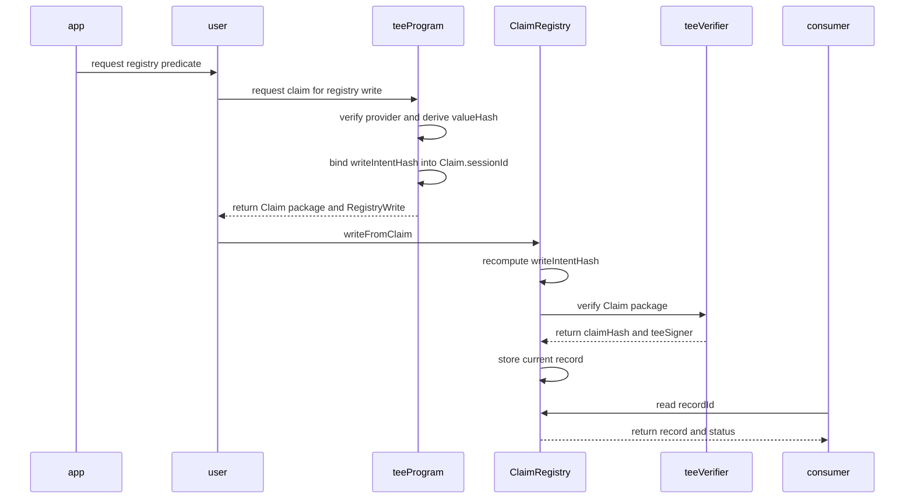
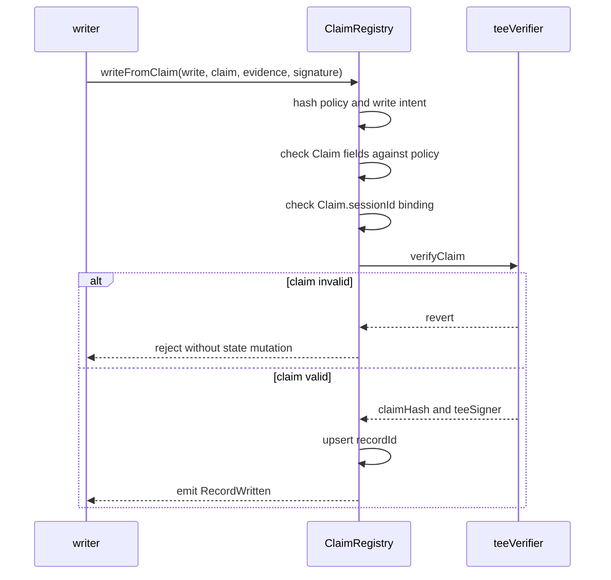
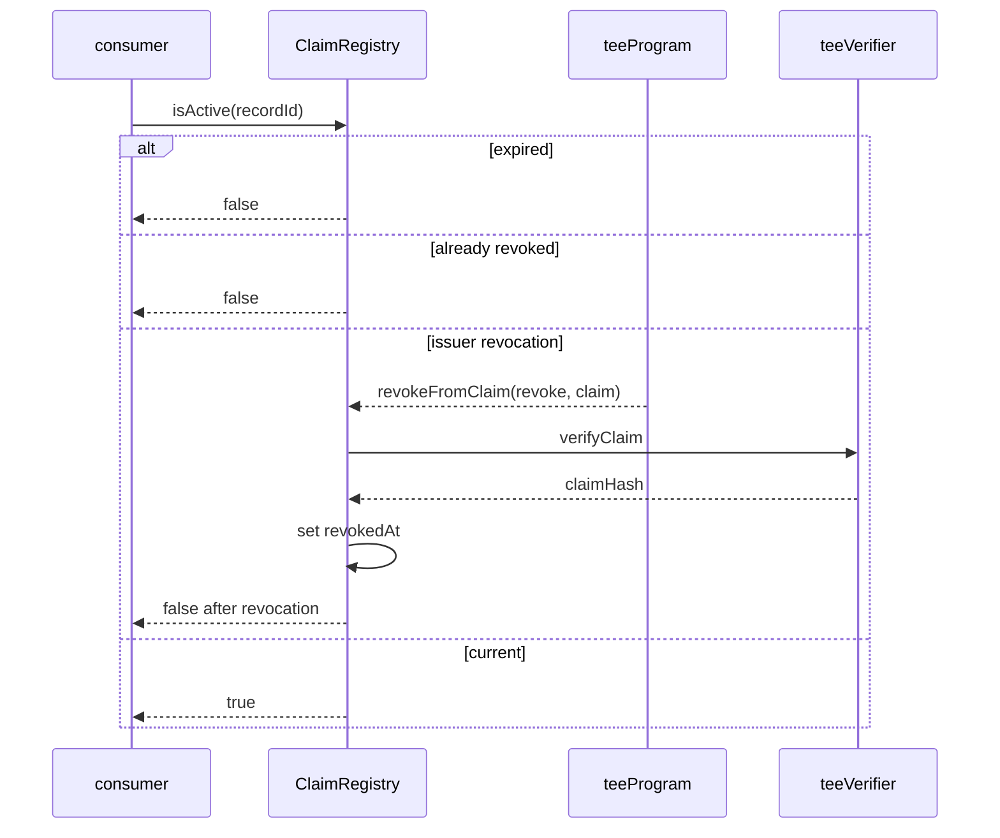
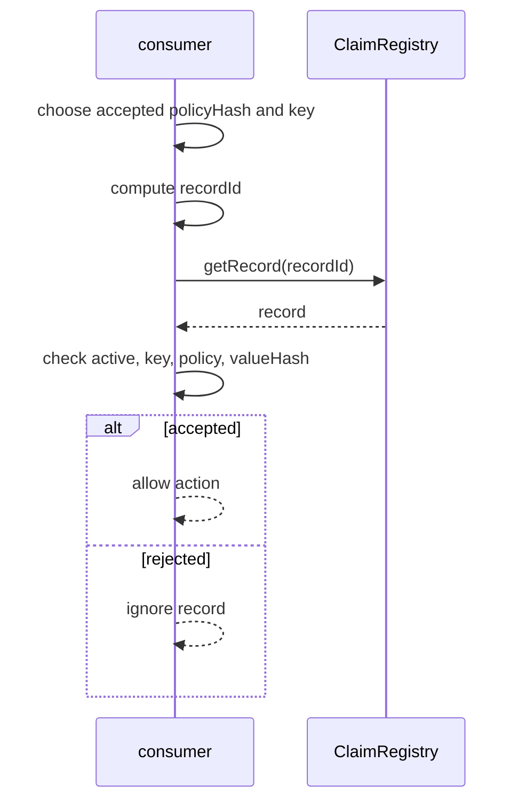
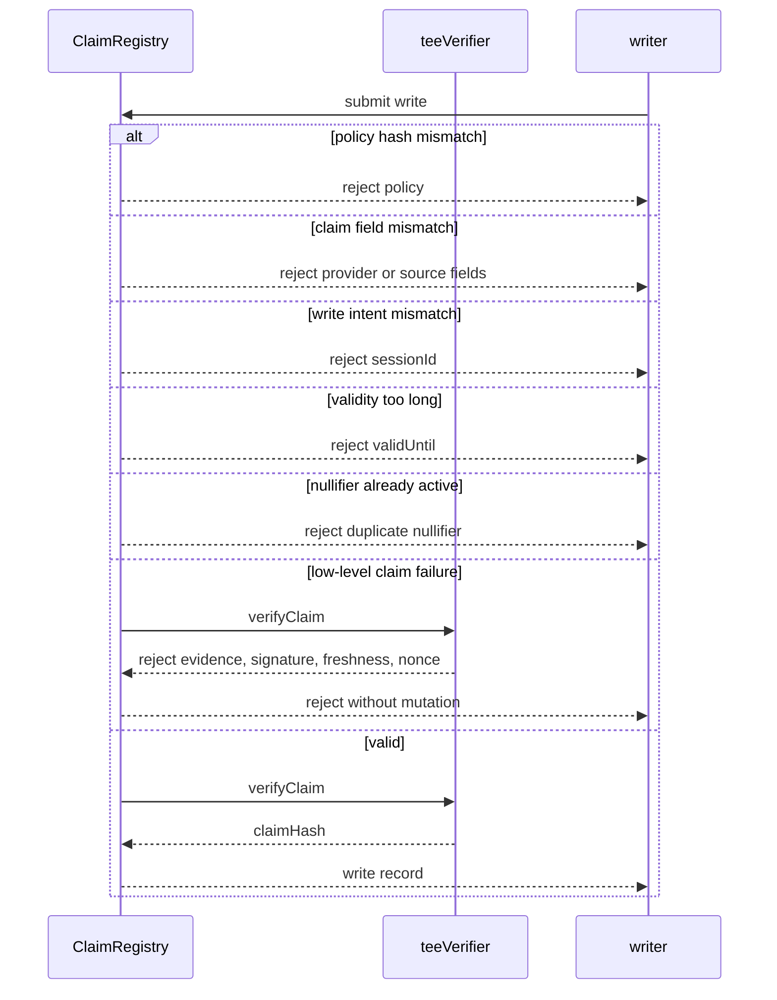

## Abstract

This TIP defines `ClaimRegistry`, an on-chain registry for records derived from
verified off-chain facts.

The registry lets users, apps, and contracts store durable records such as:

- an account has a required KYC level;
- an account passed a humanity or liveness check;
- an account owns or controls an off-chain provider account;
- an account satisfies a financial predicate; or
- an app-specific predicate was verified under a known provider policy.

The registry stores public record keys and opaque commitments, not raw provider
data. A record is credible only when it is linked to a verification source,
such as a TIP-1075 `Claim`, a provider-signed response defined by a later TIP,
or another accepted verification method.

## Motivation

TIP-1075 verifies a claim at one point in time. TIP-1076 defines how provider
facts become claim fields. TIP-1077 uses claims as account signatures.

Applications also need a persistent place to read claim-derived facts. An
off-chain service may want to check whether an account has a sufficient KYC
level. A contract may want to know whether a subject has a current, coarse
humanity credential. A wallet may want to display which claim-derived records
are attached to an account.

The registry is the durable layer for those records. It is intentionally not a
raw data store. It is a keyed record store where each record points at the
provider policy and verification material that produced it.

The long-term ideal remains provider-native signed data. When providers sign
responses and maintain public keys on Tempo, records can point at that native
verification path. Until then, the registry can consume TEE-backed claims from
TIP-1075 so the ecosystem has broad coverage.

## Assumptions

- TIP-1075 verifies TEE-backed claims and consumes claim nonces.
- TIP-1076 defines provider schemas, verification methods, and provider hashes.
- Native provider-signed registry writes are left to a later TIP unless the
  provider-signed response is wrapped by a valid TIP-1075 claim.
- Raw credentials, provider responses, documents, biometrics, emails, and
  stable provider account ids are never stored in registry state.
- Consumers choose the policies, providers, schemas, and record keys they trust.
- The registry does not decide that a KYC, humanity, credit, or account
  ownership schema is globally meaningful.

## Threat Model

The registry protects against valid claims being reused to write a different
record than the one the TEE program authorized.

The following actors are considered:

| Actor | Role |
| --- | --- |
| `subject` | Account or object the registry record is about. |
| `user` | Obtains a claim or provider proof for the subject. |
| `app` | Requests or reads records under policies it accepts. |
| `teeProgram` | Produces claim-bound registry write material. |
| `teeVerifier` | Verifies a TIP-1075 claim and consumes its nonce. |
| `writer` | Submits a registry write transaction. |
| `consumer` | Reads registry state and applies its own policy. |
| `observer` | Watches calldata, events, and registry state. |

The registry does not hide the existence of a record. If a record says that an
account satisfies `kyc.level.ge.2`, that predicate is public. Privacy comes
from making the predicate coarse and from storing commitments for private
details.

## Specification

### Overview

`ClaimRegistry` stores current records keyed by subject, schema, key, and
policy:

```text
recordId = H("RegistryRecordId:v1", subject, schemaId, key, policyHash)
```

The registry does not parse provider responses. It verifies that a registry
write was bound into a verified claim, then stores the committed record value.



### Terminology

| Term | Meaning |
| --- | --- |
| `ClaimRegistry` | Registry storing current claim-derived records. |
| `RegistryPolicy` | Descriptor for accepted provider and record semantics. |
| `policyHash` | Hash of `RegistryPolicy`; consumers decide which to trust. |
| `schemaId` | Application or ecosystem namespace for a record family. |
| `key` | Predicate or record key inside `schemaId`. |
| `valueHash` | Public value or commitment stored for the record. |
| `nullifierHash` | Optional uniqueness commitment for one-person policies. |
| `recordId` | Deterministic key for the current registry record. |
| `writeIntentHash` | Digest that binds a claim to one registry write. |

### Registry Policy

`RegistryPolicy` describes the verification source accepted for a record. It is
permissionless: consumers choose which `policyHash` values they trust.

```text
struct RegistryPolicy {
    bytes32 schemaId;             // Record family namespace.
    bytes32 verificationMethod;   // TIP-1076 verification method.
    bytes32 providerHash;         // Required Claim.providerHash.
    bytes32 claimType;            // Required Claim.claimType.
    bytes32 sourceHash;           // Required Claim.sourceHash.
    bytes32 adapterId;            // Required Claim.adapterId.
    bytes32 programHash;          // Required Claim.programHash.
    bytes32 valuePolicyHash;      // How valueHash is derived.
    uint64 maxValiditySeconds;    // Max record lifetime after claim issuance.
    bytes32 revocationMode;       // None, issuer, subject, or either.
}
```

The `policyHash` is:

```text
policyHash = H("RegistryPolicy:v1", canonicalRegistryPolicy)
```

The registry may cache policies for gas or calldata compression, but this TIP
does not require governance approval for policies. Wallets, apps, and services
may maintain curated policy lists and labels.

### Registry Write

A registry write is the record material authorized by a claim.

```text
struct RegistryWrite {
    address subject;       // Account or object the record is about.
    bytes32 policyHash;    // Hash of the RegistryPolicy.
    RegistryPolicy policy; // Verification and validity descriptor.
    bytes32 key;           // Predicate key within policy.schemaId.
    bytes32 valueHash;     // Public value or private commitment.
    bytes32 nullifierHash; // Optional uniqueness commitment, or zero.
    bytes32 contextHash;   // App, audience, or purpose binding, or zero.
    uint64 validUntil;     // Record expiration timestamp.
}
```

The claim's own `expiresAt` bounds how fresh the proof must be when the write
is submitted. `validUntil` bounds how long the stored record may be used after
the claim has been accepted. A policy may allow a record to outlive the claim's
short proof TTL, but only up to `maxValiditySeconds` after `claim.issuedAt`.

The registry computes:

```text
recordId = H(
    "RegistryRecordId:v1",
    write.subject,
    write.policy.schemaId,
    write.key,
    write.policyHash
)
```

and:

```text
writeIntentHash = H(
    "RegistryWrite:v1",
    chainId,
    registryAddress,
    write.subject,
    write.policyHash,
    write.key,
    write.valueHash,
    write.nullifierHash,
    write.contextHash,
    write.validUntil
)
```

The TEE program MUST set:

```text
claim.subject == write.subject
claim.sessionId == writeIntentHash
```

This prevents a valid claim from being reused to write a different subject,
key, value, policy, context, or expiration.

### Record

The registry stores the current record for each `recordId`:

```text
struct RegistryRecord {
    address subject;       // Account or object the record is about.
    bytes32 policyHash;    // Policy accepted for this record.
    bytes32 schemaId;      // Record family namespace.
    bytes32 key;           // Predicate key.
    bytes32 valueHash;     // Public value or private commitment.
    bytes32 nullifierHash; // Optional uniqueness commitment, or zero.
    bytes32 claimHash;     // TIP-1075 claim hash that wrote the record.
    uint64 issuedAt;       // Claim issuance time.
    uint64 validUntil;     // Record expiration timestamp.
    uint64 revokedAt;      // Zero unless revoked.
}
```

The latest valid write replaces the current record at `recordId`. Historical
writes remain observable through events.

### Registry Revoke

Issuer revocation uses a separate intent:

```text
struct RegistryRevoke {
    bytes32 recordId;      // Record being revoked.
    address subject;       // Subject in the existing record.
    bytes32 policyHash;    // Policy used by the existing record.
    RegistryPolicy policy; // Verification and revocation descriptor.
    bytes32 key;           // Key used by the existing record.
    bytes32 contextHash;   // App, audience, or purpose binding, or zero.
}
```

The registry computes:

```text
revokeIntentHash = H(
    "RegistryRevoke:v1",
    chainId,
    registryAddress,
    revoke.recordId,
    revoke.subject,
    revoke.policyHash,
    revoke.key,
    revoke.contextHash
)
```

The TEE program MUST set `claim.sessionId == revokeIntentHash` for issuer
revocations.

### Interface

A future fork SHOULD expose `ClaimRegistry` as a precompile or system contract.
The final address is TBD.

```text
interface IClaimRegistry {
    function writeFromClaim(
        RegistryWrite calldata write,
        Claim calldata claim,
        bytes calldata rawEvidence,
        bytes calldata teeSignature
    ) external returns (bytes32 recordId);

    function revokeFromClaim(
        RegistryRevoke calldata revoke,
        Claim calldata claim,
        bytes calldata rawEvidence,
        bytes calldata teeSignature
    ) external returns (bytes32 recordId);

    function getRecord(bytes32 recordId)
        external
        view
        returns (RegistryRecord memory record);

    function isActive(bytes32 recordId)
        external
        view
        returns (bool active);

    function hashPolicy(RegistryPolicy calldata policy)
        external
        pure
        returns (bytes32 policyHash);

    function hashWriteIntent(RegistryWrite calldata write)
        external
        view
        returns (bytes32 writeIntentHash);

    function hashRevokeIntent(RegistryRevoke calldata revoke)
        external
        view
        returns (bytes32 revokeIntentHash);

    function recordIdOf(RegistryWrite calldata write)
        external
        pure
        returns (bytes32 recordId);
}
```

### Write Validation

`writeFromClaim` MUST reject unless all checks pass:

1. Recompute `policyHash` from `write.policy`.
2. Require the recomputed hash equals `write.policyHash`.
3. Require `write.subject != address(0)`.
4. Require `write.key != bytes32(0)`.
5. Require `write.validUntil > block.timestamp`.
6. Require `write.validUntil <= claim.issuedAt + policy.maxValiditySeconds`.
7. Require `claim.subject == write.subject`.
8. Require `claim.providerHash == policy.providerHash`.
9. Require `claim.claimType == policy.claimType`.
10. Require `claim.sourceHash == policy.sourceHash`.
11. Require `claim.adapterId == policy.adapterId`.
12. Require `claim.programHash == policy.programHash`.
13. Recompute `writeIntentHash`.
14. Require `claim.sessionId == writeIntentHash`.
15. Call `teeVerifier.verifyClaim`.
16. Store the record with the returned `claimHash`.
17. Emit `RecordWritten`.

If verification reverts, the registry MUST NOT mutate state.



### Revocation And Expiration

Records expire automatically when `block.timestamp > validUntil`.

Revocation before expiration depends on the policy's `revocationMode`:

| Mode | Meaning |
| --- | --- |
| `None` | Record can only expire or be replaced by a later valid write. |
| `Issuer` | A valid provider claim can revoke the record. |
| `Subject` | The subject can revoke the record. |
| `Either` | Either a valid provider claim or the subject can revoke. |

Issuer revocation uses `revokeFromClaim`. The `RegistryRevoke` intent MUST be
bound into `claim.sessionId`. Subject revocation MAY be provided by a later TIP
through ordinary account authority. This TIP only requires the claim-based
revocation path.



### Nullifiers And Uniqueness

`nullifierHash` is optional. It exists for policies that need uniqueness, such
as one-human or one-provider-account records.

The registry MAY maintain:

```text
usedNullifier[policyHash][key][nullifierHash] = recordId
```

When `nullifierHash != 0`, `writeFromClaim` MUST reject if the same nullifier
is already active for a different subject under the same `(policyHash, key)`.

Nullifiers are privacy-sensitive. They MUST NOT be raw provider account ids,
raw emails, raw document numbers, or unsalted hashes of enumerable identifiers.
They SHOULD be derived inside the TEE from provider-private identity material,
policy context, and non-public secret material.

Applications SHOULD prefer app-scoped or policy-scoped nullifiers over global
nullifiers when global linkability is not required.

### Privacy

The registry is public. It MUST NOT store:

- raw provider responses;
- raw credentials or tokens;
- raw emails, phone numbers, names, or addresses;
- raw provider account ids;
- document numbers or document images;
- biometric material; or
- enumerable hashes of private identifiers.

Records should expose coarse predicates when public readability is intended:

| Predicate | Safer public shape |
| --- | --- |
| KYC level | `key = H("kyc.level.ge.2")`, `valueHash = H("true")`. |
| Age check | `key = H("age.over.18")`, `valueHash = H("true")`. |
| Humanity | `key = H("humanity.unique")`, with scoped nullifier. |
| Balance | `key = H("balance.ge.threshold")`, commitment to threshold. |

Fine-grained private values should be committed, not disclosed. Consumers that
need raw data should receive it off-chain from the user or provider, then check
that it matches the on-chain commitment.

### Consumer Acceptance

A consumer MUST treat registry success as necessary but not sufficient. It
must choose:

- accepted `policyHash` values;
- accepted `schemaId` and `key` pairs;
- whether expired records are rejected;
- whether revoked records are rejected;
- whether nullifier uniqueness is required; and
- whether `valueHash` represents a public predicate or private commitment.

Consumers SHOULD read by `recordId` derived from their accepted policy. They
SHOULD NOT scan for any record that appears to be about the subject and treat it
as equivalent.



### Failure Boundaries



### Non-Goals

This TIP does not specify:

- provider schemas or extraction rules;
- account signatures or access-key authorization;
- native provider-signed write verification that bypasses TIP-1075;
- encrypted disclosure to selected readers;
- private set membership or hidden registry reads;
- global KYC, humanity, or credit policy;
- social recovery voting; or
- deletion of historical on-chain events.

## Observability

The registry MUST emit events for writes and revocations:

```text
event RecordWritten(
    bytes32 indexed recordId,
    address indexed subject,
    bytes32 indexed policyHash,
    bytes32 key,
    bytes32 valueHash,
    bytes32 nullifierHash,
    bytes32 claimHash,
    uint64 validUntil
)

event RecordRevoked(
    bytes32 indexed recordId,
    address indexed subject,
    bytes32 indexed policyHash,
    bytes32 claimHash,
    uint64 revokedAt
)
```

Events MUST NOT include raw provider values, credentials, PII, or committed
field preimages.

## Invariants

- `recordId` is derived from subject, schema, key, and policy.
- `policyHash` is derived from the canonical `RegistryPolicy`.
- `claim.sessionId` binds to exactly one `RegistryWrite`.
- `claim.subject` equals `write.subject`.
- Claim provider, source, adapter, and program fields match the policy.
- `write.validUntil` does not exceed the policy's max validity.
- A failed claim verification cannot mutate registry state.
- A consumed claim nonce cannot write two records.
- Active records are not expired and not revoked.
- Duplicate active nullifiers are rejected when a nullifier is present.
- Raw provider data and credentials are never stored in registry state.
- Consumers choose accepted policies; the registry does not bless schemas.

## Test And Review Plan

Reviewers should check:

- writing a record from a valid TIP-1075 claim;
- rejecting policy hash mismatches;
- rejecting wrong `providerHash`, `claimType`, or `sourceHash`;
- rejecting wrong `adapterId` or `programHash`;
- rejecting `claim.subject != write.subject`;
- rejecting `claim.sessionId != writeIntentHash`;
- rejecting expired claims through TIP-1075;
- rejecting `validUntil` beyond policy max validity;
- rejecting replayed claim nonces;
- replacing the current record after a later valid write;
- preserving historical write events;
- revoking by claim when revocation mode allows it;
- rejecting revoke intents that do not match `claim.sessionId`;
- rejecting duplicate active nullifiers for different subjects;
- allowing scoped nullifiers under different policies or keys;
- reading active, expired, and revoked records;
- consumers rejecting records under unaccepted policies; and
- ensuring raw PII, credentials, and provider responses never appear in state or
  events.
