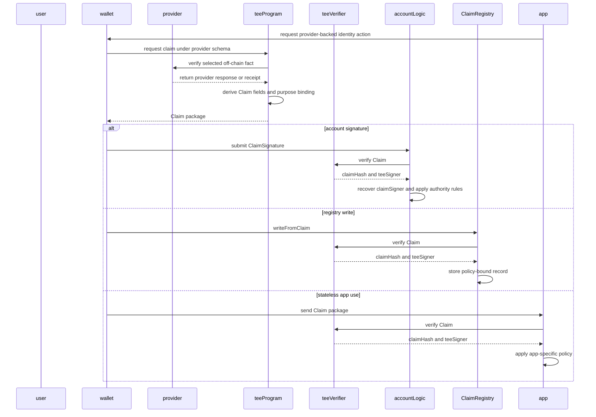
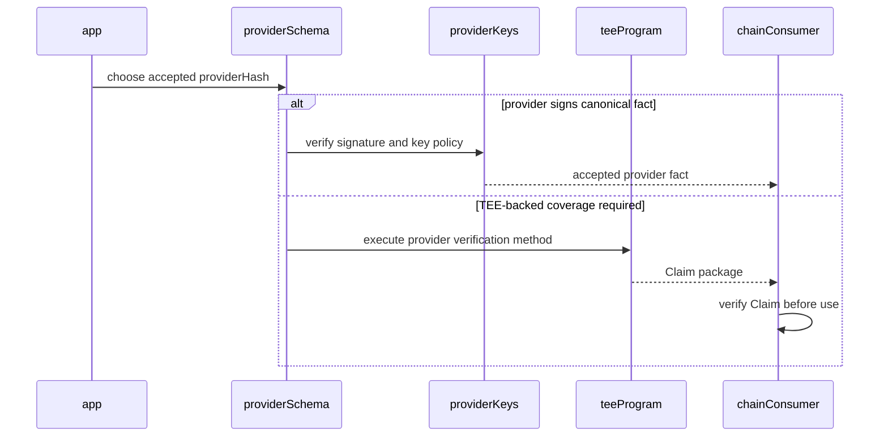
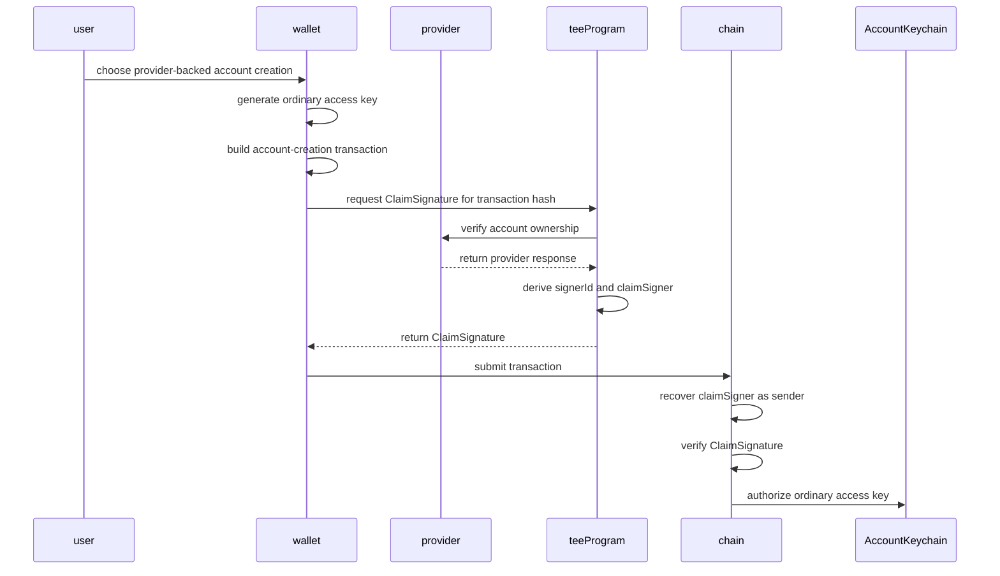
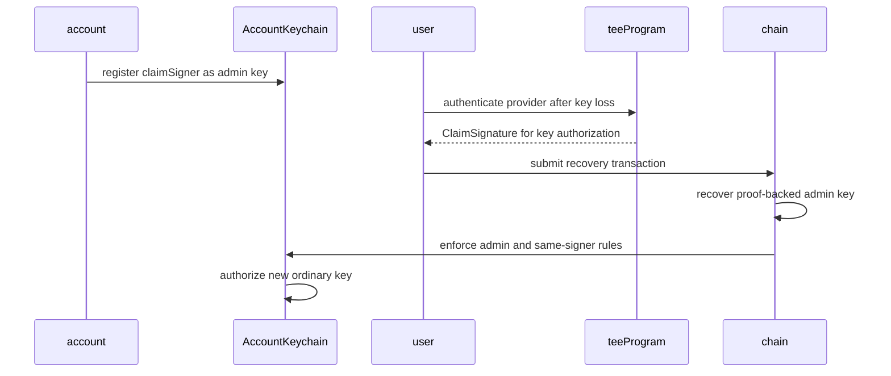
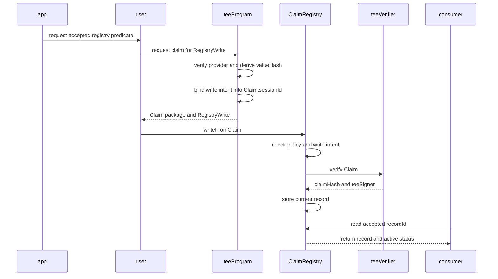

## Abstract

This TIP defines the identity architecture formed by TIP-1075, TIP-1076,
TIP-1077, and TIP-1078.

Identity is not a global account database and not a single provider registry.
It is a set of composable verification paths that let users prove selected
off-chain facts, derive proof-backed signers, recover accounts, participate in
native multisig, and publish privacy-preserving registry records.

The stack has four layers:

- TIP-1075 verifies low-level TEE-backed `Claim` packages.
- TIP-1076 defines provider schemas and the verification waterfall that
  produces claim material.
- TIP-1077 turns provider-bound claims into account signatures and
  proof-backed keys.
- TIP-1078 stores durable claim-derived records for apps and contracts.

This TIP does not introduce new precompiles, state objects, or signature bytes.
It specifies how the layers fit together and which boundaries consumers must
preserve.

## Motivation

Tempo accounts should be easy to create and recover without forcing users to
begin with a blockchain key. Users already have accounts, credentials, and
relationships with off-chain providers. Apps also need coarse, reusable facts:
a subject owns an off-chain account, passed a verification level, is unique
under a policy, or satisfies a financial predicate.

The cleanest long-term path is provider-native signed data. If every provider
signed canonical responses and maintained public keys on Tempo, consumers could
verify provider facts directly. That is the north star.

Most providers will not expose that path immediately. The identity layer
therefore uses a waterfall. It prefers native signed data when available, then
uses TEE-backed provider schemas for OAuth/OIDC, provider APIs, hosted flows,
authenticated HTTPS receipts, and public HTTPS fetches.

This gives broad coverage while keeping the chain's role narrow. The chain does
not parse login flows, web pages, provider responses, documents, or credentials.
It verifies fixed-width claims, account signature bindings, and registry write
bindings.

## Architecture

Identity is a consumer of verified facts, not a replacement for account
authority. A verified claim becomes meaningful only after a consumer checks the
provider, source, extraction, purpose, and replay bindings it expects.

| Layer | TIP | Responsibility |
| --- | --- | --- |
| Claim verifier | TIP-1075 | Verify evidence, signer, freshness, and nonce. |
| Provider schema | TIP-1076 | Define how off-chain facts become claim fields. |
| Proof-backed keys | TIP-1077 | Use claims as root, keychain, and multisig signers. |
| Claim registry | TIP-1078 | Store durable claim-derived records. |

The low-level verifier does not approve provider hashes. Provider and identity
meaning are approved by the account type descriptor, registry policy, app
policy, wallet policy, or consumer contract.

### Terminology

| Term | Meaning |
| --- | --- |
| `subject` | Account, signer, or object that a claim or record is about. |
| `provider fact` | Off-chain fact checked under a provider schema. |
| `providerHash` | Hash of the provider schema and verification method. |
| `Claim` | Fixed-width TIP-1075 object signed by a TEE-bound signer. |
| `teeVerifier` | Low-level verifier for claim evidence and signature. |
| `claimSigner` | Address derived from a provider-bound account claim. |
| `ClaimSignature` | Account signature type backed by a verified claim. |
| `accountTypeId` | Hash of a provider-backed signer descriptor. |
| `RegistryPolicy` | Descriptor for accepted registry record semantics. |
| `policyHash` | Hash of a registry policy chosen by a consumer. |
| `nullifierHash` | Optional scoped uniqueness commitment. |
| `sessionId` | Purpose binding for app, signature, write, or revoke intent. |
| `nonce` | Replay challenge consumed by `teeVerifier`. |

### System Flow



## Principles

The identity layer follows these principles:

- **Provider-bound.** A provider-backed signer or record is tied to the
  provider schema that produced it.
- **Policy-bound.** Consumers choose accepted `providerHash`, `accountTypeId`,
  `policyHash`, source, extraction, and freshness semantics.
- **Purpose-bound.** `sessionId` binds a claim to one transaction, registry
  write, revocation, or app action.
- **Replay-resistant.** `nonce` is consumed by TIP-1075 for the claim subject.
- **Least-disclosure.** On-chain data uses public predicates and commitments,
  not raw provider data.
- **Proof-free steady state.** Proof-backed signers can bootstrap or recover
  ordinary keys, then normal key signatures handle routine activity.
- **No silent migration.** Moving between providers or verification methods
  requires explicit account, key, multisig, registry, or app policy.
- **Waterfall, not monopoly.** The strongest available verification method
  should be used, but TEE-backed paths cover providers that do not sign data.

## Verification Waterfall

Provider schemas should prefer stronger verification methods when they exist:

| Rank | Method | Identity use |
| --- | --- | --- |
| 1 | Native signed response | Direct provider fact verification. |
| 2 | OAuth/OIDC or provider API | Account ownership and profile claims. |
| 3 | Hosted provider flow | KYC, liveness, or aggregator facts. |
| 4 | Authenticated HTTPS receipt | Facts visible only in a user session. |
| 5 | Public HTTPS fetch | Public facts with source and freshness policy. |

Native signed responses are the desired end state. A future TIP may define
native provider-signed account signatures or registry writes that do not call
TIP-1075. Until that exists, identity features that require account authority or
registry writes use TEE-backed claims.



## Account Identity

TIP-1077 defines how a provider fact becomes a signer. The key idea is that the
provider identity is not placed on-chain. The TEE derives an opaque `signerId`
from stable provider account material and non-public derivation material, then
the chain derives:

```text
claimSigner = address(H("ClaimSigner:v1", accountTypeId, signerId))
```

The TEE sets:

```text
claim.subject = claimSigner
claim.sessionId = H("ClaimSignatureBinding:v1", accountTypeId, signerId,
                   signatureContext, messageHash)
```

The account validator accepts the claim only if the account type descriptor,
provider fields, source fields, signer derivation, and message binding all
match. A valid claim from a different provider or verification method does not
recover the same signer.

### Provider-Backed Account Creation



The proof-backed root key can keep signing later root transactions with fresh
claims. The expected user path is to add an ordinary key during account
creation so routine activity does not require proofs.

### Recovery With Proof-Backed Keys

An ordinary account can register a provider-backed admin access key while the
account is healthy. Later, if ordinary keys are lost, a fresh provider claim can
authorize a new ordinary key under the existing AccountKeychain rules.



Native multisig uses the same signer model. A multisig owner can be a
`claimSigner`, and a fresh `ClaimSignature` contributes that owner's weight.
The native multisig threshold logic is unchanged.

## Registry Identity

TIP-1078 defines how a provider fact becomes a durable record. The registry
does not decide that a policy is globally meaningful. It stores records under
consumer-selected policies:

```text
recordId = H("RegistryRecordId:v1", subject, schemaId, key, policyHash)
```

The TEE binds each registry write into the claim:

```text
claim.subject = write.subject
claim.sessionId = H("RegistryWrite:v1", chainId, registryAddress,
                   subject, policyHash, key, valueHash,
                   nullifierHash, contextHash, validUntil)
```

This prevents a valid provider claim from being reused to write a different
record.



Typical registry records include coarse predicates such as KYC level, age over
a threshold, liveness passed, one-human uniqueness, account ownership, or
financial threshold. Private details should be committed or omitted.

## Stateless Application Claims

Not every identity use needs an account signer or registry record. A consumer
contract can accept a fresh verified claim and immediately act on it:

- allow an action only if a financial predicate is true;
- price or collateralize an interaction from a provider-backed fact;
- gate an app flow on a coarse identity predicate; or
- verify ownership of an off-chain account for one transaction.

The consumer must still check the exact provider fields, source fields,
extracted commitment, subject, nonce, session binding, and freshness it expects.
Verifier success alone is not sufficient.

## Provider And Policy Permissionlessness

The identity layer does not require a global provider-registration transaction.
Provider schemas, account type descriptors, and registry policies are
permissionless descriptors. A wallet, app, contract, or service chooses which
descriptor hashes it accepts.

Protocol approval is limited to low-level TEE trust state:

- approved evidence adapters;
- approved TEE program hashes;
- approved instances, when instance binding is required; and
- signer and evidence bindings enforced by the adapter.

This keeps provider innovation permissionless while preventing arbitrary TEE
programs from producing protocol-accepted claims. Curation can still happen at
the wallet, app, registry consumer, or governance layer by publishing accepted
descriptor lists.

## Privacy Model

On-chain identity must avoid raw identity data by default.

Claims and registry records MUST NOT expose:

- raw credentials or tokens;
- raw provider responses;
- raw emails, phone numbers, names, addresses, or dates of birth;
- raw provider account ids;
- document numbers or document images;
- biometric material; or
- enumerable hashes of private identifiers.

Provider-backed account signers use opaque `signerId` values. Registry records
use coarse public predicates or commitments. Nullifiers should be scoped to the
policy or app unless global uniqueness is explicitly required.

Registry records are public. A record can hide private details, but it cannot
hide that the subject has a record under a visible `recordId`.

## Security Boundaries

The following boundaries are required across identity consumers:

- a valid `Claim` is not account authority unless accepted as a
  `ClaimSignature`;
- a valid provider fact does not imply a globally accepted identity level;
- a registry record is meaningful only under policies the consumer accepts;
- a provider-backed signer is bound to its `accountTypeId`;
- one provider cannot replace another provider without explicit authorization;
- one verification method cannot replace another without explicit
  authorization;
- `teeSigner` proves which TEE signer signed a claim, not which user signed a
  transaction;
- `claim.subject` must be interpreted by the consuming TIP, not guessed by the
  low-level verifier;
- `sessionId` must bind the exact purpose being authorized; and
- a consumed claim nonce cannot authorize two identity actions.

## Non-Goals

This TIP does not specify:

- new precompile addresses;
- new signature encoding;
- provider-specific schemas;
- a global KYC, humanity, credit, or reputation policy;
- a global registry of approved providers;
- native provider-signed account signatures;
- private registry reads;
- encrypted disclosure to selected readers;
- provider migration between account types; or
- social recovery policy.

## Invariants

- Identity is composed from verified claims, descriptors, and consumer policy.
- TIP-1075 verifies only the low-level claim boundary.
- Provider meaning is bound by `providerHash` and checked by consumers.
- Account authority requires TIP-1077 `ClaimSignature` validation.
- Registry state requires TIP-1078 write or revoke intent binding.
- `sessionId` carries the purpose binding for claim-consuming flows.
- `nonce` provides replay protection for the subject.
- Provider-backed signers are not portable across providers by default.
- Registry policies are consumer-selected, not globally blessed.
- Native provider-signed data remains the preferred future path.
- TEE-backed claims provide coverage where native signed data is unavailable.
- Raw identity data stays out of public chain data.

## Test And Review Plan

Reviewers should check:

- each identity flow references the correct underlying TIP;
- `teeVerifier` is not described as approving provider meaning;
- provider-backed account creation uses `ClaimSignature`;
- ordinary recovery uses registered proof-backed access keys;
- native multisig keeps normal owner weight and threshold rules;
- registry writes bind `RegistryWrite` into `claim.sessionId`;
- stateless app claims require app-level field checks;
- provider and policy descriptors are permissionless;
- provider migrations require explicit authorization;
- native provider-signed data is not treated as `ClaimSignature`;
- no raw credentials, tokens, provider ids, or personal data are exposed; and
- this TIP adds no new protocol object beyond the prior TIPs.
