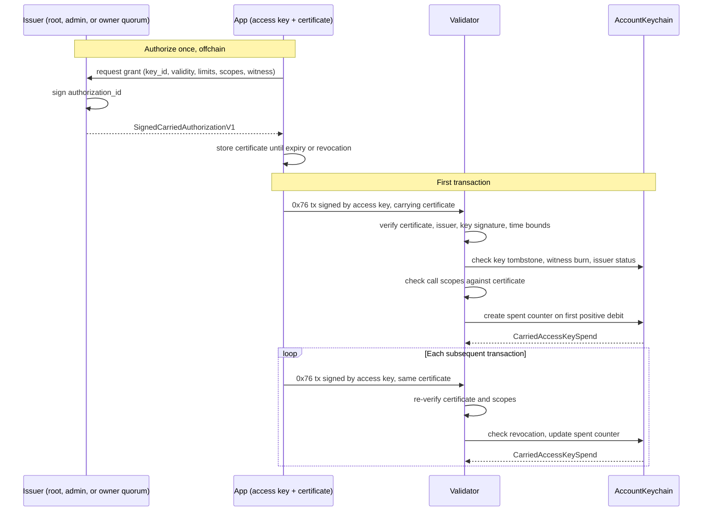

# TIP-1086: Transaction-Carried Access Key Authorizations

> **V2 draft.** This document specifies V1, which keeps per-grant counters in AccountKeychain. The [V2 implementation](../docs/benchmarks/tip-1086-tree-implementation.md) instead commits authority and active policies to one account root, and takes precedence for the V2 wire format, signing, lifecycle, and gas. V2 benchmarks are [reported separately](../docs/benchmarks/tip-1086-tree-results.md).

## Abstract

An account signs an access-key authorization once and attaches it to every transaction that uses the key. Validators verify it and enforce its permissions directly from the transaction, without registering the key or storing its policy. Revocation markers and spending counters stay onchain, and existing stored access keys keep their current behavior.

## Motivation

Today's inline authorization writes a key record, spending-limit configuration, and call-scope entries on first use. That makes first use expensive for applications that create many short-lived keys or need several token, contract, selector, or recipient restrictions. Reusing a stored key amortizes those writes, unless each key is used only a few times.

The transaction already carries the issuer-signed permissions. Resubmitting that certificate trades immutable state growth for transaction bytes and repeated signature verification. Applications keep the certificate, as they already must between signing and first submission. Revocation and shared budgets still need state, so this TIP removes policy storage, not all state.

### Gas Comparison

These deterministic receipts come from the [cost report](../docs/benchmarks/tip-1086.md), executed through `TempoHandler` at this draft's proposed pricing. "Stored" is today's inline authorization and "carried" is this TIP. First use is authorization plus one TIP-20 transfer; reuse repeats the transfer. Unless noted, keys are secp256k1 and the sender pays.

**By policy**

| Policy | Stored first | Carried first | First-use savings | Stored reuse | Carried reuse | Stored cheaper from use |
| --- | ---: | ---: | ---: | ---: | ---: | ---: |
| Unlimited | 300,218 | 44,842 | 85.1% | 36,518 | 44,842 | 32 |
| 1 lifetime cap | 802,905 | 311,369 | 61.2% | 39,205 | 64,169 | 21 |
| 1 periodic cap | 803,005 | 314,065 | 60.9% | 39,305 | 66,865 | Window-dependent |
| 2 caps + 2 targets | 2,817,105 | 312,397 | 88.9% | 43,405 | 65,197 | 116 |
| 2 caps + 2 targets, sponsored | 2,821,905 | 308,643 | 89.1% | 55,005 | 59,343 | 581 |

**By key structure** (1 lifetime cap)

| Structure | Certificate bytes | Stored first | Carried first | First-use savings | Stored reuse | Carried reuse |
| --- | ---: | ---: | ---: | ---: | ---: | ---: |
| secp256k1 issuer and key (baseline) | 236 | 802,905 | 311,369 | 61.2% | 39,205 | 64,169 |
| P256 access key | 236 | 807,905 | 316,369 | 60.8% | 44,205 | 69,169 |
| WebAuthn access key | 236 | 809,921 | 318,373 | 60.7% | 46,221 | 71,173 |
| P256 issuer | 302 | 807,905 | 317,561 | 60.7% | 39,205 | 70,361 |
| WebAuthn issuer | 455 | 809,921 | 320,019 | 60.5% | 39,205 | 72,819 |
| Configurable parent and delegate, 1 owner each | 326 | 808,321 | 317,537 | 60.7% | 43,213 | 70,337 |
| Maximum-size WebAuthn | 2,222 | 873,481 | 388,321 | 55.5% | — | — |
| Two 8-owner quorums | 960 | 855,565 | 373,829 | 56.3% | — | — |
| 32-call batch | 236 | 1,082,060 | 614,890 | 43.2% | — | — |
| 120 recipients | 2,798 | Exceeds 16,777,216 gas cap | 336,293 | — | — | — |
| New account | 236 | 1,052,905 | 561,369 | 46.7% | — | — |
| New configurable accounts | 326 | 1,098,513 | 607,729 | 44.7% | — | — |

Carried mode wins on first use but loses on reuse, since every use re-pays certificate bytes and issuer verification; stored mode becomes cumulatively cheaper after 21 to 581 uses. Capped carried first use is dominated by one T7 counter creation, which [V2](../docs/benchmarks/tip-1086-tree-results.md) removes, measuring 78,900 gas for a comparable lifetime cap.

### Alternatives

Storing a compact policy hash still needs a registration write and a way to supply the preimage, and shared templates need lifecycle state. Keeping limits offchain removes counters but makes cumulative budgets depend on a signer service; per-transaction caps cannot express lifetime or periodic budgets. Both remain future options.

Stored mode stays better for long-lived, frequently used keys. Per-certificate counters give separate grants separate budgets; pooling them needs a signed budget identity. Signed period anchors avoid a first-use write but differ from stored keys' registration anchors. Counter garbage collection, account-wide revocation epochs, and nested delegation are out of scope.

## Assumptions

- Activation requires a future hardfork. T12 is the implementation gate, not a schedule. Historical blocks and stored-mode authorizations keep their fork-specific rules.
- The issuer is the account's primitive root, its direct current owner quorum, or an active stored primitive admin key. Parents and configurable delegates have empty code. Nested delegation and delegated code are unsupported.
- The issuer can already grant unrestricted access and is trusted to choose permissions. A certificate is a reusable authorization, not a transaction signature.
- The transaction nonce remains the replay guard. Certificates add no nonce domain.
- State-dependent checks run against actual execution state, including earlier transactions in the block. Cached pool results are insufficient for inclusion.
- Stored-mode behavior is specified by [TIP-0001](./tip-0001.md), [TIP-1011](./tip-1011.md), [TIP-1049](./tip-1049.md), and [TIP-1053](./tip-1053.md), and implemented in [authorization pricing and fee collection](https://github.com/tempoxyz/tempo/blob/7331a612fae3f9255a55886060bb862da41faa55/crates/revm/src/handler.rs), [wire encoding](https://github.com/tempoxyz/tempo/blob/7331a612fae3f9255a55886060bb862da41faa55/crates/primitives/src/transaction/key_authorization.rs), and [keychain state](https://github.com/tempoxyz/tempo/blob/7331a612fae3f9255a55886060bb862da41faa55/crates/precompiles/src/account_keychain/mod.rs).

## Threat Model

Root and active stored admin keys are trusted; a compromised authority can grant more permissions. Key holders, relayers, and sponsors may submit, reuse, omit, or recombine certificates, but a certificate without the access-key signature MUST NOT allow spending. Validators enforce authenticity, authority, revocation, expiry, and limits; builders can only delay or reorder.

Revocation takes effect at its execution position, so applications must handle inclusion races and reorgs. A lost or withheld certificate is an availability problem. Certificates are public once submitted, so the witness MUST be an opaque commitment, never secret or personal data. As in TIP-1011, scopes constrain only top-level calls.

---

# Specification

The words MUST, MUST NOT, SHOULD, and MAY are normative.

## Overview

An issuer signs a carried certificate once, offchain. The application stores it and attaches it as the transaction's `key_authorization` on every use, next to the access key's transaction signature. Validators re-verify the certificate each time, check revocation and scopes, and update spending counters. No key record or policy is ever written.



## Wire Format

The `key_authorization` field of type `0x76` transactions becomes a union of `Stored(SignedKeyAuthorization)`, unchanged, and `Carried(SignedCarriedAuthorizationV1)`. Omitting it still requires a registered key. A transaction carries at most one authorization, and modes cannot be combined. Carried mode uses this exact RLP encoding:

```text
SignedCarriedAuthorizationV1 = RLP([
    "tempo-carried-key-v1",         // literal 20-byte ASCII string
    fields,
    issuer_signature               // direct Primitive or Multisig TempoSignature encoding
])

fields = [
    chain_id: u64,
    account: address,
    key_type: u8,                   // 0 = secp256k1, 1 = P256, 2 = WebAuthn, 3 = Multisig
    key_id: address,
    valid_after: u64,
    expiry: u64,
    witness: bytes32,
    limits: None | [TokenLimit, ...],
    allowed_calls: None | [CallScope, ...],
    authority_config: bytes32       // parent configuration commitment, zero if unconfigured
]

TokenLimit = [token: address, amount: uint256, period: u64]
CallScope = [target: address, selector_rules: [SelectorRule, ...]]
SelectorRule = [selector: bytes4, recipients: [address, ...]]
```

All fields, including zeros, are present. `None` is `0x80`; `0xc0` is an explicit empty allowlist. Addresses, selectors, and witnesses are exactly 20, 4, and 32 bytes, with minimal integers. Unknown versions, wrong widths, extra or trailing data, and non-canonical encodings MUST be rejected without stored-mode fallback. Wrappers are at most 4,096 bytes.

## Signing

```text
authorization_id = keccak256(RLP(["tempo-carried-key-v1", fields]))
```

Primitive issuers sign `authorization_id` under existing rules, including P256 prehash and WebAuthn challenge handling. Configurable issuers sign `multisig_digest(authorization_id, account, config_version)` under TIP-1114. The ID excludes signature bytes, so re-signing identical fields, even by another issuer, MUST NOT create a new budget. The tag domain-separates carried signatures from stored ones.

The transaction signing hash, sponsor signing hash, and transaction hash MUST cover the complete wrapper wherever TIP-0001 includes `key_authorization`. Neither the certificate nor its issuer signature can be swapped without invalidating the transaction, and there is no unsigned sidecar. Changing modes requires a new issuer signature.

## Certificate Validity

A carried certificate is valid only if all of the following hold:

1. `chain_id` is nonzero and equals the current chain ID. `account` is nonzero and equals both the sender and the keychain signature's `user_address`.
2. `key_id` is nonzero, differs from `account`, and matches the keychain signature's recovered primitive key or named configurable delegate, with matching `key_type`. Root-signed transactions carrying this mode are invalid.
3. `valid_after < expiry` and `valid_after <= block.timestamp < expiry`, in Unix seconds. Expiry is mandatory.
4. The issuer signature verifies as the account's primitive root, its direct current owner quorum, or an active stored primitive admin key whose stored type matches the signature type. Carried keys are never issuers or admins.
5. The parent has empty code, and the transaction has no EIP-7702 or Tempo delegation authorizations.
6. `keys[account][key_id]` is unused: never registered, including expired, and never revoked.
7. TIP-1053's `(account, witness)` burn marker is false. The witness is mandatory, may be zero, and is checked on every use.
8. The policy satisfies the rules in [Immutable Policy](#immutable-policy).
9. `authority_config` equals the parent's current account-leaf commitment, except for the version-zero bootstrap in [Configurable Accounts](#configurable-accounts).
10. The transaction satisfies existing access-key restrictions, including the ban on top-level contract creation.

Admin issuer validity is checked on every use, so revoking an admin immediately invalidates its outstanding certificates, unlike stored grants. An admin may issue a certificate without signing the transaction. Invalid certificates reject the transaction before nonce consumption, fee collection, or counter writes, and make a proposed block containing it invalid.

## Configurable Accounts

The certificate issuer and the transaction's delegate each use TIP-1114's bounded native verifier; keychain signatures are not accepted as an issuer or inside a delegate quorum. Each quorum has at most eight primitive approvals, within the existing sixteen-approval combined bound. Eight maximum-size WebAuthn issuer approvals exceed 4,096 bytes and are invalid.

An unregistered configurable parent's direct version-zero quorum may bootstrap with `authority_config == config.commitment()`, after derivation is verified with the configured recovery factory. On inclusion, register the account-leaf commitment per TIP-1108, even if user calls fail, and report its 20,000-gas write separately. Primitive root or admin certificates cannot bootstrap a commitment.

## Rotation

Parent rotation invalidates every certificate bound to the old commitment, including admin-issued ones. Re-signing under new owners creates a new grant with a fresh budget; old allowance MUST NOT carry over. Delegate rotation keeps the delegate's address and grant identity: its current owners sign each transaction under TIP-1111, and counters persist.

A parent cannot be its own delegate. Unregistered configurable delegates register their own commitment under existing rules. The account leaf holds one ownership commitment, not per-token counters, so counters and witness burns stay in AccountKeychain. TIP-1112's later root-key disablement must also restrict carried issuers and primitive delegates.

## Immutable Policy

Tokens, targets, selectors per target, and recipients per selector are each strictly ascending by bytes; duplicates are invalid. TIP-1011 structural rules apply, including periodic `amount <= 2^128 - 1`. Lifetime limits accept any `uint256`, including zero. Tokens MUST use the TIP-20 address class but need not be deployed.

| Field | `None` | Empty list | Nonempty list |
| --- | --- | --- | --- |
| `limits` | Unlimited protocol-accounted spending | No spending | Only listed tokens, subject to caps |
| `allowed_calls` | Unrestricted address-targeted calls | No calls | Listed targets and selector rules |
| `selector_rules` | Not permitted | Any selector on this target | Listed selectors |
| `recipients` | Not permitted | Any recipient | Listed first-argument recipients |

Each top-level call is checked with TIP-1011 scope semantics, including canonical recipient decoding, in a metered phase before any user call. A mismatch fails the whole batch as an execution failure that still consumes the nonce and actual fees. Nested calls, approvals, DEX debits, and other spending hooks keep existing semantics.

## Execution Context

The validated certificate is installed in transaction-local context as `Carried(account, key_id, authorization_id, policy)`. Every keychain spending hook, including via internal calls, MUST dispatch on it and MUST NOT fall back to or combine with stored keys. The context follows journal rollback, authorizes only its account, and is then discarded. `getTransactionKey()` returns `key_id`.

## Spending Counters

Counters are keyed by `(account, authorization_id, token)`. Each certificate is a separate grant: signing another for the same key adds a budget rather than replacing one, so wallets MUST disclose this and revoke superseded certificates. Canonical ordering prevents reordering from minting new IDs. AccountKeychain gains two persistent words, defaulting to zero:

```text
spent[account][authorization_id][token]: uint256
window[account][authorization_id][token]: uint64  // periodic limits only

spent_slot = keccak256(abi.encode(
    keccak256("tempo.carried-key.spent.v1"), account, authorization_id, token))
window_slot = keccak256(abi.encode(
    keccak256("tempo.carried-key.window.v1"), account, authorization_id, token))
```

`abi.encode` uses four 32-byte words with left-padded addresses, and `window` occupies the low 64 bits of its word. No key record, certificate registration, policy, scope, expiry, or cap is written. Unlimited policies write no counters, limited tokens allocate state only on a positive debit, and lifetime limits never touch `window_slot`.

## Period Accounting

1. For a debit `d` at timestamp `t`, if `limits` is `None`, skip accounting. If the token is absent from an explicit list, any positive debit fails with `SpendingLimitExceeded()`.
2. For `period == 0`, `used = spent`.
3. For `period > 0`, `w = floor((t - valid_after) / period)`. `used = spent` if the stored `window == w`, otherwise zero.
4. Require `used <= amount` and `d <= amount - used`, with checked arithmetic.
5. On a positive successful debit, write `spent = used + d` and, for periodic limits, `window = w` if it changed. Never write a zero just to roll over.

Windows are half-open intervals starting at `valid_after + w * period`, anchored to the signed `valid_after` rather than first use, with no carry-over. Endpoint arithmetic uses at least 128 bits, and `w` fits `uint64`. Lifetime exhaustion is `spent == amount`, including at `uint256::MAX`. Amounts are raw token units.

For example, with `valid_after = 100`, `period = 60`, and cap `100`, windows are `[100, 160)`, `[160, 220)`, and so on. Spending `30` at `125` leaves `70` until `160`, where the allowance resets to `100`. A first-ever debit at `225` lands in window `2`, not a window anchored at `225`.

## Fees

Certificates are validated before fee collection. For self-paid transactions, the maximum fee reservation MUST fit both the balance and the remaining fee-token budget, reserved against the same counter as user spending. Settlement releases only the unused reservation, in the same period. Actual fees stay charged even if execution fails.

A refund never raises the remaining budget above its pre-reservation value plus reverted user debits. The final counter equals prior spending plus committed user debits plus actual self-paid fees. Distinct sponsors' gas does not consume the budget, though user debits do. A fee payer equal to the sender is self-paid.

## Failure and Rollback

Insufficient balance or fee budget makes the transaction invalid before any state change. Scope failure, revert, or out-of-gas consumes the nonce and actual fees while reverting user-call effects and their spend events. No stored-key registration ever survives a carried transaction, and reorgs roll counters back with the rest of state.

Execution serializes conflicting counter access, including across nonce keys, multiple debits in one batch, and fee and user debits of the same token. This TIP adds no counter cleanup, because resetting or deleting a live lifetime counter would replenish authority. Counters persist after expiry and revocation.

## Revocation

TIP-1053's `burnKeyAuthorizationWitness(witness)` revokes certificates, with its existing admin-only guard and event. A burn invalidates every carried certificate for the account with that witness, including unused ones, and successful use never burns it. Applications SHOULD use a distinct witness per grant unless group revocation is intended. AccountKeychain also gains:

```solidity
/// @notice Permanently disables carried use of a key, including before first use.
/// @dev Uses the existing root/stored-admin caller guard. Carried keys are not admins.
/// @dev Writes the existing revoked-key tombstone, preventing future stored registration.
/// @dev Reverts UnauthorizedCaller for unauthorized callers, InvalidKeyId for zero or
///      the caller account itself, and KeyAlreadyExists for any registered key.
/// @dev An already-revoked key is a no-op; no duplicate event is emitted.
/// @param keyId Access-key address to disable permanently for the caller's account.
function revokeCarriedKey(address keyId) external;

/// @notice Returns raw accounting for one carried certificate and token.
/// @dev Does not authenticate a certificate or calculate expiry, rollover, or remaining cap.
/// @dev Missing counters return (0, 0); non-periodic counters return windowIndex == 0.
/// @param account Account that owns the grant.
/// @param authorizationId Canonical certificate digest, excluding the issuer signature.
/// @param token TIP-20 token address.
/// @return spent Recorded debit total in the recorded window, or lifetime non-periodic total.
/// @return windowIndex Recorded periodic window index.
function getCarriedSpending(address account, bytes32 authorizationId, address token)
    external view returns (uint256 spent, uint64 windowIndex);
```

`revokeCarriedKey` writes the same tombstone as `revokeKey`, with `is_revoked = true` and all other fields zero, and emits `KeyRevoked(account, keyId)` on a new tombstone. Registered keys, including expired ones, still use `revokeKey`. Tombstones cannot be cleared, and both methods respect existing caller, static-call, and gas guards.

## Stored-Key Interaction

Legacy getters and mutations remain storage-only. `getKey`, `getAllowedCalls`, and `getRemainingLimit` cannot see carried policy, and `setAllowedCalls` and `updateSpendingLimit` cannot change it. `getCarriedSpending` returns raw counters only: computing remaining allowance requires the certificate, and the getter MUST NOT be presented as a validity check.

Registering a carried `key_id` in stored mode is permitted but permanently invalidates its carried certificates, even after stored expiry or revocation. Wallets SHOULD use a fresh key when changing modes, since nothing migrates. Carried certificates are not stored-key signatures for TIP-1020, TIP-1049, ERC-1271, permits, or other offchain verification paths.

## Intrinsic Gas

Carried mode MUST NOT use stored-authorization pricing or pay synthetic storage charges for a key, policy, or unused limit. On top of the ordinary transaction base and the access key's primitive-signature surcharge, it pays for the full wrapper, issuer verification, and policy processing:

```text
B = byte length of SignedCarriedAuthorizationV1
Z = number of zero bytes in that encoding
N = B - Z
E = token entries + target entries + selector entries + recipient entries

carried_intrinsic = 4 * Z + 16 * N
                  + 80 * ceil(B / 32)
                  + 20 * E
                  + issuer_verification
                  + 2,000

issuer_verification:
    secp256k1: 3,000
    P256:     8,000
    WebAuthn: 8,000 + 6 * ceil(webauthn_data_length / 32)
    Multisig: sum(primitive verification costs above for each approval)
              + keccak_cost(configuration_commitment_preimage)
              + keccak_cost(multisig_role_domain_preimage)
```

The byte term prices the whole certificate, including the issuer signature, once; the legacy WebAuthn byte surcharge MUST NOT also apply. The word term covers decoding and hashing, `20 * E` ordering checks, and 2,000 context setup. Actual state reads replace stored-mode keychain-validation overhead. Constants remain proposals until benchmarked.

## Execution Gas

Before scope checks, deduct `20 * C * (1 + T + S + R)` gas, where `C` counts top-level calls and `T`, `S`, and `R` count certificate targets, selectors, and recipients. This bounds a linear scan and replaces stored-scope lookup charging. Context setup writes five transient words plus two per token.

Key-record, issuer, witness, and counter access and logs use the ordinary schedule, charged once during execution regardless of cache state. First counter writes pay state creation, including T7's 245,000-gas creditable component. Self-paid limited transactions prepay 10,000 gas for settlement. Fee bookkeeping neither consumes nor mints storage credits.

## Payment Classification

[TIP-1045](./tip-1045.md)'s 1,024-byte key-authorization bound applies to the complete carried wrapper. Valid certificates of 1,025 to 4,096 bytes use the general lane, and larger ones are invalid. A certificate never makes a non-payment call payment-eligible, key-management calls remain general transactions, and fee curves and block gas budgets are unchanged.

## Transaction Pool

Nodes MUST check the byte bound and intrinsic gas before expensive processing; rate limits remain necessary because invalid signatures pay nothing. Pool validation checks structure, both signatures, account and chain binding, authority, revocation, and fee affordability. Expiry is the earlier of transaction and certificate expiry; future `valid_after` follows the not-yet-valid policy.

Execution MUST repeat state-dependent checks against the parent and earlier block transactions. Builders revalidate after key registration, issuer revocation, witness burns, balance changes, or spending, because separately admitted transactions are not jointly affordable. Reorgs drop state-derived cache entries; cryptographic results may be cached only under complete signed bytes.

## Activation and Compatibility

Carried wire handling, counter access, and the new ABI selectors are hardfork-gated, and the carried variant is invalid before activation. Stored-mode encodings, signing hashes, and pricing are unchanged, apart from T12 metering its transient carried-mode check during debit and refund dispatch. No state migration or change to existing permissions is required.

# Tooling

## SDK and RPC

SDKs MUST add an explicit carried builder, canonical sorting, digest calculation, signature verification, and tagged serialization; stored mode stays default. RPC `keyAuthorization` objects add `carried: { validAfter, authorityConfig }` only in carried mode, where account, expiry, and witness are mandatory and `isAdmin` is false. Null means stored. Unknown `carried` fields are rejected.

Quantities use hex and absent policies use `null`. Responses include the issuer signature and every field needed to round-trip the wrapper; `authorizationId` is derived. Credential stores MUST preserve carried fields and signatures. Gas fillers MUST keep the certificate on every use, even if a same-ID stored key appears.

## Wallets

Wallets retain the certificate until expiry or revocation and attach it to every use. Before signing, they MUST show account, chain, key, issuer, validity, scopes, limits, witness, and separate-grant consequences. Backups include the certificate. Lost certificates are recoverable from earlier transactions; otherwise, issue a new grant and revoke the old.

## Simulation and Explorers

`eth_call`, `eth_estimateGas`, tracing, and SDK simulation MUST support carried mode, including first counter creation, period rollover, sponsorship, and scope failures, using the certificate and current counters rather than a simulated registration. Simulation-only signature overrides MUST preserve carried fields and cannot bypass consensus validity.

Explorers distinguish stored and carried keys and decode certificate permissions from transaction data. SDKs compute remaining budget from the signed cap and period anchor, block timestamp, and `getCarriedSpending`, and separately check issuer authority, key tombstones, and witness burns.

# Observability

## Events

Carried use MUST NOT emit `KeyAuthorized`, `AdminKeyAuthorized`, or registration witness events, since nothing is registered. Witness burns and tombstones emit existing events. Each committed positive debit from a limited token emits this event instead of `AccessKeySpend`, so indexers do not mistake it for a stored `(account, keyId)` budget:

```solidity
event CarriedAccessKeySpend(
    address indexed account,
    bytes32 indexed authorizationId,
    address indexed token,
    address keyId,
    uint256 amount,
    uint256 remaining,
    uint64 windowIndex
);
```

`windowIndex` is zero for lifetime limits, and user-debit events roll back normally. Fee reservation emits nothing. Settlement emits one event for the actual positive self-paid fee, even on failed execution, with `remaining` reflecting final settlement after any user rollback. Events follow execution order and expose no certificate secrets.

## Traces and Metrics

Traces SHOULD expose mode, authorization ID, issuer, certificate size, intrinsic surcharge, counter-creation gas, and a structured failure reason. Nodes SHOULD count carried and stored use, invalid, expired, and revoked certificates, certificate sizes, verification time, and counter creation. Addresses, witnesses, and authorization IDs MUST NOT become unbounded metric labels.

# Invariants

1. A valid carried transaction proves current issuer authority and possession of the authorized key, with account, chain, mode, policy, and time bounds cryptographically bound.
2. Reusing or re-signing identical certificate fields never replenishes a budget, across sequential, parallel, or expiring-nonce transactions.
3. In each signed period, committed debits plus actual self-paid fees never exceed the cap; lifetime caps hold for the certificate's lifetime.
4. A witness burn or key tombstone rejects later use in execution order, including first use. Successful use never writes a registration or consumes the witness.
5. Stored and carried permissions cannot be combined, and a carried key is never an admin.
6. A scope failure executes no user call. User rollback never refunds actual fees or restores a consumed nonce, and fee refunds never mint spending authority.
7. Gas depends on transaction and chain state, not validator caches. State-creation charges match actual writes.

## Test Coverage

Before approval, publish positive and negative encoding and signature vectors for all three primitive key types, stored admin issuers, and configurable parent and delegate roles. Vectors cover RPC round-trips, domain separation, signature-independent IDs, optional-policy distinctions, canonical ordering, width and integer boundaries, and exact byte limits. Reference and node suites MUST also cover:

- First and repeat use with zero policy writes, unused token limits left unallocated, and unlimited sponsored use creating no state.
- Pre-use and group witness burns, key tombstones, expired stored occupancy, issuer revocation, and stored registration between pool admission and execution.
- Account, chain, and type mismatches, expired and future certificates, unsupported accounts, top-level creation, delegation lists, and carried keys used as admins.
- Repeated spending, exact exhaustion, zero and maximum caps, mixed tokens, multiple nonce lanes, competing transactions, late first periodic debits, period boundaries, long idle gaps, and timestamps near `u64::MAX`.
- Per-call scope and recipient checks, nested debit hooks, failed batches, out-of-gas, self-paid and sponsored fees, same-token fee and user spending, reservation and refund, and reorg rollback.
- The 1,024/1,025-byte lane boundary and 4,096/4,097-byte validity boundary on the complete wrapper, with stored-mode historical vectors byte-for-byte identical.

## Approval Criteria

Before scheduling, benchmark stored registration and reuse against carried first spend, reuse, and rollover with identical policies, across secp256k1, P256, maximum-size WebAuthn, maximal policies, many calls, payer modes, and cold and warm state. Report execution time, bytes, state words, gas, and stored-mode crossover; revise undercovering constants.

Acceptance requires lower immutable authorization state growth with the invariants intact, [TIP-0000](./tip-0000.md) engineering, security, and tooling review, a chosen fork, and published SDK fixtures. The draft implementation is [PR #7506](https://github.com/tempoxyz/tempo/pull/7506), stacked on [PR #7581](https://github.com/tempoxyz/tempo/pull/7581); it is not security review, calibration, or scheduling.
