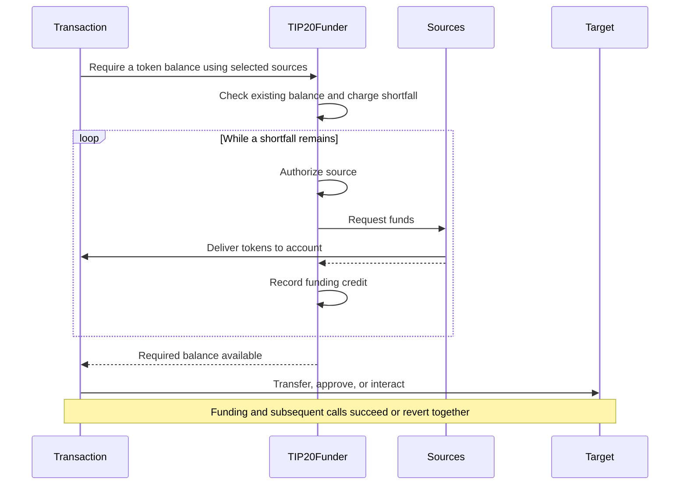

# TIP-1120: TIP-20 Fund Requirements

## Abstract

Introduces a new precompile that lets a consumer specify tokens and amounts they require and automatically satisfy that requirement using approved funding sources. Funding is sourced in order from user assets and subsequent actions execute atomically, with access key spending limits enforced on the requested token.

## Motivation

An account may hold `tokenA`, `tokenB`, and/or `earnShareX` but need `tokenC`. Consumers should be able to execute transactions using any supported asset in their account, without manually converting assets and/or giving access keys unrestricted authority to liquidate those assets.

## Assumptions

- This iteration supports approved assets treated as 1:1. Non-parity conversions MUST be rejected. Earn shares use the approved vault's redemption rules; their underlying must be a supported asset.
- Each hook delivers funds within the same Tempo transaction or reverts.
- The owner authorizes source implementations, input assets, and conversion rules. Offchain preferences supply no spending authority.
- Access keys can use funding only when the owner enables `requireFunds` in the key authorization.

## Threat Model

| Actor | Authority and trust |
| --- | --- |
| Owner | Authorizes keys and funding rules, including trust in source code and upgrades. |
| Access key and offchain orchestration     | May choose adverse routes. Cannot expand owner rules, input caps, or output budgets. |
| Funding source | Must stay within the account's access key permission and input limits. Must implement the authorized redemption or conversion rules. |
| Protocol | Authenticates context, constrains debits, verifies delivery, and rolls back failed execution. |

---

# Specification

The consumer specifies a token, a required balance, and an ordered list of funding sources (e.g. token or vault share). The precompile counts existing funds and obtains any shortfall from those sources within the account's authorization and cost limits. Once funded, the transaction continues with its remaining calls. Funding and subsequent actions execute atomically.

Assume the flow in the diagram executes within a single atomic transaction.



## Tempo Transaction

Tempo transactions MAY include a signed `requireFunds` array to obtain any missing tokens from the specified funding sources before executing `calls`. Entries are processed in order.

Funding and calls share atomic rollback and credit accounting. An omitted or empty array skips automatic funding.

### Interface

```typescript
/** Funding requirements processed in order before transaction calls. */
type RequireFunds = {
  /** Requested TIP-20 token address. */
  asset: `0x${string}`
  /** Target balance in token base units, including existing funds. */
  amount: bigint
  /**
   * Total slippage tolerance across this entry's sources, from 0 to 10,000 basis points.
   * Must match the authorized access-key value when configured; omission uses that value.
   */
  slippageBps?: number
  /** Sources attempted synchronously in order until the target balance is satisfied. */
  sources: {
    /** Approved contract or precompile implementing fund. */
    target: `0x${string}`
    /**
     * Maximum gross input for this source invocation, in token or share base units.
     * Omission means no cap.
     */
    maxInput?: bigint
  }[]
}[]
```

### Example

Require 50 USDC using up to 30 USDC.e first, then OUSD for the remaining shortfall.

```typescript
{
  requireFunds: [
    {
      asset: USDC,
      amount: 50,
      slippageBps: 100,
      sources: [
        { target: USDC.e, maxInput: 30 },
        { target: OUSD },
      ],
    },
  ],
  calls: [
    { to: USDC, data: 'transfer(recipient, 50)' },
  ],
}
```

## Access Keys

The owner enables delegated funding by setting `requireFunds` on the access key. When enabled, `requireFunds` needs no explicit `allowedCalls` entry. Key validity, spending limits, source approval, and slippage checks still apply. Subsequent calls retain their normal permissions.

### Interface

The optional `keyAuthorization.requireFunds` property uses this type:

```typescript
/** Permission to fund token requirements using an access key. */
type RequireFundsPermission = {
  /**
   * Authorized total slippage per funding operation, from 0 to 10,000 basis points.
   * Any transaction-supplied value must match when this value is configured.
   */
  slippageBps?: number
}
```

### Example

```javascript
{
  keyAuthorization: {
    limits: [{ token: USDC, limit: 50, period: 30days  }],
    requireFunds: { slippageBps: 100 },
    allowedCalls: [
      {
        target: USDC,
        selectorRules: [{ selector: TIP20.transfer.selector }],
      },
    ],
    // ...
  },
}
```

## Precompile

`TIP20Funder` coordinates funding. `ITIP20FunderSource` is an optional interface implemented by a precompile or contract alongside its existing functionality.

```solidity
interface TIP20Funder {
    struct Source {
        address target;    // Precompile or contract implementing fund.
        uint256 maxInput;  // Caller input cap; uint256 maximum means no additional cap.
    }

    error InvalidFundingContext();
    error InvalidAsset(address asset);
    error InvalidSource(address source);
    error FundingNotAuthorized(address source);
    error InputLimitExceeded(address source, uint256 limit, uint256 attempted);
    error UnexpectedFundingAmount(address source, uint256 maximum, uint256 received);
    error InsufficientFunding(uint256 required, uint256 available);
    error FundingReentrancy();

    /// @notice Emitted after a source contribution passes authorization and delivery checks.
    /// @param account Account receiving the requested tokens.
    /// @param asset Requested TIP-20 token.
    /// @param source Source that supplied this contribution.
    /// @param inputAsset Authorized input token or share token.
    /// @param inputAmount Gross authorized input debits in input asset base units, without subtracting refunds.
    /// @param outputAmount Verified contribution in requested token base units.
    event SourceFunded(
        address indexed account, address indexed asset, address indexed source,
        address inputAsset, uint256 inputAmount, uint256 outputAmount
    );
    /// @notice Emitted when requireFunds succeeds, including when existing funds satisfy the request.
    /// @param account Account whose requested balance is available.
    /// @param key Authenticated key identifier, following native keychain conventions.
    /// @param asset Requested TIP-20 token.
    /// @param requiredAmount Target balance in requested token base units.
    /// @param fundedAmount Newly supplied tokens in asset base units, excluding existing funds.
    event FundsRequired(
        address indexed account, address indexed key, address indexed asset,
        uint256 requiredAmount, uint256 fundedAmount
    );

    /// @notice Make the authenticated account's asset balance at least amount.
    /// @param asset Requested TIP-20 token.
    /// @param amount Target balance, including existing funds.
    /// @param sources Ordered funding sources.
    /// @return fundedAmount Newly delivered asset units, excluding existing balance.
    /// @dev Direct account calls or native transaction funding only. Reverts on invalid context, inputs, authority,
    /// insufficient budget, source failure, or insufficient output.
    function requireFunds(
        address asset,
        uint256 amount,
        Source[] calldata sources
    ) external returns (uint256 fundedAmount);
}

interface ITIP20FunderSource {
    /// @notice Deliver up to amount of asset to the authenticated funding account.
    /// @param asset Requested TIP-20 token.
    /// @param amount Maximum contribution in asset base units.
    /// @param maxInput Effective input cap in token or share units.
    /// @dev Only TIP20Funder may call within the access key permission and input limits.
    /// Delivery must complete synchronously or revert.
    function fund(
        address asset,
        uint256 amount,
        uint256 maxInput
    ) external;
}
```

`Source.maxInput` optionally caps input consumed per source call. Omission encodes as `type(uint256).max`; zero permits no debit. `TIP20Funder` passes the smaller of this cap and the limit allowed by the remaining shared budget and access key permission to `fund`.

Each approved source MUST supply as much as possible up to `amount`, within its available inputs, synchronous liquidity, and effective input cap. `TIP20Funder` enforces the cap and measures delivery. Partial or zero contributions continue to the next source; zero contributions consume no inputs. Unexpected errors revert the operation.

## Sourcing Funds

The account’s existing balance counts toward the required amount. If there is a shortfall, funding sources are called in order until the balance is sufficient. The initial shortfall is charged once to the requested token budget before sourcing. All sources share one input-cost budget for the initial shortfall. The protocol combines each source's optional input cap with the remaining budget, enforcing the smaller limit. Funding succeeds atomically or reverts.

```solidity
function requireFunds(
    address asset,
    uint256 amount,
    Source[] calldata sources
) external returns (uint256 fundedAmount) {
    // 1. Validate inputs and resolve authenticated context.
    // ... check asset and direct-account or native transaction context; resolve account and keyId.
    // ... reject nested, delegated, and reentrant calls.
    // ... reject access-key calls unless the owner configured requireFunds.

    // 2. Check the existing balance.
    uint256 balance = ITIP20(asset).balanceOf(account);
    if (balance >= amount) {
        emit FundsRequired(account, keyId, asset, amount, 0);
        return 0;
    }

    uint256 initialShortfall = amount - balance;
    keychain.verifyAndUpdateSpending(account, keyId, asset, initialShortfall);
    // ... initialize the shared cost budget from initialShortfall and effectiveSlippageBps.

    for (uint256 i = 0; i < sources.length && balance < amount; ++i) {
        // 3. Authenticate the source and derive its input cap.
        Source calldata source = sources[i];
        uint256 shortfall = amount - balance;
        // ... authenticate the owner's funding rule and derive authorizedCap from the remaining budget.
        uint256 maxInput = source.maxInput < authorizedCap ? source.maxInput : authorizedCap;

        // 4. Request up to the remaining shortfall.
        ITIP20FunderSource(source.target).fund(asset, shortfall, maxInput);

        // 5. End source access and measure actual delivery.
        // ... retain gross inputAmount and normalized cost; release unused input capacity.
        uint256 newBalance = ITIP20(asset).balanceOf(account);
        if (newBalance < balance) revert InvalidFundingContext();
        uint256 received = newBalance - balance;
        if (received > shortfall) {
            revert UnexpectedFundingAmount(source.target, shortfall, received);
        }
        if (received == 0) {
            if (inputAmount != 0) revert InvalidFundingContext();
            continue;
        }

        // 6. Record only the verified contribution.
        keychain.addFundingCredit(account, keyId, asset, received);
        emit SourceFunded(account, asset, source.target, inputAsset, inputAmount, received);
        fundedAmount += received;
        balance = newBalance;
    }

    // 7. Check completion and return the funded amount.
    if (balance < amount) revert InsufficientFunding(amount, balance);
    // ... verify total normalized input cost does not exceed the shared budget.
    emit FundsRequired(account, keyId, asset, amount, fundedAmount);
    return fundedAmount;
}
```

1. Validate the asset, account, and key. Reject nested, delegated, or reentrant calls and access keys without `requireFunds`.
2. Emit `FundsRequired` and return zero if the balance suffices. Otherwise, charge the initial shortfall once and derive its shared cost budget.
3. Visit approved sources in order. Bound each optional `maxInput` by the remaining budget and access key permission.
4. Request up to the remaining shortfall. Partial or zero contributions continue; source errors revert.
5. Measure delivery and retain actual input costs. Reject excess output, balance reductions, or input consumption without output.
6. Record credit and `SourceFunded` only for positive contributions, then update totals.
7. Revert if funds are insufficient or costs exceed the budget. Otherwise, emit `FundsRequired` and return `fundedAmount`.

## Funding Sources

Existing tokens count toward the required balance. Sources contribute what they can synchronously in the supplied order until the shortfall is covered. The examples below cover token swaps and Earn redemptions within access key permissions and input limits.

### Same Token

Existing tokens count toward the required balance without calling `fund` or creating funding credit. If the balance is sufficient, `TIP20Funder.requireFunds` returns immediately:

```solidity
// Inside TIP20Funder.requireFunds.
if (ITIP20(asset).balanceOf(account) >= amount) {
    emit FundsRequired(account, keyId, asset, amount, 0);
    return 0;
}
```

### Different Token(s)

The hook supplies up to `amount` of the requested token, within the account's spendable input balance, DEX liquidity, and `maxInput`. It swaps for that contribution, or returns without debiting if none is available. The native DEX debits the authenticated account within its access key permission and input limits and delivers the requested token to that account.

The protocol converts the remaining shared budget into input token units and enforces the smaller of that cap and the source's optional `maxInput`.

The TIP-20 token precompile implements the following `fund`:

```solidity
function fund(
    address asset,
    uint256 amount,
    uint256 maxInput
) external {
    // ... authenticate TIP20Funder and load the account and access key permission.
    // ... enforce the effective maxInput against authenticated input limits.
    // ... check amounts fit the native DEX types without truncation.

    // ... quote the largest executable contribution <= amount within available inputs, liquidity, and maxInput.
    if (contribution == 0) return;
    dex.swapExactAmountOut(account, address(this), asset, contribution, maxInput);
}
```

### Earn Share(s)

The vault contributes up to `amount` from available shares and synchronously withdrawable underlying, swapping when the requested token differs. `maxInput` caps the original Earn shares consumed. The hook must reuse [`withdrawExact` logic](https://github.com/tempoxyz/earn/blob/0c0f141f76f1f3c1f56f414a413f21a9e677d93d/src/core/EarnVault.sol#L608) with the authenticated account as share owner; the existing public method pulls shares from its caller.

The protocol derives underlying withdrawal and share caps from the access key permission and remaining shared cost budget, accounting for redemption fees. A source's optional `maxInput` can further limit shares consumed, but cannot increase either cap.

The Earn vault contract implements the following `fund`:

```solidity
function fund(
    address asset,
    uint256 amount,
    uint256 maxInput
) external {
    // ... authenticate TIP20Funder and load account, underlying, and access key permission.
    // ... load underlyingCap; maxInput is the smaller of the caller and authorized share caps.
    // ... enforce both caps against the access key permission and remaining budget.

    // ... quote contribution <= amount within spendable shares, withdrawal liquidity, and both caps.
    // ... include DEX liquidity when swapping; return zero if nothing can be delivered.
    if (contribution == 0) return;
    uint256 assetsNeeded = contribution;
    if (asset != underlying) {
        // ... check amounts fit the native DEX types without truncation.
        assetsNeeded = dex.quoteSwapExactAmountOut(underlying, asset, contribution);
    }
    if (assetsNeeded > underlyingCap) revert();

    // ... reuse withdrawExact's engine withdrawal logic to deliver assetsNeeded to account.
    // ... collect and burn account shares within the access key permission and maxInput.

    if (asset != underlying) {
        // ... limit the composed swap to underlying released by this redemption.
        dex.swapExactAmountOut(account, underlying, asset, contribution, assetsNeeded);
    }

    // ... return any unused intermediate assets to account.
}
```


### Non-Parity Tokens

This TIP supports 1:1 parity only. A future extension could support non-parity conversions through owner-approved [propAMM pools](https://github.com/tempoxyz/propamm), using their pricing to derive input caps and measure total slippage.

## Access Key Accounting

Each `requireFunds` operation charges its initial shortfall before granting input authority. Sources are not charged separately; credit records only verified delivery. Insufficient final funding reverts the charge and all contributions.

Credit prevents subsequent transfers or approvals from charging again. Existing balances, key validity, and period resets follow normal accounting.

The pseudocode extends the existing [`AccountKeychain` flow](https://github.com/tempoxyz/tempo/blob/25b216a661c2cac72807174583371b582b75c286/crates/precompiles/src/account_keychain/mod.rs#L1353) with proposed internal helpers `addFundingCredit` and `takeFundingCredit`. Credit storage remains open; ellipses omit implementation details.

New `TIP20Funder.requireFunds`, showing budget and credit handling:

```solidity
function requireFunds(/* ... */) external {
    // ... validate context and calculate initialShortfall; return if already funded.
    keychain.verifyAndUpdateSpending(account, keyId, asset, initialShortfall);

    // ... visit sources and measure each contribution within the shared input budget.
    // ... for each positive contribution:
    keychain.addFundingCredit(account, keyId, asset, received);

    // ... revert unless the target balance is satisfied within the total cost cap.
}
```

Changes to existing transfer authorization in `AccountKeychain`:

```solidity
function authorizeTransfer(/* ... */) internal {
    // ... existing key lookup, root key and transaction origin guards.
    uint256 covered = takeFundingCredit(account, keyId, asset, amount);
    verifyAndUpdateSpending(account, keyId, asset, amount - covered);
}
```

Changes to existing approval authorization in `AccountKeychain`:

```solidity
function authorizeApprove(/* ... */) internal {
    // ... existing key lookup, root key and transaction origin guards.
    uint256 approvalIncrease = newApproval > oldApproval ? newApproval - oldApproval : 0;
    if (approvalIncrease > 0) {
        uint256 approvalCovered = takeFundingCredit(account, keyId, asset, approvalIncrease);
        verifyAndUpdateSpending(account, keyId, asset, approvalIncrease - approvalCovered);
        // Pass approvalCovered to the token's approval path for association with the spender.
    }
}
```

`takeFundingCredit` consumes up to the requested amount for the account, key, and token. Fees receive no credit. Spending checks still run when credit fully covers the amount.

Associate `approvalCovered` with the spender. Allowance spending consumes approval credit first, then funding credit; other debits consume funding credit directly. Normal allowance, key, call-permission, and token-policy checks remain.

Credit follows nested reverts and expires at transaction end. Incoming transfers, refunds, and approval decreases MUST NOT create credit or restore budget. Unspent funds from `requireFunds` remain charged.

## Slippage

Slippage can be configured on transaction requirements and access key permissions. Values MUST be between 0 and 10,000 basis points. For access key execution, if `keyAuthorization.requireFunds.slippageBps` is configured, a supplied `transaction.requireFunds[i].slippageBps` MUST equal it. Reject any mismatch, including a lower value. Omission uses the authorized value. Explicit access-key precompile calls use the key's authorized tolerance.

The effective tolerance applies across all sources in each funding operation. Using decimal-normalized amounts at assumed 1:1 parity:

```text
// After validating equality for access key execution:
effectiveSlippageBps = transaction.requireFunds[i].slippageBps ?? keyAuthorization.requireFunds.slippageBps
totalCostCap = initialShortfall × (1 + effectiveSlippageBps / 10_000)
```

Sources may offset gains and losses in either order. Each remains subject to access key permissions, its optional input cap, and the remaining shared budget. Existing balances add no allowance; budgets do not carry between calls.

Funding MUST complete within budget or revert.

# Tooling

SDKs need interface bindings and support for encoding and signing the transaction's `requireFunds` field. Relays select approved sources, store preferences offchain, and simulate the complete transaction. Payment identifiers and retry deduplication remain relay or application responsibilities. A new paying attempt must not overlap an earlier attempt that can still execute.

# Observability

`TIP20Funder` MUST emit `SourceFunded` once per positive verified contribution, after recording funding credit. The event identifies the source, assets, and amounts used to meet the requirement. Zero contributions emit no event. Input amounts count gross authorized input debits; returned inputs do not reduce them.

`TIP20Funder` MUST emit `FundsRequired` once at successful completion, after any `SourceFunded` events. Its funded amount is the sum of contributions from that call, or zero when the existing balance suffices. The event confirms funding, not completion of subsequent application calls.

Preserve native spending, token, vault, and DEX events. Credit covered consumption MUST NOT emit another budget deduction. If a later source or top level call reverts the transaction's user call execution, none of its funding events survive in the receipt.

# Invariants

1. **Balance satisfaction.** Successful funding MUST leave the requested balance at least `amount`. `fundedAmount` MUST equal the initial shortfall and the sum of measured source contributions. A sufficient starting balance MUST invoke no sources, charge no funding budget, and create no credit.

2. **Ordered contributions.** Sources MUST execute synchronously in the supplied order and stop once the requirement is satisfied. Partial and zero contributions MUST continue to the next source. Source errors MUST revert the operation.

3. **Verified delivery.** Source output MUST be measured from the account's balance increase, not trusted source reports. A source MUST NOT reduce that balance, deliver more than the remaining shortfall, or consume inputs while delivering zero output.

4. **Source authorization.** Only approved sources and assets MAY receive funding input authority. Implementing `fund` alone MUST NOT authorize account debits. Input access MUST remain bound to the authenticated account and funding call; nested, delegated, and reentrant `requireFunds` calls MUST revert.

5. **Bounded inputs.** Gross source debits MUST remain within both the protocol-derived input cap and any supplied `maxInput`. Omission MUST NOT remove protocol limits; zero MUST permit no debit. Refunds and repeated source entries MUST NOT replenish the shared cost budget.

6. **Total slippage.** Aggregate normalized input cost MUST NOT exceed `totalCostCap` for the initial shortfall and effective slippage tolerance. Sources MAY offset gains and losses within that budget. Existing balances MUST NOT create extra allowance, and separate funding operations MUST NOT share unused cost budget.

7. **Slippage authorization.** Slippage MUST be within 0 to 10,000 basis points. When access-key authorization configures a value, a supplied value MUST equal it, including zero; omission MUST use it. Neither a lower nor a higher supplied value may bypass this check.

8. **Key permissions.** Access key funding MUST require `requireFunds` authorization but no separate `allowedCalls` entry for the precompile. Funding MUST preserve key validity, spending limits, token policies, and permissions for subsequent calls. These checks MUST still run when credit fully covers a debit.

9. **Single budget charge.** The initial shortfall MUST be charged once before source input access. Individual contributions MUST NOT add another output-budget charge. Credit MUST cover only verified delivery and MUST NOT be consumed more than once. Unspent funded tokens MUST remain charged.

10. **Credit isolation.** Credit MUST remain scoped to the account, key, token, and transaction, follow nested reverts, and expire at transaction end. Incoming transfers, refunds, and approval decreases MUST NOT create credit or restore budget. Fees MUST NOT consume funding credit.

11. **Approval accounting.** Approval credit MUST be associated with its spender and consumed before remaining funding credit during allowance spending. Other debits MUST consume funding credit directly. Normal allowance checks MUST remain enforced.

12. **Transaction requirements.** The signature MUST cover the entire `requireFunds` array. Entries MUST execute in order before `calls`, with separate cost budgets. Every requested balance MUST remain satisfied when calls begin. Omitted or empty arrays MUST perform no automatic funding.

13. **Atomic rollback.** Insufficient funding, excessive cost, invalid delivery, or a source error MUST revert the funding operation. Failure of transaction-level funding or a subsequent transaction call MUST revert all associated funding, budget charges, credit, and events. Normal transaction fee handling remains unchanged.

14. **Event consistency.** Each positive contribution MUST emit one `SourceFunded` event matching measured input and output; zero contributions MUST emit none. Successful completion MUST emit one `FundsRequired` event with the total funded amount. Events MUST follow the same rollback as their state changes.

15. **Cost measurement.** Input costs MUST include conversion fees and use consistent token decimals. Earn share costs and caps MUST use approved redemption accounting, including fees and rounding losses. Intermediate assets MUST NOT be counted twice, and rounding MUST NOT enlarge authorized input limits.
