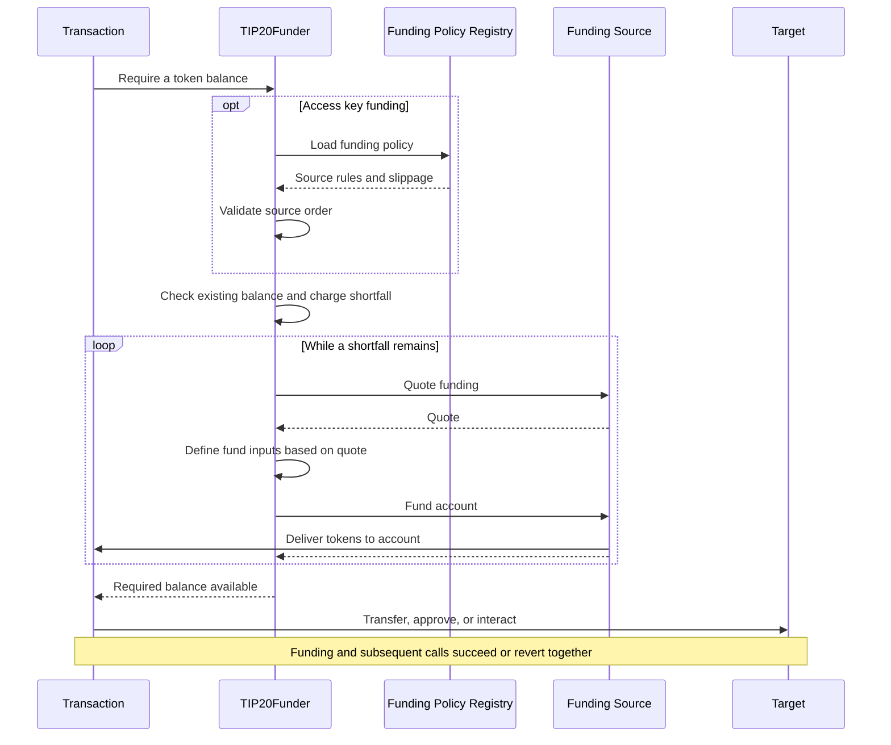

# TIP-1120: TIP-20 Fund Requirements

## Abstract

Introduces a precompile that satisfies requested TIP-20 balances through ordered funding sources before application calls. Admin-managed funding policies define approved sources, their rules, and aggregate slippage. Access keys reference a shared policy and charge spending limits against the requested output token. Funding and application calls execute atomically.

## Motivation

An account may hold `tokenA`, `tokenB`, and/or `earnShareX` but need `tokenC`. Consumers should be able to execute transactions using supported funding paths without manually converting assets or giving access keys unrestricted authority to liquidate them. Shared policies let admins update those paths without replacing every access key.

## Assumptions

- Funding completes synchronously within the same transaction. Asynchronous withdrawals are outside this interface.
- The owner selects a funding policy and trusts its admins to manage approved sources and rules. Funding sources validate assets, venues, caller arguments, and valuations under those rules. Deployment provenance or TIP-20 compliance alone does not establish parity or an approved conversion path.
- Access keys require an owner-authorized `fundingPolicy`. Policy changes apply to all referencing keys without resetting their spending budgets. Offchain preferences grant no authority.

## Threat Model

| Actor | Authority and trust |
| --- | --- |
| Owner | Authorizes keys and selects their funding policy, trusting its current and future admins. |
| Policy admin | Any listed admin may independently update rules or replace the admin list, including trust in source implementations and upgrades. |
| Access key and offchain orchestration | May select adverse inputs, routes, and timing within the approved policy. Cannot update that policy or expand key authority. |
| Funding Source | Trusted to validate opaque policy and call data and report faithful input bounds and reference valuation. Executes the approved funding path. |
| Protocol | Resolves policy and key authority, enforces reported input bounds and aggregate cost limits, measures delivery, and rolls back failures. It does not interpret source-specific payloads. |

---

# Specification

The consumer specifies a token, a required balance, and ordered funding source calls. `TIP20Funder` counts existing funds, obtains the shortfall within the account's permissions and cost limits, then continues with application calls. Each funding source implements the same interface; its policy rules and transaction arguments are ABI-encoded bytes.

Funding and application calls in the diagram execute atomically. Funding Policy Registry is the separate precompile that stores shared policies.



## Tempo Transaction

Tempo transactions MAY include a signed `requireFunds` array to obtain missing tokens before executing `calls`. Entries execute in order with separate cost budgets. Amounts are target balances, including existing funds; repeated assets are not additive. Every requested balance MUST still be satisfied before application calls begin.

The signature MUST cover the entire array, including funding source addresses, data, and optional slippage. Funding and calls share gas, rollback, and credit accounting. Omitted or empty arrays skip funding. Funding can only be requested through this transaction field; Solidity calls cannot initiate it. Existing validity bounds and normal fee handling apply. This field does not fund transaction fees.

### Interface

```typescript
/** Funding requirements processed in order before application calls. */
type RequireFunds = {
  /** Requested TIP-20 token. */
  token: `0x${string}`
  /** Target balance in token base units, including existing funds. */
  amount: bigint
  /** Must equal the funding policy tolerance; omission inherits it. Root default is zero. */
  slippageBps?: number
  /** Selected sources attempted synchronously in this order. */
  sources: {
    /** Contract or precompile implementing IFundingSource. */
    address: `0x${string}`
    /** ABI-encoded funding source arguments, including any caller input cap, route, quote, or proof. */
    data: `0x${string}`
  }[]
}[]
```

### Example

Require 50 USDC using up to 30 USDC.e first, then OUSD. `encode` below denotes the selected funding source's ABI encoder, not a protocol function. The shared policy must approve both inputs.

```typescript
{
  requireFunds: [{
    token: USDC,
    amount: 50_000_000n,
    sources: [
      { address: NATIVE_DEX_SOURCE, data: encode({ assetIn: USDC_E, maxAmountIn: 30_000_000n }) },
      { address: NATIVE_DEX_SOURCE, data: encode({ assetIn: OUSD }) },
    ],
  }],
  calls: [{ to: USDC, data: 'transfer(recipient, 50)' }],
}
```

## Access Keys

The owner enables delegated funding with `keyAuthorization.fundingPolicy`, supplying an existing global policy ID or an inline `Policy` to create during key installation. The installed key stores the resolved `fundingPolicyId`. Funding needs no explicit `allowedCalls` entry. Key validity, spending limits, and later-call permissions remain enforced.

### Interface

```typescript
type KeyAuthorization = {
  // ...
  /** Existing policy ID or a new inline policy. Omission disables funding; ID zero is invalid. */
  fundingPolicy?: bigint | Policy
}
```

### Example

Reference a policy that already exists, using its registry-assigned ID:

```javascript
{
  keyAuthorization: {
    limits: [{ token: USDC, limit: 50, period: 30days }],
    fundingPolicy: fundingPolicyId,
    allowedCalls: [{
      target: USDC,
      selectorRules: [{ selector: TIP20.transfer.selector }],
    }],
    // ...
  },
}
```

Or create a policy while authorizing the key:

```typescript
{
  keyAuthorization: {
    fundingPolicy: {
      admins: [self],
      slippageBps: 100,
      routes: [{
        tokens: [USDC],
        sources: [{ address: NATIVE_DEX_SOURCE, data: encode({ inputTokens: [USDC_E, OUSD] }) }],
      }],
    },
    // ...
  },
}
```

Inline policies contain no `id`. During owner-authorized key installation, the protocol creates the policy in `FundingPolicyRegistry` using the same validation as `createPolicy`, allocates an ID, emits `PolicyCreated` with the owner as `updater`, and stores the ID on the key. Policy creation and key installation MUST succeed or revert together.

Existing key authorization validity and replay checks MUST run before allocation. An already-installed authorization MUST NOT create another policy when processed again. The native installation path may create the signed inline policy; this does not grant access key calls permission to create or modify policies.

Consumers retrieve the assigned ID from the registry's `PolicyCreated` event in the transaction receipt. The key-authorization getter MUST also expose the stored `fundingPolicyId`, for either input form. Subsequent funding uses that ID and does not recreate the inline policy.

## Funding Policies

`FundingPolicyRegistry` assigns global policy IDs. A policy contains admins, aggregate slippage, and routes. Each route groups output tokens that share ordered funding source rules. Access key funding selects the route containing `requireFunds.token`. Multiple accounts and keys may reference one policy. Funding sources may further restrict supported outputs.

### Interface

```typescript
/** Shared funding rules. Policy data is specific to each funding source. */
type Policy = {
  /** Any listed admin may update rules or replace this list. */
  admins: `0x${string}`[]
  /** Total slippage per requirement, from 0 to 10,000 basis points. */
  slippageBps: number
  /** Output-token groups and their approved funding sources. Empty permits none. */
  routes: {
    /** Nonzero output tokens, unique across all routes. Empty matches no token. */
    tokens: `0x${string}`[]
    /** Approved sources in execution order; addresses must be unique within this route. */
    sources: {
      address: `0x${string}`
      /** ABI-encoded rules, such as permitted inputs, vaults, pools, or proof signers. */
      data: `0x${string}`
    }[]
  }[]
}
```

### Example

One native DEX funding source can approve several inputs. Runtime data chooses an approved input and may impose a tighter cap. The encoded policy and call schemas are defined by the funding source.

```typescript
// Illustrative call to the precompile binding; returns a registry-assigned ID.
const policyId = await fundingPolicyRegistry.createPolicy({
  admins: [OWNER, POLICY_MANAGER],
  slippageBps: 100,
  routes: [{
    tokens: [USDC, PathUSD],
    sources: [
      { address: NATIVE_DEX_SOURCE, data: encode({ inputTokens: [USDC_E, OUSD] }) },
      { address: EARN_SOURCE, data: encode({ vaults: [MY_VAULT] }) },
    ],
  }, {
    // Future non-parity support; the pool determines the input token.
    tokens: [EURC],
    sources: [
      { address: PROPAMM_SOURCE, data: encode({ pool: OUSD_EURC_POOL }) },
    ],
  }],
})
```

USDC and PathUSD share native DEX and Earn rules; EURC uses a separate propAMM route. The EURC route illustrates future non-parity support and requires the reference valuation described under [Non-Parity Tokens](#non-parity-tokens).

### Lifecycle and authorization

`createPolicy` assigns a new global ID and stores the supplied `Policy`. Anyone may create a policy; creating or administering one grants no authority over accounts that have not selected it.

Admin lists MUST be nonempty and contain only unique, nonzero addresses. Token addresses MUST be nonzero and unique across the entire policy, including within each route. Empty `routes` permits no funding requirements; a route with empty `tokens` matches none.

Source addresses MUST be nonzero and unique within each route. The same source MAY appear in different routes with different rules. Invalid admins, tokens, slippage, or source lists MUST revert with `InvalidPolicy`.

Any current admin may independently call `modifyPolicy` or `setAdmins`. `modifyPolicy` replaces routes and slippage while preserving admins; `setAdmins` replaces the entire admin list, including removing the caller if desired. Authenticate against the current list before replacement. Access key execution and funding callbacks MUST NOT create or mutate policies.

The owner's key-authorization signature MUST cover the `fundingPolicy` form and its complete value: either an existing ID or all inline policy fields, including admins, slippage, route and token order, source order, and data. An ID must exist at installation; an inline policy is created atomically with installation. Funding resolves the stored ID. Selecting a policy trusts its current and future admins and updates. Changes apply to all referencing accounts and keys without modifying key validity, spending limits, consumed budgets, or funding credit.

At access key funding start, snapshot the selected policy for the whole operation. Select the unique route whose `tokens` contains `requireFunds.token`; if none matches, revert with `TokenNotAllowed` before checking the existing balance, even when the requested amount is zero. Route order does not affect selection.

Validate every supplied funding source's membership and nondecreasing position within the selected route before checking the existing balance. Funding sources MAY be omitted or repeated; repeated calls execute in transaction order. A route with no sources permits balance checks for its tokens but no hooks.

Policy data defines approved rules; transaction data defines a particular call. They are not compared for byte equality. Each funding source's quote hook MUST validate its decoded call arguments against the selected route's source policy data. Unsupported inputs, outputs, venues, and attempts to expand policy authority MUST revert.

## Precompiles

`TIP20Funder` executes funding. `FundingPolicyRegistry` stores policies and manages their admins. They are separate native precompiles at distinct protocol-defined addresses. Funding reads the selected policy from the registry; owner-authorized funding needs no registry lookup.

Only the transaction handler may invoke `TIP20Funder.requireFunds`, when processing the transaction's funding requirements. EVM calls cannot invoke this operation. The handler executes source hooks through ordinary EVM frames: static calls for `quote`, then calls for `fund`. Funding and application calls share gas and rollback.

Source hooks receive `TIP20_FUNDER` as `msg.sender` and retain the transaction sender as `tx.origin`. `TIP20_FUNDER` is the funding precompile address used for source callbacks and funding events. Transactions, deployed code, and delegated code MUST NOT originate calls from it. Calling it cannot initiate funding. Source hooks MUST reject other callers.

Callbacks charge the active fork's CALL or STATICCALL base cost, account access, and input memory expansion. They receive remaining transaction gas, without an extra EIP-150 reduction at entry. Ordinary frames handle execution, refunds, and state gas; nested calls retain normal gas rules.

### TIP-20 Funder

The interface defines funding types, errors, and events; `requireFunds` is an internal protocol operation and is not exposed in the Solidity ABI.

```solidity
interface ITIP20Funder {
    struct Source {
        address target;
        bytes data;
    }

    error InvalidFundingContext();
    error InvalidAsset(address asset);
    error TokenNotAllowed(address token);
    error FundingNotAuthorized(address source);
    error InvalidSourceOrder();
    error InvalidFundingQuote(address source);
    error InputLimitExceeded(address source, uint256 limit, uint256 attempted);
    error UnexpectedFundingAmount(address source, uint256 maximum, uint256 received);
    error InsufficientFunding(uint256 required, uint256 available);

    /// @notice A positive contribution verified against actual input debits and output delivery.
    /// @param requestHash Hash of the original source call data signed by the transaction sender.
    event SourceFunded(
        address indexed account, address indexed assetOut, address indexed source,
        bytes32 requestHash, address assetIn, uint256 amountIn, uint256 amountOut
    );

    event FundsRequired(
        address indexed account, address indexed key, address indexed asset,
        uint256 requiredAmount, uint256 fundedAmount
    );
}
```

`maxAmountIn` is a funding source argument encoded inside call data, not a separate transaction field. It caps gross original-input consumption for that invocation in token or share base units. Supported funding source encoders MUST represent omission as no additional caller cap and zero as no debit. The funding source decodes this bound; the protocol enforces the validated preparation result.

### Funding Policy Registry

```solidity
interface IFundingPolicyRegistry {
    struct Source {
        address target;
        bytes data;
    }

    struct Route {
        address[] tokens;
        Source[] sources;
    }

    struct Policy {
        address[] admins;
        uint16 slippageBps;
        Route[] routes;
    }

    error PolicyNotFound();
    error Unauthorized();
    error InvalidPolicy();

    function policyIdCounter() external view returns (uint64);
    function policyExists(uint64 policyId) external view returns (bool);
    function createPolicy(Policy calldata policy) external returns (uint64 policyId);
    function getPolicy(uint64 policyId) external view returns (Policy memory policy);
    function modifyPolicy(uint64 policyId, uint16 slippageBps, Route[] calldata routes) external;
    function setAdmins(uint64 policyId, address[] calldata admins) external;

    event PolicyCreated(uint64 indexed policyId, address indexed updater);
    /// @dev policyHash is keccak256(abi.encode(policy)) after the rule update.
    event PolicyUpdated(uint64 indexed policyId, address indexed updater, bytes32 policyHash);
    event PolicyAdminsUpdated(uint64 indexed policyId, address indexed updater, address[] admins);
}
```

Both `Source` structs have the same ABI layout. Execution data describes a call; registry data describes approved rules. The transaction and policy `address` field maps to Solidity's `target` field.

Policy IDs fit `uint64`; zero is reserved. `policyIdCounter` starts at 1 and returns the next ID. Creation allocates that ID and increments the counter; overflow MUST revert. IDs are never reused. `policyExists` returns false for unknown IDs; other ID-based methods revert with `PolicyNotFound`.

`createPolicy`, `modifyPolicy`, and `setAdmins` emit `PolicyCreated`, `PolicyUpdated`, and `PolicyAdminsUpdated` from the registry address. State, counter changes, and events follow transaction rollback. Inline creation during key installation uses this same registry and emits `PolicyCreated` there with the authenticated owner as `updater`.

## Funding Sources

A funding source is a contract or precompile implementing `IFundingSource`. It validates source-specific policy and transaction data, prepares bounded funding, and delivers the requested token. Tokens, vaults, and their deployment factories need not implement this interface.

### Interface

```solidity
interface IFundingSource {
    struct Quote {
        address assetIn;
        uint256 rate;
        uint256 maxAmountIn;
        uint256 amountOut;
        bytes data;
    }

    /// @notice Estimate one funding invocation without granting input authority.
    /// @param account Input owner and output recipient to simulate.
    /// @param assetOut Requested TIP-20 token.
    /// @param amountOut Output ceiling; uint256.max requests maximum availability.
    /// @param maxCost Normalized input-cost ceiling in requested-token base units.
    /// @param data Source-specific request, including input selection and caller caps.
    /// @param policyData Selected route's source rules; empty for owner-authorized funding.
    /// @param ownerAuthorized Quote owner-authorized execution rather than policy-restricted execution.
    function quote(
        address account,
        address assetOut,
        uint256 amountOut,
        uint256 maxCost,
        bytes calldata data,
        bytes calldata policyData,
        bool ownerAuthorized
    ) external view returns (Quote memory result);

    /// @notice Deliver up to amountOut of assetOut to account, synchronously.
    /// @param account Authenticated input owner and output recipient.
    /// @param amountOut Maximum output contribution in requested-token base units.
    /// @param data Prepared execution payload returned by this source's quote hook.
    /// @dev Only TIP20Funder may call, within the prepared native input permission.
    function fund(address account, address assetOut, uint256 amountOut, bytes calldata data) external;
}
```

`TIP20Funder` calls `quote` with authenticated account and policy arguments immediately before funding, then forwards `quote.data` unchanged to `fund`. Only `fund` MUST authenticate the precompile caller. The protocol binds the returned bounds to the account, output, source, and invocation. Caller-supplied quotes grant no authority and cannot replace the protocol's own quote.

### Quoting

Anyone may call `quote`. It estimates the maximum additional output one invocation can deliver, capped by `amountOut`, account inputs, synchronous liquidity, caller and policy limits, and `maxCost`. Existing output balances are excluded. Unsupported requests MUST revert; supported requests with no available capacity return zero `amountOut`.

`Quote` supplies both the estimated output and the input asset, valuation rate, and cap needed for bounded execution. `Quote.data` is prepared execution data for `fund`; consumers retain the original source request for `requireFunds.sources[].data`. The protocol validates the input bounds and measures actual delivery and cost independently of the quoted output.

For access keys, consumers select the policy route containing the requested token and pass its source rules as `policyData` with `ownerAuthorized = false`. Without a policy, consumers pass their selected source data, empty `policyData`, and `ownerAuthorized = true`. These caller-supplied quote arguments grant no execution authority.

Quotes MUST NOT modify state, reserve liquidity, consume proofs, or open input permissions. They describe current state, not a delivery guarantee or proof of key authorization. Execution rechecks permissions, budgets, inputs, and liquidity. Source-specific encoders remain necessary to construct request data.

Independent quotes MUST NOT be summed as total spendable balance: sources may share inputs or liquidity. Combined availability requires sequential simulation that accounts for earlier contributions and the shared cost budget. Simulating a concrete `requireFunds` transaction checks that request; it does not by itself discover maximum availability.

### Validation and data

For access keys, `quote` MUST validate the original call data against the selected policy rule. For owner-authorized funding, the signed call data directly authorizes the requested route; `ownerAuthorized` distinguishes this from an access key rule containing empty bytes. Both modes MUST validate supported assets, venues, and configurations during preparation. Checks requiring the authenticated account or contribution amount occur in `fund` before spending.

A funding source MUST derive `quote.maxAmountIn` as the minimum of the decoded caller cap, its approved policy caps, and the input capacity allowed by `maxCost`. `quote.data` carries the effective bound and any validated execution arguments. It MUST preserve any account- or amount-bound authorization in the original data and MUST NOT expand caller or policy authority. The output asset remains fixed by the protocol.

Policy and call encodings belong to the funding source. A native DEX funding source may decode `{ assetIn, maxAmountIn }`; an Earn funding source may decode `{ vault, maxAmountIn }`. Quotes or proofs may appear in the same payload. The protocol does not parse these fields: it independently meters debits against the returned quote and shared budget.

Signed quotes and proofs used to authorize funding MUST be bound to the approved route and applicable account, asset, amount, and authorization domain. Funding sources MUST enforce their required signatures, expiry, and replay protection. `fund` MUST check account- and amount-bound proofs against its authenticated arguments before any input debit or external funding action. Stateful proof consumption happens during `fund` and follows transaction rollback. Runtime data MUST NOT replace approved inputs, venues, or signers.

### Input valuation

`quote` returns the original input asset and a fixed `rate`: requested-token base units per input base unit, scaled by `1e18` and rounded up. Valuation MUST use approved reference accounting, independent of caller-supplied execution quotes. Net redemption quotes MUST NOT hide fees or execution losses from cost accounting.

A native DEX funding source uses a parity rate only for supported parity assets, with decimal normalization. TIP-20 compliance or matching currency metadata is insufficient. An Earn funding source values shares using canonical managed backing after pending fee dilution, before redemption fees or execution losses. Unsupported or unavailable valuation MUST revert.

The quote call uses `STATICCALL` before creating input authority. For a nonzero input asset, a zero rate is invalid. The protocol MUST reject a quote exceeding the capacity below, reject `quote.amountOut` above the requested ceiling, then fix the input asset, rate, and cap for the invocation:

```text
authorizedCap = floor(remainingCostBudget * 1e18 / quote.rate)
require quote.maxAmountIn <= authorizedCap
inputCost = ceil(cumulativeAmountIn * quote.rate / 1e18)
```

Use full-precision arithmetic. Clamp `authorizedCap` to `uint256.max`; other unrepresentable results MUST revert. Each gross input debit charges the increase in cumulative `inputCost`. Refunds do not restore input capacity or cost budget. Intermediate conversions MUST NOT count the same original input twice.

For example, `rate = 2e18` with equal decimals values one Earn share at 2 USDC. A 10 USDC budget permits at most 5 shares. Consuming 4 shares charges 8 USDC, leaving 2 USDC for later sources.

### Funding without account inputs

A quote with `(assetIn, rate, maxAmountIn) = (address(0), 0, 0)` grants no account-input authority. Any other zero-input combination is invalid. The funding source may deliver from its own liquidity or redeem a validated withdrawal authorization. Delivery checks, output spending charges, and funding credit still apply.

Aggregate input cost measures debits from the authenticated account through integrated funding paths. It does not measure external custody fees or newly incurred debt. Any such charges or obligations MUST be bounded by the funding source's approved rules and validated authorization; zero account input does not imply zero economic cost.

### Funding input authority

Before `fund`, the protocol creates a journaled invocation record containing `account`, `source`, `assetIn`, and `remainingInput = quote.maxAmountIn`. The record is bound to this call frame and its descendants. Only protocol code may create or modify it. Closing or reverting the call clears the authority without changing the key or shared policy.

Each original account-input debit MUST verify the account and input asset and reduce both remaining input capacity and the shared cost budget before moving assets. Exceeding either bound MUST revert. Supported paths include token transfers, internal DEX debits, and Earn share burns. A zero-input quote authorizes no such debit.

Temporary permission replaces allowance checks for supported funding debits. Those debits MUST NOT separately check or deduct the input token's access key spending limit. Key validity, token pause, and transfer policy checks still apply. No standing allowance is created. Input movements, credit retirement, and cost counters share the EVM revert journal.

Only the transaction handler may initiate funding or open an input permission. Source callbacks cannot initiate another funding operation. Close each input permission before invoking the next source or starting application calls.

The following Solidity-style pseudocode describes node-internal operations, not a new public debit API:

```solidity
// Open a journaled permission bound to the source call frame and its descendants.
require(!hasActiveFunding());
openInputPermission(account, request.target, quote, remainingCostBudget);
IFundingSource(request.target).fund(account, assetOut, amountOut, quote.data);
(uint256 amountIn, uint256 inputCost) = closeInputPermission();
// Reverts roll back the permission, transfers, credit, and counters together.

// Runs before each original-input debit in a supported token, DEX, or vault path.
function meterFundingDebit(address owner, address token, uint256 amount) internal {
    require(frameBelongsTo(activeFunding));
    require(owner == activeFunding.account);
    require(token == activeFunding.assetIn && token != address(0));
    require(amount <= activeFunding.remainingInput);
    checkKeyAndTokenPolicies(owner, token);

    uint256 newAmountIn = activeFunding.amountIn + amount;
    uint256 newInputCost = mulDivUp(newAmountIn, activeFunding.rate, 1e18);
    uint256 cost = newInputCost - activeFunding.inputCost;
    require(cost <= remainingCostBudget);
    activeFunding.remainingInput -= amount;
    remainingCostBudget -= cost;
    activeFunding.amountIn = newAmountIn;
    activeFunding.inputCost = newInputCost;
    // The calling token, DEX, or vault path now performs the metered debit or burn.
}
```

## Sourcing Funds

Existing balances count toward the requirement. Access key funding charges the initial shortfall once against the requested token's spending budget. All sources in that operation share one cost budget. Partial or zero contributions continue to the next supplied call; unexpected errors revert without trying later sources.

The Solidity-style example describes protocol-only precompile logic invoked by the transaction handler. Context, EVM callback execution, permission, and accounting helpers are illustrative, not public contract APIs.

```solidity
// Protocol pseudocode, not a Solidity-callable ABI.
function requireFunds(address token, uint256 amount, Source[] calldata sources)
    internal returns (uint256 fundedAmount)
{
    // Snapshot the policy; route lookup reverts with TokenNotAllowed when no route contains the token.
    FundingContext memory ctx = validateAndResolveFunding(token, sources);
    if (ctx.isAccessKey) {
        ctx.route = requireRoute(ctx.policy.routes, token);
        validateSourceMembershipAndOrder(ctx.route.sources, sources);
    }
    uint256 balance = TIP20(token).balanceOf(ctx.account);
    if (balance >= amount) {
        emit FundsRequired(ctx.account, ctx.key, token, amount, 0);
        return 0;
    }

    uint256 shortfall = amount - balance;
    if (ctx.isAccessKey) chargeOutputBudget(ctx, token, shortfall);
    uint256 costBudget = mulDiv(shortfall, 10_000 + ctx.slippageBps, 10_000);
    uint256 totalCost;

    for (uint256 i; i < sources.length && balance < amount; ++i) {
        Source calldata request = sources[i];
        bytes memory policyData = ctx.isAccessKey ? sourceRule(ctx.route, request.target) : bytes("");
        IFundingSource.Quote memory quote = IFundingSource(request.target).quote(
            ctx.account, token, amount - balance, costBudget - totalCost, request.data, policyData, !ctx.isAccessKey
        );
        validateQuote(quote, amount - balance, costBudget - totalCost);

        // Native permission meters original inputs and cost; reverts clear it through the journal.
        openInputPermission(ctx, request.target, quote, costBudget - totalCost);
        IFundingSource(request.target).fund(ctx.account, token, amount - balance, quote.data);
        (uint256 amountIn, uint256 inputCost) = closeInputPermission();
        totalCost += inputCost;

        uint256 newBalance = TIP20(token).balanceOf(ctx.account);
        require(newBalance >= balance);
        uint256 amountOut = newBalance - balance;
        require(amountOut <= amount - balance);
        require(amountOut > 0 || amountIn == 0);
        if (amountOut > 0) {
            if (ctx.isAccessKey) addFundingCredit(ctx, token, amountOut);
            emit SourceFunded(
                ctx.account, token, request.target,
                keccak256(request.data), quote.assetIn, amountIn, amountOut
            );
        }
        fundedAmount += amountOut;
        balance = newBalance;
    }

    if (balance < amount) revert InsufficientFunding(amount, balance);
    require(totalCost <= costBudget);
    emit FundsRequired(ctx.account, ctx.key, token, amount, fundedAmount);
    return fundedAmount;
}
```

A funding source MUST contribute as much as its approved path can synchronously supply up to the requested shortfall, within available inputs, liquidity, and its prepared cap. Zero delivery MUST consume no account inputs. The protocol measures delivery from balance changes, never from source-reported output.

## Funding Source Examples

Existing tokens count toward the balance without invoking a funding source. Native DEX and Earn sources illustrate parity conversions; their policy and call encodings are source-specific. The examples use Solidity-style pseudocode and omit ordinary validation details. Helpers describe proposed integration logic, not existing public APIs. Decoders map omitted caps to `uint256.max`; `inputCapacity` uses the full-precision, saturating calculation above. Rate helpers normalize decimals and round up. Contribution helpers respect available inputs, liquidity, and the prepared cap.

### Native DEX

Policy data lists approved input tokens. Call data selects one input and an optional `maxAmountIn`. Preparation rejects unsupported parity assets or outputs and derives the effective cap. The funding source executes the native DEX swap with the authenticated account as input owner and output recipient.

```solidity
function quote(
    address account,
    address assetOut,
    uint256 amountOut,
    uint256 maxCost,
    bytes calldata data,
    bytes calldata policyData,
    bool ownerAuthorized
) external view returns (Quote memory) {
    NativeDexRequest memory request = decodeNativeDexCall(data);
    if (!ownerAuthorized) {
        require(contains(decodeNativeDexPolicy(policyData).inputTokens, request.assetIn));
    }
    validateParityRoute(request.assetIn, assetOut);
    uint256 rate = parityRate(request.assetIn, assetOut);
    uint256 cap = min(request.maxAmountIn, inputCapacity(maxCost, rate));
    uint256 available = maxExecutableOutput(account, request.assetIn, assetOut, amountOut, cap);
    return Quote(request.assetIn, rate, cap, available, abi.encode(request.assetIn, cap));
}

function fund(address account, address assetOut, uint256 amountOut, bytes calldata data) external {
    require(msg.sender == TIP20_FUNDER);
    (address assetIn, uint256 cap) = abi.decode(data, (address, uint256));
    uint256 contribution = maxExecutableOutput(account, assetIn, assetOut, amountOut, cap);
    if (contribution == 0) return;
    // Proposed native integration uses the account as input owner and output recipient.
    nativeSwapExactAmountOut(account, assetIn, assetOut, contribution, cap);
}
```

Native DEX integration MUST meter the original account input under the active funding permission. It MUST check native amount widths before conversion and preserve token policies. A funding source must not classify an Earn share as a parity stablecoin merely because both implement TIP-20.

### Earn Shares

Policy data lists approved vaults. Call data selects a vault and optional share-input cap. Preparation authenticates the vault and its supported engine configuration. It values shares using managed backing before redemption fees and share supply after pending fee dilution, then caps shares by the remaining aggregate budget.

```solidity
function quote(
    address account,
    address assetOut,
    uint256 amountOut,
    uint256 maxCost,
    bytes calldata data,
    bytes calldata policyData,
    bool ownerAuthorized
) external view returns (Quote memory) {
    EarnRequest memory request = decodeEarnCall(data);
    if (!ownerAuthorized) {
        require(contains(decodeEarnPolicy(policyData).vaults, request.vault));
    }
    validateVaultAndRoute(request.vault, assetOut);
    (uint256 backingAssets, uint256 shareSupply) = previewBackingAndSupply(request.vault);
    uint256 rate = normalizedShareRate(backingAssets, shareSupply, request.vault, assetOut);
    uint256 cap = min(request.maxAmountIn, inputCapacity(maxCost, rate));
    Redemption memory redemption = quoteFunding(account, request.vault, assetOut, amountOut, cap);
    return Quote(earnShare(request.vault), rate, cap, redemption.amountOut, abi.encode(request.vault, cap));
}

function fund(address account, address assetOut, uint256 amountOut, bytes calldata data) external {
    require(msg.sender == TIP20_FUNDER);
    (address vault, uint256 shareCap) = abi.decode(data, (address, uint256));
    Redemption memory quote = quoteFunding(account, vault, assetOut, amountOut, shareCap);
    if (quote.amountOut == 0) return;
    // Redeem only the underlying required for this contribution, with native share-debit metering.
    uint256 released = redeemFor(account, vault, quote.underlyingAmount, shareCap);
    if (underlying(vault) != assetOut) {
        swapReleasedUnderlying(account, vault, assetOut, quote.amountOut, released);
    }
    returnUnusedIntermediateAssets(account);
}
```

`previewBackingAndSupply` is illustrative logic internal to the funding source, not an existing Earn API. Redemption needs integration with [`withdrawExact` logic](https://github.com/tempoxyz/earn/blob/0c0f141f76f1f3c1f56f414a413f21a9e677d93d/src/core/EarnVault.sol#L608), because the current public method pulls shares from its caller. Share burns MUST use native bounded-debit support; composed swaps MUST NOT charge the same input twice.

### Non-Parity Tokens

Account-input conversions in this iteration support 1:1 parity assets, including Earn shares valued through their supported underlying. A future [propAMM](https://github.com/tempoxyz/propamm) funding source could approve a specific pool in policy data and infer the input from its fixed pair and requested output. Non-parity reference valuation must be defined before enabling those conversions.

## Owner-Authorized Funding

A root-signed transaction directly authorizes its selected sources and their call data, including input caps and routes. It does not require a stored funding policy. The protocol passes `ownerAuthorized = true` and empty policy data to `quote`; this flag MUST come from authenticated native context, never transaction arguments.

```typescript
{
  address: EARN_SOURCE,
  data: encode({ vault: MY_VAULT, maxAmountIn: 10_000_000n }),
}
```

The same preparation, valuation, input-cap, delivery, and rollback rules apply. Omitted `maxAmountIn` adds no caller cap; the shared cost budget still applies. Root funding creates no access key funding credit and does not charge access key budgets. Transaction slippage defaults to zero.

TIP-20 and integrated Earn paths MUST use native bounded-debit support to avoid explicit approvals. Existing contracts that only pull tokens through `transferFrom` still require an allowance or integration changes. Owner authorization does not bypass token policies or unrelated contracts' transfer rules.

## Access Key Accounting

Each `requireFunds` operation charges its initial shortfall before granting input authority. Funding sources are not charged separately; credit records only verified delivery. Insufficient final funding reverts the charge and all contributions.

Credit prevents subsequent transfers or approvals from charging again. Existing balances, key validity, and period resets follow normal accounting.

The pseudocode extends the existing [`AccountKeychain` flow](https://github.com/tempoxyz/tempo/blob/25b216a661c2cac72807174583371b582b75c286/crates/precompiles/src/account_keychain/mod.rs#L1353) with proposed internal helpers `addFundingCredit` and `takeFundingCredit`. Credit storage remains open; ellipses omit implementation details.

Internal `TIP20Funder.requireFunds` operation, showing budget and credit handling:

```solidity
function requireFunds(/* ... */) internal {
    // ... validate context and calculate initialShortfall; return if already funded.
    if (isAccessKey) keychain.verifyAndUpdateSpending(account, keyId, token, initialShortfall);

    // ... visit sources and measure each contribution within the shared input budget.
    // ... for each positive contribution:
    if (isAccessKey) keychain.addFundingCredit(account, keyId, token, received);

    // ... revert unless the target balance is satisfied within the total cost cap.
}
```

Changes to existing transfer authorization in `AccountKeychain`:

```solidity
function authorizeTransfer(/* ... */) internal {
    // ... existing key lookup, root key and transaction origin guards.
    uint256 covered = takeFundingCredit(account, keyId, asset, amount);
    // ... if authorized and metered by the active funding permission, validate the key and return.
    verifyAndUpdateSpending(account, keyId, asset, amount - covered);
}
```

Changes to existing approval authorization in `AccountKeychain`:

```solidity
function authorizeApprove(/* ... */) internal {
    // ... existing key lookup, root key and transaction origin guards.
    uint256 approvalIncrease = newApproval > oldApproval ? newApproval - oldApproval : 0;
    if (approvalIncrease > 0) {
        uint256 approvalCovered = takeFundingCredit(account, keyId, asset, approvalIncrease);
        verifyAndUpdateSpending(account, keyId, asset, approvalIncrease - approvalCovered);
        // Pass approvalCovered to the token's approval path for association with the spender.
    }
}
```

`takeFundingCredit` consumes up to the requested amount for the account, key, and token. Fees receive no credit. Spending checks still run when credit fully covers the amount.

Associate `approvalCovered` with the spender. Allowance spending consumes approval credit first, then funding credit; other debits consume funding credit directly. Normal allowance, key, call-permission, and token-policy checks remain.

Credit follows nested reverts and expires at transaction end. Incoming transfers, refunds, and approval decreases MUST NOT create credit or restore budget. Unspent funds from `requireFunds` remain charged.

## Slippage

A funding policy's required `slippageBps` sets the aggregate tolerance for each access key funding requirement. Values MUST be between 0 and 10,000. A transaction-supplied value MUST equal the policy snapshot's value, including zero; omission inherits it.

Owner-authorized transactions may supply their own tolerance, defaulting to zero. Compute the shared budget in requested-token base units with full precision, rounding down and reverting on an unrepresentable result:

```text
effectiveSlippageBps = policy.slippageBps if access key else transaction.slippageBps ?? 0
totalCostCap = floor(initialShortfall * (10_000 + effectiveSlippageBps) / 10_000)
```

Funding sources may offset input-cost gains and losses in either order. Each quote remains bounded by its policy, caller cap, and remaining shared budget. Existing balances add no budget; budgets do not carry between requirements. For a 50 USDC shortfall and 100 bps, total normalized account-input cost cannot exceed 50.50 USDC.

# Tooling

## SDKs

SDKs need policy read/write and source `quote` bindings, source-specific encoders, and signing support for both `fundingPolicy` forms and funding source calls. After inline creation, SDKs can extract the assigned ID from the transaction receipt's `PolicyCreated` event or read the installed key's resolved `fundingPolicyId`.

The `quoteFunds` SDK helper calls `eth_quoteFunds` and converts RPC quantities to `bigint`:

```typescript
const quote = await client.quoteFunds({ account, fundingPolicyId, token: PathUSD })
// Example with zero existing PathUSD:
// {
//   amountAvailable: 80_000_000n,
//   sources: [
//     { address: NATIVE_DEX_SOURCE, amountAvailable: 30_000_000n, data: '0x...' },
//     { address: EARN_SOURCE, amountAvailable: 50_000_000n, data: '0x...' },
//   ],
// }
```

## Relay RPC API

The Relay RPC API sits between the user and the Node. The Relay reads the key's funding policy, discovers compatible funding paths, applies offchain preferences, and constructs and simulates funding requirements. `eth_fillTransaction` accepts complete requirements, target balances without sources, or `true` to infer target balances from the transaction calls.

### `eth_quoteFunds`

Estimates a fundable token balance for an account using a policy route or explicitly supplied sources. This relay method discovers source requests and simulates their execution in order at one block state. It does not submit a transaction or grant funding authority.

```typescript
type QuoteFundsRequest = {
  account: `0x${string}`
  token: `0x${string}`
  /** Optional installed access key; applies its policy and remaining spending limits. */
  keyId?: `0x${string}`
  /** Policy to inspect; must match the installed policy when keyId is supplied. */
  fundingPolicyId?: bigint
  /** Original source requests. Required without a policy or key; otherwise discovered if omitted. */
  sources?: { address: `0x${string}`; data: `0x${string}` }[]
  /** Owner-authorized tolerance; policy-backed quotes require any supplied value to match the policy. */
  slippageBps?: number
}

type QuoteFundsResult = {
  /** Existing token balance plus additional output from the simulated sources. */
  amountAvailable: bigint
  /** Ordered contributions; data is the original request for requireFunds, not Quote.data. */
  sources: {
    address: `0x${string}`
    amountAvailable: bigint
    data: `0x${string}`
  }[]
}
```

The RPC accepts one `QuoteFundsRequest` object and returns `QuoteFundsResult`. Integer quantities use hexadecimal RPC encoding; the types above show SDK values. With a policy, select the token's route and enforce its source rules and order. Without a policy or key, quote owner-authorized funding; omitted `slippageBps` defaults to zero. With a policy, an explicit tolerance MUST equal the policy value. Unknown policies, disallowed tokens, mismatched keys, and invalid source order MUST return an error.

The relay MUST account for earlier source debits, output, shared liquidity, and aggregate slippage. It MUST verify the returned target balance through sequential funding simulation, using that target's initial shortfall to compute the cost budget. Independent source quotes cannot establish aggregate availability. Source contributions exclude the account's existing output balance.

Without `keyId`, a policy quote describes account capacity under those rules, not access key spending authority. With `keyId`, validate the installed key and apply its remaining funding limits. Existing balances are included without proving permission to spend them in subsequent calls. Return an error when the relay cannot interpret a source or complete the simulation; do not silently exclude it. The result estimates availability through the selected requests, not a global optimum across all possible paths, and may change before execution.

### `eth_fillTransaction`

The following pseudo-definition describes the proposed relay extension. `TransactionRequest` represents the existing transaction request fields.

```typescript
/** Funding instructions accepted by eth_fillTransaction. */
type FillRequireFunds =
  /**
   * Preserves the supplied tokens, amounts, funding source order, encoded caps, data, and slippage settings.
   */
  | RequireFunds

  /**
   * Preserves each `token` and `amount`, and automatically fills ordered funding source calls
   * using available balances, liquidity, and preferences within the signing account's authority.
   */
  | {
      /** Requested TIP-20 token address. */
      token: `0x${string}`
      /** Target balance in token base units, including existing funds. */
      amount: bigint
    }[]

  /**
   * Infers required tokens and target balances from the calls, then selects funding source calls.
   * Returns an error if the requirements cannot be determined; do not silently omit uncertain requirements.
   */
  | true

/** Transaction request passed as the first eth_fillTransaction parameter. */
type FillTransactionRequest = Omit<TransactionRequest, 'requireFunds'> & {
  /** Complete requirements, target balances to fill, or inference from calls. */
  requireFunds?: FillRequireFunds
}
```

The relay returns an unsigned transaction with a complete `requireFunds` array for signing. Shorthand entries and `true` are relay inputs only and MUST NOT appear in the signed transaction. The filled request MUST respect input limits, aggregate slippage, and any applicable policy, including the selected route's tokens, source rules, and funding source order. Relay preferences grant no authority, and simulation does not replace execution-time checks.

# Observability

`FundingPolicyRegistry` emits `PolicyCreated`, `PolicyUpdated`, and `PolicyAdminsUpdated` for policy creation, rule updates, and admin changes. `TIP20Funder` emits the funding events. `SourceFunded` records each positive verified contribution with its funding source, original request hash, actual input asset, gross input amount, and delivered output. Zero contributions emit no funding event; no-input contributions record zero input asset and amount.

`FundsRequired` emits once on successful completion, with the sum of contributions or zero when the balance already suffices. It confirms funding, not completion of subsequent application calls. Preserve native spending, token, vault, and DEX events. Credit-covered consumption MUST NOT emit a second budget deduction. Events follow their state changes' rollback.

# Invariants

1. **Balance satisfaction.** Successful funding MUST leave at least the requested balance. `fundedAmount` MUST equal `max(amount - initialBalance, 0)` and summed measured contributions. A sufficient initial balance invokes no hooks, charges no budget, and creates no credit.

2. **Policy administration.** Anyone may create a policy. Only a current admin may independently update its rules or replace its nonempty, unique, nonzero admin list. Access key execution and funding callbacks cannot mutate policies. Updates MUST NOT reset key limits, consumed budgets, validity, or funding credit.

3. **Policy binding.** Signed `fundingPolicy` selects an existing global ID or creates a policy atomically with key installation. The installed key stores only the resolved `fundingPolicyId`. Its owner opts into current and future admin control. A transaction cannot select a different policy. Apply a consistent policy snapshot throughout the funding operation, including its routes and aggregate slippage. Each token belongs to at most one route. Select that route, or reject with `TokenNotAllowed` before the balance shortcut or any source hook.

4. **Ordered calls.** Validate every supplied funding source's membership and nondecreasing position within the selected route before the balance shortcut. Funding sources may be omitted or repeated; repeated calls follow transaction order. Duplicate source addresses within a route are invalid; reuse across routes is allowed. Stop invoking sources once the balance is satisfied.

5. **Funding source validation.** Preparation MUST validate opaque call arguments under approved policy rules and supported conversion semantics. Deployment provenance, TIP-20 compliance, or caller quotes alone establish neither authorization nor reference value. Runtime arguments cannot expand approved authority.

6. **Prepared authority.** The protocol calls `quote` under STATICCALL with no input permission. Only its validated result may establish a bounded funding invocation. Bind the quote and permission to the account, output asset, funding source, and call frame. Only the transaction handler may initiate funding; Solidity calls cannot initiate or reenter it.

7. **Bounded inputs.** Gross original account-input debits MUST stay within the prepared input asset and cap and the remaining shared cost budget. Preparation MUST honor caller and policy caps. Zero permits no debit; omission removes only the caller's additional cap. Refunds do not restore capacity. Repeated calls receive new invocation caps within the remaining shared budget.

8. **Verified delivery.** Measure output from the account's balance increase. A funding source MUST NOT reduce that balance, deliver more than the shortfall, or consume account inputs while delivering zero output. Partial or zero delivery continues; unexpected errors revert the operation.

9. **Cost measurement.** Fix the input valuation per invocation, normalize decimals, round caps down and cumulative costs up, and include conversion fees and execution losses. Meter actual gross original inputs independently of source-reported output. Intermediate movements MUST NOT count the same input twice.

10. **Aggregate slippage.** Total normalized account-input cost MUST NOT exceed the budget derived from initial shortfall and effective slippage. A supplied access key transaction tolerance MUST equal the policy value. Existing balances create no extra allowance; separate requirements do not share unused budgets.

11. **No-input funding.** Only an all-zero input asset, rate, and cap identifies a no-input quote. It MUST grant no account-debit authority. Funding sources must validate and bound any external fees or obligations under their approved authorization rules.

12. **Key permissions.** Funding needs no explicit allowedCalls entry but MUST preserve key validity, output spending limits, later-call permissions, and token policies. Metered funding inputs bypass ordinary input-token limit deduction; unrelated debits do not.

13. **Single budget charge.** Charge the initial output shortfall once for access keys. Credit only verified delivery; do not charge contributions separately. Failure reverts the charge and contributions. Unspent funded tokens remain charged.

14. **Credit isolation.** Credit belongs to the account, key, and token, follows nested reverts, and expires at transaction end. Ordinary incoming transfers, refunds, and approval decreases MUST NOT create credit or restore budget. Fees receive no credit.

15. **Approval accounting.** Associate approval credit with its spender. Allowance spending retires approval credit before remaining funding credit, preserving ordinary allowance and key checks. Other debits retire funding credit directly.

16. **Transaction requirements.** Sign the entire requireFunds array. Execute entries in order before calls, with separate budgets, and recheck all requested balances before application calls. Omitted or empty arrays perform no automatic funding. Funding cannot pay transaction fees.

17. **Atomic rollback.** Insufficient funding, excess cost, invalid delivery, hook failure, or subsequent application-call failure MUST revert the associated funding, charges, credit, and events. Native fee handling remains unchanged.

18. **Owner authorization.** Derive ownerAuthorized only from native authentication. Root signatures authorize selected sources and call data without a stored policy. Root funding MUST enforce bounded inputs and token policies, leave no standing authority, and create no access key charge or credit.

Critical cases include missing policies, shared policies across accounts, unauthorized updates, admin replacement, invalid admin lists, inline creation rollback, repeated authorization processing without duplicate policies, policy changes without key replacement, reversed funding source order, repeated sources, an unlisted funding source after sufficient delivery, malformed data, unapproved inputs or pools, forged valuation, oversized prepared caps, stale or replayed proofs, and debit attempts from a no-input quote.

Root cases include funding without allowances, omitted or zero input caps, unsupported routes, attempts to spoof ownerAuthorized, and reuse of temporary input authority after the call.
