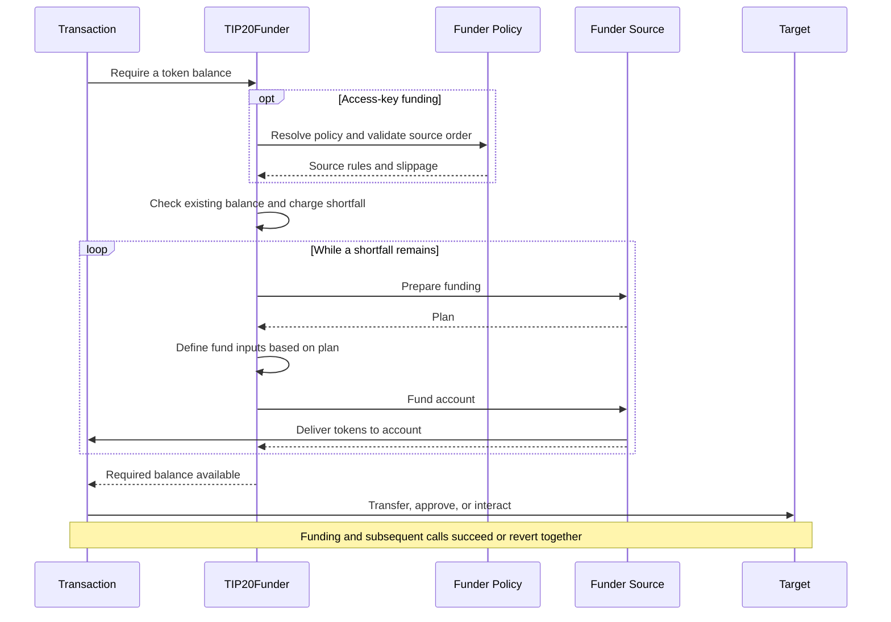

# TIP-1120: TIP-20 Fund Requirements

## Abstract

Introduces a precompile that satisfies requested TIP-20 balances through ordered funder source contracts before application calls. Admin-managed funder policies define approved sources, their rules, and aggregate slippage. Access keys reference a shared policy and charge spending limits against the requested output token. Funding and application calls execute atomically.

## Motivation

An account may hold `tokenA`, `tokenB`, and/or `earnShareX` but need `tokenC`. Consumers should be able to execute transactions using supported funding paths without manually converting assets or giving access keys unrestricted authority to liquidate them. Shared policies let admins update those paths without replacing every access key.

## Assumptions

- Funding completes synchronously within the same transaction. Asynchronous withdrawals are outside this interface.
- The owner selects a funder policy and trusts its admins to manage approved sources and rules. Funder sources validate assets, venues, caller arguments, and valuations under those rules. Deployment provenance or TIP-20 compliance alone does not establish parity or an approved conversion path.
- Access keys require an owner-authorized `funderPolicy`. Policy changes apply to all referencing keys without resetting their spending budgets. Offchain preferences grant no authority.

## Threat Model

| Actor | Authority and trust |
| --- | --- |
| Owner | Authorizes keys and selects their funder policy, trusting its current and future admins. |
| Policy admin | Any listed admin may independently update rules or replace the admin list, including trust in source implementations and upgrades. |
| Access key and offchain orchestration | May select adverse inputs, routes, and timing within the approved policy. Cannot update that policy or expand key authority. |
| Funder Source | Trusted to validate opaque policy and call data and report faithful input bounds and reference valuation. Executes the approved funding path. |
| Protocol | Resolves policy and key authority, enforces reported input bounds and aggregate cost limits, measures delivery, and rolls back failures. It does not interpret source-specific payloads. |

---

# Specification

The consumer specifies a token, a required balance, and ordered funder source calls. `TIP20Funder` counts existing funds, obtains the shortfall within the account's permissions and cost limits, then continues with application calls. Each funder source implements the same interface; its policy rules and transaction arguments are ABI-encoded bytes.

Funding and application calls in the diagram execute atomically. Funder Policy represents registry state inside `TIP20Funder`, not a separate contract.



## Tempo Transaction

Tempo transactions MAY include a signed `requireFunds` array to obtain missing tokens before executing `calls`. Entries execute in order with separate cost budgets. Amounts are target balances, including existing funds; repeated assets are not additive. Every requested balance MUST still be satisfied before application calls begin.

The signature MUST cover the entire array, including funder source addresses, data, and optional slippage. Funding and calls share gas, rollback, and credit accounting. Omitted or empty arrays skip automatic funding; explicit precompile calls remain supported. Existing validity bounds and normal fee handling apply. This field does not fund transaction fees.

### Interface

```typescript
/** Funding requirements processed in order before application calls. */
type RequireFunds = {
  /** Requested TIP-20 token. */
  asset: `0x${string}`
  /** Target balance in token base units, including existing funds. */
  amount: bigint
  /** Must equal the funder policy tolerance; omission inherits it. Root default is zero. */
  slippageBps?: number
  /** Selected sources attempted synchronously in this order. */
  sources: {
    /** Contract or precompile implementing IFunderSource. */
    address: `0x${string}`
    /** ABI-encoded funder source arguments, including any caller input cap, route, quote, or proof. */
    data: `0x${string}`
  }[]
}[]
```

### Example

Require 50 USDC using up to 30 USDC.e first, then OUSD. `encode` below denotes the selected funder source's ABI encoder, not a protocol function. The shared policy must approve both inputs.

```typescript
{
  requireFunds: [{
    asset: USDC,
    amount: 50_000_000n,
    sources: [
      { address: NATIVE_DEX_SOURCE, data: encode({ assetIn: USDC_E, maxAmountIn: 30_000_000n }) },
      { address: NATIVE_DEX_SOURCE, data: encode({ assetIn: OUSD }) },
    ],
  }],
  calls: [{ to: USDC, data: 'transfer(recipient, 50)' }],
}
```

## Access Keys

The owner enables delegated funding with `keyAuthorization.funderPolicy`, supplying an existing global policy ID or an inline `Policy` to create during key installation. The installed key stores the resolved `funderPolicyId`. Funding needs no explicit `allowedCalls` entry. Key validity, spending limits, and later-call permissions remain enforced.

### Interface

```typescript
type KeyAuthorization = {
  // ...
  /** Existing policy ID or a new inline policy. Omission disables funding; ID zero is invalid. */
  funderPolicy?: bigint | Policy
}
```

### Example

Reference a policy that already exists, using its registry-assigned ID:

```javascript
{
  keyAuthorization: {
    limits: [{ token: USDC, limit: 50, period: 30days }],
    funderPolicy: funderPolicyId,
    allowedCalls: [{
      target: USDC,
      selectorRules: [{ selector: TIP20.transfer.selector }],
    }],
    // ...
  },
}
```

Or create a policy while authorizing the key:

```typescript
{
  keyAuthorization: {
    funderPolicy: {
      admins: [self],
      slippageBps: 100,
      sources: [{ address: NATIVE_DEX_SOURCE, data: encode({ inputTokens: [USDC_E, OUSD] }) }],
    },
    // ...
  },
}
```

Inline policies contain no `id`. During owner-authorized key installation, the protocol validates the policy using the same rules as `createPolicy`, allocates an ID, emits `PolicyCreated` with the owner as `updater`, and stores the ID on the key. Policy creation and key installation MUST succeed or revert together.

Existing key authorization validity and replay checks MUST run before allocation. An already-installed authorization MUST NOT create another policy when processed again. The native installation path may create the signed inline policy; this does not grant access-key calls permission to create or modify policies.

Consumers retrieve the assigned ID from `PolicyCreated` in the transaction receipt. The key-authorization getter MUST also expose the stored `funderPolicyId`, for either input form. Subsequent funding uses that ID and does not recreate the inline policy.

## Funder Policies

`TIP20Funder` assigns global policy IDs. A policy contains admins, aggregate slippage, and ordered funder source rules, with no output asset. Multiple accounts and keys may reference the same policy. The requested output comes from `requireFunds`; each selected funder source validates that output under its approved rules.

### Interface

```typescript
/** Shared funding rules. Policy data is specific to each funder source. */
type Policy = {
  /** Any listed admin may update rules or replace this list. */
  admins: `0x${string}`[]
  /** Total slippage per requirement, from 0 to 10,000 basis points. */
  slippageBps: number
  /** Approved funder source contracts, in execution order. Addresses must be unique. */
  sources: {
    address: `0x${string}`
    /** ABI-encoded rules, such as permitted inputs, vaults, pools, or proof signers. */
    data: `0x${string}`
  }[]
}
```

### Example

One native DEX funder source can approve several inputs. Runtime data chooses an approved input and may impose a tighter cap. The encoded policy and call schemas are defined by the funder source.

```typescript
// Illustrative call to the precompile binding; returns a registry-assigned ID.
const policyId = await tip20Funder.createPolicy({
  admins: [OWNER, POLICY_MANAGER],
  slippageBps: 100,
  sources: [
    { address: NATIVE_DEX_SOURCE, data: encode({ inputTokens: [USDC_E, OUSD] }) },
    { address: EARN_SOURCE, data: encode({ vaults: [MY_VAULT] }) },
  ],
})
```

### Lifecycle and authorization

`createPolicy` assigns a new global ID and stores the supplied `Policy`. Anyone may create a policy; creating or administering one grants no authority over accounts that have not selected it. Admin lists MUST be nonempty and contain only unique, nonzero addresses. Invalid slippage, zero source addresses, and duplicate source addresses MUST revert.

Any current admin may independently call `modifyPolicy` or `setAdmins`. `modifyPolicy` replaces slippage and sources while preserving admins; `setAdmins` replaces the entire admin list, including removing the caller if desired. Authenticate against the current list before replacement. Access-key execution and funding callbacks MUST NOT create or mutate policies.

The owner's key-authorization signature MUST cover the `funderPolicy` form and its complete value: either an existing ID or all inline policy fields, including admin and source order and data. An ID must exist at installation; an inline policy is created atomically with installation. Funding resolves the stored ID. Selecting a policy trusts its current and future admins and updates. Changes apply to all referencing accounts and keys without modifying key validity, spending limits, consumed budgets, or funding credit.

At funding start, snapshot the selected policy for the whole operation. Validate membership and nondecreasing policy positions across every supplied funder source before checking the existing balance. Funder sources MAY be omitted or repeated; repeated calls to one funder source execute in transaction order. A policy with no sources permits balance checks but no hooks.

Policy data defines approved rules; transaction data defines a particular call. They are not compared for byte equality. Each funder source's preparation hook MUST validate its decoded call arguments against the snapshot's policy data. Unsupported inputs, outputs, venues, and attempts to expand policy authority MUST revert.

## Precompile

`TIP20Funder` coordinates funding and owns the policy registry.

```solidity
interface TIP20Funder {
    struct Source {
        address target;
        bytes data;
    }

    struct Policy {
        address[] admins;
        uint16 slippageBps;
        Source[] sources;
    }

    error InvalidFundingContext();
    error InvalidAsset(address asset);
    error PolicyNotFound();
    error Unauthorized();
    error InvalidPolicy();
    error FundingNotAuthorized(address source);
    error InvalidSourceOrder();
    error InvalidFundingPlan(address source);
    error InputLimitExceeded(address source, uint256 limit, uint256 attempted);
    error UnexpectedFundingAmount(address source, uint256 maximum, uint256 received);
    error InsufficientFunding(uint256 required, uint256 available);
    error FundingReentrancy();

    function policyIdCounter() external view returns (uint64);
    function policyExists(uint64 policyId) external view returns (bool);
    function createPolicy(Policy calldata policy) external returns (uint64 policyId);
    function getPolicy(uint64 policyId) external view returns (Policy memory policy);
    function modifyPolicy(
        uint64 policyId, uint16 slippageBps, Source[] calldata sources
    ) external;
    function setAdmins(uint64 policyId, address[] calldata admins) external;

    event PolicyCreated(uint64 indexed policyId, address indexed updater);
    event PolicyUpdated(uint64 indexed policyId, address indexed updater, bytes32 policyHash);
    event PolicyAdminsUpdated(uint64 indexed policyId, address indexed updater, address[] admins);

    /// @notice A positive contribution verified against actual input debits and output delivery.
    /// @param requestHash Hash of the original source call data signed by the transaction sender.
    event SourceFunded(
        address indexed account, address indexed assetOut, address indexed source,
        bytes32 requestHash, address assetIn, uint256 amountIn, uint256 amountOut
    );

    event FundsRequired(
        address indexed account, address indexed key, address indexed asset,
        uint256 requiredAmount, uint256 fundedAmount
    );

    /// @notice Make the authenticated account's asset balance at least amount.
    /// @return fundedAmount Newly delivered asset units, excluding the existing balance.
    function requireFunds(address asset, uint256 amount, Source[] calldata sources)
        external returns (uint256 fundedAmount);
}
```

The transaction and policy `address` field maps to Solidity’s `target` field; `address` is a reserved Solidity keyword.

Policy IDs fit `uint64`; zero is reserved. `policyIdCounter` starts at 1 and returns the next ID. Creation allocates that ID and increments the counter; overflow MUST revert. IDs are never reused. `policyExists` returns false for unknown IDs; other ID-based methods revert with `PolicyNotFound`. `createPolicy`, `modifyPolicy`, and `setAdmins` emit `PolicyCreated`, `PolicyUpdated`, and `PolicyAdminsUpdated`, respectively. State, counter changes, and events follow transaction rollback.

`maxAmountIn` is a funder source argument encoded inside call data, not a separate precompile field. It caps gross original-input consumption for that invocation in token or share base units. Supported funder source encoders MUST represent omission as no additional caller cap and zero as no debit. The funder source decodes this bound; the protocol enforces the validated preparation result.

## Funder Sources

A funder source is a contract or precompile implementing `IFunderSource`. It validates source-specific policy and transaction data, prepares bounded funding, and delivers the requested token. Tokens, vaults, and their deployment factories need not implement this interface.

### Interface

```solidity
interface IFunderSource {
    struct Plan {
        address assetIn;
        uint256 rate;
        uint256 maxAmountIn;
        bytes data;
    }

    /// @notice Validate a request and prepare its bounded execution.
    /// @param assetOut Requested TIP-20 token.
    /// @param maxCost Remaining shared cost budget in requested-token base units.
    /// @param data Original source-specific transaction arguments.
    /// @param policyData Selected policy rules; empty for owner-authorized funding.
    /// @param ownerAuthorized True only for direct owner-authorized funding.
    /// @dev Only TIP20Funder may call. Execute with STATICCALL and grant no input authority.
    function prepare(
        address assetOut,
        uint256 maxCost,
        bytes calldata data,
        bytes calldata policyData,
        bool ownerAuthorized
    ) external view returns (Plan memory plan);

    /// @notice Deliver up to amountOut of assetOut to account, synchronously.
    /// @param account Authenticated input owner and output recipient.
    /// @param amountOut Maximum output contribution in requested-token base units.
    /// @param data Prepared execution payload returned by this source's prepare hook.
    /// @dev Only TIP20Funder may call, within the prepared native input permission.
    function fund(address account, address assetOut, uint256 amountOut, bytes calldata data) external;
}
```

`TIP20Funder` supplies authenticated arguments to both hooks and forwards `plan.data` unchanged to `fund`. Funder sources MUST authenticate the precompile caller. An `account` argument alone grants no debit authority. The protocol binds each plan to the authenticated account, output, funder source, and invocation; callers cannot submit a plan directly or reuse one in another call.

### Preparation and data

For access keys, `prepare` MUST validate the original call data against the selected policy rule. For owner-authorized funding, the signed call data directly authorizes the requested route; `ownerAuthorized` distinguishes this from an access-key rule containing empty bytes. Both modes MUST validate supported assets, venues, and configurations during preparation. Checks requiring the authenticated account or contribution amount occur in `fund` before spending.

A funder source MUST derive `plan.maxAmountIn` as the minimum of the decoded caller cap, its approved policy caps, and the input capacity allowed by `maxCost`. `plan.data` carries the effective bound and any validated execution arguments. It MUST preserve any account- or amount-bound authorization in the original data and MUST NOT expand caller or policy authority. The output asset remains fixed by the protocol.

Policy and call encodings belong to the funder source. A native DEX funder source may decode `{ assetIn, maxAmountIn }`; an Earn funder source may decode `{ vault, maxAmountIn }`. Quotes or proofs may appear in the same payload. The protocol does not parse these fields: it independently meters debits against the returned plan and shared budget.

Quotes and proofs MUST be bound to the approved route and applicable account, asset, amount, and authorization domain. Funder sources MUST enforce their required signatures, expiry, and replay protection. `fund` MUST check account- and amount-bound proofs against its authenticated arguments before any input debit or external funding action. Stateful proof consumption happens during `fund` and follows transaction rollback. Runtime data MUST NOT replace approved inputs, venues, or signers.

### Input valuation

`prepare` returns the original input asset and a fixed `rate`: requested-token base units per input base unit, scaled by `1e18` and rounded up. Valuation MUST use approved reference accounting, independent of caller-supplied execution quotes. Net redemption quotes MUST NOT hide fees or execution losses from cost accounting.

A native DEX funder source uses a parity rate only for supported parity assets, with decimal normalization. TIP-20 compliance or matching currency metadata is insufficient. An Earn funder source values shares using canonical managed backing after pending fee dilution, before redemption fees or execution losses. Unsupported or unavailable valuation MUST revert.

The preparation call uses `STATICCALL` before creating input authority. For a nonzero input asset, a zero rate is invalid. The protocol MUST reject a plan exceeding the capacity below, then fix the input asset, rate, and cap for the invocation:

```text
authorizedCap = floor(remainingCostBudget * 1e18 / plan.rate)
require plan.maxAmountIn <= authorizedCap
inputCost = ceil(cumulativeAmountIn * plan.rate / 1e18)
```

Use full-precision arithmetic. Clamp `authorizedCap` to `uint256.max`; other unrepresentable results MUST revert. Each gross input debit charges the increase in cumulative `inputCost`. Refunds do not restore input capacity or cost budget. Intermediate conversions MUST NOT count the same original input twice.

For example, `rate = 2e18` with equal decimals values one Earn share at 2 USDC. A 10 USDC budget permits at most 5 shares. Consuming 4 shares charges 8 USDC, leaving 2 USDC for later sources.

### Funding without account inputs

A plan with `(assetIn, rate, maxAmountIn) = (address(0), 0, 0)` grants no account-input authority. Any other zero-input combination is invalid. The funder source may deliver from its own liquidity or redeem a validated withdrawal authorization. Delivery checks, output spending charges, and funding credit still apply.

Aggregate input cost measures debits from the authenticated account through integrated funding paths. It does not measure external custody fees or newly incurred debt. Any such charges or obligations MUST be bounded by the funder source's approved rules and validated authorization; zero account input does not imply zero economic cost.

### Funding input authority

Before `fund`, the protocol creates a journaled invocation record containing `account`, `source`, `assetIn`, and `remainingInput = plan.maxAmountIn`. The record is bound to this call frame and its descendants. Only protocol code may create or modify it. Closing or reverting the call clears the authority without changing the key or shared policy.

Each original account-input debit MUST verify the account and input asset and reduce both remaining input capacity and the shared cost budget before moving assets. Exceeding either bound MUST revert. Supported paths include token transfers, internal DEX debits, and Earn share burns. A zero-input plan authorizes no such debit.

Temporary permission replaces allowance checks for supported funding debits. Those debits MUST NOT separately check or deduct the input token's access-key spending limit. Key validity, token pause, and transfer policy checks still apply. No standing allowance is created. Input movements, credit retirement, and cost counters share the EVM revert journal.

A separate operation guard spans policy resolution, preparation, and funding. Any nested or reentrant `requireFunds` call MUST revert, including during `prepare`. The guard clears on return or revert.

The following Solidity-style pseudocode describes node-internal operations, not a new public debit API:

```solidity
// Open a journaled permission bound to the source call frame and its descendants.
require(!hasActiveFunding());
openInputPermission(account, request.target, plan, remainingCostBudget);
IFunderSource(request.target).fund(account, assetOut, amountOut, plan.data);
(uint256 amountIn, uint256 inputCost) = closeInputPermission();
// Reverts roll back the permission, transfers, credit, and counters together.

// Runs before each original-input debit in a supported token, DEX, or vault path.
function meterFundingDebit(address owner, address token, uint256 amount) internal {
    require(frameBelongsTo(activeFunding));
    require(owner == activeFunding.account);
    require(token == activeFunding.assetIn && token != address(0));
    require(amount <= activeFunding.remainingInput);
    checkKeyAndTokenPolicies(owner, token);

    uint256 newAmountIn = activeFunding.amountIn + amount;
    uint256 newInputCost = mulDivUp(newAmountIn, activeFunding.rate, 1e18);
    uint256 cost = newInputCost - activeFunding.inputCost;
    require(cost <= remainingCostBudget);
    activeFunding.remainingInput -= amount;
    remainingCostBudget -= cost;
    activeFunding.amountIn = newAmountIn;
    activeFunding.inputCost = newInputCost;
    // The calling token, DEX, or vault path now performs the metered debit or burn.
}
```

## Sourcing Funds

Existing balances count toward the requirement. Access-key funding charges the initial shortfall once against the requested token's spending budget. All sources in that operation share one cost budget. Partial or zero contributions continue to the next supplied call; unexpected errors revert without trying later sources.

The Solidity-style example uses illustrative native context, permission, and accounting helpers; these are not public contract APIs.

```solidity
function requireFunds(address asset, uint256 amount, Source[] calldata sources)
    external fundingOperationGuard returns (uint256 fundedAmount)
{
    // Validate context, snapshot the policy, and check all sources before the balance shortcut.
    FundingContext memory ctx = validateAndResolveFunding(asset, sources);
    uint256 balance = TIP20(asset).balanceOf(ctx.account);
    if (balance >= amount) {
        emit FundsRequired(ctx.account, ctx.key, asset, amount, 0);
        return 0;
    }

    uint256 shortfall = amount - balance;
    if (ctx.isAccessKey) chargeOutputBudget(ctx, asset, shortfall);
    uint256 costBudget = mulDiv(shortfall, 10_000 + ctx.slippageBps, 10_000);
    uint256 totalCost;

    for (uint256 i; i < sources.length && balance < amount; ++i) {
        Source calldata request = sources[i];
        bytes memory policyData = ctx.isAccessKey ? sourceRule(ctx, request.target) : bytes("");
        IFunderSource.Plan memory plan = IFunderSource(request.target).prepare(
            asset, costBudget - totalCost, request.data, policyData, !ctx.isAccessKey
        );
        validatePlan(plan, costBudget - totalCost);

        // Native permission meters original inputs and cost; reverts clear it through the journal.
        openInputPermission(ctx, request.target, plan, costBudget - totalCost);
        IFunderSource(request.target).fund(ctx.account, asset, amount - balance, plan.data);
        (uint256 amountIn, uint256 inputCost) = closeInputPermission();
        totalCost += inputCost;

        uint256 newBalance = TIP20(asset).balanceOf(ctx.account);
        require(newBalance >= balance);
        uint256 amountOut = newBalance - balance;
        require(amountOut <= amount - balance);
        require(amountOut > 0 || amountIn == 0);
        if (amountOut > 0) {
            if (ctx.isAccessKey) addFundingCredit(ctx, asset, amountOut);
            emit SourceFunded(
                ctx.account, asset, request.target,
                keccak256(request.data), plan.assetIn, amountIn, amountOut
            );
        }
        fundedAmount += amountOut;
        balance = newBalance;
    }

    if (balance < amount) revert InsufficientFunding(amount, balance);
    require(totalCost <= costBudget);
    emit FundsRequired(ctx.account, ctx.key, asset, amount, fundedAmount);
    return fundedAmount;
}
```

A funder source MUST contribute as much as its approved path can synchronously supply up to the requested shortfall, within available inputs, liquidity, and its prepared cap. Zero delivery MUST consume no account inputs. The protocol measures delivery from balance changes, never from source-reported output.

## Funder Source Examples

Existing tokens count toward the balance without invoking a funder source. Native DEX and Earn sources illustrate parity conversions; their policy and call encodings are source-specific. The examples use Solidity-style pseudocode and omit ordinary validation details. Helpers describe proposed integration logic, not existing public APIs. Decoders map omitted caps to `uint256.max`; `inputCapacity` uses the full-precision, saturating calculation above. Rate helpers normalize decimals and round up. Contribution helpers respect available inputs, liquidity, and the prepared cap.

### Native DEX

Policy data lists approved input tokens. Call data selects one input and an optional `maxAmountIn`. Preparation rejects unsupported parity assets or outputs and derives the effective cap. The funder source executes the native DEX swap with the authenticated account as input owner and output recipient.

```solidity
function prepare(
    address assetOut,
    uint256 maxCost,
    bytes calldata data,
    bytes calldata policyData,
    bool ownerAuthorized
) external view returns (Plan memory) {
    require(msg.sender == TIP20_FUNDER);
    NativeDexRequest memory request = decodeNativeDexCall(data);
    if (!ownerAuthorized) {
        require(contains(decodeNativeDexPolicy(policyData).inputTokens, request.assetIn));
    }
    validateParityRoute(request.assetIn, assetOut);
    uint256 rate = parityRate(request.assetIn, assetOut);
    uint256 cap = min(request.maxAmountIn, inputCapacity(maxCost, rate));
    return Plan(request.assetIn, rate, cap, abi.encode(request.assetIn, cap));
}

function fund(address account, address assetOut, uint256 amountOut, bytes calldata data) external {
    require(msg.sender == TIP20_FUNDER);
    (address assetIn, uint256 cap) = abi.decode(data, (address, uint256));
    uint256 contribution = maxExecutableOutput(account, assetIn, assetOut, amountOut, cap);
    if (contribution == 0) return;
    // Proposed native integration uses the account as input owner and output recipient.
    nativeSwapExactAmountOut(account, assetIn, assetOut, contribution, cap);
}
```

Native DEX integration MUST meter the original account input under the active funding permission. It MUST check native amount widths before conversion and preserve token policies. A funder source must not classify an Earn share as a parity stablecoin merely because both implement TIP-20.

### Earn Shares

Policy data lists approved vaults. Call data selects a vault and optional share-input cap. Preparation authenticates the vault and its supported engine configuration. It values shares using managed backing before redemption fees and share supply after pending fee dilution, then caps shares by the remaining aggregate budget.

```solidity
function prepare(
    address assetOut,
    uint256 maxCost,
    bytes calldata data,
    bytes calldata policyData,
    bool ownerAuthorized
) external view returns (Plan memory) {
    require(msg.sender == TIP20_FUNDER);
    EarnRequest memory request = decodeEarnCall(data);
    if (!ownerAuthorized) {
        require(contains(decodeEarnPolicy(policyData).vaults, request.vault));
    }
    validateVaultAndRoute(request.vault, assetOut);
    (uint256 backingAssets, uint256 shareSupply) = previewBackingAndSupply(request.vault);
    uint256 rate = normalizedShareRate(backingAssets, shareSupply, request.vault, assetOut);
    uint256 cap = min(request.maxAmountIn, inputCapacity(maxCost, rate));
    return Plan(earnShare(request.vault), rate, cap, abi.encode(request.vault, cap));
}

function fund(address account, address assetOut, uint256 amountOut, bytes calldata data) external {
    require(msg.sender == TIP20_FUNDER);
    (address vault, uint256 shareCap) = abi.decode(data, (address, uint256));
    Redemption memory quote = quoteFunding(account, vault, assetOut, amountOut, shareCap);
    if (quote.amountOut == 0) return;
    // Redeem only the underlying required for this contribution, with native share-debit metering.
    uint256 released = redeemFor(account, vault, quote.underlyingAmount, shareCap);
    if (underlying(vault) != assetOut) {
        swapReleasedUnderlying(account, vault, assetOut, quote.amountOut, released);
    }
    returnUnusedIntermediateAssets(account);
}
```

`previewBackingAndSupply` is illustrative logic internal to the funder source, not an existing Earn API. Redemption needs integration with [`withdrawExact` logic](https://github.com/tempoxyz/earn/blob/0c0f141f76f1f3c1f56f414a413f21a9e677d93d/src/core/EarnVault.sol#L608), because the current public method pulls shares from its caller. Share burns MUST use native bounded-debit support; composed swaps MUST NOT charge the same input twice.

### Non-Parity Tokens

Account-input conversions in this iteration support 1:1 parity assets, including Earn shares valued through their supported underlying. A future [propAMM](https://github.com/tempoxyz/propamm) funder source could approve a specific pool in policy data and infer the input from its fixed pair and requested output. Non-parity reference valuation must be defined before enabling those conversions.

## Owner-Authorized Funding

A root-signed transaction directly authorizes its selected sources and their call data, including input caps and routes. It does not require a stored funder policy. The protocol passes `ownerAuthorized = true` and empty policy data to `prepare`; this flag MUST come from authenticated native context, never transaction arguments.

```typescript
{
  address: EARN_SOURCE,
  data: encode({ vault: MY_VAULT, maxAmountIn: 10_000_000n }),
}
```

The same preparation, valuation, input-cap, delivery, and rollback rules apply. Omitted `maxAmountIn` adds no caller cap; the shared cost budget still applies. Root funding creates no access-key funding credit and does not charge access-key budgets. Transaction slippage defaults to zero; an explicit root precompile call uses zero.

TIP-20 and integrated Earn paths MUST use native bounded-debit support to avoid explicit approvals. Existing contracts that only pull tokens through `transferFrom` still require an allowance or integration changes. Owner authorization does not bypass token policies or unrelated contracts' transfer rules.

## Access Key Accounting

Each `requireFunds` operation charges its initial shortfall before granting input authority. Funder sources are not charged separately; credit records only verified delivery. Insufficient final funding reverts the charge and all contributions.

Credit prevents subsequent transfers or approvals from charging again. Existing balances, key validity, and period resets follow normal accounting.

The pseudocode extends the existing [`AccountKeychain` flow](https://github.com/tempoxyz/tempo/blob/25b216a661c2cac72807174583371b582b75c286/crates/precompiles/src/account_keychain/mod.rs#L1353) with proposed internal helpers `addFundingCredit` and `takeFundingCredit`. Credit storage remains open; ellipses omit implementation details.

New `TIP20Funder.requireFunds`, showing budget and credit handling:

```solidity
function requireFunds(/* ... */) external {
    // ... validate context and calculate initialShortfall; return if already funded.
    if (isAccessKey) keychain.verifyAndUpdateSpending(account, keyId, asset, initialShortfall);

    // ... visit sources and measure each contribution within the shared input budget.
    // ... for each positive contribution:
    if (isAccessKey) keychain.addFundingCredit(account, keyId, asset, received);

    // ... revert unless the target balance is satisfied within the total cost cap.
}
```

Changes to existing transfer authorization in `AccountKeychain`:

```solidity
function authorizeTransfer(/* ... */) internal {
    // ... existing key lookup, root key and transaction origin guards.
    uint256 covered = takeFundingCredit(account, keyId, asset, amount);
    // ... if authorized and metered by the active funding permission, validate the key and return.
    verifyAndUpdateSpending(account, keyId, asset, amount - covered);
}
```

Changes to existing approval authorization in `AccountKeychain`:

```solidity
function authorizeApprove(/* ... */) internal {
    // ... existing key lookup, root key and transaction origin guards.
    uint256 approvalIncrease = newApproval > oldApproval ? newApproval - oldApproval : 0;
    if (approvalIncrease > 0) {
        uint256 approvalCovered = takeFundingCredit(account, keyId, asset, approvalIncrease);
        verifyAndUpdateSpending(account, keyId, asset, approvalIncrease - approvalCovered);
        // Pass approvalCovered to the token's approval path for association with the spender.
    }
}
```

`takeFundingCredit` consumes up to the requested amount for the account, key, and token. Fees receive no credit. Spending checks still run when credit fully covers the amount.

Associate `approvalCovered` with the spender. Allowance spending consumes approval credit first, then funding credit; other debits consume funding credit directly. Normal allowance, key, call-permission, and token-policy checks remain.

Credit follows nested reverts and expires at transaction end. Incoming transfers, refunds, and approval decreases MUST NOT create credit or restore budget. Unspent funds from `requireFunds` remain charged.

## Slippage

A funder policy's required `slippageBps` sets the aggregate tolerance for each access-key funding requirement. Values MUST be between 0 and 10,000. A transaction-supplied value MUST equal the policy snapshot's value, including zero; omission inherits it. Explicit access-key precompile calls use the policy value.

Owner-authorized transactions may supply their own tolerance, defaulting to zero. Explicit owner precompile calls use zero. Compute the shared budget in requested-token base units with full precision, rounding down and reverting on an unrepresentable result:

```text
effectiveSlippageBps = policy.slippageBps if access key else transaction.slippageBps ?? 0
totalCostCap = floor(initialShortfall * (10_000 + effectiveSlippageBps) / 10_000)
```

Funder sources may offset input-cost gains and losses in either order. Each plan remains bounded by its policy, caller cap, and remaining shared budget. Existing balances add no budget; budgets do not carry between requirements. For a 50 USDC shortfall and 100 bps, total normalized account-input cost cannot exceed 50.50 USDC.

# Tooling

## SDKs

SDKs need policy read/write bindings, source-specific encoders, and signing support for both `funderPolicy` forms and funder source calls. After inline creation, SDKs can extract the assigned ID from the transaction receipt's `PolicyCreated` event or read the installed key's resolved `funderPolicyId`.

## Relay RPC API

The Relay RPC API sits between the user and the Node. The Relay reads the key's funder policy, discovers compatible funding paths, applies offchain preferences, and constructs and simulates funding requirements. `eth_fillTransaction` accepts complete requirements, target balances without sources, or `true` to infer target balances from the transaction calls.

### `eth_fillTransaction`

The following pseudo-definition describes the proposed relay extension. `TransactionRequest` represents the existing transaction request fields.

```typescript
/** Funding instructions accepted by eth_fillTransaction. */
type FillRequireFunds =
  /**
   * Preserves the supplied assets, amounts, funder source order, encoded caps, data, and slippage settings.
   */
  | RequireFunds

  /**
   * Preserves each `asset` and `amount`, and automatically fills ordered funder source calls
   * using available balances, liquidity, and preferences within the signing account's authority.
   */
  | {
      /** Requested TIP-20 token address. */
      asset: `0x${string}`
      /** Target balance in token base units, including existing funds. */
      amount: bigint
    }[]

  /**
   * Infers required tokens and target balances from the calls, then selects funder source calls.
   * Returns an error if the requirements cannot be determined; do not silently omit uncertain requirements.
   */
  | true

/** Transaction request passed as the first eth_fillTransaction parameter. */
type FillTransactionRequest = Omit<TransactionRequest, 'requireFunds'> & {
  /** Complete requirements, target balances to fill, or inference from calls. */
  requireFunds?: FillRequireFunds
}
```

The relay returns an unsigned transaction with a complete `requireFunds` array for signing. Shorthand entries and `true` are relay inputs only and MUST NOT appear in the signed transaction. The filled request MUST respect the current funder policy, funder source order, input limits, and aggregate slippage. Relay preferences grant no authority, and simulation does not replace execution-time checks.

# Observability

`PolicyCreated`, `PolicyUpdated`, and `PolicyAdminsUpdated` identify policy creation, rule updates, and admin changes with the policy ID and caller. `SourceFunded` records each positive verified contribution with its funder source, original request hash, actual input asset, gross input amount, and delivered output. Zero contributions emit no funding event; no-input contributions record zero input asset and amount.

`FundsRequired` emits once on successful completion, with the sum of contributions or zero when the balance already suffices. It confirms funding, not completion of subsequent application calls. Preserve native spending, token, vault, and DEX events. Credit-covered consumption MUST NOT emit a second budget deduction. Events follow their state changes' rollback.

# Invariants

1. **Balance satisfaction.** Successful funding MUST leave at least the requested balance. `fundedAmount` MUST equal `max(amount - initialBalance, 0)` and summed measured contributions. A sufficient initial balance invokes no hooks, charges no budget, and creates no credit.

2. **Policy administration.** Anyone may create a policy. Only a current admin may independently update its rules or replace its nonempty, unique, nonzero admin list. Access-key execution and funding callbacks cannot mutate policies. Updates MUST NOT reset key limits, consumed budgets, validity, or funding credit.

3. **Policy binding.** Signed `funderPolicy` selects an existing global ID or creates a policy atomically with key installation. The installed key stores only the resolved `funderPolicyId`. Its owner opts into current and future admin control. A transaction cannot select a different policy. Apply a consistent policy snapshot throughout the funding operation, including its aggregate slippage.

4. **Ordered calls.** Validate every supplied funder source's membership and nondecreasing policy position before the balance shortcut. Funder sources may be omitted or repeated; repeated calls follow transaction order. Duplicate funder source addresses in one policy are invalid. Stop invoking sources once the balance is satisfied.

5. **Funder source validation.** Preparation MUST validate opaque call arguments under approved policy rules and supported conversion semantics. Deployment provenance, TIP-20 compliance, or caller quotes alone establish neither authorization nor reference value. Runtime arguments cannot expand approved authority.

6. **Prepared authority.** Preparation runs under STATICCALL with no input permission. Only its validated result may establish a bounded funding invocation. Bind the plan and permission to the account, output asset, funder source, and call frame. Nested, delegated, and reentrant requireFunds calls MUST revert.

7. **Bounded inputs.** Gross original account-input debits MUST stay within the prepared input asset and cap and the remaining shared cost budget. Preparation MUST honor caller and policy caps. Zero permits no debit; omission removes only the caller's additional cap. Refunds do not restore capacity. Repeated calls receive new invocation caps within the remaining shared budget.

8. **Verified delivery.** Measure output from the account's balance increase. A funder source MUST NOT reduce that balance, deliver more than the shortfall, or consume account inputs while delivering zero output. Partial or zero delivery continues; unexpected errors revert the operation.

9. **Cost measurement.** Fix the input valuation per invocation, normalize decimals, round caps down and cumulative costs up, and include conversion fees and execution losses. Meter actual gross original inputs independently of source-reported output. Intermediate movements MUST NOT count the same input twice.

10. **Aggregate slippage.** Total normalized account-input cost MUST NOT exceed the budget derived from initial shortfall and effective slippage. A supplied access-key transaction tolerance MUST equal the policy value. Existing balances create no extra allowance; separate requirements do not share unused budgets.

11. **No-input funding.** Only an all-zero input asset, rate, and cap identifies a no-input plan. It MUST grant no account-debit authority. Funder sources must validate and bound any external fees or obligations under their approved authorization rules.

12. **Key permissions.** Funding needs no explicit allowedCalls entry but MUST preserve key validity, output spending limits, later-call permissions, and token policies. Metered funding inputs bypass ordinary input-token limit deduction; unrelated debits do not.

13. **Single budget charge.** Charge the initial output shortfall once for access keys. Credit only verified delivery; do not charge contributions separately. Failure reverts the charge and contributions. Unspent funded tokens remain charged.

14. **Credit isolation.** Credit belongs to the account, key, and token, follows nested reverts, and expires at transaction end. Ordinary incoming transfers, refunds, and approval decreases MUST NOT create credit or restore budget. Fees receive no credit.

15. **Approval accounting.** Associate approval credit with its spender. Allowance spending retires approval credit before remaining funding credit, preserving ordinary allowance and key checks. Other debits retire funding credit directly.

16. **Transaction requirements.** Sign the entire requireFunds array. Execute entries in order before calls, with separate budgets, and recheck all requested balances before application calls. Omitted or empty arrays perform no automatic funding. Funding cannot pay transaction fees.

17. **Atomic rollback.** Insufficient funding, excess cost, invalid delivery, hook failure, or subsequent application-call failure MUST revert the associated funding, charges, credit, and events. Native fee handling remains unchanged.

18. **Owner authorization.** Derive ownerAuthorized only from native authentication. Root signatures authorize selected sources and call data without a stored policy. Root funding MUST enforce bounded inputs and token policies, leave no standing authority, and create no access-key charge or credit.

Critical cases include missing policies, shared policies across accounts, unauthorized updates, admin replacement, invalid admin lists, inline creation rollback, repeated authorization processing without duplicate policies, policy changes without key replacement, reversed funder source order, repeated sources, an unlisted funder source after sufficient delivery, malformed data, unapproved inputs or pools, forged valuation, oversized prepared caps, stale or replayed proofs, and debit attempts from a no-input plan.

Root cases include funding without allowances, omitted or zero input caps, unsupported routes, attempts to spoof ownerAuthorized, and reuse of temporary input authority after the call.
