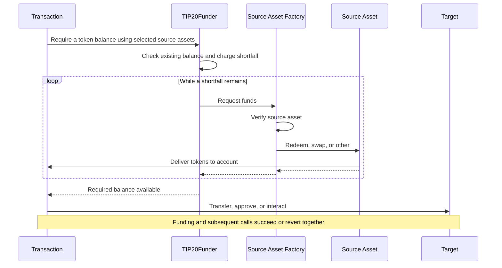

# TIP-1120: TIP-20 Fund Requirements

## Abstract

Introduces a new precompile that lets a consumer specify tokens and amounts they require and automatically satisfy that requirement using funding source assets validated by approved source asset factories. Funding is sourced in order from user assets and subsequent actions execute atomically, with access key spending limits enforced on the requested token.

## Motivation

An account may hold `tokenA`, `tokenB`, and/or `earnShareX` but need `tokenC`. Consumers should be able to execute transactions using any supported asset in their account, without manually converting assets and/or giving access keys unrestricted authority to liquidate those assets.

## Assumptions

- This iteration supports 1:1 parity sources. Non-parity conversions MUST be rejected. Earn shares use source asset factory-validated vault redemption rules; their underlying must be a supported asset.
- Each hook delivers funds within the same Tempo transaction or reverts.
- The owner approves source asset factories through the access key. Each source asset factory validates its source assets and conversion rules, including deployment configuration and upgrades. Source asset factory approval covers current and future supported deployments without separate source asset approvals. Offchain preferences supply no spending authority.
- Access keys can use funding only when the owner enables `requireFunds` in the key authorization.

## Threat Model

| Actor | Authority and trust |
| --- | --- |
| Owner | Authorizes keys and source asset factories, including trust in their supported deployments, conversion rules, and upgrades. |
| Access key and offchain orchestration     | May choose adverse routes. Cannot expand owner rules, input caps, or output budgets. |
| Funding source asset factory | Authenticates deployed source assets and enforces supported routes and valuation rules. Caller-supplied source asset addresses and data cannot expand its funding authority. |
| Protocol | Authenticates context, constrains debits, verifies delivery, and rolls back failed execution. |

---

# Specification

The consumer specifies a token, a required balance, and an ordered list of funding source assets (e.g. token or vault share). The precompile counts existing funds and obtains any shortfall from those source assets within the account's authorization and cost limits. Once funded, the transaction continues with its remaining calls. Funding and subsequent actions execute atomically.

Assume the flow in the diagram executes within a single atomic transaction.



## Tempo Transaction

Tempo transactions MAY include a signed `requireFunds` array to obtain any missing tokens from the specified funding source assets before executing `calls`. Entries are processed in order.

The transaction signature MUST cover every requirement, including each source asset factory, source asset, input cap, and data payload. Funding and calls share atomic rollback and credit accounting. An omitted or empty array skips automatic funding.

### Interface

```typescript
/** Funding requirements processed in order before transaction calls. */
type RequireFunds = {
  /** Requested TIP-20 token address. */
  asset: `0x${string}`
  /** Target balance in token base units, including existing funds. */
  amount: bigint
  /**
   * Total slippage tolerance across this entry's source assets, from 0 to 10,000 basis points.
   * Must match the authorized access-key value when configured; omission uses that value.
   */
  slippageBps?: number
  /** Source assets attempted synchronously in order until the target balance is satisfied. */
  sources: {
    /** Approved source asset factory implementing fund. */
    factory: `0x${string}`
    /** Asset authenticated by the source asset factory. */
    target: `0x${string}`
    /**
     * Maximum gross input for this source asset invocation, in token or share base units.
     * Optional for root and access keys; omission adds no caller cap.
     * Protocol limits still apply.
     */
    maxInput?: bigint
    /** Source asset factory-specific route or authorization data. Omission encodes as empty bytes. */
    data?: `0x${string}`
  }[]
}[]
```

### Example

Using an access key, require 50 USDC using up to 30 USDC.e first, then OUSD for the remaining shortfall.

```typescript
{
  requireFunds: [
    {
      asset: USDC,
      amount: 50,
      slippageBps: 100,
      sources: [
        { factory: TIP20_FACTORY, target: USDC.e, maxInput: 30 },
        { factory: TIP20_FACTORY, target: OUSD },
      ],
    },
  ],
  calls: [
    { to: USDC, data: 'transfer(recipient, 50)' },
  ],
}
```

## Access Keys

The owner enables delegated funding by setting `requireFunds` on the access key. When enabled, `requireFunds` needs no explicit `allowedCalls` entry. Key validity, spending limits, source asset factory authorization, source asset validation, and slippage checks still apply. Subsequent calls retain their normal permissions.

### Interface

The optional `keyAuthorization.requireFunds` property uses this type:

```typescript
/** Permission to fund token requirements using an access key. */
type RequireFundsPermission = {
  /** Approved source asset factories, in execution order. Duplicate addresses are invalid. */
  factories: `0x${string}`[]
  /**
   * Authorized total slippage per funding operation, from 0 to 10,000 basis points.
   * Any transaction-supplied value must match when this value is configured.
   */
  slippageBps?: number
}
```

### Example

```javascript
{
  keyAuthorization: {
    limits: [{ token: USDC, limit: 50, period: 30days  }],
    requireFunds: {
      factories: [TIP20_FACTORY, EARN_FACTORY],
      slippageBps: 100,
    },
    allowedCalls: [
      {
        target: USDC,
        selectorRules: [{ selector: TIP20.transfer.selector }],
      },
    ],
    // ...
  },
}
```

### Source asset factory approval

Approving a source asset factory authorizes its supported current and future source assets without listing individual tokens or vaults on the key. New deposits into a supported vault need no replacement key. Adding or changing approved source asset factories requires owner authorization and MUST NOT reset spending budgets.

The owner's signature MUST cover `factories` and its order. Duplicate source asset factory addresses are invalid. For each access-key requirement, every supplied source asset's source asset factory MUST appear in that array, and source asset factory indexes MUST be nondecreasing. Validate the entire source asset list before checking the existing balance or calling any source asset factory.

Source asset factories MAY be omitted; earlier source asset factories need not be exhausted. Source assets within one source asset factory follow transaction order. With `[TIP20_FACTORY, EARN_FACTORY]`, token source assets precede supplied Earn source assets, but an Earn-only request is valid. Ordering restarts for each requirement and does not constrain subsequent application calls.

An absent `requireFunds` permission disables delegated funding. An empty `factories` array authorizes no source asset factory calls. Root-key execution may choose source asset factories directly; source asset factory source asset validation and bounded input accounting still apply.

## Precompile

`TIP20Funder` coordinates funding. `ITIP20FunderFactory` is implemented by source asset factories, such as `TIP20Factory` and `EarnFactory`. Individual deployed tokens and vaults need not implement `fund`.

```solidity
interface TIP20Funder {
    struct Source {
        address factory;  // Source asset factory implementing ITIP20FunderFactory.
        address target;   // Asset authenticated by the source asset factory.
        uint256 maxInput;  // Caller input cap; uint256 maximum means no additional cap.
        bytes data;       // Source asset factory-specific route or authorization data.
    }

    error InvalidFundingContext();
    error InvalidAsset(address asset);
    error InvalidSource(address source);
    error FundingNotAuthorized(address factory);
    error InvalidFactoryOrder();
    error InputLimitExceeded(address source, uint256 limit, uint256 attempted);
    error UnexpectedFundingAmount(address source, uint256 maximum, uint256 received);
    error InsufficientFunding(uint256 required, uint256 available);
    error FundingReentrancy();

    /// @notice Emitted after a source asset contribution passes authorization and delivery checks.
    /// @param account Account receiving the requested tokens.
    /// @param asset Requested TIP-20 token.
    /// @param source Deployed source asset that supplied this contribution.
    /// @param factory Source asset factory that executed the funding hook.
    /// @param inputAsset Authorized input token or share token.
    /// @param inputAmount Gross authorized input debits in input asset base units, without subtracting refunds.
    /// @param outputAmount Verified contribution in requested token base units.
    event SourceFunded(
        address indexed account, address indexed asset, address indexed source,
        address factory, address inputAsset, uint256 inputAmount, uint256 outputAmount
    );
    /// @notice Emitted when requireFunds succeeds, including when existing funds satisfy the request.
    /// @param account Account whose requested balance is available.
    /// @param key Authenticated key identifier, following native keychain conventions.
    /// @param asset Requested TIP-20 token.
    /// @param requiredAmount Target balance in requested token base units.
    /// @param fundedAmount Newly supplied tokens in asset base units, excluding existing funds.
    event FundsRequired(
        address indexed account, address indexed key, address indexed asset,
        uint256 requiredAmount, uint256 fundedAmount
    );

    /// @notice Make the authenticated account's asset balance at least amount.
    /// @param asset Requested TIP-20 token.
    /// @param amount Target balance, including existing funds.
    /// @param sources Ordered funding source assets.
    /// @return fundedAmount Newly delivered asset units, excluding existing balance.
    /// @dev Direct account calls or native transaction funding only. Reverts on invalid context, inputs, authority,
    /// insufficient budget, source asset failure, or insufficient output.
    function requireFunds(
        address asset,
        uint256 amount,
        Source[] calldata sources
    ) external returns (uint256 fundedAmount);
}

interface ITIP20FunderFactory {
    /// @notice Deliver up to amount of asset to the authenticated funding account.
    /// @param account Authenticated input owner and output recipient supplied by TIP20Funder.
    /// @param asset Requested TIP-20 token.
    /// @param amount Maximum contribution in asset base units.
    /// @param target Token or vault whose provenance and configuration the source asset factory must validate.
    /// @param maxInput Effective input cap in source asset token or share base units.
    /// @param data Source asset factory-specific route or authorization data; never grants authority by itself.
    /// @dev Only TIP20Funder may call within root-signed authority or an access key permission and input limits.
    /// Delivery must complete synchronously or revert.
    function fund(
        address account,
        address asset,
        uint256 amount,
        address target,
        uint256 maxInput,
        bytes calldata data
    ) external;
}
```

`TIP20Funder` resolves `account` from authenticated transaction context and passes it to `fund` as the input owner and output recipient. Factories MUST accept calls only from `TIP20Funder`. The account argument grants no spending authority by itself; all input debits remain subject to the active funding call’s bounded input authority.

`Source.maxInput` caps input consumed per source asset call. Omission encodes as `type(uint256).max` and adds no caller cap for root or access keys. Zero permits no debit. `TIP20Funder` passes the smaller of this cap and the limit allowed by the remaining shared budget and any access-key restrictions to `fund`.

Each approved source asset factory MUST use the selected source asset to supply as much as possible up to `amount`, within its available inputs, synchronous liquidity, and effective input cap. `TIP20Funder` enforces the cap and measures delivery. Partial or zero contributions continue to the next source asset; zero contributions consume no inputs. Unexpected errors revert the operation.

### Source asset factory validation

Before any input debit, the source asset factory MUST authenticate `TIP20Funder`, the funding account, and its selected source asset. It MUST verify source asset provenance using its deployment registry or canonical validation, and reject unsupported assets, implementations, or configurations. A source asset's self-reported source asset factory address is insufficient.

Source asset factory approval trusts the source asset factory's source asset validation and valuation rules. Shared deployment code alone does not establish safe redemption accounting or conversion prices. The protocol's bounded-debit mechanism MUST enforce the authorized input asset, cap, and shared cost budget even when a source asset factory calls other contracts.

### Data

`data` is opaque to `TIP20Funder` and forwarded unchanged to the source asset factory. Source asset factories MAY decode routes, venues, quotes, or proofs, but MUST validate them under their supported funding rules. Invalid data MUST revert. Empty data is valid only where the source asset factory defines a default route.

Caller-supplied data MUST NOT override the authenticated account, key, output asset, effective input cap, or slippage tolerance. Any downstream call receives only this invocation's bounded inputs; it MUST NOT gain standing account authority. Source asset factories select and validate execution venues, including any venue requested through `data`.

## Sourcing Funds

The account’s existing balance counts toward the required amount. If there is a shortfall, funding source assets are called in order until the balance is sufficient. For access keys, the initial shortfall is charged once to the requested token budget before sourcing. All source assets share one input-cost budget for the initial shortfall. The protocol combines each source asset's optional input cap with the remaining budget, enforcing the smaller limit. Funding succeeds atomically or reverts.

```solidity
function requireFunds(
    address asset,
    uint256 amount,
    Source[] calldata sources
) external returns (uint256 fundedAmount) {
    // 1. Validate inputs and resolve authenticated context.
    // ... check asset and direct-account or native transaction context; resolve account, keyId, and isAccessKey.
    // ... reject nested, delegated, and reentrant calls.
    // ... reject access-key calls unless the owner configured requireFunds.
    // ... for access keys, validate source asset factory membership and order across the entire source asset list.

    // 2. Check the existing balance.
    uint256 balance = ITIP20(asset).balanceOf(account);
    if (balance >= amount) {
        emit FundsRequired(account, keyId, asset, amount, 0);
        return 0;
    }

    uint256 initialShortfall = amount - balance;
    if (isAccessKey) keychain.verifyAndUpdateSpending(account, keyId, asset, initialShortfall);
    // ... initialize the shared cost budget from initialShortfall and effectiveSlippageBps.

    for (uint256 i = 0; i < sources.length && balance < amount; ++i) {
        // 3. Authorize the source asset factory and derive the source asset input cap.
        Source calldata source = sources[i];
        uint256 shortfall = amount - balance;
        // ... resolve the source asset input asset and approved valuation; derive authorizedCap from the remaining budget.
        uint256 maxInput = source.maxInput < authorizedCap ? source.maxInput : authorizedCap;

        // 4. Request up to the remaining shortfall.
        ITIP20FunderFactory(source.factory).fund(account, asset, shortfall, source.target, maxInput, source.data);

        // 5. End source asset access and measure actual delivery.
        // ... retain gross inputAmount and normalized cost; release unused input capacity.
        uint256 newBalance = ITIP20(asset).balanceOf(account);
        if (newBalance < balance) revert InvalidFundingContext();
        uint256 received = newBalance - balance;
        if (received > shortfall) {
            revert UnexpectedFundingAmount(source.target, shortfall, received);
        }
        if (received == 0) {
            if (inputAmount != 0) revert InvalidFundingContext();
            continue;
        }

        // 6. Record only the verified contribution.
        if (isAccessKey) keychain.addFundingCredit(account, keyId, asset, received);
        emit SourceFunded(account, asset, source.target, source.factory, inputAsset, inputAmount, received);
        fundedAmount += received;
        balance = newBalance;
    }

    // 7. Check completion and return the funded amount.
    if (balance < amount) revert InsufficientFunding(amount, balance);
    // ... verify total normalized input cost does not exceed the shared budget.
    emit FundsRequired(account, keyId, asset, amount, fundedAmount);
    return fundedAmount;
}
```

1. Validate the asset, account, and key. Check source asset factory membership/order for access keys. Reject nested, delegated, or reentrant calls and access keys without `requireFunds`.
2. Emit `FundsRequired` and return zero if the balance suffices. Otherwise, charge the initial shortfall for access keys and derive its shared cost budget.
3. Visit source assets through authorized source asset factories in order. Bound each optional `maxInput` by the remaining budget and access key permission.
4. Request up to the remaining shortfall. Partial or zero contributions continue; source asset errors revert.
5. Measure delivery and retain actual input costs. Reject excess output, balance reductions, or input consumption without output.
6. Record credit and `SourceFunded` only for positive contributions, then update totals.
7. Revert if funds are insufficient or costs exceed the budget. Otherwise, emit `FundsRequired` and return `fundedAmount`.

## Source Assets

Existing tokens count toward the required balance. Source assets contribute what they can synchronously in the supplied order until the shortfall is covered. The source asset factory examples below cover token swaps and Earn redemptions within access key permissions and input limits.

### Same Token

Existing tokens count toward the required balance without calling `fund` or creating funding credit. If the balance is sufficient, `TIP20Funder.requireFunds` returns immediately:

```solidity
// Inside TIP20Funder.requireFunds.
if (ITIP20(asset).balanceOf(account) >= amount) {
    emit FundsRequired(account, keyId, asset, amount, 0);
    return 0;
}
```

### Different Token(s)

The hook supplies up to `amount` of the requested token, within the account's spendable input balance, DEX liquidity, and `maxInput`. It swaps for that contribution, or returns without debiting if none is available. The native DEX debits the authenticated account within its access key permission and input limits and delivers the requested token to that account.

The protocol converts the remaining shared budget into input token units and enforces the smaller of that cap and the source asset's optional `maxInput`.

The TIP-20 source asset factory precompile implements the following `fund`. It authenticates `target` as a supported TIP-20 and uses the native DEX as its default venue:

```solidity
function fund(
    address account,
    address asset,
    uint256 amount,
    address target,
    uint256 maxInput,
    bytes calldata data
) external {
    require(msg.sender == TIP20_FUNDER);
    // ... enforce the active funding call's bounded input authority.
    // ... verify target is a supported TIP-20; validate data and the selected route.
    // ... enforce the effective maxInput against authenticated input limits.
    // ... check amounts fit the native DEX types without truncation.

    // ... quote the largest executable contribution <= amount within available inputs, liquidity, and maxInput.
    if (contribution == 0) return;
    // The native swap debits account and delivers output directly to account.
    dex.swapExactAmountOut(account, target, asset, contribution, maxInput);
}
```

### Earn Share(s)

The Earn source asset factory uses the selected vault to contribute up to `amount` from available shares and synchronously withdrawable underlying, swapping when the requested token differs. `maxInput` caps the original Earn shares consumed. The hook must reuse [`withdrawExact` logic](https://github.com/tempoxyz/earn/blob/0c0f141f76f1f3c1f56f414a413f21a9e677d93d/src/core/EarnVault.sol#L608) with the authenticated account as share owner; the existing public method pulls shares from its caller.

The protocol derives underlying withdrawal and share caps from the access key permission and remaining shared cost budget, accounting for redemption fees. A source asset's optional `maxInput` can further limit shares consumed, but cannot increase either cap.

The Earn source asset factory implements the following `fund`. It authenticates the selected vault and coordinates redemption through bounded funding access; this requires source asset factory-to-vault support beyond the current public withdrawal method:

```solidity
function fund(
    address account,
    address asset,
    uint256 amount,
    address target,
    uint256 maxInput,
    bytes calldata data
) external {
    require(msg.sender == TIP20_FUNDER);
    // ... validate target against the registry and supported vault configuration.
    // ... load target vault underlying; validate data and enforce active bounded input authority.
    // ... load underlyingCap; maxInput is the smaller of the caller and authorized share caps.
    // ... enforce both caps against the access key permission and remaining budget.

    // ... quote contribution <= amount within spendable shares, withdrawal liquidity, and both caps.
    // ... include DEX liquidity when swapping; return zero if nothing can be delivered.
    if (contribution == 0) return;
    uint256 assetsNeeded = contribution;
    if (asset != underlying) {
        // ... check amounts fit the native DEX types without truncation.
        assetsNeeded = dex.quoteSwapExactAmountOut(underlying, asset, contribution);
    }
    if (assetsNeeded > underlyingCap) revert();

    // Proposed internal integration: account is both share owner and recipient.
    // Reuses withdrawExact logic and enforces the active funding call's bounded share debit.
    _redeemToAccount(target, account, assetsNeeded, maxInput);

    if (asset != underlying) {
        // ... limit the composed swap to underlying released by this redemption.
        dex.swapExactAmountOut(account, underlying, asset, contribution, assetsNeeded);
    }

    // ... return any unused intermediate assets to account.
}
```


### Non-Parity Tokens

This TIP supports 1:1 parity only. A future extension could support non-parity conversions through owner-approved [propAMM pools](https://github.com/tempoxyz/propamm), using their pricing to derive input caps and measure total slippage.

## Owner-Authorized Funding

A root-signed transaction authorizes its source asset factories, targets, input caps, and data directly through the signed `requireFunds` array or explicit precompile call. No prior source asset factory allowlist or token allowance is required for integrated funding paths. Source asset factories still validate targets, and the protocol enforces input caps, total slippage, and delivery.

Each supplied source asset MAY specify `maxInput` in the input token's or vault share's base units. Omission adds no caller cap; the shared slippage budget still applies. Root signatures authorize the selected source asset factory and its supported conversion rules for that invocation only.

```typescript
// Source asset entry in a root-signed funding requirement.
{
  factory: EARN_FACTORY,
  target: MY_VAULT,
  maxInput: 10_000_000n,
  data: '0x',
}
```

The protocol grants temporary input access bound to the account, source asset factory, target's validated input asset, and effective cap. Only authorized debits within that funding call may use it. The access ends when the call returns, follows reverts, and MUST NOT create a standing allowance or authority over unrelated assets.

TIP-20 and integrated Earn paths MUST use native bounded-debit support to avoid explicit approvals. Existing contracts that only pull tokens through `transferFrom` still require an allowance or an integration change. A root signature alone does not bypass their transfer rules or token policies.

Root execution follows the supplied source asset order and does not charge an access-key spending budget or create access-key funding credit. Its transaction-level `slippageBps` defaults to zero when omitted; an explicit root-key precompile call uses zero. The same shared input-cost accounting and atomic rollback apply.

## Access Key Accounting

Each `requireFunds` operation charges its initial shortfall before granting input authority. Source assets are not charged separately; credit records only verified delivery. Insufficient final funding reverts the charge and all contributions.

Credit prevents subsequent transfers or approvals from charging again. Existing balances, key validity, and period resets follow normal accounting.

The pseudocode extends the existing [`AccountKeychain` flow](https://github.com/tempoxyz/tempo/blob/25b216a661c2cac72807174583371b582b75c286/crates/precompiles/src/account_keychain/mod.rs#L1353) with proposed internal helpers `addFundingCredit` and `takeFundingCredit`. Credit storage remains open; ellipses omit implementation details.

New `TIP20Funder.requireFunds`, showing budget and credit handling:

```solidity
function requireFunds(/* ... */) external {
    // ... validate context and calculate initialShortfall; return if already funded.
    if (isAccessKey) keychain.verifyAndUpdateSpending(account, keyId, asset, initialShortfall);

    // ... visit source assets and measure each contribution within the shared input budget.
    // ... for each positive contribution:
    if (isAccessKey) keychain.addFundingCredit(account, keyId, asset, received);

    // ... revert unless the target balance is satisfied within the total cost cap.
}
```

Changes to existing transfer authorization in `AccountKeychain`:

```solidity
function authorizeTransfer(/* ... */) internal {
    // ... existing key lookup, root key and transaction origin guards.
    uint256 covered = takeFundingCredit(account, keyId, asset, amount);
    verifyAndUpdateSpending(account, keyId, asset, amount - covered);
}
```

Changes to existing approval authorization in `AccountKeychain`:

```solidity
function authorizeApprove(/* ... */) internal {
    // ... existing key lookup, root key and transaction origin guards.
    uint256 approvalIncrease = newApproval > oldApproval ? newApproval - oldApproval : 0;
    if (approvalIncrease > 0) {
        uint256 approvalCovered = takeFundingCredit(account, keyId, asset, approvalIncrease);
        verifyAndUpdateSpending(account, keyId, asset, approvalIncrease - approvalCovered);
        // Pass approvalCovered to the token's approval path for association with the spender.
    }
}
```

`takeFundingCredit` consumes up to the requested amount for the account, key, and token. Fees receive no credit. Spending checks still run when credit fully covers the amount.

Associate `approvalCovered` with the spender. Allowance spending consumes approval credit first, then funding credit; other debits consume funding credit directly. Normal allowance, key, call-permission, and token-policy checks remain.

Credit follows nested reverts and expires at transaction end. Incoming transfers, refunds, and approval decreases MUST NOT create credit or restore budget. Unspent funds from `requireFunds` remain charged.

## Slippage

Slippage can be configured on transaction requirements and access key permissions. Values MUST be between 0 and 10,000 basis points. For access key execution, if `keyAuthorization.requireFunds.slippageBps` is configured, a supplied `transaction.requireFunds[i].slippageBps` MUST equal it. Reject any mismatch, including a lower value. Omission uses the authorized value. Explicit access-key precompile calls use the key's authorized tolerance.

The effective tolerance applies across all source assets in each funding operation. Using decimal-normalized amounts at assumed 1:1 parity:

```text
// After validating equality for access-key execution:
effectiveSlippageBps = isAccessKey
  ? transaction.requireFunds[i].slippageBps ?? keyAuthorization.requireFunds.slippageBps
  : transaction.requireFunds[i].slippageBps ?? 0
totalCostCap = initialShortfall × (1 + effectiveSlippageBps / 10_000)
```

Source assets may offset gains and losses in either order. Each remains subject to access key permissions, its optional input cap, and the remaining shared budget. Existing balances add no allowance; budgets do not carry between calls.

Funding MUST complete within budget or revert.

# Tooling

SDKs need interface bindings and encoding/signing support for source asset factory permissions and each source asset's source asset factory, address, cap, and data. Relays discover supported deployments, store source asset preferences offchain, and construct and simulate the full signed funding request. Payment identifiers and retry deduplication remain relay or application responsibilities. A new paying attempt must not overlap an earlier attempt that can still execute.

# Observability

`TIP20Funder` MUST emit `SourceFunded` once per positive verified contribution, after recording funding credit. The event identifies the source asset factory, deployed source asset, assets, and amounts used to meet the requirement. Zero contributions emit no event. Input amounts count gross authorized input debits; returned inputs do not reduce them.

`TIP20Funder` MUST emit `FundsRequired` once at successful completion, after any `SourceFunded` events. Its funded amount is the sum of contributions from that call, or zero when the existing balance suffices. The event confirms funding, not completion of subsequent application calls.

Preserve native spending, token, vault, and DEX events. Credit covered consumption MUST NOT emit another budget deduction. If a later source asset or top level call reverts the transaction's user call execution, none of its funding events survive in the receipt.

# Invariants

1. **Balance satisfaction.** Successful funding MUST leave the requested balance at least `amount`. `fundedAmount` MUST equal the initial shortfall and the sum of measured source asset contributions. A sufficient starting balance MUST invoke no source assets, charge no funding budget, and create no credit.

2. **Ordered contributions.** For access-key execution, supplied source asset factory indexes MUST be nondecreasing within each requirement; source asset factories MAY be omitted. Source assets MUST execute synchronously in transaction order and stop once funded. Partial and zero contributions continue; source asset errors revert. Duplicate source asset factory addresses in a key permission MUST be rejected.

3. **Verified delivery.** Source asset output MUST be measured from the account's balance increase, not trusted source asset reports. A source asset MUST NOT reduce that balance, deliver more than the remaining shortfall, or consume inputs while delivering zero output.

4. **Source asset factory authorization.** Only authorized source asset factories MAY receive funding input authority. Source asset factories MUST authenticate source asset provenance and supported configuration before debiting. Neither implementing `fund` nor claiming a source asset factory address authorizes account debits. Input access MUST remain bound to the authenticated account and funding call; nested, delegated, and reentrant `requireFunds` calls MUST revert.

5. **Bounded inputs.** Gross source asset debits MUST remain within both the protocol-derived input cap and any supplied `maxInput`. Omission MUST NOT remove protocol limits; zero MUST permit no debit. Refunds and repeated source asset entries MUST NOT replenish the shared cost budget.

6. **Total slippage.** Aggregate normalized input cost MUST NOT exceed `totalCostCap` for the initial shortfall and effective slippage tolerance. Source assets MAY offset gains and losses within that budget. Existing balances MUST NOT create extra allowance, and separate funding operations MUST NOT share unused cost budget.

7. **Slippage authorization.** Slippage MUST be within 0 to 10,000 basis points. When access-key authorization configures a value, a supplied value MUST equal it, including zero; omission MUST use it. Neither a lower nor a higher supplied value may bypass this check.

8. **Key permissions.** Access key funding MUST require `requireFunds` authorization but no separate `allowedCalls` entry for the precompile. Funding MUST preserve key validity, spending limits, token policies, and permissions for subsequent calls. These checks MUST still run when credit fully covers a debit.

9. **Single budget charge.** For access-key execution, the initial shortfall MUST be charged once before source asset input access. Individual contributions MUST NOT add another output-budget charge. Credit MUST cover only verified delivery and MUST NOT be consumed more than once. Unspent funded tokens MUST remain charged.

10. **Credit isolation.** Credit MUST remain scoped to the account, key, token, and transaction, follow nested reverts, and expire at transaction end. Incoming transfers, refunds, and approval decreases MUST NOT create credit or restore budget. Fees MUST NOT consume funding credit.

11. **Approval accounting.** Approval credit MUST be associated with its spender and consumed before remaining funding credit during allowance spending. Other debits MUST consume funding credit directly. Normal allowance checks MUST remain enforced.

12. **Transaction requirements.** The signature MUST cover the entire `requireFunds` array. Entries MUST execute in order before `calls`, with separate cost budgets. Every requested balance MUST remain satisfied when calls begin. Omitted or empty arrays MUST perform no automatic funding.

13. **Atomic rollback.** Insufficient funding, excessive cost, invalid delivery, or a source asset error MUST revert the funding operation. Failure of transaction-level funding or a subsequent transaction call MUST revert all associated funding, budget charges, credit, and events. Normal transaction fee handling remains unchanged.

14. **Event consistency.** Each positive contribution MUST emit one `SourceFunded` event matching measured input and output; zero contributions MUST emit none. Successful completion MUST emit one `FundsRequired` event with the total funded amount. Events MUST follow the same rollback as their state changes.

15. **Cost measurement.** Input costs MUST include conversion fees and use consistent token decimals. Earn share costs and caps MUST use approved redemption accounting, including fees and rounding losses. Intermediate assets MUST NOT be counted twice, and rounding MUST NOT enlarge authorized input limits.

16. **Source asset factory data.** The transaction signature MUST cover source asset factory, source asset, input cap, and data. Source asset factories MUST validate data without expanding authenticated authority. Downstream execution MUST remain within the same input caps and shared budget.

17. **Root authorization.** Root funding MUST bind temporary debit authority to the signed source asset factory, target, and effective input cap. Omitted `maxInput` adds no caller cap; the shared cost budget still applies. Root funding MUST preserve token policies and leave no standing authority. Root funding MUST NOT charge access-key budgets or create access-key funding credit.

Critical source asset factory cases include omitted source asset factories, multiple source assets from one source asset factory, reversed source asset factory order, an unlisted source asset factory after a sufficient contribution, forged source asset provenance, unsupported deployment configuration, malformed data, and a data-selected venue attempting excess debits. Invalid membership or order MUST revert even when the account already has sufficient funds.

Root cases include funding without token allowances, omitted `maxInput` within the shared cost budget, zero and explicit input caps, attempted debits outside the signed target, and reuse of temporary input access after the funding call.
