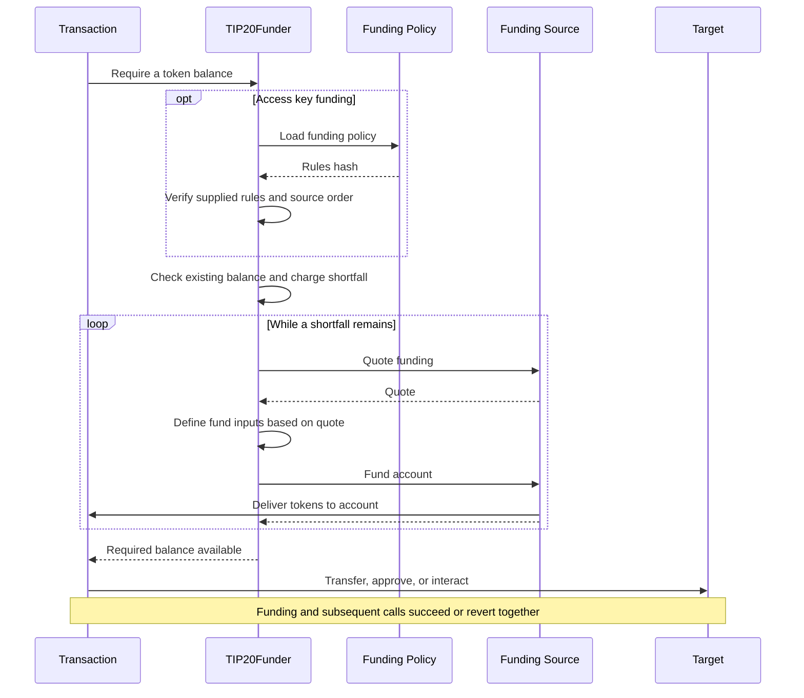
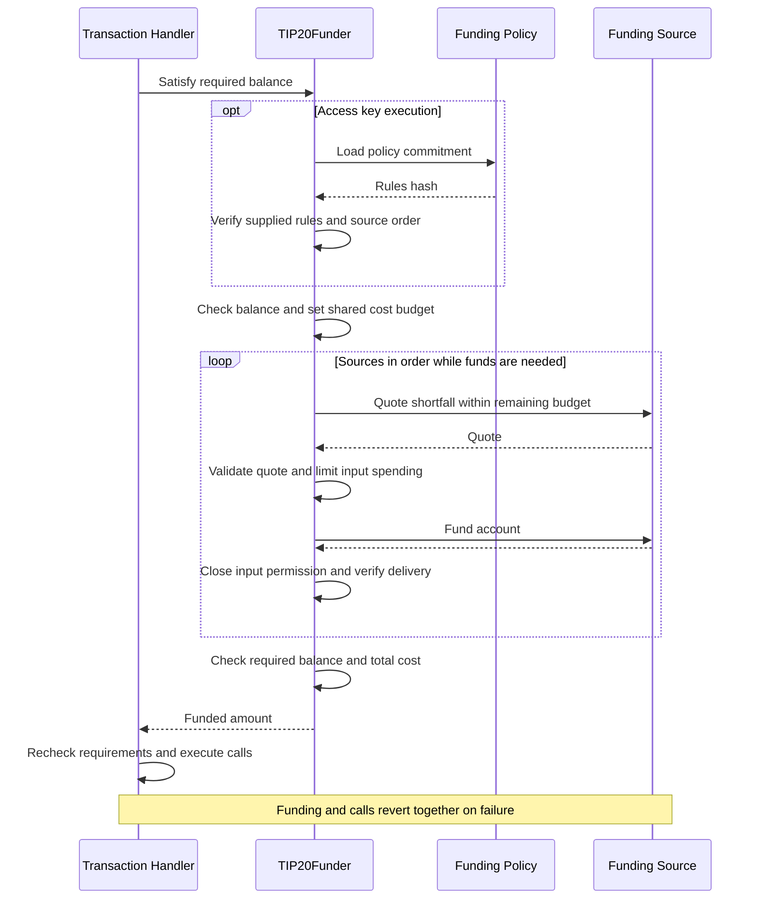

# TIP-1120: TIP-20 Funding Requirements

## Abstract

Introduces `requireFunds`, allowing Tempo transactions to specify the TIP-20 balances needed for application calls. Funding sources obtain missing tokens before those calls execute. Funding and application calls succeed or revert together.

Shared funding policies constrain access key funding and guide discovery of candidate sources.

## Motivation

An account may hold stablecoins, Earn shares, private balances in zones, or assets in another source while a payment requires a different token. Consumers should be able to use those holdings without arranging separate conversions, while owners retain control over access key funding.

Shared policies let owners update funding permissions across multiple access keys and reuse the same rules for route discovery.

## Assumptions

- Funding completes synchronously within the transaction. Asynchronous sources must make funds available beforehand.

- Owners trust policy admins and approved funding sources to enforce conversion and valuation rules.

- Access key funding requires an owner-authorized policy. Policy updates affect every referencing key without resetting spending limits.

## Threat Model

| Actor | Authority and trust |
| --- | --- |
| Owner | Authorizes keys and trusts the selected funding policy’s current and future admins. |
| Funding policy admin | May replace rules or admins, including which sources and upgrades are trusted. |
| Access key and offchain orchestration | May choose adverse inputs, routes, and timing within funding policy bounds; cannot expand authority. |
| Funding source | Trusted to validate source-specific arguments and report correct input bounds and valuations. |
| Protocol | Enforces permissions, input and cost limits, delivery, and rollback. Does not interpret source-specific arguments. |

---

# Specification

`TIP20Funder` checks each required token balance and calls funding sources in order to obtain any shortfall before application calls execute. Funding policy rules constrain access key funding; owner-authorized funding uses the signed request’s bounds.



## Tempo Transaction

Tempo transactions MAY include a signed `requireFunds` array, processed in order before `calls`. Each entry specifies a target balance, including existing funds, and has a separate cost budget. Repeated tokens specify target balances, not additional amounts.

Every requested balance MUST be satisfied before application calls begin. Funding and calls share gas, rollback, and credit accounting. Omitted or empty arrays skip funding. Funding cannot pay transaction fees or be initiated through Solidity calls.

```typescript
/** Funding requirements processed in order before application calls. */
type RequireFunds = {
  /** Requested TIP-20 token. */
  token: `0x${string}`
  /** Target balance in token base units, including existing funds. */
  amount: bigint
  /** Canonical ABI-encoded rules required for access key funding. */
  policyRules?: `0x${string}`
  /** Aggregated slippage across routes to accept. */
  slippageBps?: number
  /** Selected sources attempted synchronously in this order. */
  sources: {
    /** Nonempty ABI-encoded concrete request, including any caller input cap, route, quote, or proof. */
    data: `0x${string}`
    /** Contract or precompile implementing IFundingSource. */
    target: `0x${string}`
  }[]
}[]
```

### Encoding

For nonempty `requireFunds`, the transaction RLP has this layout, with earlier fields omitted:

```text
[
  ...,
  keyAuthorization,  // Empty RLP string if absent.
  requireFunds,
  senderSignature,
]

requireFunds = [requirement, ...]
requirement  = [token, amount, sources, slippage]
             | [token, amount, sources, slippage, policyRules]
sources      = [[target, data], ...]
slippage     = []               // Omitted.
             | [slippageBps]    // Supplied, including zero.
```

Sender and fee-payer signatures cover the complete `requireFunds` array. Omitting funding preserves existing transaction encoding.

Decoding MUST reject slippage above 10,000 bps, an encoded empty funding list, or an empty key-authorization placeholder without funding. Existing transaction validity and fee rules apply.

### Policy rules

Funding policies store only a hash of their rules to reduce storage costs. Each funding requirement supplies the full rules so the protocol can verify and apply them.

`policyRules` are only required for transactions executed by access keys. `requireFunds` MUST include the complete `policyRules = abi.encode(rules)`, including when creating a funding policy inline. The protocol verifies these rules against the stored commitment before checking balances.

Omission adds no field. Explicitly empty values MUST be rejected, and owner-authorized requirements MUST omit it.

### Example

Require 50 USDC using up to 30 USDC.e, then OUSD for the remaining shortfall. The funding policy must approve both inputs.

```typescript
{
  calls: [{ data: 'transfer(recipient, 50)', to: USDC }],
  requireFunds: [{
    token: USDC,
    amount: 50_000_000n,
    policyRules: abi.encode(rules), // Required for access key execution.
    sources: [
      { data: encode({ maxAmountIn: 30_000_000n, tokenIn: USDC_E }), target: DEX_SOURCE },
      { data: encode({ tokenIn: OUSD }), target: DEX_SOURCE },
    ],
  }],
}
```

## Access Keys

Owners enable access key funding through `keyAuthorization.fundingPolicy`, referencing an existing funding policy or creating one inline. The key stores the resolved policy ID.

### Encoding

Optional `fundingPolicy` follows `account` in the signed key-authorization RLP. Omission preserves existing bytes; missing earlier optional fields use empty-string placeholders.

```text
[
  chainId,
  keyType,
  keyId,
  expiry,
  limits,
  allowedCalls,
  witness,
  isAdmin,
  account,
  fundingPolicy,
]

fundingPolicy = policyId        // Nonzero uint64.
              | [admins, rules] // Inline policy creation.
rules         = [maxSlippageBps, routes]
routes        = [[token, sources], ...]
sources       = [[target, config], ...]
```

### Example

Reference a policy that already exists, using its precompile-assigned ID:

```javascript
{
  keyAuthorization: {
    allowedCalls: [{
      selectorRules: [{ selector: TIP20.transfer.selector }],
      target: USDC,
    }],
    fundingPolicy: fundingPolicyId,
    limits: [{ token: USDC, limit: 50, period: 30days }],
    // ...
  },
}
```

Or create a policy while authorizing the key:

```typescript
{
  keyAuthorization: {
    fundingPolicy: {
      admins: [self],
      rules: {
        maxSlippageBps: 100,
        sources: {
          [USDC]: [
            { config: encode({ maxAmountIn: 30_000_000n, tokenIn: USDC_E }), target: DEX_SOURCE },
            { config: encode({ tokenIn: OUSD }), target: DEX_SOURCE },
          ],
        },
      },
    },
    // ...
  },
}
```

### Access key installation

Inline funding policies via `keyAuthorization.fundingPolicy` on the Tempo Transaction are created during owner-authorized access key installation using `createPolicy` validation. The protocol assigns an ID, stores it on the access key, and emits `PolicyCreated` with the owner as updater. Creation and installation MUST succeed or revert together.

Referenced funding policy IDs MUST exist. Access key authorization validity and replay checks MUST run before creation. Reprocessing an installed authorization MUST NOT create another funding policy. This installation path grants no permission for access key calls to create or modify funding policies.

Consumers retrieve the ID from `PolicyCreated` or the access key authorization getter, which MUST expose `fundingPolicyId`. Subsequent funding reuses that ID.

## Funding Policy Precompile

`FundingPolicy` stores admins and a hash of funding rules: allowed sources by output token and maximum aggregate slippage. Multiple accounts and access keys may share a funding policy.

Funding policies constrain access key funding and guide route discovery. Owner-authorized transactions may discover using source configurations without a stored policy, or use a policy without binding execution to it. Discovery grants no spending authority.

### Interface

```solidity
interface IFundingPolicy {
    struct Source {
        address target;
        bytes config;
    }

    struct Route {
        address token;
        Source[] sources;
    }

    struct Rules {
        uint16 maxSlippageBps;
        Route[] routes;
    }

    struct Policy {
        address[] admins;
        bytes32 rulesHash;
    }

    error PolicyNotFound();
    error Unauthorized();
    error InvalidPolicy();
    error InvalidPolicyData();
    error TokenNotAllowed(address token);

    function policyIdCounter() external view returns (uint64);
    function policyExists(uint64 policyId) external view returns (bool);
    function createPolicy(address[] calldata admins, Rules calldata rules) external returns (uint64 policyId);
    function getPolicy(uint64 policyId) external view returns (Policy memory policy);
    function setRules(uint64 policyId, Rules calldata rules) external;
    function setAdmins(uint64 policyId, address[] calldata admins) external;

    event PolicyCreated(uint64 indexed policyId, address indexed updater, bytes32 rulesHash, Rules rules);
    event PolicyRulesUpdated(uint64 indexed policyId, address indexed updater, bytes32 rulesHash, Rules rules);
    event PolicyAdminsUpdated(uint64 indexed policyId, address indexed updater, address[] admins);
}
```

Within a funding policy, `Source.config` defines approved inputs and routes. In `requireFunds`, source `data` describes a concrete funding request.

### Example

Each entry approves a funding path and optional input cap. Entries may share a source address; their order sets path priority.

```typescript
// Illustrative call to the precompile binding; returns a precompile-assigned ID.
const policyId = await fundingPolicy.createPolicy({
  admins: [OWNER, POLICY_MANAGER],
  rules: {
    maxSlippageBps: 100,
    sources: {
      [EURC]: [
        { config: encode({ tokenIn: OTHER_EUR_TOKEN }), target: DEX_SOURCE },
        // Future non-parity support; the pool determines the input token.
        { config: encode({ pool: OUSD_EURC_POOL }), target: PROPAMM_SOURCE },
      ],
      [OUSD]: [
        { config: encode({ tokenIn: USDC_E }), target: DEX_SOURCE },
        { config: encode({ tokenIn: USDC }), target: DEX_SOURCE },
        { config: encode({ vault: MY_VAULT }), target: EARN_SOURCE },
      ],
    },
  },
})
```

Matching currency metadata alone does not establish parity. The propAMM conversion requires the reference valuation described under [Non-Parity Tokens](#non-parity-tokens).

### Rules commitment (`rulesHash`)

`createPolicy` and `setRules` validate `Rules` and compute `rulesHash` below. `getPolicy` returns admins and the hash. Creation and rule-update events emit the full rules, which consumers encode as `policyRules`.

```solidity
bytes32 constant RULES_DOMAIN = keccak256("tempo.funding-policy.rules.v1");
bytes memory rulesData = abi.encode(rules);
bytes32 rulesHash = keccak256(abi.encode(RULES_DOMAIN, rulesData));
```

The hash excludes admins and the funding policy ID. Identical rules produce identical hashes, but access key authorization remains bound to a specific funding policy ID. Admin changes preserve the hash.

### Rule state

Consumers retrieve rules from creation or update events, an indexer, or another offchain source. Access key execution and discovery with a `policyId` require supplied rules to match the funding policy’s current `rulesHash`.


### Source selection

Before checking balances, find the requested token in the verified funding policy rules or revert with `TokenNotAllowed`. Match every supplied request, including when the required balance is already satisfied.

1. Start at position zero in that token’s source list.
2. Select the first entry at or after that position whose target matches and whose `verify(request.data, entry.config)` returns true. Otherwise, revert with `FundingNotAuthorized`.
3. Retain the matched position for the next request. Entries may be skipped or reused; matching never moves backward or combines rules.

Use the same verified rules throughout funding. Pass each matched entry’s rules to `quote`, which revalidates permissions before funding.

## TIP-20 Funder Precompile

`TIP20Funder` obtains required token balances before application calls by invoking funding sources within authorized input and cost limits.

### Interface

The interface defines funding types, errors, and events; `requireFunds` is an internal protocol operation and is not exposed in the Solidity ABI.

```solidity
interface ITIP20Funder {
    struct Source {
        address target;
        bytes data;
    }

    error InvalidFundingContext();
    error InvalidAsset(address asset);
    error TokenNotAllowed(address token);
    error FundingNotAuthorized(address source);
    error InvalidSourceOrder();
    error InvalidFundingQuote(address source);
    error InputLimitExceeded(address source, uint256 limit, uint256 attempted);
    error UnexpectedFundingAmount(address source, uint256 maximum, uint256 received);
    error InsufficientFunding(uint256 required, uint256 available);

    /// @notice A positive contribution verified against actual input debits and output delivery.
    /// @param requestHash Hash of the original source call data signed by the transaction sender.
    event SourceFunded(
        address indexed account, address indexed assetOut, address indexed source,
        bytes32 requestHash, address assetIn, uint256 amountIn, uint256 amountOut
    );

    event FundsRequired(
        address indexed account, address indexed key, address indexed asset,
        uint256 requiredAmount, uint256 fundedAmount
    );
}
```

### Address

`TIP20Funder` uses `0x1120000000000000000000000000000000000000` as its protocol caller and accounting identity. This assignment is subject to protocol review before network activation.

### Execution rules

Only the transaction handler may invoke `TIP20Funder.requireFunds`; EVM calls cannot initiate funding. Source hooks execute through ordinary EVM frames: `STATICCALL` for `verify` and `quote`, and `CALL` for `fund`. Funding and application calls share gas and rollback.

#### Caller identity

During funding, source hooks receive `TIP20_FUNDER` as `msg.sender` and the transaction sender as `tx.origin`. Transactions, deployed code, and delegated code MUST NOT originate calls from `TIP20_FUNDER`.

`fund` MUST reject other callers. Read-only hooks remain directly callable.


## Funding Sources

A funding source is a contract or precompile implementing `IFundingSource`. It validates funding requests, quotes input limits, and delivers tokens synchronously. It can integrate existing tokens and vaults without requiring them to implement this interface.

### Interface

```solidity
interface IFundingSource {
    struct Candidate {
        bytes data;
        uint256 availableAmount;
    }

    struct Quote {
        address assetIn;
        uint256 rate;
        uint256 maxAmountIn;
        uint256 amountOut;
        bytes data;
    }

    /// @notice Whether any configured path supports the requested output token, independent of balances and liquidity.
    /// @param config Source-specific rules or owner-selected configuration.
    function supportsToken(address token, bytes calldata config) external view returns (bool);

    /// @notice Whether a concrete request satisfies this policy entry's permissions.
    function verify(bytes calldata data, bytes calldata config) external view returns (bool);

    /// @notice Find concrete funding options and estimate their available output.
    /// @param amountOut Output ceiling per candidate in requested-token base units.
    /// @param maxCost Normalized input-cost ceiling per candidate in requested-token base units.
    /// @param config Source-specific input rules or owner-selected candidate configuration.
    function discover(
        address account,
        address assetOut,
        uint256 amountOut,
        uint256 maxCost,
        bytes calldata config
    ) external view returns (Candidate[] memory candidates);

    /// @notice Quote one concrete funding request without granting input authority.
    /// @param account Input owner and output recipient to simulate.
    /// @param assetOut Requested TIP-20 token.
    /// @param amountOut Output ceiling; uint256.max requests maximum availability.
    /// @param maxCost Normalized input-cost ceiling in requested-token base units.
    /// @param data Nonempty concrete request with caller caps.
    /// @param config Approved source rules; empty for owner-authorized execution.
    /// @param ownerAuthorized Quote owner-authorized execution rather than policy-restricted execution.
    function quote(
        address account,
        address assetOut,
        uint256 amountOut,
        uint256 maxCost,
        bytes calldata data,
        bytes calldata config,
        bool ownerAuthorized
    ) external view returns (Quote memory result);

    /// @notice Deliver up to amountOut of assetOut to account, synchronously.
    /// @param account Authenticated input owner and output recipient.
    /// @param amountOut Maximum output contribution in requested-token base units.
    /// @param data Prepared execution payload returned by this source's quote hook.
    /// @dev Only TIP20Funder may call, within the prepared native input permission.
    function fund(address account, address assetOut, uint256 amountOut, bytes calldata data) external;
}
```

### Source calls

Immediately before funding, `TIP20Funder` calls `quote` with the authenticated account and funding policy rules, then passes `quote.data` unchanged to `fund`.

The protocol binds the quoted input limits to that account, output token, source, and invocation. Caller-supplied quotes cannot replace this execution-time quote or authorize spending.

### Request verification

`verify` checks whether a request satisfies a funding policy entry’s permissions. It grants no spending authority.

- A well-formed mismatch returns false. Malformed data, invalid return data, and unexpected errors MUST revert.
- Each attempted match uses `STATICCALL` and consumes transaction gas. Verification MUST depend only on supplied data, with no input permission.
- `quote` MUST revalidate matched permissions and bound input access. Owner-authorized funding skips funding policy matching.
- An omitted request cap means `uint256.max`; verification fails unless the funding policy permits that value.
- Funding policy input caps apply per invocation. Repeated calls remain subject to the shared cost budget and access key output limits.

### Token support

`supportsToken` reports whether `config` permits a supported path to the requested output token, regardless of balances or liquidity. No supported path returns false; malformed configurations MUST revert.

Anyone may call it. The result grants no authority or delivery guarantee; `discover` checks availability, while `quote` and `fund` validate execution.

### Funding Discovery

`discover` returns ordered candidates with reusable request data and independent output estimates, limited to paths permitted by `config`.

- Each candidate MUST include nonempty `data` and `availableAmount` in output-token base units.
- Discovery MUST use the same validation, valuation, liquidity checks, and input limits as `quote`, respecting `amountOut` and `maxCost`.
- Omit zero-output candidates; return an empty array when none remain.

### Quoting

`quote` estimates additional output and returns input bounds for a concrete funding request. Anyone may call it; quoting grants no spending authority.

Output is limited by `amountOut`, available inputs, synchronous liquidity, caller and funding policy caps, and `maxCost`. Existing output balances are excluded. Valid requests with no capacity return zero `amountOut`; unsupported or malformed requests MUST revert.

#### Request data

`Quote.data` MUST be nonempty and accepted by both `quote` and `fund`. Consumers copy it into `requireFunds.sources[].data`. Re-quoting MUST preserve the selected input, path, and proofs, and preserve or tighten caller restrictions.

#### Quote authorization

The protocol derives quote authorization from authenticated context:

| Execution | `config` | `ownerAuthorized` |
| --- | --- | --- |
| Access key | Matched funding policy entry’s rules | `false` |
| Owner-authorized | Empty | `true` |

Owner-authorized funding uses the signed request data. Supplying these arguments to a read-only quote grants no spending authority.

#### Execution-time quoting

- Quotes MUST NOT modify state, reserve liquidity, consume proofs, or open input permissions. Every transaction source MUST contain nonempty request data, checked before the balance shortcut.
- Before funding, re-quote each request against the remaining shortfall and cost budget, validate its bounds, and pass its `data` to `fund`.
- Independent quotes MUST NOT be summed: they may share inputs or liquidity. Combined availability requires sequential simulation. Execution verifies actual delivery and cost; quotes guarantee neither delivery nor access key authorization.

### Validation and data

Both execution modes MUST validate supported assets, venues, and configurations during quoting. Checks requiring the authenticated account or contribution amount MUST run in `fund` before spending.

#### Input bounds

`quote.maxAmountIn` MUST be the minimum of the caller cap, funding policy caps, and input capacity allowed by `maxCost`. `quote.data` carries this bound and validated execution arguments.

Preserve account- and amount-bound authorizations. The quote MUST NOT expand caller or funding policy authority; the protocol fixes the output token.

#### Source encodings

Policy and call encodings belong to the funding source. A native DEX funding source may decode `{ maxAmountIn, tokenIn }`; an Earn funding source may decode `{ vault, maxAmountIn }`. Quotes or proofs may appear in the same payload.

The protocol does not parse these fields: it independently meters debits against the returned quote and shared budget.

#### Signed quotes and proofs

Signed quotes and proofs used to authorize funding MUST be bound to the approved route and applicable account, asset, amount, and authorization domain. Funding sources MUST enforce their required signatures, expiry, and replay protection.

`fund` MUST check account- and amount-bound proofs against its authenticated arguments before any input debit or external funding action. Stateful proof consumption happens during `fund` and follows transaction rollback. Runtime data MUST NOT replace approved inputs, venues, or signers.

### Input valuation

Input valuation converts original-input consumption into requested-token units. `quote.rate` expresses requested-token base units per input base unit, scaled by `1e18` and rounded up.

The rate MUST use approved reference accounting, independent of execution quotes, without hiding fees or losses. Unsupported or unavailable valuation MUST revert.

#### Cost calculation

```text
authorizedCap = floor(remainingCostBudget * 1e18 / quote.rate)
inputCost = ceil(cumulativeAmountIn * quote.rate / 1e18)
```

- For nonzero input assets, reject zero rates, `quote.maxAmountIn > authorizedCap`, or `quote.amountOut` above the requested ceiling. Fix the input asset, rate, and cap for the invocation.
- Use full-precision arithmetic; clamp `authorizedCap` to `uint256.max`. Other unrepresentable results MUST revert.
- Charge each gross input debit’s increase in cumulative cost. Refunds restore neither input capacity nor budget; intermediate conversions MUST NOT count the same original input twice.

With equal decimals, `rate = 2e18` values one Earn share at 2 USDC; spending four shares consumes 8 USDC of the budget.

### Funding without account inputs

A source may use its own liquidity or redeem a validated withdrawal without debiting account inputs. Only `(assetIn, rate, maxAmountIn) = (address(0), 0, 0)` identifies this mode; other zero-input combinations MUST revert.

Delivery checks, output spending charges, and funding credit still apply. External fees and debt are outside account-input cost accounting and MUST be bounded by the source’s approved rules and authorization.

### Funding input authority

Before `fund`, the protocol creates temporary input permission scoped to the source’s call frame and descendants. It records the account, source, input asset, and quoted input cap. Only protocol code may create or modify it.

- **Debits:** Each original account-input debit MUST verify the account and input asset, then reduce remaining input capacity and cost budget before moving assets. Exceeding either bound MUST revert. Zero-input quotes authorize no debit.
- **Checks:** Supported transfers, DEX debits, and Earn share burns use this permission instead of allowances. They MUST NOT separately check or deduct input-token access key limits. Access key validity, token pause, and transfer policies remain enforced. No standing allowance is created.
- **Lifetime:** Only the transaction handler may open permission. Close it before the next source or application calls; reverts clear it. Source callbacks cannot initiate nested funding. Closing permission does not modify the access key or funding policy.
- **Rollback:** Permission, input movements, credit retirement, and cost counters share the EVM revert journal.

#### Permission pseudocode

The following Solidity-style pseudocode describes node-internal operations, not a new public debit API:

```solidity
// Open a journaled permission bound to the source call frame and its descendants.
require(!hasActiveFunding());
openInputPermission(account, request.target, quote, remainingCostBudget);
IFundingSource(request.target).fund(account, assetOut, amountOut, quote.data);
(uint256 amountIn, uint256 inputCost) = closeInputPermission();
// Reverts roll back the permission, transfers, credit, and counters together.

// Runs before each original-input debit in a supported token, DEX, or vault path.
function meterFundingDebit(address owner, address token, uint256 amount) internal {
    require(frameBelongsTo(activeFunding));
    require(owner == activeFunding.account);
    require(token == activeFunding.assetIn && token != address(0));
    require(amount <= activeFunding.remainingInput);
    checkKeyAndTokenPolicies(owner, token);

    uint256 newAmountIn = activeFunding.amountIn + amount;
    uint256 newInputCost = mulDivUp(newAmountIn, activeFunding.rate, 1e18);
    uint256 cost = newInputCost - activeFunding.inputCost;
    require(cost <= remainingCostBudget);
    activeFunding.remainingInput -= amount;
    remainingCostBudget -= cost;
    activeFunding.amountIn = newAmountIn;
    activeFunding.inputCost = newInputCost;
    // The calling token, DEX, or vault path now performs the metered debit or burn.
}
```

## Sourcing Funds

Sources execute in order until the target balance is satisfied, sharing one cost budget. Existing balances count toward the target; access key funding charges only the initial shortfall against the requested token’s spending limit.

Partial or zero contributions continue to the next source. Unexpected errors revert funding without trying later sources.



### Execution pseudocode

The Solidity-style example describes protocol-only precompile logic invoked by the transaction handler. Context, EVM callback execution, permission, and accounting helpers are illustrative, not public contract APIs.

```solidity
// Protocol pseudocode, not a Solidity-callable ABI.
function requireFunds(address token, uint256 amount, Source[] calldata sources)
    internal returns (uint256 fundedAmount)
{
    // Reuse rules verified by the handler; token lookup rejects absent tokens.
    FundingContext memory ctx = validateAndResolveFunding(token, sources);
    for (uint256 i; i < sources.length; ++i) require(sources[i].data.length > 0);
    bytes[] memory matchedConfigs = new bytes[](sources.length);
    if (ctx.isAccessKey) {
        IFundingPolicy.Source[] memory entries = requireTokenSources(ctx.rules.routes, token);
        uint256 position;
        for (uint256 i; i < sources.length; ++i) {
            Source calldata request = sources[i];
            bool matched;
            for (uint256 j = position; j < entries.length; ++j) {
                if (entries[j].target != request.target) continue;
                // Protocol STATICCALL; only false permits trying another entry.
                if (!IFundingSource(request.target).verify(request.data, entries[j].config)) continue;
                matchedConfigs[i] = entries[j].config;
                position = j;
                matched = true;
                break;
            }
            if (!matched) revert FundingNotAuthorized(request.target);
        }
    }
    uint256 balance = TIP20(token).balanceOf(ctx.account);
    if (balance >= amount) {
        emit FundsRequired(ctx.account, ctx.key, token, amount, 0);
        return 0;
    }

    uint256 shortfall = amount - balance;
    if (ctx.isAccessKey) chargeOutputBudget(ctx, token, shortfall);
    uint256 costBudget = mulDiv(shortfall, 10_000 + ctx.slippageBps, 10_000);
    uint256 totalCost;

    for (uint256 i; i < sources.length && balance < amount; ++i) {
        Source calldata request = sources[i];
        bytes memory config = matchedConfigs[i];
        IFundingSource.Quote memory quote = IFundingSource(request.target).quote(
            ctx.account, token, amount - balance, costBudget - totalCost, request.data, config, !ctx.isAccessKey
        );
        validateQuote(quote, amount - balance, costBudget - totalCost);

        // Native permission meters original inputs and cost; reverts clear it through the journal.
        openInputPermission(ctx, request.target, quote, costBudget - totalCost);
        IFundingSource(request.target).fund(ctx.account, token, amount - balance, quote.data);
        (uint256 amountIn, uint256 inputCost) = closeInputPermission();
        totalCost += inputCost;

        uint256 newBalance = TIP20(token).balanceOf(ctx.account);
        require(newBalance >= balance);
        uint256 amountOut = newBalance - balance;
        require(amountOut <= amount - balance);
        require(amountOut > 0 || amountIn == 0);
        if (amountOut > 0) {
            if (ctx.isAccessKey) addFundingCredit(ctx, token, amountOut);
            emit SourceFunded(
                ctx.account, token, request.target,
                keccak256(request.data), quote.assetIn, amountIn, amountOut
            );
        }
        fundedAmount += amountOut;
        balance = newBalance;
    }

    if (balance < amount) revert InsufficientFunding(amount, balance);
    require(totalCost <= costBudget);
    emit FundsRequired(ctx.account, ctx.key, token, amount, fundedAmount);
    return fundedAmount;
}
```

### Contribution and delivery

A source MUST supply as much of the shortfall as available inputs, synchronous liquidity, and approved caps permit. Zero delivery MUST consume no account inputs. The protocol measures delivery from balance changes, never source-reported output.

## Discovering Funds

Before signing, consumers call `FundingDiscovery.discover` to find candidates for a target balance. Policy-free discovery accepts ordered source configurations and slippage directly. The policy-ID overload accepts complete rules and verifies their commitment. Neither moves funds or grants spending authority.

```mermaid
sequenceDiagram
    participant C as Consumer
    participant P as Funding Discovery
    participant R as Funding Policy
    participant F as Funding Source

    C->>P: Discover with sources or policy rules
    opt Policy ID supplied
        P->>R: Read policy commitment
        R-->>P: Rules hash
        P->>P: Verify rules commitment
    end
    P->>P: Resolve sources and slippage; calculate shortfall
    opt Funds are needed
        loop Sources in configured order
            P->>F: Discover with config and same cost budget
            F-->>P: Request data and output estimates
        end
    end
    P-->>C: Ordered candidates and supplied slippage
    Note over C,F: Read-only estimates. No funds moved or reserved.
```

### Funding Discovery

`FundingDiscovery` is a protocol-deployed Solidity contract at `0x1120000000000000000000000000000000000003`, executed by the ordinary EVM. The overload with `policyId` reads commitments from the separate Funding Policy precompile.

#### Interface

```solidity
/// @notice Discover funding candidates without moving funds or granting spending authority.
interface IFundingDiscovery {
    struct Source {
        address target;
        bytes data;
        uint256 availableAmount;
    }

    struct Discovery {
        address token;
        uint256 amount;
        uint16 slippageBps;
        Source[] sources;
    }

    error InvalidPolicyData();
    error InvalidCandidate(address source);
    error InvalidSlippage();

    /// @notice Discover funding candidates and verify supplied rules against a stored funding policy.
    /// @dev Checks the commitment and token route even when the balance already suffices; does not check access key permissions or limits.
    function discover(
        address account,
        address token,
        uint256 amount,
        uint64 policyId,
        bytes calldata rules
    ) external view returns (Discovery memory discovery);

    /// @notice Discover funding candidates using explicit source configurations without a stored policy.
    function discover(
        address account,
        address token,
        uint256 amount,
        uint16 slippageBps,
        IFundingPolicy.Source[] calldata sources
    ) external view returns (Discovery memory discovery);
}
```

#### Deployment

At `T<n>` activation, install the discovery runtime at its assigned address, preserving balance and storage. Genesis configurations with `T<n>` active include the same runtime. No deployment transaction, constructor, or admin is required.

The overload with `policyId` reads Funding Policy at `0x1120000000000000000000000000000000000002`. Source discovery uses ordinary EVM static calls with Funding Discovery as `msg.sender`, including normal gas and rollback rules.

#### Discovery behavior

Anyone may call either overload; neither authenticates the account owner or checks access key limits. Both return the token, target amount, effective slippage, and ordered candidates without granting authority.

The policy-free overload accepts ordered `{ target, config }` sources for the requested token and `slippageBps`. It requires no token-keyed routes, stored policy, or commitment. An empty source list returns no candidates.

The policy-ID overload accepts canonical ABI-encoded `IFundingPolicy.Rules`. It verifies the stored commitment, selects the token’s sources, and uses `maxSlippageBps` as the effective slippage.

1. Before checking balances, reject effective slippage above 10,000 with `InvalidSlippage`. The policy-ID overload also rejects missing policies with `PolicyNotFound`, invalid or noncanonical rules and commitment mismatches with `InvalidPolicyData`, and absent tokens with `TokenNotAllowed`.
2. Return no sources if the balance suffices; otherwise calculate the shortfall and cost budget.
3. Call every selected entry’s `discover` via `STATICCALL`, including repeated targets, using identical bounds and that entry’s `config`. Propagate failures; require nonempty `data` and `0 < availableAmount <= shortfall`. Do not re-quote candidates.

#### Discovery results

- Preserve supplied source entry and candidate order; do not deduplicate targets. Each request MUST pass its entry’s `verify`, or revert with `InvalidCandidate`.
- Return `target`, `data`, and `availableAmount`. Estimates are independent: do not sum them, reduce later budgets, or stop when estimates cover the shortfall.
- Copy `target` and `data` into `requireFunds[].sources`, omitting `availableAmount`. Simulate selected candidates sequentially because inputs and liquidity may overlap. Owner-authorized execution does not require the discovery funding policy.

### Example

Discover funding sources and verify the supplied rules against a stored funding policy:

```solidity
IFundingDiscovery.Discovery memory discovery = fundingDiscovery.discover(
    account,
    USDC,
    50_000_000,
    policyId,
    abi.encode(rules)
);

IFundingDiscovery.Source[] memory candidates = discovery.sources;
```

Discover candidates using source configurations without a stored policy.

```solidity
IFundingPolicy.Source[] memory sources = new IFundingPolicy.Source[](1);
sources[0] = IFundingPolicy.Source({
    target: DEX_SOURCE,
    config: abi.encode(USDC_E, type(uint256).max)
});

IFundingDiscovery.Discovery memory discovery = fundingDiscovery.discover(
    account,
    USDC,
    50_000_000,
    100, // 1% aggregate slippage.
    sources
);

IFundingDiscovery.Source[] memory candidates = discovery.sources;
```

### Using candidates

Construct each requirement with the requested token, target amount, returned slippage, and selected candidates. Discovery reserves no funds and guarantees no delivery. Regardless of the discovery overload, access key execution still requires complete `policyRules` matching its stored funding policy and validates source order, spending limits, and fresh quotes.

## Funding Source Examples

Native DEX and Earn examples illustrate parity funding using Solidity-style pseudocode. Helpers represent proposed integration logic, not existing public APIs; routine validation is omitted.

Decoders map omitted `maxAmountIn` to `uint256.max`; zero permits no debit. Input-capacity calculations use full-precision, saturating arithmetic. Rates normalize decimals and round up; contributions remain bounded by available inputs, liquidity, and the quoted cap.

### Native DEX

The native DEX funding source uses `0x1120000000000000000000000000000000000001`. This assignment is subject to protocol review before network activation.

Source `config` approves one `tokenIn` and optional `maxAmountIn`. Requests select that input within the cap. The source validates parity support and swaps with the authenticated account as both input owner and output recipient.

```solidity
function verify(bytes calldata data, bytes calldata config) external pure returns (bool) {
    DexRequest memory request = decodeDexCall(data);
    DexConfig memory settings = decodeDexConfig(config);
    return request.tokenIn == settings.tokenIn && request.maxAmountIn <= settings.maxAmountIn;
}

function discover(
    address account,
    address assetOut,
    uint256 amountOut,
    uint256 maxCost,
    bytes calldata config
) external view returns (Candidate[] memory candidates) {
    DexConfig memory settings = decodeDexConfig(config);
    if (settings.tokenIn == assetOut || TIP20(settings.tokenIn).balanceOf(account) == 0) return new Candidate[](0);
    Quote memory result = this.quote(
        account, assetOut, amountOut, maxCost,
        abi.encode(settings.tokenIn, settings.maxAmountIn), config, false
    );
    if (result.amountOut == 0) return new Candidate[](0);
    candidates = new Candidate[](1);
    candidates[0] = Candidate(result.data, result.amountOut);
}

function quote(
    address account,
    address assetOut,
    uint256 amountOut,
    uint256 maxCost,
    bytes calldata data,
    bytes calldata config,
    bool ownerAuthorized
) external view returns (Quote memory) {
    DexRequest memory request = decodeDexCall(data);
    if (!ownerAuthorized) {
        require(this.verify(data, config));
    }
    validateParityRoute(request.tokenIn, assetOut);
    uint256 rate = parityRate(request.tokenIn, assetOut);
    uint256 cap = min(request.maxAmountIn, inputCapacity(maxCost, rate));
    uint256 available = maxExecutableOutput(account, request.tokenIn, assetOut, amountOut, cap);
    return Quote(request.tokenIn, rate, cap, available, abi.encode(request.tokenIn, cap));
}

function fund(address account, address assetOut, uint256 amountOut, bytes calldata data) external {
    require(msg.sender == TIP20_FUNDER);
    (address tokenIn, uint256 cap) = abi.decode(data, (address, uint256));
    uint256 contribution = maxExecutableOutput(account, tokenIn, assetOut, amountOut, cap);
    if (contribution == 0) return;
    // Proposed native integration uses the account as input owner and output recipient.
    nativeSwapExactAmountOut(account, tokenIn, assetOut, contribution, cap);
}
```

### Earn Shares

The Earn source redeems an approved vault’s shares, optionally swapping into the requested token. Source `config` specifies one `vault` and optional share-input cap. Requests MUST respect that cap; quoting authenticates the vault and supported engine configuration.

Value shares using canonical managed backing before redemption fees or execution losses and share supply after pending fee dilution. Cap shares by the remaining aggregate budget.

```solidity
function verify(bytes calldata data, bytes calldata config) external pure returns (bool) {
    EarnRequest memory request = decodeEarnCall(data);
    EarnConfig memory settings = decodeEarnConfig(config);
    return request.vault == settings.vault && request.maxAmountIn <= settings.maxAmountIn;
}

function discover(
    address account,
    address assetOut,
    uint256 amountOut,
    uint256 maxCost,
    bytes calldata config
) external view returns (Candidate[] memory candidates) {
    EarnConfig memory settings = decodeEarnConfig(config);
    if (TIP20(earnShare(settings.vault)).balanceOf(account) == 0) return new Candidate[](0);
    Quote memory result = this.quote(
        account, assetOut, amountOut, maxCost,
        abi.encode(settings.vault, settings.maxAmountIn), config, false
    );
    if (result.amountOut == 0) return new Candidate[](0);
    candidates = new Candidate[](1);
    candidates[0] = Candidate(result.data, result.amountOut);
}

function quote(
    address account,
    address assetOut,
    uint256 amountOut,
    uint256 maxCost,
    bytes calldata data,
    bytes calldata config,
    bool ownerAuthorized
) external view returns (Quote memory) {
    EarnRequest memory request = decodeEarnCall(data);
    if (!ownerAuthorized) {
        require(this.verify(data, config));
    }
    validateVaultAndRoute(request.vault, assetOut);
    (uint256 backingAssets, uint256 shareSupply) = previewBackingAndSupply(request.vault);
    uint256 rate = normalizedShareRate(backingAssets, shareSupply, request.vault, assetOut);
    uint256 cap = min(request.maxAmountIn, inputCapacity(maxCost, rate));
    Redemption memory redemption = quoteFunding(account, request.vault, assetOut, amountOut, cap);
    return Quote(earnShare(request.vault), rate, cap, redemption.amountOut, abi.encode(request.vault, cap));
}

function fund(address account, address assetOut, uint256 amountOut, bytes calldata data) external {
    require(msg.sender == TIP20_FUNDER);
    (address vault, uint256 shareCap) = abi.decode(data, (address, uint256));
    Redemption memory quote = quoteFunding(account, vault, assetOut, amountOut, shareCap);
    if (quote.amountOut == 0) return;
    // Redeem only the underlying required for this contribution, with native share-debit metering.
    uint256 released = redeemFor(account, vault, quote.underlyingAmount, shareCap);
    if (underlying(vault) != assetOut) {
        swapReleasedUnderlying(account, vault, assetOut, quote.amountOut, released);
    }
    returnUnusedIntermediateAssets(account);
}
```


### Non-Parity Tokens

Future [propAMM](https://github.com/tempoxyz/propamm) sources may support non-parity conversions, but require approved reference valuation.

## Owner-Authorized Funding

A root-signed transaction authorizes its selected sources and request data without a funding policy. The protocol derives `ownerAuthorized = true` from authenticated context and supplies empty `config` to `quote`.

```typescript
{
  data: encode({ maxAmountIn: 10_000_000n, vault: MY_VAULT }),
  target: EARN_SOURCE,
}
```

### Owner execution constraints

- Normal quoting, valuation, input limits, delivery, rollback, and token policies apply. Omitted `maxAmountIn` adds no caller cap; the shared cost budget still applies. Slippage defaults to zero.
- Owner-authorized funding neither charges access key budgets nor creates funding credit.
- TIP-20 and integrated Earn paths MUST use native bounded debits to avoid approvals. Other contracts using `transferFrom` still require allowances or integration changes.

## Access Key Accounting

Funding charges the initial shortfall once against the access key’s output-token spending limit, before granting input authority. Verified delivery creates funding credit, preventing subsequent transfers or approvals from charging the same tokens twice.

Sources incur no separate budget charge. Insufficient funding reverts charges and contributions. Existing balances, access key validity, and period resets follow normal accounting.

### Accounting integration

The pseudocode extends the existing [`AccountKeychain` flow](https://github.com/tempoxyz/tempo/blob/25b216a661c2cac72807174583371b582b75c286/crates/precompiles/src/account_keychain/mod.rs#L1353) with proposed internal helpers `addFundingCredit` and `takeFundingCredit`. Credit storage remains open; ellipses omit implementation details.

#### Funding charge

Internal `TIP20Funder.requireFunds` operation, showing budget and credit handling:

```solidity
function requireFunds(/* ... */) internal {
    // ... validate context and calculate initialShortfall; return if already funded.
    if (isAccessKey) keychain.verifyAndUpdateSpending(account, keyId, token, initialShortfall);

    // ... visit sources and measure each contribution within the shared input budget.
    // ... for each positive contribution:
    if (isAccessKey) keychain.addFundingCredit(account, keyId, token, received);

    // ... revert unless the target balance is satisfied within the total cost cap.
}
```

#### Transfer accounting

Changes to existing transfer authorization in `AccountKeychain`:

```solidity
function authorizeTransfer(/* ... */) internal {
    // ... existing key lookup, root key and transaction origin guards.
    uint256 covered = takeFundingCredit(account, keyId, asset, amount);
    // ... if authorized and metered by the active funding permission, validate the key and return.
    verifyAndUpdateSpending(account, keyId, asset, amount - covered);
}
```

#### Approval accounting

Changes to existing approval authorization in `AccountKeychain`:

```solidity
function authorizeApprove(/* ... */) internal {
    // ... existing key lookup, root key and transaction origin guards.
    uint256 approvalIncrease = newApproval > oldApproval ? newApproval - oldApproval : 0;
    if (approvalIncrease > 0) {
        uint256 approvalCovered = takeFundingCredit(account, keyId, asset, approvalIncrease);
        verifyAndUpdateSpending(account, keyId, asset, approvalIncrease - approvalCovered);
        // Pass approvalCovered to the token's approval path for association with the spender.
    }
}
```

### Credit consumption

`takeFundingCredit` consumes up to the requested amount for the account, access key, and token. Fees receive no credit. Spending checks MUST run even when credit covers the full amount.

Bind `approvalCovered` to the spender. Allowance spending consumes approval credit before funding credit; other debits consume funding credit directly. Normal allowance, access key, call-permission, and token-policy checks remain.

### Credit lifetime

Credit follows nested reverts and expires at transaction end. Incoming transfers, refunds, and approval decreases MUST NOT create credit or restore budget. Unspent funds from `requireFunds` remain charged.

## Slippage

Slippage caps aggregate input cost per requirement. A 50 USDC shortfall at 100 bps permits at most 50.50 USDC in normalized input cost.

- Access key `slippageBps` MUST NOT exceed `rules.maxSlippageBps`; omission inherits it. Owner-authorized funding defaults to zero.
- Both values MUST be 0–10,000; explicit zero permits no slippage.
- Compute the budget in requested-token base units using full precision, rounding down. Unrepresentable results MUST revert.

```text
effectiveSlippageBps = requirement.slippageBps ?? (rules.maxSlippageBps if access key else 0)
totalCostCap = floor(initialShortfall * (10_000 + effectiveSlippageBps) / 10_000)
```

Sources may offset gains and losses within the shared budget, while respecting funding policy and caller caps. Existing balances add no budget; unused budgets cannot carry between requirements.

## Tooling

### Relay RPC API

Relays select routes using the access key’s funding policy or, for owner-authorized requests, a consumer-selected funding policy. Relay preferences cannot expand execution authority.

#### `eth_fillTransaction`

`eth_fillTransaction` accepts complete funding requests, target balances, or inference from application calls.

The following pseudo-definition describes the proposed relay extension. `TransactionRequest` represents the existing transaction request fields.

```typescript
/** Funding instructions accepted by eth_fillTransaction. */
type FillRequireFunds =
  /**
   * Preserves the supplied tokens & amounts. Fills funding sources & slippage if unsupplied.
   */
  | Partial<RequireFunds, 'token' | 'amount'>[]

  /**
   * Infers required tokens and target balances from the calls, then selects funding source calls.
   */
  | true

/** Transaction request passed as the first eth_fillTransaction parameter. */
type FillTransactionRequest = TransactionRequest & {
  /** Complete requirements, target balances to fill, or inference from calls. */
  requireFunds?: FillRequireFunds
}
```

##### Filled transaction

The relay returns an unsigned transaction with complete `requireFunds` entries. Access key entries include canonical `policyRules` matching the funding policy commitment, retrieved from events or another data source. Shorthand entries and `true` MUST NOT appear in signed transactions.

Filled requests MUST respect input limits, aggregate slippage, funding policy rules, and source order. Simulation does not replace execution-time checks.

## Observability

- **Funding policy events:** Emit `PolicyCreated`, `PolicyRulesUpdated`, or `PolicyAdminsUpdated` for the corresponding change.
- **`SourceFunded`:** Emit for each positive verified contribution, recording the source, request hash, input asset, gross input, and output. Zero contributions emit nothing; no-input contributions record zero input asset and amount.
- **`FundsRequired`:** Emit once when funding succeeds, with total contributions or zero if the balance already suffices. This confirms funding, not subsequent application-call completion.
- **Accounting:** Preserve native spending, token, vault, and DEX events. Credit-covered consumption MUST NOT emit a second budget deduction. Funding policy state, counters, and events follow transaction rollback; other events follow their state changes’ rollback.

## Invariants

- **Authorization:** Funding uses authenticated owner authority or the access key’s committed funding policy rules. Request data cannot expand that authority.
- **Ordering:** Requests match funding policy entries without moving backward or combining permissions. Funding executes in transaction order.
- **Balances:** Funding delivers only the shortfall, and all required balances hold before application calls. Sufficient balances trigger no `quote` or `fund`, budget charge, or credit.
- **Input limits:** Gross account-input debits remain within the quoted asset, cap, and shared cost budget. Refunds restore neither capacity nor budget.
- **Delivery and valuation:** Measure actual balance changes and input debits. Zero delivery consumes no account inputs; intermediate conversions cannot double-count costs.
- **Access key accounting:** Charge the shortfall once. Credit only verified delivery, scoped to the account, access key, token, and transaction. Preserve spender-bound approval accounting and normal permissions.
- **Isolation:** Only the transaction handler initiates funding. Input permissions end with their invocation; credit expires at transaction end. Fees cannot use funding credit.
- **Atomicity:** Funding, application calls, accounting, and events revert together on failure. Normal fee handling remains unchanged.
