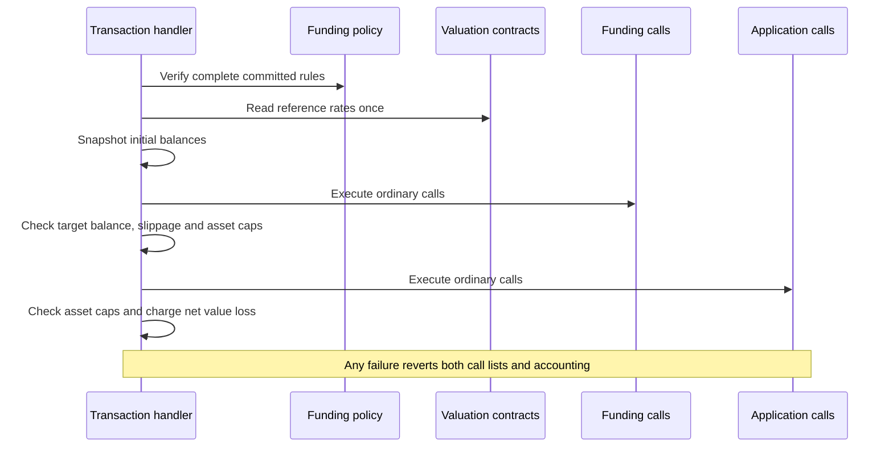

# TIP-1120: TIP-20 Funding Requirements

## Abstract

Introduces funding policies that let access keys spend from approved TIP-20 assets under one token-denominated budget. Transactions execute ordinary funding calls before application calls. The protocol snapshots balances and reference rates, checks funding delivery and conversion loss, then charges the portfolio's net value decrease.

## Motivation

An account may hold stablecoins or Earn shares while a payment requires another token. Owners should be able to approve those assets without granting separate input-token budgets or replacing access keys whenever funding settings change.

Native transaction batching already provides atomic execution. This proposal adds shared funding policies and transaction-level value accounting. Contracts retain withdrawal and swap execution, while the protocol checks actual balance changes without requiring a funding-source interface or per-source quotes.

## Assumptions

- Funding completes synchronously. Asynchronous withdrawals must settle before these transactions can use their proceeds.
- The owner trusts funding policy admins, valuation providers, approved asset implementations, and contracts permitted by the key's call permissions, including their upgrades.
- The budget measures net value lost, including conversion costs. Incoming funds can offset outflows, and temporary asset use can leave no measured loss. This is not a gross payment or debit limit.
- Supported operations must not create unmeasured liabilities or impair remaining backing without corresponding balance changes. Balance snapshots alone cannot establish those properties.

## Threat Model

| Actor | Authority and trust |
| --- | --- |
| Owner | Authorizes a key, its call permissions, budget, and funding policy. |
| Funding policy admin | May replace assets, valuation configuration, caps, slippage, or admins. Cannot change an existing policy's denomination. |
| Access key and relay | May choose adverse calls and timing within granted permissions. Cannot omit policy assets, substitute valuation providers, or increase policy caps. |
| Valuation provider | Trusted to return a valid reference rate from approved onchain accounting. A read-only call does not establish economic correctness. |
| Approved contract | Executes ordinary withdrawals or swaps and enforces its call parameters. Remains responsible for its backing, authority, and liabilities. |
| Protocol | Verifies policy commitments, freezes rates, checks balances and limits, and reverts failed execution. Does not prove solvency or meter gross funding inputs. |

---

# Specification

A transaction contains one funding target and two ordered call lists. The protocol values the complete policy asset set before funding, after funding, and after application calls. All checkpoints use the original rates and balances; application calls cannot restart the accounting window.



## Tempo Transaction

Transactions MAY include `funding` and `fundingPolicyRules`. `funding.amount` is a target balance, including existing cash, rather than an additional amount to obtain. This version supports one target, whose token MUST equal the policy denomination.

```typescript
/** Existing Tempo call encoding and execution semantics. */
type Funding = {
  token: `0x${string}`
  amount: bigint
  /** Omission uses the policy maximum; explicit zero permits no net loss. */
  slippageBps?: number
  calls: Call[]
}

type Transaction = {
  funding?: Funding
  /** Canonical abi.encode(IFundingPolicy.Rules). */
  fundingPolicyRules?: `0x${string}`
  calls: Call[]
  // Existing transaction fields.
}
```

### Execution mode

Funding is opt-in per transaction. Without `funding`, `fundingPolicyRules` MUST be absent and existing accounting applies, even when the access key references a funding policy. With `funding`, complete nonempty rules are required, including when funding calls are empty or cash already satisfies the target.

For an access key, rules MUST match its stored policy ID's current commitment. Owner-authorized transactions supply the same rules directly under their transaction signature, without a stored-policy lookup or access-key budget charge. Both modes enforce valuation, delivery, slippage, and asset caps.

`funding.token` MUST equal `rules.denomination`. All amounts use token base units. `funding.slippageBps` MUST be in 0–10,000 and no greater than `rules.maxSlippageBps`; omission inherits that maximum. A zero target is valid and gives no conversion-loss allowance.

### Calls and authority

Both lists use ordinary Tempo call semantics, sender identity, gas accounting, and atomic rollback. Every call remains subject to the key's normal call permissions. Funding supplies no synthetic caller, allowance bypass, privileged share burn, or new withdrawal authority.

Execute every signed funding call in order, including when the target balance already suffices. Empty funding calls perform only the checkpoints. There is no source selection, automatic fallback, re-quoting, or protocol-initiated nested funding. Call failure reverts execution under normal batch semantics.

### Transaction encoding

With funding, the transaction RLP appends the following fields before `senderSignature`, preserving all preceding fields:

```text
[
  ...,
  keyAuthorization,       // Empty RLP string if absent.
  funding,
  fundingPolicyRules,
  senderSignature,
]

funding = [token, amount, slippage, calls]
slippage = [] | [slippageBps]
```

The nested `calls` use the existing call-list encoding. Sender and fee-payer signatures cover both new fields and both call lists. Without funding, existing bytes are unchanged. Reject missing rules, noncanonical values, out-of-range slippage, and an empty key-authorization placeholder without funding.

Intrinsic calldata costs include both new fields. Existing call-count, transaction-size, and call-permission limits apply to both lists combined. Validation and simulation MUST execute the funding checkpoints; pre-execution balance checks alone cannot establish sufficient funds. Funding cannot supply transaction fees.

This replaces the earlier draft's `requireFunds` wire format. No compatibility with that unactivated draft is required.

### Example

Alice holds 20 OUSD and Earn shares. The relay prepares a withdrawal for 30 OUSD and a 50 OUSD payment. The vault enforces the signed share cap; the protocol separately enforces the owner's net-spend and conversion-loss limits.

```typescript
{
  fundingPolicyRules: abi.encode(rules),
  funding: {
    token: OUSD,
    amount: 50_000_000n,
    slippageBps: 10,
    calls: [{
      to: VAULT,
      data: encodeWithdrawExact(30_000_000n, account, maxShares),
    }],
  },
  calls: [{ to: OUSD, data: encodeTransfer(recipient, 50_000_000n) }],
}
```

## Access Keys

Owners enable funding with `keyAuthorization.fundingPolicy`, either referencing an existing policy or creating one inline. The resolved ID is stored on the key and exposed as `fundingPolicyId` by its authorization getter. Omission grants no funding-policy execution authority.

```typescript
{
  keyAuthorization: {
    fundingPolicy: {
      admins: [owner],
      rules: {
        denomination: OUSD,
        maxSlippageBps: 10,
        assets: [
          { token: OUSD, valuation: ZERO_ADDRESS, valuationData: '0x', maxNetSpend: MAX_UINT256 },
          { token: EARN_SHARES, valuation: EARN_VALUATION, valuationData: encode({ vault: VAULT }), maxNetSpend: SHARE_CAP },
        ],
      },
    },
    limits: [{ token: OUSD, limit: 1_000_000_000n, period: 30 * 24 * 60 * 60 }],
    allowedCalls: permittedWithdrawalsAndTransfers,
    // Existing key fields.
  },
}
```

### Authorization encoding

The optional field follows `account` in the key-authorization RLP. Earlier absent optional fields use empty-string placeholders. The owner's signature covers the complete value, including inline admins, asset order, valuation data, and limits.

```text
fundingPolicy = policyId | [admins, rules]
rules = [denomination, maxSlippageBps, assets]
assets = [[token, valuation, valuationData, maxNetSpend], ...]
```

Existing IDs MUST be nonzero and exist at installation. Inline creation follows `createPolicy` validation and is atomic with installation. Replay and authorization checks precede creation; replaying an installed authorization MUST NOT create another policy. Subsequent transactions reuse the resolved ID.

Access-key installation retains its existing transaction lifecycle. This TIP does not change whether installation survives a later application failure. Funding checkpoints and accounting are inside the application rollback boundary, after installation and normal fee precharge.

## Funding Policy

`FundingPolicy` is a precompile at `0x1120000000000000000000000000000000000002`, subject to protocol review before activation. It stores admins, an immutable denomination, and the commitment to current rules. Multiple accounts and access keys may share one policy without sharing budgets.

```solidity
interface IFundingPolicy {
    struct Asset {
        address token;
        address valuation;
        bytes valuationData;
        uint256 maxNetSpend;
    }

    struct Rules {
        address denomination;
        uint16 maxSlippageBps;
        Asset[] assets;
    }

    struct Policy {
        address[] admins;
        address denomination;
        bytes32 rulesHash;
    }

    error PolicyNotFound();
    error Unauthorized();
    error InvalidPolicyData();
    error InvalidSlippage();
    error DenominationMismatch();

    event PolicyCreated(uint64 indexed policyId, address indexed updater, address[] admins, Rules rules);
    event PolicyRulesUpdated(uint64 indexed policyId, address indexed updater, Rules rules);
    event PolicyAdminsUpdated(uint64 indexed policyId, address indexed updater, address[] admins);

    /// @notice Create validated rules and admins; return a new nonzero ID.
    /// @dev Reverts with InvalidPolicyData or InvalidSlippage for invalid configuration.
    function createPolicy(address[] calldata admins, Rules calldata rules) external returns (uint64 policyId);

    /// @notice Replace rules as a current admin, preserving the denomination and budgets.
    /// @dev Reverts for missing policies, unauthorized callers, invalid rules, or denomination changes.
    function setRules(uint64 policyId, Rules calldata rules) external;

    /// @notice Replace admins as a current admin, without changing rules or budgets.
    /// @dev Reverts with PolicyNotFound, Unauthorized, or InvalidPolicyData.
    function setAdmins(uint64 policyId, address[] calldata admins) external;

    /// @notice Return admins, denomination, and commitment; revert if absent.
    function getPolicy(uint64 policyId) external view returns (Policy memory);
}
```

### Validation and updates

Require 1–16 unique TIP-20 assets and 1–16 unique, nonzero admins. Require `maxSlippageBps <= 10_000`. Exactly one asset MUST be the denomination, with zero valuation address and empty valuation data. Every other asset requires a nonzero valuation contract with code.

`maxNetSpend` is in that asset's base units. Zero prohibits net depletion; `uint256.max` adds no asset-specific cap. It applies separately at the funding and final checkpoints, both relative to the initial balance. These caps reset each transaction; the key's denomination budget persists across transactions.

Any current admin may replace rules or admins, including removing itself. Denomination changes MUST revert. Policy IDs are allocated monotonically from one and never reused; exhaustion reverts. Access-key transactions MUST NOT create or modify policies through calls. Inline owner-authorized installation is the only exception.

### Rules commitment

Store the hash below and the denomination. Creation and update events publish complete rules. Transactions retrieve rules from events or another source and supply their exact canonical ABI encoding. Reject mismatched, malformed, or noncanonical rules before executing either call list.

```solidity
bytes32 constant RULES_DOMAIN = keccak256("tempo.funding-policy.snapshot.v1");
bytes32 rulesHash = keccak256(abi.encode(RULES_DOMAIN, abi.encode(rules)));
```

The commitment excludes admins and policy ID. Asset order is committed and determines valuation call order. Snapshot rules once per execution; policy or provider configuration changes during calls do not replace the frozen accounting context. Admin updates never reset key budgets.

## Valuation

Each approved valuation contract supplies a reference rate before either call list executes. The protocol fixes that rate for all checkpoints. The denomination's rate is exactly `1e18` and requires no external call.

```solidity
interface IValuation {
    /// @notice Reference denomination base units per asset base unit, scaled by 1e18.
    /// @param asset Approved TIP-20 asset being valued.
    /// @param denomination Token in which the spending budget is denominated.
    /// @param data Owner-approved valuation configuration from the committed policy.
    /// @return result Positive reference rate, rounded up to the represented precision.
    /// @dev Revert for unsupported assets, invalid configuration, or unavailable accounting.
    function rate(address asset, address denomination, bytes calldata data)
        external view returns (uint256 result);
}
```

### Reference accounting

A provider MUST authenticate the asset and configuration and value it independently of the transaction's execution quote. It MUST include applicable dilution and exclude redemption fees or execution losses that the conversion-loss check is intended to measure. Token currency metadata alone does not establish parity.

The policy approves the provider and its onchain data sources. Providers MUST enforce their freshness and validity requirements. Zero rates, failed calls, or return data other than one ABI-encoded `uint256` revert execution. There is no transaction-supplied valuation override or fallback rate.

### Call context

The transaction handler invokes each provider using `STATICCALL` with `FundingPolicy` as `msg.sender` and the account as `tx.origin`. Calls use ordinary EVM access costs, memory charges, EIP-150 forwarding, and transaction gas, capped at 100,000 forwarded gas per provider. Failures are fatal.

After all rates are read, snapshot every policy asset's account balance through native TIP-20 balance reads. Repeat those reads at both checkpoints. Charge normal native read costs. Bound arithmetic work by the asset limit; all reads and valuation calls count toward transaction gas.

### Earn example

An Earn provider binds the share token to its approved vault and reads canonical managed backing before exit fees. Effective supply includes pending fee shares. For a vault whose underlying equals the denomination:

```text
effectiveSupply = shareSupply + pendingFeeShares
rate = ceil(referenceBacking * 1e18 / effectiveSupply)
```

Reject zero backing or supply. Backing and supply use their respective base units, so decimals are already reflected in the rate. Other underlying tokens require an explicitly approved reference conversion implemented by the provider.

`referenceBacking` denotes proposed reference accounting, not a new Earn API guaranteed by this TIP. An engine's `previewRedeem` or `totalAssets` is unsuitable if it already deducts exit fees. Every supported engine needs reviewed accounting; deployments and upgrades remain trusted.

## Execution and Accounting

Before snapshots, validate the key, complete rules, target, slippage, and ordinary call permissions. Funding requires a limited, non-admin access key with a denomination spending-limit entry. Keys with `enforceLimits: false` or administrative authority cannot use this delegated mode.

Capture the denomination limit's available budget after normal fee precharge and period handling. Preserve the authenticated account, key, policy, rates, and original balances until execution finishes. Calls cannot replace this context by changing transient key state or initiating nested funding.

### Checkpoints

Let `B0[i]`, `B1[i]`, and `B2[i]` be initial, post-funding, and final balances. Let `R[i]` be the frozen rate. Value differences are signed sums over the complete asset set; do not clamp each asset separately.

```text
shortfall = max(0, funding.amount - B0[denomination])
effectiveSlippageBps = funding.slippageBps ?? rules.maxSlippageBps
lossAllowance = floor(shortfall * effectiveSlippageBps / 10_000)

D1 = sum((B0[i] - B1[i]) * R[i])
D2 = sum((B0[i] - B2[i]) * R[i])
fundingLoss = ceil(max(0, D1) / 1e18)
spend = ceil(max(0, D2) / 1e18)
```

Use exact signed arithmetic until the final division. Each balance-rate product fits 512 unsigned bits; signed accumulation requires at least 517 bits for 16 assets. Reject results that cannot be represented as `uint256`. Never wrap, saturate, or round each portfolio term independently.

### Funding checkpoint

Execute funding calls, then read `B1`. Require the denomination balance to meet `funding.amount`, `fundingLoss <= lossAllowance`, and `max(0, B0[i] - B1[i]) <= maxNetSpend[i]` for every asset. Failure reverts funding; application calls do not execute.

Existing cash gives no conversion-loss allowance. An already sufficient balance or zero target produces a zero allowance, but signed funding calls still run. Overdelivery is allowed and participates in net valuation. Gains and incoming funds may offset conversion losses.

### Final checkpoint

Execute application calls, then read `B2`. Require every asset's net depletion from `B0` to remain within its cap and `spend` to fit the denomination budget. Revalidate the active key even when `spend` is zero, then deduct once. The target balance may have been paid out.

Charge conversion loss and payment together. For 20 OUSD cash, a 30 OUSD shortfall, and 10 bps slippage, funding may lose 0.03 OUSD. Paying 50 OUSD then consumes up to 50.03 OUSD of budget, absent other balance changes.

A negative value difference charges zero and MUST NOT increase the remaining budget. Intermediate losses are not separately charged. A transaction that funds an account but retains equal reference value may consume zero budget. This mode does not require a payment or prove recipient delivery.

### Existing token checks

During both call lists, transfers and supported burns of policy assets skip their ordinary per-token spending deduction and use the final denomination charge instead. Key expiry, revocation, token pause, transfer policies, and call permissions remain enforced. There is no temporary input authority or funding credit.

Unlisted assets retain ordinary token accounting and authorization. Their outflows cannot be justified by this policy's value budget; they require existing independent authority. Their inflows add no portfolio value until converted into a listed asset.

The denomination limit is charged only by final settlement within this execution window. Limit changes, key replacement, revocation, or reconfiguration of the active key during either list MUST fail the transaction rather than resetting or substituting its captured authority or budget.

### Approvals and persistent authority

Native TIP-20 approval increases for policy assets MUST revert during both call lists, regardless of caller or nesting when the allowance owner is the authenticated account. Approval decreases remain allowed and grant no refund. Other persistent token-authority increases MUST receive equivalent treatment where supported natively.

Existing owner-granted allowances may still authorize contract withdrawals; the final checks measure their net balance effects. This TIP creates no allowances and does not revoke existing ones. Direct owner withdrawals and redemptions are preferred when an integration supports them.

Call permissions and reviewed integrations must exclude new debt, third-party operator permissions, and other future liabilities that token hooks cannot observe. Arbitrary contract calls are not safe merely because a final balance check exists. Supporting temporary approvals requires a separate design.

### Rollback and fees

Place snapshots, both call lists, final checks, accounting, and events inside one revert boundary. A failed checkpoint MUST revert execution like a failed application call. Nonces, authorization installation, and transaction fees retain their existing behavior outside that boundary.

Take `B0` after fee precharge and `B2` before fee refunds or settlement. No fee operation may use the spending-deduction exemption. Fees retain normal budget treatment and cannot offset application spending through a refund inside the measured window.

### Owner-authorized execution

Owner signatures authorize the supplied rules and both call lists. All balance, rate, target, slippage, and cap checks still run, but no access-key counter is charged and existing owner authorization applies. The delegated approval prohibition does not restrict owner-signed authority.

## Scope and Limitations

Asset caps bound net depletion at two checkpoints, not gross transfers, burns, or temporary use. Spending 100 shares and receiving 80 back before a checkpoint passes a 20-share cap. Incoming funds may offset outgoing payments, including across application calls.

Slippage is net loss during the designated funding phase. Application calls can perform further conversions under call permissions, asset caps, and the overall value budget, but those conversions have no separate slippage allowance enforced by this TIP. Strict payment flows must restrict permitted application calls accordingly.

Frozen rates prevent execution from replacing the reference price. They do not detect backing impairment with unchanged share balances, establish initial price correctness, or prevent an approved provider from misreporting value. Sources with those risks require additional restrictions and review.

Only TIP-20 balances are measured in this version. Arbitrary ERC-20 tokens, liabilities, asynchronous claims, and assets on other domains are outside the measured set. The proposal does not guarantee liquidity, source priority, recipient restrictions, gross card limits, or payment idempotency.

# Tooling

Relays select ordinary withdrawal and swap calls using onchain previews or integration-specific quotes. Those quotes prepare the signed calls; they do not set protocol reference rates. No mandatory `IFundingSource`, `quote`, `verify`, `fund`, or protocol-deployed discovery contract is introduced.

`eth_fillTransaction` may fill funding calls for a supplied token and target balance, or infer the requirement from application calls. It returns complete `funding`, `fundingPolicyRules`, and application calls for signing. Shorthand and inferred values MUST NOT appear in signed transactions.

For access keys, relays retrieve the current complete policy rules from events or an indexer. Owner-authorized requests supply their chosen rules. Simulation must run both call lists and all checkpoints sequentially; quotes do not reserve liquidity, budget, or a policy revision.

Receipts and tracing should distinguish valuation failure, target shortfall, funding loss, asset-cap failure, and final budget exhaustion. Wallets must describe the grant as a net-value budget including conversion losses, not a gross payment limit.

# Observability

The Funding Policy precompile emits policy creation, rule-update, and admin-update events. The transaction handler emits the following events under the same precompile address after successful final checks:

```solidity
event FundingChecked(
    address indexed account,
    address indexed key,
    address indexed denomination,
    uint256 targetBalance,
    uint256 initialShortfall,
    uint256 fundingLoss
);

event PortfolioSpent(
    address indexed account,
    address indexed key,
    address indexed denomination,
    uint256 netSpend
);
```

Emit both events once per successful funding-mode transaction, including zero losses. Owner-authorized execution uses the zero key address; `netSpend` reports measured loss without implying a key-budget charge. All events follow execution rollback.

Preserve native transfer, vault, swap, and spending-limit events. Final delegated settlement emits one normal denomination-budget deduction, including normal period handling. Skipped per-token deductions emit no spending-budget event; ordinary unlisted-asset deductions remain separate.

# Invariants

- **Policy:** Access keys use their owner-authorized policy ID and the complete current committed rules. Policy updates preserve spending counters and denomination.
- **Valuation:** Every checkpoint measures the same unique asset set with the same positive rates. No execution quote or transaction argument replaces a reference rate.
- **Authority:** Ordinary calls retain key and token checks. Accounting exemptions grant no withdrawal rights, standing allowances, or administrative authority.
- **Delivery:** Funding meets the requested denomination balance before application calls begin.
- **Slippage:** Net funding loss fits the initial shortfall's allowance, independently of the remaining periodic spending budget.
- **Asset caps:** Both post-funding and final net depletion are bounded against the original balances. Returned assets restore net capacity, not gross-debit history.
- **Budget:** Final net loss is charged once, including conversion loss. Net gains never replenish a budget. Other asset permissions and fees retain normal accounting.
- **Atomicity:** Both call lists, checkpoint effects, accounting, and execution events revert together on failure.

## Required Coverage

Tests MUST cover malformed or stale rules, omitted assets, duplicate assets, immutable denomination, unauthorized updates, inline-policy replay, and preservation of budgets across policy changes. Funding-disabled transactions must retain existing encoding and accounting.

Valuation tests MUST cover unavailable or stale accounting, zero or malformed rates, gas exhaustion, decimal differences, pending share dilution, fee-inclusive previews, overflow, and rate reuse after backing or provider changes. Include adverse providers to demonstrate the documented trust boundary.

Execution tests MUST cover sufficient cash, zero targets, empty funding calls, target shortfalls, exact slippage boundaries, explicit zero slippage, incoming-value offsets, temporary asset use, and cap checks at both boundaries. No per-asset rounding may hide aggregate loss.

Accounting tests MUST cover conversion loss plus payment, zero-loss funding without payment, periodic resets, approval increases through nested calls, existing allowances, active-key mutation, unlisted assets, owner-authorized execution, fee isolation, and complete rollback after either checkpoint fails.
