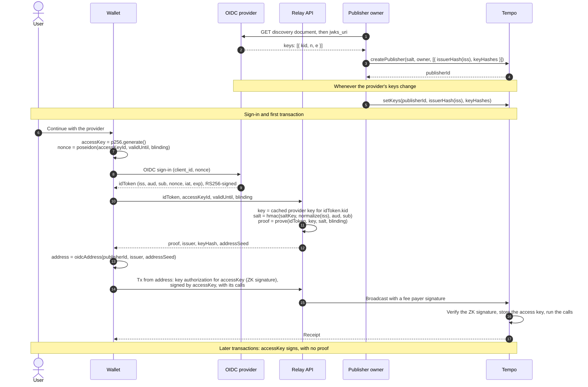

# TIP-1130: OIDC Signers (Meta)

## Abstract

OIDC signers let an OpenID Connect identity, such as a Google or Apple sign-in, sign for a Tempo address, in the way secp256k1, P256, and WebAuthn signers sign with a key. They sign with ZK signatures (type `0x06`), which carry a zero-knowledge proof that the identity's provider signed in the user with a nonce committing to an access key, plus that access key's signature. The proof reveals which provider a signer uses, but not which user it belongs to.

This meta TIP specifies how the components fit together. Component TIPs define encodings, interfaces, validation rules, and gas charges.

## Motivation

Most people already have a Google or Apple account. Few keep a seed phrase safe, and many lose passkeys when they change devices. Wallets that offer "Continue with Google" today hold the user's key on a server, custodially or with MPC, and that server decides who signed in.

Tempo already supports secp256k1, P256, and WebAuthn signers. OIDC signers add a signer type controlled by a provider sign-in, which the chain verifies itself against provider keys published onchain. They work with the account features Tempo already has: the key a sign-in commits to becomes the address's access key, so everyday transactions are ordinary access-key transactions, and a configurable account can list an OIDC signer as one of its owners.

### Success Criteria

- Sign-in to a confirmed first transaction takes at most 5 s at p50, measured from the provider's redirect, with server-side proving.
- Batched proof verification takes at most 0.4 ms per proof on the reference benchmark machine.
- Gas charged per ZK signature is within 10% of a re-measured reference benchmark.
- At least two independent circuit audits are complete, with no open critical or high findings, before mainnet.
- At least two parties other than the ceremony coordinator independently verify the trusted-setup transcript.
- The reference publisher lists a new provider key within 10 minutes of the provider publishing it.

## Assumptions

- Supported providers sign ID tokens with RS256 using 2048-bit RSA keys with exponent 65537, publish their keys through OIDC discovery, and echo the client's `nonce` in the ID token. Google, Apple, and Microsoft do. Providers that only issue ES256 tokens, such as LINE, are not supported in the first phase.
- A provider never changes or reassigns a user's `sub`.
- Groth16 over BN254 is sound, and at least one participant in each phase of the trusted setup was honest.
- Wallet operators run the salt service and prover offchain, in a relay API. It affects privacy and availability, not account control.
- Configurable accounts ([TIP-1107](./tip-1107.md)) are not required. Where they are active, OIDC signers can be their owners.

If a provider signs a token for the wrong user, every OIDC signer of that provider's users is exposed, except where a configurable account requires other owners as well. If the circuit or setup is unsound, every OIDC signer is exposed. The [Threat Model](#threat-model) covers both.

---

# Specification

The key words "MUST", "MUST NOT", "SHOULD", and "MAY" are to be interpreted as described in RFC 2119.

## Terminology

| Term | Meaning | Defined in |
|---|---|---|
| Identity | A user (`sub`) at a provider (`iss`) through an OAuth client (`aud`) | |
| Issuer hash | A field element identifying a provider's `iss` | [TIP-1133](./tip-1133.md#hashing) |
| Key hash | A field element identifying one of a provider's signing keys | [TIP-1133](./tip-1133.md#hashing) |
| Address seed | A hash of `sub`, `aud`, and a salt that keeps the identity private | [TIP-1133](./tip-1133.md#hashing) |
| Publisher | An onchain list of provider key hashes, maintained by its owner | [TIP-1132](./tip-1132.md) |
| OIDC signer | A signer whose address derives from the OIDC namespace, a publisher ID, an issuer hash, and an address seed | [TIP-1131](./tip-1131.md#address-derivation) |
| ZK signature | Signature type `0x06`: a proof of an issuer-signed statement, here an ID token, plus an access-key signature | [TIP-1131](./tip-1131.md#encoding) |
| Access key | The secp256k1, P256, or WebAuthn key that a sign-in's nonce commits to | [TIP-1131](./tip-1131.md#signed-digest) |
| Scheme | A circuit and verifying key for one statement format; scheme `0x01` is OIDC ID tokens signed with RS256 | [TIP-1131](./tip-1131.md#schemes) |

## Signer model

- An OIDC signer's address MUST behave as an ordinary Tempo account: it has a nonce, holds balances, pays fees, and can have access keys. It has no code.
- Its address MUST depend only on its namespace, publisher ID, issuer hash, and address seed. It MUST NOT depend on the scheme, verifying key, key hash, access key, signing time, or chain, so circuit upgrades, provider key rotations, and new access keys keep the address.
- Any valid ZK signature for the signer's identity, publisher, and issuer controls its address. The identity cannot be rotated, as a P256 signer's key cannot.
- Accounts that need rotation, recovery, or several signers use configurable accounts ([TIP-1107](./tip-1107.md)) with OIDC signers as owners.

## Signature validity

A ZK signature for an OIDC signer is valid at a transaction's position in a block only if all of the following hold:

1. It is canonically encoded, and its scheme is active at that block ([TIP-1131](./tip-1131.md#encoding)).
2. The block timestamp is within its validity window, which ends at most 10 minutes after the provider issued the token ([TIP-1131](./tip-1131.md#verification)).
3. Its publisher treats its key hash as active for its issuer, read from state at that position ([TIP-1132](./tip-1132.md#node-reads)).
4. Its access-key signature verifies over the digest ([TIP-1131](./tip-1131.md#signed-digest)).
5. Its proof verifies under the scheme's verifying key ([TIP-1133](./tip-1133.md#verifying-key)).

## Accepted uses

| Use | Accepted | Defined in |
|---|---|---|
| Signing a transaction sent from the OIDC signer's address | Yes | [TIP-1131](./tip-1131.md#accepted-contexts) |
| Signing a key authorization that grants the account an access key | Yes | [TIP-1131](./tip-1131.md#accepted-contexts) |
| Approving as an owner of a configurable account | Yes, where [TIP-1114](./tip-1114.md) is active | [TIP-1131](./tip-1131.md#accepted-contexts) |
| Signing a message for offchain verification, even before the address's first transaction | Yes, as a message signature | [TIP-1131](./tip-1131.md#message-signatures) |
| Signing as an access key, including for a configurable delegate | No | [TIP-1131](./tip-1131.md#accepted-contexts) |
| Fee payer signatures, subblock transactions, authorization lists, and [TIP-1020](./tip-1020.md) verification | No | [TIP-1131](./tip-1131.md#accepted-contexts) |

A transaction MUST carry at most two ZK signatures.

## Example: sign-in and first transaction

This example is informative. A new user signs in, and one transaction registers the access key and runs the account's first calls. Later transactions are signed by the access key alone.

## Trust

| Party | Can | Cannot |
|---|---|---|
| Provider | Sign in as any of its users, and so sign as their OIDC signers | Act alone where a configurable account requires other owners |
| OAuth client owner and its sign-in page, usually the wallet operator | Obtain ID tokens with a nonce of its choosing for users who open its sign-in page, without interaction if they are already signed in to the provider, and so sign as their OIDC signers | Reach users who never open its sign-in page |
| Publisher owner | List any key, and so forge signatures for OIDC signers that name its publisher; stop new signatures by revoking keys | Affect OIDC signers that name other publishers |
| Relay API (salt service, prover, relay), run by the wallet operator | See ID tokens, link identities to accounts, and delay or refuse service | Sign for a user, because each token commits to the access key chosen when sign-in started |
| Circuit and trusted setup | If unsound, let anyone forge a signature for any OIDC signer | |
| Validators | Nothing beyond their existing role | |

## Costs

Gas specific to OIDC signers. Dollar amounts use [TIP-1067](./tip-1067.md)'s base-fee cap of 1.2 × 10^10 attodollars per gas, at which 50,000 gas costs $0.0006. The base fee falls as low as a twentieth of the cap when the chain is quiet. Account creation and access-key storage cost the same as for any other account.

| Operation | Gas | Cost at the cap | Paid |
|---|---|---|---|
| Creating a publisher with one issuer and two keys | ~1,500,000 | ≤ $0.018 | Once per chain, by the publisher's creator |
| Publishing a new provider key | ~250,000 to 500,000 per key | ≤ $0.006 | By the publisher owner, when a provider rotates keys |
| Verifying one ZK signature | ~367,000 to 386,000 | ≤ $0.0046 | Once per sign-in: new account, new access key, or owner approval |
| Payments signed by an access key | 0 | 0 | |

A signature is mostly the proof check, priced at 350,000 gas pending a reference benchmark. The access-key signature costs 8,000 gas, the publisher read 2,100 gas, and the signature's bytes about 6,500 to 26,000 gas depending on the calldata schedule. [TIP-1131](./tip-1131.md#gas) has the details.

## Components and proposed phases

| TIP | What it adds and why | Proposed phase |
|---|---|---|
| [TIP-1131: ZK signatures](./tip-1131.md) | Adds signature type `0x06`, which signs for addresses derived from issuer-attested identities, with validation rules, accepted contexts, limits, and gas. | 1 |
| [TIP-1132: Key Publisher precompile](./tip-1132.md) | Holds provider key lists, maintained by publisher owners rather than validators. | 1 |
| [TIP-1133: OIDC RS256 proof circuit v1](./tip-1133.md) | Defines the relation proven for RS256 ID tokens, its encodings and limits, and its trusted setup. | 1 |

Phase 1 components MUST activate in the same hardfork. Their activation does not depend on configurable accounts; the rules for owner approvals apply once TIP-1114 is also active.

Possible later components:

- ES256 providers.
- RSA keys larger than 2048 bits.
- Faster circuits that hash part of the token outside the proof, or that are sized per provider.
- Stateful signature verification for contracts, extending [TIP-1020](./tip-1020.md).
- DKIM-signed email.

## Scope boundaries

- The first phase supports RS256 with 2048-bit keys and ID tokens whose signed part is at most 1,024 bytes. Wallets should request only the `openid` scope to keep tokens small.
- Each key list belongs to one `iss` value. Multi-tenant issuers that share keys across many `iss` values, such as Microsoft's organizational endpoint, need one list per tenant.
- An identity is the tuple `(iss, aud, sub)`. The same person signing in through two providers, or through two wallets with different OAuth clients, has two different OIDC signers, with different addresses.
- A ZK signature for an OIDC signer is valid for at most 10 minutes after the provider issued the token. Lasting authority belongs to access keys.
- OIDC signers used as configurable-account owners do not count toward [TIP-1110](./tip-1110.md) cross-chain recovery, like P256 and WebAuthn owners.
- The salt service, prover, sign-in page, and publisher job run offchain, outside consensus. The component TIPs describe them for interoperability only.

## Alternatives Considered

- **A proof on every transaction.** Each payment would carry a proof costing about seven TIP-20 transfers to verify. Here a proof is verified once per sign-in, and access keys sign payments at today's cost.
- **OIDC identities only as configurable-account owners.** This would limit the feature to configurable accounts. Treating an identity as a signer type, like the existing key types, keeps simple accounts simple, and configurable accounts can still list OIDC signers as owners.
- **Validators syncing provider keys.** This adds validator duties and makes the network decide which providers to trust. Publishers ([TIP-1132](./tip-1132.md)) let wallets and users choose instead.
- **An attested enclave that checks the token and signs.** This puts trusted hardware in the soundness path and needs onchain attestation checks. A proof keeps soundness in cryptography.
- **Verifying the RSA signature onchain without a proof.** This is cheap, about 22 µs, but publishes the user's provider identity, and often their email address, next to their account.
- **Proving in the browser.** A Groth16 prover compiled to WebAssembly measured 3.5× slower than the same code natively. Published snarkjs results for circuits of this size are about 20 s on a fast laptop and about 50 s on a flagship Android phone, plus a proving key of several hundred megabytes. It remains an option for users who do not want a server to see their token, but not the default.
- **Other proof systems.** UltraHonk proves faster in browsers and needs no circuit-specific setup, but its 9 to 16 KB proofs exceed [TIP-1045](./tip-1045.md)'s 1,024-byte payment-lane bound for key authorizations, and they take 7 to 20 ms to verify. Hash-based proofs need no setup but are 200 to 500 KB. Groth16 proofs are 256 bytes and verify in about 1 ms.
- **DKIM-signed email.** The user would have to send an email, delivery takes 5 to 15 s, and DKIM parsing has a weaker audit record than ID-token parsing.
- **A smart-contract wallet with a relayer**, which works today without a hardfork. It gives up the payment lane, needs a relayer for every transaction, and costs more per payment. It is a reasonable prototype, because its offchain parts carry over unchanged.

# Tooling

- **Wallets and SDKs** derive nonces and OIDC addresses, build and sign transactions and key authorizations, check configurable-account configurations against the two-signature limit, and estimate gas. [TIP-1131](./tip-1131.md#tooling) lists the functions.
- **Relay APIs** run the salt service and prover. [TIP-1133](./tip-1133.md#tooling) defines test vectors and the reference prover.
- **Publishers** run a job that tracks providers' key lists and publishes changes. [TIP-1132](./tip-1132.md#tooling) describes it.

# Observability

- The Key Publisher emits events for publisher creation, ownership changes, key updates, and revocations ([TIP-1132](./tip-1132.md#observability)).
- ZK signatures are part of transactions and need no new events. Nodes export verification metrics ([TIP-1131](./tip-1131.md#observability)).
- Publishers should alert when a provider key is missing onchain for more than 10 minutes, or when an onchain key has been missing from the provider's list for more than 20 minutes.

# Threat Model

- **Provider:** trusted to authenticate its users. A malicious or compromised provider can sign as any of its users' OIDC signers. Configurable accounts can limit this by requiring other owners.
- **OAuth client owner:** controls the `aud` client's redirect URIs and the sign-in page, so it can start a sign-in with its own nonce for any user who opens that page, without interaction for users already signed in to the provider. This is the trust a user already places in a wallet's front end. Accounts holding significant value should use a configurable account that requires a passkey or another owner as well.
- **Publisher owner:** trusted to list only genuine provider keys. A compromised owner can forge signatures for OIDC signers that name its publisher. It can also stop new signatures by revoking keys. Publisher owners should use multisig or timelock control in proportion to the value their accounts hold.
- **Relay API:** sees ID tokens and knows which identity is behind which address. A token only works for the access key it commits to, so the relay API cannot sign with it. If the operator loses its salt key or stops serving, users cannot sign in through that wallet until another operator has their salt.
- **Circuit and setup:** a soundness bug or a compromised ceremony lets anyone forge a signature for any OIDC signer. Mitigations are independent audits, a public ceremony, and an emergency response: publisher owners revoke keys to stop new signatures within minutes, followed by a hardfork that disables the scheme.
- **Access key:** a stolen access key can produce ZK signatures until their window ends, at most 10 minutes after sign-in, and after that acts only within its access-key limits.
- **Network:** an invalid proof costs about 1 ms to reject. Per-transaction limits, cheap checks before the proof, and per-peer transaction-pool limits bound this work ([TIP-1131](./tip-1131.md#threat-model)).

# Invariants

- An OIDC signer's address depends only on its namespace, publisher ID, issuer hash, and address seed.
- A ZK signature authorizes only the digest its access key signed, and only within its validity window.
- A ZK signature is valid only while its publisher treats the provider key as active: listed, or within its grace period.
- A publisher owner cannot affect OIDC signers that name a different publisher.
- Payments signed by an access key involve no proof and no OIDC-specific gas.
- Every valid ZK signature for an OIDC signer needs a token, signed by a key its publisher treats as active, whose nonce commits to the signing access key. Only the provider, the OAuth client owner through a user's browser, the publisher owner, or an unsound circuit or setup can obtain one without the user's intent.
