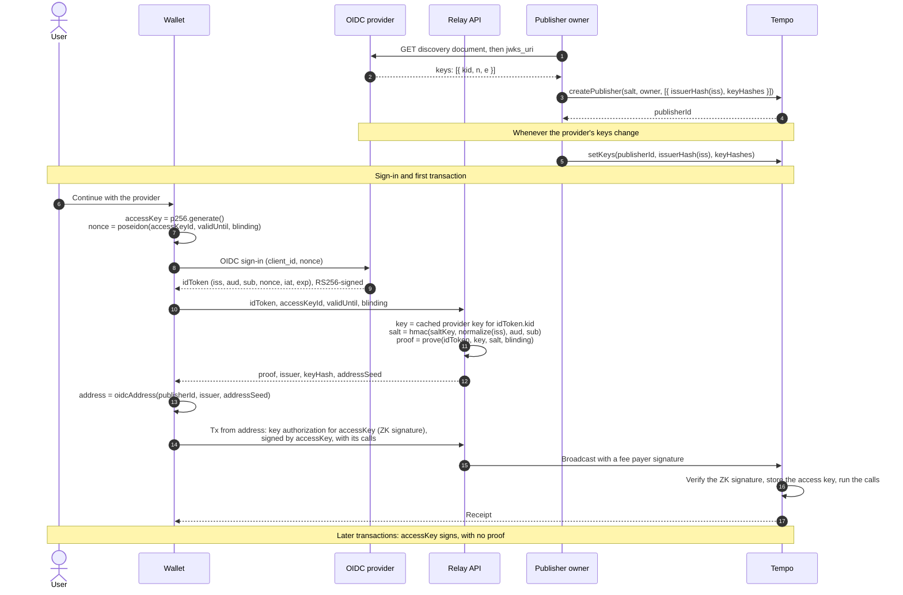

# TIP-1130: OIDC Signers (Meta)

## Abstract

OIDC signers let an OpenID Connect identity, such as a Google or Apple account, sign for a Tempo address, as secp256k1, P256, and WebAuthn signers do with a key. They sign with ZK signatures (type `0x06`): a zero-knowledge proof that the provider signed in the user with a nonce committing to an access key, plus that access key's signature. The proof reveals the provider, but not the user.

This meta TIP describes the feature and its components. Component TIPs define encodings, interfaces, validation rules, and gas.

## Motivation

Most people already have a Google, Apple, or other OIDC-based account, but few keep a seed phrase or passkey safe
across devices. Wallets that offer "Continue with Google" today hold the user's key on a server,
whole or as MPC shares. The server checks the ID token and signs whenever it decides the user
signed in, so the wallet operator is the custodian:

- a breach of its signing servers can move every user's funds at once;
- a bug or insider in its token checks can sign as any user;
- users cannot tell what it signs for them until it is onchain.

OIDC signers take the operator out of the signing path. No server holds a key for the account.
The chain checks the sign-in itself, with a proof that the provider signed the user's ID token
under a key listed onchain. 

## Assumptions

- Supported providers sign ID tokens with RS256 (2048-bit keys, exponent 65537), publish their keys through OIDC discovery, and echo the client's `nonce`. Google, Apple, and Microsoft do.
- A provider never changes or reassigns a user's `sub`.
- Groth16 over BN254 is sound, and the universal and circuit-specific setups each had at least one honest participant.
- Wallet operators run the salt service and prover offchain, in a Relay API, which affects privacy and availability but not control.
- Configurable accounts ([TIP-1107](./tip-1107.md)) are not required. Where they are active, OIDC signers can be owners.

A provider that signs a token for the wrong user exposes its users' OIDC signers. An unsound circuit or setup exposes every OIDC signer.

---

# Specification

## Components

| TIP | What it adds |
|---|---|
| [TIP-1131: ZK Signatures](./tip-1131.md) | Signature type `0x06`, with addresses, verification, accepted contexts, limits, and gas |
| [TIP-1132: Key Publisher Precompile](./tip-1132.md) | Provider key lists maintained by publisher owners rather than validators |
| [TIP-1133: OIDC RS256 Proof Circuit v1](./tip-1133.md) | The relation proven for RS256 ID tokens, with its encodings, limits, and trusted setup |

These components activate in the same hardfork, independently of configurable accounts. Later components may add ES256 providers, larger RSA keys, faster circuits, stateful verification for contracts, and DKIM-signed email.

## Signers

An OIDC identity is a user (`sub`) at a provider (`iss`), through an OAuth client (`aud`). Its OIDC signer's address derives from the OIDC namespace, a publisher ID, an issuer hash, and an address seed ([TIP-1131](./tip-1131.md#address-derivation)):

- the publisher ID names the signer's [key publisher](./tip-1132.md), the onchain list of provider keys it trusts;
- the issuer hash identifies `iss`, and the address seed hashes `sub`, `aud`, and a private salt ([TIP-1133](./tip-1133.md#hashing)).

The address is an ordinary account: it has a nonce, holds balances, pays fees, and can have access keys, but no code. It does not depend on the circuit, provider key, access key, signing time, or chain, so circuit upgrades, key rotations, and new access keys keep it. The identity cannot be rotated, as a P256 signer's key cannot. Accounts that need rotation, recovery, or several signers use configurable accounts with OIDC signers as owners.

## Signature validity

Each ZK signature names a scheme, which fixes its circuit and verifying key. Scheme `0x01` covers RS256 ID tokens ([TIP-1131](./tip-1131.md#schemes)). A ZK signature is valid at a transaction's position in a block only if:

1. it is canonically encoded and its scheme is active ([TIP-1131](./tip-1131.md#encoding));
2. the block timestamp is within its validity window, which ends at most 10 minutes after the token was issued ([TIP-1131](./tip-1131.md#verification));
3. its publisher lists the provider key as active for the issuer, read at that position ([TIP-1132](./tip-1132.md#node-reads));
4. its access-key signature verifies over the signed digest ([TIP-1131](./tip-1131.md#signed-digest));
5. its proof verifies under the scheme's verifying key ([TIP-1133](./tip-1133.md#verifying-key)).

## Accepted uses

| Use | Accepted |
|---|---|
| Signing a transaction from the signer's address | Yes |
| Signing a key authorization that grants the address an access key | Yes |
| Approving as a configurable-account owner | Where [TIP-1114](./tip-1114.md) is active |
| Signing a message for offchain verification, even before the first transaction | Yes, as a [message signature](./tip-1131.md#message-signatures) |
| Signing as an access key, including for a configurable delegate | No |
| Fee payer signatures, subblocks, authorization lists, and [TIP-1020](./tip-1020.md) | No |

A transaction carries at most two ZK signatures ([TIP-1131](./tip-1131.md#limits)).

## Sign-in and first transaction

A new user signs in, and one transaction registers the access key and runs the first calls. Later transactions are signed by the access key alone.

## Trust

| Party | Can | Cannot |
|---|---|---|
| Provider | Sign in as any of its users, and so sign as their OIDC signers | Act alone where a configurable account requires other owners |
| OAuth client owner and its sign-in page, usually the wallet operator | Obtain tokens with its own nonce for users who open its sign-in page, without interaction if they are signed in to the provider | Reach users who never open its sign-in page |
| Publisher owner | List any key, forging signatures for signers that name its publisher, or revoke keys to stop new signatures | Affect signers that name other publishers |
| Relay API | See ID tokens, link identities to addresses, and delay or refuse service | Sign for a user, because each token commits to the access key chosen at sign-in |
| Circuit and trusted setup | If unsound, let anyone forge a signature for any OIDC signer | |
| Validators | Nothing beyond their existing role | |

## Costs

Dollar amounts use the [TIP-1067](./tip-1067.md) base-fee cap of 1.2 × 10^10 attodollars per gas. Account creation and access-key storage cost the same as for other accounts.

| Operation | Gas | Cost at the cap | Paid |
|---|---|---|---|
| Creating a publisher with one issuer and two keys | ~1,500,000 | ≤ $0.018 | Once per chain, by its creator |
| Listing a new provider key | ~250,000 to 500,000 | ≤ $0.006 | By the publisher owner, when the provider rotates keys |
| Verifying a ZK signature | ~367,000 to 386,000 | ≤ $0.0046 | Once per sign-in |
| Transactions signed by an access key | No extra gas | | |

The proof check accounts for 350,000 gas of each signature, pending a reference benchmark ([TIP-1131](./tip-1131.md#gas)).

## Scope boundaries

- Only RS256 with 2048-bit keys, and ID tokens whose signed part is at most 1,024 bytes. Wallets request only the `openid` scope.
- Each key list covers one `iss`, so multi-tenant issuers, such as Microsoft's organizational endpoint, need one list per tenant.
- The same person signing in through two providers, or two OAuth clients, has two OIDC signers.
- A ZK signature lasts at most 10 minutes. Lasting authority belongs to access keys.
- As configurable-account owners, OIDC signers do not count toward [TIP-1110](./tip-1110.md) cross-chain recovery, like P256 and WebAuthn owners.
- The salt service, prover, sign-in page, and publisher job run outside consensus.

## Alternatives Considered

- **A proof on every transaction:** each payment would cost about seven TIP-20 transfers to verify. Proving once per sign-in keeps payments at today's cost.
- **Identities only as configurable-account owners:** ties the feature to configurable accounts. A signer type keeps simple accounts simple.
- **Validators syncing provider keys:** adds validator duties and makes the network choose providers. Publishers let wallets choose.
- **An attested enclave that checks tokens:** puts trusted hardware in the soundness path.
- **Verifying the RSA signature onchain:** cheap, but publishes the user's identity, often an email address, beside their account.
- **Proving in the browser:** about 20 s on a fast laptop and 50 s on a phone, with a proving key of several hundred megabytes. It remains an option, not the default.
- **Other proof systems:** UltraHonk proofs are 9 to 16 KB, beyond [TIP-1045](./tip-1045.md)'s 1,024-byte key-authorization bound, and take 7 to 20 ms to verify. Hash-based proofs are 200 to 500 KB. Groth16 proofs are 256 bytes and verify in about 1 ms.
- **DKIM-signed email instead of sign-in:** users must send an email, delivery takes 5 to 15 s, and DKIM parsing is less audited.
- **A smart-contract wallet with a relayer:** works without a hardfork, but gives up the payment lane and costs more per payment.

# Tooling

- Wallets and SDKs derive nonces and addresses, build ZK-signed transactions and key authorizations, and check configurable-account configurations against the two-signature limit ([TIP-1131](./tip-1131.md#tooling)).
- Relay APIs run the salt service and prover ([TIP-1133](./tip-1133.md#tooling)).
- Publishers run a job that mirrors provider key lists onchain ([TIP-1132](./tip-1132.md#tooling)).

# Observability

The Key Publisher emits events for publisher and key changes ([TIP-1132](./tip-1132.md#observability)). ZK signatures need no new events. Nodes export verification metrics ([TIP-1131](./tip-1131.md#observability)).

# Threat Model

[Trust](#trust) lists what each party can do. In addition:

- **OAuth client owner:** controls the sign-in page, as a wallet's front end does today. Accounts holding significant value should use a configurable account that also requires another owner.
- **Publisher owner:** should use multisig or timelock control in proportion to the value its signers hold.
- **Relay API:** if it loses its salt key, users keep their access keys but cannot sign in again through that wallet.
- **Soundness failure:** publisher owners revoke keys to stop new signatures within minutes, and a hardfork disables the scheme. Independent audits and a public ceremony precede mainnet.
- **Stolen access key:** can produce ZK signatures for at most 10 minutes after sign-in, then acts only within its access-key limits.
- **Invalid proofs:** cost about 1 ms each to reject. Limits and pool rules bound the work ([TIP-1131](./tip-1131.md#threat-model)).

# Invariants

- An OIDC signer's address depends only on its namespace, publisher ID, issuer hash, and address seed.
- A ZK signature authorizes only the digest its access key signed, within its validity window.
- A ZK signature is valid only while its publisher treats the provider key as active.
- A publisher owner cannot affect signers that name another publisher.
- Transactions signed by an access key carry no proof and pay no OIDC-specific gas.
