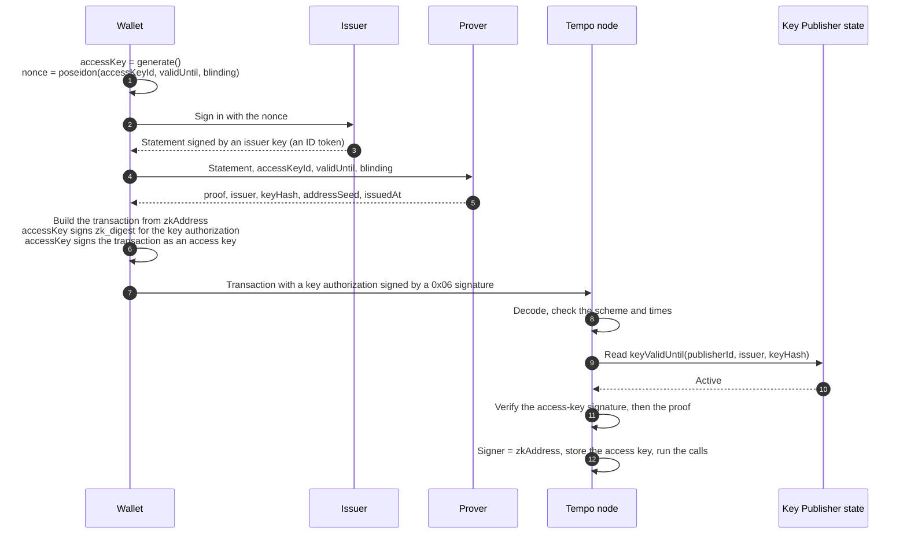
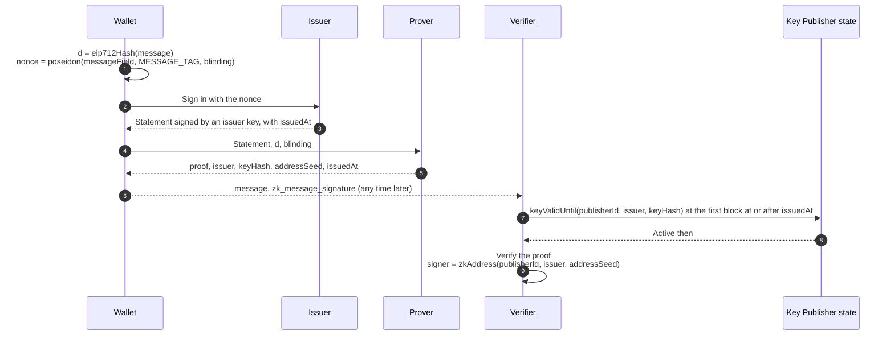

# TIP-1131: ZK Signatures

## Abstract

This TIP adds signature type `0x06`, the ZK signature. Its address derives from an identity attested by an issuer, such as a user signed in to an OpenID Connect provider, as a P256 address derives from a public key. A ZK signature carries a zero-knowledge proof that the issuer signed a statement naming the identity and committing to an access key, plus the access key's signature. Each scheme defines what is proven, and [TIP-1133](./tip-1133.md) defines the first. A message form signs messages for offchain verification.

## Motivation

Signing in with an auth provider, such as Google or Apple, ends with a token the provider signs, naming the user. Every existing Tempo signature type needs the user to hold a key, so signing in with a provider today means trusting a wallet server that holds it.

A ZK signature lets the provider's signature control a Tempo address. The node verifies that a provider key published onchain signed a token for the address's identity, without the token appearing onchain. A scheme byte lets later issuer formats, such as ES256 tokens or DKIM-signed email, reuse the same address rule and validation path.

## Assumptions

- [TIP-1132](./tip-1132.md) is active, with its storage layout fixed.
- A circuit TIP defines each scheme's relation and verifying key. [TIP-1133](./tip-1133.md) defines scheme `0x01`.
- Groth16 over BN254 is sound for each scheme's verifying key.
- Consensus keeps block timestamps close to real time.
- Configurable accounts ([TIP-1114](./tip-1114.md)) are not required. Where they are active, a ZK signature can approve as an owner.

---

# Specification

## Constants

| Name | Value | Notes |
|---|---|---|
| `SIGNATURE_TYPE_ZK` | `0x06` | Follows TIP-1114's `0x05` |
| `MAX_FUTURE_SKEW` | `60` seconds | Allowance for issuer clocks running ahead |
| `MESSAGE_TAG` | `2^64` | Marks the message form; exceeds any `valid_until` |
| `MAX_ZK_SIGNATURES_PER_TX` | `2` | |
| `MAX_ZK_SIGNATURE_SIZE` | `2,049` bytes | The WebAuthn signature limit |
| `ZK_VERIFY_GAS` | `350,000` | Placeholder pending the reference benchmark |
| `COLD_SLOAD_COST` | `2,100` | |
| `BN254_SCALAR_FIELD` | `21888242871839275222246405745257275088548364400416034343698204186575808495617` | |

## Schemes

| Scheme | Statement | Namespace | Verifying key | Maximum window |
|---|---|---|---|---|
| `0x01` | OIDC ID token signed with RS256 ([TIP-1133](./tip-1133.md)) | `0x01` (OIDC) | `VK_OIDC_RS256_V1` | 600 seconds |

- Every scheme uses Groth16 over BN254 with one public input.
- Schemes in one namespace MUST define `issuer` and `address_seed` identically, so a new circuit keeps existing addresses.
- A scheme MAY define a [message form](#message-signatures). Scheme `0x01` does.
- New schemes are added by hardfork.

## Encoding

```text
zk_signature = 0x06 || rlp([
    scheme,                // uint8
    publisher_id,          // bytes32, a TIP-1132 publisher ID
    issuer,                // bytes32, field element
    key_hash,              // bytes32, field element
    address_seed,          // bytes32, field element
    issued_at,             // uint64, seconds, when the issuer signed the statement
    valid_until,           // uint64, seconds, when the signature expires
    proof,                 // bytes, exactly 256
    access_key_signature,  // bytes, a primitive TIP-0001 signature
])
```

- The RLP MUST be canonical, with exactly nine fields and no trailing bytes. The signature MUST be at most `MAX_ZK_SIGNATURE_SIZE` bytes.
- `issuer`, `key_hash`, and `address_seed` MUST be less than `BN254_SCALAR_FIELD`.
- `proof` is `A || B || C`: uncompressed G1 points `A` and `C` (64 bytes, `x || y`) and an uncompressed G2 point `B` (128 bytes, [EIP-197](https://eips.ethereum.org/EIPS/eip-197) order). Coordinates MUST be 32-byte big-endian integers less than the base field modulus.
- `access_key_signature` MUST be a canonical secp256k1, P256, or WebAuthn signature ([TIP-0001](./tip-0001.md)): `s` is at most half the curve order, and re-encoding reproduces the same bytes (a P256 `pre_hash` byte is `0x00` or `0x01`). Keychain, multisig, and ZK signatures MUST be rejected.

## Address derivation

```text
zk_address = keccak256(0x06 || uint8(namespace) || publisher_id || issuer || address_seed)[12:]
```

The address does not depend on the scheme, key hash, access key, times, proof, or chain. Its 98-byte preimage cannot equal the 64-byte public-key preimage of a secp256k1 or P256 address. It is an ordinary account with no code.

## Signed digest

The access key signs:

```text
zk_digest = keccak256(
    "tempo:zk-signature" || d ||
    keccak256(rlp([scheme, publisher_id, issuer, key_hash, address_seed, issued_at, valid_until, proof]))
)
```

| Context | `d` |
|---|---|
| Transaction signature | Transaction signing hash ([TIP-0001](./tip-0001.md)) |
| Key authorization signature | Key authorization digest ([TIP-0001](./tip-0001.md)) |
| Multisig owner approval | `multisig_digest(inner_digest, account, version)` ([TIP-1114](./tip-1114.md)) |

The ASCII domain keeps the digest distinct from other uses of the access key. Because the access key signs every other field and its signature is canonical, no byte of a valid signature can change without the access key, including by re-randomizing the proof.

## Verification

```text
verify_zk_signature(signature, d, block):
    s      = decode(signature)                    // per Encoding, without curve operations
    scheme = active_schemes(block)[s.scheme]      // reject if missing

    require s.issued_at   <= block.timestamp + MAX_FUTURE_SKEW
    require s.valid_until >= block.timestamp
    require s.valid_until <= s.issued_at + scheme.max_window
    require key_valid_until(s.publisher_id, s.issuer, s.key_hash) >= block.timestamp

    access_key_id = recover(s.access_key_signature, zk_digest(d, s))   // 20-byte key ID
    public_input  = poseidon(s.scheme, s.issuer, s.key_hash, s.address_seed,
                             uint160(access_key_id), s.valid_until, s.issued_at)
    require groth16_verify(scheme.verifying_key, s.proof, [public_input])

    return zk_address(scheme.namespace, s.publisher_id, s.issuer, s.address_seed)
```

- `key_valid_until` reads Key Publisher storage at the transaction's position in the block ([TIP-1132](./tip-1132.md#node-reads)).
- `groth16_verify` MUST check that `A` and `C` are on G1, that `B` is on G2 and in its prime-order subgroup, and that none is the point at infinity.
- Poseidon uses the circomlib parameters ([TIP-1133](./tip-1133.md#notation)).
- Outside pool admission, such as sender recovery during block import, the stateless steps (decoding, access-key recovery, and the proof) MAY run first. The result MUST equal running every step in order.

## End-to-end flow

A typical first transaction: the ZK signature signs a key authorization for a new access key, which signs the transaction.



## Accepted contexts

A ZK signature is accepted as:

- the signature of a Tempo transaction (type `0x76`) sent from its `zk_address`;
- the root signature of a key authorization for its `zk_address` ([TIP-0001](./tip-0001.md));
- an owner approval in a TIP-1114 multisig signature, where TIP-1114 is active.

It MUST be rejected:

- inside a keychain signature (`0x03` or `0x04`), including a configurable delegate's, because an identity cannot be an access key;
- as a fee payer signature, in subblock transactions, and in authorization lists;
- by TIP-1020 `recover` and `verify`, which revert with `InvalidFormat`;
- in [TIP-1086](https://github.com/tempoxyz/tempo/pull/7506) carried authorizations, if that TIP activates.

Before activation, type `0x06` MUST be rejected in every context.

## Limits

- A transaction MUST contain at most `MAX_ZK_SIGNATURES_PER_TX` ZK signatures across all its signatures, counted before any cryptography.
- Where TIP-1114 and TIP-1111 are active, each ZK signature counts as one primitive signature toward their limits.
- Nodes cannot recognize ZK addresses, so TIP-1114 accepts configurations whose ZK signers meet the threshold together but no two of them do, an approval path that can never be used. Wallets and SDKs MUST refuse to create or update to such configurations.

## Node behavior

- **Ordering.** Pools MUST finish decoding, limit, time, and publisher checks before any elliptic-curve or pairing operation, and SHOULD check fee affordability before the publisher read.
- **Parallelism and caching.** Nodes MAY verify access-key signatures and proofs in parallel ahead of execution, and MAY cache successful checks by `keccak256(zk_signature)` and `d` between pool admission and block import. Activation, time, and publisher checks MUST run for each block.
- **Batching.** Nodes MAY batch-verify a block's proofs with random 128-bit weights from a local CSPRNG or a Fiat-Shamir transcript of every proof and public input in the batch. If a batch fails, nodes MUST check its proofs individually. A block is valid only if every proof is.
- **Pool limits.** Anyone can list a key, so the publisher check does not filter invalid proofs. Pools SHOULD rate-limit ZK-signed transactions per peer, penalize peers that send invalid proofs, revalidate on `KeysSet` and `KeyRevoked`, and evict after `valid_until`.

## Gas

Wherever TIP-0001 or TIP-1114 charges a primitive signature's verification cost, a ZK signature charges:

```text
zk_cost = ZK_VERIFY_GAS
        + primitive_signature_cost(access_key_signature)   // TIP-0001 schedule
        + COLD_SLOAD_COST
        + calldata_gas(zk_signature without access_key_signature)
```

As a transaction signature, `zk_cost - 3,000` is added to the 21,000 base, as TIP-0001 does for P256. The charge does not depend on batching or caching.

`ZK_VERIFY_GAS` follows the 1 gas per ns target of the draft [TIP-1102](https://github.com/tempoxyz/tempo/blob/tip/1102/tips/tip-1102.md). Measured per proof on a 4-vCPU 2.1 GHz VM and scaled to TIP-1102's benchmark machine:

| Verification | arkworks | halo2curves |
|---|---|---|
| One proof alone | 1,000,000 | 900,000 |
| Batch of 16 | 411,000 | 386,000 |
| Batch of 64 | 355,000 | 334,000 |
| Batch of 256 | 341,000 | 320,000 |

The price assumes batching, since a block full of ZK signatures is verified as one batch. With a P256 access key, a ZK signature costs about 367,000 to 386,000 gas and is 538 bytes. A key authorization signed with one is about 600 bytes, within [TIP-1045](./tip-1045.md)'s 1,024-byte payment-lane bound.

## Message Signatures

A message signature proves that an identity signed in to approve one message. The sign-in's nonce commits to the message, so it needs no access key or account state. It works before the address's first transaction and is verified offchain.



```text
zk_message_signature = rlp([scheme, publisher_id, issuer, key_hash, address_seed, issued_at, proof])

verify_zk_message(signature, d, now):
    s      = decode(signature)                     // canonical, seven fields, rules as in Encoding
    scheme = message_schemes[s.scheme]             // reject if missing

    require s.issued_at <= now + MAX_FUTURE_SKEW
    block  = first_block_at_or_after(s.issued_at)  // on the chain the message names
    require key_valid_until(s.publisher_id, s.issuer, s.key_hash, block) >= s.issued_at

    public_input = poseidon(s.scheme, s.issuer, s.key_hash, s.address_seed,
                            uint256(d) mod BN254_SCALAR_FIELD, MESSAGE_TAG, s.issued_at)
    require groth16_verify(scheme.verifying_key, s.proof, [public_input])

    return zk_address(scheme.namespace, s.publisher_id, s.issuer, s.address_seed)
```

- `d` is the message's EIP-712 hash, or its EIP-191 hash for text. Messages SHOULD name the signer, chain, verifier domain, and an expiry or nonce.
- The publisher read uses an archive node or a storage proof against a trusted header. A key listed after `issued_at` fails, so wallets SHOULD confirm the key is listed before proving. Verifiers SHOULD also reject keys that now read zero, meaning revoked.
- No maximum window applies. Verifiers apply their own freshness rules.
- Message signatures MUST NOT be accepted onchain. `MESSAGE_TAG` exceeds any `valid_until`, so neither form's proof verifies as the other.
- A message signature signs for a ZK address, not for a configurable account.

## Activation

Activation is hardfork-gated, together with TIP-1132 and TIP-1133, and does not depend on configurable accounts. The owner-approval context applies once TIP-1114 is also active.

## Alternatives Considered

- **A nonce committing to the digest, with no access key:** a new address depends on the salt, known only after sign-in, so the nonce cannot commit to a digest that names the account.
- **One signature type per issuer format:** a scheme byte keeps one address rule and validation path.
- **Only as configurable-account owner approvals:** ties the feature to configurable accounts.
- **Several public inputs:** each adds a scalar multiplication. One hashed input keeps verification cost fixed.
- **Compressed proof points:** save 128 bytes, but decompression costs more than the bytes.

# Tooling

- SDKs, such as ox and viem, SHOULD provide nonce, `zk_address`, and `zk_digest` derivation; `0x06` encoding with canonical access-key signatures; builders for ZK-signed transactions, key authorizations, and owner approvals; message signing and verification; and the configuration check in [Limits](#limits).
- RPC simulation and gas estimation MUST apply the same checks and charges, and report which check failed.
- Test vectors cover encodings, addresses, digests, and each rule, shared with TIP-1133.

# Observability

No new events: ZK signatures are part of transactions, and TIP-1132 events record key changes. Nodes SHOULD export proof verification time, batch sizes, rejections by reason in the pool and in blocks, and the cache hit rate.

# Threat Model

- **Issuers** can sign for any identity they issue for.
- **Publisher owners** can forge signatures for addresses that name their publisher, or stop new ones by revoking keys.
- **Whoever starts the issuer flow**, for OIDC the OAuth client owner, chooses the nonce and so the access key ([TIP-1130](./tip-1130.md#trust)).
- **Mempool observers** cannot reuse a signature for another digest or change any of its bytes.
- **Leaked statements** cannot sign for other keys, because the nonce binds `access_key_id`, `valid_until`, and a blinding value.
- **A stolen access key** can produce ZK signatures until `valid_until`, then acts within its access-key limits.
- **Message signatures** can be shown to any verifier, so messages name the verifier domain and an expiry or nonce.
- **Denial of service:** an invalid proof costs about 1 ms to reject without fees. Limits checked before cryptography, two proofs per transaction, and per-peer limits bound the work.
- **Soundness failure** lets anyone forge signatures for the scheme. Publisher owners revoke keys at once, a hardfork disables the scheme, and cached results are discarded.
- **Proposer timestamps** can extend validity only within consensus bounds.

# Invariants

- A ZK signature authorizes only the digest its access key signed, and no byte of it can change without the access key.
- A ZK signature is accepted only as a transaction signature, a key authorization signature, or a multisig owner approval.
- A transaction contains at most two ZK signatures, counted before cryptography.
- A signature is rejected if its key is inactive at its position in the block, including after a revocation earlier in that block.
- A signature is rejected outside its time bounds.
- The address is independent of the scheme, key hash, access key, times, proof, and chain.
- Gas does not depend on batching or caching, and batching accepts a block exactly when every proof verifies, except with negligible probability.
- Before activation, `0x06` is rejected in every context.
- A message signature verifies only for its message, and never as a ZK signature, or the reverse.

## Test Cases

- A first transaction whose key authorization carries a ZK signature, and a transaction signed directly by one.
- Two ZK owners approving a configurable-account update, and a third ZK signature rejected before cryptography.
- Each rejected context: keychain inner signature, configurable delegate, fee payer, subblock, authorization list, and TIP-1020.
- `setKeys` and `revokeKey` earlier in the same block, and each time bound at and one second past its edge.
- Non-canonical field elements and access-key signatures, invalid coordinates and points, `B` outside its subgroup, and a re-randomized proof.
- A cached proof after its scheme deactivates, and batches with an invalid proof at each position.
- Message signatures before the first transaction, for another message, as a ZK signature, and with keys listed after or revoked since `issued_at`.

# Open Questions

- Re-measure `ZK_VERIFY_GAS` on the reference machine, including a transaction with two invalid proofs.
- Confirm the two-signature limit, and whether subblock transactions may carry ZK signatures.
- Should verification be priced against the parallel signature stage rather than sequential execution?
- Do contracts need to verify message signatures? That would need key history in the Key Publisher.
