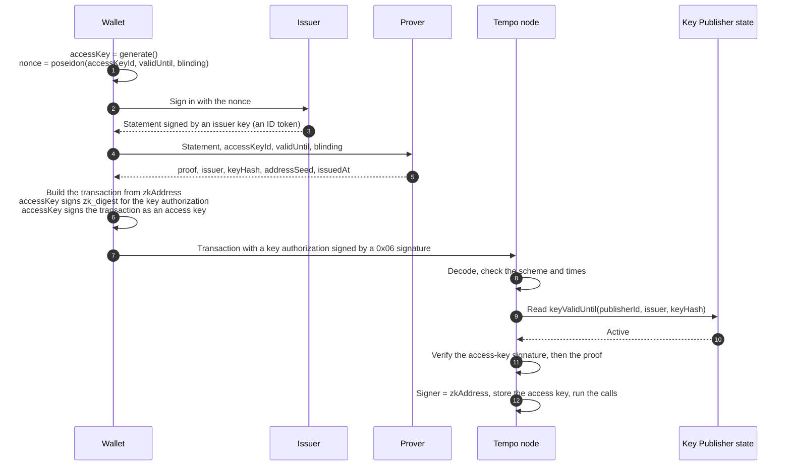
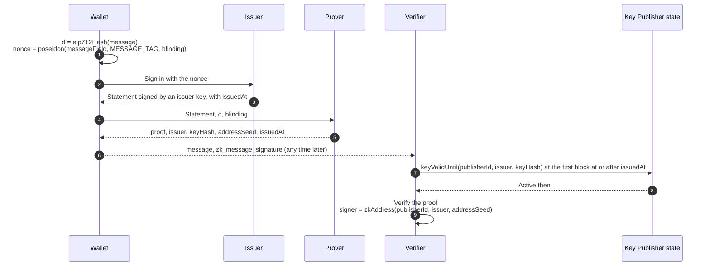

# TIP-1131: ZK Signatures

## Abstract

This TIP adds signature type `0x06`, the ZK signature. Its signer address derives from an identity attested by an issuer, such as a user signed in to an OpenID Connect provider, in the way a P256 signer's address derives from its public key. A ZK signature carries a zero-knowledge proof that the issuer signed a statement naming the identity and committing to an access key, and the access key's signature over the digest. Each scheme defines what is proven; [TIP-1133](./tip-1133.md) defines the first, for OIDC ID tokens. A second form, the message signature, lets the same identity sign messages for offchain verification without any onchain account state.

## Motivation

People already prove who they are to identity providers every day: "Sign in with Google" and "Sign in with Apple" are the most familiar examples. The provider signs a token saying which user signed in. Tempo's existing signature types all require the user to hold a key, so sign-in with a provider today means trusting a wallet server that holds the key and decides who signed in.

A ZK signature lets the provider's own signature control a Tempo account. The node verifies, in zero knowledge, that a provider key published onchain signed a token for the account's identity, without the token or the identity appearing onchain. An access key that the sign-in commits to signs the transaction, so a token cannot be reused for a different key or digest.

One signature type with a scheme byte covers every issuer format. Adding another, such as ES256 tokens or DKIM-signed email, needs a new circuit and verifying key, but no new signature type, address rule, or validation path.

### Success Criteria

[TIP-1130](./tip-1130.md#success-criteria) defines the feature's success criteria. For this component, charged gas is within 10% of the re-measured reference benchmark, and batched verification takes at most 0.4 ms per proof on the reference machine.

## Assumptions

- [TIP-1132](./tip-1132.md) is active, with its storage layout fixed.
- A circuit TIP defines each scheme's relation and verifying key. Scheme `0x01` is defined by [TIP-1133](./tip-1133.md).
- Groth16 over BN254 is sound for each scheme's verifying key.
- Block timestamps follow existing consensus rules, so a proposer cannot move them far from real time.
- Configurable accounts ([TIP-1114](./tip-1114.md)) are not required. Where they are active, a ZK signature can also approve as an owner.

---

# Specification

The key words "MUST", "MUST NOT", "SHOULD", and "MAY" are to be interpreted as described in RFC 2119.

## Constants

| Name | Value | Notes |
|---|---|---|
| `SIGNATURE_TYPE_ZK` | `0x06` | The next type after TIP-1114's `0x05` |
| `MAX_FUTURE_SKEW` | `60` seconds | Allowance for issuer clocks running ahead |
| `MESSAGE_TAG` | `2^64` | Marks the message form of the public input; larger than any `valid_until` |
| `MAX_ZK_SIGNATURES_PER_TX` | `2` | Across every signature in a transaction |
| `MAX_ZK_SIGNATURE_SIZE` | `2,049` bytes | The same limit as a WebAuthn signature |
| `ZK_VERIFY_GAS` | `350,000` | Placeholder pending the reference benchmark; see [Gas](#gas) |
| `COLD_SLOAD_COST` | `2,100` | One cold storage read |
| `BN254_SCALAR_FIELD` | `21888242871839275222246405745257275088548364400416034343698204186575808495617` | |

## Schemes

A scheme fixes the statement an issuer signs, the circuit that proves it, and the scheme's verifying key, namespace, and maximum validity window:

| Scheme | Statement | Namespace | Verifying key | Maximum window |
|---|---|---|---|---|
| `0x01` | OIDC ID token signed with RS256 ([TIP-1133](./tip-1133.md)) | `0x01` (OIDC) | `VK_OIDC_RS256_V1` ([TIP-1133](./tip-1133.md#verifying-key)) | 600 seconds |

- Every scheme uses Groth16 over BN254 with a single public input, defined in [Verification](#verification).
- Schemes in the same namespace MUST define `issuer` and `address_seed` identically, so a new circuit for a namespace keeps every existing address.
- A scheme MAY also define a message form for [message signatures](#message-signatures). Scheme `0x01` does.
- New schemes are added by hardfork.

## Encoding

```text
zk_signature = 0x06 || rlp([
    scheme,            // uint8
    publisher_id,      // bytes32, a TIP-1132 publisher ID
    issuer,            // bytes32, field element
    key_hash,          // bytes32, field element
    address_seed,      // bytes32, field element
    issued_at,         // uint64, seconds, when the issuer signed the statement
    valid_until,       // uint64, seconds, when the signature expires
    proof,             // bytes, exactly 256
    access_key_signature,  // bytes, a primitive TIP-0001 signature
])
```

- The RLP MUST be canonical, with exactly nine fields and no trailing bytes.
- `issuer`, `key_hash`, and `address_seed` MUST be less than `BN254_SCALAR_FIELD`. A non-canonical value would let two encodings share one proof.
- `proof` is `A || B || C`. `A` and `C` are uncompressed G1 points of 64 bytes (`x || y`), and `B` is an uncompressed G2 point of 128 bytes in [EIP-197](https://eips.ethereum.org/EIPS/eip-197) order. Coordinates MUST be 32-byte big-endian integers less than the BN254 base field modulus. Curve and subgroup checks happen during [verification](#verification).
- `access_key_signature` MUST be a secp256k1, P256, or WebAuthn signature as defined in [TIP-0001](./tip-0001.md), in canonical form: its `s` value MUST be at most half the curve order, and re-encoding the decoded signature MUST reproduce the same bytes (for example, a P256 `pre_hash` byte MUST be `0x00` or `0x01`). Keychain, multisig, and ZK signatures MUST be rejected.
- The complete `zk_signature` MUST be at most `MAX_ZK_SIGNATURE_SIZE` bytes.

Uncompressed points cost 128 more bytes than compressed points but avoid point decompression during validation.

## Address derivation

```text
zk_address = address(keccak256(
    0x06 || uint8(namespace) || publisher_id || issuer || address_seed
)[12:])
```

- The address does not depend on the scheme, key hash, access key, times, proof, or chain. Circuit upgrades, issuer key rotations, and new access keys keep it. [TIP-1132](./tip-1132.md#publisher-ids) ensures that only a publisher's creator can create its ID on any chain.
- The 98-byte preimage begins with `0x06`, so it cannot equal the 64-byte public-key preimage of a secp256k1 or P256 address.
- A ZK signature's address is an ordinary account. It has a nonce, holds balances, pays fees, and can have access keys. It has no code, and its identity cannot be rotated, as a P256 account's key cannot.

## Signed digest

The access key signs:

```text
zk_digest = keccak256(
    "tempo:zk-signature"
    || d
    || keccak256(rlp([scheme, publisher_id, issuer, key_hash, address_seed, issued_at, valid_until, proof]))
)
```

`d` is the digest that the ZK signature covers in its context:

| Context | `d` |
|---|---|
| Transaction signature | The transaction signing hash ([TIP-0001](./tip-0001.md)) |
| Key authorization signature | The key authorization digest ([TIP-0001](./tip-0001.md)) |
| Owner approval in a multisig signature | `multisig_digest(inner_digest, account, version)` ([TIP-1114](./tip-1114.md)) |

The domain is raw ASCII. Signing every other field, together with the canonical-form rule for `access_key_signature`, means no one without the access key can change any byte of a valid signature, including by re-randomizing the proof.

## Verification

`verify_zk_signature(signature, d, block)` returns the signer address or rejects:

1. **Decode.** Decode as in [Encoding](#encoding), without any elliptic-curve operation. Reject unknown schemes and schemes not active at this block.
2. **Time.** Require `issued_at <= block.timestamp + MAX_FUTURE_SKEW`, `block.timestamp <= valid_until`, and `valid_until <= issued_at + max_window`, where `max_window` is the scheme's.
3. **Access key.** Verify `access_key_signature` over `zk_digest` under TIP-0001 rules and derive its 20-byte key ID, `access_key_id`.
4. **Publisher.** Read the key's `keyValidUntil` value from Key Publisher storage at this transaction's position in the block ([TIP-1132](./tip-1132.md#node-reads)). Require a nonzero value of at least `block.timestamp`.
5. **Proof.** Require `A` and `C` to be on the G1 curve and `B` on the G2 curve and in its prime-order subgroup, none of them the point at infinity. Verify `proof` with the scheme's verifying key and the single public input:

   ```text
   public_input = Poseidon(scheme, issuer, key_hash, address_seed, uint160(access_key_id), valid_until, issued_at)
   ```

   Poseidon uses the circomlib parameters given in TIP-1133.
6. **Address.** Return `zk_address`, using the scheme's namespace.

```text
verify_zk_signature(signature, d, block):
    s      = decode(signature)                   // canonical RLP, sizes, field ranges, canonical access-key signature
    scheme = active_schemes(block)[s.scheme]     // reject if missing

    require s.issued_at   <= block.timestamp + MAX_FUTURE_SKEW
    require s.valid_until >= block.timestamp
    require s.valid_until <= s.issued_at + scheme.max_window
    require key_valid_until(s.publisher_id, s.issuer, s.key_hash) >= block.timestamp

    access_key_id = recover(s.access_key_signature, zk_digest(d, s))
    public_input  = poseidon(s.scheme, s.issuer, s.key_hash, s.address_seed,
                             access_key_id, s.valid_until, s.issued_at)
    require groth16_verify(scheme.verifying_key, s.proof, [public_input])   // includes curve and subgroup checks

    return zk_address(scheme.namespace, s.publisher_id, s.issuer, s.address_seed)
```

When admitting a transaction to its pool, a node MUST complete steps 1, 2, and 4 before any elliptic-curve or pairing operation in steps 3 and 5. Steps 1, 3, and 5 need no state, so sender recovery MAY derive the address from them, as it does for other signature types. A transaction is valid only once steps 2 and 4 also pass during validation. In every case the result MUST equal running all steps in order.

## End-to-end flow

A typical first transaction: the user signs in, and the ZK signature registers the access key, which signs the transaction itself.



## Accepted contexts

A ZK signature is accepted as:

- the signature of a Tempo transaction (type `0x76`) whose sender is its `zk_address`;
- the signature of a key authorization granting an access key for its `zk_address`, as that account's root key ([TIP-0001](./tip-0001.md));
- an owner approval in a TIP-1114 multisig signature, where TIP-1114 is active, with `zk_address` as the owner address.

A ZK signature MUST be rejected:

- as the access-key signature inside a keychain signature (`0x03` or `0x04`), including in a configurable delegate's multisig signature. AccountKeychain has no ZK key type, so an identity cannot be an access key, and access-key use never carries a proof.
- as a fee payer signature;
- in subblock transactions;
- in authorization lists, whose entries are recovered without state;
- by TIP-1020 `recover` and `verify`, which work without state and revert with `InvalidFormat`;
- in [TIP-1086](https://github.com/tempoxyz/tempo/pull/7506) carried authorizations, if that TIP activates, because carried authorizations are verified again on every use.

[Message signatures](#message-signatures) use a separate encoding and are not accepted in any of these contexts.

Before activation, signature type `0x06` MUST be rejected in every context, including during historical replay.

## Limits

- A transaction MUST contain at most `MAX_ZK_SIGNATURES_PER_TX` ZK signatures, counted across the transaction signature, the key authorization, and any multisig signature, before any cryptography.
- Where TIP-1114 and TIP-1111 are active, each ZK signature counts as one primitive signature toward their limits of eight per multisig signature and sixteen per transaction.

Nodes cannot tell ZK addresses from other addresses, so TIP-1114 accepts configurations whose threshold only three or more ZK signers could meet. That approval path can never be used. Wallets and SDKs MUST refuse to create or update to a configuration in which the ZK signers together meet the threshold but no two of them do.

## Node behavior

- **Order of checks.** Transaction pools SHOULD run checks in increasing cost: decoding and limits, fork and time checks, intrinsic gas and fee affordability, the publisher read, the access-key signature, and finally the proof.
- **Parallel verification.** Decoding, the access-key signature, and the proof depend only on the signature bytes, `d`, and the scheme's verifying key. During block validation, nodes MAY check them ahead of execution and in parallel. The publisher read MUST use state at the transaction's position in the block.
- **Caching.** Nodes MAY cache successful access-key signature and proof checks, keyed by `keccak256(zk_signature)` and `d`, and reuse them between pool admission and block import. Scheme activation, time, and publisher checks MUST be repeated for the block.
- **Batch verification.** Nodes MAY verify all proofs in a block as one batch, weighting each proof by a random 128-bit value drawn from a local CSPRNG or from a Fiat-Shamir transcript of every proof and public input in the batch. If a batch fails, nodes MUST find the failing proofs individually. A block is valid only if every proof is individually valid.
- **Pool limits.** Anyone can create a publisher and list a key, so the publisher check does not filter out invalid proofs. Pools SHOULD rate-limit transactions carrying ZK signatures per peer, penalize peers that send invalid proofs, revalidate pending transactions when a `KeysSet` or `KeyRevoked` event affects their publisher and issuer, and evict them after `valid_until`.

## Gas

Wherever TIP-0001 or TIP-1114 charges a primitive signature's verification cost, a ZK signature charges `zk_cost` instead:

```text
zk_cost =
    ZK_VERIFY_GAS
  + primitive_signature_cost(access_key_signature)
  + COLD_SLOAD_COST
  + calldata_gas(zk_signature without access_key_signature)
```

- As a transaction signature, add `zk_cost - 3,000` to the 21,000 base, as TIP-0001 does for P256 and WebAuthn signatures.
- As a key authorization signature, `zk_cost` replaces the signature verification cost in the key authorization charge.
- As a TIP-1114 owner approval, `zk_cost` replaces that approval's primitive signature cost in `V`.
- `primitive_signature_cost` follows TIP-0001's schedule: 3,000 for secp256k1, 8,000 for P256, and 8,000 plus the data charge for WebAuthn.
- `calldata_gas` uses the active calldata schedule.
- The charge is the same whether a node batches, caches, or verifies proofs individually. Intrinsic gas and fee affordability are checked before verification.

`ZK_VERIFY_GAS` covers decoding, curve and subgroup checks, the public-input hash, and a proof's share of a batched pairing check. The figures below were measured on a 4-vCPU 2.1 GHz VM with arkworks (`ark-bn254` 0.6, which the node already links) and halo2curves for comparison. They were converted to gas at 1 gas per ns on the benchmark machine of the draft [TIP-1102](https://github.com/tempoxyz/tempo/blob/tip/1102/tips/tip-1102.md), by timing that TIP's 4-pair BN254 pairing calibration in the same run (a factor of 0.64).

| Verification | arkworks | halo2curves |
|---|---|---|
| One proof alone | 1,000,000 | 900,000 |
| Batch of 16, per proof | 411,000 | 386,000 |
| Batch of 64, per proof | 355,000 | 334,000 |
| Batch of 256, per proof | 341,000 | 320,000 |

The price assumes batch verification, because a block filled with ZK signatures is verified as one batch. A block with few of them takes longer per proof, about 1 ms each, but stays far below its time budget. Point validation and the subgroup check account for about 80,000 of each figure and are not batched.

The constant follows TIP-1102's target of about 1 gas per ns. At today's precompile prices, the same check through EVM precompiles would cost about 190,000 gas. TIP-1102 also reprices the P256 precompile from 6,900 to 27,000 gas; if transaction signature costs follow it, the access-key signature term rises from 8,000 to about 27,000.

A ZK signature with a P256 access key costs about 367,000 to 386,000 gas: the verification constant, 8,000 for the access-key signature, 2,100 for the publisher read, and about 6,500 to 26,000 for the 406 bytes outside the access-key signature, depending on the calldata schedule.

**Payment lane.** A ZK signature with a P256 access key is 538 bytes. A key authorization signed with one and holding one spending limit is about 600 bytes, within [TIP-1045](./tip-1045.md)'s 1,024-byte bound for payment transactions. A WebAuthn access-key signature adds about 175 bytes.

## Activation

Activation is hardfork-gated, together with TIP-1132 and TIP-1133. It does not depend on configurable accounts. The owner-approval context applies once TIP-1114 is also active.

## Message Signatures

A message signature proves that an identity signed in to approve one specific message. It reads no account state, so it works before the signer's address has ever sent a transaction, and it is verified offchain. It has no access key: the sign-in's nonce commits to the message itself, and the issuer's `issued_at` is the signing time.



```text
zk_message_signature = rlp([
    scheme,         // uint8, a scheme with a message form
    publisher_id,   // bytes32, a TIP-1132 publisher ID
    issuer,         // bytes32, field element
    key_hash,       // bytes32, field element
    address_seed,   // bytes32, field element
    issued_at,      // uint64, seconds, when the issuer signed the statement
    proof,          // bytes, exactly 256
])
```

- `d` is the EIP-712 hash of the message, or its EIP-191 hash for plain text. Messages SHOULD name the signer's address, the chain, the verifier's domain, and an expiry or nonce.
- The RLP MUST be canonical, with exactly seven fields. Field elements and proof points follow the rules in [Encoding](#encoding).
- The issuer's statement commits to `d` through the scheme's message form ([TIP-1133](./tip-1133.md#hashing)).

```text
verify_zk_message(signature, d, now):
    s      = decode(signature)                    // canonical RLP, sizes, field ranges
    scheme = message_schemes[s.scheme]            // reject if missing

    require s.issued_at <= now + MAX_FUTURE_SKEW
    block  = first_block_at_or_after(s.issued_at) // on the chain the message names
    require key_valid_until(s.publisher_id, s.issuer, s.key_hash, block) >= s.issued_at

    public_input = poseidon(s.scheme, s.issuer, s.key_hash, s.address_seed,
                            uint256(d) mod BN254_SCALAR_FIELD, MESSAGE_TAG, s.issued_at)
    require groth16_verify(scheme.verifying_key, s.proof, [public_input])   // includes curve and subgroup checks

    return zk_address(scheme.namespace, s.publisher_id, s.issuer, s.address_seed)
```

- The publisher check reads Key Publisher storage ([TIP-1132](./tip-1132.md#node-reads)) as of the first block at or after `issued_at`, from an archive node or with a storage proof against a trusted block header. A key listed only after the statement was issued fails the check, so wallets SHOULD confirm that the key is listed before proving.
- Verifiers SHOULD also reject a signature whose key now reads zero, because that means the publisher revoked it.
- No maximum window applies. The verifier applies its own freshness rules, such as an expiry in the message.
- Message signatures MUST NOT be accepted in any transaction, key authorization, or multisig context, and TIP-1020 rejects them. Because `MESSAGE_TAG` exceeds any `valid_until`, a message proof never verifies as a ZK signature, and a ZK signature's proof never verifies as a message signature.
- A message signature signs for a ZK address, not for a configurable account.

## Draft review points

- Re-measure `ZK_VERIFY_GAS` on the reference machine, including a transaction whose two proofs are both invalid.
- Confirm the limit of two ZK signatures per transaction.
- Decide whether subblock transactions may carry ZK signatures.
- Decide whether to price verification against the parallel signature stage rather than sequential execution.
- Decide whether contracts need to verify message signatures, which would need key history in the Key Publisher.

## Alternatives Considered

- **Committing the nonce to the signed digest**, with no access key. A new account's address depends on the salt, which the wallet learns only after sign-in, so the nonce cannot commit to a digest that names the account. Committing to an access key lets the proof be made before the transaction exists.
- **One signature type per issuer format.** A scheme byte keeps one address rule, one validation path, and one set of limits; a new issuer format needs only a circuit TIP.
- **Accepting ZK signatures only as configurable-account owner approvals.** This would tie the feature to configurable accounts. Treating a ZK signature as a signature type, like secp256k1, P256, and WebAuthn, keeps simple accounts simple.
- **Several public inputs.** Each public input adds a scalar multiplication to verification. Hashing all public values into one input keeps the verification cost fixed.
- **Compressed proof points.** They save 128 bytes, but decompressing them costs more CPU than the bytes cost in gas.

# Tooling

- SDKs, such as ox and viem, SHOULD provide:
  - each scheme's nonce derivation, from `accessKeyId`, `validUntil`, and `blinding`;
  - `zk_address` derivation from `namespace`, `publisherId`, `issuer`, and `addressSeed`;
  - `zk_digest` for a given `d` and signature fields;
  - encoding and decoding of `0x06` signatures, producing canonical access-key signatures;
  - builders for transactions, key authorizations, and multisig owner approvals signed with ZK signatures;
  - signing and verifying message signatures, including the Key Publisher read at a past block;
  - the configuration check described in [Limits](#limits).
- RPC simulation and gas estimation MUST apply the same checks and charges, and report which check failed: unknown scheme, time, inactive key, access-key signature, proof, or limit.
- Test vectors cover encodings, addresses, digests, and an accepting and rejecting case for every rule above, shared with TIP-1133's circuit vectors.

# Observability

No new events are needed: ZK signatures are part of transactions, and TIP-1132's events record key changes.

Nodes SHOULD export:

- proof verification time, individually and per batch;
- batch sizes;
- rejections by reason (time, inactive key, access-key signature, proof, or limit), separately for the pool and block validation;
- the cache hit rate between pool admission and block import.

# Threat Model

- **Issuers** are trusted to attest only to identities they authenticated. A malicious or compromised issuer can sign for any identity it issues for.
- **Publisher owners** are trusted to list only genuine issuer keys. A compromised owner can forge signatures for addresses that name its publisher, and can stop new signatures by revoking keys.
- **Whoever starts the issuer flow**, for OIDC the OAuth client owner and its sign-in page, can choose the nonce, and so the access key, for users who complete that flow ([TIP-1130](./tip-1130.md#trust)).
- **Mempool observers** see ZK signatures. They cannot reuse one for another digest, because the access key signs `d`, or change any of its bytes, because the access key signs every other field and its own signature must be canonical.
- **Leaked statements** cannot sign for other keys, because the circuit binds the statement's nonce to `access_key_id`, `valid_until`, and a blinding value.
- **A stolen access key** can produce ZK signatures until `valid_until`, at most the scheme's maximum window after the statement was issued, and after that acts only within its access-key limits.
- **Message signatures** can be shown to any verifier by whoever holds them, so messages name the verifier's domain and an expiry or nonce. Whoever starts the issuer flow can obtain one for a message of its choosing, as with ZK signatures.
- **Validation denial of service.** An invalid proof costs about 1 ms to reject without paying fees, and the publisher check does not filter them out. Limits apply before cryptography, a transaction carries at most two proofs, and per-peer pool limits bound the remaining work.
- **Soundness failure.** A circuit bug or compromised setup lets anyone forge any ZK signature of that scheme. Publisher owners can stop new signatures at once by revoking keys, and a hardfork can then disable the scheme. Cached results are discarded once the scheme is no longer active.
- **Timestamp manipulation** by a proposer is bounded by existing timestamp rules, and can extend a signature's validity by at most that bound.
- **Address collisions** between a ZK address and a key of another type require a 160-bit keccak preimage, the same assumption as other Tempo addresses.

# Invariants

- A ZK signature authorizes only the digest its access key signed.
- Without the access key, changing any byte of a valid signature makes it invalid.
- A ZK signature is accepted only as a Tempo transaction signature, a key authorization signature, or an owner approval in a multisig signature.
- A transaction contains at most two ZK signatures, counted before cryptography.
- A signature is rejected if its key is inactive at the transaction's position in the block, including after a revocation earlier in the same block.
- A signature is rejected after `valid_until`, if `valid_until` exceeds `issued_at` plus the scheme's maximum window, or if `issued_at > block.timestamp + MAX_FUTURE_SKEW`.
- The signer address is independent of the scheme, key hash, access key, times, proof, and chain.
- Gas charged does not depend on batching or caching.
- Batch verification accepts a block exactly when every proof verifies individually, except with negligible probability.
- Before activation, `0x06` is rejected in every context.
- A message signature verifies only for the message its statement commits to, and never as a ZK signature, or the reverse.

Test cases MUST cover:

- a new account's first transaction, with a key authorization signed by a ZK signature and a transaction signed by the new access key;
- a transaction signed directly by a ZK signature;
- two ZK signers approving a configurable-account update, where TIP-1114 is active;
- a third ZK signature, rejected before any cryptography;
- a ZK signature as a keychain inner signature, inside a configurable delegate's multisig signature, as a fee payer signature, in a subblock, in an authorization list, and as TIP-1020 input;
- `setKeys` and `revokeKey` earlier in the same block;
- each time limit, at the boundary and one second past it;
- non-canonical field elements, a non-canonical access-key signature (high `s`, or a `pre_hash` byte other than `0x00` or `0x01`), coordinates out of range, points off the curve, `B` outside the subgroup, and points at infinity;
- a re-randomized proof with the original access-key signature;
- a cached proof reused after its scheme stops being active;
- batches containing an invalid proof at each position;
- a message signature verified before the signer's first transaction, against a different message, as a ZK signature, with a key listed only after `issued_at`, and with a key revoked after `issued_at`.
