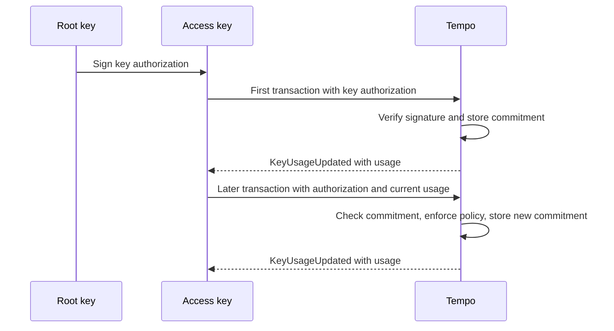

# TIP-1134: Commitment-Based Key Authorizations

## Abstract

This TIP stores each access key as one commitment instead of several slots that represent its key structure. Transactions using the key carry its key authorization and current spending state, which the protocol checks against the commitment. Keys with limits or scopes become up to 92% cheaper to authorize.

## Motivation

Access keys let an account delegate bounded spending to an app or agent. AccountKeychain stores each key, limit, and call scope in separate slots at [TIP-1000](./tip-1000.md)'s 250,000 gas apiece. A trading agent's key with daily limits on three stablecoins, scoped to the Stablecoin DEX, writes 11 slots costing 2,769,100 gas.

Every device, app, and agent pays that again. Under this TIP, the same key costs 264,720 gas, 90% less: about $0.0032 at the [TIP-1067](./tip-1067.md) base-fee cap instead of $0.033. One hash of the signed policy and its spending state replaces slots that exist only to recheck that policy.

### Alternatives considered

Committing all of an account's keys under one root with Merkle proofs cuts later keys to about 12,500 gas. It also adds proof construction, a tree that wallets or relays must maintain, and contention between every key of an account. This TIP trades that saving for a smaller change.

Re-verifying a carried signed authorization on every use needs no commitment, but pays for signature verification each time and still needs storage for spending counters and revocation. One stored hash covers counters and revocation together, and the authority's signature is verified only once, when the key is created.

## Assumptions

[TIP-0001](./tip-0001.md), [TIP-1011](./tip-1011.md), [TIP-1049](./tip-1049.md), [TIP-1053](./tip-1053.md), and [TIP-1111](./tip-1111.md) keep defining key authorizations, their signers, and their policies; this TIP changes only how AccountKeychain stores a key and what later transactions carry. Stored keys keep working unchanged, and each key ID uses exactly one of the two forms.

Applications must track each committed key's authorization and latest spending state, which every transaction re-supplies. The protocol publishes the latest state in an event, so a lost copy can be recovered from chain data. If an application cannot supply it, the key stays unusable until then, but revocation still works.

---

# Specification

A committed key is created by the same signed key authorization used today, with an empty usage list. Later transactions signed by the key carry that authorization again with its current usage; the protocol checks both against the stored commitment, enforces the policy, and stores the updated commitment.



## Terminology

| Term | Meaning |
|---|---|
| Authority | The root key of a primitive account, the owner quorum of a configurable account, or an active admin key. |
| Stored key | An access key kept as a key record, limit rows, and scope rows under TIP-0001 and TIP-1011. |
| Committed key | An access key kept as one commitment slot under this TIP. |
| Usage | A committed key's spending state: the remaining amount and period end for each limit. |

## Storage

```text
keyCommitments[account][keyId] = 0                                    // no committed key
                               = bytes32(1)                           // revoked
                               = keccak256(auth_hash || rlp(usage))   // active committed key

auth_hash = keccak256(rlp(authorization))   // the existing KeyAuthorization signing hash
usage     = [Usage, ...]                    // NEW: one entry per TokenLimit, in authorization order
Usage     = [remaining, period_end]         // u256 amount left in the period; u64 period end, 0 if one-time
```

A committed key occupies one slot in a new AccountKeychain mapping, replacing the key record, limit rows, and scope rows a stored key writes. A key ID may hold a stored record or a commitment, never both, and a revoked commitment keeps its marker so the key never returns.

Usage starts with each `remaining` equal to its limit, and `period_end` zero for one-time limits or the creation block's timestamp plus `period` for periodic ones. Spending and rollover follow TIP-1011 exactly, so a committed key enforces the same limits as a stored key with the same authorization.

## Signing

```text
auth_hash         = keccak256(rlp(authorization))     // unchanged; signed by the authority

tx_signature_hash = keccak256(0x76 || rlp([           // unchanged TIP-0001 sender signing hash
    chain_id, max_priority_fee_per_gas, max_fee_per_gas, gas_limit, calls, access_list,
    nonce_key, nonce, valid_before, valid_after,
    fee_token,                // 0x80 when sponsored
    fee_payer_signature,      // 0x00 placeholder when sponsored, else 0x80
    aa_authorization_list,
    key_authorization?,       // includes usage for committed keys
]))

sender_signature  = 0x04 || account || inner_signature                 // unchanged V2 keychain signature
inner_digest      = keccak256(0x04 || tx_signature_hash || account)    // signed by the access key
```

Nothing new is signed. The authority signs `auth_hash` exactly as today, and the access key signs transactions with the V2 keychain signature (`0x04`). Because `key_authorization` sits inside TIP-0001's sender signing hash, the access key also signs the usage it carries, so nobody else can alter it.

## Transaction encoding

```text
0x76 || rlp([
    chain_id,
    max_priority_fee_per_gas,
    max_fee_per_gas,
    gas_limit,
    calls,
    access_list,
    nonce_key,
    nonce,
    valid_before,
    valid_after,
    fee_token,
    fee_payer_signature,
    aa_authorization_list,
    key_authorization?,   // CHANGED: may carry a third element, usage
    sender_signature,
])

key_authorization = rlp([
    authorization,   // KeyAuthorization, unchanged
    signature,       // authority signature over auth_hash; may be 0x80 once the key is committed
    usage?,          // NEW: absent for stored keys; [] to create a committed key; current usage afterwards
])
```

| Element | Status | Description |
|---|---|---|
| `authorization` | Unchanged | The TIP-0001 `KeyAuthorization`, including its TIP-1011, TIP-1049, and TIP-1053 fields. |
| `signature` | Unchanged | Required when creating a key. Afterwards it may be repeated or left as `0x80`, and the protocol does not verify it. |
| `usage` | **New** | Present only for committed keys: `[]` at creation, then the latest usage from `KeyUsageUpdated`. |

A two-element `key_authorization` is a stored-key authorization and behaves exactly as today. A three-element one targets a committed key: it creates the key when `keyCommitments` holds zero, and otherwise proves the stored commitment. Transactions without the third element keep byte-identical encodings, digests, and hashes.

## Creating a committed key

Creation reuses today's authorization path unchanged: the same signer rules, chain ID check, expiry, policy, and TIP-1053 witness checks, and the same authorize-and-use behavior. The key ID must have neither a stored record nor a commitment, `usage` must be `[]`, and `is_admin` must be false.

After fee collection and before calls execute, the protocol initializes usage, stores the commitment, and emits `KeyAuthorized`; for keys with limits, `KeyUsageUpdated` follows after fee settlement. Like an inline stored-key authorization, creation persists even when execution reverts or halts. Admin keys stay stored, having no limits or scopes.

## Using a committed key

A transaction signed by a committed key must carry a three-element `key_authorization` whose `authorization.key_id` matches the keychain signer. The protocol requires `keccak256(auth_hash || rlp(usage))` to equal the stored commitment, the signature type to match `key_type`, and `block.timestamp` to be below `expiry`.

The key then behaves exactly like a stored access key with the same authorization: TIP-1011 call scopes, spending limits, and the contract-creation ban apply, and `getTransactionKey` returns its key ID. Limit checks read and update `usage` in memory, and those updates revert with their call frame.

### Settling usage

Fee charges against a limit follow stored-key rules: the maximum fee is debited before execution and the unused part refunded afterward, whatever the outcome. Execution spending applies only when the batch succeeds. After fee settlement, the protocol stores the new commitment and emits `KeyUsageUpdated` once if usage changed.

Each transaction proves current usage, so two in-flight transactions from one limited key conflict: once the first lands, the second is invalid until rebuilt with new usage and re-signed by the access key, without a user prompt. Keys without limits never change their commitment, and different keys never conflict.

## Revoking and updating keys

`revokeKey` works for both forms and needs no extra data: for a committed key it writes `bytes32(1)` and emits `KeyRevoked`. A revoked key ID can never be authorized again, matching stored keys. Pending transactions from that key become invalid, because their commitment no longer matches.

`updateSpendingLimit`, `setAllowedCalls`, and `removeAllowedCalls` reject committed keys with `InvalidKeyId`; to change a committed key's policy, revoke it and authorize a new key. Existing getters such as `getKey` report stored keys only, `getKeyCommitment` returns a committed key's slot, and TIP-1049's `verifyKeychain` treats committed keys as unknown.

## Failure behavior

| Case | Result |
|---|---|
| Invalid creation signature, existing record, mismatched commitment, or expired key | Transaction invalid. Nothing is written. |
| Call-scope failure | Execution fails before the first call. Creation and fee charges persist. |
| Batch reverts or halts | Creation and fee charges persist. Execution spending rolls back. |
| Batch succeeds | Creation, fee charges, and spending persist. |

Commitment checks use the state at the transaction's position in the block, so pools must revalidate pending committed-key transactions whenever that key's commitment changes. A stale transaction is never included and charges nothing; the application rebuilds it from the latest `KeyUsageUpdated` event and resubmits.

## AccountKeychain interface

```solidity
/// @title Committed-key additions to the AccountKeychain precompile
/// @notice Served at 0xAAAAAAAA00000000000000000000000000000000 alongside IAccountKeychain.
interface IAccountKeychainCommitments {
    /// @notice Emitted once per transaction, after fee settlement, when a committed key
    /// with limits is created or its usage changes.
    /// @param account The account that owns the key.
    /// @param keyId The committed key.
    /// @param usage The RLP-encoded usage list the key's next transaction must carry.
    event KeyUsageUpdated(address indexed account, address indexed keyId, bytes usage);

    /// @notice Returns a key's commitment slot.
    /// @return commitment Zero when absent, bytes32(1) when revoked, otherwise the active commitment.
    function getKeyCommitment(address account, address keyId)
        external
        view
        returns (bytes32 commitment);
}
```

Creation and revocation reuse the existing `KeyAuthorized` and `KeyRevoked` events, and spends keep emitting TIP-1011's `AccessKeySpend`. `KeyUsageUpdated` carries the exact bytes the next transaction needs, so applications copy them forward instead of reconstructing fee refunds and period rollovers from receipts.

## Limits

A committed key's `key_authorization` element must not exceed 4,096 bytes, and `usage` must hold exactly one canonical entry per limit. Check both while decoding, before hashing or signature verification, so unpaid validation work stays bounded; scope and limit checks then read memory and charge no storage gas.

## Gas

### Schedule

```text
H(n)     = 30 + 6 * ceil(n / 32)                 // keccak256 over n bytes
E(n)     = 1,500 + 8 * (64 + 32 * ceil(n / 32))  // LOG3 cost of KeyUsageUpdated carrying n usage bytes
u        = len(rlp(usage))

creation = signer_gas                             // as today: 3,000 secp256k1, 8,000 P256, 8,000 + data WebAuthn,
                                                  // or TIP-1114's V for a multisig signer
         + 4,200                                  // checks for an existing stored record and commitment
         + 250,000                                // one commitment slot (TIP-1000)
         + 2,000                                  // processing and KeyAuthorized
         + calldata_gas(key_authorization) + H(len(rlp(authorization))) + H(32 + u)
         + E(u) if the key has limits             // KeyUsageUpdated
         + 3,600 if a witness is present          // TIP-1053 burn check and event

use      = inner_signature_gas + 3,000            // unchanged keychain charge; its cold read now hits the commitment
         + calldata_gas(key_authorization) + H(len(rlp(authorization))) + 2 * H(32 + u)
         + 2,900 + E(u) if the key has limits     // reset write and KeyUsageUpdated
```

Creation replaces the stored path's limit slots, scope slots, and scope bookkeeping charge with one slot plus calldata for the carried element. A transaction that creates and uses a key pays the creation formula, the keychain charge, one hash, and 100 gas to rewrite the slot, emitting one `KeyUsageUpdated`.

### Initialization savings

| Policy | Stored slots | Stored gas | Committed gas | Saving |
|---|---:|---:|---:|---:|
| No limits or scopes | 1 | 262,100 | 260,894 | 0.5% |
| One daily limit | 3 | 762,100 | 263,480 | 65.4% |
| One daily limit, one transfer recipient | 13 | 3,281,100 | 264,120 | 92.0% |
| Three daily limits, one call target | 11 | 2,769,100 | 264,720 | 90.4% |

Figures assume a secp256k1 signer, chain 4217, an expiry, and daily periods; a WebAuthn signer adds about 8,700 gas. Stored figures use the current intrinsic formula. Unrestricted keys gain almost nothing, since they already use one slot. Benchmarks must confirm these figures.

### Fees at the base-fee cap

| Transaction | Stored key | Committed key |
|---|---:|---:|
| Authorize a key with one daily limit | 762,100 gas ($0.0091) | 263,480 gas ($0.0032) |
| Authorize and use it for a TIP-20 transfer | 815,100 gas ($0.0098) | 316,622 gas ($0.0038) |

Fees use the TIP-1067 cap of `1.2 × 10^10` attodollars per gas and [TIP-1010](./tip-1010.md)'s 50,000-gas TIP-20 transfer. The committed key remains above a $0.001 initialization target because its slot still costs 250,000 gas; reaching that target requires sharing one slot across an account's keys.

### Per-use cost

| Policy | Signature omitted | Signature repeated |
|---|---:|---:|
| No limits or scopes | 3,664 | 4,736 |
| One daily limit | 9,330 | 10,386 |
| One daily limit, one transfer recipient | 9,970 | 11,026 |
| Three daily limits, one call target | 10,904 | 11,960 |

Per-use gas covers the keychain charge, calldata for the carried element, hashing, and, for limited keys, the reset write and event. A stored key pays the same 3,000-gas keychain charge plus cold reads and a reset write for each limited token it spends, so per-use costs stay comparable.

## Activation

Gate the three-element `key_authorization`, the `keyCommitments` mapping, `getKeyCommitment`, and `KeyUsageUpdated` on activation. Before activation, a three-element `key_authorization` is malformed, including during historical replay. Stored keys and transactions without the third element keep their current encodings, hashes, gas, and behavior. This TIP changes no other protocol behavior.

# Tooling

SDKs reuse their existing `KeyAuthorization` builders and keychain signing. For committed keys they append `usage`, store the authorization alongside the access key, and copy `usage` from the latest `KeyUsageUpdated` event into each new transaction. Gas estimation and simulation accept the same three-element field.

Pools revalidate pending committed-key transactions when that key's commitment changes, and drop those signed by revoked keys. Wallets show the full policy before the authority signs, as today. Applications that lose their copy recover the authorization from the creating transaction and the usage from the key's latest event.

## Relay API

Committed keys trade storage for carried data: every transaction re-supplies the authorization and current usage. Tempo's Relay API keeps both for clients, reading each key's authorization from its creating transaction and usage from `KeyUsageUpdated`. Its `eth_fillTransaction` inserts the current `key_authorization`, so clients hold only the access key.

The relay is trusted only for availability: it cannot sign for the key, a wrong copy fails the commitment check, and withheld state is recoverable from chain data. It holds a limited key's next fill until the previous transaction lands, so concurrent requests wait instead of going stale.

# Observability

| Event | Fields | Question it answers |
|---|---|---|
| `KeyAuthorized` (existing) | `account`, `publicKey`, `signatureType`, `expiry` | Which key was created? |
| `KeyUsageUpdated` | `account`, `keyId`, `usage` | What usage must the key's next transaction carry? |
| `AccessKeySpend` (TIP-1011) | `account`, `publicKey`, `token`, `amount`, `remainingLimit` | How much did a committed key spend? |
| `KeyRevoked` (existing) | `account`, `publicKey` | Which key was revoked? |

Indexers distinguish committed keys by the three-element field in the creating transaction or by `getKeyCommitment`. No other new events are needed: creation, revocation, and spending reuse existing events, and `KeyUsageUpdated` makes each key's state recoverable without replaying fee settlement or period rollover.

Nodes SHOULD export counts of committed-key transactions rejected for a mismatched commitment, labeled by whether the key was revoked, and the share of keys created in each form. A rising mismatch rate for live keys shows applications submitting stale usage, usually from concurrent transactions on one key.

# Threat Model

| Actor | Trust assumption |
|---|---|
| Authority | Trusted to sign key authorizations and revoke keys, as today. |
| Access-key holder | Trusted only within the authorization's expiry, limits, and call scopes. |
| Application | Supplies the authorization and usage. A wrong copy only makes its own transactions invalid. |
| Fee payer or relay | May fill the carried element; a wrong copy only invalidates the transaction. Cannot alter it once the access key signs. |

Safety rests on keccak256: no authorization or usage other than the stored one can match the commitment, so an access key can neither widen its policy nor reset its limits. Revocation leaves a permanent marker, so a revoked authorization cannot be replayed, and it needs no data from the application.

Out of scope: a compromised access key still spends within its remaining limits, and the protocol neither stores nor protects key material. Unpaid validation work for an invalid transaction is bounded by the 4,096-byte element and two hashes, before any signature verification.

# Invariants

1. A committed key occupies exactly one AccountKeychain slot, whatever its policy.
2. A key ID never has both a stored record and a commitment.
3. A committed key acts only while its authorization and usage match the stored commitment and it has not expired.
4. A committed key enforces exactly the limits, call scopes, and expiry that a stored key with the same authorization would.
5. A revoked key ID can never be authorized again in either form.
6. Creation and fee charges survive execution failure; execution spending rolls back with it.
7. Transactions without the third element behave exactly as before activation.

## Test Cases

1. Create committed keys under every signer type, including authorize-and-use and TIP-1053 witnesses.
2. Use a committed key with matching usage, stale usage, a modified authorization, and an omitted or repeated signature.
3. Match stored-key behavior for one-time and periodic limits, rollovers, call scopes, and the contract-creation ban.
4. Revert execution after a spend and confirm the fee charge persists while the spend rolls back.
5. Revoke a committed key, then reject its pending transactions and any new authorization for the same key ID.
6. Reject a three-element `key_authorization` for a key ID with a stored record, and an admin authorization in committed form.
7. Confirm `KeyUsageUpdated` always holds the usage the next transaction needs, including after fee refunds.
8. Exercise the 4,096-byte bound and canonical `usage` decoding.
