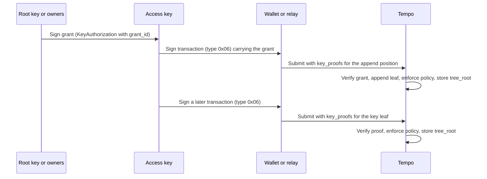

# TIP-1134: Commitment-Based Key Authorizations

## Abstract

This TIP stores access keys in a fixed-size account-leaf commitment instead of AccountKeychain storage. Each key's policy and spending state is a leaf in the account's Merkle tree. Transactions carry the leaf and its proof, so authorizing a key creates no storage slots and costs 90% to 99% less gas.

## Motivation

Access keys let a passkey or multisig account delegate bounded spending to an app or agent. AccountKeychain stores each key, limit, and call scope in storage slots, which [TIP-1000](./tip-1000.md) prices at 250,000 gas each. A key with one daily limit writes three slots and costs 762,100 gas to authorize.

At the [TIP-1067](./tip-1067.md) base-fee cap, that authorization costs about $0.009: more than fifteen TIP-20 transfers, and nine times the roughly $0.001 hosted signers charge per signature. Every device, app, and agent pays it again. This TIP targets key initialization below $0.001 without weakening protocol enforcement.

### Alternatives considered

Carrying a signed certificate in every transaction avoids registration, but each use repeats signature verification and spending counters still need at least one 250,000-gas slot per token. Reusable counter slots amortize that allocation across key rotations but still pay it once. Neither approach reaches the target.

A single 32-byte root over owners and keys was also considered. It would force every owner signature check, configuration update, and `verifyMultisig` call to carry key-tree data that changes with every spend. Storing the configuration hash and key-tree root as separate words avoids that coupling.

## Assumptions

[TIP-1108](./tip-1108.md) provides the account-leaf extension, [TIP-1114](./tip-1114.md) defines configurations and multisig signatures, and [TIP-1011](./tip-1011.md) defines expiry, limits, and call scopes. Stored keys keep working unchanged. An account may hold stored and committed keys at once, and each transaction's signature type selects which kind it uses.

Wallets or relays keep each account's leaves and build proofs; the protocol stores only the tree's root. Proofs are unsigned, so stale ones are rebuilt without new signatures. If nobody can rebuild them, committed keys stop working until the tree is reconstructed from chain data or cleared.

---

# Specification

Committed keys work in two steps. The account's authority signs a grant, which a transaction appends to the account's key tree. Later transactions signed by the key carry its leaf and proof; the protocol verifies them against the stored root, enforces the policy, and stores the updated root.



## Terminology

| Term | Meaning |
|---|---|
| Authority | The root key of a primitive account, or the owner quorum of a configurable account. |
| Stored key | An access key kept in AccountKeychain storage under TIP-0001 and TIP-1011. |
| Committed key | An access key kept as a leaf in its account's key tree. |
| Grant | A signed `KeyAuthorization` carrying `grant_id`. It creates a committed key. |
| Key tree | A binary Merkle tree over an account's committed keys. |
| Key proofs | Unsigned transaction data proving the key-tree positions a transaction uses. |

## Account commitment

```text
no commitment: rlp([nonce, balance, storageRoot, codeHash])
layout 0x00:   rlp([nonce, balance, storageRoot, codeHash, 0x00 || config_hash])
layout 0x01:   rlp([nonce, balance, storageRoot, codeHash,
                    0x01 || config_hash || tree_root || uint16(key_count) || uint64(next_grant_id)])
```

| Field | Size | Description |
|---|---|---|
| `0x01` | 1 byte | **New.** Layout tag for accounts with a key tree. |
| `config_hash` | 32 bytes | TIP-1108 configuration hash. Zero when the account has no configuration. |
| `tree_root` | 32 bytes | **New.** Root of the key tree. Zero when no committed keys are active. |
| `key_count` | 2 bytes | **New.** Number of committed keys, big-endian. |
| `next_grant_id` | 8 bytes | **New.** Lowest grant ID the next grant may use, big-endian. |

The first key-tree write moves an account to layout `0x01`, and the account never leaves it. The field stays 75 bytes however many keys exist, and revoking every key keeps `next_grant_id`, so old grants cannot return. Reject other tags, other lengths, and layout `0x01` with `next_grant_id` zero.

Layout `0x01` is authenticated state that TIP-1108's preservation rules cover, including state roots, proofs, execution witnesses, snapshots, and reorgs. Such an account is never deleted as empty. Only grants, committed-key use, and the AccountKeychain functions below may write `tree_root`, `key_count`, or `next_grant_id`.

### Configuration interaction

Configuration logic reads only `config_hash`, in either layout. TIP-1114 authorization, [TIP-1109](./tip-1109.md) updates, and [TIP-1113](./tip-1113.md) migration keep the key-tree fields whenever they write it. A zero `config_hash` means the account has no configuration, so [TIP-1112](./tip-1112.md) leaves its primitive root authority in place.

Spending through a committed key changes `tree_root` but never `config_hash`, so owner signatures, multisig witnesses, and `verifyMultisig` results stay valid while delegates spend. Owner rotation under TIP-1109 and migration under TIP-1113 keep every committed key, matching their treatment of stored keys.

## Key leaves

```text
KeyLeaf = [
    grant_id,       // u64: grant ID assigned when the key was granted
    key_type,       // u8: 0 secp256k1, 1 P256, 2 WebAuthn, 3 configurable delegate (TIP-1111)
    key_id,         // address: key address, or the delegate account for type 3
    expiry,         // u64: the key is valid while block.timestamp < expiry; 0x80 if it never expires
    limits,         // [TokenLimit] (TIP-1011); 0x80 for unlimited spending
    allowed_calls,  // [CallScope] (TIP-1011); 0x80 for unrestricted calls
    usage,          // [Usage]: one entry per TokenLimit, in the same order
]

Usage     = [remaining, period_end]   // u256 amount left in the period; u64 period end, 0 if one-time
leaf_hash = keccak256("tempo:key:leaf" || rlp(KeyLeaf))
```

A leaf copies its grant's policy fields and adds `usage`, the only part that changes after the grant. Policy fields keep TIP-1011's encodings and meanings, including the difference between an absent and an empty list. A key ID may appear in several leaves; each leaf is an independent grant.

### Usage

A new leaf sets each `remaining` to its limit. A one-time limit stores `period_end` zero; a periodic limit stores the grant block's timestamp plus `period`. Spends and rollovers follow TIP-1011: spending at or after `period_end` first resets `remaining` and advances `period_end` by whole periods.

## Key tree

```text
width(n)   = 1 if n <= 1 else 2 ** ceil(log2(n))
node(a, b) = 0 if a == 0 and b == 0 else keccak256(a || b)
root(L)    = 0 if L is empty, else the Merkle root of the leaf hashes in L,
             padded with 0 to width(len(L)) and combined pairwise with node()

append(L, x)    = L + [x]
update(L, i, x) = L with L[i] replaced by x
remove(L, i)    = L with L[i] replaced by the last leaf, then the last position dropped

// Appending at n = key_count needs no siblings when n is 0 or a power of two:
//   n == 0: new root = leaf_hash
//   n >= 1: new root = node(tree_root, z), where z is leaf_hash combined with 0 for log2(n) levels
```

The stored `tree_root` equals `root(L)` for the account's ordered leaf list `L`, and `key_count` equals its length. The protocol never stores `L`; it derives each new root from the old root and the proofs. Removal fills the freed index with the last leaf, so the tree never holds gaps.

A tree with one key uses that leaf's hash as its root, so its proofs carry no siblings. Larger trees need one 32-byte sibling per level: 64 bytes for four keys, 96 bytes for eight. When removal leaves a power-of-two count, the width halves and every proof shortens.

### Proofs

A proof for index `i` hashes the leaf with its siblings, leaf level first; at level `k`, the running hash goes on the left when bit `k` of `i` is zero. It verifies when the result equals `tree_root`. A proof carries exactly `log2(width(key_count))` siblings unless it targets the append position.

The append position is index `key_count`, which holds zero. When `key_count` is zero or a power of two, the append proof carries no siblings, and the new root follows from `tree_root` as shown above. Otherwise the append proof supplies that position's siblings from the current tree.

## Signing

### Grant digest

```text
signed_key_authorization = rlp([key_authorization, signature])

key_authorization = [
    chain_id,        // u64: MUST equal the current chain ID
    key_type,        // u8: as in KeyLeaf
    key_id,          // address: as in KeyLeaf
    expiry?,         // u64; 0x80 when absent
    limits?,         // [TokenLimit]; 0x80 when absent
    allowed_calls?,  // [CallScope]; 0x80 when absent
    witness?,        // bytes32 (TIP-1053); 0x80 when absent
    is_admin?,       // TIP-1049; MUST be 0x80, since committed keys are never admin keys
    account,         // address (TIP-1049); REQUIRED: the account receiving the key
    grant_id,        // NEW u64: the leaf's grant ID; its presence makes this a grant
]

grant_digest = keccak256(rlp(key_authorization))

primitive root key        signs grant_digest
configurable owners       sign  multisig_digest(grant_digest, account, version)   (TIP-1114)
active stored admin key   signs grant_digest                                      (TIP-1049)
```

A grant is a TIP-0001 `KeyAuthorization` with a new trailing `grant_id` field, which also makes `account` mandatory. Absent optional fields before `grant_id` encode as `0x80`. Stored-key authorizations never carry `grant_id`, so a grant digest cannot authorize a stored key, and a stored-key digest cannot create a grant.

The signer must be the account's authority or an active stored admin key, and must also sign the carrying transaction; an authority's grant may instead ride in a transaction signed by the granted key. Committed keys never sign grants, and owner rotation invalidates unsubmitted multisig grants because `version` changes.

### Committed-key signature

```text
sender_signature  = 0x06 || account || uint64(grant_id) || inner_signature
inner_digest      = keccak256(0x06 || tx_signature_hash || account || uint64(grant_id))
tx_signature_hash = TIP-0001 sender signing hash over every field before sender_signature
```

| Field | Size | Description |
|---|---|---|
| `0x06` | 1 byte | **New.** Signature type for committed keys. |
| `account` | 20 bytes | The sending account, whose key tree holds the key. |
| `grant_id` | 8 bytes | **New.** Grant ID of the signing key's leaf, big-endian. |
| `inner_signature` | Variable | A primitive signature over `inner_digest`, or a TIP-1114 multisig signature over `multisig_digest(inner_digest, key_id, version)` for a type 3 delegate. |

The format extends the V2 keychain signature (`0x04`) with `grant_id`. Binding `grant_id` stops a relay from swapping in another grant for the same key, and binding `account` stops cross-account replay. `tx_signature_hash` is TIP-0001's sender signing hash, which covers `key_authorization` but not `key_proofs`.

Reject type `0x06` before activation, nested in another keychain signature, in subblocks, in authorization lists, and as a fee-payer signature. A `0x06` transaction cannot carry a stored-key authorization. `SignatureVerifier` methods from TIP-1020 and TIP-1049 reject it, since verification needs the transaction's proofs.

## Transaction encoding

```text
0x76 || rlp([
    chain_id,
    max_priority_fee_per_gas,
    max_fee_per_gas,
    gas_limit,
    calls,
    access_list,
    nonce_key,
    nonce,
    valid_before,
    valid_after,
    fee_token,
    fee_payer_signature,
    aa_authorization_list,
    key_authorization?,   // CHANGED: may carry a grant
    sender_signature,     // CHANGED: may use type 0x06
    key_proofs?,          // NEW: unsigned key-tree proofs; omitted when unused
])
```

| Field | Status | Description |
|---|---|---|
| `key_authorization` | Changed | `rlp([key_authorization, signature])`. A present `grant_id` makes it a grant appended to the key tree. |
| `sender_signature` | Changed | May be a committed-key signature (`0x06`). |
| `key_proofs` | **New** | `KeyProof` entries for every key-tree position the transaction reads or changes. |

`key_proofs` follows the sender signature, so the sender digest, the fee-payer digest, and [TIP-1009](./tip-1009.md)'s expiring-nonce hash all exclude it. A relay can refresh stale proofs without new signatures; only the transaction hash changes. Transactions without key proofs keep byte-identical encodings and hashes.

### Key proofs

```text
key_proofs = [KeyProof, ...]   // ascending index, no duplicates, at most 32

KeyProof = [
    index,      // u16: tree position
    siblings,   // [bytes32]: one per tree level, leaf level first
    leaf,       // KeyLeaf if the transaction reads the leaf, its 32-byte hash if it only moves it,
                // or 0x80 for the append position
]
```

The list holds exactly one proof per position the transaction reads or changes: the signing key's leaf, the append position for a grant, and each revoked leaf plus every last leaf moved into a freed position. Missing, extra, unordered, or non-minimal proofs make the transaction invalid.

For a given state and transaction exactly one list is valid, so nobody can inflate a pending transaction's fee by padding its proofs. Every proof verifies against `tree_root` at the transaction's position in the block, and the protocol derives the resulting root from the proven nodes.

## Granting a key

A grant must target the sending account on the current chain and satisfy the signer rules above. Require `grant_id` at least `next_grant_id` and below the u64 maximum, `key_count` below 65,535, an encoded leaf of at most 4,096 bytes, and TIP-1011's policy validity rules.

After fee collection and before calls execute, append the leaf, set `next_grant_id` to `grant_id + 1`, and emit `CommittedKeyAuthorized`. A present [TIP-1053](./tip-1053.md) witness keeps its burn check and event. Like inline stored-key authorizations, grants persist even when execution reverts or halts.

## Using a key

A type `0x06` signature names the sender. The transaction's proofs must include a full leaf with the signature's `grant_id`, unless the same transaction grants it. Recover the inner signer and require its key type and key ID to match the leaf. Reject the transaction once `block.timestamp` reaches `expiry`.

The key then behaves like a stored access key: TIP-1011 call scopes, spending limits, and the contract-creation ban apply, `getTransactionKey` returns `key_id`, and keychain mutators reject it. Limit checks read and update the leaf's `usage` in memory instead of AccountKeychain storage.

### Settling usage

Fee charges against a limit follow stored-key rules: the maximum fee is debited before execution and the unused part refunded afterward, whatever the outcome. Execution spending applies only when the batch succeeds. After fee settlement, the protocol recomputes the leaf and stores the new `tree_root`.

Keys without limits never change their leaf, so using them leaves `tree_root` and other pending proofs untouched. A same-transaction grant and use appends the leaf, debits fees against its fresh limits, and reuses the append proof, so the transaction needs only one proof.

## Revoking keys

Callers allowed to call `revokeKey` under [TIP-1049](./tip-1049.md) revoke a committed key with a top-level `revokeCommittedKey(grantId)` call. The proofs must include the revoked leaf in full and the last leaf. The protocol moves the last leaf into the revoked position, decrements `key_count`, and emits `CommittedKeyRevoked`.

Revocation follows execution rollback, so a failed batch keeps the key. Requiring top-level calls lets nodes derive the needed proofs from the transaction alone. `revokeAllCommittedKeys` clears the tree without proofs, for lost tree data or signing out everywhere. Revoked grant IDs stay below `next_grant_id`, so their grants never return.

## Cancelling pending grants

Signed grants that never reached the chain are cancelled with `cancelPendingGrants(nextGrantId)`, which raises `next_grant_id` and invalidates every unsubmitted grant below it. It needs no proofs and uses the revocation caller rules. A TIP-1053 witness burn also cancels a pending grant that carries that witness.

## Failure behavior

| Case | Result |
|---|---|
| Invalid grant, signature, or proofs; expired key; exceeded bound | Transaction invalid. Nothing is written. |
| Call-scope failure | Execution fails before the first call. The grant and fee charges persist. |
| Batch reverts or halts | The grant and fee charges persist. Execution spending and revocations roll back. |
| Batch succeeds | The grant, fee charges, spending, and revocations persist. |

Proofs are checked against the state at the transaction's position in the block. An earlier transaction that changes the same tree invalidates later proofs, so pools must revalidate. Because proofs are unsigned, a wallet or relay can rebuild them and resubmit without asking the user.

## AccountKeychain interface

```solidity
/// @title Committed-key additions to the AccountKeychain precompile
/// @notice Served at 0xAAAAAAAA00000000000000000000000000000000 alongside IAccountKeychain.
interface IAccountKeychainCommitted {
    /// @notice Emitted when a grant adds a committed key.
    /// @param account The account receiving the key.
    /// @param keyId The key address, or the delegate account for type 3.
    /// @param grantId The grant ID of the new leaf.
    /// @param index The leaf's position in the key tree.
    event CommittedKeyAuthorized(
        address indexed account,
        address indexed keyId,
        uint64 grantId,
        uint16 index
    );

    /// @notice Emitted when a committed key is revoked.
    event CommittedKeyRevoked(address indexed account, address indexed keyId, uint64 grantId);

    /// @notice Emitted when an account revokes every committed key.
    event CommittedKeysCleared(address indexed account);

    /// @notice Emitted when unsubmitted grants below `nextGrantId` are cancelled.
    event PendingGrantsCancelled(address indexed account, uint64 nextGrantId);

    /// @notice The call is not a top-level call from the transaction sender.
    error TopLevelCallRequired();

    /// @notice `nextGrantId` does not exceed the current `next_grant_id`.
    error InvalidGrantId();

    /// @notice The key already left the tree earlier in this transaction.
    error CommittedKeyNotFound(uint64 grantId);

    /// @notice Revokes the caller's committed key `grantId`.
    /// @dev The transaction's proofs must cover the revoked leaf and the last leaf.
    function revokeCommittedKey(uint64 grantId) external;

    /// @notice Revokes every committed key of the caller without proofs and keeps `next_grant_id`.
    /// @dev Does nothing when the caller has no committed keys.
    function revokeAllCommittedKeys() external;

    /// @notice Raises the caller's `next_grant_id`, cancelling unsubmitted grants below it.
    function cancelPendingGrants(uint64 nextGrantId) external;

    /// @notice Returns an account's key-tree fields, including changes earlier in the transaction.
    /// @return root The key-tree root, or zero for no committed keys.
    /// @return count The number of committed keys.
    /// @return nextGrantId The lowest grant ID the next grant may use.
    function getKeyTree(address account)
        external
        view
        returns (bytes32 root, uint16 count, uint64 nextGrantId);
}
```

Mutating functions must be top-level calls from the transaction sender, so the required proofs follow from the transaction alone. They revert with `UnauthorizedCaller` wherever `revokeKey` would, and charge 5,000 gas for the tree write. Existing getters such as `getKey` report stored keys only.

## Limits

| Bound | Value |
|---|---|
| Committed keys per account | 65,535 |
| Siblings per proof | 16 |
| Proofs per transaction | 32 |
| Encoded `KeyLeaf` | 4,096 bytes |

Check these bounds while decoding, before hashing or signature verification, and compute intrinsic gas and fee affordability before verifying proofs. Unpaid work for an invalid transaction is then bounded by 32 proofs, each needing at most 16 node hashes and one bounded leaf hash.

## Gas

### Schedule

```text
H(n)       = 30 + 6 * ceil(n / 32)                // keccak256 over n bytes, as in TIP-1114

grant      = signer_gas                            // 3,000 secp256k1, 8,000 P256, 8,000 + data WebAuthn,
                                                   // or V for a multisig signer (TIP-1114)
           + calldata_gas(rlp(key_authorization))
           + H(len(rlp(key_authorization)))
           + 3,000                                 // processing and CommittedKeyAuthorized
           + 3,600 if a witness is present         // TIP-1053 burn check and event

use        = inner_signature_gas + 900             // TIP-0001 or TIP-1111 charge, plus processing

proofs     = calldata_gas(rlp(key_proofs))
           + sum over proofs of 2 * (H(14 + len(rlp(leaf))) + (len(siblings) + 1) * H(64))
                                                   // leaf: the KeyLeaf or hash the proof reads or writes

tree_write = 20,000 if the account has no key tree, else 5,000
```

Intrinsic gas adds `grant`, `use`, and `proofs` as applicable, plus one `tree_write` when the transaction carries a grant or uses a key with limits. Revocation and cancellation calls charge 5,000 gas each during execution, plus standard precompile input and event costs.

Tree writes follow TIP-1108's account-field pricing rather than TIP-1000 slot creation, because the field is fixed-size and limited to one per account. If a write makes an empty account nonempty, also charge TIP-1000's new-account cost unless the transaction already pays its `nonce == 0` charge.

### Initialization savings

| Policy | Stored slots | Stored gas | Committed gas, first key | Committed gas, later keys | Saving, first key | Saving, later keys |
|---|---:|---:|---:|---:|---:|---:|
| No limits or scopes | 1 | 262,100 | 27,218 | 12,218 | 89.6% | 95.3% |
| One daily limit | 3 | 762,100 | 27,516 | 12,516 | 96.4% | 98.4% |
| One daily limit, one transfer recipient | 13 | 3,281,100 | 28,164 | 13,164 | 99.1% | 99.6% |
| Two limits, two call targets | 11 | 2,776,100 | 28,550 | 13,550 | 99.0% | 99.5% |

Figures cover only the authorization: a secp256k1 signer, chain 4217, an expiry, and one-day periods. A first committed key pays the 20,000-gas tree write; later keys pay 5,000. Stored figures use the current intrinsic formula. This is specification arithmetic; benchmarks must confirm it before approval.

### Fees at the base-fee cap

| Transaction | Stored key | Committed key |
|---|---:|---:|
| Grant with one daily limit | 762,100 gas ($0.0091) | 12,516 gas ($0.00015) |
| Grant and use for a TIP-20 transfer, later key | 815,100 gas ($0.0098) | 63,416 gas ($0.00076) |
| Grant and use for a TIP-20 transfer, first key | 815,100 gas ($0.0098) | 78,416 gas ($0.00094) |

Fees use the TIP-1067 cap of `1.2 × 10^10` attodollars per gas and [TIP-1010](./tip-1010.md)'s 50,000-gas TIP-20 transfer. Both totals add that transfer to each path's authorization and signature charges. Even an account's first committed key stays below the $0.001 target.

### Per-use cost by tree size

| Policy | 1 key | 2 keys | 4 keys | 8 keys | 16 keys |
|---|---:|---:|---:|---:|---:|
| No limits or scopes | 1,644 | 2,288 | 2,916 | 3,528 | 4,140 |
| One daily limit | 7,148 | 7,760 | 8,388 | 9,000 | 9,612 |
| One daily limit, one transfer recipient | 7,784 | 8,396 | 9,024 | 9,636 | 10,280 |
| Two limits, two call targets | 8,276 | 8,888 | 9,516 | 10,160 | 10,772 |

Per-use gas for a secp256k1 key covers the proof, hashing, the 900-gas processing charge, and the tree write for limited keys. A stored key instead pays 3,000 intrinsic gas plus cold reads and a reset write per limited token, so per-use costs stay comparable while initialization falls.

## Activation

Gate type `0x06`, `grant_id`, `key_proofs`, layout `0x01`, and the new AccountKeychain functions on activation, which requires TIP-1108's account-leaf extension. Before activation, reject all of them, including during historical replay. Transactions without the new fields keep their current encodings, hashes, and behavior.

# Tooling

SDKs build grants with existing `KeyAuthorization` encoders plus `grant_id`, choosing IDs from `getKeyTree` and submitting them in order. Wallets or relays keep each account's leaves, reconstructed from inline grants, key proofs, `AccessKeySpend` events, and block timestamps, and rebuild proofs whenever `tree_root` changes. RPC requests accept `keyProofs` for simulation.

Pools revalidate pending committed-key transactions after any change to the sender's tree, and SHOULD accept a same-fee replacement whose signing hash is unchanged. Account RPCs and proofs expose the 75-byte extension under TIP-1108's rules. Wallets show each key's policy, remaining limits, and expiry before the authority signs.

# Observability

| Event | Fields | Question it answers |
|---|---|---|
| `CommittedKeyAuthorized` | `account`, `keyId`, `grantId`, `index` | Which key did a grant add, and where? |
| `CommittedKeyRevoked` | `account`, `keyId`, `grantId` | Which committed key was removed? |
| `CommittedKeysCleared` | `account` | Which account revoked every committed key? |
| `PendingGrantsCancelled` | `account`, `nextGrantId` | Which unsubmitted grants can no longer land? |
| `AccessKeySpend` (TIP-1011) | `account`, `publicKey`, `token`, `amount`, `remainingLimit` | How much did a committed key spend, and what remains? |

These events, inline grants, and each transaction's key proofs let indexers reconstruct every tree and check it against `getKeyTree`. Using a key emits no new event: spend events and the block timestamp determine its updated leaf, which keeps per-use cost low.

Nodes SHOULD export counts of committed-key transactions rejected for stale or malformed proofs, labeled by reason, and the distribution of `key_count`. A rising stale-proof rate shows relays falling behind the chain, and growing trees show proof sizes and per-use costs creeping upward.

# Threat Model

| Actor | Trust assumption |
|---|---|
| Authority | Trusted to sign grants, revoke keys, and cancel pending grants. |
| Access-key holder | Trusted only within its leaf's expiry, limits, and call scopes. |
| Wallet or relay | Untrusted for safety. It can delay or withhold proofs but cannot forge them. |
| Block builder | May order transactions so one invalidates another's proofs. This affects liveness only. |
| Fee payer | Pays fees, signs no proofs, and gains no authority. |

Safety rests on keccak256: no proof can show a leaf the stored root does not contain. `next_grant_id` stops replays after revocation, `account` and `chain_id` stop replays across accounts and chains, and the signed `grant_id` stops a relay from substituting another grant.

Out of scope: a compromised access key still spends within its remaining limits, and the protocol neither stores nor protects key material. If tree data is lost, the authority can still clear every committed key with `revokeAllCommittedKeys`, which needs no proofs, and grant new ones.

# Invariants

1. The layout `0x01` field is exactly 75 bytes for any `key_count`.
2. After every transaction, `tree_root == root(L)` and `key_count == len(L)` for the account's leaf list `L`.
3. Each grant ID is used at most once per account, and `next_grant_id` never decreases.
4. A committed key acts only while its leaf is in the tree and unexpired, and only within its TIP-1011 policy.
5. Committed-key activity never changes `config_hash`, and configuration updates never change key-tree fields.
6. For a given state and transaction, at most one `key_proofs` list is valid.
7. Grants and fee charges survive execution failure; execution spending and revocations roll back with it.
8. A zero `config_hash` never disables primitive root authority.

## Test Cases

1. Append at key counts 0 through 9 and compare each root with a reference tree.
2. Revoke first, middle, and last leaves, including counts that drop to a power of two, one, and zero.
3. Grant and use a key in one transaction, including fee debits against fresh limits.
4. Reject stale, missing, extra, unordered, and padded proofs.
5. Reject replays of revoked grants, grants for other accounts, and grants from other chains.
6. Keep grants and fee charges, and drop spending and revocations, when the batch reverts or halts.
7. Match stored-key behavior for periodic rollover, scope failures, and the contract-creation ban.
8. Cover primitive and configurable parents, stored admin signers, and type 3 delegates.
9. Preserve committed keys through TIP-1109 rotation and TIP-1113 migration.
10. Resubmit a transaction with refreshed proofs and an unchanged signature.
11. Exercise `revokeAllCommittedKeys`, `cancelPendingGrants`, and every bound at its limit.
