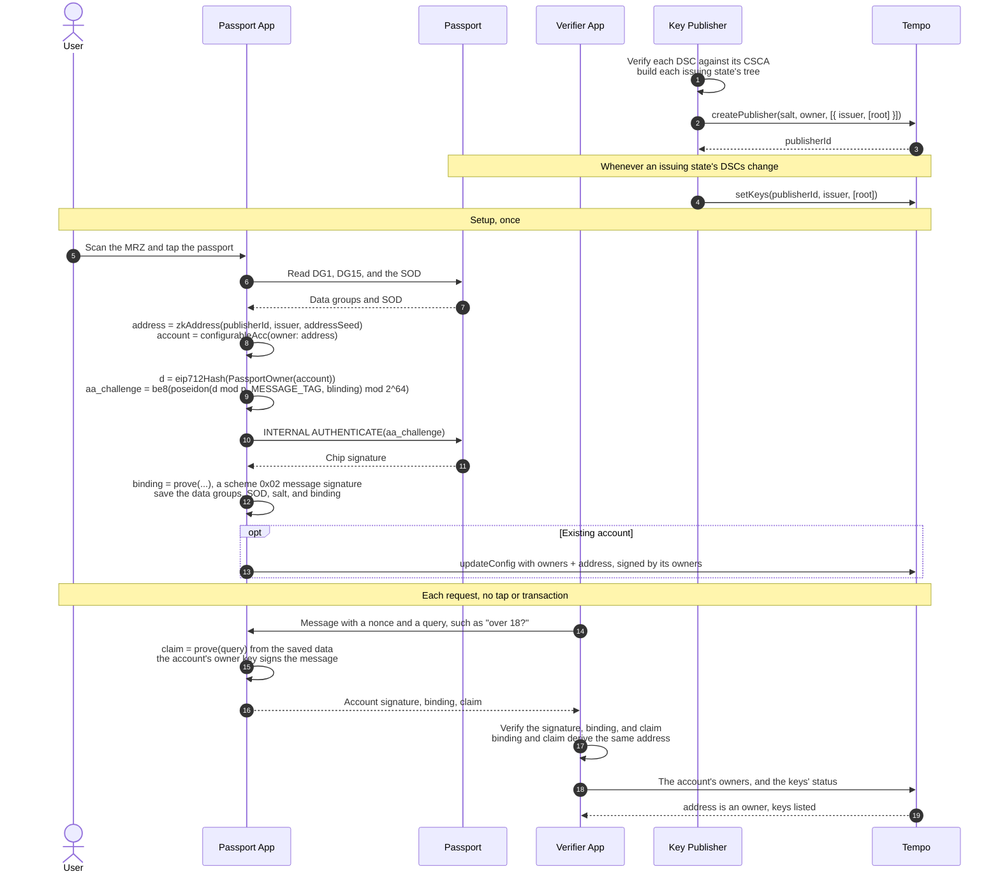

# TIP-1142: Passport Signers

## Abstract

This TIP adds scheme `0x02` to [TIP-1131](./tip-1131.md) ZK signatures: a Groth16 circuit over BN254 proving that the chip of an ICAO electronic passport, issued under a document signer listed in the [Key Publisher](./tip-1132.md), signed a challenge committing to a message or an owner approval. A passport is set up once as an owner of a configurable account, with one tap and, for a new account, no transaction. After that, apps check facts about its holder, such as a minimum age, from data saved on the phone, with no tap and no transaction.

## Motivation

Apps often need facts about the person behind an account: that they are an adult, that they are unique, or that their passport is not from a restricted state. Today that means sending identity documents to a verification provider, which keeps a copy.

Electronic passports already carry the proof. The chip stores the holder's details signed by the issuing state, and chips with Active Authentication sign a reader's challenge with a private key that never leaves the chip ([ICAO 9303-11](https://www.icao.int/sites/default/files/publications/DocSeries/9303_p11_cons_en.pdf) section 6.1). A passport owner on a configurable account ([TIP-1107](./tip-1107.md)) proves once that it holds its chip. Afterwards, the phone answers questions about the holder from saved data, and the passport's address reveals nothing about the holder.

The scheme reuses TIP-1131's signature type, address rule, encoding, and gas, and TIP-1132's Key Publisher. Only the statement differs: for OIDC, a provider-signed ID token; for passports, a chip-signed challenge on a state-signed document.

## Assumptions

- [TIP-1131](./tip-1131.md), [TIP-1132](./tip-1132.md), and [TIP-1114](./tip-1114.md) are active.
- Passports follow ICAO Doc 9303 ([Part 10](https://www.icao.int/sites/default/files/publications/DocSeries/9303_p10_cons_en.pdf), [Part 11](https://www.icao.int/sites/default/files/publications/DocSeries/9303_p11_cons_en.pdf), [Part 12](https://www.icao.int/sites/default/files/publications/DocSeries/9303_p12_cons_en.pdf)): a TD3 passport with Data Groups 1 and 15, and an EF.SOD signed by a document signer certificate (DSC) that the state's country signing CA (CSCA) issued.
- Chips in scope implement Active Authentication with RSA per 9303-11 section 6.1.2.2, using SHA-1 (trailer option 1), a 1024-bit key, and exponent 65537, and their private key cannot be extracted.
- The SOD hashes data groups and its signed attributes with SHA-256, and its DSC signs with RSASSA-PKCS1-v1_5, SHA-256, a 2048-bit modulus, and exponent 65537.
- Publishers can obtain DSCs: from the ICAO PKD, national master lists, or SODs, which carry the DSC (9303-12 section 5).
- Poseidon (circomlib parameters) and SHA-256 are collision resistant, SHA-1 is second-preimage resistant, Groth16 over BN254 is sound, and the setups each had at least one honest contributor.

---

# Specification

## Overview

For the public input, the circuit proves that:

1. a DSC key whose leaf is in the tree with root `key_hash` signed the passport's signed attributes;
2. those attributes bind an LDS security object whose hashes bind Data Group 1 (the MRZ) and Data Group 15 (the chip's Active Authentication key);
3. the chip's key signed a challenge committing to `commit_a`, `commit_b`, and a private blinding value;
4. `issuer` and `address_seed` derive from the MRZ and a private salt.

TIP-1131 checks the rest: times against the block, the publisher's list, and, for owner approvals, the access-key signature.

## Registry

This TIP adds to [TIP-1131's schemes](./tip-1131.md#schemes):

| Scheme | Statement | Namespace | Verifying key | Maximum window |
|---|---|---|---|---|
| `0x02` | ICAO TD3 passport, RSA Active Authentication (this TIP) | `0x02` (passport) | `VK_PASSPORT_RSA_V1` | 600 seconds |

- Encoding, address derivation, signed digest, verification, limits, and gas are TIP-1131's, unchanged.
- Scheme `0x02` defines a message form, used for [owner bindings](#owner-bindings).
- Onchain, scheme `0x02` is accepted only as an owner approval in a TIP-1114 multisig signature. Nodes MUST reject it as the signature of a transaction from its `zk_address` and as the root signature of a key authorization, because the chip has no clock (see [Threat Model](#threat-model)).
- `issued_at` is the time the passport app assigns to the chip's response. The chip does not attest it.
- Later passport schemes, such as ECDSA Active Authentication or other DSC algorithms, MUST use namespace `0x02` and this TIP's `issuer` and `address_seed`, so a passport keeps one address across schemes.

## Notation

- `F`, `Poseidon`, and `hash_bytes` are as in [TIP-1133](./tip-1133.md#notation) and [its hashing](./tip-1133.md#hashing).
- `be8(x)` is the 8-byte big-endian encoding of `x < 2^64`.
- `mrz` is the 88-byte TD3 machine readable zone, and `mrz[a, b)` its bytes from index `a` up to `b`.
- SHA-256 and SHA-1 are as in FIPS 180-4. Byte values are hexadecimal.

## Hashing

Nodes, publishers, and passport apps use the same definitions:

```text
issuing_state   = mrz[2, 5)       // MRZ code, fillers included: "UTO", "D<<"
document_number = mrz[44, 53)
birth_date      = mrz[57, 63)     // YYMMDD

issuer       = hash_bytes(issuing_state, 3)
leaf         = Poseidon(2, hash_bytes(n_dsc as 256 big-endian bytes, 256))
key_hash     = the root of a document signer tree (see below)
address_seed = Poseidon(2, hash_bytes(document_number, 9), hash_bytes(birth_date, 6), salt)
aa_challenge = be8(Poseidon(commit_a, commit_b, blinding) mod 2^64)
public_input = Poseidon(2, issuer, key_hash, address_seed, commit_a, commit_b, issued_at)
```

- The `2` in `leaf` and `address_seed` is the passport namespace tag. The `2` in `public_input` is the scheme.
- `aa_challenge` is the 8-byte `RND.IFD` that the passport app sends with INTERNAL AUTHENTICATE.
- A renewed passport has a new document number, and so a new `address_seed` and signer.

The forms are TIP-1133's:

| Form | `commit_a` | `commit_b` | Used by |
|---|---|---|---|
| Signature | `access_key_id` | `valid_until` | [Owner approvals](./tip-1131.md#verification) |
| Message | `uint256(d) mod BN254_SCALAR_FIELD` | `MESSAGE_TAG` | [Message signatures](./tip-1131.md#message-signatures), including [owner bindings](#owner-bindings) |

## Document signer trees

Each `key_hash` is the root of a binary Poseidon Merkle tree of depth `DSC_TREE_DEPTH`. Its leaves are the distinct `leaf` values for one issuing state in ascending order, padded with zeros to `2^DSC_TREE_DEPTH`, and each node is `Poseidon(left, right)`.

Publishers SHOULD:

- add a DSC only after verifying its certificate against a CSCA certificate of the same issuing state;
- list each issuing state's current root under `issuer` with `setKeys`, which keeps the previous root valid for `KEY_GRACE_PERIOD`;
- publish every listed tree's leaves with their certificate chains, so anyone can rebuild and audit each root.

When a DSC is withdrawn, the publisher MUST `revokeKey` every listed or grace-period root containing it. Rotating alone leaves old roots valid for message signatures, whose `issued_at` the passport app chooses.

## Owner bindings

A passport owner shows once that it holds its chip, with a message signature naming its account:

```text
domain  = { name: "Tempo Passport", version: "1", chainId }
message = PassportOwner(address account)
binding = zk_message_signature over the EIP-712 hash of message, by the passport's zk_address
```

A verifier MUST accept a binding only if it verifies under [TIP-1131's message rules](./tip-1131.md#message-signatures), it names the account being checked, and its signer is an owner of that account. A binding needs no freshness: it shows that the passport owner holds its chip, and the account's own signature over the verifier's nonce shows control now. A binding names no configuration version, so it survives owner changes that keep the passport owner.

## Inputs

`public_input` is the only public input. The private inputs are:

| Input | Description |
|---|---|
| `dg1` | EF.DG1, 93 bytes |
| `dg15` | EF.DG15, `DG15_LEN` bytes |
| `econtent`, `econtent_len` | The SOD's LDS security object, zero-padded to `MAX_ECONTENT_LEN` |
| `signed_attrs`, `signed_attrs_len` | The SOD's signed attributes as signed (RFC 5652 section 5.4, tag `31`), zero-padded to `MAX_SIGNED_ATTRS_LEN` |
| `dsc_signature`, `n_dsc` | The SOD's RSA signature and the DSC modulus |
| `dsc_path`, `dsc_index` | The leaf's Merkle siblings and index bits |
| `aa_signature` | The chip's INTERNAL AUTHENTICATE response |
| `salt` | A field element known to the passport app |
| `blinding` | A random field element chosen by the passport app |
| `commit_a`, `commit_b`, `issued_at` | The committed values of the [form](#hashing), and the signing time |

Limb sizes and hints, such as RSA quotients and the offsets of matched patterns, are implementation choices.

## Constraints

A proof MUST be valid only if all of the following hold.

**Data groups**

1. `dg1 = 61 5B 5F 1F 58 || mrz`, where `mrz` is 88 bytes and `mrz[0]` is `P`.
2. `dg15 = DG15_PREFIX || n_aa || DG15_SUFFIX`, an RSA SubjectPublicKeyInfo with exponent 65537, where `n_aa` is 128 bytes and has exactly 1024 bits.

**Security object**

3. `econtent_len <= MAX_ECONTENT_LEN` and `signed_attrs_len <= MAX_SIGNED_ATTRS_LEN`, every byte at or past each length is zero, and SHA-256 covers exactly the unpadded bytes, with padding computed in the circuit from the length.
4. `econtent` contains `30 25 02 01 01 04 20 || SHA-256(dg1)` and `30 25 02 01 0F 04 20 || SHA-256(dg15)`, the DataGroupHash entries for data groups 1 and 15.
5. `signed_attrs[0]` is `31`, and `signed_attrs` contains the messageDigest attribute `30 2F 06 09 2A 86 48 86 F7 0D 01 09 04 31 22 04 20 || SHA-256(econtent)`.

Matching a pattern anywhere other than its intended field would need a SHA-256 preimage of bytes the state signed, so the circuit does not parse the surrounding DER.

**Document signer**

6. `n_dsc` has exactly 2048 bits, `0 < dsc_signature < n_dsc`, and every limb is range-checked.
7. `dsc_signature^65537 mod n_dsc` equals the EMSA-PKCS1-v1_5 encoding of `SHA-256(signed_attrs[0, signed_attrs_len))`, as in [TIP-1133](./tip-1133.md#constraints) constraint 4.
8. `leaf = Poseidon(2, hash_bytes(n_dsc as 256 big-endian bytes, 256))`, every `dsc_index` bit is 0 or 1, and hashing `leaf` up `dsc_path` gives `key_hash`.

**Active Authentication**

9. `0 < aa_signature < n_aa`, and every limb is range-checked. Let `J = aa_signature^65537 mod n_aa`, and `R = J` if `J` is even, else `n_aa - J`.
10. `R`, as 128 big-endian bytes, is `6A || M1 || H || BC`, where `M1` is 106 bytes, `H` is 20 bytes, and `H = SHA-1(M1 || aa_challenge)`.

`M1` is the chip's nonce, the recoverable part of ISO/IEC 9796-2 scheme 1, and `aa_challenge` is the non-recoverable part. A valid `R` ends in `BC` and so is even, and since `n_aa` is odd, at most one of `J` and `n_aa - J` qualifies. Accepting either is meant to cover both signature production functions that 9303-11 section 6.1.2.2 requires inspection systems to support (see [Open Questions](#open-questions)).

**Bindings**

11. `aa_challenge = be8(Poseidon(commit_a, commit_b, blinding) mod 2^64)`.
12. `issuer = hash_bytes(mrz[2, 5), 3)`.
13. `address_seed = Poseidon(2, hash_bytes(mrz[44, 53), 9), hash_bytes(mrz[57, 63), 6), salt)`.
14. `issued_at < 2^64`. Unless `commit_b` equals `MESSAGE_TAG`, `commit_a < 2^160` and `commit_b < 2^64`.
15. `public_input` is computed as in [Hashing](#hashing).

The circuit does not check MRZ check digits, document expiry, or DSC validity periods. The state's signature fixes the data, and publishers decide which DSCs to list.

## Limits

| Name | Value |
|---|---|
| `DSC_TREE_DEPTH` | 16 |
| `MAX_ECONTENT_LEN` | 576 bytes |
| `MAX_SIGNED_ATTRS_LEN` | 192 bytes |
| `DG15_LEN` | 165 bytes |
| `DG15_PREFIX` | `6F81A230819F300D06092A864886F70D010101050003818D0030818902818100` |
| `DG15_SUFFIX` | `0203010001` |

The circuit hashes at most 19 SHA-256 blocks and 2 SHA-1 blocks. The estimate, pending a reference circuit, is about 900,000 constraints.

## Verifying key

`VK_PASSPORT_RSA_V1` is fixed when the ceremony completes and included in the activating hardfork, in TIP-1131's point encoding, as for [TIP-1133](./tip-1133.md#verifying-key). Its hash is recorded in this TIP before review.

## Trusted setup

As in [TIP-1133](./tip-1133.md#trusted-setup), using the Perpetual Powers of Tau transcript at the smallest power of two that fits the circuit: `2^20` if the estimate holds.

## End-to-end flow

The user sets up the passport once. For a new account, the passport owner is in its initial configuration, so setup needs no transaction. After that, the passport app answers each request from saved data, with no tap and no transaction.



The passport owner can also approve onchain, such as in recovery, with a fresh tap: a TIP-1131 owner approval.

## Offchain components (non-normative)

- **Reading:** passport apps open the chip with PACE or BAC, using the MRZ or the CAN, and read EF.DG1, EF.DG15, and EF.SOD.
- **Accounts:** a new account's address derives from a configuration that includes `zk_address` ([TIP-1110](./tip-1110.md)), so it needs no transaction until it first sends one. An existing account adds the owner with `updateConfig` ([TIP-1109](./tip-1109.md)). Passport apps SHOULD verify the binding before the owner is added, so a wrong salt or an unsupported chip is caught first.
- **Salt:** the salt must never change and should not be computable by the issuing state from document data. An OPRF service evaluating a blinded hash of `issuing_state`, `document_number`, and `birth_date` learns nothing, but anyone who knows those fields can query it unless it requires proof of chip presence. A salt the user keeps, such as one derived from a passkey PRF, avoids the service but must never be lost.
- **Saved data:** the passport app keeps DG1, DG15, the SOD, the salt, and the binding on the device, encrypted, to answer claims without a tap.
- **Blinding:** a new random value for each signature.
- **Times:** passport apps set `issued_at` to the latest block timestamp and, for owner approvals, `valid_until` at most 540 seconds later.
- **Proving:** on the user's device, so no third party sees document data. Proving time is expected to be similar to TIP-1133's, a few seconds natively on a recent phone. A relay prover, as in TIP-1130, would see DG1.
- **Trees:** passport apps SHOULD fetch an issuing state's whole tree, so the publisher does not learn which DSC signed a passport, and MAY submit the DSC from their SOD when a tree lacks it.
- **Publisher choice:** the address names its publisher, so the same passport under two publishers has two addresses.

## Claims (non-normative)

Apps that need facts about a holder, such as a minimum age, verify a claim proof offchain. Claims stay out of this scheme, so new claims need no hardfork, and claim circuits can use proof systems without a circuit-specific setup, such as UltraHonk.

A claim proof's public outputs include `issuer`, `key_hash`, and `address_seed`, computed with this TIP's definitions from the saved DG1 and salt, and a hash of the app's query. It MAY also output `Poseidon(issuer, hash_bytes(document_number, 9), scope)` as a per-app nullifier, which the issuing state can also compute. A claim proof needs no chip signature, because the binding already shows that the passport owner holds its chip, so a claim needs no tap.

An app accepts a claim when:

1. the account's signature covers the app's message and nonce;
2. the binding verifies and names the account;
3. the claim proof verifies, its `key_hash` is listed, and it derives the binding's `zk_address`;
4. `zk_address` is an owner in the account's current configuration ([TIP-1109](./tip-1109.md)), or, for an account with no transaction yet, in the configuration its address derives from ([TIP-1110](./tip-1110.md)).

Copied passport data cannot answer a claim: without the chip there is no binding, and each claim needs one naming the account. A later TIP can standardize query formats and claim circuits.

## Activation

Activation is hardfork-gated, after or together with TIP-1131, TIP-1132, and TIP-1114, and adds scheme `0x02` to the active set.

## Alternatives Considered

- **Passive Authentication only:** supports every electronic passport, but anyone with a copy of the document data, such as a hotel's scan, could sign. Active Authentication needs the chip.
- **Chip Authentication:** common where Active Authentication is absent, but it is a key agreement. The reader can simulate its transcript, so it proves nothing to a third party.
- **Verifying the CSCA's signature on the DSC in the circuit:** removes the publisher's DSC check, but roughly doubles the circuit with certificate parsing and often larger CSCA keys. The publisher is already trusted to list keys, so listing DSC trees adds no new party.
- **ZKPassport-style UltraHonk proofs:** need no ceremony, but [TIP-1130](./tip-1130.md#alternatives-considered) rejected UltraHonk for size, and verifying one inside Groth16 costs more than this circuit.
- **Claims in the scheme**, such as a minimum age in the public input: each new claim would need a new circuit and hardfork.
- **Access keys, as in TIP-1130:** the passport could authorize an access key for its own address, but the chip has no clock, so any app the user taps could collect responses for future windows and later authorize its own keys, which the holder could not revoke.
- **A saved chip signature in every claim proof:** needs no binding, but adds Active Authentication checks to every claim circuit.
- **Relay proving:** TIP-1130's choice for OIDC, but the relay would see the passport's data.
- **Two INTERNAL AUTHENTICATE commands for a 128-bit challenge:** doubles the Active Authentication cost for little gain, since capturing a response needs the same chip access as requesting a chosen one.

# Tooling

- A reference circom circuit and witness generator, and the [Hashing](#hashing) and tree functions in TypeScript and Rust.
- A publisher job that verifies DSCs against CSCAs, builds trees, calls `setKeys` and `revokeKey`, and publishes leaves with certificates.
- SDK support, such as in ox and viem, for reading the chip's data groups, building `aa_challenge`, proving on the device, bindings, owner approvals, and claim verification.
- Test vectors from a test PKI, with test CSCA, DSC, and chip keys, shared with TIP-1131.

# Observability

N/A. The circuit has no onchain state. TIP-1131 defines verification metrics, and TIP-1132 defines key events. Publishers SHOULD log each listed root with its leaves.

# Threat Model

- **Issuing states** can issue genuine passports for any identity, and so create passport signers at will. Targeting an existing signer also needs its salt. A state that kept chip keys at personalization could sign for those passports. Apps that rely on uniqueness trust states not to do this.
- **Publisher owners** can list a root containing any key, forging passport signers for any issuing state under their publisher, or stop new signatures by revoking roots. Published trees make forgery detectable, since every leaf needs a certificate chain to a CSCA.
- **Whoever reads the chip**, normally the passport app, chooses the challenge, and so the account a binding names or the approval it signs. Users trust the app that reads their passport, as with any signing device.
- **Anyone with brief chip access**, such as a thief, or a reader within NFC range that knows the MRZ or CAN, can obtain responses, possibly many in one tap. The chip has no clock, so each response can target any future window. This is why scheme `0x02` approves only as a configurable-account owner, and why accounts SHOULD give a passport owner a weight below the threshold. Removing the owner voids every outstanding response and binding.
- **Copied document data**, such as DG1 and the SOD from an earlier read, cannot sign, bind, or answer claims, because each needs a chip response.
- **A stolen phone** with the account's owner key, the saved data, and the binding can answer claims as the holder until the account's owners rotate that key.
- **The 64-bit challenge:** a captured response signs another commitment only if their Poseidon outputs agree in the low 64 bits, about `2^64` evaluations per response. Capturing a response needs the chip access that already allows requesting a chosen challenge, and responses travel under secure messaging, which BAC keys derived from the MRZ protect only weakly.
- **SHA-1:** Active Authentication relies on SHA-1's second-preimage resistance only, because the chip chooses `M1` after receiving the challenge. Known collision attacks do not apply.
- **1024-bit chip keys:** factoring one would let its factorer sign for that passport alone.
- **`issued_at`:** for owner approvals, TIP-1131's checks bound it to the 600 seconds before `valid_until`. Bindings need no freshness, and claims get theirs from the account's signature over the verifier's nonce.
- **Lost or stolen passports** are not revoked onchain. The account's other owners remove the passport owner.
- **Privacy:** a ZK signature or binding reveals the issuing state, through `issuer`, and a root covering that state's DSCs, through `key_hash`. `address_seed` reveals nothing without the salt, and a claim reveals only what its query discloses.
- **Soundness failure** lets anyone forge passport signers. As in TIP-1131, publishers revoke roots at once and a hardfork disables the scheme.

Before mainnet, at least two independent audits and an automated check for under-constrained signals MUST be complete.

# Invariants

- For every accepted proof, the key of a leaf under `key_hash` signed attributes binding an LDS security object that binds `dg1` and `dg15`, and the key in `dg15` signed `aa_challenge`.
- `issuer` and `address_seed` derive only from the MRZ and the salt, so a passport's address is the same across passport schemes, DSCs, roots, and times.
- A chip response for one challenge proves no other commitment, except with probability about `2^-64` per attempt.
- Onchain, scheme `0x02` verifies only as a TIP-1114 owner approval.
- A binding verifies only for the account it names.
- Neither form's proof verifies as the other's.
- The circuit, nodes, publishers, and passport apps agree on every test vector.

## Test Cases

- Valid passports from a test PKI in both forms, with the DSC at the first, last, and a middle leaf of full and sparse trees, and chips returning either `J` or `n_aa - J`.
- A binding for a new account whose initial configuration includes the passport owner, and for an existing account after `updateConfig`; a binding checked against another account; an owner approval; and the passport signature rejected as a direct transaction signature and as a key authorization root.
- Rejections for: DG1 or DG15 not matching its hash; DG15 not matching the template; a DataGroupHash for another data group; a messageDigest for another security object; inputs past their limits or with nonzero padding; a DSC outside the tree, a flipped index bit, or a leaf without the scheme tag; a signature not less than its modulus; a 2047-bit DSC modulus; a wrong header or trailer; `H` over another challenge; a challenge for another access key or message; and each form's proof checked as the other.

# Open Questions

- Measure, from the ICAO PKD and sample chips, which DSC and Active Authentication algorithms are common, and how many issuing states support Active Authentication, before fixing this scheme's suite.
- Should SHA-256 Active Authentication (trailer `34CC`), 2048-bit chip keys, and ECDSA chips be covered here or by later schemes in namespace `0x02`?
- Confirm that the two ISO/IEC 9796-2 signature production functions in 9303-11 (B.4 and B.6) differ only by `J` and `n_aa - J`.
- Restricting scheme `0x02` to owner approvals needs TIP-1131 to allow per-scheme contexts.
- Confirm how a configurable account signs an offchain message, such as TIP-1114's `0x05` format over `multisig_digest(d, account, version)`, for claims.
- Should the chip challenge also commit to `key_hash`, so a response expires with its root?
- Should the circuit reject expired documents? Only the signature form has a trusted date.
- Should TD1 identity cards be supported? Their MRZ layout differs.
- Confirm the constraint estimate, phone proving time, and proving key size.
- Design a salt service that the issuing state cannot query.
